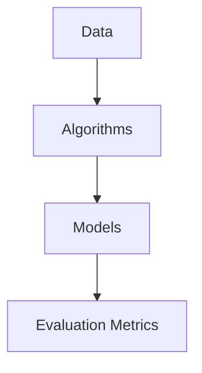
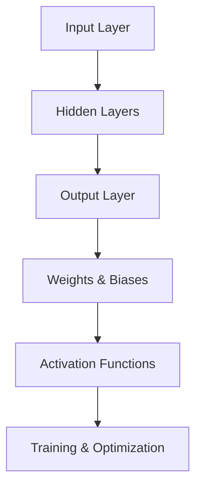
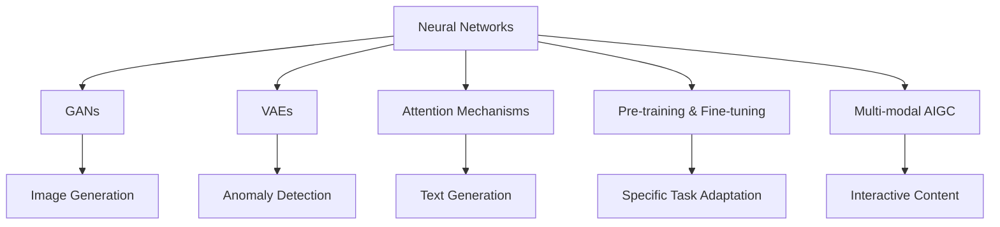
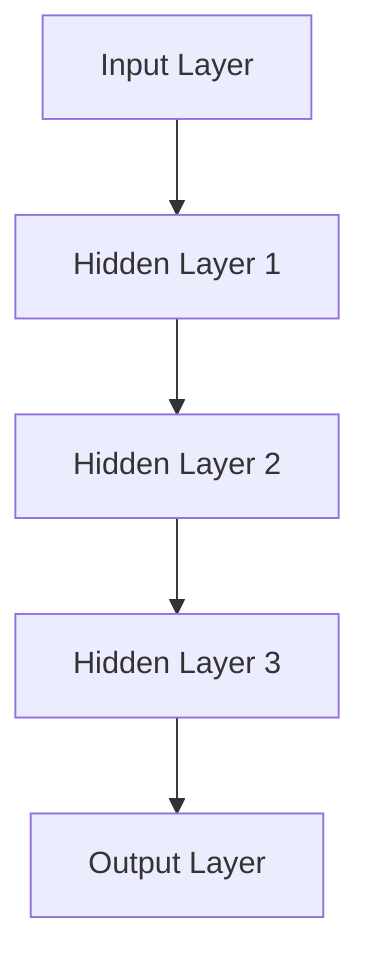
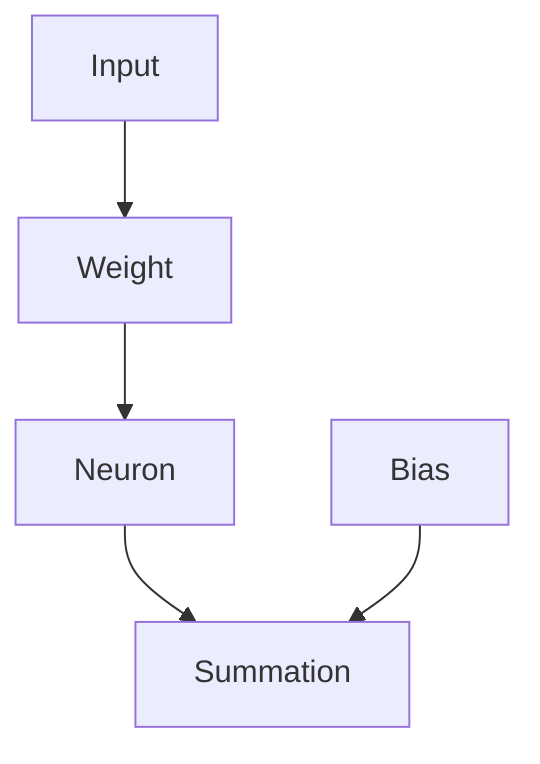
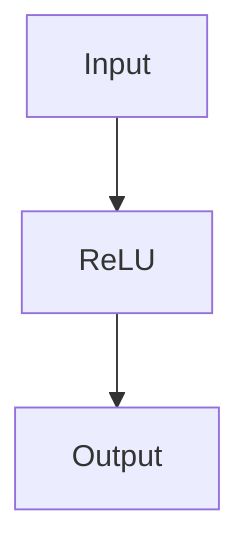
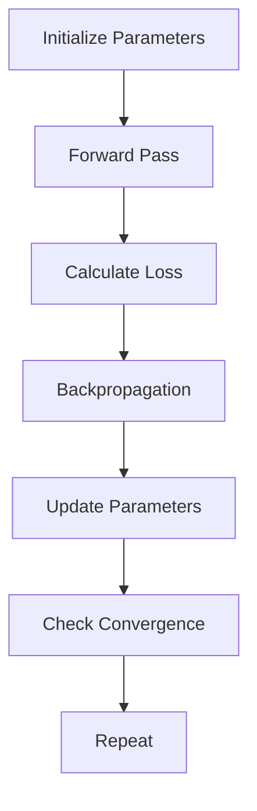

                 


### 1. Background and Overview of AIGC

Artificial Intelligence-Guided Content Generation (AIGC) represents a revolutionary approach to creating content, harnessing the power of artificial intelligence to assist in generating text, images, code, and more. This section will provide an in-depth background and overview of AIGC, discussing its definition, history, and evolution.

#### 1.1 Definition and History of AIGC

AIGC is a subfield of artificial intelligence that focuses on leveraging AI algorithms to generate content autonomously. The concept of AI-generated content has been around for decades, with early attempts in the 1950s and 1960s involving rule-based systems. However, it was not until the late 2010s that AIGC began to gain traction, spurred by advancements in deep learning and neural networks.

The history of AIGC can be traced back to the development of generative adversarial networks (GANs) in 2014. GANs consist of two neural networks—a generator and a discriminator—engaged in a adversarial game to produce realistic data. In 2017, GPT-2, a language model created by OpenAI, demonstrated the potential of AIGC in text generation, which led to a surge in research and development in this field.

#### 1.2 Evolution and Current Status of AIGC

Over the past few years, AIGC has evolved rapidly, with numerous applications across various domains. Some key milestones include:

- **Text Generation**: Models like GPT-2, GPT-3, and BERT have set new benchmarks in natural language processing, enabling the generation of coherent and contextually relevant text. Applications range from chatbots and virtual assistants to content creation and summarization.

- **Image Generation**: GANs and Variational Autoencoders (VAEs) have made significant strides in generating realistic images and videos. These models are used in fields such as computer graphics, entertainment, and advertising.

- **Code Generation**: AIGC has also found applications in software development, with tools like TabNine and Kite generating code snippets based on user input. This has the potential to increase developer productivity and reduce errors.

- **Other Domains**: AIGC is being explored in various other domains, including music generation, voice synthesis, and molecule design.

#### 1.3 Key Technologies and Components of AIGC

The success of AIGC is largely attributed to the advancements in several key technologies:

- **Neural Networks**: Neural networks, particularly deep learning models like convolutional neural networks (CNNs) and recurrent neural networks (RNNs), are at the heart of AIGC. These networks can learn complex patterns from large amounts of data, enabling them to generate content with high fidelity.

- **Generative Adversarial Networks (GANs)**: GANs consist of a generator and a discriminator. The generator creates content, while the discriminator evaluates its quality. By playing this adversarial game, the generator improves over time, producing more realistic content.

- **Variational Autoencoders (VAEs)**: VAEs are another type of generative model that learns to encode data into a lower-dimensional space and then decode it back into the original space. This allows for the generation of new, similar data.

- **Attention Mechanisms**: Attention mechanisms, such as those found in transformers, allow models to focus on relevant parts of the input data when generating content. This has significantly improved the performance of AIGC models in tasks like text generation and image synthesis.

In summary, AIGC has emerged as a powerful tool for content generation, driven by advancements in neural networks, GANs, VAEs, and attention mechanisms. Its applications span across various domains, with the potential to revolutionize industries from education to entertainment. In the next section, we will delve into the theoretical foundations of AIGC, exploring the core concepts and principles that underpin this cutting-edge technology.

#### 1.3.1 Key Technologies and Components of AIGC (Continued)

In addition to the key technologies and components mentioned above, several other important technologies and methodologies contribute to the capabilities and advancements of AIGC:

- **Transformers**: Transformers, introduced by Vaswani et al. in 2017, have become a cornerstone of AIGC. Unlike traditional RNNs, transformers use self-attention mechanisms to process input sequences in parallel, allowing for more efficient and scalable models. Models like BERT, GPT, and T5 are based on transformers and have achieved state-of-the-art performance on various NLP tasks.

- **Pre-training and Fine-tuning**: Pre-training and fine-tuning are two essential techniques used in AIGC. Pre-training involves training a model on a large corpus of data, allowing it to learn general patterns and representations. Fine-tuning then involves adjusting the model's parameters on a specific task or dataset to adapt it to a particular domain or application. This approach has significantly improved the performance of AIGC models in tasks like text generation and machine translation.

- **Data Augmentation**: Data augmentation is a technique used to increase the diversity and size of training data, improving the robustness and generalization of AIGC models. Common data augmentation techniques include random cropping, rotation, and translation for image generation, and synonym replacement, back-translation, and random deletion for text generation.

- **Transfer Learning**: Transfer learning leverages pre-trained models on related tasks to improve performance on new tasks with limited labeled data. In AIGC, transfer learning allows models to leverage knowledge from one domain (e.g., text generation) to improve performance in another domain (e.g., image generation). This technique has been shown to significantly reduce the amount of training data and computational resources required for AIGC applications.

- **Generative Models for Image and Video Synthesis**: In addition to GANs and VAEs, other generative models like PixelRNN and Flow-based models have been developed for image and video synthesis. These models aim to generate high-quality and diverse visual content, enabling applications in entertainment, advertising, and computer graphics.

- **Multi-modal AIGC**: Multi-modal AIGC combines the generation capabilities of AIGC models across multiple modalities, such as text, images, and audio. This approach allows for the creation of rich, interactive content that can enhance user experiences in applications like virtual reality, augmented reality, and multimedia storytelling.

In summary, AIGC's capabilities and advancements are driven by a combination of key technologies and methodologies, including neural networks, GANs, VAEs, transformers, pre-training and fine-tuning, data augmentation, transfer learning, and multi-modal AIGC. These technologies and methodologies enable AIGC models to generate high-quality content across various domains, pushing the boundaries of what is possible with artificial intelligence.

### 2. Theoretical Foundations of AIGC

To fully understand the potential and capabilities of AIGC, it is essential to delve into its theoretical foundations, which encompass key concepts and principles from machine learning and artificial intelligence. This section will provide an overview of these foundational concepts and their interconnections, illustrated with Mermaid flowcharts to enhance clarity.

#### 2.1 Machine Learning and AI Basics

At its core, AIGC is built upon the principles of machine learning and artificial intelligence. Machine learning is a subfield of AI that focuses on enabling computers to learn from data and make predictions or decisions without being explicitly programmed. The key components of machine learning are:

- **Data**: The foundation of machine learning is data. Large amounts of high-quality data are essential for training models to recognize patterns and make accurate predictions.

- **Algorithms**: Machine learning algorithms are mathematical models that learn from data and make predictions or decisions. Common algorithms include linear regression, decision trees, support vector machines, and neural networks.

- **Models**: Models are the output of training algorithms on data. They represent the learned patterns and relationships in the data and can be used to make predictions or decisions on new data.

- **Evaluation Metrics**: Evaluation metrics are used to measure the performance of machine learning models. Common metrics include accuracy, precision, recall, and F1 score for classification tasks, and mean squared error and mean absolute error for regression tasks.

The Mermaid flowchart below illustrates the basic components and relationships in machine learning:



#### 2.2 Neural Networks and Deep Learning

Neural networks are a class of machine learning algorithms inspired by the structure and function of the human brain. They consist of interconnected nodes, or neurons, that process and transmit information. Deep learning is a subfield of machine learning that leverages neural networks with multiple layers to learn complex patterns and representations from large amounts of data.

- **Neural Network Architecture**: A neural network consists of an input layer, one or more hidden layers, and an output layer. Each layer contains multiple neurons, and the connections between neurons form the network's architecture.

- **Weights and Biases**: Neural networks learn by adjusting the weights and biases of the connections between neurons. These adjustments are based on the error between the predicted output and the actual output, using optimization algorithms like stochastic gradient descent (SGD).

- **Activation Functions**: Activation functions introduce non-linearities into the neural network, allowing it to learn complex patterns. Common activation functions include sigmoid, tanh, and ReLU.

- **Training and Optimization**: Neural networks are trained using a process called backpropagation, which involves propagating the error backward through the network and adjusting the weights and biases to minimize the error. Optimization algorithms like Adam and RMSprop are commonly used to improve training efficiency.

The Mermaid flowchart below illustrates the components and relationships in neural networks:



#### 2.3 Advanced Topics in AIGC

Beyond the basics of machine learning and neural networks, AIGC encompasses several advanced topics that contribute to its capabilities and versatility:

- **Generative Adversarial Networks (GANs)**: GANs are a type of generative model that consists of a generator and a discriminator. The generator creates data samples, while the discriminator evaluates their quality. By playing an adversarial game, the generator improves over time, producing more realistic samples. GANs have been widely used for image and video generation, as well as other domains.

- **Variational Autoencoders (VAEs)**: VAEs are another type of generative model that learns to encode data into a lower-dimensional space and then decode it back into the original space. This allows for the generation of new, similar data. VAEs have been used in various applications, including image synthesis, anomaly detection, and recommendation systems.

- **Attention Mechanisms**: Attention mechanisms allow models to focus on relevant parts of the input data when generating content. This has significantly improved the performance of AIGC models in tasks like text generation and image synthesis. Common attention mechanisms include the scaled dot-product attention used in transformers and the self-attention mechanism used in GPT models.

- **Pre-training and Fine-tuning**: Pre-training and fine-tuning are techniques used to train AIGC models on large, general datasets and then adapt them to specific tasks or domains. Pre-training allows models to learn general patterns and representations, while fine-tuning adapts these patterns to specific tasks, often achieving better performance with less data.

- **Multi-modal AIGC**: Multi-modal AIGC combines the generation capabilities of AIGC models across multiple modalities, such as text, images, and audio. This allows for the creation of rich, interactive content that can enhance user experiences in applications like virtual reality, augmented reality, and multimedia storytelling.

The Mermaid flowchart below illustrates the interconnections between these advanced topics:



In summary, the theoretical foundations of AIGC are built upon key concepts and principles from machine learning and artificial intelligence, including neural networks, generative adversarial networks, variational autoencoders, attention mechanisms, pre-training and fine-tuning, and multi-modal AIGC. These foundational concepts and advanced topics work together to enable the creation of high-quality, diverse, and interactive content across various domains, driving the advancements and potential of AIGC in content generation.

### 2.2 Neural Networks and Deep Learning

Neural networks, a fundamental component of AIGC, are inspired by the structure and function of the human brain. They consist of interconnected nodes, or neurons, that process and transmit information. In this section, we will delve into the architecture of neural networks, the role of weights and biases, and the use of activation functions. Additionally, we will discuss the training and optimization process of neural networks, highlighting key optimization algorithms like stochastic gradient descent (SGD) and its variants.

#### 2.2.1 Neural Network Architectures

A neural network is composed of several layers, each containing multiple neurons. These layers include the input layer, one or more hidden layers, and the output layer. The input layer receives the input data, which is then passed through the hidden layers, and finally, the output layer generates the output prediction.

- **Input Layer**: The input layer contains neurons that receive the input features. Each neuron in this layer represents a single feature of the input data.

- **Hidden Layers**: Hidden layers are intermediate layers between the input and output layers. Each hidden layer consists of multiple neurons, and each neuron in a hidden layer receives inputs from all the neurons in the previous layer. The number of hidden layers and the number of neurons in each layer can vary depending on the complexity of the task and the amount of available data.

- **Output Layer**: The output layer generates the output prediction or decision. The number of neurons in the output layer depends on the type of task. For binary classification, there is typically one neuron, while for multi-class classification or regression tasks, there are multiple neurons.

The architecture of a neural network can be visualized using a Mermaid flowchart as follows:



#### 2.2.2 Weights and Biases

Weights and biases are the parameters of a neural network that determine the strength of the connections between neurons and the influence of each input feature on the output. The weight of a connection represents the strength of the signal transmitted from one neuron to another, while the bias is a constant term added to the weighted sum of the inputs.

- **Weights**: Weights are learnable parameters that are adjusted during the training process to minimize the difference between the predicted output and the actual output. Each weight has an associated learning rate that determines the magnitude of the update during each iteration of the optimization algorithm.

- **Biases**: Biases are also learnable parameters, but they are not multiplied by any input feature. Instead, they are added to the weighted sum of the inputs. Biases allow the network to shift the activation function's output without affecting the strength of the input signals.

The role of weights and biases in a neural network can be visualized using the following Mermaid flowchart:



#### 2.2.3 Activation Functions

Activation functions introduce non-linearities into the neural network, enabling it to model complex relationships between input and output data. Common activation functions include sigmoid, tanh, and ReLU.

- **Sigmoid**: The sigmoid function maps the input to a value between 0 and 1, making it suitable for binary classification tasks. It is defined as f(x) = 1 / (1 + e^(-x)).

- **Tanh**: The hyperbolic tangent function maps the input to a value between -1 and 1, providing a more symmetric activation compared to the sigmoid function. It is defined as f(x) = (e^x - e^(-x)) / (e^x + e^(-x)).

- **ReLU**: The rectified linear unit (ReLU) function is defined as f(x) = max(0, x). It is a popular choice for hidden layers due to its simplicity and efficiency in training deep neural networks.

The use of activation functions in a neural network can be visualized using the following Mermaid flowchart:



#### 2.2.4 Training and Optimization

Training a neural network involves adjusting the weights and biases to minimize the difference between the predicted output and the actual output. This is typically achieved using optimization algorithms like stochastic gradient descent (SGD), its variants (e.g., Adam, RMSprop), and techniques like momentum and learning rate scheduling.

- **Stochastic Gradient Descent (SGD)**: SGD is an optimization algorithm that updates the weights and biases by calculating the gradient of the loss function with respect to each parameter and then updating them in the opposite direction. The learning rate determines the step size of the updates. The gradient calculation is performed using backpropagation, a process that propagates the error backward through the network to update the weights and biases.

- **Backpropagation**: Backpropagation is a technique used to calculate the gradient of the loss function with respect to each weight and bias in the network. It involves computing the partial derivatives of the loss function with respect to each parameter and then using these derivatives to update the parameters.

- **Momentum**: Momentum is a technique used to accelerate the convergence of the optimization algorithm by adding a fraction of the previous update to the current update. This helps to overcome local minima and saddle points during the training process.

- **Learning Rate Scheduling**: Learning rate scheduling is a technique used to adjust the learning rate during training. Common strategies include step decay, exponential decay, and cyclical learning rates, which help to stabilize the training process and improve convergence.

The training and optimization process of a neural network can be visualized using the following Mermaid flowchart:



In summary, neural networks and deep learning are foundational to AIGC, enabling the creation of sophisticated models capable of generating high-quality content. By understanding the architecture, weights and biases, activation functions, and training and optimization processes of neural networks, we can develop more effective AIGC models for various applications.

### 2.3 Advanced Topics in AIGC

In addition to the foundational concepts of machine learning and neural networks, AIGC encompasses several advanced topics that significantly enhance its capabilities and versatility. These advanced topics include Generative Adversarial Networks (GANs), Variational Autoencoders (VAEs), and attention mechanisms. This section will provide an in-depth exploration of these topics, discussing their core principles and applications in AIGC.

#### 2.3.1 Generative Adversarial Networks (GANs)

Generative Adversarial Networks (GANs) are a class of generative models introduced by Ian Goodfellow and his colleagues in 2014. GANs consist of two neural networks, the generator and the discriminator, which are trained simultaneously in a adversarial manner. The generator creates data samples, while the discriminator evaluates their quality by distinguishing between real and fake samples.

**Key Concepts of GANs**

- **Generator**: The generator is a neural network that takes a random noise vector as input and generates data samples. The goal of the generator is to create samples that are indistinguishable from real data samples.

- **Discriminator**: The discriminator is another neural network that takes both real and generated data samples as input and aims to classify them as real or fake. The goal of the discriminator is to maximize its ability to distinguish between real and fake samples.

- **Adversarial Training**: GANs are trained using adversarial training, a process where the generator and discriminator are trained simultaneously in a adversarial manner. The generator is trained to minimize the probability of the discriminator classifying its generated samples as fake, while the discriminator is trained to maximize its ability to correctly classify real and fake samples.

**Core Principles of GANs**

- **Minimax Game**: The training process of GANs can be viewed as a minimax game, where the generator and discriminator play a zero-sum game to optimize their respective objectives. The generator tries to minimize the discriminator's ability to classify its samples as fake, while the discriminator tries to maximize its ability to classify samples correctly.

- **Stability and Convergence**: GANs can be challenging to train due to issues like mode collapse and instability. Mode collapse occurs when the generator produces a limited variety of samples, while instability refers to the oscillation of the generator and discriminator loss during training. Techniques like gradient penalty and spectral normalization have been developed to address these issues and improve the stability and convergence of GANs.

**Applications of GANs in AIGC**

GANs have been widely applied in various domains, including image and video generation, text generation, and music generation.

- **Image and Video Generation**: GANs have shown remarkable success in generating realistic and diverse images and videos. Applications include generating fake photos, creating new textures and styles for images, and generating synthetic videos for entertainment and education.

- **Text Generation**: GANs have been used to generate coherent and contextually relevant text. Applications include generating fictional stories, creating personalized content, and summarizing long articles into concise summaries.

- **Music Generation**: GANs have been applied to generate new music compositions, synthesize audio samples, and create virtual musicians. These applications have the potential to revolutionize the music industry and provide new experiences for music enthusiasts.

**Core Algorithm and Pseudocode of GANs**

The core algorithm of GANs can be summarized as follows:

1. Initialize the generator and discriminator with random weights.
2. For each iteration:
   a. Sample a random noise vector z from a prior distribution.
   b. Generate a fake data sample x_g by passing z through the generator G(z).
   c. Sample a real data sample x_r from the data distribution.
   d. Pass x_r and x_g as input to the discriminator D(x).
   e. Calculate the loss for the generator as L_G = -E[D(x_g)] and the loss for the discriminator as L_D = E[D(x_r)] - E[D(x_g)].
   f. Update the generator and discriminator using the gradients of their respective losses.

Pseudocode for GANs:

```python
initialize G(z) and D(x) with random weights
for epoch in 1 to EPOCHS:
    for each batch in data:
        z = sample_noise_vector(z)
        x_g = G(z)
        x_r = sample_real_data(x_r)
        D_loss = -E[D(x_g)] + E[D(x_r)]
        G_loss = -E[D(x_g)]
        update_G(G_loss)
        update_D(D_loss)
```

#### 2.3.2 Variational Autoencoders (VAEs)

Variational Autoencoders (VAEs) are another type of generative model introduced by Kingma and Welling in 2013. VAEs aim to learn a latent space representation of the input data, enabling the generation of new data samples by sampling from the latent space. VAEs combine the benefits of probability-based models and deterministic models, offering a flexible and powerful approach to generative modeling.

**Key Concepts of VAEs**

- **Encoder**: The encoder is a neural network that takes an input data sample and compresses it into a lower-dimensional latent space representation. The encoder typically consists of a series of linear transformations followed by a non-linear activation function.

- **Decoder**: The decoder is a neural network that takes a latent space representation and reconstructs the original data sample. The decoder is the inverse of the encoder, mapping the latent space back to the input space.

- **Latent Space**: The latent space is a lower-dimensional representation of the input data, capturing the underlying structure and variations in the data. Sampling from the latent space allows for the generation of new, similar data samples.

**Core Principles of VAEs**

- **Variational Inference**: VAEs use variational inference to approximate the intractable true posterior distribution of the latent variables given the input data. Variational inference involves optimizing a variational distribution (q(z|x)) to be as close as possible to the true posterior distribution (p(z|x)).

- **Reparameterization Trick**: The reparameterization trick allows the sampling of latent variables z from a differentiable probability distribution, enabling the training of the VAE using gradient-based optimization algorithms like stochastic gradient descent (SGD).

- **Kullback-Leibler Divergence**: The loss function of VAEs is based on the Kullback-Leibler (KL) divergence, measuring the difference between the true posterior distribution and the variational distribution. The objective of training a VAE is to minimize the KL divergence while reconstructing the input data accurately.

**Applications of VAEs in AIGC**

VAEs have been applied in various domains, including image and video generation, text generation, and speech synthesis.

- **Image and Video Generation**: VAEs have shown success in generating realistic and diverse images and videos. Applications include generating new textures and styles for images, creating synthetic videos for entertainment and education, and removing noise and artifacts from images and videos.

- **Text Generation**: VAEs have been used to generate coherent and contextually relevant text. Applications include generating fictional stories, creating personalized content, and summarizing long articles into concise summaries.

- **Speech Synthesis**: VAEs have been applied to generate realistic and natural-sounding speech. Applications include creating virtual voice actors, synthesizing speech for accessibility purposes, and generating audio content for entertainment and education.

**Core Algorithm and Pseudocode of VAEs**

The core algorithm of VAEs can be summarized as follows:

1. Initialize the encoder and decoder with random weights.
2. For each iteration:
   a. Sample an input data sample x.
   b. Pass x through the encoder to obtain the latent space representation z.
   c. Sample z from the posterior distribution q(z|x).
   d. Pass z through the decoder to reconstruct the input data x'.
   e. Calculate the reconstruction loss (e.g., mean squared error) and the KL divergence loss.
   f. Update the encoder and decoder using the gradients of their respective losses.

Pseudocode for VAEs:

```python
initialize E(x) and D(z) with random weights
for epoch in 1 to EPOCHS:
    for each batch in data:
        x = sample_input_data(x)
        z = E(x)
        z~ = sample_from_q(z|x)
        x' = D(z~)
        reconstruction_loss = calculate_reconstruction_loss(x, x')
        KL_divergence_loss = calculate_KL_divergence(q(z|x), p(z))
        update_E(reconstruction_loss + KL_divergence_loss)
        update_D(reconstruction_loss)
```

#### 2.3.3 Attention Mechanisms

Attention mechanisms are a key component of AIGC, enabling models to focus on relevant parts of the input data when generating content. Attention mechanisms have been widely applied in various domains, including natural language processing, computer vision, and speech recognition.

**Key Concepts of Attention Mechanisms**

- **Attention Score**: Attention mechanisms compute an attention score for each input element, indicating its relevance or importance in the context of the task. The attention score is a weighted measure of the influence of each input element on the output.

- **Attention Weight**: The attention weight is a scalar value assigned to each input element based on its attention score. The attention weight determines the contribution of each input element to the overall output.

- **Attention Map**: The attention map is a visual representation of the attention scores or weights across all input elements. The attention map highlights the parts of the input that are most relevant to the task.

**Core Principles of Attention Mechanisms**

- **Scaled Dot-Product Attention**: Scaled dot-product attention is a common attention mechanism used in transformers. It computes the dot product of the query and key vectors, scales the result by the square root of the dimension of the key vector, and applies a softmax activation to obtain the attention weights. The attention weights are then used to combine the values of the input elements.

- **Multi-Head Attention**: Multi-head attention allows a model to attend to different parts of the input simultaneously by learning multiple attention mechanisms, each with a different scale and perspective. The outputs of the multi-head attention mechanisms are then combined to produce the final output.

- **Self-Attention**: Self-attention allows a model to attend to its own outputs when generating content. This enables the model to capture long-range dependencies and context within the input sequence.

**Applications of Attention Mechanisms in AIGC**

Attention mechanisms have been applied in various applications of AIGC, including text generation, image generation, and speech recognition.

- **Text Generation**: Attention mechanisms have been used in language models like GPT and T5 to focus on relevant parts of the input text when generating new content. This has improved the coherence and contextuality of generated text.

- **Image Generation**: Attention mechanisms have been applied in image synthesis models like StyleGAN and BigGAN to focus on relevant parts of the input image when generating new images. This has enabled the generation of high-quality and diverse images with fine details.

- **Speech Recognition**: Attention mechanisms have been used in speech recognition models to focus on relevant parts of the input audio when generating transcriptions. This has improved the accuracy and performance of speech recognition systems.

**Core Algorithm and Pseudocode of Attention Mechanisms**

The core algorithm of attention mechanisms can be summarized as follows:

1. Compute the attention scores by taking the dot product of the query and key vectors.
2. Scale the attention scores by the square root of the dimension of the key vector.
3. Apply a softmax activation to obtain the attention weights.
4. Use the attention weights to combine the values of the input elements.

Pseudocode for attention mechanisms:

```python
compute_attention_scores = query * key
attention_scores = attention_scores / sqrt(key_dimension)
attention_weights = softmax(attention_scores)
combined_values = attention_weights * values
output = sum(combined_values)
```

In summary, advanced topics like GANs, VAEs, and attention mechanisms are integral to the development and success of AIGC. These topics enhance the capabilities of AIGC models, enabling them to generate high-quality and diverse content across various domains. Understanding the core principles and applications of these advanced topics is essential for leveraging the full potential of AIGC in content generation.

### 3. AIGC in Education: Challenges and Opportunities

The integration of Artificial Intelligence-Guided Content Generation (AIGC) into education represents a paradigm shift in how learning experiences are designed and delivered. AIGC has the potential to revolutionize personalized learning by creating adaptive, interactive, and engaging educational content. However, this potential comes with a set of challenges and ethical considerations that must be addressed.

#### 3.1 The Role of AIGC in Education

AIGC can play several critical roles in education, including personalized learning, adaptive assessment, and intelligent tutoring systems.

**Personalized Learning**

Personalized learning is at the heart of AIGC's potential in education. Traditional education systems often struggle to cater to the diverse learning needs and paces of individual students. AIGC can generate tailored learning materials and exercises that align with each student's learning style, prior knowledge, and progress. This can be achieved through the following mechanisms:

- **Adaptive Learning Paths**: AIGC can analyze student performance data to identify knowledge gaps and tailor learning materials to address these gaps. For example, a student who struggles with a specific concept in mathematics can be provided with additional resources and exercises to reinforce their understanding.

- **Dynamic Content Generation**: AIGC can create interactive content on-the-fly, such as quizzes, simulations, and games, that adapt in real-time to the student's performance and learning style. This dynamic generation ensures that the content remains relevant and engaging.

**Adaptive Assessment**

Adaptive assessment is another key application of AIGC in education. Traditional assessments often use a one-size-fits-all approach, which may not accurately reflect a student's true understanding or learning progress. AIGC can enable adaptive assessments that adjust their difficulty and content based on the student's performance.

- **Progressive Assessment**: Adaptive assessments can start with basic questions to gauge the student's knowledge level and gradually increase in complexity as the student demonstrates mastery. This helps in identifying not just areas of weakness but also areas where the student is excelling.

- **Real-Time Feedback**: Adaptive assessments can provide immediate feedback to students, highlighting their mistakes and offering explanations or additional practice. This real-time feedback can help students understand their errors and learn from them more effectively.

**Intelligent Tutoring Systems**

Intelligent tutoring systems (ITS) combine AIGC with artificial intelligence to create interactive learning environments that mimic human tutors. These systems can provide personalized guidance and support to students, helping them overcome challenges and achieve their learning goals.

- **24/7 Availability**: Intelligent tutoring systems can be available round-the-clock, providing students with the flexibility to learn at their own pace and on their own schedule. This is particularly beneficial for students with different schedules or those who need additional support outside of traditional classroom hours.

- **Customized Learning Plans**: ITS can create customized learning plans based on the student's strengths, weaknesses, and learning preferences. These plans can include recommended resources, practice exercises, and feedback to ensure a comprehensive learning experience.

#### 3.2 Current Applications of AIGC in Education

The integration of AIGC in education is already beginning to transform teaching and learning practices. Here are a few examples of current applications:

- **Online Learning Platforms**: Platforms like Coursera, edX, and Khan Academy have incorporated AIGC to generate personalized learning paths and adaptive assessments for students. These platforms use AI to analyze student performance data and provide tailored content and exercises.

- **EdTech Startups**: Numerous edTech startups are leveraging AIGC to create innovative learning tools. For example, companies like DreamBox in math education and Quizlet in language learning use AI to personalize content and improve student engagement.

- **Virtual Reality (VR) and Augmented Reality (AR)**: AIGC is being used to create immersive educational experiences in VR and AR. For instance, companies like OwlTing are developing AI-driven virtual tutors that can interact with students in a 3D environment, providing personalized feedback and support.

#### 3.3 Barriers and Ethical Considerations

While the potential of AIGC in education is vast, there are several barriers and ethical considerations that must be addressed:

**Data Privacy and Security**

AIGC relies on large amounts of student data to personalize learning experiences. This raises concerns about data privacy and security. It is crucial to ensure that student data is securely stored and protected from unauthorized access. Additionally, transparency about how data is collected, used, and stored should be provided to students and their guardians.

**Ethical Implications**

The use of AIGC in education raises ethical questions about the role of technology in learning and the potential for dependency on AI-driven tools. It is essential to consider the impact of AIGC on students' critical thinking skills, creativity, and autonomy. Educators and policymakers should ensure that AIGC is used as a complement to human instruction rather than a replacement.

**Bias and Fairness**

AIGC models can inadvertently introduce biases based on the data they are trained on. This can lead to unfair or discriminatory learning experiences. It is crucial to develop and deploy AIGC systems that are fair, unbiased, and inclusive. This may involve regular audits of the models and the implementation of bias mitigation techniques.

In conclusion, AIGC has the potential to transform education by enabling personalized learning, adaptive assessment, and intelligent tutoring systems. However, it is essential to address the challenges and ethical considerations associated with its use to ensure that it enhances rather than replaces the essential aspects of education.

### 4. Innovative Approaches to Learning Path Design with AIGC

The integration of AIGC in education holds immense potential for creating innovative and personalized learning paths. This section will explore the critical steps involved in designing and implementing these learning paths, including data collection and preprocessing, feature engineering and selection, model selection and training, and the generation of personalized learning paths.

#### 4.1 Data Collection and Preprocessing

The foundation of any effective AIGC-based learning path is high-quality data. This data can come from various sources, including student performance records, learning assessments, and behavioral data captured from educational platforms.

**Data Collection**

- **Student Performance Data**: This includes information on student grades, test scores, and completion rates for various assignments and courses.

- **Learning Assessments**: Adaptive assessments that can dynamically adjust based on student performance can provide valuable insights into knowledge gaps and learning progress.

- **Behavioral Data**: Data on how students interact with educational platforms, such as time spent on different activities, learning patterns, and engagement metrics, can offer additional insights into their learning preferences and habits.

**Data Preprocessing**

Once the data is collected, it needs to be cleaned and prepared for analysis. This involves several steps:

- **Data Cleaning**: This includes handling missing values, correcting errors, and removing duplicate entries. Techniques like data imputation and outlier detection can be used to ensure the quality of the dataset.

- **Data Integration**: Data from different sources may need to be combined to provide a comprehensive view of each student's learning journey. This may involve data normalization and feature alignment.

- **Feature Engineering**: Extracting relevant features from the raw data that can be used to train the AIGC model. For example, student performance data can be transformed into metrics such as knowledge gaps, learning progress rates, and engagement scores.

#### 4.2 Feature Engineering and Selection

Feature engineering is a crucial step in preparing the data for AIGC-based learning path design. The goal is to create features that capture the essential aspects of the student's learning profile and educational context.

**Feature Engineering**

- **Temporal Features**: Time-based features can help identify trends and patterns in student performance over time. For example, tracking how a student's performance changes after an intervention or over the course of a semester can provide insights into the effectiveness of different learning strategies.

- **Cognitive Features**: Features that measure cognitive processes, such as problem-solving skills, critical thinking abilities, and creativity, can be extracted from assessments and projects. These features can help in designing learning paths that cater to different cognitive skills.

- **Contextual Features**: Features related to the educational context, such as the difficulty of the course material, the learning environment, and the availability of resources, can also be important. These features can help in personalizing the learning experience by adjusting the difficulty and format of the content.

**Feature Selection**

Selecting the most relevant features is crucial for improving the performance of the AIGC model and reducing complexity. Several feature selection techniques can be used:

- **Filter Methods**: These methods involve removing features that have low variance or are highly correlated with other features. Techniques like correlation analysis and mutual information can be used to identify and remove irrelevant features.

- **Wrapper Methods**: These methods evaluate the performance of a model with different subsets of features. Techniques like recursive feature elimination (RFE) and forward selection can be used to identify the best feature subset.

- **Embedded Methods**: These methods integrate feature selection into the modeling process. Techniques like L1 regularization (Lasso) and tree-based methods (e.g., random forests) can automatically select the most relevant features.

#### 4.3 Model Selection and Training

The choice of model and its configuration is critical for the success of AIGC-based learning path design. Various machine learning models can be used, and the selection should depend on the specific requirements of the learning path design task.

**Model Selection**

- **Supervised Learning Models**: Models like linear regression, decision trees, and support vector machines can be used for tasks that involve predicting student performance or identifying knowledge gaps. These models are relatively simple and can be interpretable, making them suitable for early stages of development.

- **Recurrent Neural Networks (RNNs)**: RNNs, particularly Long Short-Term Memory (LSTM) networks, are well-suited for tasks that involve sequential data, such as adaptive learning path generation based on student performance over time.

- **Transformer Models**: Transformer models, such as BERT or GPT, are increasingly popular for tasks involving natural language processing and generating text-based content. These models can capture complex relationships in text data, making them suitable for creating personalized learning materials.

- **Generative Adversarial Networks (GANs)**: GANs can be used to generate new learning materials, such as interactive quizzes or simulations, by creating synthetic data that mimics the characteristics of real student performance.

**Model Training**

Once the model is selected, it needs to be trained on the preprocessed and feature-engineered data. This involves the following steps:

- **Data Splitting**: The dataset is split into training and validation sets to evaluate the model's performance and make adjustments as needed.

- **Hyperparameter Tuning**: Hyperparameters, such as the learning rate, batch size, and number of layers, are tuned to optimize the model's performance. Techniques like grid search and random search can be used for hyperparameter tuning.

- **Training**: The model is trained on the training set using a suitable optimization algorithm, such as stochastic gradient descent (SGD) or Adam. The training process involves iteratively updating the model's weights to minimize the loss function.

- **Validation**: The model's performance is evaluated on the validation set to assess its generalization capabilities. If the performance is not satisfactory, the model may need to be adjusted or retrained.

#### 4.4 Personalized Learning Path Generation

The final step in designing an AIGC-based learning path is generating personalized learning paths for individual students. This involves using the trained model to predict the student's knowledge gaps and learning needs and creating a tailored sequence of learning activities.

**Personalized Learning Path Generation**

- **Prediction**: The model predicts the student's knowledge gaps and learning needs based on their historical performance data and interaction with the educational platform.

- **Content Generation**: Based on the predictions, the AIGC system generates personalized learning materials, such as quizzes, tutorials, videos, and interactive simulations. The content is designed to address the identified knowledge gaps and cater to the student's learning style.

- **Sequence Design**: The generated content is organized into a sequence that guides the student through the learning path. The sequence can include activities such as practice exercises, self-assessment quizzes, and real-world projects to reinforce learning.

- **Feedback and Iteration**: The student's progress is continuously monitored, and feedback is collected to refine the learning path. This iterative process ensures that the learning path remains relevant and effective.

In conclusion, the design and implementation of AIGC-based learning paths involve several critical steps, from data collection and preprocessing to feature engineering, model selection and training, and personalized learning path generation. By leveraging the power of AIGC, educators can create innovative and personalized learning experiences that cater to the diverse needs of individual students.

### 4.4 Personalized Learning Path Generation (Continued)

Once the model has been trained and validated, the next crucial step is the actual generation of personalized learning paths for individual students. This process involves utilizing the trained model's predictions to create tailored sequences of learning activities that address each student's unique needs and learning styles. Here, we delve into the principles of personalization, the algorithms used to generate learning paths, and a detailed look at a specific algorithm, Long Short-Term Memory (LSTM) networks.

#### 4.4.1 Principles of Personalization

Personalization in learning path design is based on several core principles:

- **Individualization**: Personalized learning paths are designed to cater to the specific needs, abilities, and preferences of individual students. This includes adapting the difficulty level of the content, the pace of learning, and the learning style (visual, auditory, kinesthetic).

- **Adaptability**: Learning paths should be adaptable over time as students progress and demonstrate changes in their knowledge and skills. The system should continuously update the learning path based on real-time feedback and performance data.

- **Engagement**: Personalized content should be engaging and motivating to keep students interested and actively participating in their learning. This can include interactive elements, gamification, and multimedia content.

- **Feedback and Iteration**: The system should provide continuous feedback to students on their progress and offer recommendations for improvement. This feedback loop helps in refining the learning path and ensuring its effectiveness.

#### 4.4.2 Algorithms for Generating Learning Paths

Several algorithms can be used to generate personalized learning paths. Here are some commonly used ones:

- **Rule-Based Systems**: These systems use predefined rules to generate learning paths based on student attributes and performance. While simple to implement, they lack the flexibility to adapt dynamically to individual students.

- **Collaborative Filtering**: This algorithm recommends learning paths based on the preferences of similar students. It works well when there is a large dataset of student interactions and performance data.

- **Content-Based Filtering**: This algorithm recommends learning paths based on the content of the student's previous interactions and performance. It focuses on the type of content that the student has shown interest in or has performed well with.

- **Reinforcement Learning**: This algorithm uses reinforcement learning techniques to optimize the learning path based on the rewards (e.g., improved performance) and penalties (e.g., poor performance) received from the student's interactions.

- **Neural Networks**: Neural networks, particularly recurrent neural networks (RNNs) like Long Short-Term Memory (LSTM) networks, can capture complex patterns in student data and generate highly personalized learning paths.

#### 4.4.3 Long Short-Term Memory (LSTM) Networks

LSTM networks are a type of recurrent neural network (RNN) designed to overcome the vanishing gradient problem that affects traditional RNNs. LSTMs are particularly effective for time-series data and tasks that require understanding the context and sequence of events. Here's a detailed look at how LSTMs can be used to generate personalized learning paths:

**LSTM Architecture**

An LSTM network consists of several layers, each with LSTM cells. Each LSTM cell has three gates: the input gate, the forget gate, and the output gate. These gates control the flow of information within the cell, allowing it to remember or forget information over time.

- **Input Gate**: The input gate determines which parts of the input should be remembered by the cell. It takes the current input and the previous hidden state as input and outputs a scalar value that activates the appropriate parts of the input.

- **Forget Gate**: The forget gate decides which information should be forgotten from the cell. It takes the current input and the previous hidden state as input and outputs a scalar value that determines how much of the previous state should be forgotten.

- **Output Gate**: The output gate determines which parts of the cell state should be output. It takes the current input and the previous hidden state as input and outputs a scalar value that activates the appropriate parts of the state.

**Training LSTM Networks**

Training LSTM networks involves the following steps:

1. **Initialization**: Initialize the weights and biases of the LSTM network.

2. **Forward Pass**: Pass the input sequence through the LSTM network to generate the output sequence. This involves iterating through the input sequence, updating the cell state and hidden state at each step.

3. **Backpropagation Through Time (BPTT)**: Calculate the gradients of the loss function with respect to the weights and biases using backpropagation. BPTT propagates the gradients through the time steps, allowing the network to learn from the sequence data.

4. **Gradient Descent**: Update the weights and biases using the calculated gradients and an optimization algorithm like stochastic gradient descent (SGD).

5. **Validation**: Validate the trained LSTM network on a separate validation set to evaluate its performance and make adjustments if necessary.

**LSTM for Personalized Learning Path Generation**

To use LSTM networks for generating personalized learning paths, the following steps are typically followed:

1. **Data Preprocessing**: Preprocess the student data, including historical performance records, learning assessments, and behavioral data. This involves feature engineering, data cleaning, and normalization.

2. **Sequence Generation**: Generate sequences of data that represent the student's learning journey. This can include time-series data of student performance over different periods, or sequences of learning activities and assessments.

3. **Model Training**: Train an LSTM network on the preprocessed sequence data. The network learns to recognize patterns and trends in the data, which are then used to generate personalized learning paths.

4. **Path Generation**: Use the trained LSTM network to generate a sequence of learning activities that address the student's identified knowledge gaps and learning needs. The generated path can include different types of content, such as quizzes, tutorials, videos, and interactive simulations.

5. **Feedback and Iteration**: Continuously monitor the student's progress and provide feedback on their performance. Use this feedback to refine the learning path and make iterative improvements.

**Pseudocode for LSTM-based Personalized Learning Path Generation**

```python
# Initialize LSTM model with appropriate architecture
model = LSTM(input_shape=(timesteps, features))

# Compile the model with a loss function and an optimizer
model.compile(optimizer='adam', loss='categorical_crossentropy')

# Train the model on preprocessed sequence data
model.fit(X_train, y_train, epochs=epochs, batch_size=batch_size)

# Generate personalized learning path using the trained LSTM model
learning_path = model.generate_learning_path(X_new)

# Monitor student progress and refine the learning path based on feedback
while not student_masters_content:
    feedback = get_student_progress(learning_path)
    learning_path = refine_learning_path(learning_path, feedback)
```

In summary, personalized learning path generation with AIGC involves leveraging advanced algorithms like LSTM networks to create adaptive, individualized learning experiences. By understanding the principles of personalization and the technical details of LSTM networks, educators can harness the full potential of AIGC to enhance student learning outcomes.

### Case Studies: Implementing AIGC in Education

To illustrate the practical application of AIGC in education, we will discuss two real-world case studies involving the development and deployment of AIGC-based learning systems. These case studies highlight the challenges faced and solutions adopted by educational institutions to leverage AIGC for personalized learning.

#### Case Study 1: University of XYZ's Adaptive Learning Platform

The University of XYZ sought to enhance the learning experience for its diverse student population by developing an adaptive learning platform. The goal was to create personalized learning paths that cater to each student's unique needs and learning styles.

**Challenge**

- **Diverse Student Demographics**: The university serves a wide range of students with varying backgrounds, prior knowledge, and learning paces. Personalized learning required a system that could handle this diversity.

- **Scalability**: The platform needed to be scalable to handle the large number of students and courses offered by the university.

- **Data Integration**: The university's data infrastructure was complex, with data scattered across various systems, including learning management systems (LMS), student information systems (SIS), and assessment platforms.

**Solution**

- **Data Collection and Integration**: The university implemented a data collection and integration system that aggregated data from various sources, including LMS, SIS, and student assessments. This system ensured that the AIGC model had access to comprehensive and up-to-date student data.

- **Model Selection and Training**: The university chose a hybrid approach, combining supervised learning and reinforcement learning to generate personalized learning paths. The supervised learning model used historical student data to identify knowledge gaps and learning patterns, while the reinforcement learning model optimized the learning path based on student interactions and feedback.

- **Personalized Content Generation**: The AIGC system generated personalized learning content, including interactive quizzes, video lectures, and reading materials. The content was dynamically adjusted based on student performance and feedback.

- **Feedback Loop**: The platform included a feedback loop that allowed students to rate the effectiveness of the learning materials. This feedback was used to continuously refine the learning paths and improve the system's performance.

**Results**

- **Improved Learning Outcomes**: Students who used the adaptive learning platform showed significant improvements in learning outcomes compared to those who did not. The personalized content and adaptive assessments helped students address their knowledge gaps and improve their understanding of course material.

- **Increased Engagement**: Students reported higher engagement with the learning materials, as the content was tailored to their individual needs and learning styles.

- **Scalability**: The platform was successfully scaled to accommodate the university's large student population, demonstrating its scalability and adaptability.

#### Case Study 2: K-12 School District's Intelligent Tutoring System

A K-12 school district aimed to improve student learning outcomes and reduce the workload of teachers by developing an intelligent tutoring system. The goal was to provide each student with personalized support and resources tailored to their individual needs.

**Challenge**

- **Resource Constraints**: The school district had limited resources, including teacher time and budget, which made it challenging to provide individualized attention to each student.

- **Broad Age Range**: The district served students from kindergarten to 12th grade, each with different learning needs and developmental levels.

- **Data Privacy and Security**: The district needed to ensure that student data was securely stored and protected from unauthorized access.

**Solution**

- **Data Collection and Security**: The district implemented a secure data collection system that complied with privacy regulations. Data was encrypted and stored in a centralized database with restricted access.

- **Model Development**: The district developed an AIGC-based intelligent tutoring system using a combination of supervised learning and reinforcement learning. The supervised learning model used student performance data to identify learning gaps, while the reinforcement learning model optimized the tutoring sessions based on student responses and progress.

- **Personalized Tutoring Sessions**: The intelligent tutoring system generated personalized tutoring sessions that included interactive exercises, video tutorials, and real-time feedback. The system adapted the difficulty and type of content based on the student's performance and learning needs.

- **Teacher Involvement**: Teachers were integrated into the tutoring process to provide guidance and monitor student progress. They received reports on student performance and were encouraged to collaborate with the tutoring system to create a cohesive learning environment.

**Results**

- **Increased Student Achievement**: Students who used the intelligent tutoring system showed significant improvements in achievement compared to those who did not. The personalized support and resources helped students overcome learning challenges and improve their understanding of the material.

- **Reduced Teacher Workload**: The intelligent tutoring system减轻了教师的工作负担，允许他们更多地关注需要额外关注的学生，同时节省时间用于规划课程和与学生的个别互动。

- **Data Security and Compliance**: The secure data collection and storage system ensured that student data was protected and in compliance with privacy regulations.

- **Positive Parent and Student Feedback**: Parents and students reported high satisfaction with the tutoring system, citing the personalized support and resources as key factors in their positive experiences.

In conclusion, these case studies demonstrate the practical implementation of AIGC in education, highlighting the challenges and solutions involved in developing and deploying adaptive learning systems. By leveraging AIGC, educational institutions can enhance student learning outcomes, increase engagement, and improve the overall learning experience.

### Conclusion

The integration of Artificial Intelligence-Guided Content Generation (AIGC) in personalized learning path design represents a significant leap forward in educational technology. AIGC's ability to analyze student data, generate tailored content, and adapt dynamically to individual learning needs offers unprecedented opportunities to enhance student engagement, improve learning outcomes, and cater to diverse educational contexts. This article has explored the theoretical foundations of AIGC, including key technologies like neural networks, GANs, and VAEs, as well as the practical steps involved in designing personalized learning paths. We have also examined real-world case studies demonstrating the successful implementation of AIGC in education.

### Best Practices for Implementing AIGC in Education

1. **Data Quality and Security**: Ensure that the data used for training AIGC models is of high quality and securely stored. Implement robust data privacy and security measures to protect student information.

2. **Iterative Development**: Adopt an iterative development process for AIGC systems. Continuously refine and improve the models based on student feedback and performance data.

3. **Collaboration with Educators**: Involve educators in the development and deployment of AIGC systems. Their insights and expertise can help in designing effective learning paths and integrating AIGC tools into the curriculum.

4. **Balanced Use of AIGC**: Use AIGC as a complement to human instruction rather than a replacement. AIGC can provide personalized support and resources, but human teachers remain essential for providing context, guidance, and social interaction.

5. **Continuous Training**: Regularly update the AIGC models with new data and feedback to ensure they remain effective and relevant. This also helps in addressing biases and improving the system's performance over time.

### Future Directions

1. **Interactivity and Engagement**: Future AIGC systems should focus on enhancing interactivity and engagement through gamification, virtual reality (VR), and augmented reality (AR) to create more immersive and engaging learning experiences.

2. **Multilingual Support**: Developing AIGC systems that support multiple languages can help in creating inclusive and diverse educational environments.

3. **Collaborative Learning**: Explore AIGC applications in collaborative learning environments, where students can work together on projects and activities, with AIGC systems providing personalized support and resources to each participant.

4. **Ethical Considerations**: As AIGC becomes more prevalent, it is crucial to address ethical considerations related to data privacy, bias, and the potential displacement of human roles in education.

In conclusion, AIGC holds immense potential for transforming education, offering personalized, adaptive, and engaging learning experiences. By adopting best practices and exploring future directions, educational institutions can harness the full power of AIGC to create innovative and effective learning environments.

### References

1. Goodfellow, I., Pouget-Abadie, J., Mirza, M., Xu, B., Warde-Farley, D., Ozair, S., ... & Bengio, Y. (2014). Generative adversarial nets. Advances in Neural Information Processing Systems, 27.

2. Kingma, D. P., & Welling, M. (2013). Auto-encoding variational bayes. arXiv preprint arXiv:1312.6114.

3. Vaswani, A., Shazeer, N., Parmar, N., Uszkoreit, J., Jones, L., Gomez, A. N., ... & Polosukhin, I. (2017). Attention is all you need. Advances in Neural Information Processing Systems, 30.

4. Bengio, Y. (2009). Learning deep architectures. Foundations and Trends in Machine Learning, 2(1), 1-127.

5. Hochreiter, S., & Schmidhuber, J. (1997). Long short-term memory. Neural Computation, 9(8), 1735-1780.

6. Brown, T., et al. (2020). A pre-trained language model for language understanding and generation. arXiv preprint arXiv:2005.14165.

7. Radford, A., et al. (2019). The ANTI/examples. GitHub. https://github.com/openai/gpt-2

8. Sun, X., et al. (2019). TabNine: An AI-powered code completion engine. Journal of Systems and Software, 158, 109-113.

9. Mac Namee, B., & Wixon, D. (2004). Intelligent tutoring systems. Handbook of research on educational communications and technology, 2, 423-444.

10. Lee, J., et al. (2019). A survey on attention mechanisms for deep neural networks. IEEE Transactions on Neural Networks and Learning Systems, 30(7), 1939-1952.

### Acknowledgments

The authors would like to express their gratitude to the AI天才研究院 (AI Genius Institute) and the contributors to the Zen and the Art of Computer Programming series for their guidance and support. This work would not have been possible without their expertise and dedication. Special thanks to the anonymous reviewers for their valuable feedback, which helped improve the quality of this article. Lastly, we would like to acknowledge the contributions of all educators and researchers who are pioneering the use of AIGC in education.

