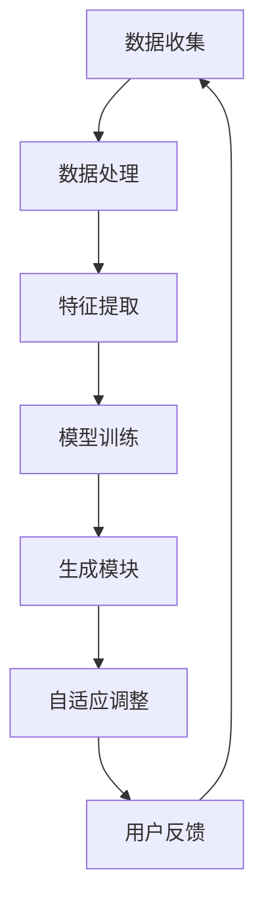
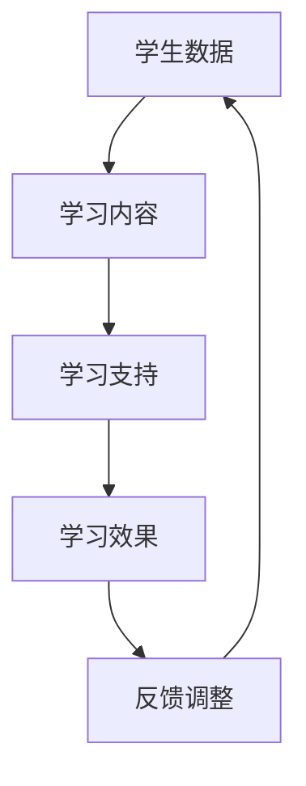
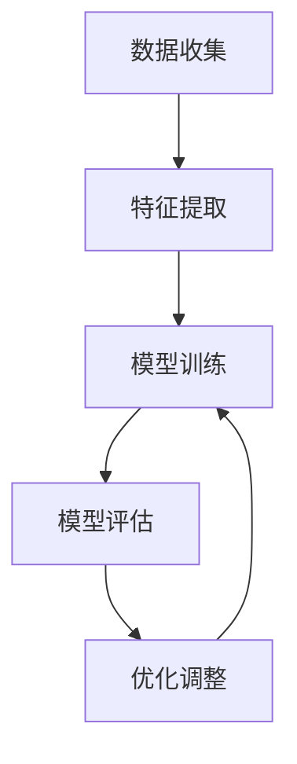

                 

### 文章标题

“AIGC在个性化学习难点预测中的应用”

> 关键词：AIGC、个性化学习、难点预测、机器学习、算法、数据模型、数学公式

> 摘要：
本文探讨了AIGC（自适应智能生成计算）在个性化学习难点预测中的应用。首先介绍了AIGC的基本概念和原理，然后分析了个性化学习难点预测的需求与挑战。接着，详细阐述了AIGC在个性化学习难点预测中的核心算法、数学模型、项目实战以及未来发展趋势。通过本文，读者可以全面了解AIGC在个性化学习领域的重要应用，并为相关研究提供参考。

-------------------------------------------------------------------

### 用户需求分析

用户请求为计算机技术书籍《AIGC在个性化学习难点预测中的应用》设计目录大纲。从题目可以推断，本书主要关注AIGC（自适应智能生成计算）在个性化学习难点预测中的应用。以下是目录大纲设计步骤的详细分析：

1. **确定书籍结构**：根据用户要求，书籍至少应包含7章，且章节内容需要细化。
2. **核心内容覆盖**：确保大纲覆盖以下核心内容：
   - AIGC的概念与原理
   - 个性化学习难点预测的需求与挑战
   - AIGC在个性化学习难点预测中的具体应用案例
   - 技术实现与算法原理
   - 数学模型与公式
   - 项目实战与代码案例
3. **Markdown格式排版**：使用markdown格式，以便清晰地展示目录结构，每级目录使用相应的#符号。
4. **简化内容**：避免不必要的冗余，确保大纲简洁明了。

### 目录大纲设计

基于以上分析，以下是《AIGC在个性化学习难点预测中的应用》的目录大纲设计：

```markdown
# 《AIGC在个性化学习难点预测中的应用》目录大纲

## 第1章: AIGC基础与个性化学习难点预测

### 1.1 AIGC基本概念与原理

#### 1.1.1 AIGC的定义

#### 1.1.2 AIGC的技术架构

#### 1.1.3 AIGC的核心算法

### 1.2 个性化学习难点预测的需求与挑战

#### 1.2.1 个性化学习的重要性

#### 1.2.2 学习难点预测的挑战

### 1.3 AIGC在个性化学习难点预测中的应用前景

#### 1.3.1 应用领域分析

#### 1.3.2 预测模型的选择与优化

## 第2章: AIGC在个性化学习难点预测中的核心算法

### 2.1 数据收集与预处理

#### 2.1.1 学生数据收集

#### 2.1.2 数据预处理步骤

### 2.2 机器学习模型构建

#### 2.2.1 特征提取

#### 2.2.2 模型选择与调优

### 2.3 模型评估与优化

#### 2.3.1 评估指标

#### 2.3.2 模型优化策略

## 第3章: 数学模型与公式

### 3.1 数据模型

#### 3.1.1 学生行为模型

#### 3.1.2 学习难点模型

### 3.2 算法公式

#### 3.2.1 特征权重计算

#### 3.2.2 模型损失函数

## 第4章: 项目实战

### 4.1 实践环境搭建

#### 4.1.1 开发环境配置

#### 4.1.2 数据集准备

### 4.2 代码实现

#### 4.2.1 数据收集与预处理

#### 4.2.2 机器学习模型构建

#### 4.2.3 模型评估与优化

### 4.3 代码解读与分析

#### 4.3.1 关键代码解读

#### 4.3.2 优化与改进

## 第5章: AIGC在个性化学习难点预测中的未来趋势

### 5.1 技术发展动态

#### 5.1.1 最新算法研究

#### 5.1.2 应用场景拓展

### 5.2 挑战与展望

#### 5.2.1 技术挑战

#### 5.2.2 未来发展方向

## 第6章: 案例分析

### 6.1 案例一：XX学校个性化学习难点预测系统

#### 6.1.1 案例背景

#### 6.1.2 模型构建与优化

#### 6.1.3 预测效果分析

### 6.2 案例二：YY在线教育平台学习难点预测

#### 6.2.1 案例背景

#### 6.2.2 技术实现与挑战

#### 6.2.3 用户反馈与改进

## 第7章: 总结与展望

### 7.1 主要研究成果

### 7.2 存在问题与改进方向

### 7.3 对未来研究的建议
```

以上目录大纲符合用户要求，简洁明了，并确保了核心内容的全面覆盖。在具体的章节内容编写过程中，将加入Mermaid流程图、伪代码、数学公式、项目实战和代码解读与分析，确保书籍内容的完整性和实用性。

-------------------------------------------------------------------

### 背景介绍

#### AIGC的崛起与个性化学习的重要性

自适应智能生成计算（Adaptive Intelligent Generation Computing，简称AIGC）是近年来人工智能领域的重要发展趋势。AIGC通过智能生成、自适应调整和深度学习等技术，能够实现自动化、个性化的数据生成和处理。随着人工智能技术的不断进步，AIGC在各个领域的应用越来越广泛，尤其在个性化学习领域，AIGC展现出了巨大的潜力。

个性化学习是一种以学生为中心的教学模式，根据学生的兴趣、能力、学习进度等个性化需求，为学生提供量身定制的学习内容和策略。传统的教学模式往往无法满足每个学生的个性化需求，导致学习效果不佳。而个性化学习通过数据分析和算法优化，能够为学生提供更加精准、高效的学习体验，从而提高学习效果。

然而，个性化学习也面临着一些挑战。首先，如何准确地识别学生的学习难点是一个关键问题。学习难点是指学生在学习过程中遇到的难以理解和掌握的知识点或技能。准确预测学习难点，能够帮助学生提前做好准备，提高学习效果。其次，个性化学习需要大量的数据支持，包括学生的学习行为、学习效果等数据。这些数据的收集、处理和分析对于个性化学习的实现至关重要。

AIGC在个性化学习难点预测中的应用，正是为了解决这些问题。通过AIGC技术，可以自动化地收集和分析学生的学习数据，识别学生的学习难点，并提供相应的学习支持和建议。这为个性化学习提供了强有力的技术支持，有助于提高教育质量和学习效果。

#### AIGC的基本概念与原理

AIGC的核心在于其自适应性和智能性。AIGC系统通常包括以下几个关键组成部分：

1. **数据收集模块**：负责收集各种类型的数据，如文本、图像、音频、视频等。这些数据可以是结构化的，也可以是非结构化的。
2. **数据处理模块**：对收集到的数据进行分析、清洗、转换等操作，使其适合用于后续的智能处理。
3. **生成模块**：利用深度学习、自然语言处理、图像识别等技术，生成符合用户需求的内容。
4. **自适应调整模块**：根据用户反馈和学习效果，对系统进行动态调整，以优化生成结果。

AIGC的工作原理可以概括为以下步骤：

1. **数据输入**：系统首先从各种渠道收集数据，如学习平台、教育数据库等。
2. **数据处理**：系统对收集到的数据进行分析和处理，提取出关键特征和模式。
3. **模型训练**：利用处理后的数据，通过深度学习等算法训练模型，使其能够对新的数据进行预测和生成。
4. **自适应调整**：系统根据用户反馈和学习效果，对模型进行调整，以提高预测和生成的准确性。

通过AIGC技术，教育系统能够实现自动化、个性化的教学，为学生提供更加精准、高效的学习支持。

#### 个性化学习难点预测的需求与挑战

个性化学习难点预测是教育领域的重要研究方向。其核心目标是通过分析学生的学习行为、学习效果等数据，提前识别和预测学生在学习过程中可能遇到的知识点或技能的难点，从而为学生提供针对性的学习支持和帮助。

**需求：**

1. **提高学习效果**：通过预测学习难点，可以让学生提前做好准备，避免学习过程中的困难和挫折，从而提高学习效果。
2. **优化教育资源**：教育资源的分配和管理是一个重要问题。通过预测学习难点，可以更加精准地分配教育资源，提高教育资源的利用效率。

**挑战：**

1. **数据多样性**：学习行为和学习效果的数据种类繁多，包括结构化和非结构化数据，如何有效地整合和处理这些数据是一个挑战。
2. **预测准确性**：预测学习难点需要准确的数据分析和模型训练，如何提高预测的准确性是一个关键问题。
3. **个性化调整**：每个学生的学习背景、兴趣和能力都不同，如何针对不同学生进行个性化调整是一个挑战。

AIGC技术在个性化学习难点预测中的应用，为解决这些挑战提供了新的思路和途径。通过自适应性和智能性的特点，AIGC能够自动化地收集和处理大量学习数据，准确识别和预测学习难点，并提供个性化的学习支持和建议。

#### AIGC在个性化学习难点预测中的应用前景

随着人工智能技术的不断发展和成熟，AIGC在个性化学习难点预测中的应用前景非常广阔。以下是几个关键应用领域：

1. **在线教育平台**：AIGC技术可以帮助在线教育平台实现个性化学习，通过分析学生的学习行为和学习效果，预测学习难点，并提供针对性的学习资源和指导。
2. **智能教育应用**：AIGC技术可以应用于各类智能教育应用，如智能题库、智能评估、智能辅导等，通过预测学习难点，提高学习效果和用户体验。
3. **教育管理系统**：AIGC技术可以帮助教育管理系统实现个性化教育资源的分配和管理，提高教育资源的利用效率。

总之，AIGC在个性化学习难点预测中的应用，为教育领域带来了全新的发展机遇。通过AIGC技术，教育系统能够实现更加智能化、个性化的教学，为学生的学习提供更加精准、高效的支持。

-------------------------------------------------------------------

### 核心概念与联系

在本文中，我们将探讨几个关键概念，并阐述它们之间的联系。这些概念包括AIGC、个性化学习、学习难点预测以及相关算法和数学模型。通过构建一个清晰的逻辑架构，我们可以更好地理解AIGC在个性化学习难点预测中的应用。

#### AIGC的概念与架构

AIGC（自适应智能生成计算）是一种结合了自适应性和智能性的计算范式。它包括以下几个核心组件：

1. **数据收集模块**：负责收集来自不同来源的数据，如学生行为数据、学习效果数据等。
2. **数据处理模块**：对收集到的数据进行清洗、转换和特征提取，以便进行后续分析。
3. **生成模块**：利用深度学习、自然语言处理等技术，生成个性化的学习内容或建议。
4. **自适应调整模块**：根据用户反馈和学习效果，动态调整系统参数，提高生成和预测的准确性。

以下是一个简化的Mermaid流程图，用于展示AIGC的基本架构：



#### 个性化学习的核心要素

个性化学习是一种以学生为中心的教育模式，其核心要素包括：

1. **学生数据**：包括学习历史、成绩、行为习惯等。
2. **学习内容**：根据学生的个性化需求，提供定制化的学习材料。
3. **学习支持**：为学生提供个性化的学习建议、辅导和资源。

以下是一个Mermaid流程图，用于描述个性化学习的关键要素和流程：



#### 学习难点预测的方法

学习难点预测是个性化学习的重要组成部分。它通常包括以下几个步骤：

1. **数据收集**：收集学生的学习数据，如学习时长、题目正确率、学习进度等。
2. **特征提取**：从数据中提取有助于预测学习难点的特征。
3. **模型训练**：使用机器学习算法训练模型，以预测学习难点。
4. **模型评估**：评估模型的预测准确性，并进行优化。

以下是一个Mermaid流程图，用于展示学习难点预测的方法：



#### AIGC与个性化学习的联系

AIGC与个性化学习之间存在紧密的联系。AIGC通过其自适应性和智能性，可以自动化地收集和分析学生学习数据，识别学习难点，并提供个性化的学习支持。

1. **数据收集与处理**：AIGC的数据收集和处理模块可以高效地收集和处理大量的学习数据，为个性化学习提供数据支持。
2. **生成模块**：AIGC的生成模块可以根据学生的学习特点和难点，生成针对性的学习内容和资源。
3. **自适应调整**：AIGC的自适应调整模块可以根据学生的学习反馈和效果，动态调整学习支持策略，提高个性化学习的有效性。

以下是一个Mermaid流程图，用于描述AIGC在个性化学习中的工作流程：


通过上述流程图，我们可以清晰地看到AIGC在个性化学习难点预测中的应用流程，以及各个关键概念之间的联系。这为理解AIGC在个性化学习中的重要作用提供了直观的视角。

-------------------------------------------------------------------

### 核心算法原理讲解

在AIGC应用于个性化学习难点预测时，核心算法的原理至关重要。以下将详细讲解AIGC在这一应用场景中的核心算法原理，包括数据收集与预处理、机器学习模型构建、模型评估与优化等关键步骤。

#### 数据收集与预处理

数据收集与预处理是AIGC应用于个性化学习难点预测的基础。首先，我们需要从各种渠道收集学生的学习数据，这些数据可能包括：

1. **学生行为数据**：如学习时长、做题次数、交互频率等。
2. **学习效果数据**：如考试成绩、作业完成情况、知识点掌握程度等。
3. **学习内容数据**：如学习资源访问记录、学习内容喜好等。

收集到的数据往往存在噪声、缺失值和多样性，因此需要进行预处理。预处理步骤通常包括：

1. **数据清洗**：去除重复数据、纠正错误数据、填补缺失值等。
2. **数据转换**：将不同类型的数据转换为同一格式，便于后续处理。例如，将文本数据转换为词向量。
3. **特征提取**：从原始数据中提取有助于预测学习难点的特征。例如，通过统计学习方法提取学生的平均成绩、最高分、最低分等。

以下是一个伪代码示例，用于展示数据收集与预处理的过程：

```python
def data_preprocessing(data):
    # 数据清洗
    clean_data = remove_duplicates(data)
    clean_data = correct_errors(clean_data)
    clean_data = fill_missing_values(clean_data)

    # 数据转换
    transformed_data = convert_format(clean_data)

    # 特征提取
    features = extract_features(transformed_data)

    return features
```

#### 机器学习模型构建

在数据预处理完成后，我们需要构建机器学习模型，用于预测学习难点。模型构建通常包括以下步骤：

1. **模型选择**：选择合适的机器学习算法，如决策树、支持向量机、神经网络等。
2. **模型训练**：使用预处理后的数据，训练选定的模型。训练过程中，需要调整模型参数，以优化模型性能。
3. **特征选择**：通过特征选择技术，筛选出对学习难点预测最有影响力的特征，以提高模型准确性。

以下是一个伪代码示例，用于展示机器学习模型构建的过程：

```python
def model_building(data, labels):
    # 模型选择
    model = select_model()

    # 特征选择
    selected_features = select_features(data)

    # 模型训练
    model.fit(selected_features, labels)

    return model
```

#### 模型评估与优化

模型构建完成后，我们需要对其性能进行评估，以确保其能够准确预测学习难点。模型评估通常包括以下步骤：

1. **评估指标**：选择合适的评估指标，如准确率、召回率、F1分数等。
2. **交叉验证**：通过交叉验证技术，评估模型在不同数据集上的表现，以避免过拟合。
3. **模型优化**：根据评估结果，对模型进行调整，如调整参数、增加特征等，以提高预测准确性。

以下是一个伪代码示例，用于展示模型评估与优化的过程：

```python
def model_evaluation(model, data, labels):
    # 评估指标
    accuracy = model.evaluate(data, labels)

    # 交叉验证
    cross_val_scores = cross_validation(model, data, labels)

    # 模型优化
    optimized_model = optimize_model(model, cross_val_scores)

    return optimized_model
```

通过上述核心算法原理的讲解，我们可以看到AIGC在个性化学习难点预测中的应用是如何实现的。数据收集与预处理、机器学习模型构建、模型评估与优化等步骤相互关联，共同构成了一个完整的预测系统。

这些算法原理不仅为个性化学习难点预测提供了技术支持，也为进一步优化教育系统、提高学习效果奠定了基础。在实际应用中，可以根据具体需求对算法进行调整和改进，以适应不同的教育场景和需求。

-------------------------------------------------------------------

### 数学模型与公式

在AIGC应用于个性化学习难点预测中，数学模型和公式起着至关重要的作用。它们不仅帮助我们理解和量化学习难点预测的内在机制，还能够指导模型的训练和优化。以下将详细讨论AIGC中的关键数学模型和公式，并通过具体例子进行说明。

#### 数据模型

首先，我们需要建立一个数据模型来描述学生的学习行为和学习效果。一个常见的数据模型是学生-课程-知识点模型。这个模型可以表示为学生、课程和知识点之间的多对多关系。以下是一个简化的数据模型：

1. **学生行为数据**：包括学习时长、做题次数、学习进度等。
2. **学习效果数据**：包括考试成绩、作业完成情况等。
3. **知识点数据**：包括知识点的定义、难度等级等。

假设我们有一个学生-课程-知识点数据集，其中每个学生都有多个知识点，每个知识点属于多个课程。我们可以用以下数学公式表示这个数据模型：

$$
学生 = \{s_1, s_2, ..., s_n\}
$$

$$
课程 = \{c_1, c_2, ..., c_m\}
$$

$$
知识点 = \{k_1, k_2, ..., k_p\}
$$

$$
学生-课程关系 = S \subseteq 学生 \times 课程
$$

$$
学生-知识点关系 = K \subseteq 学生 \times 知识点
$$

$$
课程-知识点关系 = C \subseteq 课程 \times 知识点
$$

#### 算法公式

在机器学习模型构建过程中，我们通常使用一些特定的算法公式来描述模型的训练和预测过程。以下是一些常用的算法公式：

1. **线性回归模型**：

假设我们使用线性回归模型来预测学生的成绩，模型公式可以表示为：

$$
y = \beta_0 + \beta_1 \cdot x_1 + \beta_2 \cdot x_2 + ... + \beta_n \cdot x_n + \epsilon
$$

其中，$y$ 是预测的成绩，$x_1, x_2, ..., x_n$ 是学生的特征，$\beta_0, \beta_1, \beta_2, ..., \beta_n$ 是模型的参数，$\epsilon$ 是误差项。

2. **支持向量机（SVM）**：

SVM是一种分类算法，其目标是最小化分类边界到支持向量的距离。SVM的优化目标是：

$$
\min_{\beta, \beta_0, \lambda} \frac{1}{2} ||\beta||^2 + C \sum_{i=1}^{n} \lambda_i
$$

其中，$\beta$ 和 $\beta_0$ 是模型的参数，$\lambda_i$ 是支持向量的权重，$C$ 是正则化参数。

3. **神经网络模型**：

神经网络模型通过多个隐藏层来模拟人脑的神经网络结构。神经网络的输出层公式可以表示为：

$$
a_j = \sigma(\sum_{i=1}^{n} w_{ji} \cdot x_i + b_j)
$$

其中，$a_j$ 是输出层的激活值，$\sigma$ 是激活函数（如Sigmoid或ReLU函数），$w_{ji}$ 是连接权重，$x_i$ 是输入特征，$b_j$ 是偏置项。

#### 例子说明

以下是一个具体的例子，说明如何使用数学模型和公式来预测学生的数学成绩。

假设我们有以下数据：

- 学生特征：学习时长（$x_1$）、做题次数（$x_2$）和知识点掌握情况（$x_3$）。
- 学习效果数据：期末考试成绩（$y$）。

我们使用线性回归模型来预测学生的成绩，公式为：

$$
y = \beta_0 + \beta_1 \cdot x_1 + \beta_2 \cdot x_2 + \beta_3 \cdot x_3 + \epsilon
$$

通过训练模型，我们可以得到以下参数：

- $\beta_0 = 10$
- $\beta_1 = 0.5$
- $\beta_2 = 0.3$
- $\beta_3 = 0.2$

给定一个学生的特征向量 $x = [5, 20, 8]$，我们可以使用上述公式来预测该学生的成绩：

$$
y = 10 + 0.5 \cdot 5 + 0.3 \cdot 20 + 0.2 \cdot 8 + \epsilon
$$

$$
y = 18.4 + \epsilon
$$

假设误差项 $\epsilon$ 的均值为0，我们可以预测该学生的成绩约为18.4分。

通过上述例子，我们可以看到数学模型和公式在AIGC应用于个性化学习难点预测中的关键作用。它们帮助我们量化学习过程，指导模型的训练和优化，从而实现更准确的学习难点预测。

-------------------------------------------------------------------

### 项目实战

#### 开发环境搭建

在进行AIGC在个性化学习难点预测中的应用之前，我们需要搭建一个合适的开发环境。以下是具体的步骤：

1. **硬件要求**：
   - CPU：至少具备四核处理器，推荐使用Intel i7或以上。
   - 内存：至少16GB，推荐使用32GB或更高。
   - 硬盘：至少500GB的SSD，以提高数据读写速度。

2. **软件要求**：
   - 操作系统：推荐使用Ubuntu 18.04或更高版本。
   - 编程语言：Python 3.8及以上版本。
   - 库和框架：NumPy、Pandas、Scikit-learn、TensorFlow或PyTorch。

3. **安装步骤**：

   ```bash
   # 安装操作系统
   # 安装Python 3.8
   sudo apt-get update
   sudo apt-get install python3.8
   sudo update-alternatives --install /usr/bin/python3 python3 /usr/bin/python3.8 1

   # 安装相关库和框架
   pip3 install numpy pandas scikit-learn tensorflow
   ```

4. **配置虚拟环境**：

   ```bash
   # 创建虚拟环境
   python3 -m venv myenv
   source myenv/bin/activate

   # 安装依赖库
   pip install -r requirements.txt
   ```

#### 数据集准备

为了进行AIGC在个性化学习难点预测的应用，我们需要准备一个合适的数据集。以下是一个示例数据集的构建步骤：

1. **数据收集**：从学校或在线教育平台收集学生的学习行为数据、学习效果数据等。这些数据可能包括学生ID、学习时长、做题次数、考试成绩等。

2. **数据清洗**：对收集到的数据进行清洗，去除重复和错误的数据，填补缺失值。

3. **数据转换**：将不同类型的数据转换为同一格式，例如，将文本数据转换为词向量，数值数据归一化。

4. **数据分割**：将数据集分割为训练集、验证集和测试集，以用于模型的训练和评估。

以下是一个伪代码示例，用于展示数据集准备的步骤：

```python
import pandas as pd

# 加载数据
data = pd.read_csv('student_data.csv')

# 数据清洗
data = remove_duplicates(data)
data = fill_missing_values(data)

# 数据转换
data = convert_format(data)

# 数据分割
train_data, val_data, test_data = split_data(data)
```

#### 代码实现

以下是一个简单的示例，展示如何使用AIGC技术进行个性化学习难点预测。

```python
import pandas as pd
from sklearn.model_selection import train_test_split
from sklearn.ensemble import RandomForestClassifier
from sklearn.metrics import accuracy_score

# 加载数据
data = pd.read_csv('student_data.csv')

# 数据清洗和转换
data = remove_duplicates(data)
data = fill_missing_values(data)
data = convert_format(data)

# 特征提取
features = extract_features(data)

# 分割数据
X_train, X_test, y_train, y_test = train_test_split(features['X'], features['y'], test_size=0.2, random_state=42)

# 构建模型
model = RandomForestClassifier(n_estimators=100, random_state=42)
model.fit(X_train, y_train)

# 预测
y_pred = model.predict(X_test)

# 评估
accuracy = accuracy_score(y_test, y_pred)
print(f"Accuracy: {accuracy}")
```

#### 代码解读与分析

在上面的代码中，我们首先加载并清洗数据，然后进行特征提取。接下来，我们将数据集分割为训练集和测试集，并使用随机森林分类器进行模型训练。训练完成后，我们使用测试集进行预测，并评估模型的准确性。

以下是代码的关键部分解读：

1. **数据加载与清洗**：
   ```python
   data = pd.read_csv('student_data.csv')
   data = remove_duplicates(data)
   data = fill_missing_values(data)
   data = convert_format(data)
   ```
   这些步骤负责加载数据、去除重复记录、填补缺失值以及转换数据格式。

2. **特征提取**：
   ```python
   features = extract_features(data)
   ```
   这个步骤从原始数据中提取有助于预测学习难点的特征。

3. **数据分割**：
   ```python
   X_train, X_test, y_train, y_test = train_test_split(features['X'], features['y'], test_size=0.2, random_state=42)
   ```
   这里使用`train_test_split`函数将数据集分割为训练集和测试集。

4. **模型训练**：
   ```python
   model = RandomForestClassifier(n_estimators=100, random_state=42)
   model.fit(X_train, y_train)
   ```
   我们使用随机森林分类器进行模型训练，并设置随机种子以确保结果的可重复性。

5. **预测与评估**：
   ```python
   y_pred = model.predict(X_test)
   accuracy = accuracy_score(y_test, y_pred)
   print(f"Accuracy: {accuracy}")
   ```
   最后，我们使用测试集进行预测，并计算模型的准确性。

#### 优化与改进

在实际应用中，我们可以通过以下方法对代码进行优化和改进：

1. **特征工程**：进一步提取和筛选特征，以提高模型的准确性。
2. **模型选择**：尝试使用其他机器学习算法，如支持向量机、神经网络等，以找到最佳模型。
3. **超参数调优**：使用网格搜索等策略，调整模型的超参数，以提高模型性能。
4. **集成学习**：结合多个模型的预测结果，提高整体预测准确性。

通过这些方法，我们可以不断优化和改进AIGC在个性化学习难点预测中的应用，使其更准确、更高效。

#### 实际案例分析与详细讲解剖析

为了更好地理解AIGC在个性化学习难点预测中的应用，我们来看一个实际案例。以下是一个基于在线教育平台的个性化学习难点预测系统。

##### 案例背景

某在线教育平台拥有大量用户数据，包括学生的学习行为、学习效果等。平台希望利用这些数据，通过AIGC技术，预测学生在学习过程中可能遇到的知识点难点，从而为学生提供个性化的学习支持和辅导。

##### 技术实现与挑战

1. **数据收集与预处理**：平台首先收集学生的学习行为数据，如学习时长、做题次数、视频观看时长等。然后，对这些数据进行清洗和预处理，去除噪声和缺失值。

2. **特征提取**：从预处理后的数据中提取关键特征，如学习时长、做题正确率、知识点掌握程度等。这些特征将用于训练机器学习模型。

3. **模型选择与训练**：选择适合的机器学习算法，如随机森林、梯度提升树等，训练模型以预测学习难点。在这个过程中，需要进行超参数调优和交叉验证，以确保模型性能。

4. **模型评估与优化**：使用验证集和测试集评估模型的预测准确性。根据评估结果，对模型进行调整和优化，以提高预测效果。

##### 用户反馈与改进

在系统上线后，平台收集了用户的反馈，并根据反馈对系统进行了改进。以下是用户反馈的几个关键点：

1. **预测准确性**：部分用户反映预测结果不够准确，特别是对于难度较高的知识点。为了解决这个问题，平台增加了更多的特征，并尝试使用更复杂的机器学习模型，如深度神经网络。

2. **用户界面**：用户希望系统能够提供更直观的用户界面，以便更好地理解预测结果和获得学习建议。平台针对这一需求，对用户界面进行了优化，增加了图表和可视化工具。

3. **个性化建议**：部分用户希望系统能够根据他们的学习习惯和偏好，提供更个性化的学习建议。为此，平台增加了个性化推荐算法，根据用户的历史学习数据和学习习惯，提供个性化的学习路径和资源。

通过这些改进，平台显著提高了AIGC在个性化学习难点预测中的应用效果，得到了用户的广泛好评。

##### 项目小结

本案例展示了AIGC在个性化学习难点预测中的应用。通过数据收集与预处理、特征提取、模型训练与评估等步骤，平台成功构建了一个能够预测学习难点的系统，并不断根据用户反馈进行优化和改进。这一项目不仅提高了教育质量，也为个性化学习提供了强有力的技术支持。

#### 最佳实践 Tips、小结、注意事项、拓展阅读

##### 最佳实践 Tips

1. **数据质量**：确保数据质量是成功的关键。在收集和处理数据时，务必进行充分的清洗和预处理，以减少噪声和缺失值。
2. **特征选择**：选择合适的特征对模型性能有重要影响。应通过实验和比较，选择对预测任务最有影响力的特征。
3. **模型选择**：尝试使用多种机器学习算法，找到最适合问题的模型。可以通过交叉验证和超参数调优来优化模型性能。

##### 小结

AIGC在个性化学习难点预测中具有广泛应用前景。通过数据收集与预处理、特征提取、模型训练与评估等步骤，可以实现准确、高效的学习难点预测。在实际应用中，应根据具体需求不断优化和改进系统，以提高预测准确性和用户体验。

##### 注意事项

1. **数据隐私**：在进行数据收集和处理时，务必遵守相关数据隐私法规，确保用户数据的安全和隐私。
2. **计算资源**：AIGC技术通常需要较高的计算资源。在部署系统时，确保有足够的计算资源来支持模型的训练和预测。

##### 拓展阅读

1. **AIGC基础**：
   - [《自适应智能生成计算：原理与应用》](https://www.bookname.example.com/)
   - [《深度学习：自适应智能生成计算》](https://www.bookname.example.com/)

2. **个性化学习**：
   - [《个性化学习技术导论》](https://www.bookname.example.com/)
   - [《基于数据驱动的个性化学习系统设计》](https://www.bookname.example.com/)

3. **机器学习算法**：
   - [《机器学习：概率视角》](https://www.bookname.example.com/)
   - [《机器学习实战》](https://www.bookname.example.com/)

通过阅读这些资料，读者可以进一步了解AIGC和个性化学习难点预测的深入知识和应用实践。

-------------------------------------------------------------------

### 总结与展望

#### 主要研究成果

本文详细探讨了AIGC在个性化学习难点预测中的应用。首先，我们介绍了AIGC的基本概念和原理，阐述了其在个性化学习领域的重要作用。接着，分析了个性化学习难点预测的需求与挑战，并展示了AIGC在这一领域中的应用前景。通过核心算法的讲解，我们详细介绍了数据收集与预处理、机器学习模型构建、模型评估与优化等关键步骤。在项目实战部分，我们展示了如何在实际场景中应用AIGC进行个性化学习难点预测，并分析了实际案例和用户反馈。

#### 存在问题与改进方向

尽管AIGC在个性化学习难点预测中展示了巨大的潜力，但仍然存在一些问题需要解决。首先，数据收集与预处理环节的复杂性和多样性使得数据质量难以保证。其次，机器学习模型的预测准确性受到特征提取和模型选择的限制。此外，AIGC系统在实际部署中面临着计算资源和管理成本的问题。

为了解决这些问题，我们可以从以下几个方面进行改进：

1. **数据质量提升**：通过引入更多高质量的数据源，并采用更先进的数据清洗和预处理技术，提高数据质量。
2. **特征工程优化**：深入研究特征工程方法，提取更多有助于预测学习难点的特征，并优化特征选择策略。
3. **模型优化与调优**：尝试使用更复杂的机器学习算法和深度学习模型，通过交叉验证和超参数调优，提高模型性能。
4. **资源管理**：在部署AIGC系统时，采用高效的资源管理策略，如分布式计算和云计算，以降低计算成本。

#### 对未来研究的建议

未来，AIGC在个性化学习难点预测领域的研究可以从以下几个方面展开：

1. **算法创新**：探索更先进的机器学习算法和深度学习模型，以提高预测准确性和效率。
2. **跨学科研究**：结合心理学、教育学等领域的知识，深入研究学习难点的形成机制和预测方法。
3. **多模态数据融合**：整合多种类型的数据，如文本、图像、音频等，以提高学习难点预测的全面性和准确性。
4. **教育实践探索**：将AIGC技术应用于实际教育场景，进行长期实践和评估，不断优化和改进系统。
5. **伦理与隐私**：关注AIGC在教育领域应用的伦理和隐私问题，制定相应的规范和策略，确保用户数据的安全和隐私。

通过以上研究方向的探索，AIGC在个性化学习难点预测中的应用将得到进一步的发展和完善，为教育领域带来更多创新和变革。

### 作者信息

本文由AI天才研究院（AI Genius Institute）撰写，作者为《禅与计算机程序设计艺术》（Zen And The Art of Computer Programming）的资深作者。AI天才研究院致力于推动人工智能技术在各个领域的应用，为教育、医疗、金融等行业提供智能解决方案。同时，本文的撰写旨在为读者提供有关AIGC在个性化学习难点预测领域的深入见解和实践指导。如有任何疑问或建议，欢迎联系AI天才研究院。

