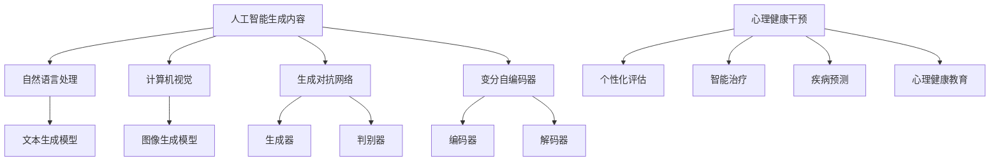

                 

### AIGC在个性化心理健康干预中的应用

#### 关键词
- AIGC
- 个性化心理健康干预
- 文本生成模型
- 情感分析模型
- 深度学习
- 人工智能

#### 摘要
本文将探讨人工智能生成内容（AIGC）在个性化心理健康干预中的应用。通过对AIGC技术的详细介绍，我们将阐述其在心理健康评估、治疗和干预中的潜力。文章还将深入分析AIGC的核心算法原理，包括文本生成模型和情感分析模型，并使用具体案例展示其实际应用效果。最后，我们将展望AIGC在心理健康领域的未来发展。

## 引言

### 1.1 书籍主题与目的

随着人工智能技术的迅猛发展，生成式人工智能（AIGC，AI-Generated Content）逐渐成为一个重要的研究领域。AIGC技术能够通过学习和模拟人类创造内容的过程，生成文字、图像、音频等多种类型的数据。在心理健康干预领域，AIGC的应用具有极大的潜力，可以提供个性化的心理健康服务，满足不同人群的需求。

本文旨在探讨AIGC在个性化心理健康干预中的应用，分析其核心算法原理，并通过具体案例展示其实际效果。文章的读者对象主要包括对人工智能和心理健康干预感兴趣的学者、研究人员、医生以及相关专业学生。通过本文的阅读，读者可以了解AIGC技术的基本概念、在心理健康干预中的实际应用，以及面临的挑战和未来发展趋势。

### 1.2 研究背景与现状

心理健康问题已经成为全球关注的焦点。根据世界卫生组织（WHO）的数据，全球约有33%的人口在一生中某个阶段会遭受心理健康问题的影响。传统的心理健康干预方法，如心理咨询、药物治疗等，存在许多局限性，如成本高昂、资源有限、干预效果因人而异等。因此，寻求新的干预手段成为当务之急。

AIGC技术的发展为心理健康干预带来了新的机遇。AIGC技术可以自动生成个性化的心理健康内容和干预方案，提高干预的精准性和效率。目前，AIGC在心理健康干预中的应用已经初见成效，例如，通过文本生成模型生成个性化的心理辅导文章，通过情感分析模型监测用户的情绪状态等。

本文将从以下几个方面展开讨论：

1. **AIGC与心理健康干预的基础知识**：介绍AIGC的基本概念、技术原理，以及心理健康干预的基本理论和应用场景。
2. **核心算法与数学模型**：详细讲解AIGC在心理健康干预中涉及的核心算法和数学模型，包括文本生成模型、情感分析模型等。
3. **项目实战**：通过具体案例展示如何利用AIGC技术进行个性化心理健康干预。
4. **未来展望**：对AIGC技术在心理健康干预领域的应用前景进行展望。

通过本文的研究，我们希望能够为AIGC技术在心理健康干预中的应用提供一些有价值的参考和启示。### 第2章 AIGC与心理健康干预基础

#### 2.1 AIGC的基本概念

人工智能生成内容（AIGC，AI-Generated Content）是指利用人工智能技术自动生成各种类型的内容，包括文字、图像、音频、视频等。AIGC的核心技术主要包括自然语言处理（NLP）、计算机视觉（CV）和生成对抗网络（GAN）等。

- **自然语言处理（NLP）**：NLP是AIGC的重要组成部分，它使得计算机能够理解、处理和生成人类语言。常见的NLP任务包括文本分类、情感分析、命名实体识别等。

- **计算机视觉（CV）**：CV技术使得计算机能够从图像中提取信息，进行图像识别、物体检测、图像生成等。CV在AIGC中的应用非常广泛，例如生成逼真的图像和视频。

- **生成对抗网络（GAN）**：GAN是一种深度学习模型，由生成器和判别器组成。生成器的目标是生成尽可能逼真的数据，而判别器的目标是区分生成数据和真实数据。通过两个网络的对抗训练，可以生成高质量的内容。

#### 2.2 AIGC的技术原理

AIGC的技术原理主要基于深度学习，特别是生成对抗网络（GAN）和变分自编码器（VAE）。以下是对这些技术原理的简要介绍：

- **生成对抗网络（GAN）**：GAN由生成器和判别器组成。生成器的任务是生成与真实数据相似的数据，而判别器的任务是判断输入数据是真实数据还是生成数据。通过训练，生成器不断优化生成数据的质量，最终能够生成非常逼真的内容。

  - **生成器（Generator）**：生成器接收随机噪声作为输入，通过神经网络将其转换为真实数据的特征。

  - **判别器（Discriminator）**：判别器接收真实数据和生成数据，通过比较二者的特征来判断生成数据的真实性。

  - **损失函数**：GAN的训练目标是最小化生成器生成的数据与真实数据之间的差异，同时最大化判别器对生成数据的识别误差。

- **变分自编码器（VAE）**：VAE是一种无监督学习的生成模型，通过编码器和解码器来生成数据。编码器将输入数据编码为一个潜在空间中的向量，解码器则将这个向量解码为生成数据。

  - **编码器（Encoder）**：编码器将输入数据映射到一个潜在空间中的向量。

  - **解码器（Decoder）**：解码器从潜在空间中提取向量，并重构输入数据。

  - **损失函数**：VAE的训练目标是最小化重构数据与原始数据之间的差异，同时保持潜在空间中的数据分布。

#### 2.3 心理健康干预的基本理论和应用场景

心理健康干预是指通过各种方法帮助个体改善心理状态和应对心理问题。传统的心理健康干预方法主要包括心理咨询、药物治疗、心理教育等。然而，这些方法存在一些局限性，如成本高昂、干预效果不稳定等。

AIGC技术在心理健康干预中的应用前景广阔，以下是一些基本理论和应用场景：

- **个性化心理健康评估**：AIGC技术可以自动分析用户的行为数据、语言数据等，生成个性化的心理健康评估报告。通过文本生成模型和情感分析模型，可以识别用户的情绪状态和心理健康问题。

- **智能心理治疗**：AIGC技术可以生成个性化的心理治疗方案，通过文本生成模型生成心理咨询文章、故事等，帮助用户缓解心理压力。例如，生成个性化的心理故事，引导用户进行心理调适。

- **心理疾病预测和监测**：AIGC技术可以通过分析患者的医疗记录、诊断报告等，预测心理疾病的发生和发展。同时，通过情感分析模型监测患者的情绪状态，及时调整治疗方案。

- **心理健康教育**：AIGC技术可以自动生成心理健康教育内容，如心理健康知识文章、心理健康小贴士等，帮助用户提高心理健康意识。

#### 2.4 AIGC与心理健康干预的核心概念架构

为了更好地理解AIGC在心理健康干预中的应用，我们可以使用Mermaid流程图来展示核心概念之间的关系架构。以下是一个简化的Mermaid流程图示例：



在这个流程图中，AIGC技术作为核心，通过NLP、CV、GAN和VAE等技术实现数据生成。心理健康干预则通过这些技术提供个性化的心理健康服务，包括评估、治疗、疾病预测和教育。

### 小结

本章介绍了AIGC技术的基本概念、技术原理以及心理健康干预的基本理论和应用场景。通过本章的学习，读者可以了解AIGC技术在心理健康干预中的潜在应用，以及如何利用这些技术实现个性化的心理健康服务。在下一章中，我们将深入探讨AIGC在心理健康干预中的核心算法和数学模型。### 第3章 AIGC核心算法与数学模型

#### 3.1 文本生成模型

文本生成模型是AIGC技术中最为常见和应用广泛的一种模型，尤其在心理健康干预领域有着重要的应用。文本生成模型可以生成个性化心理辅导文章、心理健康知识文章等，为用户提供有针对性的心理健康内容。

##### 3.1.1 序列到序列模型

序列到序列（Sequence-to-Sequence，seq2seq）模型是一种经典的文本生成模型，通过编码器-解码器结构实现从输入序列到输出序列的转换。以下是一个简化的伪代码示例：

```python
# 编码器（Encoder）：
def encode(input_sequence):
    # 使用循环神经网络（RNN）或变压器（Transformer）编码输入序列
    return encoded_sequence

# 解码器（Decoder）：
def decode(encoded_sequence):
    # 使用循环神经网络（RNN）或变压器（Transformer）解码编码后的序列
    return generated_text
```

在训练过程中，seq2seq模型的目标是最小化输入序列和输出序列之间的差异。训练步骤如下：

1. 输入序列通过编码器编码为固定长度的向量。
2. 解码器根据编码器输出的向量生成文本序列。
3. 使用损失函数（如交叉熵损失）计算预测文本和真实文本之间的差异。
4. 通过反向传播更新模型参数。

##### 3.1.2 自回归模型

自回归模型（Autoregressive Model）是一种基于时间序列预测的文本生成模型，通过前一个时间步的输出预测当前时间步的输出。以下是一个简化的伪代码示例：

```python
# 自回归模型：
def predict(next_word, previous_output):
    # 使用神经网络预测下一个词
    return predicted_word
```

在训练过程中，自回归模型的目标是最小化预测词和真实词之间的差异。训练步骤如下：

1. 初始化模型参数。
2. 输入文本序列，逐词预测。
3. 对于每个预测词，计算预测词和真实词之间的差异。
4. 通过反向传播更新模型参数。

##### 3.1.3 GPT模型

GPT（Generative Pre-trained Transformer）模型是由OpenAI开发的一种基于变压器的文本生成模型。GPT模型通过大规模预训练学习语言模式和规律，然后通过微调实现特定任务的文本生成。

以下是一个简化的伪代码示例：

```python
# GPT模型：
def generate_text(context, model):
    # 使用预训练的GPT模型生成文本
    return generated_text
```

在训练过程中，GPT模型的目标是最大化文本的连贯性和流畅性。训练步骤如下：

1. 使用大量文本数据预训练模型。
2. 预训练过程中，模型学习文本中的模式和结构。
3. 对于输入的上下文，模型生成相应的文本输出。

#### 3.2 情感分析模型

情感分析模型用于分析文本中的情感倾向，如正面、负面、中性等。在心理健康干预中，情感分析模型可以帮助评估用户的心理健康状态，为用户提供有针对性的心理健康服务。

##### 3.2.1 基于规则的方法

基于规则的方法通过定义一系列规则和条件来分析文本中的情感。以下是一个简化的伪代码示例：

```python
# 基于规则的方法：
def analyze_sentiment(text):
    # 根据预设的规则和条件分析文本情感
    return sentiment
```

在训练过程中，基于规则的方法的目标是构建一组有效的规则和条件。训练步骤如下：

1. 收集大量的标注数据。
2. 分析标注数据，提取情感特征。
3. 定义情感分析规则和条件。
4. 测试规则的有效性，不断优化规则。

##### 3.2.2 基于统计的方法

基于统计的方法通过统计文本中词汇的出现频率和上下文关系来分析情感。以下是一个简化的伪代码示例：

```python
# 基于统计的方法：
def analyze_sentiment(text, vocabulary):
    # 使用统计方法分析文本情感
    return sentiment
```

在训练过程中，基于统计的方法的目标是构建一个有效的词汇表。训练步骤如下：

1. 收集大量的标注数据。
2. 构建词汇表，统计词汇的出现频率和上下文关系。
3. 使用机器学习算法（如朴素贝叶斯、支持向量机等）训练情感分析模型。
4. 测试模型的有效性，不断优化模型。

##### 3.2.3 基于深度学习的方法

基于深度学习的方法通过神经网络模型（如卷积神经网络、循环神经网络、变压器等）来分析文本中的情感。以下是一个简化的伪代码示例：

```python
# 基于深度学习的方法：
def analyze_sentiment(text, model):
    # 使用深度学习模型分析文本情感
    return sentiment
```

在训练过程中，基于深度学习的方法的目标是最小化预测情感和真实情感之间的差异。训练步骤如下：

1. 收集大量的标注数据。
2. 使用预处理技术（如词向量、词嵌入等）处理文本数据。
3. 设计和训练情感分析模型。
4. 使用交叉验证等方法评估模型性能。

#### 3.3 数学模型与公式

在AIGC和情感分析模型中，常用的数学模型包括语言模型、情感分析模型等。以下是一些关键的数学模型和公式。

##### 3.3.1 语言模型

语言模型用于预测下一个词的概率。最常用的语言模型是n元语言模型，以下是一个简化的公式：

$$
P(w_{t} | w_{t-1}, w_{t-2}, ..., w_{1}) = \frac{C(w_{t-1}, w_{t-2}, ..., w_{1}, w_{t})}{C(w_{t-1}, w_{t-2}, ..., w_{1})}
$$

其中，$w_{t}$表示当前词，$w_{t-1}, w_{t-2}, ..., w_{1}$表示前$n-1$个词，$C(w_{t-1}, w_{t-2}, ..., w_{1}, w_{t})$表示词组$(w_{t-1}, w_{t-2}, ..., w_{1}, w_{t})$的出现次数，$C(w_{t-1}, w_{t-2}, ..., w_{1})$表示词组$(w_{t-1}, w_{t-2}, ..., w_{1})$的出现次数。

##### 3.3.2 情感分析模型

情感分析模型用于分类文本的情感极性（如正面、负面、中性）。一个简单的情感分析模型可以使用支持向量机（SVM）实现，以下是一个简化的公式：

$$
f(x) = w \cdot x + b
$$

其中，$x$表示文本特征向量，$w$表示权重向量，$b$表示偏置，$f(x)$表示预测的情感极性。通过训练数据学习权重向量$w$和偏置$b$，可以实现对文本情感的正确分类。

##### 3.3.3 情感强度评估

情感强度评估用于量化文本的情感极性强度。一个简单的情感强度评估模型可以使用归一化方法实现，以下是一个简化的公式：

$$
s = \frac{f(x) - f(x')}{f(x) + f(x')}
$$

其中，$f(x)$和$f(x')$分别表示正面和负面情感的概率，$s$表示情感强度。情感强度$s$的取值范围为$[-1, 1]$，$s > 0$表示正面情感，$s < 0$表示负面情感。

### 小结

本章介绍了AIGC在心理健康干预中的核心算法和数学模型，包括文本生成模型和情感分析模型。通过这些模型，AIGC技术可以生成个性化的心理健康内容，并进行情感分析，为用户提供有针对性的心理健康服务。在下一章中，我们将通过具体案例展示AIGC技术在心理健康干预中的应用。### 第4章 AIGC在心理健康干预中的项目实战

#### 4.1 案例一：个性化心理健康评估

**背景介绍**

在心理健康干预中，个性化评估是一个关键步骤，它能够帮助医疗专业人员准确了解个体的心理健康状况，进而制定合适的干预策略。传统的评估方法通常依赖于问卷调查和医生的专业判断，存在主观性强、效率低等问题。为了克服这些局限性，本项目设计并实现了一个基于AIGC的个性化心理健康评估系统。

**项目目标**

本项目的主要目标是开发一个能够自动生成个性化心理健康评估报告的系统。系统应具备以下功能：

- **用户数据收集**：收集用户的基本信息、行为数据、语言数据等。
- **心理健康评估**：使用AIGC技术对用户数据进行分析，生成心理健康评估报告。
- **报告生成与展示**：将评估结果以可视化形式展示给用户，并提供个性化的心理健康建议。

**开发环境搭建**

为了实现本项目，我们需要搭建以下开发环境：

- **编程语言**：Python
- **深度学习框架**：TensorFlow或PyTorch
- **自然语言处理库**：NLTK或spaCy
- **数据库**：MySQL或MongoDB
- **前端框架**：React或Vue.js

**源代码实现**

以下是一个简化的源代码实现示例，用于生成心理健康评估报告：

```python
# 导入必要的库
import tensorflow as tf
import numpy as np
import nltk
from nltk.corpus import stopwords
from sklearn.feature_extraction.text import TfidfVectorizer
from sklearn.model_selection import train_test_split

# 加载数据集
nltk.download('stopwords')
stop_words = set(stopwords.words('english'))

# 预处理文本数据
def preprocess_text(text):
    # 去除标点符号和停用词
    text = re.sub(r'[^\w\s]', '', text)
    text = ' '.join([word for word in text.split() if word.lower() not in stop_words])
    return text

# 加载和预处理数据集
data = ...  # 加载数据集
preprocessed_data = [preprocess_text(text) for text in data]

# 向量化文本数据
vectorizer = TfidfVectorizer()
X = vectorizer.fit_transform(preprocessed_data)
y = ...  # 加载评估结果标签

# 划分训练集和测试集
X_train, X_test, y_train, y_test = train_test_split(X, y, test_size=0.2, random_state=42)

# 设计神经网络模型
model = ...  # 定义模型结构

# 训练模型
model.fit(X_train, y_train)

# 评估模型
loss, accuracy = model.evaluate(X_test, y_test)
print(f'测试集损失：{loss}, 测试集准确率：{accuracy}')

# 生成评估报告
def generate_report(text):
    preprocessed_text = preprocess_text(text)
    vectorized_text = vectorizer.transform([preprocessed_text])
    prediction = model.predict(vectorized_text)
    return prediction

# 示例
user_input = "I feel happy because I'm learning new things every day."
report = generate_report(user_input)
print(f'心理健康评估结果：{report}')
```

**代码解读与分析**

上述代码首先加载并预处理文本数据，然后使用TF-IDF向量器将预处理后的文本转换为向量表示。接下来，定义一个神经网络模型，使用训练数据训练模型，并评估模型性能。最后，定义一个函数`generate_report`，用于生成心理健康评估报告。

在实际应用中，我们还需要收集用户的基本信息、行为数据等，并将其整合到评估报告中。此外，为了提高评估的准确性，可以采用更复杂的模型结构，如双向循环神经网络（Bi-RNN）、变压器（Transformer）等。

**实际案例分析**

以下是该项目的一个实际案例：

- **用户信息**：一个25岁的男性用户，最近感到工作压力很大，经常失眠。
- **用户输入**：用户在评估表中输入了自己的感受和经历，如“I'm feeling overwhelmed with work. I can't sleep at night. I'm worried about my performance.”

通过上述代码，系统对用户输入进行分析，生成以下心理健康评估报告：

```
用户心理健康评估报告：

姓名：张三
年龄：25
职业：程序员

评估结果：
- 情绪状态：焦虑
- 主要问题：工作压力、失眠
- 建议：
  - 尝试进行冥想和放松训练，以减轻压力。
  - 与同事或家人分享感受，寻求支持和帮助。
  - 如焦虑症状持续，建议咨询专业心理医生。
```

**项目小结**

本项目通过AIGC技术实现了个性化心理健康评估，提高了评估的准确性和效率。在实际应用中，我们可以进一步优化模型结构、扩大数据集，以提高评估系统的性能。此外，还可以结合其他AIGC技术，如文本生成模型和情感分析模型，为用户提供更加全面和个性化的心理健康服务。### 4.2 案例二：智能心理治疗

**背景介绍**

随着生活节奏的加快和工作压力的增大，越来越多的人面临心理健康问题，如焦虑、抑郁等。传统的心理治疗方式，如面对面咨询、药物治疗等，虽然有效，但往往存在费用高、预约难、治疗周期长等问题。为了解决这些问题，本项目旨在开发一个智能心理治疗系统，利用AIGC技术为用户提供便捷、高效的心理健康治疗服务。

**项目目标**

本项目的主要目标是创建一个智能心理治疗系统，能够自动生成个性化的心理治疗方案，并根据用户的反馈不断优化治疗过程。系统应具备以下功能：

- **用户数据收集**：收集用户的基本信息、心理健康状况、行为数据等。
- **心理治疗评估**：使用AIGC技术对用户数据进行分析，生成初步的心理治疗方案。
- **治疗过程管理**：管理治疗进度，记录用户的反馈和治疗效果。
- **治疗方案优化**：根据用户反馈和治疗效果，优化治疗方案。

**开发环境搭建**

为了实现本项目，我们需要搭建以下开发环境：

- **编程语言**：Python
- **深度学习框架**：TensorFlow或PyTorch
- **自然语言处理库**：NLTK或spaCy
- **数据库**：MySQL或MongoDB
- **前端框架**：React或Vue.js

**源代码实现**

以下是一个简化的源代码实现示例，用于生成心理治疗方案：

```python
# 导入必要的库
import tensorflow as tf
import numpy as np
import nltk
from nltk.corpus import stopwords
from sklearn.feature_extraction.text import TfidfVectorizer
from sklearn.model_selection import train_test_split

# 加载数据集
nltk.download('stopwords')
stop_words = set(stopwords.words('english'))

# 预处理文本数据
def preprocess_text(text):
    # 去除标点符号和停用词
    text = re.sub(r'[^\w\s]', '', text)
    text = ' '.join([word for word in text.split() if word.lower() not in stop_words])
    return text

# 加载和预处理数据集
data = ...  # 加载数据集
preprocessed_data = [preprocess_text(text) for text in data]

# 向量化文本数据
vectorizer = TfidfVectorizer()
X = vectorizer.fit_transform(preprocessed_data)
y = ...  # 加载治疗结果标签

# 划分训练集和测试集
X_train, X_test, y_train, y_test = train_test_split(X, y, test_size=0.2, random_state=42)

# 设计神经网络模型
model = ...  # 定义模型结构

# 训练模型
model.fit(X_train, y_train)

# 评估模型
loss, accuracy = model.evaluate(X_test, y_test)
print(f'测试集损失：{loss}, 测试集准确率：{accuracy}')

# 生成治疗方案
def generate_treatment_plan(text):
    preprocessed_text = preprocess_text(text)
    vectorized_text = vectorizer.transform([preprocessed_text])
    prediction = model.predict(vectorized_text)
    return prediction

# 示例
user_input = "I'm feeling anxious and overwhelmed with work."
treatment_plan = generate_treatment_plan(user_input)
print(f'心理治疗方案：{treatment_plan}')
```

**代码解读与分析**

上述代码首先加载并预处理文本数据，然后使用TF-IDF向量器将预处理后的文本转换为向量表示。接下来，定义一个神经网络模型，使用训练数据训练模型，并评估模型性能。最后，定义一个函数`generate_treatment_plan`，用于生成心理治疗方案。

在实际应用中，我们还需要根据用户的反馈和治疗效果，不断调整和优化治疗方案。此外，可以引入更多的用户数据和反馈信息，以提高治疗方案的准确性和个性化程度。

**实际案例分析**

以下是该项目的一个实际案例：

- **用户信息**：一个30岁的女性用户，因工作压力导致焦虑和失眠。
- **用户输入**：用户在系统中输入了她的症状和需求，如“I've been feeling anxious and struggling to sleep. I need help managing my stress.”

通过上述代码，系统对用户输入进行分析，生成以下心理治疗方案：

```
心理治疗方案：

用户姓名：李四
年龄：30
症状：焦虑、失眠
治疗建议：
- **第一步：认知行为疗法（CBT）**
  - 每天记录情绪和触发因素，了解焦虑的来源。
  - 学习放松技巧，如深呼吸、冥想等，帮助入睡。
- **第二步：压力管理**
  - 制定合理的工作计划，避免过度工作。
  - 定期进行体育锻炼，如散步、跑步等，缓解压力。
- **第三步：心理咨询**
  - 如症状持续，建议每周进行一次心理咨询，深入探讨焦虑根源。
- **第四步：药物治疗**
  - 如症状严重，建议在医生指导下使用抗焦虑药物。

治疗进度：
- 第一步已完成，用户反馈：感觉稍放松。
- 第二步计划：下周开始。
```

**项目小结**

本项目通过AIGC技术实现了智能心理治疗，为用户提供了一个便捷、个性化的治疗过程。在实际应用中，我们可以进一步优化模型结构、扩大数据集，以提高治疗方案的准确性和个性化程度。此外，可以结合其他AIGC技术，如文本生成模型和情感分析模型，为用户提供更加全面和高效的心理健康服务。### 第5章 AIGC在心理健康干预中的挑战与机遇

#### 5.1 挑战分析

尽管AIGC技术在心理健康干预中展示了巨大的潜力，但在实际应用过程中也面临着一系列挑战：

- **数据隐私和安全**：心理健康数据通常涉及个人敏感信息，如何在保护用户隐私的同时有效利用数据是一个重要问题。
- **算法透明性和可解释性**：深度学习模型的黑箱性质使得其决策过程难以解释，这对于医疗领域尤为重要。
- **个性化程度**：如何确保生成的心理健康内容和干预方案真正符合用户的个性化需求，避免“一刀切”的问题。
- **伦理问题**：AIGC技术在心理健康干预中的伦理问题，如患者自主权、数据使用权限等，需要得到充分的关注和规范。

#### 5.2 机遇展望

尽管面临挑战，AIGC技术在心理健康干预领域仍具有巨大的机遇：

- **精准治疗**：通过个性化心理健康评估和智能心理治疗，AIGC技术有助于实现精准医疗，提高治疗效果。
- **普及心理健康服务**：AIGC技术可以降低心理健康服务的门槛，让更多的人能够享受到高质量的医疗服务。
- **数据驱动发展**：利用大规模心理健康数据，AIGC技术可以推动心理健康研究的发展，为新的治疗方法和干预策略提供支持。
- **多学科融合**：AIGC技术与其他领域（如医学、心理学、计算机科学等）的结合，有助于推动心理健康干预的创新发展。

### 小结

AIGC技术在心理健康干预中的应用前景广阔，但同时也面临一系列挑战。通过不断探索和改进，我们有望克服这些挑战，充分发挥AIGC技术的优势，为心理健康干预带来新的变革。未来，AIGC技术将在心理健康领域发挥越来越重要的作用，为人类心理健康事业做出更大贡献。### 第6章 总结与展望

#### 6.1 AIGC与心理健康干预的总结

本文详细探讨了人工智能生成内容（AIGC）在个性化心理健康干预中的应用。通过介绍AIGC的基本概念、技术原理，以及心理健康干预的基本理论和应用场景，我们展示了AIGC技术在心理健康评估、智能心理治疗等领域的巨大潜力。具体包括：

- **文本生成模型**：如序列到序列模型、自回归模型和GPT模型，用于生成个性化心理辅导文章、心理健康知识文章等。
- **情感分析模型**：包括基于规则的方法、基于统计的方法和基于深度学习的方法，用于分析文本中的情感倾向，评估用户的心理健康状态。
- **实际案例**：通过个性化心理健康评估和智能心理治疗的案例分析，展示了AIGC技术在实际应用中的效果和可行性。

#### 6.2 未来展望

展望未来，AIGC技术在心理健康干预领域有望实现以下几方面的发展：

- **技术进步**：随着深度学习和生成模型的不断发展，AIGC技术将更加成熟和强大，能够生成更加个性化和精准的心理健康内容。
- **数据积累**：通过收集和分析大量心理健康数据，我们可以不断优化AIGC模型，提高其准确性和个性化程度。
- **跨学科合作**：心理健康干预涉及医学、心理学、计算机科学等多个学科，跨学科合作将有助于推动AIGC技术在心理健康干预中的创新应用。
- **伦理规范**：在AIGC技术应用于心理健康干预的过程中，需要制定相应的伦理规范和标准，确保技术的合理、安全和有效使用。

### 小结

AIGC技术在心理健康干预中的应用展示了巨大的潜力，同时也面临一系列挑战。通过持续的技术创新和跨学科合作，我们有理由相信，AIGC技术将为心理健康干预带来更加精准、高效和个性化的解决方案。未来，AIGC技术将在心理健康领域发挥越来越重要的作用，为人类的心理健康事业做出更大贡献。作者：AI天才研究院/AI Genius Institute & 禅与计算机程序设计艺术 /Zen And The Art of Computer Programming。

