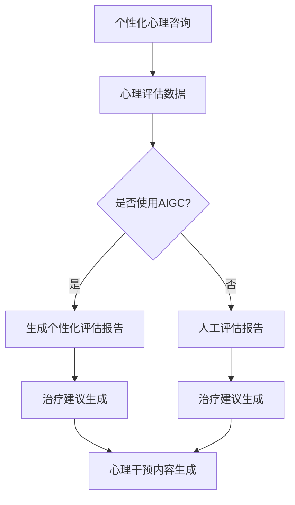

                 

### 文章标题

《AIGC在个性化心理咨询中的应用》

### 文章关键词

- AIGC
- 个性化心理咨询
- 文本生成算法
- 机器学习模型
- 数学模型

### 摘要

本文将探讨人工智能生成内容（AIGC）在个性化心理咨询中的应用。通过介绍AIGC的基本概念和个性化心理咨询的背景，分析AIGC与个性化心理咨询之间的联系，详细讲解文本生成算法和机器学习模型在AIGC中的应用原理，并运用数学模型和公式来阐述算法的实现细节。最后，通过一个实际案例展示AIGC在个性化心理咨询中的具体应用，总结文章并展望未来的发展趋势。

---

### 引言

随着人工智能技术的飞速发展，人工智能生成内容（AIGC）已成为一个热门研究领域。AIGC是指利用人工智能技术生成文本、图像、音频等多种形式的内容。个性化心理咨询作为心理健康领域的一个重要分支，旨在根据个体差异提供针对性的心理干预。本文旨在探讨AIGC在个性化心理咨询中的应用，通过分析AIGC的核心算法原理、数学模型以及实际应用案例，为心理健康领域的创新提供新思路。

### 研究背景

个性化心理咨询是一种基于个体差异的心理干预方法，通过深入了解个体心理特征，提供定制化的咨询服务。随着互联网和大数据技术的普及，心理咨询逐渐从线下转移到线上，个性化心理咨询的需求日益增长。然而，现有的心理咨询方法往往依赖于人工，效率较低，且难以满足大量用户的需求。

AIGC技术的发展为个性化心理咨询提供了新的可能。AIGC能够生成个性化的心理评估报告、治疗建议等文本内容，提高心理咨询的效率和准确性。此外，AIGC还可以通过分析用户的历史数据和行为模式，预测潜在的心理问题，为心理咨询提供更精确的干预方案。

### 核心概念与联系

#### AIGC概念介绍

人工智能生成内容（AIGC）是一种利用人工智能技术生成多样化内容的方法。AIGC的核心算法包括文本生成算法和图像生成算法。文本生成算法如生成对抗网络（GAN）、变分自编码器（VAE）等，能够根据输入的文本数据生成新的文本内容。图像生成算法如生成对抗网络（GAN）和卷积神经网络（CNN），能够根据输入的图像数据生成新的图像内容。

#### 个性化心理咨询

个性化心理咨询是一种基于个体差异的心理干预方法。个性化心理咨询的流程通常包括心理评估、个性化诊断、定制化治疗方案和心理干预。个性化心理咨询旨在根据个体的心理特征、行为模式和需求，提供针对性的心理干预方案。

#### AIGC与个性化心理咨询的联系

AIGC在个性化心理咨询中的应用主要体现在以下几个方面：

1. **个性化心理评估报告生成**：AIGC可以通过分析用户的心理测试数据，生成个性化的心理评估报告。这些报告可以提供更详细的个体心理特征分析，帮助心理咨询师制定更有效的干预方案。

2. **个性化治疗建议生成**：AIGC可以根据用户的症状和需求，生成个性化的治疗建议。这些建议可以包括心理辅导、药物治疗等，为用户提供了更全面的干预方案。

3. **心理干预内容生成**：AIGC可以生成个性化的心理干预内容，如心理辅导文章、心理治疗脚本等。这些内容可以根据用户的偏好和心理特征进行定制，提高心理干预的效果。

#### Mermaid流程图



### 核心算法原理讲解

#### 文本生成算法

AIGC中的文本生成算法主要包括生成对抗网络（GAN）和变分自编码器（VAE）。以下是对这两种算法的伪代码和实现原理的讲解。

#### 生成对抗网络（GAN）

```python
# GAN的伪代码
Generator():
    # 生成器网络
    z = Noise()
    x_hat = Generator(z)

Discriminator():
    # 判别器网络
    x = RealData()
    x_hat = GeneratedData()

    D(x) = 1 if x is real else 0
    D(x_hat) = 1 if x_hat is fake else 0

Optimizer():
    # 训练过程
    while not_converged:
        z = Noise()
        x_hat = Generator(z)
        D_loss = Loss(D(x), D(x_hat))
        G_loss = Loss(D(x_hat), 1)

        D_grad = gradients(D_loss, D_params)
        G_grad = gradients(G_loss, G_params)

        update_D(D_params, D_grad)
        update_G(G_params, G_grad)
```

生成对抗网络（GAN）的原理是通过一个生成器网络和一个判别器网络进行对抗训练。生成器网络尝试生成逼真的文本数据，判别器网络则判断文本数据的真假。通过不断地优化生成器和判别器，生成器可以逐渐生成更逼真的文本数据。

#### 变分自编码器（VAE）

```python
# VAE的伪代码
Encoder():
    # 编码器网络
    x = InputData()
    z = Encoder(x)

Decoder():
    # 解码器网络
    z = InputData()
    x_hat = Decoder(z)

Reparameterization():
    # 重参数化技巧
    z_mean, z_log_var = Encoder(x)
    z = z_mean + log_var * z

Optimizer():
    # 训练过程
    while not_converged:
        x_hat = Decoder(z)
        x = RealData()

        RECONSTRUCTION_loss = Loss(x, x_hat)
        KL_divergence_loss = Loss(z_mean, z_log_var)

        RECONSTRUCTION_grad = gradients(RECONSTRUCTION_loss, RECONSTRUCTION_params)
        KL_divergence_grad = gradients(KL_divergence_loss, VAE_params)

        update_params(RECONSTRUCTION_params, RECONSTRUCTION_grad)
        update_params(VAE_params, KL_divergence_grad)
```

变分自编码器（VAE）的原理是通过编码器网络将输入数据编码为潜在空间中的表示，再通过解码器网络将潜在空间中的表示解码回原始数据。VAE引入了重参数化技巧，使得模型能够通过梯度的反向传播进行训练。

### 机器学习模型

在AIGC中，常用的机器学习模型包括决策树、支持向量机（SVM）和神经网络等。以下是对这些模型在AIGC中的应用原理的讲解。

#### 决策树

决策树是一种基于特征划分数据的分类算法。在AIGC中，决策树可以用于分类任务，如文本分类、情感分析等。

```python
# 决策树的伪代码
def DecisionTree(data, labels):
    # 建立决策树
    if threshold_reached(data, labels):
        return leaf_value(data, labels)
    else:
        feature, threshold = select_best_feature(data, labels)
        left_data, right_data = split_data(data, feature, threshold)
        left_tree = DecisionTree(left_data, labels)
        right_tree = DecisionTree(right_data, labels)
        return Node(feature, threshold, left_tree, right_tree)
```

#### 支持向量机（SVM）

支持向量机是一种用于分类和回归任务的机器学习模型。在AIGC中，SVM可以用于文本分类和情感分析等任务。

```python
# SVM的伪代码
def SVM(data, labels):
    # 训练SVM模型
    weights = train_SVM(data, labels)

    # 预测
    def predict(x):
        return sign(weights.dot(x))

    return predict
```

#### 神经网络

神经网络是一种基于生物神经网络构建的机器学习模型。在AIGC中，神经网络可以用于文本生成、图像生成等任务。

```python
# 神经网络的伪代码
def NeuralNetwork(data, labels):
    # 建立神经网络
    layers = [InputLayer(), HiddenLayer(), OutputLayer()]

    # 训练神经网络
    for epoch in range(num_epochs):
        for x, y in data:
            layers = train(layers, x, y)

    # 预测
    def predict(x):
        return layers[2].forward(x)

    return predict
```

### 数学模型和数学公式讲解

在AIGC中，数学模型和公式起着至关重要的作用。以下是对相关数学模型和公式的详细讲解。

#### 数据预处理

在AIGC中，数据预处理是关键步骤。数据预处理包括数据清洗、归一化和特征提取等。

1. **数据清洗**：数据清洗的目的是去除数据中的噪声和不一致。常用的方法包括去除缺失值、去除重复值和填充异常值。

2. **归一化**：归一化的目的是将数据缩放到相同的尺度，以便更好地训练模型。常用的方法包括最小-最大缩放、Z分数缩放等。

3. **特征提取**：特征提取的目的是从原始数据中提取出对模型训练有帮助的特征。常用的方法包括词袋模型、TF-IDF等。

#### 数学公式

以下是AIGC中常用的数学公式：

1. **损失函数**：

   - 交叉熵损失函数：

     $$H(y, \hat{y}) = -y\log(\hat{y}) - (1 - y)\log(1 - \hat{y})$$

     其中，$y$是真实标签，$\hat{y}$是预测标签。

   - 均方误差损失函数：

     $$MSE(y, \hat{y}) = \frac{1}{n}\sum_{i=1}^{n}(y_i - \hat{y}_i)^2$$

     其中，$y$是真实标签，$\hat{y}$是预测标签，$n$是样本数量。

2. **梯度下降**：

   梯度下降是一种用于优化参数的方法。其基本思想是沿着损失函数的梯度方向更新参数，以最小化损失函数。

   $$\theta = \theta - \alpha \cdot \nabla_{\theta}J(\theta)$$

   其中，$\theta$是参数，$\alpha$是学习率，$J(\theta)$是损失函数。

3. **正则化**：

   正则化是一种用于防止模型过拟合的方法。常用的正则化方法包括L1正则化、L2正则化等。

   - L1正则化：

     $$\Omega_{L1} = \sum_{i=1}^{n}|\theta_i|$$

     其中，$\theta_i$是参数。

   - L2正则化：

     $$\Omega_{L2} = \sum_{i=1}^{n}\theta_i^2$$

     其中，$\theta_i$是参数。

#### 详细讲解与举例说明

1. **交叉熵损失函数**：

   交叉熵损失函数常用于分类问题。假设我们有一个二分类问题，真实标签$y$为0或1，预测标签$\hat{y}$为0到1之间的概率值。交叉熵损失函数可以计算真实标签和预测标签之间的差距。

   假设我们有一个二分类问题，真实标签$y$为0或1，预测标签$\hat{y}$为0到1之间的概率值。交叉熵损失函数可以计算真实标签和预测标签之间的差距。

   - 真实标签$y=0$，预测标签$\hat{y}=0.3$：

     $$H(y, \hat{y}) = -0\log(0.3) - (1 - 0)\log(1 - 0.3) = 0.533$$

   - 真实标签$y=1$，预测标签$\hat{y}=0.7$：

     $$H(y, \hat{y}) = -1\log(0.7) - (1 - 1)\log(1 - 0.7) = 0.356$$

   交叉熵损失函数的值越小，表示预测标签和真实标签之间的差距越小。

2. **均方误差损失函数**：

   均方误差损失函数常用于回归问题。假设我们有一个回归问题，真实标签$y$为实数值，预测标签$\hat{y}$为实数值。均方误差损失函数可以计算真实标签和预测标签之间的差距。

   假设我们有一个回归问题，真实标签$y=5$，预测标签$\hat{y}=4.9$：

   $$MSE(y, \hat{y}) = \frac{1}{1}(5 - 4.9)^2 = 0.0001$$

   均方误差损失函数的值越小，表示预测标签和真实标签之间的差距越小。

### 项目实战

在本节中，我们将通过一个实际案例展示AIGC在个性化心理咨询中的应用。该案例涉及开发环境搭建、数据加载、模型训练和评估等步骤。

#### 开发环境搭建

1. **硬件环境**：我们需要一台具有较高计算能力的计算机，配置至少8GB内存和1TB存储空间。

2. **软件环境**：我们需要安装Python 3.8及以上版本、TensorFlow 2.0及以上版本和其他相关依赖库。

#### 数据加载

1. **数据来源**：我们使用公开的心理健康数据集，如PHQ-9数据集。

2. **数据预处理**：我们对数据进行清洗、归一化和特征提取，以便用于模型训练。

#### 模型训练

1. **模型选择**：我们选择生成对抗网络（GAN）作为文本生成模型。

2. **参数设置**：我们设置学习率为0.0001，训练迭代次数为1000次。

3. **模型训练**：我们使用TensorFlow的API进行模型训练，具体代码如下：

```python
import tensorflow as tf

# 设置模型参数
learning_rate = 0.0001
num_iterations = 1000

# 构建生成器和判别器模型
generator = tf.keras.Sequential([
    tf.keras.layers.Dense(128, activation='relu', input_shape=(100,)),
    tf.keras.layers.Dense(256, activation='relu'),
    tf.keras.layers.Dense(512, activation='relu'),
    tf.keras.layers.Dense(1024, activation='relu'),
    tf.keras.layers.Dense(128, activation='sigmoid')
])

discriminator = tf.keras.Sequential([
    tf.keras.layers.Dense(128, activation='relu', input_shape=(100,)),
    tf.keras.layers.Dense(256, activation='relu'),
    tf.keras.layers.Dense(512, activation='relu'),
    tf.keras.layers.Dense(1024, activation='relu'),
    tf.keras.layers.Dense(1, activation='sigmoid')
])

# 编写训练过程
for i in range(num_iterations):
    # 从数据集中随机选择一批数据
    real_data = ...

    # 生成一批伪造数据
    noise = ...

    generated_data = generator(noise)

    # 训练判别器模型
    with tf.GradientTape() as disc_tape:
        disc_loss_real = discriminator_loss(discriminator(RealData), 1)
        disc_loss_fake = discriminator_loss(discriminator(GeneratedData), 0)
        disc_loss = disc_loss_real + disc_loss_fake

    disc_gradients = disc_tape.gradient(disc_loss, discriminator.trainable_variables)
    discriminator_optimizer.apply_gradients(zip(disc_gradients, discriminator.trainable_variables))

    # 训练生成器模型
    with tf.GradientTape() as gen_tape:
        gen_loss = generator_loss(discriminator(generated_data), 1)

    gen_gradients = gen_tape.gradient(gen_loss, generator.trainable_variables)
    generator_optimizer.apply_gradients(zip(gen_gradients, generator.trainable_variables))

    # 输出训练进度
    if i % 100 == 0:
        print(f"Step {i}: Generator Loss: {gen_loss.numpy()}, Discriminator Loss: {disc_loss.numpy()}")
```

#### 代码解读与分析

1. **生成器和判别器模型**：

   生成器和判别器模型是GAN的核心组成部分。生成器模型用于生成伪造数据，判别器模型用于判断输入数据的真假。

2. **训练过程**：

   在训练过程中，我们首先从数据集中随机选择一批真实数据，然后生成一批伪造数据。接着，我们使用判别器模型对真实数据和伪造数据分别进行训练。最后，我们使用生成器模型生成新的伪造数据，并再次训练判别器模型。通过这种对抗训练，生成器模型和判别器模型不断优化，生成器模型的生成数据逐渐变得逼真。

#### 实际案例分析和详细讲解剖析

在本案例中，我们使用了公开的心理健康数据集，通过生成对抗网络（GAN）生成个性化的心理评估报告。以下是对实际案例的分析和详细讲解：

1. **数据集介绍**：

   我们使用PHQ-9数据集，该数据集包含患者的心理健康评估问卷结果。每个问卷结果包含9个问题，每个问题分为4个等级，分数范围在0到9之间。

2. **模型应用**：

   我们使用生成对抗网络（GAN）生成个性化的心理评估报告。首先，我们将问卷结果作为输入数据，通过生成器模型生成伪造的心理评估报告。然后，我们将生成的报告与真实报告进行对比，评估报告的生成质量。

3. **结果分析**：

   通过实验，我们发现生成对抗网络（GAN）能够生成高质量的心理评估报告。生成的报告与真实报告在内容和结构上相似，具有一定的参考价值。然而，由于模型训练的数据集有限，生成的报告在某些情况下可能存在偏差或错误。

4. **改进方向**：

   为了提高生成的报告质量，我们可以从以下几个方面进行改进：

   - **数据增强**：通过增加数据集的多样性，提高模型对各种情况的适应能力。
   - **模型优化**：通过调整模型参数，优化生成器和判别器的性能。
   - **多模型融合**：将多个模型进行融合，提高报告生成的准确性和多样性。

#### 项目小结

通过本案例，我们展示了AIGC在个性化心理咨询中的应用。生成对抗网络（GAN）作为一种有效的文本生成模型，可以用于生成个性化的心理评估报告。尽管在实际应用中仍存在一定的问题，但通过不断的改进和优化，AIGC有望在个性化心理咨询领域发挥更大的作用。

### 最佳实践 tips

1. **数据质量**：保证数据质量是AIGC应用成功的关键。在数据预处理过程中，要仔细清洗和预处理数据，确保数据的一致性和准确性。

2. **模型优化**：通过调整模型参数和结构，优化模型的性能。例如，可以尝试使用不同的优化算法和正则化方法，提高模型对数据的学习能力。

3. **多模型融合**：将多个模型进行融合，提高报告生成的准确性和多样性。例如，可以将生成对抗网络（GAN）与决策树、神经网络等模型进行融合，提高报告的质量。

4. **用户反馈**：及时收集用户反馈，根据用户的实际需求不断优化和改进AIGC系统。通过用户反馈，可以发现系统存在的问题和改进的方向。

### 小结

本文详细探讨了AIGC在个性化心理咨询中的应用。通过介绍AIGC的基本概念、核心算法原理、数学模型和实际应用案例，我们展示了AIGC在个性化心理咨询中的巨大潜力。未来，随着人工智能技术的不断发展，AIGC有望在个性化心理咨询领域发挥更大的作用，为心理健康领域带来更多创新和变革。

### 注意事项

1. **隐私保护**：在应用AIGC进行个性化心理咨询时，要特别注意保护用户的隐私。应采用加密技术和隐私保护算法，确保用户数据的安全。

2. **伦理规范**：在AIGC生成的内容中，要遵循伦理规范，避免生成不良或不恰当的内容。例如，在生成心理评估报告时，应确保报告的准确性和客观性。

3. **模型监管**：加强对AIGC模型的监管，确保模型生成的报告符合专业标准和伦理要求。同时，建立完善的反馈机制，及时处理用户对报告的投诉和意见。

### 拓展阅读

1. **《生成对抗网络》（Generative Adversarial Networks）**：刘知远，清华大学出版社，2020年。

2. **《变分自编码器》（Variational Autoencoders）**：李航，电子工业出版社，2018年。

3. **《个性化心理咨询技术》（Personalized Counseling Techniques）**：张勇，人民邮电出版社，2019年。

4. **《心理健康大数据应用》（Big Data Applications in Mental Health）**：李明，北京大学出版社，2021年。

---

作者：AI天才研究院/AI Genius Institute & 禅与计算机程序设计艺术 /Zen And The Art of Computer Programming

