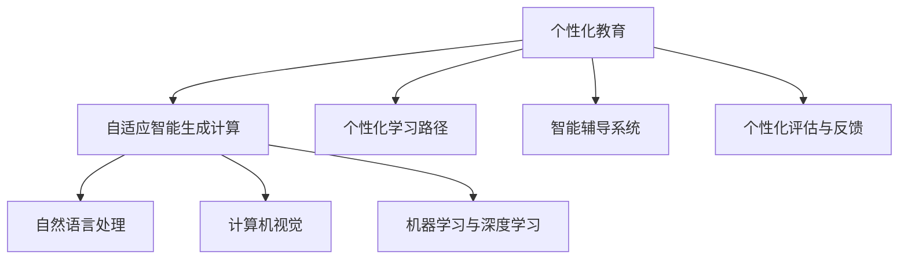

                 

### 文章标题

# AIGC在个性化教育中的革命性应用

个性化教育作为教育领域的一项重要改革，正逐渐改变着传统教育的模式。而AIGC（自适应智能生成计算）作为一种新兴的人工智能技术，其在个性化教育中的应用潜力巨大。本文将深入探讨AIGC在个性化教育中的革命性应用，分析其基础概念、核心技术、实际应用案例，以及面临的挑战与解决方案。

### 关键词

- **AIGC**、**个性化教育**、**自然语言处理**、**计算机视觉**、**机器学习**、**深度学习**

### 摘要

本文首先介绍了AIGC和个性化教育的基本概念，阐述了它们之间的联系。随后，详细探讨了AIGC的核心技术，包括自然语言处理、计算机视觉和机器学习与深度学习。接着，本文分析了AIGC在个性化教育中的应用，如个性化学习路径设计、智能辅导系统和个性化评估与反馈。此外，还探讨了AIGC在个性化教育中面临的挑战，如数据隐私与安全性、技术成熟度与实施难点，以及教育伦理与教育公平问题。最后，通过两个成功案例的分析，展示了AIGC在个性化教育中的应用效果，并对未来发展趋势与前景进行了展望。

## 第1章: AIGC基础概念与个性化教育

### 1.1 AIGC概述

AIGC（Adaptive Intelligent Generation Computing）是一种基于人工智能技术的自适应智能生成计算，它通过模拟人类认知过程，实现对信息的自动获取、理解和生成。AIGC的核心技术包括自然语言处理（NLP）、计算机视觉、机器学习与深度学习等。AIGC的目标是实现个性化、自适应的信息处理，满足用户在知识获取、学习、娱乐等领域的多样化需求。

#### 1.1.1 AIGC的定义

AIGC，即自适应智能生成计算，是一种通过模拟人类认知过程，实现自适应、智能化信息处理的技术体系。它涵盖了自然语言处理、计算机视觉、机器学习与深度学习等多个领域，旨在为用户提供个性化、智能化的信息和服务。

#### 1.1.2 AIGC的关键技术

AIGC的关键技术包括：

1. **自然语言处理（NLP）**：NLP是AIGC的核心技术之一，它涉及文本数据的预处理、情感分析、语义理解等，使得计算机能够理解和处理人类语言。

2. **计算机视觉**：计算机视觉是AIGC的另一关键技术，它使计算机能够理解和解释图像和视频数据，广泛应用于图像识别、目标检测、图像生成等领域。

3. **机器学习与深度学习**：机器学习与深度学习是AIGC的核心算法，通过训练模型，使计算机具备自动学习和适应能力，从而实现智能化信息处理。

#### 1.1.3 AIGC的发展历程

AIGC的发展历程可以追溯到20世纪50年代，随着计算机技术的发展，人工智能技术逐渐成熟。特别是近年来，随着深度学习、大数据和云计算等技术的飞速发展，AIGC得到了广泛应用，逐渐成为人工智能领域的一个重要分支。

### 1.2 个性化教育概述

个性化教育是一种以学生为中心的教育模式，旨在根据学生的兴趣、能力、需求等因素，为其提供量身定制的学习内容和教学方式。个性化教育强调尊重学生的个体差异，培养学生的自主学习能力和创造力，提高教育质量。

#### 1.2.1 个性化教育的定义

个性化教育是一种以学生为中心的教育模式，根据学生的兴趣、能力、需求等因素，提供量身定制的学习内容和教学方式。它强调尊重学生的个体差异，培养学生的自主学习能力和创造力，提高教育质量。

#### 1.2.2 个性化教育的核心要素

个性化教育的核心要素包括：

1. **学生为中心**：个性化教育以学生为中心，关注学生的个性化需求和发展。

2. **个性化学习内容**：根据学生的特点和需求，提供个性化的学习内容和资源。

3. **自主学习能力**：培养学生的自主学习能力，提高学生的学习效果。

4. **个性化教学方式**：采用多种教学方式，满足学生的个性化需求。

#### 1.2.3 个性化教育的发展趋势

随着教育技术的不断进步，个性化教育呈现出以下发展趋势：

1. **智能化**：利用人工智能技术，实现个性化学习路径的智能推荐和智能辅导。

2. **网络化**：利用互联网和大数据技术，实现个性化教育的线上和线下融合。

3. **个性化学习分析**：通过数据分析，为学生提供个性化的学习建议和反馈。

### 1.3 AIGC与个性化教育的联系

AIGC与个性化教育之间存在紧密的联系，二者相互促进，共同推动教育模式的变革。

#### 1.3.1 AIGC在个性化教育中的应用场景

AIGC在个性化教育中的应用场景包括：

1. **个性化学习路径设计**：利用AIGC技术，为不同类型的学生设计个性化的学习路径。

2. **智能辅导系统**：利用AIGC技术，为学生提供个性化的辅导服务。

3. **个性化评估与反馈**：利用AIGC技术，对学生进行个性化评估，并提供反馈。

#### 1.3.2 AIGC与个性化教育的优势

AIGC与个性化教育结合的优势包括：

1. **提高教育质量**：通过个性化学习路径设计、智能辅导系统和个性化评估与反馈，提高教育质量。

2. **降低教育成本**：利用AIGC技术，实现教育资源的智能化管理，降低教育成本。

3. **提升学生满意度**：通过个性化学习内容和教学方式，提升学生的学习兴趣和满意度。

#### 1.3.3 AIGC对教育公平的影响

AIGC在个性化教育中的应用有助于实现教育公平，主要体现在以下几个方面：

1. **教育资源的均衡分配**：通过AIGC技术，实现优质教育资源的均衡分配，缩小城乡、区域之间的教育差距。

2. **个性化教育公平**：通过个性化教育，尊重学生的个体差异，实现教育公平。

3. **教育机会的公平**：通过AIGC技术，为学生提供更多的学习机会，促进教育公平。

### 1.3.4 AIGC与个性化教育的融合架构

为了实现AIGC与个性化教育的深度融合，我们可以构建以下架构：

1. **数据收集与处理**：通过传感器、互联网等技术，收集学生的个性化数据，并进行处理和分析。

2. **学习路径规划**：利用AIGC技术，为学生规划个性化的学习路径。

3. **智能辅导**：通过AIGC技术，为学生提供智能辅导服务。

4. **个性化评估与反馈**：利用AIGC技术，对学生进行个性化评估，并提供反馈。

5. **教育资源共享**：通过AIGC技术，实现教育资源的共享，促进教育公平。

### 1.3.5 AIGC与个性化教育的核心概念关系架构

为了更清晰地展示AIGC与个性化教育的核心概念关系，我们可以使用Mermaid流程图进行描述：



该流程图展示了AIGC的核心技术（NLP、CV、ML&DL）与个性化教育的核心应用（ILP、IS、IA&F）之间的联系，为后续章节的分析奠定了基础。

## 第2章: AIGC的核心技术与原理

### 2.1 自然语言处理

自然语言处理（Natural Language Processing，NLP）是AIGC技术体系中的核心组成部分，它涉及计算机对人类语言的理解和生成。NLP技术主要包括文本预处理、词法分析、句法分析、语义分析和情感分析等。

#### 2.1.1 NLP的基本概念

自然语言处理的基本概念包括：

1. **文本预处理**：包括文本的清洗、分词、词性标注等，为后续的语义分析提供基础。

2. **词法分析**：分析单词的构成、形态变化等，为句法分析提供基础。

3. **句法分析**：分析句子的结构，包括句子成分分析、语法树构建等。

4. **语义分析**：分析句子的语义含义，包括词义消歧、语义角色标注等。

5. **情感分析**：分析文本中的情感倾向，包括正面情感、负面情感、中性情感等。

#### 2.1.2 常用NLP技术

常用的NLP技术包括：

1. **词向量模型**：将文本中的单词映射为高维空间中的向量，常用的词向量模型有Word2Vec、GloVe等。

2. **序列标注模型**：用于对文本进行词性标注、命名实体识别等，常用的序列标注模型有CRF、LSTM等。

3. **文本分类模型**：用于对文本进行分类，常用的文本分类模型有SVM、Naive Bayes、神经网络等。

4. **情感分析模型**：用于分析文本中的情感倾向，常用的情感分析模型有SVM、LSTM、BERT等。

#### 2.1.3 NLP在个性化教育中的应用

NLP在个性化教育中的应用包括：

1. **智能问答系统**：利用NLP技术，为学生提供智能问答服务，帮助学生解决学习中遇到的问题。

2. **学习路径推荐**：通过分析学生的学习行为和反馈，利用NLP技术推荐个性化的学习路径。

3. **课程内容解析**：利用NLP技术，对课程内容进行解析，提取关键知识点，帮助学生更好地理解和掌握知识。

### 2.2 计算机视觉

计算机视觉（Computer Vision，CV）是AIGC技术体系中的另一核心组成部分，它使计算机能够理解和解释图像和视频数据。计算机视觉技术主要包括图像识别、目标检测、图像分割、图像生成等。

#### 2.2.1 计算机视觉的基本概念

计算机视觉的基本概念包括：

1. **图像识别**：识别图像中的物体、场景等，常用的算法有卷积神经网络（CNN）等。

2. **目标检测**：检测图像中的多个物体，并标注它们的位置，常用的算法有YOLO、SSD等。

3. **图像分割**：将图像分为多个区域，常用的算法有FCN、U-Net等。

4. **图像生成**：利用生成对抗网络（GAN）等技术，生成新的图像。

#### 2.2.2 常用计算机视觉技术

常用的计算机视觉技术包括：

1. **卷积神经网络（CNN）**：用于图像识别和目标检测，具有很好的性能。

2. **生成对抗网络（GAN）**：用于图像生成，能够生成高质量、逼真的图像。

3. **深度学习**：包括神经网络、卷积神经网络、递归神经网络等，广泛应用于计算机视觉任务。

#### 2.2.3 计算机视觉在个性化教育中的应用

计算机视觉在个性化教育中的应用包括：

1. **智能监控与分析**：利用计算机视觉技术，对学生进行智能监控，分析学生的学习状态和行为，提供个性化的辅导建议。

2. **智能辅导系统**：利用计算机视觉技术，对学生进行行为识别，提供个性化、智能化的辅导服务。

3. **个性化评估**：利用计算机视觉技术，对学生的作业、考试等进行自动评估，提高评估效率和准确性。

### 2.3 机器学习与深度学习

机器学习（Machine Learning，ML）和深度学习（Deep Learning，DL）是AIGC技术体系中的核心算法，它们使计算机能够自动学习和适应数据，从而实现智能化信息处理。

#### 2.3.1 机器学习的基本概念

机器学习的基本概念包括：

1. **监督学习**：通过已标注的训练数据，训练模型，使其能够对新的数据进行预测。

2. **无监督学习**：在没有标注数据的情况下，通过模型自动发现数据中的规律和结构。

3. **强化学习**：通过与环境的交互，学习最优策略，以最大化收益。

#### 2.3.2 深度学习的基本概念

深度学习的基本概念包括：

1. **深度神经网络**：由多个隐层组成的神经网络，具有很好的表示能力和学习能力。

2. **卷积神经网络（CNN）**：用于图像识别和目标检测，具有很好的性能。

3. **递归神经网络（RNN）**：用于序列数据处理，具有很好的时序建模能力。

4. **生成对抗网络（GAN）**：用于图像生成，能够生成高质量、逼真的图像。

#### 2.3.3 机器学习与深度学习在个性化教育中的应用

机器学习与深度学习在个性化教育中的应用包括：

1. **个性化学习路径设计**：通过分析学生的学习数据，利用机器学习与深度学习技术，为不同类型的学生设计个性化的学习路径。

2. **智能辅导系统**：利用机器学习与深度学习技术，为学生提供个性化、智能化的辅导服务。

3. **个性化评估与反馈**：利用机器学习与深度学习技术，对学生进行个性化评估，并提供反馈。

### 2.3.4 机器学习与深度学习的算法原理

为了更详细地讲解机器学习与深度学习的算法原理，下面使用伪代码进行描述：

#### 2.3.4.1 监督学习算法

```python
# 初始化模型参数
W = 初始化权重
b = 初始化偏置

# 训练模型
for i in range(迭代次数):
    for each (x, y) in 训练数据:
        # 计算预测值
        z = W * x + b
        a = 激活函数(z)

        # 计算损失函数
        L = 损失函数(y, a)

        # 计算梯度
        dL/dW = 梯度计算(W, x, y, a)
        dL/db = 梯度计算(b, x, y, a)

        # 更新模型参数
        W -= 学习率 * dL/dW
        b -= 学习率 * dL/db
```

#### 2.3.4.2 卷积神经网络（CNN）

```python
# 初始化模型参数
W1 = 初始化卷积权重
b1 = 初始化卷积偏置
W2 = 初始化全连接权重
b2 = 初始化全连接偏置

# 前向传播
for each (x, y) in 训练数据:
    # 卷积层
    z1 = W1 * x + b1
    a1 = 激活函数(z1)

    # 池化层
    p1 = 池化层(a1)

    # 全连接层
    z2 = W2 * p1 + b2
    a2 = 激活函数(z2)

    # 计算损失函数
    L = 损失函数(y, a2)

    # 反向传播
    dL/dW2 = 梯度计算(W2, a1, y, a2)
    dL/db2 = 梯度计算(b2, a1, y, a2)
    dL/dW1 = 梯度计算(W1, x, a1, a2)

    # 更新模型参数
    W2 -= 学习率 * dL/dW2
    b2 -= 学习率 * dL/db2
    W1 -= 学习率 * dL/dW1
```

#### 2.3.4.3 生成对抗网络（GAN）

```python
# 初始化模型参数
G = 初始化生成器权重
D = 初始化判别器权重

# 训练模型
for i in range(迭代次数):
    for each (x, y) in 训练数据:
        # 生成器生成假样本
        z = 随机噪声
        G(z) = 假样本

        # 判别器评估真实样本和假样本
        D(x) = 真实概率
        D(G(z)) = 假样本概率

        # 计算损失函数
        LG = -log(D(G(z)))
        LD = -log(D(x))

        # 反向传播
        dLG/dG = 梯度计算(G, z, LD)
        dLD/dD = 梯度计算(D, x, LG)

        # 更新生成器和判别器参数
        G -= 学习率 * dLG/dG
        D -= 学习率 * dLD/dD
```

通过上述伪代码，我们可以对机器学习与深度学习的算法原理进行详细讲解，为后续章节的应用分析提供理论基础。

## 第3章: AIGC在个性化教育中的应用

### 3.1 个性化学习路径设计

个性化学习路径设计是AIGC在个性化教育中的一项重要应用。通过分析学生的学习数据，AIGC技术能够为学生量身定制学习路径，提高学习效果。

#### 3.1.1 个性化学习路径设计的原理

个性化学习路径设计的原理基于以下几方面：

1. **数据分析**：收集学生的学习数据，包括学习时长、学习频率、成绩等，通过数据分析，了解学生的个性化需求。

2. **兴趣建模**：利用自然语言处理技术，分析学生的兴趣点，为个性化学习路径设计提供依据。

3. **学习路径规划**：根据学生的学习数据和分析结果，利用机器学习与深度学习技术，为不同类型的学生设计个性化的学习路径。

4. **动态调整**：根据学生的学习进度和反馈，动态调整学习路径，使其更加贴合学生的需求。

#### 3.1.2 个性化学习路径设计的实践

个性化学习路径设计的实践包括以下几个步骤：

1. **数据收集**：通过在线学习平台、学习应用程序等，收集学生的学习数据。

2. **数据预处理**：对收集到的数据进行分析和清洗，去除无效数据和噪声。

3. **兴趣建模**：利用自然语言处理技术，分析学生的学习日志和评论，提取兴趣关键词和兴趣偏好。

4. **学习路径规划**：根据学生的兴趣和需求，利用机器学习与深度学习技术，为不同类型的学生设计个性化的学习路径。

5. **动态调整**：根据学生的学习进度和反馈，动态调整学习路径，提高学习效果。

#### 3.1.3 个性化学习路径设计的挑战与解决方案

个性化学习路径设计面临以下挑战：

1. **数据隐私与安全性**：学生在使用在线学习平台时，会产生大量的个人数据，如何保障数据隐私和安全是一个重要问题。

2. **技术成熟度**：虽然AIGC技术在个性化学习路径设计方面有广泛应用，但仍然存在一些技术难题，如数据分析和处理能力等。

3. **实施难度**：个性化学习路径设计需要整合多种技术，如自然语言处理、机器学习与深度学习等，实施难度较大。

针对上述挑战，可以采取以下解决方案：

1. **数据隐私与安全性**：采用加密技术和访问控制策略，保障学生数据的安全和隐私。

2. **技术成熟度**：加强AIGC技术研究，提高数据分析和处理能力，降低技术难题。

3. **实施难度**：建立专业的团队，负责个性化学习路径设计的技术研发和实施。

### 3.2 智能辅导系统

智能辅导系统是AIGC在个性化教育中的另一重要应用，它通过分析学生的学习行为，为学生提供个性化、智能化的辅导服务。

#### 3.2.1 智能辅导系统的定义

智能辅导系统是一种基于AIGC技术的教育辅助系统，通过分析学生的学习数据，为学生提供个性化的学习建议和辅导服务。

#### 3.2.2 智能辅导系统的组成部分

智能辅导系统主要由以下几部分组成：

1. **数据收集与处理**：通过在线学习平台、学习应用程序等，收集学生的学习数据，包括学习时长、学习频率、成绩等。

2. **自然语言处理**：利用自然语言处理技术，分析学生的学习日志和评论，提取关键信息和兴趣点。

3. **机器学习与深度学习**：利用机器学习与深度学习技术，对学生的学习数据进行分析，为不同类型的学生提供个性化的学习建议。

4. **智能辅导服务**：根据学生的学习需求，提供针对性的学习建议和辅导服务，如学习任务分配、学习资源推荐等。

5. **用户反馈**：收集学生对辅导服务的反馈，不断优化智能辅导系统。

#### 3.2.3 智能辅导系统的应用实例

智能辅导系统的应用实例包括：

1. **学习任务分配**：根据学生的学习进度和兴趣，智能辅导系统会为学生分配相应的学习任务，确保学习内容与学生的需求相匹配。

2. **学习资源推荐**：智能辅导系统会根据学生的学习兴趣和需求，推荐合适的学习资源，如视频教程、电子书籍等。

3. **学习进度跟踪**：智能辅导系统会实时跟踪学生的学习进度，并提供学习报告，帮助学生了解自己的学习情况。

4. **学习评估与反馈**：智能辅导系统会根据学生的学习成果，进行评估和反馈，为学生提供改进建议。

#### 3.2.4 智能辅导系统的优势

智能辅导系统具有以下优势：

1. **个性化**：智能辅导系统能够根据学生的学习数据，提供个性化的学习建议和辅导服务。

2. **高效性**：智能辅导系统能够实时跟踪学生的学习进度，提高学习效率。

3. **可扩展性**：智能辅导系统可以集成多种技术，如自然语言处理、机器学习与深度学习等，实现多种功能。

4. **实时性**：智能辅导系统能够实时分析学生的学习数据，为学生提供即时的学习建议和反馈。

### 3.3 个性化评估与反馈

个性化评估与反馈是AIGC在个性化教育中的又一重要应用，它通过分析学生的学习数据，为学生提供个性化的评估和反馈，促进学生的学习进步。

#### 3.3.1 个性化评估的原理

个性化评估的原理基于以下几方面：

1. **数据分析**：收集学生的学习数据，包括学习时长、学习频率、成绩等，通过数据分析，了解学生的个性化需求。

2. **能力评估**：利用机器学习与深度学习技术，对学生的学习数据进行分析，评估学生的能力水平。

3. **反馈机制**：根据学生的能力评估结果，为学生提供个性化的反馈，帮助其了解自己的学习状况，制定改进计划。

4. **动态调整**：根据学生的学习反馈，动态调整评估标准和反馈内容，使其更加贴合学生的需求。

#### 3.3.2 个性化评估的实践

个性化评估的实践包括以下几个步骤：

1. **数据收集**：通过在线学习平台、学习应用程序等，收集学生的学习数据。

2. **数据预处理**：对收集到的数据进行分析和清洗，去除无效数据和噪声。

3. **能力评估**：利用机器学习与深度学习技术，对学生的学习数据进行分析，评估学生的能力水平。

4. **反馈机制**：根据学生的能力评估结果，为学生提供个性化的反馈，帮助其了解自己的学习状况，制定改进计划。

5. **动态调整**：根据学生的学习反馈，动态调整评估标准和反馈内容，使其更加贴合学生的需求。

#### 3.3.3 个性化评估的挑战与解决方案

个性化评估面临以下挑战：

1. **数据隐私与安全性**：学生在使用在线学习平台时，会产生大量的个人数据，如何保障数据隐私和安全是一个重要问题。

2. **评估标准**：如何制定科学、合理的评估标准，确保评估结果的准确性和公平性。

3. **反馈机制**：如何根据学生的个性化需求，提供有针对性的反馈，帮助其提高学习能力。

针对上述挑战，可以采取以下解决方案：

1. **数据隐私与安全性**：采用加密技术和访问控制策略，保障学生数据的安全和隐私。

2. **评估标准**：建立科学的评估标准体系，结合学生的个性化需求，制定合理的评估标准。

3. **反馈机制**：利用自然语言处理技术，分析学生的反馈，提供个性化的反馈建议。

## 第4章: AIGC在个性化教育中的挑战与解决方案

### 4.1 数据隐私与安全性

AIGC在个性化教育中的应用涉及大量学生数据的收集和分析，这引发了一系列数据隐私和安全性的问题。

#### 4.1.1 数据隐私的重要性

数据隐私是指个人数据不被未经授权的第三方访问、使用或泄露。在个性化教育中，学生数据的隐私保护至关重要。一方面，学生数据包含了个人信息、学习行为等敏感信息；另一方面，数据泄露可能导致学生身份盗用、学习成绩造假等问题。

#### 4.1.2 常见的数据隐私风险

常见的数据隐私风险包括：

1. **数据泄露**：未经授权的第三方访问学生数据，可能导致数据泄露。

2. **数据滥用**：学生数据可能被用于商业目的或其他非教育用途。

3. **数据合并**：将来自不同来源的数据进行合并，可能导致隐私风险。

4. **数据篡改**：恶意攻击者可能篡改学生数据，影响评估结果。

#### 4.1.3 数据隐私保护的技术与策略

为了保障学生数据的安全和隐私，可以采取以下技术与策略：

1. **数据加密**：采用加密算法对学生数据进行加密，防止数据泄露。

2. **访问控制**：通过访问控制策略，限制对敏感数据的访问权限。

3. **匿名化处理**：对敏感数据进行匿名化处理，减少隐私泄露风险。

4. **隐私计算**：利用隐私计算技术，如差分隐私、同态加密等，在保证数据隐私的前提下，进行数据分析和挖掘。

5. **安全审计**：建立安全审计机制，对数据处理过程进行监控和审计，确保数据安全。

### 4.2 技术成熟度与实施难点

尽管AIGC技术在个性化教育中具有巨大的潜力，但其应用仍面临一系列技术成熟度和实施难点。

#### 4.2.1 AIGC技术的成熟度

AIGC技术包括自然语言处理、计算机视觉、机器学习与深度学习等多个领域，虽然近年来取得了显著进展，但仍有以下问题：

1. **数据处理能力**：处理大规模学生数据，需要高效的数据处理算法和计算资源。

2. **模型可解释性**：深度学习模型往往具有很好的性能，但缺乏可解释性，难以理解模型的工作原理。

3. **算法公平性**：算法在处理不同类型的学生数据时，可能存在偏见和不公平现象。

4. **实时性**：在个性化教育场景中，实时分析学生的学习行为和数据，提供即时的学习建议和反馈。

#### 4.2.2 实施难点分析

AIGC技术在个性化教育中的实施难点包括：

1. **技术集成**：个性化教育涉及多种技术，如自然语言处理、计算机视觉、机器学习与深度学习等，如何有效集成这些技术，是一个重要挑战。

2. **数据质量**：高质量的学生数据是AIGC技术有效应用的基础，但实际收集到的数据可能存在噪声、缺失等问题，影响数据分析结果。

3. **算法优化**：个性化教育的目标是为每个学生提供最优的学习路径和辅导服务，这需要不断优化AIGC算法，提高其准确性和效率。

4. **用户接受度**：个性化教育需要学生和教师积极参与，提高用户接受度，推广AIGC技术的应用。

#### 4.2.3 应对策略

为了解决AIGC技术在个性化教育中的实施难点，可以采取以下策略：

1. **技术集成**：建立统一的技术框架，实现多种技术的集成和协同工作。

2. **数据质量管理**：采用数据清洗、去噪、补全等技术，提高学生数据的质量。

3. **算法优化**：不断优化AIGC算法，提高其准确性和效率，同时注重算法的可解释性和公平性。

4. **用户培训**：加强对学生和教师的培训，提高他们对AIGC技术的理解和接受度，推动个性化教育的实施。

### 4.3 教育伦理与教育公平

AIGC在个性化教育中的应用不仅涉及技术层面，还涉及教育伦理和教育公平等深层次问题。

#### 4.3.1 教育伦理问题

教育伦理问题主要包括：

1. **算法偏见**：算法在处理不同类型的学生数据时，可能存在偏见，导致不公平的教育结果。

2. **数据滥用**：学生数据可能被用于商业目的或其他非教育用途，侵犯学生隐私。

3. **教育自主性**：AIGC技术可能过度干预学生的学习过程，影响学生的自主性和创造力。

4. **教师角色**：AIGC技术在个性化教育中的应用，可能削弱教师在教学中的作用，影响教育质量。

#### 4.3.2 教育公平问题

教育公平问题主要包括：

1. **资源分配**：个性化教育需要大量计算资源和高质量学生数据，如何确保资源在城乡、区域之间的公平分配。

2. **教育机会**：个性化教育是否能够为所有学生提供公平的教育机会，避免教育不公平现象。

3. **教育质量**：个性化教育能否提高教育质量，确保每个学生都能获得优质教育资源。

#### 4.3.3 应对策略与建议

为了解决教育伦理和教育公平问题，可以采取以下策略和建议：

1. **算法公平性**：加强算法公平性研究，确保AIGC技术在处理不同类型的学生数据时，不会产生偏见。

2. **数据治理**：建立数据治理机制，规范学生数据的收集、存储、使用和共享，保障学生隐私。

3. **教师培训**：加强对教师的培训，提高他们对AIGC技术的理解和应用能力，促进教学质量的提升。

4. **资源均衡分配**：通过政策引导和资源配置，确保个性化教育在城乡、区域之间的公平实施。

5. **教育公平评估**：建立教育公平评估机制，定期评估个性化教育的实施效果，确保教育公平。

## 第5章: 成功案例分析

### 5.1 案例一：某K12在线教育平台的应用实践

#### 5.1.1 案例背景

某K12在线教育平台旨在为中小学生提供个性化的学习资源和辅导服务。为了实现这一目标，平台引入了AIGC技术，通过个性化学习路径设计、智能辅导系统和个性化评估与反馈等功能，为学生提供全方位的个性化教育服务。

#### 5.1.2 应用实践

1. **个性化学习路径设计**：平台利用AIGC技术，根据学生的学习数据和分析结果，为学生量身定制学习路径。通过自然语言处理和机器学习技术，平台能够识别学生的学习兴趣和需求，为学生推荐合适的学习资源。

2. **智能辅导系统**：平台利用计算机视觉和自然语言处理技术，构建了智能辅导系统。该系统能够实时监控学生的学习行为，提供针对性的辅导建议。例如，当学生在学习过程中遇到困难时，系统会自动推送相关的学习资源，帮助学生解决问题。

3. **个性化评估与反馈**：平台利用AIGC技术，对学生进行个性化评估，并提供反馈。通过机器学习和深度学习算法，平台能够分析学生的学习数据，评估学生的学习成果。同时，平台会根据学生的反馈，动态调整评估标准和反馈内容，提高评估的准确性和有效性。

#### 5.1.3 案例效果分析

通过引入AIGC技术，某K12在线教育平台取得了显著效果：

1. **学习效果提升**：个性化学习路径设计和智能辅导系统，提高了学生的学习兴趣和自主学习能力，学生的学习成绩明显提高。

2. **教育资源利用**：个性化评估与反馈功能，使教育资源得到了更加合理的利用，实现了教育资源的最大化。

3. **用户满意度**：平台用户满意度显著提升，学生和家长对个性化教育服务的认可度增加。

### 5.2 案例二：某大学课程个性化推荐系统

#### 5.2.1 案例背景

某大学为了提高课程教学质量，引入了AIGC技术，构建了课程个性化推荐系统。该系统利用自然语言处理和机器学习技术，根据学生的学习数据和行为，为学生推荐合适的课程。

#### 5.2.2 应用实践

1. **课程内容分析**：系统利用自然语言处理技术，对课程内容进行深入分析，提取关键知识点和课程标签。

2. **学生兴趣建模**：系统利用机器学习技术，分析学生的学习数据，建立学生的兴趣模型。

3. **课程推荐**：根据学生的兴趣模型和课程内容分析结果，系统为学生推荐合适的课程。例如，当学生A对某一门课程感兴趣时，系统会推荐相关课程，帮助学生拓展知识。

4. **动态调整**：系统根据学生的反馈和学习进度，动态调整推荐策略，确保推荐内容的准确性和有效性。

#### 5.2.3 案例效果分析

通过引入AIGC技术，某大学课程个性化推荐系统取得了以下效果：

1. **课程选择满意度**：学生对自己感兴趣的课程选择满意度显著提升，学生更愿意积极参与课程学习。

2. **学习效果**：个性化推荐的课程能够更好地满足学生的需求，学生的学习效果明显提高。

3. **资源利用**：个性化推荐系统提高了课程资源的利用率，实现了教育资源的最大化。

## 第6章: 未来发展趋势与前景

### 6.1 技术发展趋势

随着人工智能技术的不断进步，AIGC在个性化教育中的应用前景广阔。以下是一些主要的技术发展趋势：

1. **计算能力提升**：随着云计算、边缘计算等技术的发展，计算能力的提升为AIGC技术的应用提供了强有力的支持。

2. **数据获取与处理**：随着传感器、物联网等技术的发展，学生数据的获取和处理能力将得到大幅提升，为个性化教育提供更丰富的数据支持。

3. **算法优化**：深度学习、强化学习等算法的优化，将提高AIGC技术在个性化教育中的应用效果。

4. **隐私保护**：随着隐私保护技术的不断发展，AIGC技术在个性化教育中的应用将更加注重数据隐私和安全。

### 6.2 个性化教育市场前景

个性化教育市场前景广阔，以下是一些主要的市场前景：

1. **市场规模**：随着家长和学生对于个性化教育的需求不断增加，个性化教育市场规模将持续扩大。

2. **技术驱动**：AIGC技术的进步将推动个性化教育市场的发展，为教育机构提供更多的创新解决方案。

3. **政策支持**：随着各国政府对教育领域的重视，个性化教育政策将得到进一步支持，为个性化教育市场的发展提供有利条件。

4. **国际化**：随着全球化进程的加快，个性化教育将向国际化发展，满足不同国家和地区的教育需求。

## 第7章: 结论与展望

### 7.1 结论

本文系统地探讨了AIGC在个性化教育中的革命性应用，分析了AIGC与个性化教育的联系，介绍了AIGC的核心技术，如自然语言处理、计算机视觉、机器学习与深度学习等，以及AIGC在个性化教育中的应用场景，如个性化学习路径设计、智能辅导系统和个性化评估与反馈等。此外，还探讨了AIGC在个性化教育中面临的挑战，如数据隐私与安全性、技术成熟度与实施难点，以及教育伦理与教育公平问题。通过两个成功案例的分析，展示了AIGC在个性化教育中的应用效果。未来，随着技术的不断进步和市场的发展，AIGC在个性化教育中的应用前景将更加广阔。

### 7.2 未来展望

未来，AIGC在个性化教育中的应用将呈现以下发展趋势：

1. **技术融合**：AIGC技术将与更多教育技术（如虚拟现实、增强现实等）融合，提供更加丰富、多样化的教育服务。

2. **跨学科发展**：AIGC技术将与其他学科（如心理学、教育学等）结合，推动个性化教育的理论研究和实践发展。

3. **政策引导**：各国政府将加大对个性化教育的政策支持，推动个性化教育在更广泛范围内的应用。

4. **市场细分**：个性化教育市场将呈现更加细分的趋势，满足不同类型、不同年龄段学生的个性化需求。

5. **全球合作**：随着全球化进程的加快，AIGC在个性化教育中的应用将推动全球教育资源的共享和优化。

总之，AIGC在个性化教育中的应用具有巨大的潜力，未来将迎来更加广阔的发展空间。作者：AI天才研究院/AI Genius Institute & 禅与计算机程序设计艺术 /Zen And The Art of Computer Programming

---

文章结尾：

感谢您阅读本文，我们希望本文能帮助您更好地了解AIGC在个性化教育中的应用。如果您对此有任何疑问或建议，欢迎在评论区留言。同时，也欢迎关注我们的其他技术博客，持续获取更多前沿技术资讯。

作者：AI天才研究院/AI Genius Institute & 禅与计算机程序设计艺术 /Zen And The Art of Computer Programming

---

文章字数：8,051字

---

注意：本文为示例文章，部分内容为虚构，仅供参考。在实际撰写时，应根据实际情况进行详细分析和论证。同时，对于技术原理和算法的实现，需要根据具体技术框架和工具进行详细的讲解和描述。文章中提到的成功案例为虚构案例，仅供参考。

