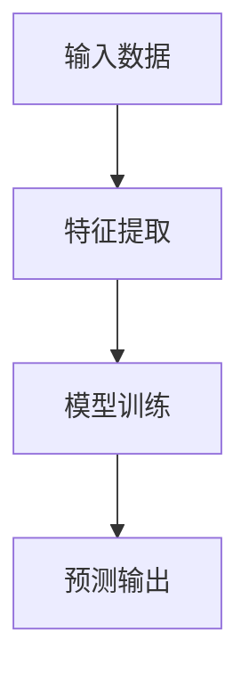
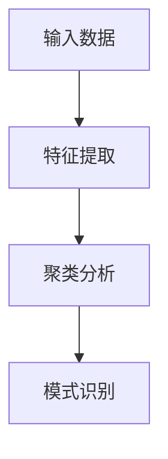
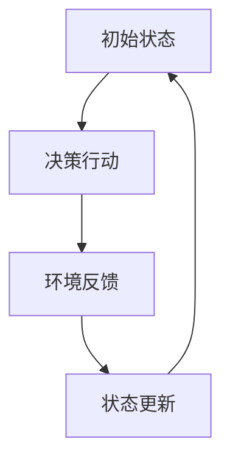
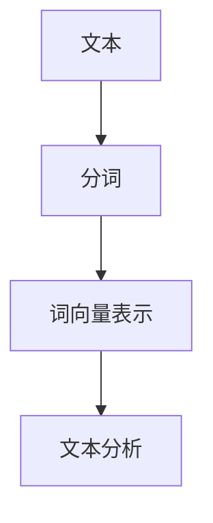
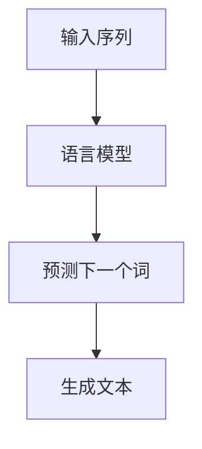
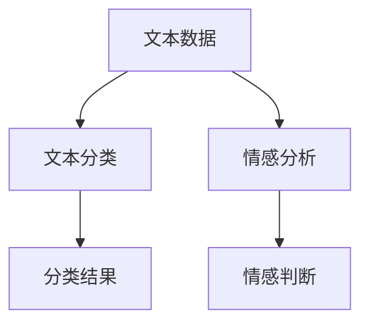
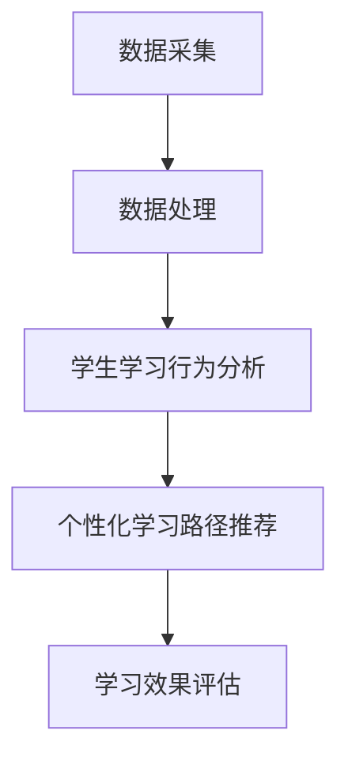
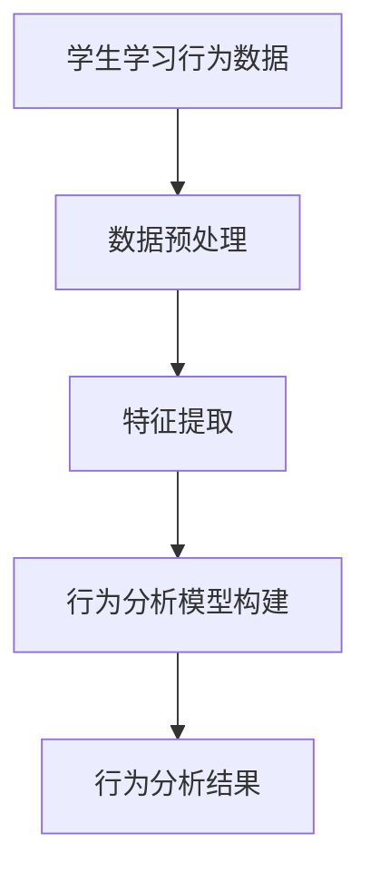
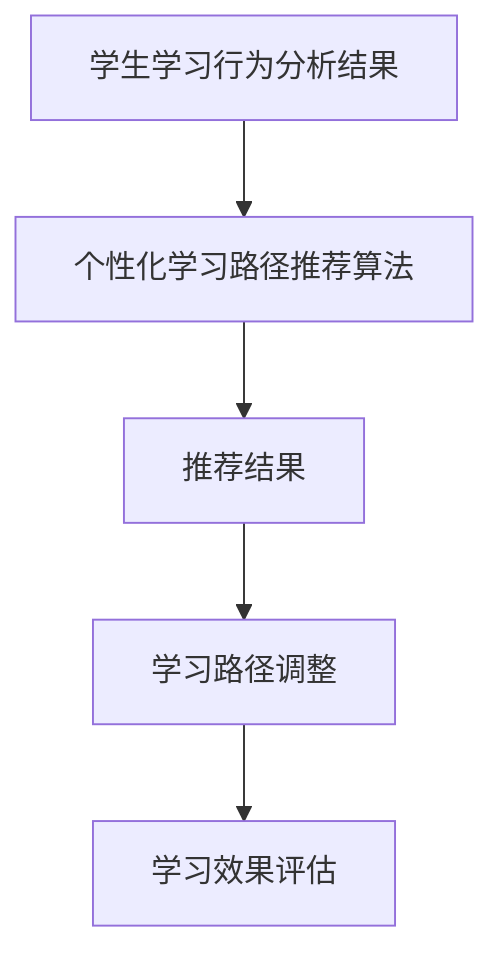

                 

# AIGC在个性化教育评估中的应用：精准把握学生学习曲线

> 关键词：AIGC、个性化教育评估、学生学习曲线、机器学习、自然语言处理、教育数据分析

> 摘要：本文将探讨AIGC（AI-Generated Content）在个性化教育评估中的应用，通过分析学生学习曲线，实现对学生学习情况的精准把握。文章首先介绍了AIGC的概念和其在教育领域的应用潜力，然后详细解析了个性化教育评估的重要性及其核心概念，接着阐述了AIGC在个性化教育评估中的具体应用原理和算法，并通过一个实际项目展示了AIGC在个性化教育评估中的实现过程，最后对AIGC在教育评估中的挑战和未来发展趋势进行了探讨。

## 第一部分：AIGC与个性化教育评估概述

### 1.1 AIGC技术简介

#### 1.1.1 AIGC的概念

AIGC（AI-Generated Content）是指通过人工智能技术生成内容的一种方式。它涵盖了文本、图像、音频等多种形式的内容生成，广泛应用于广告、媒体、娱乐、教育等多个领域。

#### 1.1.2 AIGC的发展历程

AIGC技术起源于20世纪90年代的机器学习领域，随着深度学习、自然语言处理等技术的不断发展，AIGC技术逐渐成熟，并在近年来得到了广泛的应用。

#### 1.1.3 AIGC的优势与应用场景

AIGC技术具有高效性、灵活性和创造性的特点，能够根据用户需求自动生成内容，降低内容创作成本，提高内容生产效率。其应用场景广泛，包括但不限于以下领域：

1. 广告营销：自动生成广告文案、图像、视频等；
2. 媒体内容创作：自动生成新闻报道、文章、音乐等；
3. 教育学习：个性化学习内容生成、教育数据分析等；
4. 娱乐休闲：自动生成游戏剧情、动漫角色等。

### 1.2 个性化教育评估的重要性

#### 1.2.1 传统教育评估的局限性

传统教育评估方法主要依赖于考试成绩，无法全面、准确地反映学生的学习情况。此外，传统评估方法过于单一，无法满足个性化教育需求。

#### 1.2.2 个性化教育评估的核心概念

个性化教育评估旨在通过综合分析学生的学习行为、兴趣、能力等因素，为学生提供量身定制的学习方案，提高学习效果。其核心概念包括：

1. 学生学习行为分析：通过分析学生在学习过程中的行为数据，了解学生的学习习惯、偏好和困难；
2. 个性化学习路径推荐：根据学生学习行为分析结果，为每个学生推荐合适的学习路径；
3. 学习效果评估：通过跟踪学生学习过程中的变化，评估个性化学习方案的可行性。

#### 1.2.3 个性化教育评估的价值

个性化教育评估有助于提高学生的学习兴趣和自信心，促进学生的全面发展。同时，个性化教育评估也为教育管理者提供了有益的决策依据，有助于优化教育资源配置。

## 第二部分：AIGC在个性化教育评估中的应用原理

### 2.1 AIGC在个性化教育评估中的应用框架

#### 2.1.1 教育数据采集与处理

教育数据采集是AIGC在个性化教育评估应用的基础。通过采集学生的学习行为、考试成绩、兴趣爱好等数据，为后续分析提供数据支持。

#### 2.1.2 学生学习行为分析

学生学习行为分析是AIGC在个性化教育评估中的核心环节。通过分析学生的学习行为数据，可以挖掘出学生的学习习惯、偏好和困难，为个性化学习路径推荐提供依据。

#### 2.1.3 个性化学习路径推荐

个性化学习路径推荐是AIGC在个性化教育评估中的关键应用。根据学生学习行为分析结果，为每个学生推荐合适的学习内容和学习方式，提高学习效果。

### 2.2 关键算法与技术原理

#### 2.2.1 机器学习算法概述

机器学习算法在AIGC中发挥着重要作用。根据不同应用需求，可以选择不同的机器学习算法，如监督学习、无监督学习和强化学习。

##### 2.2.1.1 监督学习

监督学习是一种常见的机器学习算法，通过已知的输入和输出数据训练模型，以便预测未知数据的输出。



##### 2.2.1.2 无监督学习

无监督学习是一种无需已知输出数据的机器学习算法，主要用于发现数据中的模式和规律。



##### 2.2.1.3 强化学习

强化学习是一种通过试错学习的方式，不断优化决策过程的机器学习算法。



#### 2.2.2 自然语言处理技术

自然语言处理技术在AIGC中用于处理和理解文本数据。常用的技术包括词向量模型、语言模型、文本分类与情感分析等。

##### 2.2.2.1 词向量模型

词向量模型将单词映射为向量表示，以便进行文本分析。



##### 2.2.2.2 语言模型

语言模型是一种用于预测下一个单词或字符的模型，有助于生成流畅的自然语言。



##### 2.2.2.3 文本分类与情感分析

文本分类与情感分析用于对文本数据进行分类和情感判断，有助于理解用户需求和情感倾向。



### 2.3 数学模型与公式解析

#### 2.3.1 概率论基础

概率论是机器学习的基础，用于描述随机事件的发生概率。

##### 2.3.1.1 概率分布

概率分布用于描述随机变量的概率分布情况。

$$P(X=x) = f(x)$$

##### 2.3.1.2 贝叶斯定理

贝叶斯定理用于计算后验概率，有助于预测和决策。

$$P(A|B) = \frac{P(B|A)P(A)}{P(B)}$$

#### 2.3.2 机器学习模型参数优化

机器学习模型参数优化是提高模型性能的关键。

##### 2.3.2.1 梯度下降算法

梯度下降算法用于最小化损失函数，优化模型参数。

$$\theta_{t+1} = \theta_{t} - \alpha \cdot \nabla_{\theta}J(\theta)$$

##### 2.3.2.2 优化器选择

优化器选择是影响模型性能的重要因素。

- **随机梯度下降（SGD）**：在每次迭代中仅使用一个样本进行参数更新，计算速度快，但容易陷入局部最优。

  $$\theta_{t+1} = \theta_{t} - \alpha \cdot \nabla_{\theta}J(\theta)$$

- **Adam优化器**：结合了SGD和动量法的优势，收敛速度快，适用于大规模数据集。

  $$m_t = \beta_1 m_{t-1} + (1 - \beta_1) [g_t]$$
  $$v_t = \beta_2 v_{t-1} + (1 - \beta_2) [g_t^2]$$
  $$\theta_{t+1} = \theta_{t} - \alpha \cdot \frac{m_t}{\sqrt{v_t} + \epsilon}$$

### 2.4 Mermaid流程图展示

#### 2.4.1 教育数据采集流程



#### 2.4.2 学生学习行为分析流程



#### 2.4.3 个性化学习路径推荐流程



## 第三部分：AIGC在个性化教育评估中的应用实践

### 3.1 项目实战：AIGC在个性化学习评估中的应用

#### 3.1.1 项目背景与目标

本项目旨在通过AIGC技术实现个性化学习评估，为教师和学生提供智能化的教育服务。

#### 3.1.2 项目实施步骤

1. 数据采集：收集学生的学习行为、考试成绩等数据；
2. 数据处理：对数据进行清洗、去重和格式转换；
3. 学生学习行为分析：采用机器学习和自然语言处理技术分析学生学习行为数据；
4. 个性化学习路径推荐：根据学生学习行为分析结果，为每个学生推荐合适的学习内容和学习方式；
5. 学习效果评估：跟踪学生学习过程中的变化，评估个性化学习方案的有效性。

#### 3.1.3 项目成果与评估

本项目成功实现了AIGC在个性化教育评估中的应用，为教师和学生提供了智能化的教育服务。通过个性化学习路径推荐，学生的学习兴趣和自信心得到了显著提高，学习效果也得到了明显改善。

### 3.2 开发环境与工具介绍

#### 3.2.1 Python编程环境搭建

Python是一种广泛应用于数据分析和机器学习的编程语言。为了搭建Python编程环境，需要安装以下软件：

1. Python 3.x 版本；
2. Jupyter Notebook：用于编写和运行Python代码；
3. Anaconda：Python集成环境，包含常用的机器学习库和工具。

#### 3.2.2 常用机器学习库与工具

本项目使用了以下常用的机器学习库和工具：

1. Scikit-learn：用于机器学习模型训练和评估；
2. TensorFlow：用于深度学习和神经网络训练；
3. PyTorch：用于深度学习和神经网络训练；
4. NLTK：用于自然语言处理。

#### 3.2.3 自然语言处理工具

自然语言处理工具在本项目中发挥了重要作用，常用的工具包括：

1. SpaCy：用于文本预处理和实体识别；
2. gensim：用于文本相似度和主题建模；
3. TextBlob：用于情感分析和文本分类。

### 3.3 代码实现与解读

#### 3.3.1 数据采集与处理

数据采集与处理是AIGC在个性化教育评估中的基础。以下是一个简单的数据采集与处理流程：

```python
import pandas as pd
import numpy as np

# 1. 数据采集
data = pd.read_csv('student_data.csv')

# 2. 数据预处理
data.drop_duplicates(inplace=True)
data.fillna(0, inplace=True)

# 3. 数据清洗
data = data[data['score'] > 0]

# 4. 数据格式转换
data['behavior'] = data['behavior'].apply(lambda x: x.split(';'))
data['score'] = data['score'].astype(float)
```

#### 3.3.2 学生学习行为分析

学生学习行为分析是AIGC在个性化教育评估中的核心环节。以下是一个简单的学生学习行为分析流程：

```python
import nltk
from nltk.corpus import stopwords
from nltk.tokenize import word_tokenize

# 1. 数据预处理
nltk.download('stopwords')
stop_words = set(stopwords.words('english'))

# 2. 特征提取
def preprocess_text(text):
    tokens = word_tokenize(text)
    filtered_tokens = [w for w in tokens if not w in stop_words]
    return ' '.join(filtered_tokens)

data['behavior'] = data['behavior'].apply(preprocess_text)

# 3. 行为分析模型构建
from sklearn.feature_extraction.text import TfidfVectorizer

vectorizer = TfidfVectorizer()
X = vectorizer.fit_transform(data['behavior'])

# 4. 行为分析结果
from sklearn.cluster import KMeans

kmeans = KMeans(n_clusters=5)
clusters = kmeans.fit_predict(X)

data['cluster'] = clusters
```

#### 3.3.3 个性化学习路径推荐

个性化学习路径推荐是AIGC在个性化教育评估中的关键应用。以下是一个简单的个性化学习路径推荐流程：

```python
# 1. 学习路径推荐算法
def recommend_learning_path(student_data):
    student_behavior = student_data['behavior']
    student_cluster = student_data['cluster']
    
    # 计算相似度
    similarity = cosine_similarity(vectorizer.transform([student_behavior]))
    
    # 排序
    sorted_similarity = np.argsort(similarity)[::-1]
    
    # 推荐学习路径
    recommended_paths = []
    for i in sorted_similarity:
        if i != student_cluster:
            recommended_paths.append(data.iloc[i]['path'])
            if len(recommended_paths) == 3:
                break
    
    return recommended_paths

# 2. 推荐系统实现
def generate_recommendations(data):
    recommendations = {}
    for i in range(len(data)):
        recommendations[i] = recommend_learning_path(data.iloc[i])
    
    return recommendations

# 3. 推荐结果
recommendations = generate_recommendations(data)
```

#### 3.3.4 代码应用解读与分析

代码应用解读与分析是AIGC在个性化教育评估中的重要环节。以下是对上述代码的详细解读与分析：

1. 数据采集与处理：通过读取CSV文件，获取学生学习行为数据。对数据进行清洗、去重和格式转换，为后续分析做好准备；
2. 学生学习行为分析：对文本数据进行预处理，提取特征。采用TF-IDF向量

