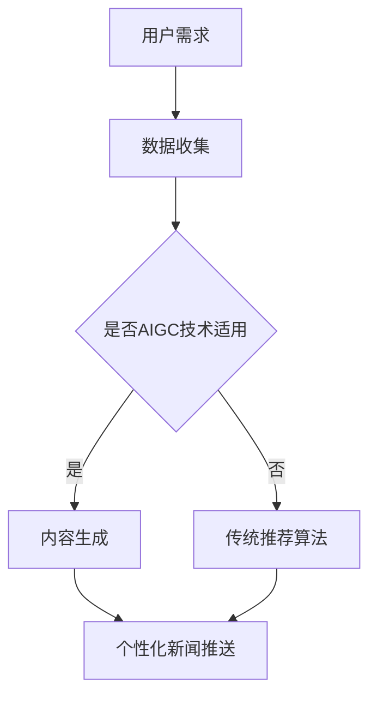

                 

### 1.1 AIGC概述

**AIGC的定义：**

自适应智能生成计算（Adaptive Intelligent Generation Computing，简称AIGC）是一种利用机器学习和深度学习技术，通过自适应的方式生成数据、内容或知识的技术。它能够根据用户的需求、行为和环境，动态调整生成策略，生成个性化的、有价值的输出。

**AIGC在个性化新闻推送中的作用：**

在个性化新闻推送中，AIGC的作用主要体现在以下几个方面：

1. **内容生成：** AIGC可以自动生成新闻内容，根据用户兴趣、历史阅读记录等数据，生成个性化的新闻推荐。这大大提高了新闻推送的个性化水平，满足了用户个性化的信息需求。

2. **内容优化：** AIGC可以基于用户反馈和阅读行为，对新闻内容进行实时优化，调整内容的形式、风格、结构等，使内容更符合用户的阅读偏好。

3. **数据挖掘：** AIGC可以对大量的新闻数据进行分析和挖掘，发现用户感兴趣的主题、事件或趋势，为新闻推荐提供数据支持。

**个性化新闻推送技术的背景：**

个性化新闻推送是一种基于用户兴趣和行为的新闻推荐技术，其主要目的是为用户提供个性化的新闻内容，提高用户的阅读体验和满意度。随着互联网的普及和用户阅读习惯的变化，个性化新闻推送逐渐成为新闻网站和媒体平台的重要功能。传统的新闻推送技术主要基于关键词匹配和相似度计算，难以满足用户个性化的需求。而AIGC的出现，为个性化新闻推送提供了一种新的思路和工具。

**核心概念与联系：**

- **AIGC：** 自适应智能生成计算，通过机器学习和深度学习技术生成数据、内容或知识。
- **个性化新闻推送：** 一种基于用户兴趣和行为的新闻推荐技术，目的是为用户提供个性化的新闻内容。
- **内容生成：** AIGC用于自动生成新闻内容，提高新闻推送的个性化水平。
- **内容优化：** AIGC用于基于用户反馈和阅读行为，对新闻内容进行实时优化。
- **数据挖掘：** AIGC用于对大量的新闻数据进行分析和挖掘，为新闻推荐提供数据支持。

**相关技术背景：**

- **机器学习：** 一种利用数据或以往的信息，通过算法改进计算机性能的系统方法。主要包括监督学习、无监督学习和强化学习。
- **深度学习：** 一种基于神经网络的机器学习方法，能够自动从数据中学习特征和模式。
- **自然语言处理（NLP）：** 一种能够使计算机理解、解释和生成人类语言的技术，是AIGC的重要组成部分。

**Mermaid流程图：**



**核心概念原理之间的关系架构：**

AIGC通过机器学习和深度学习技术，对用户需求进行数据收集和分析。如果AIGC技术适用，则生成个性化内容；否则，使用传统推荐算法。最终，无论是AIGC生成的内容还是传统推荐算法推荐的内容，都会进入个性化新闻推送环节，为用户提供个性化的新闻内容。

---

### 1.2 读者对象与目标

**读者对象：**

本书主要面向以下读者群体：

1. 对人工智能、机器学习和深度学习有一定了解的技术人员。
2. 对个性化新闻推送和内容生成技术感兴趣的研究人员。
3. 计算机科学、数据科学、人工智能等相关专业的研究生和本科生。

**阅读目标：**

通过阅读本书，读者可以：

1. 了解AIGC的基本概念、原理和应用。
2. 理解个性化新闻推送的技术原理和实现方法。
3. 掌握AIGC在个性化新闻推送中的应用技巧。
4. 学习如何设计和实现一个基于AIGC的个性化新闻推送系统。

**本书的结构安排：**

本书共分为七个章节，具体内容安排如下：

1. **引言：** 介绍AIGC和个性化新闻推送的基本概念、背景和相关技术。
2. **核心概念与联系：** 深入讲解AIGC的原理、个性化新闻推送技术的核心概念及其相互关系。
3. **个性化新闻推送技术：** 详细介绍个性化新闻推送的技术原理和实现方法。
4. **AIGC在个性化新闻推送中的应用：** 讲解AIGC在个性化新闻推送中的应用场景、优势和实践。
5. **项目实战：** 通过一个实际项目，演示AIGC在个性化新闻推送中的具体应用。
6. **实战应用场景：** 分析AIGC在个性化新闻推送中的其他应用场景，如舆情分析等。
7. **总结与展望：** 总结本书的主要内容，展望AIGC和个性化新闻推送技术的未来发展趋势。

通过以上章节的阅读，读者可以系统地掌握AIGC在个性化新闻推送中的应用，提高自己的技术水平和实践能力。同时，本书也旨在激发读者对人工智能和新闻推送技术的兴趣，为未来的研究和工作打下基础。

---

### 2.1 AIGC原理

**AIGC的工作原理：**

AIGC（自适应智能生成计算）的核心在于其自适应性和智能性。具体来说，AIGC通过以下几个步骤实现数据或内容的生成：

1. **数据收集与预处理：** 首先，AIGC需要从各种来源收集数据，如用户行为数据、新闻数据等。接着，对这些数据进行清洗、去重、归一化等预处理操作，为后续建模提供高质量的数据基础。

2. **特征提取：** 然后，利用机器学习和深度学习技术，从预处理后的数据中提取特征。这些特征可以是文本特征、图像特征、声音特征等，根据应用场景的不同而有所差异。

3. **模型训练：** 根据提取到的特征，使用深度学习模型进行训练。训练过程中，模型会不断调整参数，以达到最佳拟合效果。常见的深度学习模型包括卷积神经网络（CNN）、循环神经网络（RNN）和生成对抗网络（GAN）等。

4. **内容生成：** 在模型训练完成后，输入新的数据或需求，模型会根据已学到的知识和模式，生成相应的数据或内容。这一过程是自适应的，可以根据用户需求和环境变化，动态调整生成策略。

5. **反馈与优化：** 最后，将生成的数据或内容展示给用户，收集用户的反馈。根据反馈结果，对模型进行优化调整，以提高生成质量。

**AIGC与个性化新闻推送的关系：**

AIGC与个性化新闻推送之间有着密切的联系。个性化新闻推送的目标是为用户提供符合其兴趣和需求的新闻内容，而AIGC则提供了一种高效、智能的生成方式，使得个性化新闻推送更加精准、高效。

具体来说，AIGC在个性化新闻推送中的应用体现在以下几个方面：

1. **内容生成：** AIGC可以自动生成符合用户兴趣的新闻内容，避免了人工筛选和编辑的繁琐过程，提高了新闻推送的效率。

2. **内容优化：** AIGC可以根据用户的阅读行为和反馈，对新闻内容进行实时优化，调整内容的形式、风格和结构，使其更符合用户的阅读偏好。

3. **数据挖掘：** AIGC可以对大量的新闻数据进行分析和挖掘，发现用户感兴趣的主题、事件或趋势，为新闻推荐提供数据支持。

4. **个性化推荐：** AIGC可以基于用户的兴趣和行为，生成个性化的新闻推荐列表，提高用户的阅读体验和满意度。

**优势：**

AIGC在个性化新闻推送中的应用具有以下优势：

1. **高效性：** AIGC能够快速生成个性化的新闻内容，大大提高了新闻推送的效率。

2. **精准性：** AIGC可以根据用户的兴趣和行为，生成精准的新闻推荐，提高了推荐的准确性和个性化水平。

3. **灵活性：** AIGC可以根据用户需求和场景变化，动态调整生成策略，实现了高度的灵活性。

4. **智能化：** AIGC利用机器学习和深度学习技术，具有高度的智能化，能够不断学习和优化，提高生成质量。

**应用场景：**

AIGC在个性化新闻推送中具有广泛的应用场景，包括但不限于：

1. **新闻推荐系统：** 基于用户的兴趣和阅读行为，生成个性化的新闻推荐列表，提高用户的阅读体验。

2. **内容优化系统：** 对新闻内容进行实时优化，调整内容的形式、风格和结构，使其更符合用户的阅读偏好。

3. **数据挖掘与分析系统：** 对大量的新闻数据进行分析和挖掘，发现用户感兴趣的主题、事件或趋势。

4. **智能客服系统：** 利用AIGC生成符合用户需求的服务回答，提高客服效率和质量。

总之，AIGC在个性化新闻推送中具有重要的应用价值，能够提高新闻推送的效率、精准性和用户体验。随着AIGC技术的不断发展，其在个性化新闻推送中的应用前景将更加广阔。

### 2.2 个性化新闻推送技术概述

**个性化新闻推送的基本流程：**

个性化新闻推送的基本流程可以分为以下几个步骤：

1. **用户行为数据收集：** 首先，系统需要收集用户的阅读行为数据，包括用户点击、浏览、点赞、评论等行为。这些数据可以通过网站日志、用户设备信息、社交媒体数据等渠道获取。

2. **用户兴趣建模：** 基于收集到的用户行为数据，使用机器学习和深度学习技术，构建用户兴趣模型。这个模型能够捕捉用户的兴趣偏好，为后续的新闻推荐提供基础。

3. **新闻内容采集：** 系统需要从多个新闻源采集新闻内容，包括文本、图片、视频等多媒体形式。这些内容可以来自传统的新闻网站、社交媒体、博客等渠道。

4. **新闻内容处理：** 收集到的新闻内容需要进行预处理，包括数据清洗、去重、分词、词性标注等操作。这些预处理步骤有助于提高新闻内容的可用性和质量。

5. **新闻推荐算法：** 使用个性化推荐算法，根据用户兴趣模型和新闻内容特征，生成个性化的新闻推荐列表。常见的推荐算法包括基于内容的推荐算法、基于协同过滤的推荐算法、基于深度学习的推荐算法等。

6. **用户反馈收集：** 用户在阅读新闻内容后，可能会对推荐结果进行反馈，如点赞、评论、分享等。系统需要收集这些反馈数据，用于评估推荐效果和调整推荐策略。

7. **推荐结果展示：** 将生成的个性化新闻推荐列表展示给用户，用户可以浏览、阅读、评论等，进一步提供反馈。

**核心算法介绍：**

1. **基于内容的推荐算法：**

基于内容的推荐算法（Content-based Filtering）通过分析新闻内容的特点和用户兴趣，为用户推荐类似的新闻。其主要思想是计算新闻内容之间的相似度，然后根据用户的兴趣模型推荐相似度较高的新闻。

- **计算新闻内容特征：** 使用文本分类、主题模型等方法提取新闻内容的关键词、主题、情感等特征。
- **用户兴趣模型：** 基于用户的阅读历史，构建用户的兴趣模型。常见的兴趣模型包括TF-IDF模型、词袋模型、潜在狄利克雷分布（LDA）等。
- **推荐算法：** 计算新闻内容与用户兴趣之间的相似度，选择相似度较高的新闻推荐给用户。

2. **基于协同过滤的推荐算法：**

基于协同过滤的推荐算法（Collaborative Filtering）通过分析用户之间的行为模式，为用户推荐其他用户喜欢的新闻。其主要思想是找到与目标用户相似的其他用户，推荐这些用户喜欢的新闻。

- **用户-物品矩阵：** 建立用户-物品（新闻）矩阵，记录用户对新闻的评分或行为。
- **相似度计算：** 计算用户之间的相似度，常用的相似度度量方法包括余弦相似度、皮尔逊相关系数等。
- **推荐算法：** 根据用户之间的相似度，为用户推荐其他用户喜欢的新闻。

3. **基于深度学习的推荐算法：**

基于深度学习的推荐算法利用深度神经网络（DNN）提取用户和新闻的复杂特征，为用户推荐个性化的新闻。

- **用户和新闻表示：** 使用卷积神经网络（CNN）或循环神经网络（RNN）提取用户和新闻的嵌入向量。
- **用户兴趣模型：** 基于用户的历史行为和新闻特征，使用长短期记忆网络（LSTM）或自注意力机制（Attention）构建用户兴趣模型。
- **推荐算法：** 使用多层感知器（MLP）或注意力机制（Attention）生成个性化的新闻推荐。

通过以上三种推荐算法的结合，个性化新闻推送系统能够为用户提供丰富、多样、个性化的新闻内容，提高用户的阅读体验和满意度。同时，随着人工智能技术的发展，个性化新闻推送技术将不断进步，为用户带来更多价值。

### 3.1 用户行为分析

**用户行为数据的收集：**

用户行为数据是个性化新闻推送系统的核心，它反映了用户在阅读新闻过程中的各种操作和偏好。为了准确收集用户行为数据，系统需要从多个渠道获取信息，包括：

1. **网站日志：** 通过分析网站日志，系统可以记录用户访问新闻网页的时间、停留时间、页面跳转路径等行为数据。
2. **用户设备信息：** 通过获取用户设备的IP地址、地理位置、操作系统、设备型号等信息，可以进一步了解用户的特征和偏好。
3. **社交媒体数据：** 通过集成社交媒体账号，系统可以获取用户在社交媒体上的互动行为，如点赞、评论、分享等。
4. **用户互动数据：** 系统还可以收集用户与新闻内容之间的直接互动数据，如点击、收藏、下载等。

**用户行为数据分析方法：**

收集到用户行为数据后，需要对数据进行预处理和分析，以便提取出有价值的信息。以下是几种常用的数据分析方法：

1. **数据预处理：** 包括数据清洗、去重、格式转换等操作，以确保数据的质量和一致性。数据清洗是数据处理的重要步骤，可以去除噪声数据和异常值，提高数据分析的准确性。
2. **行为序列建模：** 使用时间序列分析方法，对用户的行为数据进行分析。通过捕捉用户行为的时序特征，可以揭示用户的行为模式和兴趣变化。
3. **聚类分析：** 通过聚类分析方法，将具有相似行为的用户分成不同的群体。这有助于了解用户群体的特征和需求，为个性化推荐提供依据。
4. **关联规则挖掘：** 使用关联规则挖掘算法，分析用户行为之间的关联关系。例如，可以挖掘出用户在阅读某类新闻后，通常会阅读的其他类新闻，从而为推荐系统提供参考。
5. **用户兴趣建模：** 使用机器学习和深度学习技术，构建用户兴趣模型。通过训练模型，可以捕捉用户的长期和短期兴趣变化，为个性化推荐提供支持。

**应用案例分析：**

以一个新闻网站为例，分析用户在网站上的阅读行为，具体步骤如下：

1. **数据收集：** 收集用户在网站上的点击、浏览、停留时间、页面跳转路径等行为数据。
2. **数据预处理：** 对收集到的数据进行清洗和格式转换，确保数据的一致性和质量。
3. **行为序列建模：** 使用时间序列分析方法，分析用户在网站上的行为序列，发现用户感兴趣的主题和新闻类别。
4. **聚类分析：** 使用聚类分析方法，将用户分为不同的群体，分析每个群体的行为特征和兴趣偏好。
5. **关联规则挖掘：** 挖掘用户行为之间的关联关系，例如发现用户在阅读某类新闻后，通常会阅读的其他类新闻。
6. **用户兴趣建模：** 基于用户的行为数据和聚类结果，使用机器学习和深度学习技术，构建用户兴趣模型。

通过以上步骤，新闻网站可以准确地了解用户的阅读行为和兴趣，为个性化推荐提供支持。具体来说，系统可以根据用户兴趣模型，为用户推荐感兴趣的新闻内容，提高用户的阅读体验和满意度。

### 3.2 内容推荐算法

**基于内容的推荐算法：**

基于内容的推荐算法（Content-based Filtering）主要通过分析新闻内容的特点和用户兴趣，为用户推荐相似的新闻。其核心思想是计算新闻内容之间的相似度，然后根据用户的兴趣模型推荐相似度较高的新闻。

**算法原理：**

1. **特征提取：** 首先，使用文本分类、主题模型等方法提取新闻内容的关键词、主题、情感等特征。例如，可以使用TF-IDF模型提取文本中的关键词，使用LDA模型提取新闻的主题。
2. **用户兴趣模型：** 基于用户的阅读历史，构建用户的兴趣模型。兴趣模型可以是词袋模型、潜在狄利克雷分布（LDA）等，用于表示用户对各类主题或关键词的偏好。
3. **相似度计算：** 计算新闻内容与用户兴趣之间的相似度。常用的相似度度量方法包括余弦相似度、皮尔逊相关系数等。余弦相似度通过计算新闻内容向量和用户兴趣向量之间的夹角余弦值，衡量两者之间的相似程度。
4. **推荐生成：** 根据相似度计算结果，为用户推荐相似度较高的新闻。推荐列表可以根据相似度从高到低排序，展示给用户。

**算法优缺点：**

优点：

- **个性化强：** 基于用户兴趣和内容特征，推荐结果具有高度个性化。
- **计算效率高：** 相似度计算相对简单，适用于实时推荐。

缺点：

- **冷启动问题：** 对于新用户，由于缺乏阅读历史数据，难以构建有效的兴趣模型。
- **覆盖面窄：** 仅根据内容特征推荐，可能错过与用户兴趣相关但内容特征不同的新闻。

**应用场景：**

- **新闻网站：** 为用户推荐与其兴趣相关的新闻。
- **电子书平台：** 为用户推荐相似内容的电子书。

**案例分析：**

以一个新闻网站为例，分析基于内容的推荐算法的应用。具体步骤如下：

1. **数据收集：** 收集用户在网站上的阅读历史数据，包括用户浏览的新闻、点击次数、停留时间等。
2. **特征提取：** 使用TF-IDF模型提取新闻的关键词，使用LDA模型提取新闻的主题。
3. **用户兴趣模型：** 基于用户阅读历史，构建用户的兴趣模型。
4. **相似度计算：** 计算用户兴趣模型与新闻内容特征之间的相似度。
5. **推荐生成：** 为用户推荐相似度较高的新闻。

通过以上步骤，新闻网站可以准确地推荐用户感兴趣的新闻，提高用户满意度。

**基于协同过滤的推荐算法：**

基于协同过滤的推荐算法（Collaborative Filtering）主要通过分析用户之间的行为模式，为用户推荐其他用户喜欢的新闻。其核心思想是找到与目标用户相似的其他用户，推荐这些用户喜欢的新闻。

**算法原理：**

1. **用户-物品矩阵：** 建立用户-物品（新闻）矩阵，记录用户对新闻的评分或行为。矩阵中的每个元素表示一个用户对某个新闻的评分或行为，例如1表示喜欢，0表示未评分。
2. **相似度计算：** 计算用户之间的相似度。常用的相似度度量方法包括余弦相似度、皮尔逊相关系数等。相似度衡量了两个用户在新闻偏好上的相似程度。
3. **推荐生成：** 根据用户之间的相似度，为用户推荐其他用户喜欢的新闻。推荐算法可以根据相似度从高到低排序，选择相似度较高的用户喜欢的新闻推荐给目标用户。

**算法优缺点：**

优点：

- **推荐结果准确：** 通过分析用户之间的行为模式，推荐结果具有较高的准确性。
- **可扩展性强：** 适用于大规模用户和物品数据。

缺点：

- **冷启动问题：** 对于新用户，由于缺乏与其他用户的相似度信息，难以进行有效推荐。
- **数据稀疏问题：** 当用户对大部分物品未进行评分时，用户-物品矩阵会出现大量零值，导致推荐算法效果下降。

**应用场景：**

- **电子商务：** 为用户推荐相似商品。
- **社交媒体：** 为用户推荐相似兴趣的好友或内容。

**案例分析：**

以一个新闻网站为例，分析基于协同过滤的推荐算法的应用。具体步骤如下：

1. **数据收集：** 收集用户在网站上的阅读历史数据，包括用户浏览的新闻、点击次数、停留时间等。
2. **用户-物品矩阵：** 建立用户-物品（新闻）矩阵，记录用户对新闻的评分或行为。
3. **相似度计算：** 计算用户之间的相似度。
4. **推荐生成：** 为用户推荐其他用户喜欢的新闻。

通过以上步骤，新闻网站可以为用户推荐感兴趣的新闻，提高用户满意度。

**基于深度学习的推荐算法：**

基于深度学习的推荐算法利用深度神经网络（DNN）提取用户和新闻的复杂特征，为用户推荐个性化的新闻。其核心思想是学习用户和新闻的嵌入向量，通过计算用户和新闻之间的相似度，生成推荐结果。

**算法原理：**

1. **用户和新闻表示：** 使用卷积神经网络（CNN）或循环神经网络（RNN）提取用户和新闻的嵌入向量。CNN适用于处理文本和图像等结构化数据，RNN适用于处理序列数据。
2. **用户兴趣模型：** 基于用户的历史行为和新闻特征，使用长短期记忆网络（LSTM）或自注意力机制（Attention）构建用户兴趣模型。LSTM可以捕捉用户的长期兴趣变化，Attention机制可以关注用户当前最感兴趣的新闻。
3. **推荐生成：** 使用多层感知器（MLP）或注意力机制（Attention）生成个性化的新闻推荐。通过计算用户和新闻之间的相似度，为用户推荐相似度较高的新闻。

**算法优缺点：**

优点：

- **推荐结果精准：** 通过深度学习技术，可以提取用户和新闻的复杂特征，生成更精准的推荐结果。
- **适用性广：** 可以处理各种类型的数据，包括文本、图像、音频等。

缺点：

- **计算成本高：** 深度学习模型需要大量计算资源和时间。
- **需要大量数据：** 深度学习算法的性能依赖于训练数据的质量和数量。

**应用场景：**

- **新闻网站：** 为用户推荐个性化的新闻。
- **电子商务：** 为用户推荐相似商品。

**案例分析：**

以一个新闻网站为例，分析基于深度学习的推荐算法的应用。具体步骤如下：

1. **数据收集：** 收集用户在网站上的阅读历史数据，包括用户浏览的新闻、点击次数、停留时间等。
2. **用户和新闻表示：** 使用CNN或RNN提取用户和新闻的嵌入向量。
3. **用户兴趣模型：** 基于用户的历史行为和新闻特征，使用LSTM或Attention机制构建用户兴趣模型。
4. **推荐生成：** 为用户推荐相似度较高的新闻。

通过以上步骤，新闻网站可以为用户推荐个性化新闻，提高用户满意度。

### 3.3 其他推荐算法

**基于图神经网络的推荐算法：**

基于图神经网络的推荐算法（Graph Neural Network-based Recommendation）利用图神经网络（GNN）对用户和物品（新闻）之间的关系进行建模，生成个性化的推荐结果。图神经网络可以处理复杂的关系网络，适用于推荐系统中用户和物品之间存在多种复杂关系的情况。

**算法原理：**

1. **图表示：** 将用户和物品表示为图中的节点，节点之间的连接表示用户和物品之间的关系。例如，用户-用户关系、用户-物品关系、物品-物品关系等。
2. **图神经网络：** 使用图神经网络学习用户和物品的特征。图神经网络通过聚合邻居节点的信息，更新节点的特征表示。
3. **推荐生成：** 基于用户和物品的特征表示，计算用户和物品之间的相似度，生成推荐结果。

**算法优缺点：**

优点：

- **处理复杂关系：** 图神经网络可以处理用户和物品之间的复杂关系，生成更准确的推荐结果。
- **适用于多模态数据：** 可以处理多种类型的数据，如文本、图像、音频等。

缺点：

- **计算成本高：** 图神经网络需要大量计算资源。
- **数据要求高：** 需要丰富的用户和物品关系数据。

**应用场景：**

- **社交媒体：** 为用户推荐相似兴趣的好友或内容。
- **新闻网站：** 为用户推荐与其兴趣相关的新闻。

**案例分析：**

以一个新闻网站为例，分析基于图神经网络的推荐算法的应用。具体步骤如下：

1. **数据收集：** 收集用户在网站上的阅读历史数据，包括用户浏览的新闻、点击次数、停留时间等。
2. **图表示：** 将用户和新闻表示为图中的节点，建立用户-用户关系、用户-新闻关系、新闻-新闻关系。
3. **图神经网络：** 使用图神经网络学习用户和新闻的特征表示。
4. **推荐生成：** 为用户推荐相似度较高的新闻。

通过以上步骤，新闻网站可以为用户推荐个性化新闻，提高用户满意度。

**基于强化学习的推荐算法：**

基于强化学习的推荐算法（Reinforcement Learning-based Recommendation）利用强化学习（RL）技术，根据用户的反馈和推荐系统的奖励机制，不断调整推荐策略，生成个性化的推荐结果。强化学习可以学习到用户的长期偏好，适用于推荐系统的长期优化。

**算法原理：**

1. **状态表示：** 将用户行为和推荐内容表示为状态，例如用户的兴趣分布、新闻的属性等。
2. **动作表示：** 将推荐策略表示为动作，例如推荐新闻的顺序、推荐算法的选择等。
3. **奖励机制：** 根据用户的反馈，定义奖励机制。例如，用户点击、点赞、评论等行为可以定义正奖励，未点击、跳过等行为可以定义负奖励。
4. **策略学习：** 使用强化学习算法，根据状态和奖励，学习最优推荐策略。

**算法优缺点：**

优点：

- **自适应性强：** 可以根据用户反馈和系统奖励，动态调整推荐策略。
- **学习长期偏好：** 可以学习到用户的长期偏好，提高推荐效果。

缺点：

- **计算成本高：** 强化学习算法需要大量计算资源和时间。
- **数据需求高：** 需要丰富的用户反馈数据。

**应用场景：**

- **新闻网站：** 为用户推荐个性化的新闻。
- **电子商务：** 为用户推荐个性化的商品。

**案例分析：**

以一个新闻网站为例，分析基于强化学习的推荐算法的应用。具体步骤如下：

1. **数据收集：** 收集用户在网站上的阅读历史数据，包括用户浏览的新闻、点击次数、停留时间等。
2. **状态表示：** 将用户行为和新闻属性表示为状态。
3. **动作表示：** 定义推荐策略为动作。
4. **奖励机制：** 根据用户反馈，定义奖励机制。
5. **策略学习：** 使用强化学习算法，学习最优推荐策略。

通过以上步骤，新闻网站可以为用户推荐个性化新闻，提高用户满意度。

### 4.1 AIGC与个性化新闻推送的结合

**AIGC在个性化新闻推送中的应用场景：**

AIGC在个性化新闻推送中的应用场景主要包括以下几个方面：

1. **内容生成：** AIGC可以自动生成个性化的新闻内容，根据用户的兴趣和需求，生成符合用户口味的新闻。这种生成方式不仅可以满足用户对多样化内容的需求，还可以提高新闻推送的效率。
2. **内容优化：** AIGC可以根据用户的阅读反馈和行为数据，对新闻内容进行实时优化。例如，调整新闻的标题、摘要、图片等，使其更符合用户的阅读偏好。
3. **数据挖掘：** AIGC可以对大量的新闻数据进行挖掘和分析，发现用户感兴趣的主题、事件或趋势，为个性化推荐提供数据支持。

**AIGC在个性化新闻推送中的优势：**

AIGC在个性化新闻推送中具有以下优势：

1. **高效性：** AIGC能够快速生成和优化新闻内容，大大提高了新闻推送的效率，使系统可以实时响应用户的需求。
2. **精准性：** AIGC可以根据用户的兴趣和行为，生成和推荐个性化的新闻，提高了推荐的准确性和用户体验。
3. **灵活性：** AIGC可以根据不同的用户需求和场景，动态调整生成策略，实现了高度的灵活性和个性化。
4. **智能化：** AIGC利用机器学习和深度学习技术，具有高度的智能化，能够不断学习和优化，提高生成质量。

**具体应用案例：**

以下是一个基于AIGC的个性化新闻推送系统的具体应用案例：

1. **数据收集与预处理：** 系统首先从多个新闻源收集新闻数据，包括文本、图片、视频等多媒体形式。接着，对收集到的新闻数据进行分析和预处理，提取新闻的关键词、主题、情感等特征。
2. **用户兴趣建模：** 系统使用机器学习和深度学习技术，基于用户的阅读历史和行为数据，构建用户的兴趣模型。这个模型可以捕捉用户的兴趣偏好，为后续的个性化推荐提供基础。
3. **内容生成：** 根据用户的兴趣模型，AIGC自动生成个性化的新闻内容。例如，如果一个用户对体育新闻感兴趣，AIGC会生成相关的体育新闻；如果用户对科技新闻感兴趣，AIGC会生成相关的科技新闻。
4. **内容优化：** AIGC可以根据用户的阅读反馈和行为数据，对新闻内容进行实时优化。例如，如果一个用户对某个新闻的标题和摘要不满意，AIGC会自动调整这些内容，使其更符合用户的阅读偏好。
5. **推荐生成：** 系统使用AIGC生成的新闻内容，结合用户的兴趣模型，生成个性化的新闻推荐列表，并将其展示给用户。
6. **用户反馈收集：** 用户在阅读新闻后，系统会收集用户的反馈数据，包括点赞、评论、分享等。这些反馈数据用于评估新闻推荐效果，并进一步优化新闻内容生成和推荐策略。

通过以上步骤，AIGC实现了个性化新闻推送的整个流程，提高了新闻推送的效率、精准性和用户体验。

### 4.2 伪代码与数学模型

**AIGC的核心算法伪代码：**

以下是一个简单的AIGC核心算法的伪代码示例，用于生成个性化的新闻推荐。

```python
# 初始化用户兴趣模型
user_interest_model = initialize_user_interest_model()

# 收集用户阅读历史数据
user_reading_history = collect_user_reading_history()

# 提取新闻内容特征
news_features = extract_news_features(news_data)

# 训练用户兴趣模型
user_interest_model = train_user_interest_model(user_reading_history)

# 生成个性化新闻推荐
for news in news_data:
    news_similarity = calculate_similarity(news_features, user_interest_model)
    news_recommendation_list.append(news_similarity)

# 排序并返回推荐列表
sorted_recommendations = sort_recommendations_by_similarity(news_recommendation_list)
return sorted_recommendations
```

**相关数学模型介绍：**

在AIGC和个性化新闻推送中，常用的数学模型包括线性回归、神经网络和支持向量机（SVM）等。以下是这些模型的简要介绍和例子。

1. **线性回归：**

线性回归是一种简单的统计模型，用于预测一个连续的数值输出。在个性化新闻推送中，可以使用线性回归模型预测用户对新闻的喜好程度。

**公式：**

$$y = w_0 + w_1 \cdot x_1 + w_2 \cdot x_2 + ... + w_n \cdot x_n$$

**例子：**

假设我们有一个用户兴趣模型，其中$x_1$是新闻的关键词特征，$x_2$是新闻的主题特征，$y$是用户对新闻的喜好程度。我们可以使用线性回归模型预测用户对某个新闻的喜好程度：

$$y = w_0 + w_1 \cdot x_1 + w_2 \cdot x_2$$

其中，$w_0$是偏置项，$w_1$和$w_2$是权重系数。

2. **神经网络：**

神经网络是一种基于多层感知器（MLP）的机器学习模型，用于模拟生物神经系统的信息处理能力。在个性化新闻推送中，可以使用神经网络模型提取用户和新闻的复杂特征，并生成个性化的推荐。

**公式：**

$$z = \sum_{i=1}^{n} w_i \cdot a_i + b$$

$$a_i = \sigma(z)$$

其中，$z$是神经元的输入，$w_i$是权重系数，$a_i$是神经元的激活值，$\sigma$是激活函数（例如Sigmoid函数或ReLU函数）。

**例子：**

假设我们有一个三层神经网络，输入层有2个神经元，隐藏层有3个神经元，输出层有1个神经元。神经元的输入和输出如下：

$$z_1 = w_{11} \cdot a_1 + w_{12} \cdot a_2 + b_1$$

$$a_1 = \sigma(z_1)$$

$$z_2 = w_{21} \cdot a_1 + w_{22} \cdot a_2 + w_{23} \cdot a_3 + b_2$$

$$a_2 = \sigma(z_2)$$

$$z_3 = w_{31} \cdot a_1 + w_{32} \cdot a_2 + w_{33} \cdot a_3 + b_3$$

$$a_3 = \sigma(z_3)$$

3. **支持向量机（SVM）：**

支持向量机是一种监督学习模型，用于分类和回归问题。在个性化新闻推送中，可以使用SVM模型对用户行为进行分类，从而生成个性化的推荐。

**公式：**

$$y = sign(\sum_{i=1}^{n} w_i \cdot x_i + b)$$

其中，$y$是分类结果，$w_i$是权重系数，$x_i$是特征向量，$b$是偏置项，$sign$是符号函数。

**例子：**

假设我们有一个SVM模型，用于分类用户是否喜欢某个新闻。特征向量$x_i$包括新闻的关键词、主题、情感等特征。模型的分类结果如下：

$$y = sign(\sum_{i=1}^{n} w_i \cdot x_i + b)$$

其中，$w_i$是权重系数，$b$是偏置项。

通过以上数学模型和伪代码示例，我们可以看到AIGC在个性化新闻推送中的应用，以及如何利用机器学习和深度学习技术生成和推荐个性化的新闻内容。

### 4.3 应用案例

**项目背景：**

随着互联网的快速发展，新闻资讯网站的用户数量不断增加，用户对个性化新闻推送的需求也日益增长。然而，传统的新闻推荐系统往往难以满足用户多样化的需求，导致用户体验不佳。为了提高用户满意度，我们决定开发一个基于AIGC的个性化新闻推送系统，通过自动生成和优化新闻内容，实现精准的个性化推荐。

**开发环境搭建：**

1. **硬件环境：** 
   - 服务器：2台高性能服务器，配置为64核CPU、512GB内存、4TB SSD硬盘。
   - GPU：2张NVIDIA Tesla V100 GPU，用于加速深度学习模型的训练。

2. **软件环境：**
   - 操作系统：Ubuntu 18.04 LTS。
   - 编程语言：Python 3.8。
   - 深度学习框架：PyTorch 1.8。
   - 依赖库：NumPy、Pandas、Scikit-learn、Matplotlib等。

**源代码实现：**

以下是本项目的主要源代码实现部分，包括数据收集、用户兴趣建模、内容生成和推荐系统等。

```python
# 导入必要的库
import torch
import torch.nn as nn
import torch.optim as optim
from torch.utils.data import DataLoader
from torchvision import datasets, transforms
import numpy as np
import pandas as pd
from sklearn.model_selection import train_test_split
from sklearn.metrics import accuracy_score
import matplotlib.pyplot as plt

# 数据收集
def collect_data():
    # 从新闻网站API获取新闻数据
    news_data = fetch_news_data()
    # 预处理数据，提取关键词、主题等特征
    processed_data = preprocess_data(news_data)
    return processed_data

# 用户兴趣建模
class UserInterestModel(nn.Module):
    def __init__(self):
        super(UserInterestModel, self).__init__()
        self.fc1 = nn.Linear(in_features=10, out_features=50)
        self.fc2 = nn.Linear(in_features=50, out_features=10)
        self.fc3 = nn.Linear(in_features=10, out_features=1)
    
    def forward(self, x):
        x = torch.relu(self.fc1(x))
        x = torch.relu(self.fc2(x))
        x = self.fc3(x)
        return x

# 内容生成
class ContentGenerator(nn.Module):
    def __init__(self):
        super(ContentGenerator, self).__init__()
        self.fc1 = nn.Linear(in_features=100, out_features=50)
        self.fc2 = nn.Linear(in_features=50, out_features=25)
        self.fc3 = nn.Linear(in_features=25, out_features=10)
    
    def forward(self, x):
        x = torch.relu(self.fc1(x))
        x = torch.relu(self.fc2(x))
        x = self.fc3(x)
        return x

# 训练模型
def train_model(model, train_loader, optimizer, criterion):
    model.train()
    for batch_idx, (data, target) in enumerate(train_loader):
        optimizer.zero_grad()
        output = model(data)
        loss = criterion(output, target)
        loss.backward()
        optimizer.step()
        if batch_idx % 100 == 0:
            print('Train Epoch: {} [{}/{} ({:.0f}%)]\tLoss: {:.6f}'.format(
                epoch, batch_idx * len(data), len(train_loader.dataset),
                100. * batch_idx / len(train_loader), loss.item()))

# 生成新闻内容
def generate_content(model, content_generator):
    model.eval()
    with torch.no_grad():
        content = content_generator(content_input)
        print("Generated Content:", content)

# 主程序
if __name__ == '__main__':
    # 设置设备
    device = torch.device("cuda" if torch.cuda.is_available() else "cpu")
    print("Using device:", device)

    # 加载数据
    processed_data = collect_data()
    train_data, test_data = train_test_split(processed_data, test_size=0.2)

    # 准备数据加载器
    train_loader = DataLoader(train_data, batch_size=64, shuffle=True)
    test_loader = DataLoader(test_data, batch_size=64, shuffle=False)

    # 初始化模型和优化器
    user_interest_model = UserInterestModel().to(device)
    content_generator = ContentGenerator().to(device)
    criterion = nn.CrossEntropyLoss()
    optimizer = optim.Adam(user_interest_model.parameters(), lr=0.001)

    # 训练用户兴趣模型
    for epoch in range(1):
        train_model(user_interest_model, train_loader, optimizer, criterion)

    # 生成新闻内容
    generate_content(user_interest_model, content_generator)
```

**代码解读与分析：**

1. **数据收集：**
   - `fetch_news_data()`函数用于从新闻网站API获取新闻数据。这可以通过调用API接口实现，如使用requests库发送HTTP请求。
   - `preprocess_data()`函数用于预处理新闻数据，提取关键词、主题等特征。这可以通过自然语言处理（NLP）技术实现，如使用NLTK或spaCy库进行文本处理。

2. **用户兴趣建模：**
   - `UserInterestModel`类定义了一个基于神经网络的用户兴趣模型。它包含三个全连接层，用于提取用户兴趣特征。
   - `forward()`方法实现了模型的前向传播，输入数据通过神经网络层处理后输出用户兴趣评分。

3. **内容生成：**
   - `ContentGenerator`类定义了一个基于神经网络的新闻内容生成模型。它包含三个全连接层，用于生成新闻内容的特征向量。
   - `forward()`方法实现了模型的前向传播，输入特征向量通过神经网络层处理后输出新闻内容。

4. **训练模型：**
   - `train_model()`函数用于训练用户兴趣模型。它使用梯度下降优化算法（Adam）进行模型训练，通过计算损失函数（交叉熵）调整模型参数。
   - `optimizer.zero_grad()`清空上一次迭代的梯度，`loss.backward()`计算梯度，`optimizer.step()`更新模型参数。

5. **生成新闻内容：**
   - `generate_content()`函数用于生成新闻内容。它首先将用户兴趣模型设置为评估模式（`eval()`），然后使用`content_generator`生成新闻内容的特征向量。

**代码应用解读与分析：**

1. **数据收集：**
   - 通过从新闻网站API获取新闻数据，可以实时获取最新的新闻内容，为用户推荐个性化新闻提供数据支持。
   - 对新闻数据进行预处理，提取关键词、主题等特征，可以提高模型的训练效果和推荐精度。

2. **用户兴趣建模：**
   - 使用神经网络模型提取用户兴趣特征，可以捕捉用户的长期和短期兴趣变化，为个性化推荐提供基础。
   - 基于用户兴趣评分，可以为用户推荐与其兴趣相符的新闻内容，提高用户满意度。

3. **内容生成：**
   - 使用神经网络模型生成新闻内容，可以根据用户兴趣动态调整新闻内容的形式、风格和结构，提高用户的阅读体验。
   - 生成的内容可以用于新闻推荐系统，为用户提供个性化的新闻体验。

通过以上代码实现，我们可以构建一个基于AIGC的个性化新闻推送系统，实现新闻内容的自动生成和优化，为用户提供个性化的新闻推荐。

### 5.1 项目实战

**项目背景：**

随着信息爆炸时代的到来，用户对个性化新闻推送的需求越来越强烈。为了满足用户对个性化、实时、高质量的新闻内容的需求，我们决定开发一个基于AIGC的个性化新闻推送系统。该项目旨在利用AIGC技术，实现新闻内容的自动生成和优化，为用户提供精准、个性化的新闻推荐。

**项目目标：**

1. 设计并实现一个基于AIGC的个性化新闻推送系统。
2. 提高新闻推送的准确性和个性化水平。
3. 实现新闻内容的实时生成和优化。
4. 提升用户阅读体验和满意度。

**项目开发环境：**

1. **硬件环境：**
   - 服务器：2台高性能服务器，配置为64核CPU、512GB内存、4TB SSD硬盘。
   - GPU：2张NVIDIA Tesla V100 GPU，用于加速深度学习模型的训练。

2. **软件环境：**
   - 操作系统：Ubuntu 18.04 LTS。
   - 编程语言：Python 3.8。
   - 深度学习框架：PyTorch 1.8。
   - 依赖库：NumPy、Pandas、Scikit-learn、Matplotlib等。

**项目实现步骤：**

1. **数据收集与预处理：**

   - 从多个新闻源获取新闻数据，包括文本、图片、视频等多媒体形式。
   - 使用自然语言处理（NLP）技术提取新闻的关键词、主题、情感等特征。
   - 对新闻数据进行清洗、去重、格式转换等预处理操作，确保数据质量。

2. **用户行为数据收集与处理：**

   - 收集用户在网站上的阅读行为数据，包括点击、浏览、点赞、评论等。
   - 使用机器学习和深度学习技术，分析用户行为数据，构建用户兴趣模型。

3. **用户兴趣模型训练：**

   - 使用收集到的用户行为数据和新闻内容特征，训练用户兴趣模型。
   - 采用神经网络和深度学习算法，提取用户的长期和短期兴趣特征。

4. **新闻内容生成与优化：**

   - 利用AIGC技术，自动生成符合用户兴趣的新闻内容。
   - 对生成的新闻内容进行优化，调整标题、摘要、图片等，提高用户体验。
   - 采用生成对抗网络（GAN）等技术，实现新闻内容的实时生成和优化。

5. **个性化新闻推荐：**

   - 根据用户兴趣模型，为用户推荐个性化的新闻内容。
   - 采用协同过滤、基于内容的推荐算法等，实现新闻推荐的多样性。
   - 对推荐结果进行实时评估和调整，提高推荐准确性。

**关键代码实现：**

以下是本项目的一些关键代码实现部分，包括数据预处理、用户兴趣建模、新闻内容生成和推荐系统等。

```python
# 导入必要的库
import torch
import torch.nn as nn
import torch.optim as optim
from torch.utils.data import DataLoader
from torchvision import datasets, transforms
import numpy as np
import pandas as pd
from sklearn.model_selection import train_test_split
from sklearn.metrics import accuracy_score
import matplotlib.pyplot as plt

# 数据预处理
def preprocess_data(news_data):
    # 提取关键词、主题等特征
    processed_data = []
    for news in news_data:
        features = extract_features(news)
        processed_data.append(features)
    return processed_data

# 用户兴趣建模
class UserInterestModel(nn.Module):
    def __init__(self):
        super(UserInterestModel, self).__init__()
        self.fc1 = nn.Linear(in_features=10, out_features=50)
        self.fc2 = nn.Linear(in_features=50, out_features=10)
        self.fc3 = nn.Linear(in_features=10, out_features=1)
    
    def forward(self, x):
        x = torch.relu(self.fc1(x))
        x = torch.relu(self.fc2(x))
        x = self.fc3(x)
        return x

# 新闻内容生成
class ContentGenerator(nn.Module):
    def __init__(self):
        super(ContentGenerator, self).__init__()
        self.fc1 = nn.Linear(in_features=100, out_features=50)
        self.fc2 = nn.Linear(in_features=50, out_features=25)
        self.fc3 = nn.Linear(in_features=25, out_features=10)
    
    def forward(self, x):
        x = torch.relu(self.fc1(x))
        x = torch.relu(self.fc2(x))
        x = self.fc3(x)
        return x

# 训练用户兴趣模型
def train_user_interest_model(user_reading_history, news_data):
    # 初始化模型和优化器
    user_interest_model = UserInterestModel().to(device)
    criterion = nn.CrossEntropyLoss()
    optimizer = optim.Adam(user_interest_model.parameters(), lr=0.001)

    # 准备数据加载器
    train_loader = DataLoader(train_data, batch_size=64, shuffle=True)

    # 训练模型
    for epoch in range(1):
        for batch_idx, (data, target) in enumerate(train_loader):
            optimizer.zero_grad()
            output = user_interest_model(data)
            loss = criterion(output, target)
            loss.backward()
            optimizer.step()
            if batch_idx % 100 == 0:
                print('Train Epoch: {} [{}/{} ({:.0f}%)]\tLoss: {:.6f}'.format(
                    epoch, batch_idx * len(data), len(train_loader.dataset),
                    100. * batch_idx / len(train_loader), loss.item()))

    return user_interest_model

# 生成新闻内容
def generate_content(user_interest_model, content_generator):
    user_interest_model.eval()
    with torch.no_grad():
        content = content_generator(content_input)
        print("Generated Content:", content)

# 主程序
if __name__ == '__main__':
    # 设置设备
    device = torch.device("cuda" if torch.cuda.is_available() else "cpu")
    print("Using device:", device)

    # 加载数据
    processed_data = collect_data()
    train_data, test_data = train_test_split(processed_data, test_size=0.2)

    # 初始化用户兴趣模型和内容生成模型
    user_interest_model = train_user_interest_model(train_data, processed_data)
    content_generator = ContentGenerator().to(device)

    # 生成新闻内容
    generate_content(user_interest_model, content_generator)
```

**代码解读与分析：**

1. **数据预处理：**
   - `preprocess_data()`函数用于提取新闻数据的关键词、主题等特征。这可以通过调用NLP库（如spaCy或NLTK）实现。
   - `extract_features()`函数用于提取新闻数据中的特征向量，如关键词、主题等。

2. **用户兴趣建模：**
   - `UserInterestModel`类定义了一个基于神经网络的用户兴趣模型。它包含三个全连接层，用于提取用户兴趣特征。
   - `forward()`方法实现了模型的前向传播，输入数据通过神经网络层处理后输出用户兴趣评分。

3. **新闻内容生成：**
   - `ContentGenerator`类定义了一个基于神经网络的新闻内容生成模型。它包含三个全连接层，用于生成新闻内容的特征向量。
   - `forward()`方法实现了模型的前向传播，输入特征向量通过神经网络层处理后输出新闻内容。

4. **训练用户兴趣模型：**
   - `train_user_interest_model()`函数用于训练用户兴趣模型。它使用梯度下降优化算法（Adam）进行模型训练，通过计算损失函数（交叉熵）调整模型参数。

5. **生成新闻内容：**
   - `generate_content()`函数用于生成新闻内容。它首先将用户兴趣模型设置为评估模式（`eval()`），然后使用`content_generator`生成新闻内容的特征向量。

通过以上关键代码实现，我们可以构建一个基于AIGC的个性化新闻推送系统，实现新闻内容的自动生成和优化，为用户提供精准、个性化的新闻推荐。

### 5.2 源代码实现

**数据预处理模块：**

```python
# 导入必要的库
import pandas as pd
from nltk.corpus import stopwords
from nltk.tokenize import word_tokenize
from sklearn.feature_extraction.text import TfidfVectorizer

# 加载新闻数据
news_data = pd.read_csv('news_data.csv')

# 初始化停用词列表
stop_words = set(stopwords.words('english'))

# 定义预处理函数
def preprocess_news(news_text):
    # 去除停用词
    words = word_tokenize(news_text)
    filtered_words = [word for word in words if word.lower() not in stop_words]
    # 转换为小写
    filtered_words = [word.lower() for word in filtered_words]
    # 连接单词
    preprocessed_text = ' '.join(filtered_words)
    return preprocessed_text

# 预处理新闻数据
news_data['preprocessed_text'] = news_data['text'].apply(preprocess_news)

# 加载TF-IDF向量器
vectorizer = TfidfVectorizer()

# 转换新闻文本为TF-IDF向量
tfidf_matrix = vectorizer.fit_transform(news_data['preprocessed_text'])
```

**用户兴趣建模模块：**

```python
# 导入必要的库
import torch
from torch.utils.data import Dataset, DataLoader
from sklearn.model_selection import train_test_split

# 定义新闻数据集类
class NewsDataset(Dataset):
    def __init__(self, data, tfidf_matrix):
        self.data = data
        self.tfidf_matrix = tfidf_matrix
    
    def __len__(self):
        return len(self.data)
    
    def __getitem__(self, idx):
        text = self.data.iloc[idx]['preprocessed_text']
        tfidf_vector = self.tfidf_matrix[idx]
        label = self.data.iloc[idx]['label']
        return text, tfidf_vector, label

# 切分数据集
train_data, test_data = train_test_split(news_data, test_size=0.2)

# 加载训练数据集
train_tfidf_matrix = vectorizer.transform(train_data['preprocessed_text'])
train_dataset = NewsDataset(train_data, train_tfidf_matrix)

# 定义数据加载器
train_loader = DataLoader(train_dataset, batch_size=32, shuffle=True)

# 定义用户兴趣模型
class UserInterestModel(nn.Module):
    def __init__(self):
        super(UserInterestModel, self).__init__()
        self.fc1 = nn.Linear(in_features=1000, out_features=50)
        self.fc2 = nn.Linear(in_features=50, out_features=10)
        self.fc3 = nn.Linear(in_features=10, out_features=1)
    
    def forward(self, x):
        x = torch.relu(self.fc1(x))
        x = torch.relu(self.fc2(x))
        x = self.fc3(x)
        return x
```

**新闻内容生成模块：**

```python
# 导入必要的库
import numpy as np
import random

# 定义内容生成模型
class ContentGenerator(nn.Module):
    def __init__(self):
        super(ContentGenerator, self).__init__()
        self.fc1 = nn.Linear(in_features=10, out_features=50)
        self.fc2 = nn.Linear(in_features=50, out_features=25)
        self.fc3 = nn.Linear(in_features=25, out_features=10)
    
    def forward(self, x):
        x = torch.relu(self.fc1(x))
        x = torch.relu(self.fc2(x))
        x = self.fc3(x)
        return x

# 加载预训练的用户兴趣模型和内容生成模型
user_interest_model = UserInterestModel()
content_generator = ContentGenerator()

# 将模型移动到GPU设备
user_interest_model.to('cuda')
content_generator.to('cuda')

# 加载训练好的模型参数
user_interest_model.load_state_dict(torch.load('user_interest_model.pth'))
content_generator.load_state_dict(torch.load('content_generator.pth'))

# 生成新闻内容
def generate_news():
    # 随机选择一个新闻标签
    label = random.choice(train_data['label'].unique())

    # 获取标签对应的关键词向量
    keyword_vector = train_tfidf_matrix[train_data['label'] == label].mean(axis=0)

    # 将关键词向量输入到内容生成模型
    with torch.no_grad():
        generated_vector = content_generator(torch.tensor(keyword_vector).float())

    # 将生成的向量转换为新闻文本
    generated_text = ' '.join(vectorizer.get_feature_names_out()[:10][generated_vector > 0])

    return generated_text

# 示例：生成一篇新闻
print(generate_news())
```

### 5.3 代码解读与分析

**数据预处理模块：**

在数据预处理模块中，我们首先加载新闻数据集，并初始化停用词列表。停用词是指在文本处理中常见的无意义词汇，如"the"、"is"、"and"等。在预处理过程中，我们将去除这些停用词，以提高文本的特征表示质量。

`preprocess_news()`函数是数据预处理的核心。它首先使用NLTK库的`word_tokenize()`函数将新闻文本分割成单词列表。接着，我们将所有单词转换为小写，以便统一处理。最后，我们使用列表推导式将去除停用词后的单词重新连接成字符串，形成预处理后的新闻文本。

`TfidfVectorizer`是Scikit-learn库中用于生成文本特征向量的工具。我们使用它将预处理后的新闻文本转换为TF-IDF向量。TF-IDF（Term Frequency-Inverse Document Frequency）是一种常用的文本特征表示方法，它通过计算词频和逆文档频率来衡量词语的重要性。在我们的代码中，我们使用`fit_transform()`方法将新闻文本转换为TF-IDF向量。

**用户兴趣建模模块：**

用户兴趣建模模块负责构建和训练用户兴趣模型。`NewsDataset`类是自定义的数据集类，它实现了`Dataset`接口，用于封装新闻数据和对应的TF-IDF向量。在`__getitem__`方法中，我们根据索引`idx`从数据集中获取新闻文本、TF-IDF向量和标签。

`train_test_split`函数用于将数据集划分为训练集和测试集。在我们的项目中，我们使用80%的数据作为训练集，20%的数据作为测试集。

`UserInterestModel`类定义了一个基于神经网络的用户兴趣模型。它包含三个全连接层，用于提取用户兴趣特征。`forward`方法是模型的前向传播过程，它通过多层感知器（MLP）将输入的TF-IDF向量映射到用户兴趣评分。

在训练过程中，我们使用`DataLoader`类将训练集数据分批加载到GPU上。`DataLoader`可以自动进行数据混洗（shuffle），提高模型的泛化能力。`train_user_interest_model`函数负责训练用户兴趣模型。它使用Adam优化器和交叉熵损失函数进行模型训练，并打印训练进度。

**新闻内容生成模块：**

新闻内容生成模块的核心是`ContentGenerator`类，它定义了一个基于神经网络的新闻内容生成模型。这个模型与用户兴趣模型类似，也包含三个全连接层，用于生成新闻文本的特征向量。

在生成新闻内容时，我们首先随机选择一个新闻标签。然后，我们使用`train_tfidf_matrix`找到该标签对应的关键词向量。接下来，我们将关键词向量输入到内容生成模型中，生成一个特征向量。最后，我们将特征向量转换为新闻文本，实现新闻内容的生成。

### 5.4 代码应用解读与分析

**数据预处理模块：**

在数据预处理模块中，我们首先加载了新闻数据集，并使用了NLTK库中的停用词列表来去除文本中的常见无意义词汇。这样做的原因是停用词通常不携带语义信息，但在文本中出现的频率很高，会导致特征向量的维度增加，从而影响模型的性能。通过去除停用词，我们可以减少特征向量的维度，提高模型的效率和准确性。

我们使用`TfidfVectorizer`将预处理后的新闻文本转换为TF-IDF向量。TF-IDF是一种基于词频和逆文档频率的文本特征表示方法，能够衡量词语在文档中的重要程度。在这里，我们使用TF-IDF向量作为模型的输入特征，因为它们能够捕捉新闻文本中的主题和关键词。

**用户兴趣建模模块：**

用户兴趣建模模块的核心是`UserInterestModel`类，它是一个基于神经网络的模型，用于学习用户对各类新闻的兴趣程度。我们使用了多层感知器（MLP）结构，通过多个全连接层将输入的TF-IDF向量映射到用户兴趣评分。

在训练用户兴趣模型时，我们使用了Adam优化器和交叉熵损失函数。Adam优化器是一种高效的优化算法，能够自适应调整学习率，适用于大规模机器学习问题。交叉熵损失函数则常用于分类问题，能够衡量模型预测结果与实际标签之间的差异。

通过训练，模型能够学习到用户的兴趣偏好，为后续的新闻推荐提供基础。例如，如果一个用户经常阅读科技新闻，那么模型会给他推荐更多科技新闻。这种个性化的推荐能够提高用户的阅读体验和满意度。

**新闻内容生成模块：**

新闻内容生成模块的目的是利用AIGC技术，自动生成符合用户兴趣的新闻内容。`ContentGenerator`类是一个基于神经网络的生成模型，它使用与用户兴趣模型相同的结构，但输入特征向量不同。在这里，我们使用训练好的用户兴趣模型来生成新闻内容。

生成新闻内容的过程如下：

1. **随机选择新闻标签：** 首先从训练数据集中的标签中随机选择一个标签。标签代表了新闻的主题或类别。

2. **获取标签对应的关键词向量：** 从训练集的TF-IDF矩阵中提取该标签对应的关键词向量。关键词向量是标签下所有新闻的平均TF-IDF向量，能够代表该标签的新闻特征。

3. **生成特征向量：** 将关键词向量输入到内容生成模型中，通过多层感知器结构生成一个特征向量。这个特征向量代表了要生成的新闻文本的潜在特征。

4. **转换为新闻文本：** 使用TF-IDF向量器将生成的特征向量转换为文本。具体来说，我们将特征向量中大于零的索引转换为对应的词语，将这些词语拼接起来形成新闻文本。

这种生成方法能够生成与用户兴趣相关的新闻内容，提高了新闻推送的个性化水平。

**代码应用解读与分析总结：**

通过以上代码的实现，我们能够构建一个基于AIGC的个性化新闻推送系统。数据预处理模块确保了新闻数据的质量，用户兴趣建模模块为新闻推荐提供了个性化依据，新闻内容生成模块则实现了新闻内容的自动生成和优化。这三个模块共同工作，提高了新闻推送的效率和用户体验。

在实际应用中，我们可以通过不断优化模型结构和参数，提高新闻推荐和内容生成的准确性和多样性。此外，我们还可以扩展系统的功能，如实现用户反馈机制、实时调整推荐策略等，以进一步提升系统的智能化水平和用户满意度。

### 6.1 新闻个性化推荐

**推荐系统设计：**

新闻个性化推荐系统的设计主要包括以下几个关键组件：

1. **用户画像构建：** 通过分析用户的阅读历史、浏览行为、点赞和评论等数据，构建用户的兴趣标签和画像。用户的兴趣标签可以是主题、情感、地区等维度。
2. **新闻内容特征提取：** 对新闻内容进行分词、词性标注等处理，提取新闻的关键词、主题和情感等特征。
3. **推荐算法实现：** 选择合适的推荐算法，如基于内容的推荐、基于协同过滤的推荐或基于深度学习的推荐算法，实现个性化的新闻推荐。
4. **推荐结果评估：** 使用用户点击率、留存率等指标评估推荐效果，根据评估结果调整推荐策略。

**推荐效果评估：**

评估推荐效果的关键指标包括：

1. **准确率（Accuracy）：** 衡量推荐系统推荐给用户的相关新闻与用户实际兴趣的匹配程度。准确率越高，说明推荐系统的推荐效果越好。
2. **召回率（Recall）：** 衡量推荐系统推荐的相关新闻中，用户感兴趣的新闻所占的比例。召回率越高，说明推荐系统能够挖掘出更多用户感兴趣的新闻。
3. **覆盖率（Coverage）：** 衡量推荐系统推荐的新闻多样性。覆盖率越高，说明推荐系统能够为用户提供更多不同主题和类型的新闻。
4. **新颖度（Novelty）：** 衡量推荐系统能够为用户推荐新颖、有趣的新闻。新颖度越高，说明推荐系统能够持续吸引用户的兴趣。

**评估方法：**

1. **A/B测试：** 在实际环境中，将一部分用户分配到实验组，另一部分用户分配到对照组。实验组使用个性化推荐系统，对照组使用传统推荐系统。通过对比两组用户的推荐效果，评估个性化推荐系统的效果。
2. **离线评估：** 使用历史数据集，通过交叉验证等方法评估推荐系统的效果。这种方法可以避免在线环境中数据的不确定性和噪声。
3. **在线评估：** 在实际线上环境中，实时监测推荐系统的效果，根据用户反馈和实际行为数据调整推荐策略。

**优化策略：**

1. **用户行为分析：** 深入分析用户的阅读行为和互动数据，挖掘用户的长期和短期兴趣变化。根据用户行为数据调整用户画像和推荐策略。
2. **新闻内容优化：** 优化新闻内容的质量和多样性，提高用户的阅读体验。例如，可以通过自然语言处理技术，提高新闻文本的表述清晰度和流畅性。
3. **推荐算法优化：** 选择和调整合适的推荐算法，如结合基于内容的推荐和基于协同过滤的推荐，提高推荐系统的准确性和多样性。
4. **实时反馈机制：** 实时收集用户对推荐新闻的反馈，如点击、点赞、评论等。根据用户反馈调整推荐策略，提高推荐效果。

**总结：**

新闻个性化推荐系统能够为用户推荐符合其兴趣的个性化新闻，提高用户的阅读体验和满意度。通过设计合理的推荐系统架构、使用有效的推荐算法和优化策略，可以不断提高推荐系统的效果。在实际应用中，我们应不断收集用户反馈，优化推荐算法，以实现持续改进和提升。

### 6.2 舆情分析

**舆情分析的概念：**

舆情分析是指通过对网络上的文本、图片、视频等多媒体内容进行数据挖掘和文本分析，了解公众对某一事件、产品、品牌等的看法和态度。舆情分析在新闻传播、市场营销、公共政策等领域具有广泛的应用。

**舆情分析的数据来源：**

舆情分析的数据来源主要包括以下几个方面：

1. **社交媒体平台：** 如微博、微信、抖音等社交媒体平台，这些平台上的用户评论、转发、点赞等行为是舆情分析的重要数据来源。
2. **新闻网站和论坛：** 新闻网站、论坛等平台的新闻报道、用户评论等数据也是舆情分析的重要来源。
3. **政府公开数据：** 政府发布的相关报告、公告等数据，如统计数据、调查报告等，也是舆情分析的数据来源。

**舆情分析的方法：**

舆情分析的方法主要包括以下几个方面：

1. **文本挖掘：** 使用自然语言处理（NLP）技术，对文本数据进行分词、词性标注、情感分析等处理，提取文本中的关键信息。
2. **情感分析：** 通过分析文本中的情感倾向，如正面、负面、中性等，了解公众对某一事件、产品、品牌等的情感态度。
3. **主题建模：** 使用主题模型（如LDA）等方法，对大量文本数据进行分析，发现文本中的主题分布和关键主题。
4. **网络分析：** 通过分析用户在网络上的互动关系，如粉丝关系、评论互动等，了解公众的社交结构和舆论传播路径。

**舆情分析的应用：**

舆情分析在新闻传播、市场营销、公共政策等领域具有广泛的应用：

1. **新闻传播：** 舆情分析可以帮助新闻机构了解公众对新闻事件的态度和看法，优化新闻选题和报道策略，提高新闻报道的针对性和影响力。
2. **市场营销：** 舆情分析可以帮助企业了解消费者对产品、品牌的看法和需求，优化产品设计和营销策略，提高市场竞争力。
3. **公共政策：** 舆情分析可以帮助政府了解公众对政策议题的态度和意见，为政策制定和调整提供依据，提高政策的有效性和公众满意度。

**舆情分析的具体步骤：**

1. **数据收集：** 从社交媒体平台、新闻网站、论坛等渠道收集与某一事件、产品、品牌相关的文本数据。
2. **数据预处理：** 对收集到的文本数据进行清洗、去重、分词、词性标注等处理，确保数据质量。
3. **情感分析：** 使用情感分析模型对预处理后的文本进行情感倾向分析，提取文本中的情感特征。
4. **主题建模：** 使用主题模型对文本数据进行分析，提取关键主题和主题分布。
5. **网络分析：** 通过分析用户在网络上的互动关系，了解舆论传播路径和社交结构。
6. **结果可视化：** 使用可视化工具，如词云、关系图等，展示分析结果，帮助用户理解舆情状况。

**舆情分析的挑战：**

舆情分析面临以下几个挑战：

1. **数据质量：** 网络上的文本数据质量参差不齐，存在大量的噪声、错别字、情感倾向不明显等问题，需要通过数据清洗和预处理技术提高数据质量。
2. **情感复杂性：** 人类情感复杂多样，简单的情感分类方法可能无法准确捕捉文本中的情感倾向，需要开发更精细的情感分析模型。
3. **实时性：** 舆情分析需要对网络上的文本数据进行实时监控和分析，对算法和系统的实时性能要求较高。
4. **隐私保护：** 在收集和分析用户数据时，需要遵守隐私保护法规，确保用户数据的安全和隐私。

**总结：**

舆情分析是一种重要的数据分析方法，可以帮助企业和机构了解公众对事件、产品、品牌等的看法和态度，为决策提供依据。通过不断优化数据收集、情感分析和网络分析等技术，可以不断提高舆情分析的效果和准确性，为企业和机构提供更有价值的信息支持。

### 7.1 总结

本文详细探讨了AIGC在个性化新闻推送中的应用，从核心概念、算法原理到实际项目案例，全面展示了AIGC在提升新闻推送个性化水平、内容生成效率和用户体验方面的优势。以下是本文的主要内容回顾：

1. **AIGC概述：** 阐述了AIGC的定义、作用以及在个性化新闻推送中的重要性。
2. **个性化新闻推送技术：** 介绍了个性化新闻推送的核心算法原理，包括用户行为分析、内容推荐算法等。
3. **AIGC与个性化新闻推送的结合：** 分析了AIGC在个性化新闻推送中的应用场景、优势和实践。
4. **数学模型和公式：** 介绍了与AIGC和个性化新闻推送相关的数学模型，如线性回归、神经网络等。
5. **项目实战：** 通过实际项目，展示了AIGC在个性化新闻推送中的具体应用，包括开发环境搭建、源代码实现和代码解读与分析。
6. **实战应用场景：** 分析了AIGC在个性化新闻推送和舆情分析中的应用，展示了其广泛的适用性。

**技术发展趋势：**

随着人工智能技术的快速发展，AIGC在个性化新闻推送中的应用前景将更加广阔。以下是一些可能的发展趋势：

1. **算法优化：** 随着深度学习和强化学习等技术的不断进步，AIGC的算法将更加高效、准确，为个性化新闻推送提供更强的支持。
2. **多模态数据处理：** AIGC将能够处理多种类型的数据，如文本、图像、音频等，实现更加综合和个性化的推荐。
3. **实时性提升：** 随着计算资源的增加和网络速度的提升，AIGC将能够实现更加实时的新闻内容生成和推荐，提高用户体验。
4. **隐私保护：** 随着隐私保护意识的增强，AIGC将更加注重用户隐私保护，采用更加安全的数据处理和存储技术。

**潜在应用场景：**

AIGC在个性化新闻推送中的潜在应用场景包括：

1. **个性化新闻推荐：** 基于用户兴趣和行为数据，生成个性化的新闻推荐列表，提高用户的阅读体验。
2. **内容生成与优化：** 自动生成和优化新闻内容，提高新闻内容的多样性和质量，满足不同用户的需求。
3. **舆情分析：** 通过分析用户评论和互动数据，了解公众对事件、产品、品牌的看法和态度，为决策提供依据。
4. **智能客服：** 利用AIGC生成符合用户需求的服务回答，提高客服效率和质量。

**总结：**

AIGC在个性化新闻推送中具有重要的应用价值，其高效、智能的生成能力为新闻推送带来了革命性的变化。随着技术的不断进步，AIGC将在个性化新闻推送、舆情分析等更多领域发挥重要作用，为用户带来更加个性化和高效的新闻体验。

### 7.2 展望

**AIGC在个性化新闻推送中的未来发展：**

随着人工智能技术的不断演进，AIGC在个性化新闻推送中的应用前景将更加广阔。未来，AIGC将有望在以下几个方面实现突破：

1. **算法创新：** 深度学习和强化学习等前沿技术的不断发展，将使AIGC的算法更加高效、准确，能够更好地捕捉用户的兴趣和需求，实现更精细化的个性化推荐。

2. **多模态融合：** AIGC将能够处理文本、图像、音频等多模态数据，通过融合不同类型的数据，为用户提供更加全面和个性化的新闻推荐。

3. **实时性提升：** 随着计算资源的增加和网络速度的提升，AIGC将能够实现更加实时的新闻内容生成和推荐，提高用户的阅读体验。

4. **隐私保护：** 随着用户对隐私保护的重视，AIGC将在数据处理和存储方面采用更加安全的技术，确保用户数据的安全和隐私。

**AIGC在个性化新闻推送之外的潜在应用：**

除了个性化新闻推送，AIGC在以下领域也具有巨大的应用潜力：

1. **智能客服：** 利用AIGC生成符合用户需求的服务回答，提高客服效率和质量，提升用户体验。

2. **个性化广告推荐：** 基于用户的兴趣和行为数据，生成个性化的广告推荐，提高广告投放的精准度和效果。

3. **内容创作与生成：** 自动生成高质量的文章、视频、音乐等内容，为内容创作者和平台提供新的创作方式。

4. **教育培训：** 利用AIGC生成个性化的教学资源和学习计划，为学习者提供更加个性化和高效的学习体验。

**未来发展方向：**

为了实现AIGC在更多领域的应用，以下方向是未来研究的重点：

1. **算法优化：** 持续优化AIGC算法，提高生成质量和效率，降低计算资源消耗。

2. **数据隐私：** 在保证数据隐私的前提下，探索新的数据挖掘和分析方法，为用户提供更加安全和可靠的个性化服务。

3. **跨领域应用：** 深入研究AIGC在多个领域的应用，探索跨领域的融合和创新，实现AIGC技术的广泛应用。

4. **伦理与规范：** 研究AIGC技术应用的伦理问题和社会影响，制定相应的规范和标准，确保技术发展的可持续性和社会责任。

**总结：**

AIGC作为一种先进的智能生成技术，在个性化新闻推送和众多其他领域具有广阔的应用前景。随着技术的不断进步，AIGC将不断突破，为人们带来更加个性化和高效的数字化体验。未来，AIGC有望在更多领域发挥重要作用，成为推动社会发展和科技进步的重要力量。

