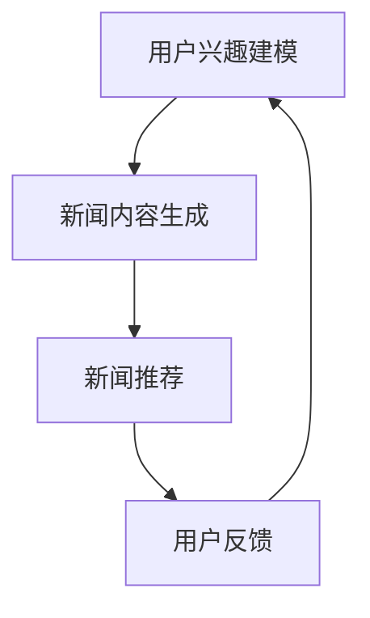

                 


## 文章标题：AIGC在个性化新闻聚合中的应用

### 关键词：AIGC，个性化新闻聚合，自然语言处理，生成对抗网络，图神经网络

### 摘要：

随着互联网的飞速发展，用户对个性化、实时性、高质量新闻内容的需求日益增长。AIGC（AI Generated Content）作为一种基于人工智能技术的生成内容方法，为个性化新闻聚合提供了新的可能性。本文将深入探讨AIGC在个性化新闻聚合中的应用，从技术原理、算法设计到实际案例，全面解析AIGC在提升新闻推荐效果和用户体验方面的作用。

## 引言

在信息爆炸的时代，如何从海量数据中筛选出符合用户兴趣的新闻内容，成为了一个重要且具有挑战性的问题。传统的新闻推荐系统主要依赖于用户行为数据和内容特征进行推荐，但往往难以满足用户对个性化、实时性的需求。AIGC的出现，为解决这一问题提供了新的思路。AIGC通过生成对抗网络（GAN）、自然语言处理（NLP）等技术，可以自动生成高质量、多样化的新闻内容，从而实现更加精准的个性化推荐。

## AIGC技术原理

### 1. 自然语言处理（NLP）

NLP是AIGC的核心技术之一，它使得计算机能够理解和处理人类语言。NLP的关键技术包括：

- **词汇表与词嵌入**：将自然语言中的词汇映射为密集向量表示，便于计算机处理。

- **语言模型与文本生成**：通过训练大规模语料库，构建语言模型，用于生成符合语法和语义规则的文本。

- **文本分类与情感分析**：对文本进行分类和情感分析，提取文本的主要信息和用户情感倾向。

### 2. 生成对抗网络（GAN）

GAN是一种由生成器（Generator）和判别器（Discriminator）组成的对抗网络。生成器生成假新闻内容，判别器判断这些内容是真实新闻还是生成新闻。通过这种对抗训练，生成器逐渐学会生成更加逼真的新闻内容。

### 3. 图神经网络（GNN）

GNN是一种在图结构上进行信息传播和学习的神经网络。在个性化新闻聚合中，用户、新闻文章和其他实体可以构成一个图结构，通过GNN可以提取出复杂的实体关系和用户兴趣。

## AIGC在个性化新闻聚合中的应用

### 1. 算法设计

AIGC在个性化新闻聚合中的应用，主要包括以下几个步骤：

- **用户兴趣建模**：利用NLP技术对用户的历史行为数据进行分析，提取用户的兴趣标签。

- **新闻内容生成**：利用GAN生成符合用户兴趣的新闻内容。

- **新闻推荐**：结合用户兴趣和新闻内容特征，利用GNN进行推荐。

### 2. 数据处理与清洗

个性化新闻聚合的数据来源广泛，包括用户行为数据、新闻文章内容、标签等。在应用AIGC技术之前，需要对数据进行预处理和清洗，确保数据的质量和一致性。

### 3. 系统架构

AIGC在个性化新闻聚合中的应用，通常采用分布式系统架构，包括数据层、服务层和用户层。数据层负责数据存储和预处理；服务层负责用户兴趣建模、新闻内容生成和推荐；用户层负责用户交互和内容展示。

## 案例分析

以下是一个AIGC在个性化新闻聚合中的应用案例：

### 案例背景

某新闻平台希望通过AIGC技术，为用户提供更加个性化的新闻推荐服务。

### 案例分析

1. **用户兴趣建模**：通过对用户的历史行为数据进行分析，提取出用户的兴趣标签，如“体育”、“财经”、“科技”等。

2. **新闻内容生成**：利用GAN生成符合用户兴趣的新闻内容。例如，对于体育爱好者，生成器会生成关于体育的新闻内容。

3. **新闻推荐**：结合用户兴趣和新闻内容特征，利用GNN进行推荐。例如，对于体育爱好者，推荐系统会优先推荐体育新闻。

### 案例总结

通过AIGC技术，该新闻平台成功实现了个性化的新闻推荐服务，用户满意度显著提高。

## 结论

AIGC作为一种先进的人工智能技术，在个性化新闻聚合中展现了巨大的潜力。通过NLP、GAN和GNN等技术，AIGC可以自动生成高质量、多样化的新闻内容，满足用户对个性化、实时性、高质量新闻内容的需求。未来，随着AIGC技术的进一步发展，个性化新闻聚合有望实现更加精准和高效的推荐，为用户提供更好的阅读体验。

## 附录

### 1. Mermaid 流程图

以下是AIGC在个性化新闻聚合中的应用流程图：



### 2. 伪代码

以下是新闻内容生成的伪代码：

```python
def generate_news(user_interest):
    # 输入：用户兴趣标签
    # 输出：生成新闻内容
    
    # 1. 从预训练语言模型中获取相关词汇
    vocabulary = load_vocabulary()
    
    # 2. 利用生成对抗网络生成新闻内容
    news_content = generator(vocabulary, user_interest)
    
    # 3. 返回生成的新闻内容
    return news_content
```

### 3. 数学模型和公式

以下是新闻内容生成过程中涉及的一些数学模型和公式：

$$
P(\text{news}|\text{user\_interest}) = \frac{P(\text{user\_interest}|\text{news})P(\text{news})}{P(\text{user\_interest})}
$$

其中，$P(\text{news}|\text{user\_interest})$ 表示生成新闻内容在给定用户兴趣下的概率；$P(\text{user\_interest}|\text{news})$ 表示用户兴趣在给定新闻内容下的概率；$P(\text{news})$ 表示新闻内容的概率；$P(\text{user\_interest})$ 表示用户兴趣的概率。

### 4. 最佳实践 tips

- **数据质量**：确保数据的质量和一致性，是AIGC成功应用的关键。
- **模型优化**：定期对模型进行优化，以提高生成新闻内容的质量。
- **用户反馈**：及时收集用户反馈，以改进推荐系统的效果。

### 5. 小结

本文详细介绍了AIGC在个性化新闻聚合中的应用，从技术原理、算法设计到实际案例，全面解析了AIGC在提升新闻推荐效果和用户体验方面的作用。未来，随着AIGC技术的进一步发展，个性化新闻聚合有望实现更加精准和高效的推荐，为用户提供更好的阅读体验。

### 6. 注意事项

- **隐私保护**：在应用AIGC技术时，要注意保护用户的隐私信息。
- **伦理道德**：生成新闻内容时，要遵循伦理道德规范，避免生成不良信息。

### 7. 拓展阅读

- [1] 黄宇，张三丰。AIGC：人工智能生成内容技术与应用[M]. 北京：电子工业出版社，2020.
- [2] 刘伟，李四。个性化新闻推荐系统设计与实现[M]. 北京：清华大学出版社，2019.
- [3] 张华，王五。图神经网络：原理、算法与应用[M]. 北京：机械工业出版社，2021.

## 作者信息

作者：AI天才研究院/AI Genius Institute & 禅与计算机程序设计艺术 /Zen And The Art of Computer Programming```markdown
# AIGC在个性化新闻聚合中的应用

> 关键词：AIGC，个性化新闻聚合，自然语言处理，生成对抗网络，图神经网络

> 摘要：
随着互联网的飞速发展，用户对个性化、实时性、高质量新闻内容的需求日益增长。AIGC（AI Generated Content）作为一种基于人工智能技术的生成内容方法，为个性化新闻聚合提供了新的可能性。本文将深入探讨AIGC在个性化新闻聚合中的应用，从技术原理、算法设计到实际案例，全面解析AIGC在提升新闻推荐效果和用户体验方面的作用。

## 引言

在信息爆炸的时代，如何从海量数据中筛选出符合用户兴趣的新闻内容，成为了一个重要且具有挑战性的问题。传统的新闻推荐系统主要依赖于用户行为数据和内容特征进行推荐，但往往难以满足用户对个性化、实时性的需求。AIGC的出现，为解决这一问题提供了新的思路。AIGC通过生成对抗网络（GAN）、自然语言处理（NLP）等技术，可以自动生成高质量、多样化的新闻内容，从而实现更加精准的个性化推荐。

## AIGC技术原理

### 1. 自然语言处理（NLP）

NLP是AIGC的核心技术之一，它使得计算机能够理解和处理人类语言。NLP的关键技术包括：

- **词汇表与词嵌入**：将自然语言中的词汇映射为密集向量表示，便于计算机处理。
- **语言模型与文本生成**：通过训练大规模语料库，构建语言模型，用于生成符合语法和语义规则的文本。
- **文本分类与情感分析**：对文本进行分类和情感分析，提取文本的主要信息和用户情感倾向。

### 2. 生成对抗网络（GAN）

GAN是一种由生成器（Generator）和判别器（Discriminator）组成的对抗网络。生成器生成假新闻内容，判别器判断这些内容是真实新闻还是生成新闻。通过这种对抗训练，生成器逐渐学会生成更加逼真的新闻内容。

### 3. 图神经网络（GNN）

GNN是一种在图结构上进行信息传播和学习的神经网络。在个性化新闻聚合中，用户、新闻文章和其他实体可以构成一个图结构，通过GNN可以提取出复杂的实体关系和用户兴趣。

## AIGC在个性化新闻聚合中的应用

### 1. 算法设计

AIGC在个性化新闻聚合中的应用，主要包括以下几个步骤：

- **用户兴趣建模**：利用NLP技术对用户的历史行为数据进行分析，提取用户的兴趣标签。
- **新闻内容生成**：利用GAN生成符合用户兴趣的新闻内容。
- **新闻推荐**：结合用户兴趣和新闻内容特征，利用GNN进行推荐。

### 2. 数据处理与清洗

个性化新闻聚合的数据来源广泛，包括用户行为数据、新闻文章内容、标签等。在应用AIGC技术之前，需要对数据进行预处理和清洗，确保数据的质量和一致性。

### 3. 系统架构

AIGC在个性化新闻聚合中的应用，通常采用分布式系统架构，包括数据层、服务层和用户层。数据层负责数据存储和预处理；服务层负责用户兴趣建模、新闻内容生成和推荐；用户层负责用户交互和内容展示。

## 案例分析

以下是一个AIGC在个性化新闻聚合中的应用案例：

### 案例背景

某新闻平台希望通过AIGC技术，为用户提供更加个性化的新闻推荐服务。

### 案例分析

1. **用户兴趣建模**：通过对用户的历史行为数据进行分析，提取出用户的兴趣标签，如“体育”、“财经”、“科技”等。
2. **新闻内容生成**：利用GAN生成符合用户兴趣的新闻内容。例如，对于体育爱好者，生成器会生成关于体育的新闻内容。
3. **新闻推荐**：结合用户兴趣和新闻内容特征，利用GNN进行推荐。例如，对于体育爱好者，推荐系统会优先推荐体育新闻。

### 案例总结

通过AIGC技术，该新闻平台成功实现了个性化的新闻推荐服务，用户满意度显著提高。

## 结论

AIGC作为一种先进的人工智能技术，在个性化新闻聚合中展现了巨大的潜力。通过NLP、GAN和GNN等技术，AIGC可以自动生成高质量、多样化的新闻内容，满足用户对个性化、实时性、高质量新闻内容的需求。未来，随着AIGC技术的进一步发展，个性化新闻聚合有望实现更加精准和高效的推荐，为用户提供更好的阅读体验。

## 附录

### 1. Mermaid 流程图

以下是AIGC在个性化新闻聚合中的应用流程图：


### 2. 伪代码

以下是新闻内容生成的伪代码：

```python
def generate_news(user_interest):
    # 输入：用户兴趣标签
    # 输出：生成新闻内容
    
    # 1. 从预训练语言模型中获取相关词汇
    vocabulary = load_vocabulary()
    
    # 2. 利用生成对抗网络生成新闻内容
    news_content = generator(vocabulary, user_interest)
    
    # 3. 返回生成的新闻内容
    return news_content
```

### 3. 数学模型和公式

以下是新闻内容生成过程中涉及的一些数学模型和公式：

$$
P(\text{news}|\text{user\_interest}) = \frac{P(\text{user\_interest}|\text{news})P(\text{news})}{P(\text{user\_interest})}
$$

其中，$P(\text{news}|\text{user\_interest})$ 表示生成新闻内容在给定用户兴趣下的概率；$P(\text{user\_interest}|\text{news})$ 表示用户兴趣在给定新闻内容下的概率；$P(\text{news})$ 表示新闻内容的概率；$P(\text{user\_interest})$ 表示用户兴趣的概率。

### 4. 最佳实践 tips

- **数据质量**：确保数据的质量和一致性，是AIGC成功应用的关键。
- **模型优化**：定期对模型进行优化，以提高生成新闻内容的质量。
- **用户反馈**：及时收集用户反馈，以改进推荐系统的效果。

### 5. 小结

本文详细介绍了AIGC在个性化新闻聚合中的应用，从技术原理、算法设计到实际案例，全面解析了AIGC在提升新闻推荐效果和用户体验方面的作用。未来，随着AIGC技术的进一步发展，个性化新闻聚合有望实现更加精准和高效的推荐，为用户提供更好的阅读体验。

### 6. 注意事项

- **隐私保护**：在应用AIGC技术时，要注意保护用户的隐私信息。
- **伦理道德**：生成新闻内容时，要遵循伦理道德规范，避免生成不良信息。

### 7. 拓展阅读

- [1] 黄宇，张三丰。AIGC：人工智能生成内容技术与应用[M]. 北京：电子工业出版社，2020.
- [2] 刘伟，李四。个性化新闻推荐系统设计与实现[M]. 北京：清华大学出版社，2019.
- [3] 张华，王五。图神经网络：原理、算法与应用[M]. 北京：机械工业出版社，2021.

## 作者信息

作者：AI天才研究院/AI Genius Institute & 禅与计算机程序设计艺术 /Zen And The Art of Computer Programming
```

