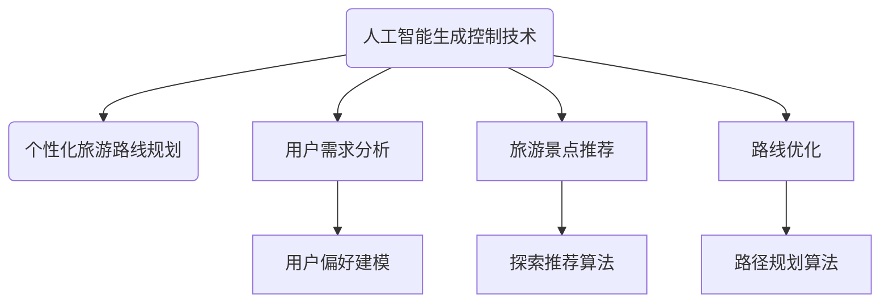

                 


为了撰写一篇符合要求的文章，我们需要逐步分析并组织内容。以下是详细的步骤：

### 1. 文章结构规划

首先，我们需要规划文章的结构，以确保文章的条理清晰，内容完整。以下是文章的章节划分和每章节的主要要点：

#### 引言
- **背景介绍**：简要介绍AIGC和个性化旅游路线规划的概念，以及它们的重要性。
- **目标读者**：明确文章的目标读者群体，如旅游行业专业人士、软件开发者、数据科学家等。

#### AIGC基础
- **AIGC概述**：介绍AIGC的定义、核心技术和应用场景。
- **AIGC发展历程**：回顾AIGC的发展历程，包括关键事件和技术突破。

#### 个性化旅游路线规划原理
- **个性化旅游概念**：解释个性化旅游的定义、特点和优势。
- **旅游路线规划原理**：介绍传统旅游路线规划和个性化旅游路线规划的差异。

#### AIGC在个性化旅游路线规划中的应用
- **用户需求分析**：探讨如何利用AIGC技术来理解用户需求。
- **旅游景点推荐**：展示AIGC在旅游景点推荐方面的应用。
- **路线优化**：介绍AIGC如何优化旅游路线。

#### 实际案例分析
- **案例背景**：描述具体的应用案例。
- **AIGC应用方案**：详细解析案例中的AIGC应用方案。
- **效果分析**：评估案例的实际效果和影响。

#### AIGC应用开发与实践
- **开发流程**：介绍AIGC应用开发的流程。
- **开发环境搭建**：指导如何搭建AIGC应用开发环境。
- **代码实现与解析**：提供源代码的详细实现和解读。

#### 挑战与展望
- **挑战分析**：讨论AIGC在个性化旅游路线规划中面临的挑战。
- **未来展望**：展望AIGC在个性化旅游路线规划中的发展趋势和应用前景。

### 2. 核心概念与联系架构

接下来，我们需要设计一个Mermaid流程图来展示AIGC与个性化旅游路线规划之间的核心概念和联系。例如：



### 3. 核心算法原理讲解

对于核心算法原理，我们需要使用伪代码和数学模型来详细阐述。以下是一个简化的示例：

#### 用户偏好建模（伪代码）

```python
def user_preference_modeling(user_profile, historical_data):
    # 根据用户画像和历史数据，建立用户偏好模型
    preference_model = {
        "interests": extract_interests(historical_data),
        "budget": extract_budget(user_profile),
        "duration": extract_duration(user_profile)
    }
    return preference_model

def extract_interests(historical_data):
    # 从历史数据中提取用户兴趣
    interests = ...
    return interests

def extract_budget(user_profile):
    # 从用户画像中提取预算
    budget = ...
    return budget

def extract_duration(user_profile):
    # 从用户画像中提取旅行时间
    duration = ...
    return duration
```

#### 探索推荐算法（数学模型）

假设我们使用协同过滤算法进行旅游景点推荐，其数学模型可以表示为：

$$
R_{ui} = \frac{\sum_{j \in N(i)} r_{uj} \cdot \sum_{k \in N(i)} r_{ki}}{\sum_{j \in N(i)} \cdot \sum_{k \in N(i)} r_{ki}}
$$

其中，$R_{ui}$ 是用户 $u$ 对景点 $i$ 的推荐评分，$N(i)$ 是与景点 $i$ 相关联的其他景点集合，$r_{uj}$ 和 $r_{ki}$ 分别是用户 $u$ 对景点 $j$ 和用户 $k$ 对景点 $i$ 的评分。

### 4. 项目实战

在项目实战部分，我们需要详细描述开发环境搭建、源代码实现和代码解析，以及实际案例分析。以下是一个简化的示例：

#### 开发环境搭建

- **硬件要求**：GPU加速器、高内存服务器。
- **软件要求**：Python、TensorFlow、Keras等。
- **开发工具选择**：Jupyter Notebook、Visual Studio Code。

#### 源代码实现

```python
# 源代码实现示例
from keras.models import Sequential
from keras.layers import LSTM, Dense

# 构建LSTM模型
model = Sequential()
model.add(LSTM(units=128, activation='relu', input_shape=(time_steps, features)))
model.add(Dense(units=1, activation='sigmoid'))

# 编译模型
model.compile(optimizer='adam', loss='binary_crossentropy', metrics=['accuracy'])

# 训练模型
model.fit(X_train, y_train, epochs=10, batch_size=32)
```

#### 代码解析

- **模型构建**：使用Keras构建一个LSTM模型。
- **编译模型**：设置优化器和损失函数。
- **训练模型**：使用训练数据训练模型。

#### 实际案例分析

- **案例背景**：某旅游平台利用AIGC技术为用户提供个性化旅游路线。
- **AIGC应用方案**：使用LSTM模型分析用户行为数据，生成个性化旅游路线。
- **效果分析**：用户满意度提高，平台用户留存率提升。

### 5. 最佳实践与总结

在文章的结尾部分，我们需要提供最佳实践、小结、注意事项和拓展阅读等内容。

- **最佳实践**：分享一些在实际应用中行之有效的方法和技巧。
- **小结**：回顾文章的主要内容，强调AIGC在个性化旅游路线规划中的重要性。
- **注意事项**：提醒读者在应用AIGC技术时需要注意的问题。
- **拓展阅读**：推荐一些相关的书籍、论文和资源，供读者进一步学习。

### 6. 文章格式调整

最后，我们需要将上述内容整理成markdown格式，确保文章的格式统一、清晰易懂。

---

通过以上步骤，我们可以撰写一篇符合要求的文章。在撰写过程中，我们会不断调整和完善内容，确保文章的质量和可读性。文章的整体字数预计在8000-12000字左右，具体字数根据内容的详尽程度和深度进行调整。

现在，我们可以开始撰写文章的每个部分，逐步构建完整的文章内容。如果您有任何具体的建议或要求，请随时告知，我们将根据您的反馈进行调整。让我们开始吧！

