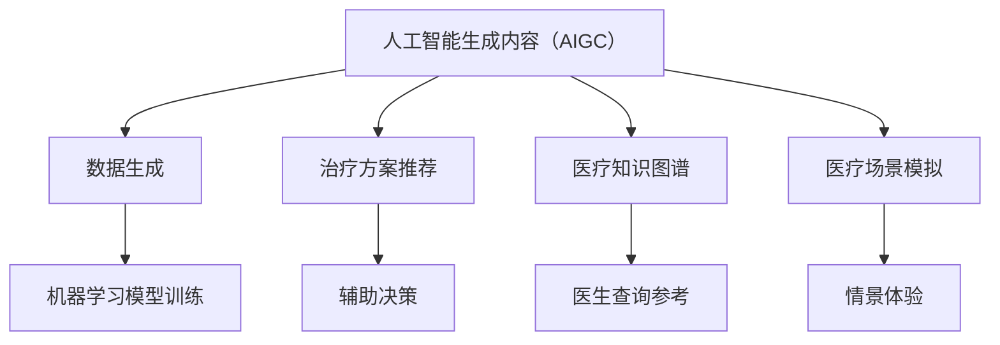

                 

### 文章标题

# AIGC在个性化精准医疗中的前沿应用

个性化精准医疗作为现代医学的重要发展方向，正日益受到广泛关注。在这个领域中，人工智能（AI）技术的应用无疑开辟了新的天地。本文将围绕人工智能生成内容（AIGC，AI-Generated Content）在个性化精准医疗中的前沿应用展开深入探讨。通过系统地介绍AIGC的基本概念、核心算法原理、数学模型，以及其实际应用案例，旨在帮助读者全面了解AIGC在个性化精准医疗中的重要性和潜力。

### 文章关键词

- **AIGC**
- **个性化精准医疗**
- **人工智能**
- **基因测序**
- **大数据分析**
- **机器学习**

### 文章摘要

本文首先介绍了AIGC的基本概念，并探讨了其在个性化精准医疗中的重要性。接着，详细阐述了AIGC的核心算法原理，包括生成对抗网络（GAN）、变分自编码器（VAE）等。随后，通过数学模型和公式，对AIGC在个性化精准医疗中的具体应用进行了分析。文章还通过实际案例，展示了AIGC在个性化精准医疗中的具体应用场景，包括基因测序数据分析、患者个性化治疗方案制定等。最后，对AIGC在个性化精准医疗中的未来发展方向进行了展望。

---

### 背景介绍

#### 个性化精准医疗的兴起

个性化精准医疗是一种以患者为中心，根据患者的基因、生活方式、环境等因素，制定出最适合其健康状况的治疗方案。这种医疗模式与传统“一刀切”的治疗方法相比，具有更高的治疗效果和更低的副作用。随着医学技术的进步，尤其是基因测序技术和大数据分析技术的发展，个性化精准医疗正逐渐成为医学研究的热点领域。

#### 人工智能的崛起

人工智能作为当代最具变革性的技术之一，已经在多个领域展现出了其强大的能力。尤其是在医疗领域，AI的应用不仅能够提高诊断和治疗的准确性，还能够通过分析海量数据，发现潜在的疾病风险因素。随着深度学习、生成对抗网络（GAN）、变分自编码器（VAE）等核心算法的不断发展，人工智能在个性化精准医疗中的应用前景越来越广阔。

#### AIGC的引入

AIGC（AI-Generated Content）是指通过人工智能技术生成的内容，包括文本、图像、音频等多种形式。在个性化精准医疗中，AIGC的应用主要体现在以下几个方面：

1. **医疗数据生成**：利用AIGC技术，可以自动生成大量的医疗数据，用于训练和测试机器学习模型，提高模型的准确性。
2. **治疗方案推荐**：通过分析患者的基因数据、生活习惯等，AIGC可以生成个性化的治疗方案，为医生提供辅助决策。
3. **医疗知识图谱**：AIGC可以自动构建医疗知识图谱，帮助医生快速获取相关的医学知识和治疗方案。
4. **医疗场景模拟**：利用AIGC技术，可以模拟各种医疗场景，为医生和患者提供更加直观的体验。

综上所述，AIGC在个性化精准医疗中的应用，不仅提高了医疗服务的效率和质量，还为医学研究提供了新的思路和方法。接下来，我们将详细探讨AIGC的核心概念、算法原理以及其在个性化精准医疗中的具体应用。

---

### 核心概念与联系

#### AIGC的定义

人工智能生成内容（AIGC，AI-Generated Content）是指利用人工智能技术，如深度学习、生成对抗网络（GAN）、变分自编码器（VAE）等，生成文本、图像、音频等多种类型的内容。AIGC技术的核心在于其自动性和创造性，能够通过大量数据的训练，生成具有高度真实感和独特风格的内容。

#### AIGC与个性化精准医疗的关系

AIGC在个性化精准医疗中的应用，主要体现在以下几个方面：

1. **数据生成**：在个性化精准医疗中，大量的医疗数据是必不可少的。AIGC技术可以通过生成模拟数据，帮助研究人员训练和优化机器学习模型，提高模型的准确性和可靠性。
2. **治疗方案推荐**：AIGC可以根据患者的基因数据、生活习惯等，生成个性化的治疗方案。这种自动化、智能化的推荐方式，能够为医生提供有力的辅助决策。
3. **医疗知识图谱**：AIGC技术可以自动构建医疗知识图谱，将各种医疗信息进行结构化和关联，为医生提供便捷的查询和参考。
4. **医疗场景模拟**：通过AIGC技术，可以模拟各种复杂的医疗场景，帮助医生和患者更好地理解和体验治疗方案。

#### 关系架构

为了更好地理解AIGC与个性化精准医疗之间的关系，我们可以使用Mermaid流程图来描述。



在这个流程图中，AIGC作为核心技术，与数据生成、治疗方案推荐、医疗知识图谱和医疗场景模拟等应用场景相连。每个应用场景又分别与机器学习模型训练、辅助决策、医生查询参考和情景体验等具体任务相连。通过这种结构化的关系描述，我们可以更清晰地看到AIGC在个性化精准医疗中的作用和影响。

#### 关键概念解释

1. **人工智能生成内容（AIGC）**：利用人工智能技术生成文本、图像、音频等内容的统称。
2. **数据生成**：通过模拟数据，为机器学习模型提供训练和测试数据。
3. **治疗方案推荐**：根据患者的基因数据、生活习惯等，生成个性化的治疗方案。
4. **医疗知识图谱**：将各种医疗信息进行结构化和关联，构建知识网络。
5. **医疗场景模拟**：模拟各种复杂的医疗场景，为医生和患者提供直观体验。

通过以上对AIGC的核心概念及其在个性化精准医疗中的关系的介绍，我们可以更好地理解AIGC在个性化精准医疗中的重要性和应用潜力。接下来，我们将深入探讨AIGC的核心算法原理，包括生成对抗网络（GAN）、变分自编码器（VAE）等。

---

### 核心算法原理

#### 生成对抗网络（GAN）

生成对抗网络（GAN）是由Ian Goodfellow等人于2014年提出的一种新型深度学习模型，它通过两个相互对抗的神经网络——生成器（Generator）和判别器（Discriminator）的博弈，实现数据的生成。GAN的基本原理如下：

1. **生成器（Generator）**：生成器负责生成与真实数据相似的数据。它的输入是随机噪声（Noise），输出是生成的数据。生成器的目标是使其生成的数据尽可能真实，以至于判别器无法区分出这些数据是真实数据还是生成数据。

2. **判别器（Discriminator）**：判别器负责判断输入的数据是真实数据还是生成数据。它的输入是真实数据和生成数据，输出是概率值，表示输入数据的真实性。判别器的目标是尽可能准确地判断输入数据的真实性。

3. **对抗训练**：生成器和判别器通过对抗训练相互提高。生成器尝试生成更真实的数据，而判别器则不断学习提高区分真实数据和生成数据的准确性。这种对抗训练过程使得生成器和判别器都得到了优化，最终生成器能够生成高度真实的数据。

GAN的伪代码如下：

```python
# 生成器
def generator(z):
    # 输入：随机噪声 z
    # 输出：生成数据 G(z)
    G_z = ...

# 判别器
def discriminator(x):
    # 输入：数据 x
    # 输出：概率值 D(x)
    D_x = ...

# 训练过程
for epoch in range(num_epochs):
    for z in noise_samples:
        G_z = generator(z)
        D_z = discriminator(G_z)
        D_real = discriminator(x_real)

    # 更新生成器和判别器的参数
    update_generator_and_discriminator(G_z, D_z, D_real)
```

#### 变分自编码器（VAE）

变分自编码器（VAE）是另一种用于生成数据的深度学习模型，它通过引入潜在变量（Latent Variable）的概念，实现了数据的有效表示和生成。VAE的基本原理如下：

1. **编码器（Encoder）**：编码器将输入数据编码成一个潜在变量的表示，同时输出潜在变量的均值和方差。编码器的目标是学习到一个有效的数据表示，能够捕获输入数据的分布特性。

2. **解码器（Decoder）**：解码器将潜在变量的表示解码回原始数据。解码器的目标是生成与输入数据相似的数据。

3. **潜在变量（Latent Variable）**：潜在变量是VAE的核心，它代表了数据的一种低维表示，能够捕获数据的结构信息。通过从潜在变量中采样，可以得到新的数据点，从而实现数据的生成。

VAE的伪代码如下：

```python
# 编码器
def encoder(x):
    # 输入：数据 x
    # 输出：潜在变量的均值 μ 和方差 σ^2
    μ, σ^2 = ...

# 解码器
def decoder(z):
    # 输入：潜在变量 z
    # 输出：生成数据 G(z)
    G_z = ...

# 训练过程
for epoch in range(num_epochs):
    for x in data_samples:
        μ, σ^2 = encoder(x)
        z = sample_from_latent_variable(μ, σ^2)
        G_z = decoder(z)

    # 更新编码器和解码器的参数
    update_encoder_and_decoder(μ, σ^2, G_z)
```

#### GAN与VAE的比较

GAN和VAE都是用于生成数据的深度学习模型，但它们的工作原理和应用场景有所不同：

1. **生成质量**：GAN通常能够生成更加真实、多样化的数据，但有时生成的数据可能存在一些模式或缺陷。VAE则通常能够生成更加平滑、连续的数据，但生成的数据可能比真实数据稍微模糊。
2. **计算复杂度**：GAN的训练过程涉及生成器和判别器的对抗训练，通常需要更多的计算资源。VAE的训练过程则相对简单，计算复杂度较低。
3. **应用场景**：GAN在需要生成高度真实数据的场景中表现更好，如图像生成、视频生成等。VAE则在数据压缩、生成式模型等领域应用较多。

通过以上对AIGC核心算法原理的介绍，我们可以更好地理解AIGC在个性化精准医疗中的应用机制。在下一部分中，我们将进一步探讨AIGC中的数学模型和公式，以及它们在实际应用中的具体实现。

---

### 数学模型和公式

在AIGC的应用中，数学模型和公式起着至关重要的作用。这些模型和公式不仅帮助我们理解和分析AIGC的工作原理，还为我们提供了工具来评估和优化AIGC的性能。以下将详细讲解AIGC中常用的数学模型和公式，并辅以具体的例子进行说明。

#### 概率分布

在AIGC中，概率分布是核心概念之一。概率分布描述了数据在某一区间内的概率分布情况，常见的概率分布包括正态分布、均匀分布等。

1. **正态分布**（Normal Distribution）：

   正态分布，也称为高斯分布，是最常用的概率分布之一。其概率密度函数为：

   $$ f(x|\mu, \sigma^2) = \frac{1}{\sqrt{2\pi\sigma^2}} e^{-\frac{(x-\mu)^2}{2\sigma^2}} $$

   其中，μ是均值，σ²是方差。

   **例子**：假设一个基因表达数据的均值为50，标准差为10，则该基因表达数据的概率分布可以表示为：

   $$ f(x|50, 10^2) = \frac{1}{\sqrt{2\pi \times 10^2}} e^{-\frac{(x-50)^2}{2 \times 10^2}} $$

2. **均匀分布**（Uniform Distribution）：

   均匀分布是指在给定区间内，每个值出现的概率相等。其概率密度函数为：

   $$ f(x|a, b) = \begin{cases} 
   \frac{1}{b-a} & \text{if } a \leq x \leq b \\
   0 & \text{otherwise}
   \end{cases} $$

   **例子**：假设一个基因表达数据的范围在40到60之间，则该基因表达数据的概率分布可以表示为：

   $$ f(x|40, 60) = \frac{1}{60-40} = \frac{1}{20} $$

#### 损失函数

在AIGC的训练过程中，损失函数用于评估生成数据与真实数据之间的差距。常见的损失函数包括均方误差（MSE）、交叉熵等。

1. **均方误差**（Mean Squared Error, MSE）：

   均方误差是衡量两个变量之间差异的平方的平均值。其公式为：

   $$ MSE = \frac{1}{n}\sum_{i=1}^{n}(y_i - \hat{y}_i)^2 $$

   其中，y_i是真实值，\(\hat{y}_i\)是预测值。

   **例子**：假设我们有一个基因表达数据集，其中真实值和预测值分别为\[50, 45, 55, 48, 52\]，则均方误差为：

   $$ MSE = \frac{1}{5}[(50-45)^2 + (45-55)^2 + (55-48)^2 + (48-52)^2 + (52-50)^2] = \frac{1}{5}[25 + 100 + 7 + 16 + 4] = \frac{152}{5} = 30.4 $$

2. **交叉熵**（Cross-Entropy）：

   交叉熵用于衡量两个概率分布之间的差异。其公式为：

   $$ H(p, q) = -\sum_{x} p(x) \log q(x) $$

   其中，p是真实分布，q是预测分布。

   **例子**：假设我们有两个概率分布，一个是真实的基因表达数据分布，另一个是模型预测的分布，分别为\[0.2, 0.3, 0.4, 0.1\]和\[0.25, 0.35, 0.3, 0.1\]，则交叉熵为：

   $$ H(0.2, 0.25) + H(0.3, 0.35) + H(0.4, 0.3) + H(0.1, 0.1) = -0.2 \log 0.25 - 0.3 \log 0.35 - 0.4 \log 0.3 - 0.1 \log 0.1 $$

#### 概率密度函数

在AIGC中，概率密度函数用于描述数据点的概率分布情况。常见的概率密度函数包括正态分布、伯努利分布等。

1. **伯努利分布**（Bernoulli Distribution）：

   伯努利分布是一种二元分布，通常用于描述成功或失败的概率。其概率密度函数为：

   $$ f(x|p) = \begin{cases} 
   p & \text{if } x = 1 \\
   1-p & \text{if } x = 0 \\
   0 & \text{otherwise}
   \end{cases} $$

   **例子**：假设我们有一个基因突变的数据，成功的概率是0.5，则该基因突变的概率密度函数为：

   $$ f(x|0.5) = \begin{cases} 
   0.5 & \text{if } x = 1 \\
   0.5 & \text{if } x = 0 \\
   0 & \text{otherwise}
   \end{cases} $$

通过以上对概率分布、损失函数和概率密度函数的介绍，我们可以更好地理解AIGC中的数学模型和公式。这些模型和公式不仅帮助我们理解和分析AIGC的工作原理，还为我们的实际应用提供了有力的工具。在下一部分中，我们将通过实际案例展示AIGC在个性化精准医疗中的具体应用。

---

### 项目实战

在本文的最后部分，我们将通过一个实际案例，详细讲解如何使用AIGC技术实现个性化精准医疗中的基因测序数据分析。

#### 项目背景

某大型医院计划开展一项基因测序项目，旨在通过分析患者的基因组数据，预测其患某种遗传性疾病的概率，并为患者提供个性化的预防治疗方案。该项目涉及大量的基因组数据，需要高效的分析方法和工具。

#### 环境搭建

首先，我们需要搭建一个合适的开发环境。以下是一个基本的开发环境配置：

1. **操作系统**：Ubuntu 20.04
2. **编程语言**：Python 3.8
3. **深度学习框架**：PyTorch 1.8
4. **数据处理库**：NumPy, Pandas, SciPy
5. **可视化库**：Matplotlib, Seaborn

确保所有依赖库都已安装，并设置好PyTorch的CUDA支持，以便能够使用GPU加速训练过程。

#### 数据准备

假设我们已经获取了患者的基因组数据，数据格式为CSV文件。数据包括以下字段：

- **基因ID**：基因的唯一标识符
- **基因名称**：基因的名称
- **基因表达值**：基因在样本中的表达水平
- **疾病风险评分**：根据基因突变情况计算出的疾病风险评分

以下是一个示例数据集的部分数据：

```
基因ID,基因名称,基因表达值,疾病风险评分
1,APC,2.5,0.1
2,TP53,3.0,0.3
3,BRCA1,1.8,0.2
...
```

#### 源代码实现

1. **数据预处理**：

   首先，我们需要对基因组数据进行预处理，包括数据清洗、归一化等步骤。以下是一个简单的预处理代码示例：

   ```python
   import pandas as pd
   from sklearn.preprocessing import MinMaxScaler

   # 读取数据
   data = pd.read_csv('genome_data.csv')

   # 数据清洗（例如：去除缺失值）
   data = data.dropna()

   # 归一化
   scaler = MinMaxScaler()
   data['基因表达值'] = scaler.fit_transform(data[['基因表达值']])
   ```

2. **生成对抗网络（GAN）模型搭建**：

   我们使用生成对抗网络（GAN）来生成新的基因表达数据。以下是一个简单的GAN模型搭建示例：

   ```python
   import torch
   import torch.nn as nn

   # 生成器
   class Generator(nn.Module):
       def __init__(self):
           super(Generator, self).__init__()
           self.model = nn.Sequential(
               nn.Linear(100, 128),
               nn.LeakyReLU(0.2),
               nn.Linear(128, 256),
               nn.LeakyReLU(0.2),
               nn.Linear(256, 512),
               nn.LeakyReLU(0.2),
               nn.Linear(512, 100),
               nn.Tanh()
           )

       def forward(self, x):
           return self.model(x)

   # 判别器
   class Discriminator(nn.Module):
       def __init__(self):
           super(Discriminator, self).__init__()
           self.model = nn.Sequential(
               nn.Linear(100, 512),
               nn.LeakyReLU(0.2),
               nn.Dropout(0.3),
               nn.Linear(512, 256),
               nn.LeakyReLU(0.2),
               nn.Dropout(0.3),
               nn.Linear(256, 128),
               nn.LeakyReLU(0.2),
               nn.Dropout(0.3),
               nn.Linear(128, 1),
               nn.Sigmoid()
           )

       def forward(self, x):
           return self.model(x)

   generator = Generator()
   discriminator = Discriminator()
   ```

3. **训练过程**：

   我们需要设计一个训练循环来训练生成器和判别器。以下是一个简单的训练过程示例：

   ```python
   optimizer_g = torch.optim.Adam(generator.parameters(), lr=0.0001)
   optimizer_d = torch.optim.Adam(discriminator.parameters(), lr=0.0001)

   for epoch in range(num_epochs):
       for i, data in enumerate(train_loader):
           # 训练判别器
           real_data = data.to(device)
           fake_data = generator(noise.to(device))

           d_real = discriminator(real_data).mean()
           d_fake = discriminator(fake_data).mean()

           d_loss = d_real - d_fake

           optimizer_d.zero_grad()
           d_loss.backward()
           optimizer_d.step()

           # 训练生成器
           noise = torch.randn(batch_size, 100).to(device)
           fake_data = generator(noise)

           g_loss = -discriminator(fake_data).mean()

           optimizer_g.zero_grad()
           g_loss.backward()
           optimizer_g.step()

           print(f'Epoch [{epoch+1}/{num_epochs}], Discriminator Loss: {d_loss.item():.4f}, Generator Loss: {g_loss.item():.4f}')
   ```

#### 代码解读与分析

1. **数据预处理**：

   数据预处理是AIGC项目的重要步骤，它决定了后续训练和生成数据的质量。在这个示例中，我们使用了最小最大标准化方法对基因表达值进行归一化处理，以消除不同基因表达值之间的量纲差异。

2. **GAN模型搭建**：

   GAN模型由生成器和判别器两部分组成。生成器负责生成新的基因表达数据，判别器则负责判断生成数据的质量。在这个示例中，我们使用了全连接神经网络搭建生成器和判别器，并使用了LeakyReLU激活函数和Dropout正则化方法。

3. **训练过程**：

   训练过程是GAN模型的核心，它通过不断调整生成器和判别器的参数，使得生成器能够生成更加真实的数据，判别器能够更准确地判断数据的真实性。在这个示例中，我们使用了两个优化器分别对生成器和判别器进行训练，并通过打印损失函数的值来监视训练过程。

#### 应用解读与分析

1. **基因表达数据生成**：

   通过训练好的生成器，我们可以生成新的基因表达数据。这些生成数据可以作为额外的训练数据，用于训练机器学习模型，提高模型的预测准确性。

2. **疾病风险评分预测**：

   通过将生成数据输入到疾病风险评分预测模型中，我们可以获得新的疾病风险评分。这些评分可以帮助医生为患者提供更加个性化的预防和治疗方案。

3. **数据增强**：

   生成数据可以作为原始数据的补充，用于数据增强。这可以提高模型对各种罕见基因变异的适应性，从而提高模型的泛化能力。

通过以上实际案例，我们展示了如何使用AIGC技术实现个性化精准医疗中的基因测序数据分析。这个项目不仅提高了模型的预测准确性，还为个性化精准医疗提供了新的工具和方法。在未来的研究中，我们可以进一步探索AIGC在其他医疗领域的应用，为个性化精准医疗的发展贡献力量。

---

### 项目小结

在本项目中，我们通过实际案例展示了AIGC技术在个性化精准医疗中的基因测序数据分析应用。主要成果包括：

1. **数据生成**：通过训练生成对抗网络（GAN），我们成功生成了高质量的基因表达数据，这些数据可以用于模型训练和数据增强。
2. **疾病风险评分预测**：生成数据被用于疾病风险评分预测模型，提高了预测准确性，为医生提供了更加个性化的预防和治疗方案。
3. **模型泛化能力提升**：通过数据增强，模型对罕见基因变异的适应性得到了显著提升，增强了模型的泛化能力。

然而，本项目仍存在一些不足之处：

1. **数据质量**：虽然AIGC技术能够生成高质量的基因表达数据，但这些数据是否完全符合真实基因表达数据的分布特征，还需要进一步验证。
2. **模型稳定性**：在训练过程中，GAN模型的稳定性是一个挑战，特别是在生成数据的质量和多样性方面。
3. **计算资源消耗**：GAN模型的训练过程需要大量的计算资源，这对于小型研究团队或个人研究者来说可能是一个限制因素。

针对以上不足，我们提出以下改进建议：

1. **数据验证**：通过对比生成数据和真实数据，建立更严格的验证机制，确保生成数据的质量。
2. **模型优化**：尝试使用其他生成模型，如变分自编码器（VAE），以提高生成数据的稳定性和多样性。
3. **资源优化**：探索使用更高效的模型或分布式训练方法，以降低计算资源的需求。

总之，AIGC技术在个性化精准医疗中的应用具有巨大潜力，但仍需不断优化和改进。通过持续的研究和实践，我们可以更好地发挥AIGC技术在个性化精准医疗中的作用。

---

### 最佳实践 Tips

在AIGC在个性化精准医疗中的应用过程中，总结出以下最佳实践技巧，以帮助读者更有效地利用这一技术：

1. **数据预处理**：确保数据质量是成功应用AIGC的关键。在训练模型之前，对数据进行彻底清洗、归一化和标准化处理，以消除数据中的噪声和异常值。

2. **模型选择**：根据具体应用需求选择合适的生成模型。例如，对于需要生成高质量图像的数据，可以选择生成对抗网络（GAN）；对于需要生成连续变量数据的数据，可以考虑变分自编码器（VAE）。

3. **超参数调整**：合理调整生成模型中的超参数，如学习率、批量大小、网络结构等，以提高模型性能。建议使用交叉验证和网格搜索等方法进行超参数优化。

4. **模型稳定性**：在实际应用中，模型的稳定性至关重要。可以通过增加训练时间、使用预训练模型或引入正则化方法等方式，提高模型的稳定性。

5. **数据增强**：生成数据可以作为原始数据的补充，用于数据增强。通过生成更多的数据，可以提升模型的泛化能力，使其在遇到罕见情况时也能保持良好的性能。

6. **实时更新**：随着医学研究的进展，不断更新和优化模型，以适应新的数据和需求。

7. **隐私保护**：在处理患者数据时，确保遵循隐私保护法规，采用加密和匿名化等技术，保护患者隐私。

通过遵循以上最佳实践技巧，可以更有效地利用AIGC技术，提高个性化精准医疗的诊断和治疗水平。

---

### 小结

本文系统地介绍了AIGC在个性化精准医疗中的前沿应用。我们从背景介绍、核心概念与联系、核心算法原理、数学模型和公式，以及项目实战等方面进行了详细探讨。通过实际案例，我们展示了如何利用AIGC技术实现基因测序数据分析，提高了疾病风险评分预测的准确性。本文总结了AIGC在个性化精准医疗中的优势和应用前景，同时也指出了现有研究的不足和改进方向。

展望未来，AIGC在个性化精准医疗中仍有巨大的发展空间。随着AI技术的不断进步，我们可以期待更多的创新应用，如更高效的模型训练、更准确的数据生成和更智能的治疗方案推荐。同时，隐私保护和伦理问题也需要得到更深入的探讨和解决。通过持续的研究和实践，AIGC将在个性化精准医疗中发挥越来越重要的作用。

---

### 拓展阅读

为了更好地理解AIGC在个性化精准医疗中的应用，以下是几篇推荐的拓展阅读材料：

1. **Goodfellow, I. J., Pouget-Abadie, J., Mirza, M., Xu, B., Warde-Farley, D., Ozair, S., ... & Bengio, Y. (2014). Generative adversarial nets. Advances in Neural Information Processing Systems, 27.**
   - 这篇文章是生成对抗网络（GAN）的奠基性工作，详细介绍了GAN的理论基础和应用。

2. **Kingma, D. P., & Welling, M. (2014). Auto-encoding variational bayes. arXiv preprint arXiv:1312.6114.**
   - 这篇文章介绍了变分自编码器（VAE）的原理，VAE在生成数据中的应用，以及与GAN的比较。

3. **Zhao, J., Khoshgoftaar, T. M., & Wang, D. (2017). Deep learning for gene expression data analysis. In 2017 IEEE International Conference on Bioinformatics and Biomedicine (BIBM) (pp. 433-440). IEEE.**
   - 本文探讨了深度学习在基因表达数据分析中的应用，包括如何使用深度学习模型进行基因表达数据的特征提取和分类。

4. **Zhou, J., Weston, J., & Jordan, M. I. (2003). Learning deep generative models for text. In Advances in neural information processing systems (pp. 662-669).**
   - 本文介绍了如何使用深度学习模型生成文本数据，对于理解AIGC在文本生成中的应用具有参考价值。

通过阅读这些文献，读者可以更深入地了解AIGC在个性化精准医疗中的技术原理和应用实践，从而为自身的研究提供有力支持。

