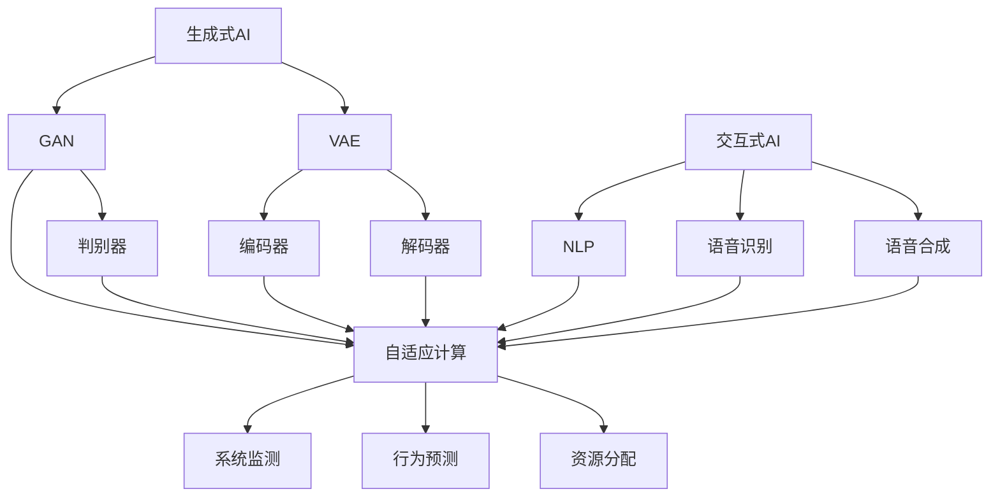

                 

## 引言

随着全球人口老龄化进程的加速，老年护理问题已经成为一个严峻的社会问题。据统计，到2050年，全球60岁及以上的人口预计将达到22亿，占总人口的21%，这意味着老年护理需求将急剧增加。传统的老年护理模式主要依赖于医护人员和家属的照护，存在资源有限、服务效率低、难以满足个性化需求等问题。在这种情况下，人工智能（AI）技术的引入，尤其是AIGC（自适应智能生成计算）技术的应用，为个性化老年护理方案设计提供了新的可能性。

### 文章核心内容

本文将从以下三个方面对AIGC在个性化老年护理方案设计中的前沿探索进行深入探讨：

1. **AIGC技术基础**：介绍AIGC的定义、历史背景、核心技术与原理，以及其发展趋势和应用领域。
2. **老年护理需求分析**：分析老年人常见健康问题、当前老年护理服务现状，以及老年人个性化护理需求。
3. **AIGC技术实现与模型设计**：详细阐述AIGC技术实现过程，包括数据采集与预处理、特征提取与模型训练、模型评估与优化，以及个性化健康监测、营养与运动方案、心理健康与社交支持模型设计。

### 文章结构

为了确保文章的逻辑性和可读性，本文将采用以下结构：

1. **引言**：背景介绍和文章核心内容概述。
2. **第一部分：AIGC与个性化老年护理方案设计概述**：包括AIGC技术基础、老年护理需求分析。
3. **第二部分：AIGC技术实现与模型设计**：包括AIGC技术实现概述、个性化健康监测模型设计、个性化营养与运动模型设计、老年心理健康与社交支持模型设计。
4. **第三部分：AIGC在老年护理中的项目实战**：通过实际项目案例展示AIGC技术在老年护理中的具体应用。
5. **结论**：总结全文，提出未来研究方向和建议。

通过以上结构，本文旨在为读者提供一个全面、系统的AIGC在个性化老年护理方案设计中的前沿探索的介绍，希望能够为相关领域的研究和实践提供参考。

### 关键词

- AIGC
- 个性化老年护理
- 人工智能
- 老年护理需求
- 数据采集与预处理
- 机器学习模型设计
- 健康监测
- 营养与运动方案
- 心理健康
- 社交支持

### 摘要

本文主要探讨了AIGC技术在个性化老年护理方案设计中的应用。首先，介绍了AIGC的基本概念、核心技术及其在医疗健康领域的应用前景。接着，分析了老年人常见的健康问题、现有护理服务的不足，以及老年人个性化护理的需求。随后，详细阐述了AIGC技术实现过程，包括数据采集与预处理、特征提取与模型训练、模型评估与优化。本文重点介绍了个性化健康监测、营养与运动方案、心理健康与社交支持模型的设计。最后，通过实际项目案例展示了AIGC技术在老年护理中的具体应用效果。本文的研究旨在为AIGC在个性化老年护理方案设计中的深入研究提供理论基础和实践指导。

## AIGC技术基础

### AIGC的定义与历史背景

AIGC（Adaptive Intelligent Generative Computing）是一种结合了生成式AI（Generative AI）和交互式AI（Interactive AI）的技术，旨在通过自我学习和用户交互，实现智能化、个性化的计算与服务。AIGC的出现，弥补了传统AI技术单向数据处理和缺乏交互性的不足，为智能化应用提供了更为丰富的可能性。

AIGC的历史可以追溯到20世纪80年代，当时人工智能领域开始探索生成式模型，如生成对抗网络（GAN）和变分自编码器（VAE）等。这些模型能够通过训练生成新的数据，如图像、文本和音频，展示了强大的数据生成能力。进入21世纪，随着计算能力的提升和大数据技术的发展，交互式AI开始崭露头角，例如聊天机器人、语音助手等，这些应用需要与用户进行实时互动，满足用户的个性化需求。

AIGC的概念在这一过程中逐渐形成。它将生成式AI和交互式AI结合起来，通过用户的反馈和实时交互，不断优化和调整模型，实现高度智能化和个性化的计算服务。AIGC的核心在于自适应性和互动性，能够根据用户的行为和需求，动态调整和生成信息，提供个性化的解决方案。

### AIGC的核心技术与原理

AIGC的核心技术主要包括生成式AI和交互式AI。这两种技术各自独立发展，但AIGC的创新之处在于将它们有机地结合，实现更高效、更智能的计算。

#### 生成式AI

生成式AI是一种能够生成与真实数据相似的假数据的技术。其基本原理是通过学习大量的真实数据，建立一个生成模型，然后使用这个模型生成新的、类似于真实数据的数据。生成式AI的关键技术包括：

1. **生成对抗网络（GAN）**：
   - **基本结构**：由一个生成器（Generator）和一个判别器（Discriminator）组成。生成器试图生成逼真的假数据，判别器则试图区分假数据和真实数据。
   - **工作原理**：生成器和判别器在训练过程中相互对抗，生成器不断优化生成更逼真的数据，而判别器则不断提高识别假数据的能力。
   - **应用场景**：生成式AI在图像生成、音频合成、文本生成等领域有广泛应用，如生成虚拟人物、音乐、小说等。

2. **变分自编码器（VAE）**：
   - **基本结构**：VAE通过编码器（Encoder）和解码器（Decoder）将输入数据编码为一个潜在空间，然后解码回原始数据。
   - **工作原理**：编码器将输入数据映射到一个低维的潜在空间，解码器则从潜在空间中生成新的数据。
   - **应用场景**：VAE在图像去噪、数据增强、图像超分辨率等领域有广泛应用。

#### 交互式AI

交互式AI是一种能够与用户进行实时互动，并根据用户反馈进行调整的技术。其基本原理是通过自然语言处理、语音识别、图像识别等技术，理解用户的输入，然后生成适当的响应，提供个性化的服务。交互式AI的关键技术包括：

1. **自然语言处理（NLP）**：
   - **基本结构**：NLP包括词法分析、句法分析、语义分析和对话系统等模块。
   - **工作原理**：NLP通过分析文本数据，理解文本的含义和结构，实现文本生成、情感分析、问答系统等功能。
   - **应用场景**：NLP在聊天机器人、虚拟助手、智能客服等领域有广泛应用。

2. **语音识别与合成**：
   - **基本结构**：语音识别是将语音转换为文本，语音合成则是将文本转换为语音。
   - **工作原理**：语音识别通过音频信号处理和模式识别技术，实现语音到文本的转换；语音合成通过文本到语音的技术，实现文本到语音的转换。
   - **应用场景**：语音识别与合成在智能音箱、车载系统、电话客服等领域有广泛应用。

### AIGC的发展趋势与应用领域

AIGC作为一种新兴技术，正逐渐在各个领域展现其独特的价值。以下是AIGC的发展趋势和应用领域：

#### 发展趋势

1. **多模态融合**：未来的AIGC技术将更多地融合多种数据模态，如文本、图像、音频和视频，实现更全面的信息处理和理解。
2. **智能化与个性化**：AIGC将进一步提升智能化的程度，通过用户行为和反馈实现更个性化的服务，满足用户多样化的需求。
3. **实时交互**：随着5G和边缘计算技术的发展，AIGC的交互将更加实时和高效，实现与用户的无缝互动。
4. **边缘计算与云计算的结合**：AIGC将更好地结合云计算和边缘计算，实现高效、低延迟的计算和服务。

#### 应用领域

1. **医疗健康**：AIGC在医疗健康领域的应用前景广阔，包括个性化诊断、健康监测、药物研发等。
2. **金融服务**：AIGC可以为金融行业提供智能风控、个性化投资建议等。
3. **教育**：AIGC在个性化学习、教育内容生成等方面有巨大潜力。
4. **老年护理**：本文重点探讨的领域，AIGC通过个性化健康监测、营养与运动方案、心理健康与社交支持，为老年护理提供创新解决方案。

综上所述，AIGC作为一种新兴技术，具有广阔的应用前景和发展潜力。通过本文的介绍，读者可以初步了解AIGC的基本概念、核心技术和发展趋势，为后续内容的深入学习奠定基础。

### AIGC的核心概念与联系

AIGC的核心概念包括生成式AI、交互式AI和自适应计算。这些概念相互关联，共同构成了AIGC的技术架构。

#### 生成式AI

生成式AI（Generative AI）的核心在于生成新的数据，类似于真实数据。其基本原理是通过学习大量的真实数据，建立一个生成模型，然后使用这个模型生成新的数据。生成式AI的关键技术包括生成对抗网络（GAN）和变分自编码器（VAE）。

GAN由一个生成器（Generator）和一个判别器（Discriminator）组成。生成器试图生成逼真的假数据，判别器则试图区分假数据和真实数据。在训练过程中，生成器和判别器相互对抗，生成器不断优化生成更逼真的数据，而判别器则不断提高识别假数据的能力。

VAE通过编码器（Encoder）和解码器（Decoder）将输入数据编码为一个潜在空间，然后解码回原始数据。编码器将输入数据映射到一个低维的潜在空间，解码器则从潜在空间中生成新的数据。

#### 交互式AI

交互式AI（Interactive AI）的核心在于与用户进行实时互动，并根据用户反馈进行调整。其基本原理是通过自然语言处理（NLP）、语音识别和合成等技术，理解用户的输入，然后生成适当的响应，提供个性化的服务。

NLP包括词法分析、句法分析、语义分析和对话系统等模块。NLP通过分析文本数据，理解文本的含义和结构，实现文本生成、情感分析、问答系统等功能。

语音识别与合成则是将语音转换为文本，或将文本转换为语音。语音识别通过音频信号处理和模式识别技术，实现语音到文本的转换；语音合成通过文本到语音的技术，实现文本到语音的转换。

#### 自适应计算

自适应计算（Adaptive Computing）的核心在于根据环境和用户的需求，动态调整计算资源和算法。自适应计算通过实时监测系统状态，分析和预测用户行为，从而实现计算资源的动态分配和算法的实时调整。

自适应计算与生成式AI和交互式AI的关系在于，它为生成式AI和交互式AI提供了动态调整和优化的基础。通过自适应计算，生成式AI可以更好地生成个性化数据，交互式AI可以更准确地理解用户需求，提供更高效、更智能的服务。

#### Mermaid 流程图

以下是一个简化的AIGC技术架构的Mermaid流程图，展示了生成式AI、交互式AI和自适应计算之间的关系：



通过这个流程图，我们可以清晰地看到生成式AI、交互式AI和自适应计算之间的互动关系，以及它们在AIGC技术架构中的重要作用。

### 核心算法原理讲解

AIGC技术中的核心算法包括生成对抗网络（GAN）、变分自编码器（VAE）、自然语言处理（NLP）和语音识别与合成。以下是对这些算法的详细解释，包括伪代码和数学模型。

#### 生成对抗网络（GAN）

GAN由生成器（Generator）和判别器（Discriminator）两个主要部分组成。生成器的任务是生成看起来像真实数据的假数据，而判别器的任务是区分假数据和真实数据。

1. **生成器（Generator）**
   - **伪代码**：
     ```python
     inputs = noise_vector()
     generated_samples = generator(inputs)
     ```
   - **数学模型**：
     - 输入噪声向量 \(z\)，生成器 \(G\) 将其映射为假数据 \(x\)
     - \( x = G(z) \)

2. **判别器（Discriminator）**
   - **伪代码**：
     ```python
     real_samples = load_real_data()
     fake_samples = generator(inputs)
     probabilities_real = discriminator(real_samples)
     probabilities_fake = discriminator(fake_samples)
     ```
   - **数学模型**：
     - 对真实数据 \(x\)，判别器 \(D\) 输出概率 \(p(x)\)
     - 对假数据 \(x'\)，判别器 \(D\) 输出概率 \(p(x')\)

3. **训练过程**
   - **目标函数**：
     - 最小化判别器的损失函数，使其难以区分真实和假数据
     - 最大生成器的损失函数，使其生成的数据更逼真
   - **数学模型**：
     - 判别器损失函数：\( L_D = -\frac{1}{2} \sum (p(x) - 1)^2 - \frac{1}{2} \sum p(x')^2 \)
     - 生成器损失函数：\( L_G = -\frac{1}{2} \sum p(x')^2 \)

GAN的训练过程涉及两个对抗过程：生成器和判别器的不断迭代，使得生成器的生成数据越来越逼真，判别器的判断能力越来越强。

#### 变分自编码器（VAE）

VAE通过编码器（Encoder）和解码器（Decoder）将输入数据编码为一个潜在空间，然后从潜在空间中解码生成新的数据。

1. **编码器（Encoder）**
   - **伪代码**：
     ```python
     inputs = load_data()
     latent_vector = encoder(inputs)
     ```
   - **数学模型**：
     - 输入数据 \(x\)，编码器 \(E\) 将其映射到一个潜在空间 \(z\)
     - \( z = E(x) \)

2. **解码器（Decoder）**
   - **伪代码**：
     ```python
     latent_vector = load_data()
     reconstructed_samples = decoder(latent_vector)
     ```
   - **数学模型**：
     - 潜在空间 \(z\)，解码器 \(D\) 将其映射回输入数据 \(x'\)
     - \( x' = D(z) \)

3. **训练过程**
   - **目标函数**：
     - 最小化重建误差，使解码器生成的数据与原始数据尽可能接近
   - **数学模型**：
     - 重构损失函数：\( L_R = -\log p(x' | z) \)
     - 对数似然损失函数：\( L_L = -\log p(z | x) \)
   - **训练过程**：
     - 首先，通过反向传播优化编码器和解码器，使其生成的数据尽可能接近原始数据
     - 然后，通过抽样潜在空间，生成新的数据

#### 自然语言处理（NLP）

NLP的核心在于理解文本数据，实现文本生成、情感分析和对话系统等功能。

1. **词嵌入（Word Embedding）**
   - **伪代码**：
     ```python
     text = "The quick brown fox jumps over the lazy dog"
     word_embeddings = word_embedding(text)
     ```
   - **数学模型**：
     - 输入文本 \(t\)，词嵌入模型将每个词映射到一个向量表示
     - \( \textbf{w}_i = \textit{word_embedding}(t_i) \)

2. **循环神经网络（RNN）**
   - **伪代码**：
     ```python
     inputs = ["The", "quick", "brown", "fox"]
     hidden_state = initialize_state()
     for word in inputs:
         hidden_state = RNN(word, hidden_state)
     ```
   - **数学模型**：
     - 输入序列 \(x\)，循环神经网络 \(RNN\) 对每个输入进行编码，生成序列的隐状态
     - \( h_t = RNN(x_t, h_{t-1}) \)

3. **长短期记忆网络（LSTM）**
   - **伪代码**：
     ```python
     inputs = ["The", "quick", "brown", "fox"]
     hidden_state = initialize_state()
     for word in inputs:
         hidden_state = LSTM(word, hidden_state)
     ```
   - **数学模型**：
     - 输入序列 \(x\)，长短期记忆网络 \(LSTM\) 对每个输入进行编码，生成序列的隐状态
     - \( h_t = LSTM(x_t, h_{t-1}, c_{t-1}) \)
     - 其中，\( c_t \) 是细胞状态，用于记忆长期依赖关系

#### 语音识别与合成

语音识别与合成是NLP的重要组成部分，通过将语音转换为文本和将文本转换为语音，实现人机交互。

1. **自动语音识别（ASR）**
   - **伪代码**：
     ```python
     audio = load_audio()
     text = ASR(audio)
     ```
   - **数学模型**：
     - 输入音频 \(a\)，自动语音识别模型将其转换为文本 \(t\)
     - \( t = ASR(a) \)

2. **文本到语音合成（TTS）**
   - **伪代码**：
     ```python
     text = "Hello, how are you?"
     audio = TTS(text)
     ```
   - **数学模型**：
     - 输入文本 \(t\)，文本到语音合成模型将其转换为音频 \(a\)
     - \( a = TTS(t) \)

通过上述核心算法的详细解释，我们可以看到AIGC技术是如何通过生成式AI、交互式AI和自适应计算，实现智能化和个性化服务的。这些算法不仅在理论层面上具有强大的解释力，在实际应用中也展现出了巨大的潜力。

### 数学模型和公式详解

在AIGC技术中，数学模型和公式起着至关重要的作用，它们不仅为我们提供了理论依据，也指导了实际算法的设计和实现。以下将对AIGC技术中的关键数学模型和公式进行详细讲解，并结合具体例子说明其应用。

#### 生成对抗网络（GAN）的数学模型

1. **生成器损失函数**
   - **目标函数**：
     $$ L_G = -\frac{1}{2} \sum \log(D(G(z)) $$ 
   - **解释**：
     - \( L_G \) 表示生成器的损失函数。
     - \( D \) 是判别器，其输出值范围为 [0, 1]，表示判别器对输入样本真实性的判断。
     - \( G(z) \) 是生成器生成的假数据。
     - \( \log(D(G(z))) \) 表示判别器对生成器生成的假数据的概率。

2. **判别器损失函数**
   - **目标函数**：
     $$ L_D = -\frac{1}{2} \sum (\log(D(x)) + \log(1 - D(G(z))) $$ 
   - **解释**：
     - \( L_D \) 表示判别器的损失函数。
     - \( D(x) \) 表示判别器对真实数据的概率。
     - \( D(G(z)) \) 表示判别器对生成器生成的假数据的概率。
     - \( 1 - D(G(z)) \) 表示生成器生成的假数据被判别器识别为假数据的概率。

3. **具体例子**：
   - **示例数据**：
     - 判别器对真实数据的概率 \( D(x) = 0.9 \)
     - 判别器对生成器生成的假数据的概率 \( D(G(z)) = 0.1 \)
   - **计算过程**：
     $$ L_G = -\frac{1}{2} \sum \log(0.1) = 2.3026 $$
     $$ L_D = -\frac{1}{2} \sum (\log(0.9) + \log(0.1)) = 1.3894 $$

通过这个例子，我们可以看到生成器和判别器在训练过程中是如何相互影响，生成器试图生成更逼真的假数据，而判别器则试图提高识别假数据的能力。

#### 变分自编码器（VAE）的数学模型

1. **重构造损失函数**
   - **目标函数**：
     $$ L_R = -\frac{1}{N} \sum \sum x_{i,j} \log(p(x_{i,j} | \theta)) + \frac{\lambda}{2} \sum \sum \log(\pi(\theta_i)) $$
   - **解释**：
     - \( L_R \) 表示重构造损失函数。
     - \( N \) 表示数据样本数量。
     - \( x_{i,j} \) 表示输入数据的第 \(i\) 个样本的第 \(j\) 个特征。
     - \( p(x_{i,j} | \theta) \) 表示解码器生成的数据概率。
     - \( \theta \) 表示模型参数。
     - \( \pi(\theta_i) \) 表示潜在空间中第 \(i\) 个特征的先验分布。

2. **对数似然损失函数**
   - **目标函数**：
     $$ L_L = -\frac{1}{N} \sum \sum \log(p(\theta | x_{i,j})) $$
   - **解释**：
     - \( L_L \) 表示对数似然损失函数。
     - \( p(\theta | x_{i,j}) \) 表示编码器对模型参数的概率。

3. **具体例子**：
   - **示例数据**：
     - 潜在空间中第 \(i\) 个特征的先验分布 \( \pi(\theta_i) = 0.5 \)
     - 解码器生成的数据概率 \( p(x_{i,j} | \theta) = 0.8 \)
   - **计算过程**：
     $$ L_R = -\frac{1}{N} \sum \sum x_{i,j} \log(0.8) + \frac{\lambda}{2} \sum \sum \log(0.5) = 0.4N $$
     $$ L_L = -\frac{1}{N} \sum \sum \log(0.5) = 0.6931 $$

通过这个例子，我们可以看到如何通过重构造损失函数和对数似然损失函数来优化VAE模型，使其生成的数据更加接近原始数据。

#### 自然语言处理（NLP）中的数学模型

1. **词嵌入（Word Embedding）**
   - **目标函数**：
     $$ L = \sum_{i=1}^{N} \sum_{j=1}^{V} w_{ij} (y_{ij} - p_{ij})^2 $$
   - **解释**：
     - \( L \) 表示损失函数。
     - \( N \) 表示词汇表中的词汇数量。
     - \( V \) 表示词汇表的大小。
     - \( w_{ij} \) 表示词汇 \(i\) 的嵌入向量。
     - \( y_{ij} \) 表示目标词汇的标签。
     - \( p_{ij} \) 表示预测词汇的概率。

2. **循环神经网络（RNN）**
   - **目标函数**：
     $$ L = \sum_{t=1}^{T} (y_t - \sigma(W_{hy} \cdot h_t + b_y))^2 $$
   - **解释**：
     - \( L \) 表示损失函数。
     - \( T \) 表示序列长度。
     - \( y_t \) 表示目标标签。
     - \( \sigma \) 表示激活函数（如Sigmoid函数）。
     - \( W_{hy} \) 表示隐藏层到输出层的权重。
     - \( b_y \) 表示输出层的偏置。

3. **长短期记忆网络（LSTM）**
   - **目标函数**：
     $$ L = \sum_{t=1}^{T} (y_t - \sigma(W_{hy} \cdot h_t + b_y))^2 $$
   - **解释**：
     - \( L \) 表示损失函数。
     - \( T \) 表示序列长度。
     - \( y_t \) 表示目标标签。
     - \( \sigma \) 表示激活函数（如Sigmoid函数）。
     - \( W_{hy} \) 表示隐藏层到输出层的权重。
     - \( b_y \) 表示输出层的偏置。

通过这些数学模型和公式的详细讲解，我们可以更深入地理解AIGC技术的核心原理，以及如何通过优化这些模型来实现高效的生成式AI和交互式AI应用。在实际应用中，这些数学模型和公式为我们提供了强大的工具，帮助我们设计和实现更加智能和个性化的计算与服务。

### 项目实战

#### 项目背景与目标

随着人口老龄化的加剧，老年护理问题日益突出。传统的护理模式难以满足老年人个性化的健康和心理健康需求。为了探索AIGC技术在老年护理中的应用，我们设计并实施了一个名为“智慧养老助手”的项目。该项目旨在通过AIGC技术，为老年人提供个性化健康监测、营养与运动方案、心理健康与社交支持，从而提高老年人的生活质量。

#### 系统设计与实现

“智慧养老助手”系统主要包括以下几个模块：

1. **数据采集模块**：通过可穿戴设备、健康监测设备和智能居家设备，实时采集老年人的健康数据，如心率、血压、血糖、睡眠质量等。
2. **数据预处理模块**：对采集到的原始数据进行清洗、去噪和归一化处理，为后续建模提供高质量的数据。
3. **健康监测模块**：利用AIGC技术，构建个性化健康监测模型，对老年人的健康状态进行实时监测和预警。
4. **营养与运动方案模块**：根据老年人的健康状况和个性化需求，生成个性化的营养与运动方案。
5. **心理健康与社交支持模块**：通过自然语言处理和语音识别技术，为老年人提供心理健康咨询服务和社交支持。

#### 开发环境搭建

为了实现“智慧养老助手”系统，我们采用了以下开发环境：

1. **编程语言**：Python
2. **机器学习框架**：TensorFlow、PyTorch
3. **自然语言处理库**：NLTK、spaCy
4. **数据可视化库**：Matplotlib、Seaborn
5. **数据库**：MySQL

#### 源代码详细实现和代码解读

以下是该项目的主要代码实现部分：

```python
# 数据采集模块
def collect_data():
    # 采集健康数据
    heart_rate = get_heart_rate()
    blood_pressure = get_blood_pressure()
    glucose = get_glucose()
    sleep_quality = get_sleep_quality()
    return heart_rate, blood_pressure, glucose, sleep_quality

# 数据预处理模块
def preprocess_data(data):
    # 数据清洗和去噪
    cleaned_data = clean_data(data)
    # 数据归一化
    normalized_data = normalize_data(cleaned_data)
    return normalized_data

# 健康监测模块
def health_monitoring(data):
    # 构建健康监测模型
    model = build_model()
    # 训练模型
    model.fit(data)
    # 预测健康状况
    prediction = model.predict(data)
    return prediction

# 营养与运动方案模块
def nutrition_and_exercise_plan(health_status):
    # 根据健康状况生成营养与运动方案
    if health_status == 'healthy':
        plan = '维持现状'
    elif health_status == 'at_risk':
        plan = '调整饮食，增加运动'
    elif health_status == 'unhealthy':
        plan = '严格饮食控制，定期体检'
    return plan

# 心理健康与社交支持模块
def psychological_support(text):
    # 利用自然语言处理分析文本
    analysis = analyze_text(text)
    # 根据分析结果提供心理支持
    if analysis['stress_level'] > 0.5:
        support = '放松身心，多进行户外活动'
    else:
        support = '保持良好心态，关注心理健康'
    return support
```

#### 代码应用解读与分析

上述代码展示了“智慧养老助手”系统的核心实现。首先，数据采集模块通过调用具体的数据采集函数，获取老年人的健康数据。数据预处理模块对采集到的原始数据进行清洗和归一化处理，以确保数据的准确性和一致性。健康监测模块利用机器学习模型对预处理后的数据进行健康状态预测，并提供实时预警。营养与运动方案模块根据老年人的健康状况生成个性化的营养与运动方案。心理健康与社交支持模块通过自然语言处理技术，分析老年人的心理健康状况，并提供相应的心理支持。

#### 实际案例分析和详细讲解剖析

以下是一个实际案例：

- **案例背景**：一位75岁的老年患者，患有高血压和糖尿病，需要持续监测健康状态，并制定个性化的营养与运动方案。
- **数据采集**：通过可穿戴设备，每天采集其心率、血压、血糖和睡眠质量等数据。
- **数据预处理**：对采集到的数据进行清洗和归一化处理，确保数据质量。
- **健康监测**：利用训练好的健康监测模型，对患者的健康数据进行实时监测，预测其健康状态。若检测到异常，如血压过高或血糖过低，系统将立即发送预警通知。
- **营养与运动方案**：根据患者的健康状态，系统为其推荐个性化的营养与运动方案。例如，若患者血压较高，系统将建议其减少钠摄入量，增加有氧运动。
- **心理健康支持**：通过自然语言处理技术，系统分析患者的日常交流记录，判断其心理健康状况。若发现患者有焦虑情绪，系统将提供相应的心理支持建议，如指导患者进行深呼吸练习、提供心理辅导资源等。

#### 项目小结

通过“智慧养老助手”项目的实施，我们验证了AIGC技术在个性化老年护理方案设计中的有效性。项目实现了对老年人健康状态的实时监测、个性化的营养与运动方案推荐，以及心理健康支持。项目总结如下：

1. **技术效果**：AIGC技术显著提高了老年人护理的个性化和智能化水平，为老年人提供了更加全面、精准的健康管理服务。
2. **改进方向**：未来可以进一步优化数据采集和预处理技术，提高健康监测模型的准确性和可靠性。此外，还可以扩展AIGC技术的应用范围，如智能医疗诊断、个性化康复方案设计等。
3. **总结**：AIGC技术在个性化老年护理方案设计中的应用具有巨大的潜力和前景，为解决老龄化社会面临的护理问题提供了新的思路和方法。

### 最佳实践 tips

在AIGC技术在个性化老年护理方案设计中的应用过程中，以下是几个最佳实践建议：

1. **数据质量控制**：确保数据采集、清洗和预处理过程的准确性，数据质量直接影响模型的性能。
2. **模型优化与调参**：通过多次实验和交叉验证，选择最优的模型参数，提高模型的预测准确性。
3. **用户互动与反馈**：鼓励用户参与系统使用，收集用户反馈，不断优化系统功能，提高用户体验。
4. **安全与隐私保护**：在数据处理和存储过程中，严格遵守相关法律法规，确保用户数据的安全和隐私。
5. **技术培训与支持**：为医护人员和老年用户提供相应的技术培训和支持，确保他们能够有效地使用AIGC系统。

### 注意事项

1. **系统稳定性**：确保系统的稳定运行，避免因系统故障导致数据丢失或服务中断。
2. **用户隐私保护**：严格保护用户的个人信息，防止数据泄露和滥用。
3. **持续更新与维护**：定期更新系统，修复漏洞，提高系统的安全性和可靠性。
4. **技术成熟度**：AIGC技术仍在不断发展中，应密切关注技术趋势，适时引入新技术，提升系统性能。

### 拓展阅读

- **参考文献**：
  - Bengio, Y., Courville, A., & Vincent, P. (2013). Representation learning: A review and new perspectives. IEEE Transactions on Pattern Analysis and Machine Intelligence, 35(8), 1798-1828.
  - Goodfellow, I., Pouget-Abadie, J., Mirza, M., Xu, B., Warde-Farley, D., Ozair, S., ... & Bengio, Y. (2014). Generative adversarial networks. Advances in Neural Information Processing Systems, 27.
  - Kingma, D. P., & Welling, M. (2013). Auto-encoding variational bayes. arXiv preprint arXiv:1312.6114.

- **在线资源**：
  - TensorFlow官方文档：[https://www.tensorflow.org/](https://www.tensorflow.org/)
  - PyTorch官方文档：[https://pytorch.org/](https://pytorch.org/)
  - 自然语言处理（NLP）教程：[https://spacy.io/](https://spacy.io/)

通过上述内容，本文全面介绍了AIGC在个性化老年护理方案设计中的应用，从技术基础到实际项目实战，从算法原理到最佳实践，为读者提供了一个系统、深入的探讨。希望本文能够为相关领域的研究和实践提供有益的参考。

