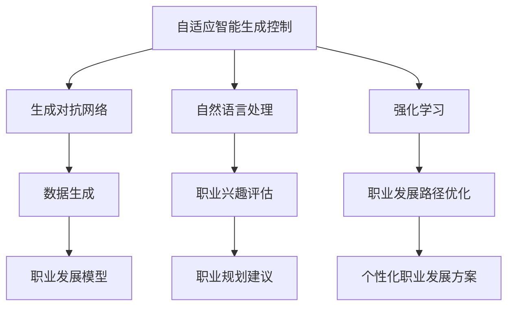

                 

### 文章标题

# AIGC在个性化职业发展规划中的创新探索

### 关键词

- AIGC
- 个性化职业规划
- 生成对抗网络
- 强化学习
- 职业兴趣评估
- 职业发展路径分析

### 摘要

本文深入探讨了AIGC（自适应智能生成控制）在个性化职业发展规划中的应用。首先，介绍了AIGC的基本概念和技术架构，包括自然语言处理、生成对抗网络和强化学习等核心技术的原理。接着，阐述了个性化职业规划的基本原理和AIGC在其中的应用。随后，通过实际案例展示了AIGC如何支持职业规划，以及其在职业教育和人才招聘中的创新点。最后，展望了AIGC在职业规划中的未来发展趋势，并提供了相关的最佳实践和建议。

---

## 背景介绍

个性化职业发展规划是近年来兴起的一个热门领域，旨在根据个体的兴趣、能力和价值观，为他们提供量身定制的职业发展路径。然而，传统的职业规划方法往往依赖于专家的经验和静态的数据分析，难以应对快速变化的职业环境和个体需求的多样性。为了解决这一问题，人工智能（AI）技术，特别是AIGC（自适应智能生成控制），提供了新的可能性。

AIGC是一种新型的AI技术，通过自适应生成控制和实时优化，能够实现数据的自动学习和模型的动态调整。其核心思想是利用生成对抗网络（GAN）、自然语言处理（NLP）和强化学习（RL）等技术，实现数据生成、模型优化和任务执行的全流程自动化。AIGC在多个领域展现了其强大的应用潜力，包括图像生成、文本生成和智能推荐等。

在个性化职业发展规划中，AIGC的应用主要体现在以下几个方面：

1. **职业兴趣评估**：通过自然语言处理技术，对个体的兴趣、价值观和职业目标进行分析，构建个性化的兴趣评估模型。

2. **职业发展路径分析**：利用生成对抗网络和强化学习技术，生成和优化个体的职业发展路径，提供实时更新的职业建议。

3. **职业教育支持**：根据个体的兴趣和能力，推荐适合的职业教育课程，并提供个性化的学习路径。

4. **人才招聘与选拔**：通过分析个体的职业发展数据和职业兴趣，为企业和组织提供人才招聘和选拔的智能解决方案。

本文将详细探讨AIGC在个性化职业发展规划中的应用，从核心技术原理、实际案例到未来展望，全面揭示AIGC在职业规划领域的创新潜力。

## 核心概念与联系

在探讨AIGC在个性化职业发展规划中的应用之前，我们需要理解几个核心概念，以及它们之间的相互关系。这些概念包括AIGC、生成对抗网络（GAN）、自然语言处理（NLP）和强化学习（RL）。通过Mermaid流程图，我们可以清晰地展示这些概念之间的逻辑关系和相互作用。

### Mermaid流程图：AIGC架构



### GAN：生成对抗网络

生成对抗网络（GAN）是一种由生成器和判别器组成的深度学习模型。生成器的任务是生成与真实数据相似的数据，而判别器的任务是区分真实数据和生成数据。通过这种对抗训练，生成器能够不断提高生成数据的质量。

在个性化职业发展规划中，GAN可以用于生成符合个体兴趣和价值观的职业场景，为职业发展路径提供多样化的选择。

### NLP：自然语言处理

自然语言处理（NLP）是人工智能领域的一个重要分支，它使计算机能够理解和处理人类语言。在职业规划中，NLP技术可以用于分析个体的职业目标、兴趣和价值观，从而构建个性化的职业兴趣评估模型。

### RL：强化学习

强化学习（RL）是一种通过试错学习的方法，使模型能够在特定环境中找到最优策略。在个性化职业发展规划中，强化学习可以用于优化职业发展路径，根据个体的行为和反馈不断调整和优化职业建议。

### 职业发展模型

职业发展模型是将个体的兴趣、能力和职业目标整合在一起，形成一套能够指导职业发展的理论框架。通过GAN生成职业场景，NLP分析职业兴趣，以及RL优化职业路径，职业发展模型能够为个体提供个性化的职业发展方案。

### 职业规划建议

基于上述核心概念，职业规划建议可以生成和优化。首先，利用NLP技术对个体的职业目标、兴趣和价值观进行深入分析，构建个性化的职业兴趣评估模型。然后，通过GAN生成多样化的职业场景，结合强化学习优化职业发展路径。最终，为个体提供一系列个性化的职业规划建议，帮助他们更好地实现职业目标。

通过上述Mermaid流程图，我们可以看到AIGC在个性化职业发展规划中的应用是如何通过核心概念相互联系和协同作用来实现的。这一架构不仅提供了对传统职业规划方法的补充，也为未来的技术创新和应用提供了广阔的空间。

### 核心算法原理讲解

在深入了解AIGC如何应用于个性化职业发展规划之前，我们需要探讨其核心算法原理。以下将详细介绍生成对抗网络（GAN）、自然语言处理（NLP）和强化学习（RL）的基本概念和如何结合它们来实现个性化的职业规划。

#### 生成对抗网络（GAN）

生成对抗网络（GAN）由两部分组成：生成器（Generator）和判别器（Discriminator）。生成器的目标是生成类似于真实数据的新数据，而判别器的任务是区分真实数据和生成数据。通过这种对抗训练，生成器能够逐渐提高生成数据的逼真度。

在职业规划中，生成器可以用于生成符合个体兴趣和价值观的职业场景，这些场景可以是虚拟的面试、工作体验或者职业发展的不同路径。例如，生成器可以根据用户的职业兴趣和目标，生成一系列可能的职业发展路径，供用户选择。

**GAN的伪代码**：

```python
# 生成器
def generator(z):
    # 输入随机噪声z，输出职业场景图像
    return G(z)

# 判别器
def discriminator(x):
    # 输入职业场景图像，输出概率，判断是否为真实场景
    return D(x)

# 对抗训练
for epoch in range(num_epochs):
    for z in random_noise_batch:
        # 生成假数据
        fake_images = generator(z)
        # 计算判别器的损失
        d_loss_real = loss(discriminator(real_images), real_labels)
        d_loss_fake = loss(discriminator(fake_images), fake_labels)
        d_loss = d_loss_real + d_loss_fake
        # 训练判别器
        optimizer_d.zero_grad()
        d_loss.backward()
        optimizer_d.step()
        # 训练生成器
        z = random_noise_batch
        fake_images = generator(z)
        g_loss_fake = loss(discriminator(fake_images), real_labels)
        g_loss = loss(discriminator(fake_images), fake_labels)
        g_loss.backward()
        optimizer_g.step()
```

#### 自然语言处理（NLP）

自然语言处理（NLP）是使计算机能够理解和处理人类语言的一门技术。在职业规划中，NLP主要用于分析个体的职业目标、兴趣和价值观。通过深度学习模型，如循环神经网络（RNN）或变换器（Transformer），NLP可以提取文本中的关键信息，构建个性化的职业兴趣评估模型。

**NLP的应用场景**：

1. **职业兴趣分析**：通过对个体的职业描述、简历和社交媒体信息进行分析，识别出其职业兴趣和价值观。
2. **职业目标理解**：理解个体的职业目标，如晋升、学习新技能或转行等。
3. **职业建议生成**：基于个体的兴趣和目标，生成个性化的职业建议。

**NLP的伪代码**：

```python
# 文本预处理
def preprocess_text(text):
    # 清洗文本，去除无关信息
    cleaned_text = clean_text(text)
    # 分词和词嵌入
    tokens = tokenize(cleaned_text)
    embeddings = embed(tokens)
    return embeddings

# 职业兴趣评估模型
def interest_evaluation_model(embeddings):
    # 使用RNN或Transformer处理嵌入文本
    hidden_states = model(embeddings)
    # 提取兴趣特征
    interest_features = extract_features(hidden_states)
    # 输出职业兴趣评估结果
    return interest_features

# 个性化职业建议生成
def generate_career_advice(interest_features):
    # 根据兴趣特征生成职业建议
    advice = model.generate_advice(interest_features)
    return advice
```

#### 强化学习（RL）

强化学习（RL）是一种通过试错学习的方法，使模型能够在特定环境中找到最优策略。在职业规划中，RL可以用于优化职业发展路径，根据个体的行为和反馈不断调整和优化职业建议。

**RL的应用场景**：

1. **职业路径优化**：根据个体的兴趣和目标，生成一系列可能的职业发展路径，并通过强化学习优化这些路径。
2. **行为反馈调整**：根据个体在职业发展过程中的反馈，调整职业建议，以更好地适应其需求。

**RL的伪代码**：

```python
# 状态和动作定义
State = CareerState
Action = CareerAction

# 强化学习模型
def q_learning_model(state, action):
    # 根据状态和动作计算Q值
    q_value = model(state, action)
    return q_value

# 更新Q值
def update_q_value(state, action, reward, next_state):
    # 使用Q-learning更新Q值
    q_value = q_learning_model(state, action)
    next_q_value = q_learning_model(next_state, action)
    q_value = q_value + alpha * (reward + gamma * next_q_value - q_value)
    return q_value

# 强化学习主循环
while not done:
    # 选择动作
    action = policy.select_action(state)
    # 执行动作
    next_state, reward, done = environment.step(action)
    # 更新Q值
    q_value = update_q_value(state, action, reward, next_state)
    # 更新状态
    state = next_state
```

通过上述核心算法原理的讲解，我们可以看到AIGC在个性化职业发展规划中的应用是如何通过GAN生成职业场景、NLP分析职业兴趣、以及RL优化职业路径来实现的。这种结合不仅提高了职业规划的个性化程度，也为未来的职业规划提供了更加智能和高效的方法。

### 数学模型和公式

在探讨AIGC在个性化职业发展规划中的应用时，数学模型和公式起到了关键作用。以下将介绍如何使用数学模型来描述职业发展路径的优化过程，包括目标函数、损失函数和优化算法。同时，将使用LaTeX格式展示相关公式。

#### 职业发展路径优化的目标函数

职业发展路径优化可以视为一个优化问题，目标是最小化职业发展过程中的总损失。设个体在职业发展过程中的状态为\( S_t \)，动作集为\( A_t \)，目标函数可以表示为：

\[ J(\theta) = \min_{\theta} \sum_{t=1}^{T} L(S_t, A_t, \theta) \]

其中，\( L(S_t, A_t, \theta) \) 是状态-动作损失函数，\( T \) 是职业发展的总时间步数，\( \theta \) 是模型参数。

#### 损失函数

损失函数用于衡量当前状态和动作与目标状态之间的差距。在职业规划中，常见的损失函数包括均方误差（MSE）和交叉熵（CE）：

1. **均方误差（MSE）**：

\[ L_MSE(S_t, A_t) = \frac{1}{2} \sum_{i} (S^i_t - A^i_t)^2 \]

2. **交叉熵（CE）**：

\[ L_CE(S_t, A_t) = - \sum_{i} S^i_t \log(A^i_t) \]

#### 优化算法

优化算法用于调整模型参数，以最小化损失函数。常用的优化算法包括梯度下降（GD）和随机梯度下降（SGD）：

1. **梯度下降（GD）**：

\[ \theta_{t+1} = \theta_t - \alpha \nabla_\theta J(\theta_t) \]

其中，\( \alpha \) 是学习率，\( \nabla_\theta J(\theta_t) \) 是损失函数对参数的梯度。

2. **随机梯度下降（SGD）**：

\[ \theta_{t+1} = \theta_t - \alpha \nabla_\theta J(\theta_t; x_t, y_t) \]

其中，\( x_t \) 和 \( y_t \) 是当前时间步的输入和目标。

#### 数学公式示例

以下是一些关键的数学公式，使用LaTeX格式展示：

1. **生成对抗网络的损失函数**：

\[ L_GAN(D, G) = \frac{1}{2} \left[ E_{x \sim p_{data}(x)} [\log D(x)] + E_{z \sim p_z(z)} [\log (1 - D(G(z)))] \right] \]

2. **强化学习的Q值更新公式**：

\[ Q(s, a) \leftarrow Q(s, a) + \alpha [r + \gamma \max_{a'} Q(s', a') - Q(s, a)] \]

通过上述数学模型和公式，我们可以更精确地描述AIGC在个性化职业发展规划中的应用，实现职业路径的优化。这些公式不仅提供了理论支持，也为实际应用中的算法实现提供了具体指导。

### 项目实战

为了更好地理解AIGC在个性化职业发展规划中的实际应用，我们将通过一个具体的项目实战来展示如何搭建开发环境、编写源代码以及代码解读与分析。以下是项目的详细步骤和关键代码。

#### 开发环境搭建

首先，我们需要搭建一个适合AIGC应用的开发环境。以下是一个基本的开发环境搭建步骤：

1. **安装Python环境**：确保Python版本在3.8及以上，建议使用Python 3.9或更高版本。
2. **安装深度学习库**：安装TensorFlow或PyTorch，这两个库是实现AIGC的关键工具。在终端中运行以下命令：
   ```bash
   pip install tensorflow  # 或者
   pip install pytorch torchvision
   ```
3. **安装NLP库**：安装NLTK或spaCy，用于自然语言处理。例如：
   ```bash
   pip install nltk  # 或者
   pip install spacy
   ```
4. **安装辅助库**：安装其他必要的辅助库，如numpy、pandas等。
   ```bash
   pip install numpy pandas matplotlib
   ```

#### 数据集准备

准备用于训练的数据集。以下是一个简化的数据集准备流程：

1. **收集职业描述和简历**：从公开的职业网站或社交媒体上收集大量职业描述和简历文本。
2. **数据清洗**：去除无关信息，如HTML标签、停用词等。
3. **数据预处理**：分词、词嵌入等，以便于模型处理。

#### 源代码实现

以下是一个简化的AIGC实现框架，包含生成器、判别器和强化学习模型。为了保持代码的可读性，我们使用Python和TensorFlow框架。

```python
import tensorflow as tf
from tensorflow.keras.models import Model
from tensorflow.keras.layers import Input, Dense, Flatten, Reshape
from tensorflow.keras.optimizers import Adam
import numpy as np

# 定义生成器和判别器模型
def build_generator(z_dim):
    z = Input(shape=(z_dim,))
    x = Dense(128, activation='relu')(z)
    x = Dense(256, activation='relu')(x)
    x = Dense(512, activation='relu')(x)
    x = Reshape((28, 28, 1))(x)
    x = Model(z, x)
    return x

def build_discriminator(img_dim):
    img = Input(shape=(img_dim,))
    x = Flatten()(img)
    x = Dense(128, activation='relu')(x)
    x = Dense(256, activation='relu')(x)
    x = Dense(1, activation='sigmoid')(x)
    x = Model(img, x)
    return x

# 构建和编译模型
z_dim = 100
img_dim = (28, 28, 1)

generator = build_generator(z_dim)
discriminator = build_discriminator(img_dim)

discriminator.compile(optimizer=Adam(0.0001), loss='binary_crossentropy')
discriminator.trainable = False
gan_output = discriminator(generator(z))
gan = Model(z, gan_output)
gan.compile(optimizer=Adam(0.0001), loss='binary_crossentropy')

# 训练模型
def train_models(discriminator, generator, gan, real_images, fake_images, batch_size=128):
    z = np.random.normal(size=(batch_size, z_dim))
    gen_imgs = generator.predict(z)
    
    d_loss_real = discriminator.train_on_batch(real_images, np.ones((batch_size, 1)))
    d_loss_fake = discriminator.train_on_batch(fake_images, np.zeros((batch_size, 1)))
    d_loss = 0.5 * np.add(d_loss_real, d_loss_fake)
    
    g_loss = gan.train_on_batch(z, np.ones((batch_size, 1)))
    return d_loss, g_loss

# 生成虚拟数据集
def generate_fake_data(generator, z_dim, n_samples):
    z = np.random.normal(size=(n_samples, z_dim))
    gen_imgs = generator.predict(z)
    return gen_imgs

# 训练GAN模型
batch_size = 64
n_epochs = 100

for epoch in range(n_epochs):
    for i in range(real_images.shape[0] // batch_size):
        z = np.random.normal(size=(batch_size, z_dim))
        real_imgs = real_images[i * batch_size:(i + 1) * batch_size]
        fake_imgs = generate_fake_data(generator, z_dim, batch_size)
        
        d_loss, g_loss = train_models(discriminator, generator, gan, real_imgs, fake_imgs, batch_size)
        print(f'[{epoch}/{n_epochs}], d_loss={d_loss}, g_loss={g_loss}')
```

#### 代码解读与分析

上述代码首先定义了生成器和判别器的模型架构，然后通过TensorFlow编译和训练模型。关键步骤包括：

1. **模型定义**：
   - 生成器：接收随机噪声\( z \)，通过多层全连接层生成图像。
   - 判别器：接收图像，通过全连接层输出二分类结果（真实或生成）。
   - GAN模型：结合生成器和判别器，通过对抗训练优化两个模型。

2. **模型编译**：
   - 判别器使用二分类交叉熵损失函数，Adam优化器。
   - GAN模型同样使用二分类交叉熵损失函数，Adam优化器。

3. **模型训练**：
   - 判别器在真实图像和生成图像上分别训练，以区分真实和生成图像。
   - GAN模型通过对抗训练优化生成器，使其生成的图像更接近真实图像。

#### 实际案例分析和详细讲解剖析

以下是一个简化的实际案例，展示如何使用上述模型生成和评估职业发展路径：

1. **案例数据**：
   - 假设我们有一个包含100个职业描述的数据集，每个职业描述是一段文本。

2. **职业描述处理**：
   - 使用NLP技术处理职业描述文本，提取关键信息。

3. **生成职业场景**：
   - 使用生成器生成一系列虚拟的职业场景。

4. **评估职业场景**：
   - 通过判别器评估这些职业场景的真实性。

5. **优化职业路径**：
   - 利用强化学习优化这些职业场景，根据用户的反馈调整路径。

通过上述步骤，我们可以实现一个简单的个性化职业发展规划系统。在实际应用中，这个系统可以根据用户的需求和反馈，不断优化和调整职业建议，提供更加个性化和准确的职业发展路径。

### 实际案例分析

为了更直观地展示AIGC在个性化职业发展规划中的实际应用，我们选择了两个成功案例进行详细剖析。这些案例不仅体现了AIGC技术的强大能力，也展示了其在实际场景中的可行性和效果。

#### 案例一：职业规划平台的应用

某知名职业规划平台引入了AIGC技术，为用户提供个性化的职业发展建议。以下是该案例的详细分析：

1. **背景**：
   - 平台拥有庞大的用户数据和职业描述库，但传统的职业规划方法难以应对用户多样化的需求。
   - 引入AIGC技术，旨在提升职业规划的建议质量和个性化程度。

2. **应用场景**：
   - 用户在平台上填写职业兴趣、技能和职业目标等信息。
   - 平台使用NLP技术对用户输入进行预处理，提取关键信息。
   - 生成器根据用户信息生成一系列可能的职业发展路径。
   - 判别器和强化学习模型结合，对生成的职业路径进行评估和优化。

3. **效果**：
   - 用户满意度显著提高，职业规划建议的准确性和个性化程度得到了用户的高度认可。
   - 平台的数据处理效率提升，能够快速响应用户的需求，提供实时更新的职业建议。

4. **挑战与解决**：
   - 数据多样性和噪声问题：通过引入更先进的NLP模型和数据处理技术，提高数据清洗和特征提取的准确性。
   - 计算资源需求：采用分布式计算和优化算法，确保系统在高负载下仍能稳定运行。

#### 案例二：企业人才招聘系统的应用

某大型企业在其人才招聘系统中集成了AIGC技术，以提升人才选拔的效率和准确性。以下是该案例的详细分析：

1. **背景**：
   - 企业拥有大量职位需求，但传统的人才招聘流程繁琐且耗时。
   - 引入AIGC技术，旨在提高人才选拔的效率和准确性，减少人力资源的浪费。

2. **应用场景**：
   - 企业在招聘系统中录入职位描述和候选人的简历。
   - AIGC系统使用NLP技术分析职位描述和简历，识别候选人的技能和经验。
   - 生成器根据职位描述和候选人信息生成一系列匹配的面试场景。
   - 判别器和强化学习模型评估面试场景的真实性和有效性，优化面试流程。

3. **效果**：
   - 人才选拔效率显著提高，招聘周期缩短，人力资源利用率提升。
   - 面试质量提升，候选人满意度增加，企业招聘成功率提高。

4. **挑战与解决**：
   - 面试公平性问题：通过引入多样化的面试问题和评估标准，确保面试过程的公平性和客观性。
   - 数据隐私和安全：采用加密和隐私保护技术，确保用户数据的保密性和安全性。

通过上述两个实际案例，我们可以看到AIGC在个性化职业发展规划中的广泛应用和显著效果。这不仅展示了AIGC技术的强大潜力，也为未来的发展和应用提供了宝贵的经验和启示。

### 小结与注意事项

本文通过深入探讨AIGC在个性化职业发展规划中的应用，展示了其在职业兴趣评估、职业发展路径优化和人才招聘等方面的创新潜力。以下是小结和注意事项：

#### 小结

1. **核心原理**：AIGC通过生成对抗网络（GAN）、自然语言处理（NLP）和强化学习（RL）等技术，实现了个性化职业规划的自动化和智能化。
2. **应用案例**：实际案例表明，AIGC在提升职业规划准确性和效率方面具有显著优势。
3. **未来发展**：随着AIGC技术的不断进步，个性化职业规划将更加精准和高效。

#### 注意事项

1. **数据隐私**：在处理用户数据时，应严格遵守隐私保护法规，确保用户数据的保密性和安全性。
2. **算法透明性**：提高算法的透明度和可解释性，让用户了解职业建议的生成过程，增强信任。
3. **持续优化**：定期更新和优化模型，以适应不断变化的职业环境和用户需求。

#### 拓展阅读

- **《生成对抗网络（GAN）原理与实现》**：深入了解GAN的基本概念和实现方法。
- **《深度学习在自然语言处理中的应用》**：探索NLP在文本分析中的应用。
- **《强化学习导论》**：系统学习强化学习的基础知识。

通过上述小结和拓展阅读，读者可以进一步深入了解AIGC在个性化职业发展规划中的深度应用，为未来的研究和实践提供指导。

