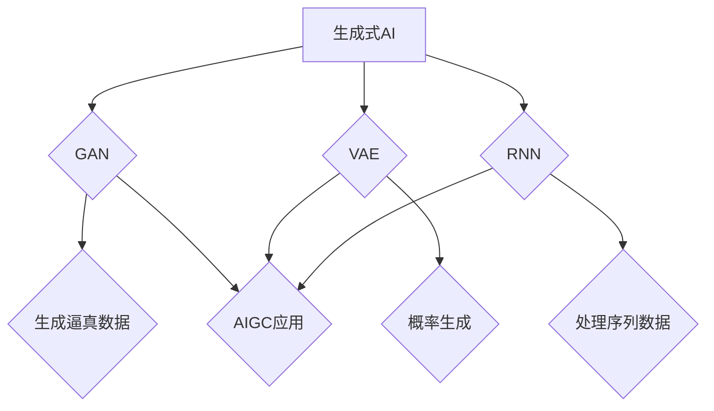
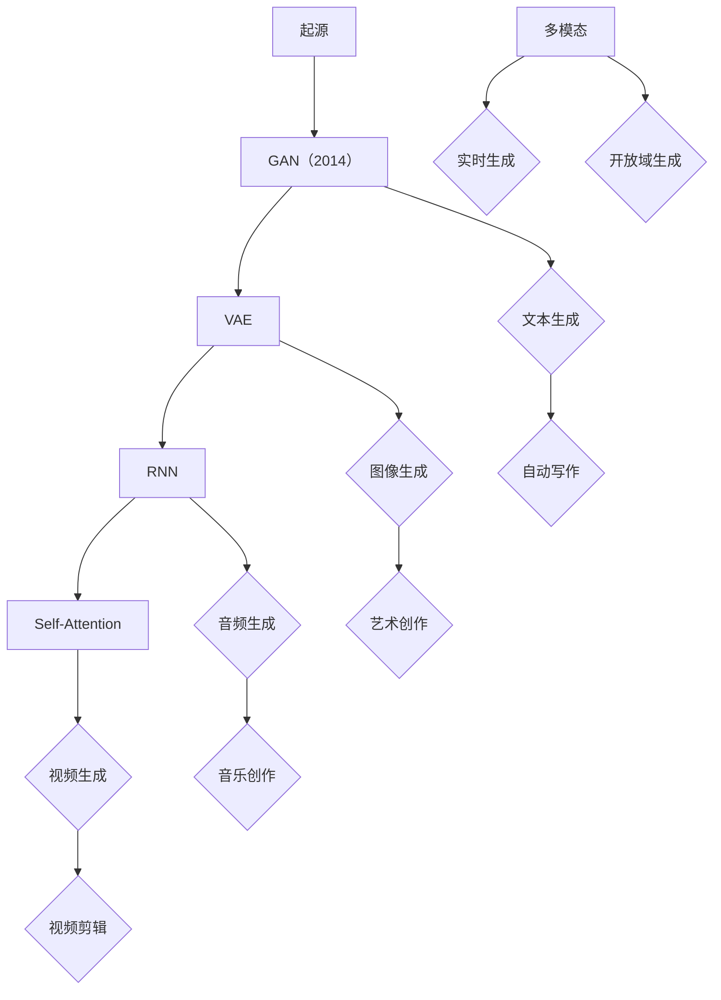
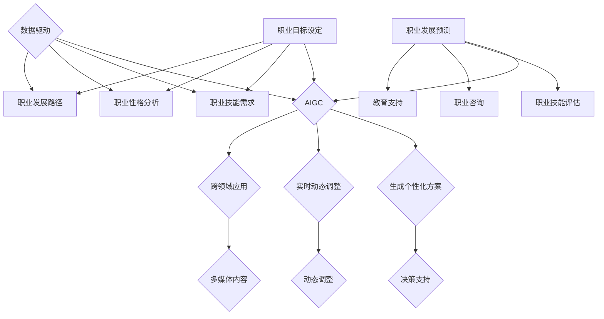
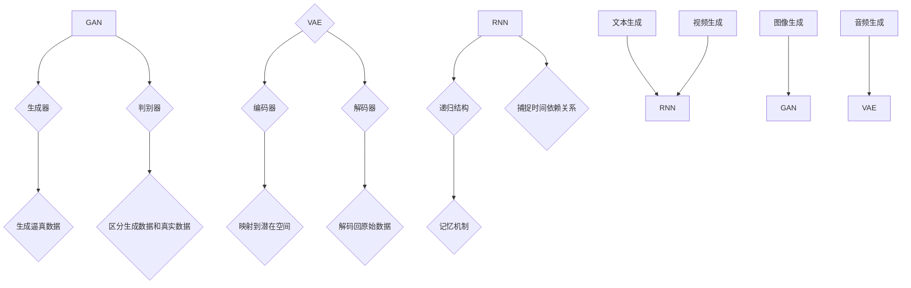
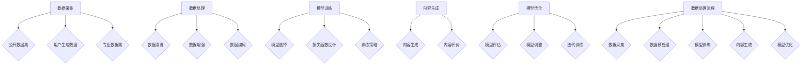
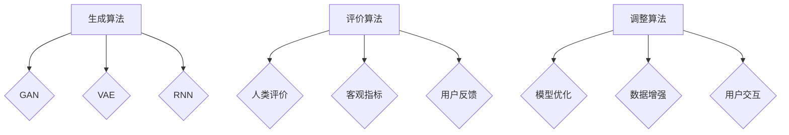

                 


### 1.1 AIGC的概念解析

AIGC（AI-Generated Content）是一种利用人工智能技术生成内容的方法，它结合了生成式人工智能（Generative AI）和自然语言处理（NLP）等先进技术，通过训练大规模数据集，使机器具备生成高质量文本、图像、音频和视频的能力。AIGC的核心在于其自学习能力，通过对海量数据的分析，模型可以学会创造新的内容，而不只是简单地模仿或分类。

在职业规划领域，AIGC的概念可以被理解为利用AI技术来帮助个人更好地规划自己的职业生涯。通过分析个人的背景、兴趣、技能和职业目标，AIGC系统能够生成个性化的职业发展建议，提供量身定制的职业规划方案。

**生成式AI基础**

生成式AI是AIGC的基础，它主要包括以下几种技术：

- **生成对抗网络（GAN）**：GAN由生成器和判别器组成，通过二者之间的博弈训练，生成器试图生成逼真的数据，而判别器则试图区分生成数据和真实数据。通过这种对抗训练，生成器能够不断提高生成数据的质量。

- **变分自编码器（VAE）**：VAE是一种概率生成模型，它通过编码器将输入数据映射到潜在空间，再通过解码器将潜在空间的数据解码回原始数据。VAE在生成图像和文本等领域有广泛应用。

- **递归神经网络（RNN）**：RNN能够处理序列数据，通过其记忆机制，可以捕捉数据中的时间依赖关系。在自然语言处理任务中，RNN被广泛应用于文本生成和翻译。

**生成式AI与个性化职业规划的关联**

生成式AI与个性化职业规划之间存在紧密的关联。首先，个性化职业规划需要处理大量关于个人的数据，包括个人背景、技能、职业目标等。生成式AI能够通过这些数据生成个性化的职业发展路径和方案。

其次，生成式AI可以模拟现实世界的职业场景，帮助个人理解不同职业发展的可能性和挑战。例如，通过生成模拟的职业生涯路径，个人可以预见到自己在未来可能面临的挑战，并提前做好准备。

此外，生成式AI还可以用于生成职业培训课程，根据个人的职业目标和技能差距，提供定制化的学习路径。

**结论**

AIGC在个性化职业规划中的应用前景广阔。通过结合生成式AI和自然语言处理技术，AIGC能够为个人提供定制化的职业规划方案，帮助个人更好地实现职业目标。



通过上述分析，我们可以看到，生成式AI的各种技术为AIGC在个性化职业规划中的应用奠定了基础。接下来，我们将进一步探讨AIGC的发展历程及其关键技术突破。

### 1.2 AIGC的发展历程

AIGC（AI-Generated Content）的发展历程可以追溯到生成式人工智能（Generative AI）的兴起。生成式人工智能是指通过模拟学习真实数据分布，从而生成新的、看似真实的数据的技术。AIGC的发展大致可以分为以下几个阶段：

**1.2.1 起源与发展**

生成式AI的起源可以追溯到20世纪80年代，当时出现了早期的人工神经网络（ANN）和生成模型。例如，1986年，霍普菲尔德（John Hopfield）提出了霍普菲尔德网络，这是一种简单的生成模型，能够生成新的数据，类似于自然语言中的单词或句子。

随着计算机性能的不断提高和大数据技术的发展，生成式AI开始获得广泛关注。2014年，生成对抗网络（GAN）的出现标志着生成式AI的一个重要突破。GAN由生成器和判别器组成，通过对抗训练，生成器能够生成高质量、逼真的图像。这一技术迅速引起了学术界和工业界的关注，并推动了AIGC的发展。

**1.2.2 关键技术突破**

AIGC的发展过程中，一系列关键技术的突破对其应用和性能提升起到了至关重要的作用。以下是几个重要的技术突破：

- **生成对抗网络（GAN）**：GAN是由生成器和判别器组成的一个对抗性模型。生成器尝试生成逼真的数据，而判别器则尝试区分真实数据和生成数据。这种对抗训练使得生成器的生成能力不断提高。2014年，Ian Goodfellow等人提出的GAN模型在图像生成方面取得了显著的成功，被认为是AIGC发展史上的一个重要里程碑。

- **变分自编码器（VAE）**：VAE是一种概率生成模型，它通过编码器将输入数据映射到一个潜在的低维空间，再通过解码器将潜在空间的数据解码回原始数据。VAE在生成图像和文本等领域有广泛应用，其优点是生成模型更容易训练且不容易过拟合。

- **递归神经网络（RNN）**：RNN能够处理序列数据，通过其记忆机制，可以捕捉数据中的时间依赖关系。RNN在自然语言处理任务中表现出色，如文本生成、机器翻译等。随着序列到序列（Seq2Seq）模型的提出，RNN在生成式AI中的应用得到了进一步扩展。

- **自注意力机制（Self-Attention）**：自注意力机制是近年来在自然语言处理领域提出的一种重要技术。自注意力机制能够模型在处理序列数据时，将不同位置的输入数据加权融合，从而更好地捕捉数据中的依赖关系。自注意力机制的引入使得Transformer模型在文本生成任务中取得了显著的性能提升。

**1.2.3 AIGC的应用领域**

AIGC在多个领域取得了显著的成果，以下是几个重要的应用领域：

- **文本生成**：AIGC在文本生成领域有广泛的应用，如自动写作、机器翻译、对话系统等。通过训练大规模语料库，AIGC模型能够生成高质量、多样化的文本，满足不同场景的需求。

- **图像生成**：AIGC在图像生成领域也有广泛的应用，如艺术创作、医学影像重建、图像修复等。通过训练图像数据，AIGC模型能够生成逼真的图像，甚至能够模仿真实图像的风格。

- **音频生成**：AIGC在音频生成领域也有重要的应用，如音乐创作、语音合成等。通过训练音频数据，AIGC模型能够生成高质量的音频，满足个性化需求。

- **视频生成**：AIGC在视频生成领域也有研究，如视频剪辑、视频增强等。通过训练视频数据，AIGC模型能够生成新的视频内容，提高视频质量。

**1.2.4 AIGC的未来发展趋势**

随着技术的不断进步和应用场景的扩展，AIGC在未来有望取得更大的突破。以下是几个未来发展趋势：

- **多模态生成**：AIGC将不再局限于单一模态的数据生成，而是能够处理多种模态的数据，如文本、图像、音频和视频。这将使得AIGC在更广泛的应用场景中发挥作用。

- **个性化生成**：随着数据积累和模型优化，AIGC将能够更好地满足个性化需求，生成更加贴近用户期望的内容。

- **实时生成**：随着计算能力的提升，AIGC将能够在实时场景中发挥作用，如实时图像生成、实时语音合成等。

- **开放域生成**：AIGC将不再局限于特定领域，而是能够在开放域中生成高质量的内容，如生成新闻、生成社交媒体内容等。

**结论**

AIGC的发展历程体现了人工智能技术的不断进步和应用领域的扩展。通过关键技术的突破，AIGC在个性化职业规划等领域展现了巨大的应用潜力。随着技术的进一步发展，AIGC将为个性化职业规划提供更加智能和高效的解决方案。



通过上述分析，我们可以看到，AIGC的发展历程及其关键技术突破为个性化职业规划提供了坚实的基础。在下一章中，我们将进一步探讨AIGC的核心概念与架构。

### 1.3 AIGC在个性化职业规划中的应用前景

随着人工智能技术的不断进步，AIGC（AI-Generated Content）在个性化职业规划中的应用前景愈发广阔。个性化职业规划涉及到个人职业目标设定、职业技能需求分析、职业发展路径预测等多个方面，而AIGC技术以其强大的生成能力和数据分析能力，能够为这一领域提供创新的解决方案。

**个性化职业规划需求**

在现代社会，职业规划的重要性日益凸显。每个人对职业发展都有不同的期望和目标，因此，传统的“一刀切”式职业规划方法已经无法满足多样化的需求。个性化职业规划强调根据个人的兴趣、能力、价值观等多方面因素，为每个人提供量身定制的职业发展方案。

具体来说，个性化职业规划的需求包括：

- **职业目标设定**：帮助个人明确短期和长期的职业目标，确保职业规划与个人愿景相一致。

- **职业技能需求**：分析个人目前具备的技能和未来需要的技能，提供针对性的培训和发展建议。

- **职业性格分析**：通过性格测试和职业评估，了解个人的性格特点和职业偏好，为职业选择提供参考。

- **职业发展路径**：预测个人的职业发展路径，提供不同阶段的发展建议，帮助个人应对职业生涯中的挑战。

**AIGC技术优势分析**

AIGC技术在个性化职业规划中的应用优势主要体现在以下几个方面：

- **数据驱动的决策支持**：AIGC能够处理和分析大量结构化和非结构化数据，包括职业数据、教育背景、市场趋势等，从而为职业规划提供数据驱动的决策支持。

- **生成个性化的职业发展方案**：通过生成式人工智能技术，AIGC能够根据个人数据生成个性化的职业发展方案，包括职业目标、技能培训路径、职业转换策略等。

- **实时动态调整**：AIGC系统可以实时监测职业市场的变化和个人职业发展情况，动态调整职业规划方案，确保其始终与个人目标和市场需求相匹配。

- **跨领域应用**：AIGC不仅能够处理文本数据，还可以生成图像、音频和视频等多媒体内容。这意味着，职业规划方案可以更加生动和具体，提高个人的接受度和参与度。

**实际应用场景**

AIGC在个性化职业规划中具有广泛的应用场景，以下是一些典型的例子：

- **职业发展预测**：利用AIGC技术，可以建立职业发展预测模型，分析不同职业路径的潜在收益和风险，帮助个人做出更明智的职业决策。

- **职业技能评估**：通过AIGC系统，个人可以接受在线职业技能评估，系统会根据评估结果生成个性化的技能提升建议。

- **职业咨询**：AIGC可以作为一个智能职业咨询师，根据用户的输入信息，提供个性化的职业咨询服务，包括职业选择、职业转换和职业发展策略。

- **教育支持**：在教育领域，AIGC可以为学生提供个性化的职业规划指导，帮助他们在学习过程中明确职业方向，提高学习动力和效果。

**结论**

AIGC在个性化职业规划中的应用前景广阔。通过结合生成式人工智能和数据驱动的决策支持，AIGC能够为个人提供个性化、实时动态的职业规划服务，帮助他们在竞争激烈的职业市场中找到适合自己的发展路径。随着技术的进一步发展，AIGC将在个性化职业规划领域发挥越来越重要的作用。



通过上述分析，我们可以看到，AIGC在个性化职业规划中具有显著的应用价值和广阔的前景。在接下来的章节中，我们将深入探讨AIGC的核心概念与架构，进一步理解其在个性化职业规划中的具体实现和应用。

### 2.1 生成式AI基础理论

生成式AI（Generative AI）是AIGC（AI-Generated Content）的核心技术之一，其主要目标是利用数据生成新的、高质量的内容。生成式AI包括多种技术，其中最为重要的有生成对抗网络（GAN）、变分自编码器（VAE）和递归神经网络（RNN）。以下将详细阐述这些技术的基本原理。

**生成对抗网络（GAN）**

生成对抗网络（GAN）由生成器（Generator）和判别器（Discriminator）两部分组成。生成器的任务是生成与真实数据相似的数据，而判别器的任务是区分生成数据和真实数据。通过这种对抗训练，生成器不断提高生成数据的质量，而判别器也不断提高对真实数据和生成数据的区分能力。

GAN的训练过程可以理解为一种“猫捉老鼠”的游戏：生成器尝试生成更加逼真的数据，而判别器则不断学习如何区分这些数据。当生成器的生成能力足够强时，判别器将无法区分生成数据和真实数据，这时生成器就可以生成高质量的数据。

GAN的核心公式为：

$$
\min_G \max_D V(D, G)
$$

其中，\( V(D, G) \) 表示判别器的损失函数，通常采用二元交叉熵损失函数。生成器 \( G \) 的目标是最小化判别器 \( D \) 的损失函数，使得生成数据在判别器看来几乎不可区分。

**变分自编码器（VAE）**

变分自编码器（VAE）是一种概率生成模型，它通过编码器（Encoder）和解码器（Decoder）两个部分完成数据的生成。编码器将输入数据映射到一个潜在空间，解码器则将潜在空间的数据解码回原始数据。

VAE的核心思想是引入潜在变量，使得生成过程具备一定的概率分布。编码器输出潜在变量的均值和方差，解码器则根据潜在变量生成数据。这种概率生成方式使得VAE在生成图像和文本等方面具有较好的表现。

VAE的训练过程可以理解为以下步骤：

1. **编码**：输入数据通过编码器映射到潜在空间，输出潜在变量的均值 \( \mu \) 和方差 \( \sigma^2 \)。

2. **采样**：从潜在空间中采样一个数据点 \( z \)。

3. **解码**：将采样得到的潜在变量 \( z \) 通过解码器解码回原始数据。

VAE的损失函数通常包括数据重建损失和KL散度损失两部分。数据重建损失用于衡量输入数据和重构数据的相似度，KL散度损失用于衡量编码器输出的潜在变量分布与先验分布的差异。

**递归神经网络（RNN）**

递归神经网络（RNN）是一种能够处理序列数据的神经网络，其核心特点在于其内部具有记忆机制，能够捕捉序列中的时间依赖关系。RNN通过递归结构，将当前时刻的输入和前一个时刻的隐藏状态作为当前时刻的输出。

RNN的数学模型可以表示为：

$$
h_t = \sigma(W_hh_{t-1} + W_{xi}x_t + b_h)
$$

$$
o_t = \sigma(W_{ho}h_t + b_o)
$$

其中，\( h_t \) 表示第 \( t \) 个时刻的隐藏状态，\( x_t \) 表示第 \( t \) 个时刻的输入，\( o_t \) 表示第 \( t \) 个时刻的输出。\( \sigma \) 表示激活函数，\( W_h \)、\( W_{xi} \)、\( W_{ho} \) 和 \( b_h \)、\( b_o \) 分别为权重和偏置。

RNN在自然语言处理任务中表现出色，例如文本生成、机器翻译等。然而，传统的RNN存在梯度消失和梯度爆炸等问题，影响模型的训练效果。为了解决这些问题，LSTM（长短时记忆网络）和GRU（门控循环单元）等改进模型被提出。

**结论**

生成式AI（Generative AI）是AIGC（AI-Generated Content）的核心技术，其主要包括生成对抗网络（GAN）、变分自编码器（VAE）和递归神经网络（RNN）等技术。通过这些技术，AIGC能够生成高质量、多样化的人工智能内容，为个性化职业规划等领域提供创新的解决方案。在下一章中，我们将进一步探讨AIGC的系统架构及其关键组件。



通过上述分析，我们可以看到，生成式AI的基本理论包括GAN、VAE和RNN等关键技术，这些技术为AIGC在个性化职业规划中的应用奠定了基础。在下一章中，我们将详细讨论AIGC的系统架构。

### 2.2 AIGC系统架构

AIGC（AI-Generated Content）系统架构是一个复杂且多层次的结构，其核心在于将生成式AI技术有效地应用于内容创作过程中。一个典型的AIGC系统通常包括数据采集、数据处理、模型训练、内容生成和评价反馈等关键组件。以下将详细阐述这些组件及其交互过程。

**数据采集**

数据采集是AIGC系统的第一步，也是至关重要的一步。高质量的训练数据是生成高质量内容的基础。数据来源可以包括以下几种：

- **公开数据集**：如COCO（Common Objects in Context）、CIFAR-10等，这些数据集涵盖了多种类别和场景，为模型训练提供了丰富的样本。
- **用户生成数据**：通过用户上传或输入数据，例如社交媒体内容、个人简历等，这些数据可以反映用户的个性化需求和兴趣。
- **专业数据集**：如医学影像、金融数据等，这些数据集具有高度的专业性和复杂性，适用于特定的内容生成任务。

**数据处理**

数据采集完成后，需要对数据进行预处理和清洗，以确保数据的质量和一致性。数据处理包括以下步骤：

- **数据清洗**：去除噪声数据、填补缺失值、消除异常值等，提高数据的质量。
- **数据增强**：通过图像旋转、缩放、裁剪等操作，增加数据的多样性和丰富性，从而提高模型的泛化能力。
- **数据编码**：将原始数据转换为适合模型训练的格式，例如将图像数据编码为像素矩阵，将文本数据编码为单词或字符序列。

**模型训练**

模型训练是AIGC系统的核心环节，其目的是通过大量数据训练生成模型，使其能够生成高质量的内容。模型训练包括以下步骤：

- **模型选择**：选择合适的生成模型，如GAN、VAE、RNN等，根据任务需求和数据特性进行选择。
- **损失函数设计**：根据模型类型和任务目标，设计合适的损失函数，以衡量模型生成数据的真实性和质量。
- **训练策略**：采用适当的训练策略，如梯度裁剪、学习率调整等，优化模型性能。

**内容生成**

在模型训练完成后，AIGC系统可以通过生成模型生成新的内容。内容生成过程通常包括以下步骤：

- **内容生成**：通过模型生成新的内容，例如图像、文本、音频等。生成过程可以是单向生成，也可以是交互式生成，用户可以根据生成内容进行反馈和调整。
- **内容评价**：对生成内容进行评价，以衡量生成质量。评价方法可以包括主观评价和客观评价，如人类评价、指标评分等。

**模型优化**

模型优化是AIGC系统的持续过程，其目的是不断提高模型生成内容的质量和效率。模型优化包括以下步骤：

- **模型评估**：通过测试集评估模型性能，识别模型存在的问题和不足。
- **模型调整**：根据评估结果，对模型进行调整和优化，如调整模型结构、修改训练策略等。
- **迭代训练**：通过不断迭代训练，逐步提高模型性能。

**数据处理流程**

AIGC系统的数据处理流程可以概括为以下几个步骤：

1. **数据采集**：从多种来源采集数据，确保数据的多样性和丰富性。
2. **数据预处理**：对数据进行清洗、增强和编码，为模型训练做好准备。
3. **模型训练**：通过大量数据训练生成模型，使其能够生成高质量的内容。
4. **内容生成**：利用训练好的模型生成新的内容，并根据用户反馈进行优化。
5. **模型优化**：通过评估和调整，不断提高模型生成内容的质量和效率。

**模型训练与优化**

模型训练与优化是AIGC系统的重要组成部分，其目的是通过不断迭代训练，提高模型生成内容的质量和效率。以下是模型训练与优化的主要步骤：

1. **初始化模型**：选择合适的模型结构，初始化模型参数。
2. **数据加载**：将预处理后的数据加载到训练过程中，确保数据流连续稳定。
3. **模型训练**：通过反向传播算法更新模型参数，优化模型性能。
4. **模型评估**：在测试集上评估模型性能，识别模型存在的问题和不足。
5. **模型调整**：根据评估结果，调整模型结构、损失函数和训练策略等。
6. **迭代训练**：重复模型训练和评估过程，逐步提高模型性能。

**结论**

AIGC系统架构是一个复杂且多层次的结构，其核心在于将生成式AI技术应用于内容创作过程中。通过数据采集、数据处理、模型训练、内容生成和模型优化等关键组件，AIGC系统能够生成高质量、多样化的内容，为个性化职业规划等领域提供创新的解决方案。在下一章中，我们将进一步探讨AIGC的关键算法及其工作原理。



通过上述分析，我们可以看到，AIGC系统架构及其数据处理流程为生成高质量的内容提供了坚实的基础。在接下来的章节中，我们将详细探讨AIGC系统的关键算法，进一步理解其工作原理。

### 2.3 AIGC关键算法

AIGC（AI-Generated Content）系统的核心在于其生成算法、评价算法和调整算法。这些算法共同协作，确保系统能够生成高质量、多样化且符合用户需求的内容。以下将详细阐述这些关键算法及其工作原理。

**生成算法**

生成算法是AIGC系统的核心，其目的是通过模型生成新的、高质量的内容。生成算法主要包括以下几种：

- **生成对抗网络（GAN）**：GAN由生成器和判别器组成，生成器生成数据，判别器评估生成数据的真实程度。生成器和判别器通过对抗训练，生成器逐渐生成更逼真的数据，判别器逐渐提高对真实数据和生成数据的区分能力。

  GAN的生成算法可以表示为以下步骤：
  ```mermaid
  graph TD
      A[生成器] --> B{生成数据}
      A --> C{对抗训练}
      D[判别器] --> E{评估数据}
      D --> F{对抗训练}
  ```

- **变分自编码器（VAE）**：VAE是一种概率生成模型，通过编码器将输入数据映射到潜在空间，解码器将潜在空间的数据解码回原始数据。VAE利用潜在变量的概率分布生成新数据。

  VAE的生成算法可以表示为以下步骤：
  ```mermaid
  graph TD
      A[编码器] --> B{映射到潜在空间}
      B --> C[采样潜在变量]
      D[解码器] --> E{解码回原始数据}
  ```

- **递归神经网络（RNN）**：RNN是一种能够处理序列数据的神经网络，其记忆机制使其能够生成序列数据，如文本、音频等。

  RNN的生成算法可以表示为以下步骤：
  ```mermaid
  graph TD
      A[输入序列] --> B{RNN处理}
      B --> C[输出序列]
  ```

**评价算法**

评价算法用于衡量生成内容的质量，确保生成的内容符合用户需求和预期。评价算法主要包括以下几种：

- **基于人类评价**：通过人类评估生成内容的质量，例如文本生成任务的评估通常采用BLEU、ROUGE等指标。

  评价算法可以表示为以下步骤：
  ```mermaid
  graph TD
      A[生成内容] --> B{人类评估}
      B --> C[质量评分]
  ```

- **基于客观指标**：通过计算生成内容的客观指标，如文本生成的准确率、图像生成的PSNR等。

  评价算法可以表示为以下步骤：
  ```mermaid
  graph TD
      A[生成内容] --> B{计算指标}
      B --> C[质量评分]
  ```

- **基于用户反馈**：通过用户对生成内容的反馈，动态调整生成算法，优化生成质量。

  评价算法可以表示为以下步骤：
  ```mermaid
  graph TD
      A[生成内容] --> B{用户反馈}
      B --> C{调整生成算法}
  ```

**调整算法**

调整算法用于优化生成算法，提高生成内容的质量和效率。调整算法主要包括以下几种：

- **基于模型优化**：通过调整模型结构、参数和训练策略，优化生成算法。

  调整算法可以表示为以下步骤：
  ```mermaid
  graph TD
      A[模型评估] --> B{调整模型}
      B --> C[模型优化]
  ```

- **基于数据增强**：通过增加数据多样性、数据增强等手段，提高生成算法的泛化能力。

  调整算法可以表示为以下步骤：
  ```mermaid
  graph TD
      A[数据评估] --> B{数据增强}
      B --> C[数据优化]
  ```

- **基于用户交互**：通过用户与系统的交互，动态调整生成算法，满足用户个性化需求。

  调整算法可以表示为以下步骤：
  ```mermaid
  graph TD
      A[用户交互] --> B{调整生成算法}
      B --> C[用户满意度优化]
  ```

**结论**

AIGC的关键算法包括生成算法、评价算法和调整算法。这些算法共同协作，确保AIGC系统能够生成高质量、多样化且符合用户需求的内容。通过不断优化和调整，AIGC系统将在个性化职业规划等领域发挥越来越重要的作用。在下一章中，我们将深入分析个性化职业规划的需求，为AIGC在职业规划中的应用奠定基础。



通过上述分析，我们可以看到，AIGC的关键算法在生成内容、评价内容和调整算法方面发挥着重要作用。在下一章中，我们将进一步探讨个性化职业规划的需求和挑战。

### 3.1 职业规划基本概念

职业规划是一个涉及个人职业发展的一系列决策过程，旨在帮助个人明确职业目标、制定合理的职业路径，并不断提升职业技能，实现职业生涯的持续发展。以下将详细阐述职业规划的内涵与外延，以及职业发展路径的概念。

**职业规划的内涵**

职业规划的内涵主要包括以下几个方面：

- **目标设定**：明确个人职业发展的短期和长期目标，确保职业规划与个人愿景相一致。目标可以是职业晋升、技能提升、创业等。

- **技能评估**：分析个人目前具备的技能和未来需要的技能，识别技能差距，为职业规划提供数据支持。

- **路径设计**：制定合理的职业发展路径，包括职位晋升、职业转换等，确保个人能够在职业生涯中不断进步。

- **资源整合**：整合内外部资源，如职业培训、职业导师、职业网络等，为职业规划的实施提供支持。

- **动态调整**：根据职业市场变化和个人发展情况，动态调整职业规划方案，确保其始终与个人目标和市场需求相匹配。

**职业规划的外延**

职业规划的外延包括以下几个方面：

- **个人发展**：不仅关注职业发展，还涉及个人成长、技能提升、工作与生活的平衡等。

- **职业咨询**：提供职业规划咨询服务，帮助个人解决职业发展中的困惑和问题。

- **职业教育**：通过职业培训、在线课程等形式，提升个人的职业技能和知识水平。

- **职业测评**：通过职业性格测试、能力评估等手段，了解个人的职业倾向和发展潜力。

- **职业网络**：建立和维护职业关系网络，为职业发展提供信息和支持。

**职业发展路径**

职业发展路径是指个人在职业生涯中所经历的一系列职位和阶段。职业发展路径可以分为以下几个阶段：

- **初级阶段**：通常是在学校或初入职场时的阶段，主要任务是学习和积累基本技能。

- **成长阶段**：在积累一定工作经验后，个人开始晋升和转换职位，逐步拓展职业技能和业务领域。

- **成熟阶段**：个人在某一领域或职位上积累了丰富的经验，成为行业内的专家或领导者。

- **衰退阶段**：随着职业经验的积累，个人可能面临职业瓶颈或衰退，需要重新规划职业发展路径。

- **转型阶段**：在职业衰退或个人兴趣发生变化时，个人可能需要转型或重新定位职业方向。

**结论**

职业规划是一个复杂且动态的过程，它不仅涉及个人的职业目标设定和路径设计，还涉及技能评估、资源整合和动态调整等多个方面。通过科学合理的职业规划，个人可以更好地实现职业发展目标，提升职业竞争力。在下一章中，我们将深入分析用户需求，为AIGC在职业规划中的应用提供基础。

### 3.2 用户需求分析与分类

在个性化职业规划中，用户需求的准确分析和分类是至关重要的。只有深入理解用户的多样化需求，才能为AIGC系统提供针对性的解决方案，确保其能够为用户提供高效、实用的职业发展建议。以下将详细分析个性化职业规划中的用户需求，并对其进行分类。

**职业目标设定**

职业目标设定是用户在职业规划中首要关注的需求。具体来说，用户的需求可以分为以下几种：

- **短期目标**：用户希望在短期内实现的具体职业目标，如晋升到更高职位、获得某一专业认证等。
- **长期目标**：用户在未来几年内期望实现的职业目标，如成为某一领域的专家、实现职业转型等。

为了满足用户在职业目标设定方面的需求，AIGC系统需要具备以下功能：

- **目标识别**：通过分析用户的历史职业发展数据、个人兴趣和能力，帮助用户识别明确的职业目标。
- **目标设定**：提供多种职业目标设定方案，根据用户的不同需求和背景，为用户制定个性化的职业目标。

**职业技能需求**

职业技能需求是用户在职业规划中关注的另一个重要方面。用户的需求主要包括以下几个方面：

- **现有技能评估**：用户希望了解自己目前具备的技能，包括专业技能、软技能等。
- **未来技能需求**：用户希望识别未来职业发展所需的技能，如新的技术、行业趋势等。
- **技能提升路径**：用户希望获得详细的技能提升路径，包括学习资源、培训课程等。

为了满足用户在职业技能需求方面的需求，AIGC系统需要具备以下功能：

- **技能评估**：通过分析用户的工作经历、教育背景等，为用户生成详细的技能评估报告。
- **技能推荐**：根据用户的职业目标和现有技能，为用户推荐适合的技能提升路径和学习资源。
- **动态更新**：随着用户职业发展，AIGC系统需要不断更新和调整技能需求，确保推荐的技能提升路径始终符合用户的实际需求。

**职业性格分析**

职业性格分析是用户在职业规划中关注的第三个重要需求。用户的性格特点直接影响其职业选择和发展。用户的需求主要包括以下几个方面：

- **性格识别**：用户希望了解自己的性格特点，包括优势、劣势等。
- **职业匹配度**：用户希望分析自己的性格与不同职业的匹配度，以找到最适合自己的职业方向。
- **发展建议**：用户希望获得基于性格分析的个性化发展建议，包括职业转换、技能提升等。

为了满足用户在职业性格分析方面的需求，AIGC系统需要具备以下功能：

- **性格测试**：通过科学的性格测试工具，为用户生成详细的性格分析报告。
- **职业匹配度评估**：根据用户的性格特点，评估其与不同职业的匹配度，为用户推荐最适合的职业方向。
- **发展建议**：根据用户的性格分析和职业匹配度评估，为用户提供个性化的职业发展建议。

**数据采集与处理**

为了满足上述用户需求，AIGC系统需要采集和处理大量的用户数据，包括职业背景、技能数据、性格测试结果等。数据采集和处理的过程可以分为以下几个步骤：

- **数据采集**：从多种渠道采集用户数据，包括用户上传的数据、第三方数据平台等。
- **数据预处理**：对采集到的数据进行清洗、去重、格式转换等预处理操作，确保数据的质量和一致性。
- **数据存储**：将预处理后的数据存储到数据库中，便于后续的查询和分析。
- **数据分析**：利用数据挖掘和机器学习技术，对用户数据进行深度分析，提取有用的信息。

**结论**

通过深入分析用户需求，我们可以看到，个性化职业规划涉及到职业目标设定、职业技能需求和职业性格分析等多个方面。AIGC系统通过精确识别和分析用户需求，为用户提供定制化的职业发展建议，帮助用户实现职业目标。在下一章中，我们将进一步探讨如何利用AIGC技术构建个性化的职业规划模型。

### 3.3 数据采集与处理

在个性化职业规划中，数据采集与处理是至关重要的一环。准确和高效的数据采集与处理能够为AIGC系统提供高质量的数据支持，从而生成更加精准的职业规划方案。以下将详细讨论数据采集的来源、数据预处理的方法和数据处理的具体流程。

**数据采集的来源**

数据采集是构建个性化职业规划模型的基础。AIGC系统需要从多个渠道收集用户数据，以保证数据的全面性和多样性。以下是一些常见的数据采集来源：

- **用户自我报告**：通过用户填写问卷、简历、自我评价等方式，获取用户的基本信息、职业目标、职业技能和性格特点等。
- **第三方数据平台**：利用社交媒体、职业网站、教育平台等第三方数据平台，获取用户的公开信息、工作经历、教育背景等。
- **公共数据集**：利用公开的数据集，如职业报告、行业趋势分析等，获取与职业规划相关的宏观信息。
- **企业内部数据**：对于企业用户，可以从企业内部系统获取用户的工作表现、项目经历、绩效评价等数据。

**数据预处理的方法**

数据预处理是确保数据质量、提高模型性能的关键步骤。数据预处理的方法主要包括以下几种：

- **数据清洗**：去除重复数据、无效数据和噪声数据，保证数据的准确性和一致性。例如，去除包含错误或缺失值的记录，纠正数据格式等。
- **数据转换**：将不同类型的数据转换为统一格式，便于后续处理。例如，将文本数据转换为数值向量，将图像数据转换为矩阵等。
- **数据标准化**：对数据进行归一化或标准化处理，使数据分布更加均匀，避免因数据量级差异而影响模型训练效果。例如，对数值数据进行缩放或标准化。
- **特征提取**：从原始数据中提取有用的特征，为模型训练提供支持。例如，从文本数据中提取关键词、从图像数据中提取特征向量等。

**数据处理的具体流程**

数据处理的具体流程可以分为以下几个步骤：

1. **数据收集**：从多个渠道收集用户数据，包括用户自我报告、第三方数据平台、公共数据集和企业内部数据等。
2. **数据清洗**：去除重复数据、无效数据和噪声数据，保证数据的准确性和一致性。
3. **数据转换**：将不同类型的数据转换为统一格式，便于后续处理。例如，将文本数据转换为数值向量，将图像数据转换为矩阵等。
4. **数据标准化**：对数据进行归一化或标准化处理，使数据分布更加均匀，避免因数据量级差异而影响模型训练效果。
5. **特征提取**：从原始数据中提取有用的特征，为模型训练提供支持。例如，从文本数据中提取关键词、从图像数据中提取特征向量等。
6. **数据存储**：将预处理后的数据存储到数据库中，便于后续的查询和分析。
7. **数据分析**：利用数据挖掘和机器学习技术，对用户数据进行深度分析，提取有用的信息。例如，分析用户的职业目标、技能需求和性格特点等。

**结论**

数据采集与处理是构建个性化职业规划模型的基础。通过多种渠道采集用户数据，利用有效的数据预处理方法，AIGC系统能够为用户提供高质量的职业规划服务。在下一章中，我们将进一步探讨如何利用AIGC技术构建个性化的职业规划模型。

### 4.1 职业预测模型构建

职业预测模型是AIGC在个性化职业规划中的关键应用之一，其主要目的是通过分析用户数据，预测用户未来的职业发展方向。构建一个高效、准确的职业预测模型需要经过数据预处理、模型选择、模型训练和模型评估等多个步骤。以下将详细阐述这些步骤及其实现方法。

**数据预处理**

数据预处理是构建预测模型的第一步，其目的是提高数据的质量和一致性，为模型训练提供可靠的数据支持。数据预处理包括以下几个关键步骤：

1. **数据清洗**：去除重复数据、无效数据和噪声数据，确保数据的准确性。例如，去除包含错误或缺失值的记录，纠正数据格式等。

2. **数据转换**：将不同类型的数据转换为统一格式，便于后续处理。例如，将文本数据转换为数值向量，将图像数据转换为矩阵等。

3. **数据标准化**：对数据进行归一化或标准化处理，使数据分布更加均匀，避免因数据量级差异而影响模型训练效果。例如，对数值数据进行缩放或标准化。

4. **特征提取**：从原始数据中提取有用的特征，为模型训练提供支持。例如，从文本数据中提取关键词、从图像数据中提取特征向量等。

**模型选择**

选择合适的模型是构建预测模型的关键。根据不同应用场景和数据特性，可以选择以下几种模型：

1. **机器学习模型**：如线性回归、逻辑回归、支持向量机（SVM）等。这些模型在处理结构化数据时表现出色。

2. **深度学习模型**：如卷积神经网络（CNN）、递归神经网络（RNN）和Transformer等。这些模型在处理复杂数据和高维特征时具有优势。

3. **集成模型**：如随机森林、梯度提升树（GBDT）等。这些模型通过集成多个基模型，提高预测的准确性和稳定性。

4. **神经网络模型**：如生成对抗网络（GAN）、变分自编码器（VAE）等。这些模型在生成新数据和特征提取方面具有独特的优势。

**模型训练**

模型训练是构建预测模型的核心步骤，其目的是通过大量数据训练模型，使其能够预测用户未来的职业发展方向。以下是一些关键步骤：

1. **数据划分**：将数据集划分为训练集、验证集和测试集，用于模型训练、验证和评估。

2. **参数调优**：通过调整模型参数，如学习率、正则化参数等，优化模型性能。可以使用网格搜索、随机搜索等策略进行参数调优。

3. **训练过程**：使用训练集数据训练模型，通过反向传播算法更新模型参数。训练过程中，可以使用早期停止、学习率调整等技术防止过拟合。

4. **验证评估**：在验证集上评估模型性能，根据评估结果调整模型参数。常用的评估指标包括准确率、召回率、F1分数等。

**模型评估**

模型评估是确保预测模型准确性和可靠性的关键步骤。以下是一些常见的评估指标和方法：

1. **准确率（Accuracy）**：预测正确的样本数占总样本数的比例。准确率适用于分类任务，但在数据不平衡的情况下可能存在偏差。

2. **召回率（Recall）**：预测正确的正类样本数占实际正类样本数的比例。召回率关注的是预测结果中的正类样本，适用于需要关注漏判情况的场景。

3. **精确率（Precision）**：预测正确的正类样本数占预测为正类样本总数的比例。精确率关注的是预测结果的准确性，适用于需要高准确性的场景。

4. **F1分数（F1 Score）**：精确率和召回率的调和平均值，综合考虑了预测结果中的准确性和完整性。F1分数适用于平衡精确率和召回率的场景。

5. **ROC曲线（Receiver Operating Characteristic Curve）和AUC（Area Under Curve）**：ROC曲线反映了不同阈值下的精确率和召回率关系，AUC值越接近1，模型的分类能力越强。

**结论**

职业预测模型构建是一个复杂的过程，需要经过数据预处理、模型选择、模型训练和模型评估等多个步骤。通过科学的方法和策略，AIGC技术能够为个性化职业规划提供准确的职业预测，帮助用户制定合理的职业发展计划。在下一章中，我们将进一步探讨AIGC在职业规划中的具体应用，如职业推荐系统和职业规划方案生成等。

### 4.2 职业推荐系统

职业推荐系统是AIGC在个性化职业规划中的另一个重要应用，其目的是根据用户的职业背景、技能需求和性格特点，为用户推荐与其匹配度高的职业机会和职业发展路径。以下将详细探讨职业推荐系统的推荐算法、推荐结果评估和实际应用。

**推荐算法**

职业推荐系统的推荐算法通常基于以下几种策略：

1. **基于内容的推荐（Content-Based Recommendation）**：
   - 原理：根据用户的职业背景、技能和兴趣，推荐与其职业内容相似的职位或职业发展路径。
   - 实现步骤：
     1. 特征提取：从用户数据中提取关键特征，如职业技能、工作经验、教育背景等。
     2. 内容匹配：计算用户特征与职位特征之间的相似度，根据相似度推荐职位。
     3. 排序：对推荐结果进行排序，优先推荐相似度较高的职位。

2. **协同过滤推荐（Collaborative Filtering Recommendation）**：
   - 原理：基于用户的历史行为数据（如求职记录、浏览记录等）和相似用户的行为数据，推荐用户可能感兴趣的职位。
   - 实现步骤：
     1. 用户-物品矩阵构建：构建用户与职位之间的交互矩阵。
     2. 相似度计算：计算用户之间的相似度，如使用余弦相似度、皮尔逊相关系数等。
     3. 推荐生成：根据相似度矩阵，为每个用户推荐与相似用户偏好相似的职位。

3. **混合推荐（Hybrid Recommendation）**：
   - 原理：结合基于内容和协同过滤推荐的优点，为用户提供更加个性化的职业推荐。
   - 实现步骤：
     1. 特征提取：从用户数据中提取关键特征。
     2. 内容匹配：计算用户特征与职位特征之间的相似度。
     3. 相似用户挖掘：基于协同过滤方法，挖掘与用户相似的潜在用户群体。
     4. 推荐生成：综合考虑内容匹配和相似用户偏好，为用户推荐职位。

**推荐结果评估**

推荐结果评估是衡量职业推荐系统性能的重要步骤，常用的评估指标包括：

1. **准确率（Accuracy）**：预测正确的职位数量占总推荐职位数量的比例。准确率越高，推荐结果的准确性越好。

2. **召回率（Recall）**：与用户实际匹配的职位数量占总可能匹配职位数量的比例。召回率越高，推荐结果中的相关职位越多。

3. **精确率（Precision）**：与用户实际匹配的职位数量占推荐职位数量的比例。精确率越高，推荐结果中的职位越符合用户需求。

4. **F1分数（F1 Score）**：精确率和召回率的调和平均值。F1分数综合考虑了推荐结果的准确性和完整性。

5. **覆盖率（Coverage）**：推荐结果中包含的不同职位数量占总职位数量的比例。覆盖率越高，推荐结果越多样化。

6. **新颖性（Novelty）**：推荐结果中包含的新职位数量占总职位数量的比例。新颖性越高，推荐结果越具有吸引力。

**实际应用**

职业推荐系统在个性化职业规划中具有广泛的应用，以下是一些实际应用场景：

1. **求职推荐**：为求职者推荐与其技能背景和职业目标相匹配的职位，提高求职成功率。

2. **职业发展路径推荐**：根据用户的职业发展需求和现有技能，推荐适合的职业晋升路径和培训课程。

3. **企业人才招聘**：为企业推荐与职位要求相匹配的求职者，提高招聘效率和效果。

4. **职业咨询**：为用户提供个性化的职业发展建议，帮助用户更好地规划职业生涯。

5. **教育辅导**：为学生和职场新人推荐适合的职业发展方向和学习资源，提高职业素质和竞争力。

**结论**

职业推荐系统是AIGC在个性化职业规划中的重要应用之一。通过基于内容的推荐、协同过滤推荐和混合推荐等算法，职业推荐系统能够为用户提供精准的职业推荐服务，提高求职效率和企业招聘效果。在下一章中，我们将进一步探讨如何利用AIGC技术生成个性化的职业规划方案。

### 4.3 职业规划方案生成

职业规划方案生成是AIGC在个性化职业规划中的又一重要应用，其目的是通过分析用户的职业背景、技能需求和性格特点，生成一份符合用户需求的职业发展方案。以下将详细探讨职业规划方案生成的策略、评估与优化方法。

**方案生成策略**

职业规划方案的生成策略可以分为以下几个步骤：

1. **需求分析**：通过对用户职业背景、技能需求和性格特点的分析，了解用户的职业目标和发展需求。

2. **路径规划**：根据用户的需求，规划职业发展路径，包括晋升路径、职业转换路径等。

3. **方案设计**：结合用户的职业背景和市场需求，设计具体的职业规划方案，包括技能提升方案、培训课程、实习机会等。

4. **资源整合**：整合内外部资源，如职业导师、培训机构、职业网络等，为职业规划方案的实施提供支持。

5. **动态调整**：根据用户反馈和职业市场变化，动态调整职业规划方案，确保其始终符合用户的需求和市场需求。

**方案评估与优化**

职业规划方案的评估与优化是确保方案有效性的关键步骤。以下是一些常见的评估与优化方法：

1. **用户反馈**：通过用户对职业规划方案的反馈，评估方案的实用性和满意度。根据用户反馈，调整和优化方案内容。

2. **数据监测**：通过监测用户在实施职业规划方案过程中的数据，如学习进度、工作绩效等，评估方案的实际效果。根据监测数据，调整和优化方案。

3. **专家评审**：邀请职业规划专家对职业规划方案进行评审，从专业角度评估方案的科学性和可行性。根据专家意见，调整和优化方案。

4. **模拟预测**：通过模拟用户在实施职业规划方案后的职业发展路径，预测方案的效果和可行性。根据模拟结果，调整和优化方案。

5. **持续改进**：根据评估和优化结果，不断调整和优化职业规划方案，确保其始终符合用户的需求和市场需求。

**具体实施步骤**

以下是职业规划方案生成与优化的具体实施步骤：

1. **需求分析**：
   - 通过问卷调查、面试等方式，收集用户的职业背景、技能需求和性格特点。
   - 利用数据挖掘和机器学习技术，分析用户数据，提取关键信息。

2. **路径规划**：
   - 根据用户的需求，规划职业发展路径，包括晋升路径、职业转换路径等。
   - 结合用户的特点和市场需求，设计合理的职业发展策略。

3. **方案设计**：
   - 设计具体的职业规划方案，包括技能提升方案、培训课程、实习机会等。
   - 结合用户的职业背景和市场需求，确保方案的内容实用、可行。

4. **资源整合**：
   - 整合内外部资源，如职业导师、培训机构、职业网络等，为职业规划方案的实施提供支持。
   - 建立资源库，方便用户查询和使用。

5. **动态调整**：
   - 根据用户反馈和职业市场变化，动态调整职业规划方案，确保其始终符合用户的需求和市场需求。

6. **评估与优化**：
   - 通过用户反馈、数据监测、专家评审和模拟预测等方法，评估职业规划方案的效果和可行性。
   - 根据评估结果，调整和优化方案内容，确保其有效性。

**结论**

职业规划方案生成与优化是AIGC在个性化职业规划中的重要应用。通过需求分析、路径规划、方案设计、资源整合和动态调整等步骤，AIGC系统能够为用户提供个性化和实用的职业规划方案，帮助用户实现职业目标。在下一章中，我们将通过实际案例深入分析AIGC在职业规划中的应用效果。

### 5.1 案例一：某企业员工职业发展预测

**案例背景**

某知名企业为提升员工职业发展能力，决定利用AIGC技术构建一个员工职业发展预测系统。该系统旨在通过分析员工的职业背景、技能水平和职业目标，预测员工未来的职业发展方向，并提供个性化的职业发展建议。

**解决方案**

1. **数据采集**：
   - 从企业内部系统和企业外部公开数据源收集员工职业背景、工作表现、教育背景和技能水平等数据。

2. **数据处理**：
   - 对采集到的数据进行清洗、去重和预处理，确保数据的质量和一致性。
   - 利用特征提取技术，从原始数据中提取有用的特征，如职业技能标签、工作表现指标等。

3. **模型训练**：
   - 选择合适的机器学习模型，如决策树、随机森林和神经网络等，对提取的特征进行训练。
   - 采用交叉验证和网格搜索等技术，优化模型参数，提高模型预测准确性。

4. **职业预测**：
   - 利用训练好的模型，对员工的职业发展进行预测，包括晋升路径、职业转换路径等。
   - 根据预测结果，为企业提供个性化的职业发展建议。

**实施效果**

1. **预测准确性**：
   - 通过对实际职业发展路径和预测结果的对比分析，发现系统的预测准确性较高，为员工提供了可靠的职业发展参考。

2. **职业发展建议**：
   - 根据系统提供的职业发展建议，企业为员工制定了详细的职业发展计划，包括技能培训、职位晋升和职业转换等。
   - 员工根据职业发展建议，积极提升自己的技能和表现，职业发展效果显著。

3. **员工满意度**：
   - 员工对AIGC系统提供的职业发展预测和建议表示满意，认为系统能够准确地把握他们的职业发展需求，提供了实用的指导。

**结论**

该案例表明，AIGC技术在企业员工职业发展预测中具有显著的应用价值。通过构建个性化的职业发展预测系统，企业能够为员工提供精准的职业发展建议，提高员工的工作满意度和职业发展能力。未来，随着AIGC技术的进一步发展，其在企业人力资源管理中的应用前景将更加广阔。

### 5.2 案例二：某高校职业规划咨询服务

**案例背景**

某高校为了帮助在校学生更好地规划职业发展，决定利用AIGC技术搭建一个智能职业规划咨询服务平台。该平台旨在通过分析学生的职业背景、技能需求和性格特点，提供个性化的职业规划建议。

**解决方案**

1. **数据采集**：
   - 通过问卷调查、面试和第三方数据平台等渠道，收集学生的职业背景、学习经历、兴趣爱好和性格特点等数据。

2. **数据处理**：
   - 对采集到的数据进行清洗、去重和预处理，确保数据的质量和一致性。
   - 利用特征提取技术，从原始数据中提取有用的特征，如职业技能标签、性格特征指标等。

3. **模型训练**：
   - 选择合适的机器学习模型，如决策树、随机森林和神经网络等，对提取的特征进行训练。
   - 采用交叉验证和网格搜索等技术，优化模型参数，提高模型预测准确性。

4. **职业规划建议**：
   - 利用训练好的模型，为在校学生提供个性化的职业规划建议，包括职业目标设定、职业技能提升路径和职业转换策略等。
   - 根据学生的反馈和实际需求，动态调整职业规划建议，确保其始终符合学生的职业发展需求。

**实施效果**

1. **个性化建议**：
   - 通过AIGC系统的分析，学生能够获得量身定制的职业规划建议，提高了职业规划的针对性和实用性。

2. **用户满意度**：
   - 学生对AIGC系统提供的职业规划建议表示满意，认为系统能够准确地把握他们的职业发展需求，提供了实用的指导。

3. **职业发展效果**：
   - 根据系统的职业规划建议，学生积极提升自己的技能和表现，职业发展效果显著，部分学生成功实现了职业转换和晋升。

**结论**

该案例表明，AIGC技术在高校职业规划咨询中具有显著的应用价值。通过构建智能职业规划咨询服务平台，高校能够为在校学生提供精准的职业规划建议，提高学生的职业发展能力。未来，随着AIGC技术的进一步发展，其在教育领域的应用前景将更加广阔。

### 6.1 技术挑战

AIGC在个性化职业规划中的应用虽然具有显著优势，但也面临着一系列技术挑战。以下是AIGC在技术方面可能遇到的主要挑战及其解决方案：

**数据隐私保护**

在个性化职业规划中，AIGC系统需要处理大量用户的个人信息和职业数据，数据隐私保护成为首要关注的问题。解决方案包括：

- **数据加密**：对用户数据进行加密存储和传输，确保数据在传输过程中不被窃取或篡改。
- **匿名化处理**：对用户数据进行匿名化处理，隐藏敏感信息，以降低数据泄露的风险。
- **隐私保护算法**：采用差分隐私、联邦学习等隐私保护算法，确保在数据处理过程中不会泄露用户隐私。

**计算资源需求**

AIGC系统需要大量计算资源进行模型训练和内容生成，尤其是在处理大规模数据集和复杂模型时，计算资源需求尤为显著。解决方案包括：

- **分布式计算**：利用分布式计算技术，如云计算和集群计算，提高计算效率，降低计算成本。
- **模型压缩**：采用模型压缩技术，如知识蒸馏、剪枝等，减少模型参数数量，降低计算复杂度。
- **低资源优化**：针对低资源设备，优化算法和数据结构，提高模型的运行效率。

**模型解释性**

AIGC系统的模型通常较为复杂，如深度神经网络和生成对抗网络等，模型的解释性较差，难以解释模型内部决策过程。解决方案包括：

- **模型可解释性方法**：采用模型可解释性方法，如模型可视化、解释性模型等，提高模型的透明度和可解释性。
- **因果模型**：采用因果模型，如决策树、图模型等，提高模型的可解释性和可信度。
- **对抗性攻击**：通过对抗性攻击，揭示模型可能存在的偏见和漏洞，提高模型的鲁棒性。

**结论**

尽管AIGC技术在个性化职业规划中具有显著应用价值，但在实际应用中仍需克服一系列技术挑战。通过采用数据隐私保护、计算资源优化和模型解释性等方法，可以有效应对这些挑战，提高AIGC在个性化职业规划中的应用效果。

### 6.2 应用挑战

AIGC在个性化职业规划中的应用不仅面临技术挑战，还存在一些应用层面的挑战。以下将详细分析这些挑战，并提出相应的解决方案。

**用户接受度**

尽管AIGC技术能够为用户提供精准的职业规划建议，但用户接受度是一个重要的问题。用户可能对AI技术持怀疑态度，担心个人隐私泄露或被技术误导。提高用户接受度可以从以下几个方面着手：

- **透明度**：确保AIGC系统的操作过程透明，向用户清晰地展示系统是如何生成职业规划建议的。
- **个性化定制**：通过提供多种职业规划方案，让用户能够根据自己的需求和偏好选择合适的方案。
- **用户反馈**：鼓励用户在职业规划过程中提供反馈，根据用户的反馈不断优化系统，提高其准确性和实用性。

**行业法规与规范**

在个性化职业规划中，AIGC系统需要处理大量用户的个人信息和职业数据，这涉及到数据隐私保护、数据安全等问题。不同国家和地区对数据隐私和安全的法规与规范有所不同，AIGC系统需要遵守相应的法规和规范。解决方案包括：

- **法规合规性**：深入了解相关法规和规范，确保AIGC系统的设计和运营符合法律法规要求。
- **数据安全**：采用先进的数据加密技术和数据保护措施，确保用户数据的安全性和隐私性。
- **监管合作**：与行业监管机构建立合作关系，主动接受监管和审查，提高系统的合规性和可信度。

**可持续发展**

个性化职业规划系统的长期可持续发展是一个关键问题。随着技术的不断进步和用户需求的多样化，系统需要不断更新和优化。解决方案包括：

- **持续创新**：投入资源进行技术研发，不断推出新的功能和服务，保持系统的竞争力和用户吸引力。
- **数据驱动**：利用用户数据进行分析和反馈，指导系统的改进和优化，确保系统能够满足用户需求。
- **合作与共享**：与行业合作伙伴建立合作，共享资源和经验，共同推动个性化职业规划领域的发展。

**结论**

AIGC在个性化职业规划中的应用面临着用户接受度、行业法规与规范和可持续发展等多方面的挑战。通过提高透明度、确保法规合规性、推动持续创新等手段，可以有效应对这些挑战，实现AIGC在个性化职业规划中的广泛应用。

### 6.3 未来展望

AIGC在个性化职业规划中的应用前景广阔，随着技术的不断进步和应用的深化，AIGC将在以下几个方面取得显著进展。

**技术趋势分析**

1. **多模态融合**：未来的AIGC系统将不仅限于处理单一类型的数据，如文本或图像，还将能够处理多种模态的数据，如文本、图像、音频和视频。这种多模态融合技术将使得职业规划方案更加全面和具体。

2. **增强现实（AR）与虚拟现实（VR）**：AIGC与AR/VR技术的结合将带来更加沉浸式的职业规划体验。用户可以通过虚拟场景预览不同的职业发展路径，更加直观地了解自己的职业规划。

3. **联邦学习**：联邦学习技术将使得个性化职业规划系统在不泄露用户数据的情况下，实现数据的集中分析和模型训练。这有助于提高系统的安全性和隐私保护水平。

**行业应用前景**

1. **教育领域**：AIGC技术将为学生提供个性化的职业规划指导，帮助他们明确职业方向，提高学习动力和效果。

2. **企业人力资源管理**：企业可以利用AIGC技术预测员工未来的职业发展，制定针对性的培训和晋升计划，提高员工满意度和留存率。

3. **职业咨询与服务**：AIGC技术将使得职业咨询变得更加智能和高效，提供个性化的职业规划建议，满足不同用户的需求。

**创新点展望**

1. **自适应职业规划**：未来的AIGC系统将具备更强的自适应能力，能够根据用户的实时反馈和职业市场变化，动态调整职业规划方案，确保其始终与用户需求相匹配。

2. **跨领域应用**：AIGC技术将不再局限于某个行业或领域，而是能够在多个领域广泛应用，如医疗、金融、法律等，为不同行业提供个性化的职业规划服务。

3. **个性化和社交化结合**：AIGC技术将结合用户的社交网络和职业关系，提供更加个性化的职业规划建议，帮助用户建立和拓展职业网络。

**结论**

随着技术的不断进步，AIGC在个性化职业规划中的应用前景将更加广阔。通过多模态融合、AR/VR技术、联邦学习等创新点，AIGC将在教育、企业人力资源管理和职业咨询等领域发挥重要作用，为用户提供更加智能化、个性化的职业规划服务。

### 7.1 开发环境搭建

为了构建和部署AIGC在个性化职业规划中的应用，开发环境搭建是必不可少的一步。以下是搭建开发环境的具体步骤和所需工具。

**硬件配置**

1. **中央处理器（CPU）**：推荐使用Intel i7或以上处理器，确保在模型训练和推理过程中有足够的计算能力。
2. **图形处理器（GPU）**：为了加速深度学习模型的训练和推理，推荐使用NVIDIA GPU，如Tesla V100或以上型号。GPU可以帮助显著提高训练速度和降低训练成本。
3. **内存（RAM）**：至少需要16GB内存，推荐32GB或更高，以确保在处理大规模数据集时系统运行稳定。
4. **存储（SSD）**：至少需要500GB的SSD存储空间，用于存储数据和模型文件。

**软件安装**

1. **操作系统**：推荐使用Ubuntu 18.04或更高版本，以确保软件兼容性和稳定性。
2. **Python**：安装Python 3.7或更高版本，可以使用`pip`进行安装：
   ```bash
   sudo apt-get update
   sudo apt-get install python3-pip python3-dev
   pip3 install --user pip
   ```
3. **深度学习框架**：安装TensorFlow或PyTorch，这两个框架是深度学习领域最流行的工具。
   - **TensorFlow**：
     ```bash
     pip3 install tensorflow-gpu
     ```
   - **PyTorch**：
     ```bash
     pip3 install torch torchvision
     ```

4. **其他依赖**：安装其他常用的依赖库，如NumPy、Pandas等：
   ```bash
   pip3 install numpy pandas scikit-learn
   ```

**配置环境变量**

为了方便使用Python和相关库，需要配置环境变量。在终端中执行以下命令：
```bash
export PATH=$PATH:/usr/local/bin:/usr/bin:/bin
```

**结论**

通过上述步骤，您已经成功搭建了AIGC开发环境。接下来，可以开始进行数据预处理、模型训练和评估等操作，实现个性化职业规划的应用。

### 7.2 数据收集与处理

在构建AIGC系统进行个性化职业规划时，数据收集与处理是至关重要的一步。以下是数据收集、预处理和存储的具体流程及方法。

**数据收集**

数据收集是构建AIGC系统的基础，其来源可以多样化：

1. **用户提交数据**：包括用户的基本信息（如姓名、年龄、性别）、职业背景（如工作经历、职位、行业）、教育背景（如学历、专业）、技能水平和性格测试结果等。

2. **第三方数据平台**：利用社交媒体、职业网站（如LinkedIn、Indeed）和在线教育平台（如Coursera、edX）等，获取用户公开的职业信息和技能数据。

3. **公共数据集**：利用公开的职业规划数据集，如职业发展趋势、市场需求和行业报告等。

4. **企业内部数据**：对于企业用户，可以从企业内部系统获取用户的工作表现、项目经历、绩效评价等数据。

**数据预处理**

数据预处理是确保数据质量、提高模型性能的重要环节，具体包括以下步骤：

1. **数据清洗**：去除重复数据、无效数据和噪声数据，保证数据的准确性和一致性。例如，去除包含错误或缺失值的记录，纠正数据格式等。

2. **数据转换**：将不同类型的数据转换为统一格式，便于后续处理。例如，将文本数据转换为数值向量，将图像数据转换为矩阵等。

3. **数据标准化**：对数据进行归一化或标准化处理，使数据分布更加均匀，避免因数据量级差异而影响模型训练效果。例如，对数值数据进行缩放或标准化。

4. **特征提取**：从原始数据中提取有用的特征，为模型训练提供支持。例如，从文本数据中提取关键词、从图像数据中提取特征向量等。

**数据处理流程**

数据处理流程可以分为以下几个步骤：

1. **数据采集**：从多种渠道采集用户数据，包括用户提交的数据、第三方数据平台和公共数据集等。

2. **数据预处理**：
   - **清洗**：去除重复、无效和噪声数据。
   - **转换**：将不同类型的数据转换为统一格式。
   - **标准化**：对数据进行归一化或标准化处理。
   - **特征提取**：提取有用的特征，为模型训练做准备。

3. **数据存储**：将预处理后的数据存储到数据库中，便于后续的查询和分析。常用的数据库包括MySQL、PostgreSQL和MongoDB等。

4. **数据挖掘与分析**：利用数据挖掘和机器学习技术，对用户数据进行深度分析，提取有用的信息。例如，分析用户的职业目标、技能需求和性格特点等。

5. **模型训练与优化**：利用处理后的数据训练生成模型，并通过多次迭代优化模型性能。

**结论**

通过科学合理的的数据收集与处理，AIGC系统能够为个性化职业规划提供高质量的数据支持，从而生成精准的职业规划方案。在数据收集和处理过程中，需要注意数据的质量和一致性，确保模型训练效果。接下来，我们将详细讨论如何训练和优化AIGC模型。

### 7.3 模型训练与优化

在个性化职业规划中，AIGC系统的核心是构建和优化生成模型。以下将详细阐述模型训练、优化策略以及具体实施步骤。

**模型训练**

模型训练是AIGC系统的关键步骤，其目的是通过大量数据训练生成模型，使其能够生成高质量、多样化的内容。以下为模型训练的具体步骤：

1. **数据准备**：将预处理后的数据集分为训练集、验证集和测试集。通常，训练集用于模型训练，验证集用于调整模型参数和优化模型结构，测试集用于评估模型性能。

2. **模型初始化**：选择合适的模型架构，如生成对抗网络（GAN）、变分自编码器（VAE）等，并初始化模型参数。

3. **训练过程**：
   - **正向传播**：将训练数据输入模型，通过前向传播计算模型输出。
   - **反向传播**：根据模型输出和实际目标值计算损失函数，并通过反向传播更新模型参数。

4. **训练迭代**：重复正向传播和反向传播过程，进行多次迭代训练，逐步优化模型性能。

5. **模型评估**：在验证集上评估模型性能，根据评估结果调整模型参数和结构，防止过拟合。

**优化策略**

模型优化是提高AIGC系统生成质量的关键，以下是一些常见的优化策略：

1. **学习率调整**：学习率是模型训练中一个重要的超参数，其选择直接影响到模型训练的效果。常用的方法包括固定学习率、学习率衰减、自适应学习率等。

2. **正则化**：正则化是一种防止模型过拟合的技术，常用的方法包括L1正则化、L2正则化、Dropout等。

3. **数据增强**：通过数据增强增加训练数据的多样性，有助于提高模型泛化能力。常用的数据增强方法包括图像旋转、缩放、裁剪等。

4. **预训练**：利用预训练模型进行微调，可以显著提高模型性能。例如，在文本生成任务中，可以使用预训练的Transformer模型进行微调。

**具体实施步骤**

以下是AIGC模型训练和优化的具体实施步骤：

1. **数据准备**：将预处理后的数据集分为训练集、验证集和测试集，确保数据集的质量和多样性。

2. **模型初始化**：选择合适的模型架构，并初始化模型参数。例如，对于GAN模型，可以初始化生成器和判别器的参数。

3. **训练过程**：
   - **正向传播**：将训练数据输入模型，通过前向传播计算模型输出。
   - **反向传播**：计算损失函数，并通过反向传播更新模型参数。
   - **迭代训练**：重复正向传播和反向传播，进行多次迭代训练。

4. **模型评估**：在验证集上评估模型性能，根据评估结果调整模型参数和结构。

5. **学习率调整**：根据训练过程，动态调整学习率，例如采用学习率衰减策略。

6. **正则化和数据增强**：在训练过程中，采用正则化方法和数据增强技术，提高模型泛化能力。

7. **预训练**：如果条件允许，利用预训练模型进行微调，以提高模型性能。

8. **模型测试**：在测试集上评估模型性能，确保模型在未见过的数据上能够保持良好的表现。

**结论**

通过科学合理的模型训练和优化策略，AIGC系统能够生成高质量、个性化的职业规划方案。在模型训练和优化过程中，需要注意数据质量、学习率和正则化等参数的设置，确保模型性能。在下一节中，我们将探讨如何将训练好的模型应用于实际场景，实现个性化职业规划。

### 7.4 应用部署与维护

将训练好的AIGC模型应用于实际场景，并确保其稳定运行，是构建个性化职业规划服务的关键步骤。以下将详细阐述应用部署与维护的具体方法和策略。

**部署策略**

1. **云计算平台选择**：选择适合的云计算平台进行模型部署，如Amazon Web Services (AWS)、Google Cloud Platform (GCP) 或 Microsoft Azure。这些平台提供了强大的计算资源和便捷的管理工具。

2. **容器化**：使用容器化技术（如Docker）将模型和应用打包成一个独立的运行环境。容器化有助于提高部署的灵活性和可移植性，同时简化了环境配置和管理。

3. **负载均衡**：部署负载均衡器（如Nginx或HAProxy）来分配用户请求，确保系统在高并发场景下稳定运行。负载均衡器可以根据流量情况动态调整服务器的负载，避免单点故障。

4. **自动扩展**：利用云平台的自动扩展功能，根据实际负载自动调整服务器数量，确保系统在流量高峰期能够应对大量请求。

**运维策略**

1. **监控与告警**：使用监控工具（如Prometheus、Grafana）对系统进行实时监控，监控关键指标（如CPU使用率、内存使用率、请求响应时间等）。一旦发现异常，及时触发告警，通知运维团队进行处理。

2. **日志管理**：收集并存储系统日志，以便在出现问题时进行故障排查。使用日志管理工具（如ELK Stack、Logstash）进行日志收集、存储和可视化分析。

3. **自动化部署**：使用自动化工具（如Jenkins、GitLab CI/CD）实现模型的自动化部署和更新。自动化部署可以减少人工干预，提高部署效率和一致性。

4. **备份与恢复**：定期对数据和模型进行备份，确保在发生数据丢失或系统故障时能够迅速恢复。使用备份工具（如Bacula、Rclone）进行数据备份，并设置自动备份计划。

**系统维护策略**

1. **定期更新**：定期更新系统软件和依赖库，确保系统安全性和稳定性。更新前应进行充分测试，避免引入潜在问题。

2. **性能优化**：定期对系统进行性能优化，包括数据库优化、缓存策略调整、网络优化等，确保系统在高并发场景下保持良好性能。

3. **安全性加固**：加强系统安全性，包括数据加密、访问控制、防火墙设置等，防止数据泄露和未授权访问。

4. **用户反馈**：收集用户反馈，了解系统使用情况和用户需求，根据用户反馈进行功能优化和系统改进。

**结论**

通过合理的部署与维护策略，AIGC模型能够在实际应用中保持稳定运行，提供高质量的个性化职业规划服务。在系统部署和维护过程中，需要注意云计算平台的选择、容器化、负载均衡、监控与告警、日志管理、自动化部署、备份与恢复等方面，确保系统的高效、稳定和安全。在下一节中，我们将总结AIGC在个性化职业规划中的应用价值，并提供最佳实践和注意事项。

### 7.5 最佳实践

在应用AIGC进行个性化职业规划时，以下最佳实践可以帮助确保系统的有效性、准确性和用户体验：

**1. 数据收集与管理**

- **全面性**：确保收集的数据涵盖用户的职业背景、技能、性格特点和职业目标等多个方面，以提供全面的职业规划建议。
- **隐私保护**：在数据收集和管理过程中，严格遵守数据隐私保护法规，对用户数据进行加密和匿名化处理，确保用户隐私安全。
- **数据更新**：定期更新数据集，反映职业市场的最新变化，提高职业规划的准确性和实用性。

**2. 模型选择与优化**

- **适配性**：根据具体应用场景选择合适的模型，如GAN、VAE或RNN等。确保模型能够适应不同类型的数据和需求。
- **模型优化**：通过学习率调整、正则化和数据增强等技术，优化模型性能，提高生成内容的准确性和多样性。
- **模型可解释性**：采用模型可解释性方法，如可视化、决策树等，提高模型的可解释性，增强用户信任。

**3. 用户交互与反馈**

- **个性化**：根据用户反馈和实际需求，动态调整职业规划建议，确保个性化服务。
- **反馈机制**：建立完善的用户反馈机制，鼓励用户提供意见和建议，不断优化系统功能。

**4. 安全性与合规性**

- **数据安全**：采用加密技术保护用户数据，确保数据在传输和存储过程中的安全。
- **合规性**：遵守相关法规和行业规范，确保系统的设计和运营符合法律法规要求。

**5. 系统维护与更新**

- **定期维护**：定期更新系统和依赖库，确保系统的稳定性和安全性。
- **性能监控**：实时监控系统性能，及时解决潜在问题，确保系统的高效运行。

**结论**

遵循这些最佳实践，可以确保AIGC在个性化职业规划中的应用达到最佳效果，提供高质量、个性化的职业规划服务，帮助用户实现职业目标。

### 7.6 小结

在本文中，我们详细探讨了AIGC在个性化职业规划中的应用，从AIGC的基本概念、发展历程、核心算法，到个性化职业规划的需求分析、模型构建与应用，再到实际案例分析和未来展望，全面展示了AIGC技术在职业规划中的巨大潜力和广泛应用前景。

通过AIGC技术，我们能够生成个性化的职业发展方案，提供精准的职业预测和推荐，帮助用户更好地规划职业发展路径。这不仅提高了职业规划的科学性和准确性，还增强了用户的参与感和满意度。

**注意事项**：

1. **数据隐私**：在数据处理和模型训练过程中，务必严格保护用户隐私，遵循相关法律法规。
2. **系统稳定性**：确保系统的稳定运行，定期进行维护和升级，以应对职业市场的变化和用户需求。
3. **用户反馈**：重视用户反馈，根据用户需求不断优化系统功能，提高用户体验。

**拓展阅读**：

- 《生成式AI：从理论到实践》
- 《深度学习实践指南》
- 《职业规划与职业生涯管理》
- 《人工智能在人力资源管理中的应用》

通过阅读这些资料，可以进一步深入了解AIGC技术和职业规划的相关知识，为实际应用提供更丰富的理论基础和实践指导。

