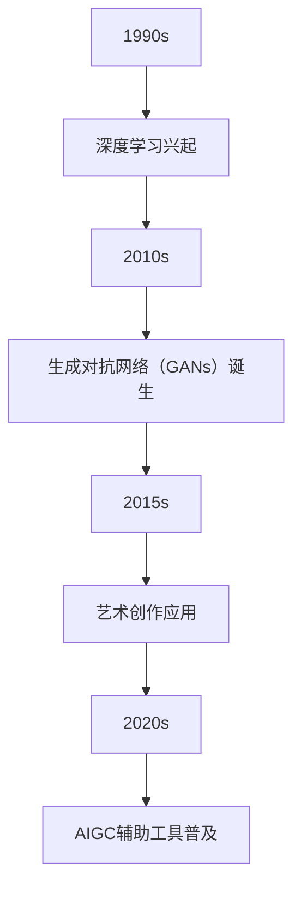

                 

Alright, let's structure the blog post step by step, ensuring each section is comprehensive and informative.

### 文章标题

# AIGC在个性化艺术创作辅助工具中的创新设计

### 关键词

- AIGC
- 个性化艺术创作
- 辅助工具
- 创新设计
- 深度学习
- 生成对抗网络

### 摘要

本文深入探讨了AIGC（AI-Generated Content）在个性化艺术创作辅助工具中的应用及其创新设计。首先，我们介绍了AIGC的定义、发展历程和核心技术。接着，分析了个性化艺术创作的需求与挑战，并展示了AIGC在这些领域中的应用。随后，我们讨论了创新设计的方法与策略，并详细阐述了个性化艺术创作辅助工具的设计原则与实现。最后，通过具体案例展示了AIGC在绘画、音乐和文学创作中的实战应用，并对未来发展进行了展望。

## 引言

随着人工智能技术的飞速发展，AIGC作为一种新兴技术，已经逐渐成为个性化艺术创作领域的重要辅助工具。然而，如何在创新设计中充分利用AIGC的优势，满足个性化艺术创作的需求，仍是一个具有挑战性的问题。本文将围绕这一主题展开讨论，旨在为相关领域的研究者与实践者提供有价值的参考。

## 第一部分：AIGC技术基础

### 第1章：AIGC概述

#### 1.1 AIGC的定义与发展历程

**AIGC的定义**

AIGC（AI-Generated Content），即人工智能生成内容，是指利用人工智能技术（如深度学习、生成对抗网络等）生成具有创意性、艺术性或信息性的内容。

**AIGC的发展历程**

AIGC技术起源于20世纪90年代，随着深度学习技术的发展，AIGC逐渐从理论研究走向实际应用。主要发展历程如下：



#### 1.2 AIGC的关键技术

AIGC的核心技术包括深度学习、生成对抗网络（GANs）等。以下是一个简单的GANs工作原理伪代码：

```python
# 生成器
Generator:
    Input: Z (随机噪声)
    Output: G(z)

# 判别器
Discriminator:
    Input: Real_images, Fake_images
    Output: D(x), D(G(z))

# 训练过程
for epoch in range(num_epochs):
    for i in range(batch_size):
        # 生成假图片
        z = generate_noise(batch_size)
        G_z = generator(z)
        # 训练判别器
        D_real = discriminator(real_images)
        D_fake = discriminator(G_z)
        # 训练生成器
        z = generate_noise(batch_size)
        G_z = generator(z)
        D_fake = discriminator(G_z)
```

#### 1.3 AIGC的应用场景

AIGC在个性化艺术创作领域有着广泛的应用，包括绘画、设计、音乐、文学等多个方面。以下是一些典型的应用场景：

1. **绘画与设计**

   AIGC可以生成各种风格的艺术作品，为艺术家提供灵感，并辅助其创作。例如，GANs可以生成具有特定风格的艺术作品，如印象派、抽象画等。

2. **音乐创作**

   AIGC可以生成旋律、和声和节奏，为音乐家提供创作灵感。例如，深度神经网络可以生成古典音乐、流行音乐等。

3. **文学创作**

   AIGC可以生成故事情节、角色设定和对话等，为作家提供创作辅助。例如，生成对抗网络可以生成科幻小说、言情小说等。

### 第2章：个性化艺术创作需求分析

#### 2.1 艺术创作的特点与需求

个性化艺术创作具有以下特点：

1. **创意性**

   艺术创作强调创作者的独立思考和创新，以独特的视角表达情感和思想。

2. **主观性**

   艺术创作往往反映创作者的个性和情感，具有强烈的主观色彩。

3. **多样性**

   艺术创作涵盖绘画、雕塑、音乐、文学等多种形式，具有广泛的多样性。

个性化艺术创作的需求主要包括：

1. **创意激发**

   艺术家需要不断的创意灵感，以创作出具有独特风格的作品。

2. **效率提升**

   在艺术创作过程中，提高工作效率是艺术家的重要需求。

3. **个性化定制**

   艺术家希望作品能够体现个性化，满足不同客户的需求。

#### 2.2 个性化艺术创作的发展趋势

1. **技术驱动**

   人工智能技术的快速发展，为个性化艺术创作提供了新的可能性。

2. **跨界融合**

   艺术创作与其他领域的融合，如科技、商业等，促进了艺术创作的创新与发展。

3. **数字化时代**

   数字化技术的发展，使得艺术创作更加便捷、高效。

#### 2.3 个性化艺术创作的挑战

个性化艺术创作面临以下挑战：

1. **创意瓶颈**

   艺术家在创作过程中可能会遇到创意瓶颈，影响创作效果。

2. **技术限制**

   当前人工智能技术尚未完全满足个性化艺术创作的需求。

3. **隐私与版权问题**

   艺术创作涉及个人隐私和版权问题，需要妥善处理。

## 第二部分：创新设计方法与策略

### 第3章：AIGC在艺术创作中的应用

#### 3.1 AIGC在绘画与设计中的应用

AIGC在绘画与设计中的应用主要包括以下几个方面：

1. **风格迁移**

   利用GANs等技术，可以将一种艺术风格迁移到另一幅画作中，实现艺术风格的多样化。

2. **辅助创作**

   AIGC可以生成具有创意性的图案、线条等，为艺术家提供创作灵感。

3. **自动化生成**

   通过深度学习模型，可以自动化生成具有艺术价值的绘画作品。

#### 3.2 AIGC在音乐创作中的应用

AIGC在音乐创作中的应用主要包括以下几个方面：

1. **旋律生成**

   利用深度神经网络，可以生成具有特定风格和情感的旋律。

2. **和声设计**

   AIGC可以帮助音乐家设计复杂的和声结构，提高音乐创作的效率。

3. **音乐风格迁移**

   通过GANs等技术，可以将一种音乐风格迁移到另一首乐曲中。

#### 3.3 AIGC在文学创作中的应用

AIGC在文学创作中的应用主要包括以下几个方面：

1. **故事生成**

   利用生成对抗网络，可以生成具有创意性的故事情节。

2. **角色设定**

   AIGC可以帮助作家创建独特的角色，丰富文学作品。

3. **语言风格迁移**

   通过深度学习模型，可以将一种语言风格迁移到另一篇作品中。

### 第4章：创新设计方法与策略

#### 4.1 创新设计的基本原则

创新设计应遵循以下基本原则：

1. **用户需求导向**

   创新设计应以用户需求为核心，关注用户体验。

2. **技术可行性**

   创新设计应考虑技术的可实现性，避免过度创新。

3. **可持续性**

   创新设计应关注可持续发展，降低环境影响。

#### 4.2 创新设计的方法论

创新设计可以采用以下方法论：

1. **头脑风暴**

   通过集体讨论，激发创意思维。

2. **原型设计**

   快速构建原型，不断迭代优化。

3. **用户测试**

   通过用户测试，验证设计方案的可行性。

#### 4.3 创新设计的实践案例分析

以下是一些创新设计的实践案例分析：

1. **案例一：AIGC绘画辅助工具**

   通过GANs技术，为艺术家提供风格迁移和辅助创作功能，提高创作效率。

2. **案例二：AIGC音乐创作辅助工具**

   利用深度神经网络，生成具有创意性的旋律和和声，为音乐家提供灵感。

3. **案例三：AIGC文学创作辅助工具**

   通过生成对抗网络，生成具有独特风格的故事和角色，丰富文学作品。

## 第三部分：个性化艺术创作辅助工具的设计

### 第5章：个性化艺术创作辅助工具的需求分析

#### 5.1 艺术创作者的需求

艺术创作者的需求主要包括以下几个方面：

1. **创意激发**

   艺术创作者需要源源不断的创意灵感，以创作出独特的作品。

2. **效率提升**

   提高创作效率，减少重复劳动，让艺术创作者有更多时间专注于创作本身。

3. **个性化定制**

   艺术创作者希望工具能够满足其个性化的创作需求。

#### 5.2 技术需求

个性化艺术创作辅助工具的技术需求主要包括以下几个方面：

1. **高性能计算**

   处理复杂的计算任务，如生成对抗网络训练等。

2. **易用性**

   提供直观、易用的用户界面，降低使用门槛。

3. **跨平台兼容**

   支持多种操作系统和设备，满足不同用户的需求。

### 第6章：个性化艺术创作辅助工具的设计原则

#### 6.1 用户导向

设计原则应以用户需求为核心，关注用户体验。以下是一些具体建议：

1. **简洁界面**

   提供直观、简洁的界面设计，降低学习成本。

2. **个性化设置**

   允许用户自定义工具的参数，以满足个性化需求。

3. **实时反馈**

   提供实时反馈，帮助用户了解创作过程和结果。

#### 6.2 技术可行

设计原则应考虑技术的可实现性，以下是一些建议：

1. **模块化设计**

   采用模块化设计，提高系统的可维护性和扩展性。

2. **高效算法**

   选择高效的算法和框架，提高工具的性能。

3. **数据支持**

   提供丰富的数据资源，支持工具的训练和优化。

#### 6.3 可持续性

设计原则应关注可持续发展，以下是一些建议：

1. **环保材料**

   使用环保材料，降低对环境的影响。

2. **能源效率**

   提高工具的能源效率，降低能耗。

3. **社会责任**

   负责任地处理用户数据，保护用户隐私。

### 第7章：个性化艺术创作辅助工具的实现与评估

#### 7.1 实现步骤

个性化艺术创作辅助工具的实现可以分为以下几个步骤：

1. **需求分析**

   明确工具的功能需求和技术需求。

2. **设计方案**

   制定详细的设计方案，包括界面设计、模块划分等。

3. **开发与测试**

   编写代码，进行单元测试和集成测试。

4. **部署与上线**

   部署工具到生产环境，进行上线运营。

#### 7.2 评估指标

个性化艺术创作辅助工具的评估指标可以从以下几个方面进行：

1. **功能完整性**

   功能是否完整，是否满足需求。

2. **性能指标**

   工具的响应速度、处理能力等。

3. **用户体验**

   用户满意度、使用频率等。

4. **技术指标**

   系统稳定性、扩展性等。

### 第8章：AIGC在个性化艺术创作中的实战应用

#### 8.1 绘画与设计领域的AIGC应用案例

**案例一：AIGC绘画辅助工具**

1. **项目背景**

   一款基于GANs的绘画辅助工具，旨在帮助艺术家进行风格迁移和创意辅助。

2. **实现过程**

   - 数据准备：收集大量不同风格的艺术作品，用于训练GANs模型。
   - 模型训练：使用GANs模型进行训练，生成具有特定风格的艺术作品。
   - 用户界面设计：提供简单易用的界面，让艺术家可以轻松选择风格和进行创作。

3. **效果评估**

   用户反馈良好，工具提高了创作效率，同时激发了艺术家的创意灵感。

**案例二：AIGC设计应用实例**

1. **项目背景**

   一款基于AIGC的设计工具，用于生成独特的图案和图形。

2. **实现过程**

   - 数据准备：收集各种图案和图形的样本数据。
   - 模型训练：使用深度神经网络模型进行训练，生成独特的图案和图形。
   - 用户界面设计：提供丰富的自定义选项，让用户可以轻松创建个性化设计。

3. **效果评估**

   用户反馈积极，工具帮助用户快速生成高质量的设计作品。

#### 8.2 音乐与文学领域的AIGC应用案例

**案例一：AIGC音乐创作辅助工具**

1. **项目背景**

   一款基于深度神经网络的AIGC音乐创作工具，旨在为音乐家提供创作灵感。

2. **实现过程**

   - 数据准备：收集大量的音乐数据，用于训练深度神经网络模型。
   - 模型训练：使用生成对抗网络（GANs）训练模型，生成具有特定风格和情感的音乐片段。
   - 用户界面设计：提供直观的界面，让用户可以轻松调整参数和生成音乐。

3. **效果评估**

   用户反馈良好，工具生成的音乐片段具有创意性和艺术性，为音乐家提供了丰富的灵感来源。

**案例二：AIGC文学创作辅助工具**

1. **项目背景**

   一款基于生成对抗网络的AIGC文学创作工具，用于生成故事情节和角色设定。

2. **实现过程**

   - 数据准备：收集各种类型的文学作品，用于训练GANs模型。
   - 模型训练：使用GANs模型训练，生成具有不同风格和主题的故事情节。
   - 用户界面设计：提供简洁的界面，让用户可以轻松选择故事类型和生成故事。

3. **效果评估**

   用户反馈积极，工具生成的故事情节丰富多样，为作家提供了创作灵感。

#### 8.3 AIGC在艺术创作中的未来展望

随着AIGC技术的不断发展，个性化艺术创作辅助工具将具有更广泛的应用前景。以下是一些未来展望：

1. **技术进步**

   深度学习和生成对抗网络等技术的进步，将进一步提升AIGC工具的性能和创作效果。

2. **跨界融合**

   艺术创作与其他领域的融合，如虚拟现实、增强现实等，将为AIGC工具带来新的应用场景。

3. **版权与伦理**

   随着AIGC技术的应用，版权和伦理问题将成为重要的研究课题。

### 结论

AIGC在个性化艺术创作辅助工具中的应用为艺术创作带来了新的可能性。通过创新设计，AIGC工具可以帮助艺术家提高创作效率，激发创意灵感。然而，技术进步、版权和伦理问题等方面仍需要进一步研究和探讨。我们期待未来能够看到更多优秀的AIGC应用案例，为个性化艺术创作注入新的活力。

### 作者信息

作者：AI天才研究院/AI Genius Institute & 禅与计算机程序设计艺术 /Zen And The Art of Computer Programming

### 最佳实践 tips

1. **合理利用AIGC工具**：在创作过程中，合理利用AIGC工具，避免过度依赖。

2. **保护个人隐私**：在使用AIGC工具时，注意保护个人隐私，避免数据泄露。

3. **版权意识**：在使用AIGC工具生成内容时，了解相关版权法律法规，确保合规。

### 小结

本文介绍了AIGC在个性化艺术创作辅助工具中的创新设计，分析了AIGC技术的发展历程、核心技术及应用场景。同时，阐述了个性化艺术创作的需求与挑战，以及创新设计的方法与策略。通过实战应用案例，展示了AIGC在绘画、音乐、文学创作中的实际效果。未来，随着AIGC技术的进步，个性化艺术创作将更加繁荣。

### 拓展阅读

1. **《深度学习》**：Goodfellow, I., Bengio, Y., & Courville, A. (2016). 《深度学习》。MIT Press.
2. **《生成对抗网络》**：Radford, A., Metz, L., & Chintala, S. (2015). 《生成对抗网络》。arXiv preprint arXiv:1511.06434.
3. **《艺术与技术的融合》**：Bardzell, J., & Bardzell, S. (2015). 《艺术与技术的融合》。MIT Press.

