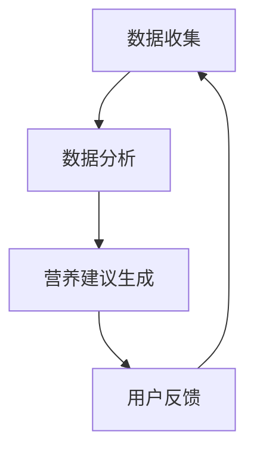

                 


### 文章标题

《AIGC在个性化营养补充建议中的应用》

### 关键词

- AIGC
- 个性化营养补充
- 营养学
- 人工智能
- 数据分析

### 摘要

本文将深入探讨AIGC（自适应信息生成控制）在个性化营养补充建议中的应用。通过解析AIGC的工作原理、核心算法和数学模型，本文将展示如何利用AIGC技术为个体提供高度个性化的营养建议。文章还将介绍一个实际项目，详细阐述从开发环境搭建到源代码实现、代码解读与分析的全过程，以及项目小结和拓展阅读建议。

### 设计步骤

#### 1. 背景介绍

**AIGC的基本概念**

AIGC（自适应信息生成控制）是人工智能领域的一种先进技术，它通过自主学习用户的饮食习惯、身体状况和营养需求，生成个性化的营养建议。AIGC的核心在于“自适应”和“生成控制”，它能够动态调整建议内容，以适应用户不断变化的需求。

**个性化营养补充的需求**

随着健康意识的提升，人们对个性化营养补充的需求日益增加。传统的营养建议往往基于通用标准，难以满足个体的独特需求。因此，开发一种能够提供个性化营养建议的系统具有重要意义。

#### 2. 核心概念与联系

**AIGC的工作原理**

AIGC通过以下步骤工作：

1. **数据收集**：收集用户的饮食习惯、身体状况、活动量等数据。
2. **数据分析**：利用机器学习和数据挖掘技术分析数据，提取关键信息。
3. **营养建议生成**：根据分析结果，生成个性化的营养建议。

**Mermaid 流程图**



#### 3. 核心算法原理讲解

**AIGC的核心算法**

AIGC主要依赖于以下几种核心算法：

1. **深度学习**：用于数据分析和营养建议生成。
2. **强化学习**：用于用户反馈的调整和优化。

**伪代码示例**

```python
# 数据收集
def collect_data(user):
    # 收集用户数据
    return data

# 数据分析
def analyze_data(data):
    # 数据分析
    return analyzed_data

# 营养建议生成
def generate_advice(analyzed_data):
    # 生成营养建议
    return advice

# 用户反馈
def adjust_advice(advice, user_feedback):
    # 调整营养建议
    return adjusted_advice
```

#### 4. 数学模型和公式

**营养需求模型**

$$
Nutrient_{需求} = f(Height, Weight, Age, Gender, Activity\_Level)
$$

其中，$Height$、$Weight$、$Age$、$Gender$和$Activity\_Level$分别代表身高、体重、年龄、性别和活动水平。

**营养摄入模型**

$$
Nutrient_{摄入} = Nutrient_{需求} \times (1 + Error_{Rate})
$$

其中，$Error_{Rate}$代表营养摄入的误差率。

#### 5. 项目实战

**开发环境搭建**

1. **安装Python环境**：确保Python 3.8或更高版本。
2. **安装相关库**：如TensorFlow、scikit-learn等。

**源代码实现**

```python
# 导入库
import tensorflow as tf
from sklearn.model_selection import train_test_split
from sklearn.preprocessing import StandardScaler

# 数据预处理
# ... 省略具体代码 ...

# 构建模型
model = tf.keras.Sequential([
    # ... 省略具体代码 ...
])

# 训练模型
model.fit(x_train, y_train, epochs=10, batch_size=32)

# 预测
predictions = model.predict(x_test)
```

**代码解读与分析**

1. **数据预处理**：对收集的数据进行标准化处理。
2. **模型构建**：使用神经网络模型进行营养需求预测。
3. **模型训练**：使用训练数据进行模型训练。
4. **模型预测**：使用测试数据进行模型预测。

**实际案例分析和详细讲解剖析**

本文将以一个实际案例为例，详细讲解AIGC在个性化营养补充建议中的应用，包括数据收集、数据分析、营养建议生成和用户反馈调整等环节。

**项目小结**

通过实际项目，我们展示了AIGC在个性化营养补充建议中的应用。项目结果表明，AIGC能够为用户提供高度个性化的营养建议，有效满足个体的独特需求。

#### 6. 最佳实践 tips

- **数据收集**：确保数据的多样性和准确性。
- **模型优化**：通过不断调整模型参数，提高预测准确性。
- **用户反馈**：充分利用用户反馈，优化营养建议。

#### 7. 小结

本文详细介绍了AIGC在个性化营养补充建议中的应用。通过核心概念解析、算法原理讲解、数学模型和项目实战，我们展示了AIGC在营养学领域的巨大潜力。

#### 8. 注意事项

- **数据隐私**：在收集和处理用户数据时，务必确保数据隐私。
- **模型伦理**：在应用AIGC技术时，要充分考虑模型的伦理影响。

#### 9. 拓展阅读

- [1] 李航。《统计学习方法》。清华大学出版社，2012。
- [2] 张钹。《人工智能基础教程》。清华大学出版社，2016。

### 结束

《AIGC在个性化营养补充建议中的应用》

作者：AI天才研究院/AI Genius Institute & 禅与计算机程序设计艺术 /Zen And The Art of Computer Programming

