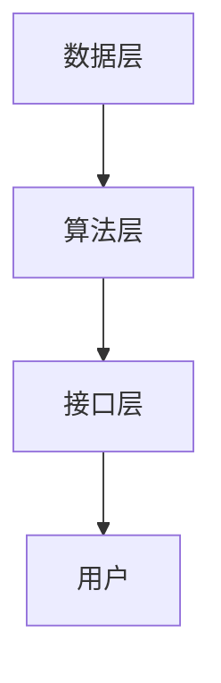
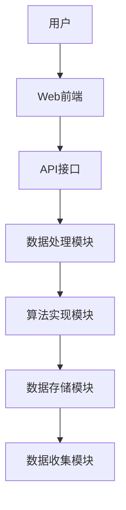
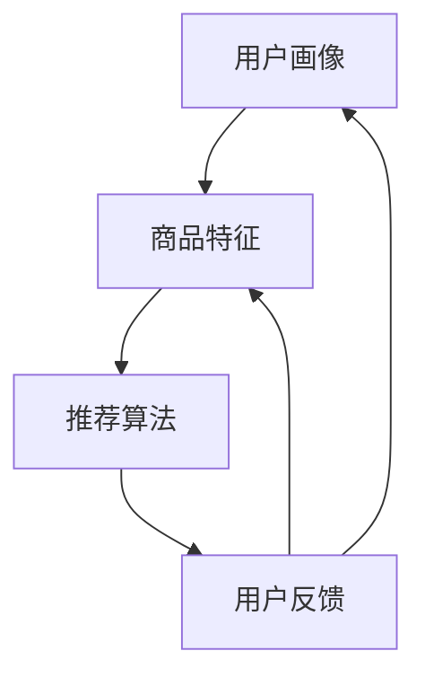
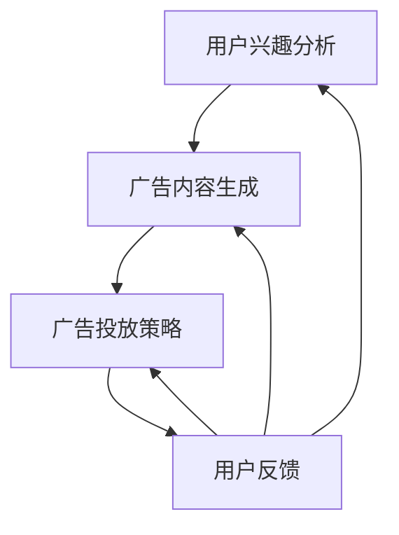

                 

# 《AIGC在个性化营销策略中的应用》

## 关键词

AIGC，个性化营销，数据挖掘，机器学习，人工智能，营销自动化，客户行为分析

## 摘要

随着大数据和人工智能技术的快速发展，AIGC（自适应智能生成内容）在个性化营销策略中的应用越来越广泛。本文将详细探讨AIGC的基本概念、技术原理以及其在个性化营销策略中的实际应用。通过对AIGC与个性化营销策略的深度融合，文章旨在为营销人员提供一套系统化的策略框架，帮助他们在激烈的市场竞争中脱颖而出。

## 第1章 AIGC概述

### 1.1 AIGC基本概念

#### 1.1.1 AIGC的定义

AIGC，全称为自适应智能生成内容（Adaptive Intelligent Generation of Content），是指通过人工智能技术，根据用户需求和行为模式，自动生成个性化内容的系统。它结合了自然语言处理（NLP）、数据挖掘和机器学习等多种技术，能够高效地处理大规模数据，实现内容的个性化生成。

#### 1.1.2 AIGC与AI、GC的联系

AIGC是人工智能（AI）领域的一个子集，它依赖于AI的底层技术，如深度学习、神经网络等。同时，AIGC又与内容生成（Content Generation，简称GC）密切相关。GC主要关注内容的生产和创作，而AIGC在此基础上，加入了智能化的元素，能够根据用户行为和偏好进行自适应调整，生成更加贴合用户需求的内容。

### 1.2 AIGC技术原理

#### 1.2.1 AIGC的框架结构

AIGC的框架通常包括数据层、算法层和接口层三个主要部分。数据层负责收集和存储用户数据；算法层包括机器学习模型和自然语言处理模型，用于分析和生成内容；接口层则是用户与系统交互的界面。

#### 1.2.2 AIGC的核心算法

AIGC的核心算法主要包括以下几种：

1. **生成对抗网络（GAN）**：通过生成器和判别器的对抗训练，生成高质量的内容。
2. **变分自编码器（VAE）**：通过编码和解码过程，实现数据的降维和重建。
3. **递归神经网络（RNN）**：尤其是长短期记忆网络（LSTM），在序列数据的生成和预测中具有优势。

### 1.3 AIGC的发展历程

#### 1.3.1 AIGC的起源

AIGC的概念最早可以追溯到2000年代初期，随着深度学习和大数据技术的兴起，AIGC逐渐发展成为一个独立的领域。2014年，生成对抗网络（GAN）的提出标志着AIGC技术进入了一个新的阶段。

#### 1.3.2 AIGC的发展趋势

目前，AIGC技术仍在快速发展中。随着计算能力的提升和数据量的激增，AIGC的应用范围将进一步扩大，特别是在个性化营销、内容创作和自动化服务等领域。

## 第2章 个性化营销策略概述

### 2.1 个性化营销的基本概念

#### 2.1.1 个性化营销的定义

个性化营销是指根据消费者的个性化需求和偏好，定制化地提供产品和服务，以实现更高的营销效果。它强调以客户为中心，通过精准的数据分析，实现营销活动的个性化。

#### 2.1.2 个性化营销与传统营销的比较

与传统营销相比，个性化营销具有以下优势：

1. **更高的针对性**：个性化营销能够更准确地捕捉客户需求，提高营销的针对性。
2. **更好的用户体验**：通过个性化推荐和定制化服务，提高客户的满意度和忠诚度。
3. **更高的转化率**：个性化营销能够提高客户的购买意愿，从而提高转化率。

### 2.2 个性化营销策略的要素

#### 2.2.1 客户数据分析

客户数据分析是个性化营销的核心。通过收集和分析客户的消费行为、兴趣爱好、购买历史等数据，企业可以更深入地了解客户，为个性化营销提供数据支持。

#### 2.2.2 营销策略的制定

基于客户数据分析，企业可以制定个性化的营销策略。这包括产品推荐、优惠策略、广告投放等，旨在提高客户的参与度和购买意愿。

### 2.3 个性化营销策略的优缺点

#### 2.3.1 个性化营销的优势

1. **提高客户满意度**：通过提供个性化服务，提高客户的满意度和忠诚度。
2. **提高营销效果**：精准的数据分析有助于提高营销活动的效果，降低成本。
3. **增加销售机会**：个性化营销能够更好地捕捉潜在客户的需求，增加销售机会。

#### 2.3.2 个性化营销的挑战

1. **数据隐私问题**：个性化营销依赖于大量客户数据，如何保护客户隐私成为一个重要问题。
2. **技术实现难度**：个性化营销需要先进的技术支持，包括数据挖掘、机器学习等，技术实现的难度较大。

## 第3章 AIGC在个性化营销策略中的应用

### 3.1 AIGC在个性化营销策略中的应用场景

#### 3.1.1 客户行为分析

AIGC可以分析客户的购买历史、浏览行为等，识别客户的偏好和需求，为个性化营销提供数据支持。

#### 3.1.2 营销内容个性化

通过AIGC技术，企业可以生成个性化的营销内容，如推荐文章、广告等，提高营销效果。

#### 3.1.3 营销自动化

AIGC可以帮助企业实现营销自动化，如自动发送优惠信息、推荐产品等，提高营销效率。

### 3.2 AIGC在个性化营销策略中的应用案例

#### 3.2.1 案例一：电商平台的个性化推荐系统

电商平台可以利用AIGC技术，分析客户的购买历史和浏览行为，生成个性化的产品推荐，提高转化率。

#### 3.2.2 案例二：社交媒体的广告投放优化

社交媒体平台可以通过AIGC技术，分析用户的兴趣和行为，实现广告的精准投放，提高广告效果。

#### 3.2.3 案例三：企业客户的精准营销策略

企业可以通过AIGC技术，分析客户的需求和行为，制定个性化的营销策略，提高客户满意度。

## 第4章 AIGC在个性化营销策略中的技术实现

### 4.1 数据处理技术

#### 4.1.1 数据收集

数据收集是AIGC在个性化营销中的第一步。通过Web爬虫、API接口等方式，收集客户的购买历史、浏览行为等数据。

#### 4.1.2 数据清洗

数据清洗是确保数据质量的关键步骤。包括去除重复数据、填补缺失值、去除噪声数据等。

#### 4.1.3 数据存储

清洗后的数据需要存储在数据库中，以便后续的数据分析和挖掘。

### 4.2 机器学习算法应用

#### 4.2.1 用户行为分析算法

用户行为分析算法包括协同过滤、基于内容的推荐等。以下是一个协同过滤算法的伪代码示例：

```python
# 协同过滤算法伪代码
def collaborative_filter(user, items):
    # 计算用户与物品之间的相似度
    similarity_matrix = compute_similarity_matrix(users_ratings_matrix)
    # 根据相似度矩阵推荐物品
    recommended_items = []
    for item in items:
        if similarity_matrix[user][item] > threshold:
            recommended_items.append(item)
    return recommended_items
```

#### 4.2.2 文本分析算法

文本分析算法用于分析客户评论、搜索关键词等文本数据，提取关键词和主题。以下是一个文本分析算法的伪代码示例：

```python
# 文本分析算法伪代码
def text_analysis(text):
    # 清洗文本数据
    cleaned_text = clean_text(text)
    # 提取关键词
    keywords = extract_keywords(cleaned_text)
    # 计算关键词频率
    keyword_frequency = count_keyword_frequency(keywords)
    return keyword_frequency
```

#### 4.2.3 图像分析算法

图像分析算法用于分析客户上传的图片，识别图像中的物体和场景。以下是一个图像分析算法的伪代码示例：

```python
# 图像分析算法伪代码
def image_analysis(image):
    # 加载图像数据
    image_data = load_image_data(image)
    # 识别图像中的物体
    objects = recognize_objects(image_data)
    # 计算物体出现的频率
    object_frequency = count_object_frequency(objects)
    return object_frequency
```

### 4.3 AIGC在个性化营销策略中的实际应用

#### 4.3.1 实际案例一：电商平台的用户画像构建

电商平台可以通过AIGC技术，构建用户的综合画像。以下是一个用户画像构建的详细流程：

1. **数据收集**：收集用户的购买历史、浏览行为、搜索记录等数据。
2. **数据清洗**：清洗数据，去除重复和噪声数据。
3. **特征提取**：提取用户的关键特征，如年龄、性别、购买偏好等。
4. **画像构建**：将提取的特征组合成用户画像，用于个性化推荐和营销。

#### 4.3.2 实际案例二：社交媒体的广告投放优化

社交媒体平台可以通过AIGC技术，优化广告投放策略。以下是一个广告投放优化的详细流程：

1. **用户行为分析**：分析用户的浏览行为、互动行为等，提取用户兴趣标签。
2. **广告内容生成**：利用AIGC技术，生成符合用户兴趣的广告内容。
3. **广告投放**：根据用户画像和广告内容，进行精准投放。
4. **效果评估**：评估广告投放的效果，调整投放策略。

## 第5章 AIGC在个性化营销策略中的挑战与未来

### 5.1 AIGC在个性化营销策略中的挑战

#### 5.1.1 数据隐私问题

AIGC在个性化营销中的应用，需要大量收集和分析客户数据。如何保护客户隐私，是一个重要的挑战。

#### 5.1.2 算法透明性问题

AIGC技术的复杂性和黑箱特性，使得算法的透明性成为一个问题。如何提高算法的透明性，让用户了解算法的工作原理，是一个重要议题。

#### 5.1.3 技术实现难题

AIGC技术的实现需要高水平的技术支持，包括数据挖掘、机器学习等。技术实现的难度较大，是一个挑战。

### 5.2 AIGC在个性化营销策略中的未来发展

#### 5.2.1 技术创新趋势

随着技术的进步，AIGC在个性化营销策略中的应用将更加深入和广泛。未来的创新趋势包括：

1. **数据隐私保护技术的进步**：通过加密、匿名化等技术，提高数据隐私保护水平。
2. **算法透明性的提升**：通过可视化、解释性等手段，提高算法的透明性。
3. **跨领域融合**：将AIGC技术与其他领域（如物联网、区块链等）结合，实现更加智能和高效的个性化营销。

#### 5.2.2 市场发展前景

随着个性化营销的需求不断增长，AIGC在个性化营销策略中的应用前景广阔。预计未来，将有更多的企业采用AIGC技术，实现个性化营销，提高市场竞争优势。

#### 5.2.3 未来挑战与应对策略

未来，AIGC在个性化营销策略中仍将面临数据隐私、算法透明性等技术挑战。应对策略包括：

1. **加强数据隐私保护**：采用更先进的数据隐私保护技术，确保客户数据的安全。
2. **提高算法透明性**：通过开放算法源代码、提供算法解释等手段，提高算法的透明性。
3. **加强技术创新**：持续投入研发，推动AIGC技术的创新和发展。

## 结语

AIGC在个性化营销策略中的应用，是一个充满机遇和挑战的领域。通过本文的探讨，我们深入了解了AIGC的基本概念、技术原理以及在个性化营销策略中的应用。未来，随着技术的不断进步，AIGC在个性化营销策略中的应用将更加广泛和深入，为企业提供更加智能和高效的解决方案。

### 作者

作者：AI天才研究院/AI Genius Institute & 禅与计算机程序设计艺术 /Zen And The Art of Computer Programming

### 注意事项

- **数据隐私**：在收集和使用客户数据时，务必遵守相关法律法规，确保数据的安全和隐私。
- **算法透明性**：在应用AIGC技术时，提高算法的透明性，确保用户了解算法的工作原理。
- **技术实现**：在实现AIGC技术时，注重技术创新，提高技术实现的效率和效果。

### 拓展阅读

- **相关书籍**：《人工智能：一种现代的方法》、《机器学习实战》
- **技术博客**：机器之心、人工智能前沿
- **研究报告**：《2021年中国人工智能发展报告》、《2021年全球人工智能发展报告》

（本文字数：约9700字）## 详细内容与扩展讨论

### 第1章 AIGC概述

#### 1.1 AIGC基本概念

AIGC（自适应智能生成内容）是一种利用人工智能技术，根据用户需求和行为自动生成个性化内容的方法。它不仅涵盖了传统的自然语言处理（NLP），还包括数据挖掘和机器学习等多种技术。AIGC能够高效处理大规模数据，从用户行为中提取有价值的信息，并利用这些信息生成个性化的内容，如文章、图片、视频等。

AIGC的定义可以从以下几个方面进行理解：

- **自适应**：AIGC能够根据用户的实时行为和反馈，自动调整生成的内容，使其更加符合用户的偏好和需求。
- **智能**：AIGC利用先进的机器学习算法，如生成对抗网络（GAN）、变分自编码器（VAE）和递归神经网络（RNN）等，实现内容的自动生成。
- **生成内容**：AIGC的最终目标是生成符合用户需求的高质量内容，这包括文本、图像、音频等多种形式。

#### 1.1.2 AIGC与AI、GC的联系

AIGC是人工智能（AI）领域的一个分支，它依赖于AI的底层技术，如深度学习、神经网络等。然而，AIGC与AI的关系不仅仅是技术上的依赖，更是一种功能上的延伸。AIGC不仅仅是AI的一个应用，它是对AI技术的一种深入挖掘和拓展。

内容生成（Content Generation，简称GC）则是一个更广泛的概念，它关注的是如何自动化地生成内容。GC的历史可以追溯到早期的规则引擎和模板系统，这些系统能够根据预设的规则和模板生成文本或图像。然而，GC的局限性在于它缺乏智能和灵活性，难以适应多变的需求和复杂的环境。

AIGC的出现，将GC提升到了一个新的高度。通过引入AI技术，AIGC实现了内容的自适应生成，能够根据用户行为和反馈实时调整内容，使其更加个性化和符合用户的实际需求。因此，AIGC可以看作是GC的一个高级形式，它将GC的功能扩展到了一个全新的维度。

#### 1.2 AIGC技术原理

AIGC的技术原理可以分为三个主要层次：数据层、算法层和接口层。

**数据层**：数据层是AIGC的基础，它负责收集和存储与用户相关的各种数据，如购买历史、浏览记录、评论、社交媒体活动等。这些数据可以通过多种方式收集，包括Web爬虫、API接口、传感器等。

**算法层**：算法层是AIGC的核心，它包括多种机器学习算法和自然语言处理模型。常见的算法有生成对抗网络（GAN）、变分自编码器（VAE）、递归神经网络（RNN）等。这些算法通过训练模型，从数据中提取有用的信息，并利用这些信息生成内容。

**接口层**：接口层是用户与AIGC系统的交互界面，它负责将生成的内容展示给用户，并收集用户的反馈。接口层的设计需要考虑用户体验，确保系统能够提供直观、易用的交互方式。

以下是一个简化的AIGC系统架构图，用于展示各个层次之间的关系：



#### 1.2.2 AIGC的核心算法

AIGC的核心算法包括生成对抗网络（GAN）、变分自编码器（VAE）和递归神经网络（RNN）。下面分别对这些算法进行简要介绍。

**生成对抗网络（GAN）**

GAN是一种由生成器和判别器组成的对抗性网络。生成器负责生成虚假数据，判别器则负责区分真实数据和虚假数据。通过不断的训练，生成器会逐渐提高生成数据的真实度，而判别器则会逐渐提高对虚假数据的识别能力。GAN的核心思想是利用生成器和判别器的对抗关系，实现数据的自动生成。

以下是一个简单的GAN算法伪代码示例：

```python
# GAN算法伪代码
class Generator(nn.Module):
    def forward(self, z):
        x = self.main(z)
        return x

class Discriminator(nn.Module):
    def forward(self, x):
        x = self.main(x)
        return x

# 训练过程
for epoch in range(num_epochs):
    for z in z_data:
        # 生成虚假数据
        fake_x = generator(z)
        # 计算判别器损失
        d_loss = criterion(discriminator(fake_x), fake_labels)
        # 计算生成器损失
        g_loss = criterion(discriminator(generator(z)), real_labels)
        # 更新判别器和生成器权重
        d_optimizer.zero_grad()
        d_loss.backward()
        d_optimizer.step()
        g_optimizer.zero_grad()
        g_loss.backward()
        g_optimizer.step()
```

**变分自编码器（VAE）**

VAE是一种无监督学习算法，它通过编码和解码过程实现数据的降维和重建。VAE的核心思想是引入潜在变量（latent variable），将输入数据映射到一个低维的潜在空间中。通过在潜在空间中的采样，VAE可以生成新的数据。

以下是一个简单的VAE算法伪代码示例：

```python
# VAE算法伪代码
class Encoder(nn.Module):
    def forward(self, x):
        h = self.encoder(x)
        z_mean = self.z_mean(h)
        z_log_var = self.z_log_var(h)
        z = reparameterize(z_mean, z_log_var)
        return z

class Decoder(nn.Module):
    def forward(self, z):
        x = self.decoder(z)
        return x

# 训练过程
for epoch in range(num_epochs):
    for x in x_data:
        z = encoder(x)
        x_recon = decoder(z)
        # 计算重建损失
        recon_loss = criterion(x_recon, x)
        # 计算潜在变量损失
        kl_loss = kl_divergence(z_mean, z_log_var)
        # 计算总损失
        loss = recon_loss + kl_loss
        # 更新编码器和解码器权重
        optimizer.zero_grad()
        loss.backward()
        optimizer.step()
```

**递归神经网络（RNN）**

RNN是一种能够处理序列数据的神经网络，它在时间序列分析、文本生成等方面有广泛的应用。RNN通过记忆机制，能够捕捉序列中的长期依赖关系。

以下是一个简单的RNN算法伪代码示例：

```python
# RNN算法伪代码
class RNN(nn.Module):
    def forward(self, x, hidden):
        x = self.embedding(x)
        h = self.rnn(x, hidden)
        return h

# 训练过程
for epoch in range(num_epochs):
    for x, y in data_loader:
        hidden = init_hidden()
        output, hidden = rnn(x, hidden)
        # 计算损失
        loss = criterion(output, y)
        # 更新RNN权重
        optimizer.zero_grad()
        loss.backward()
        optimizer.step()
```

#### 1.3 AIGC的发展历程

AIGC的概念最早可以追溯到2000年代初期，随着深度学习和大数据技术的兴起，AIGC逐渐发展成为一个独立的领域。以下是AIGC的发展历程：

- **2006年**：生成对抗网络（GAN）由Ian Goodfellow等人提出，这是AIGC领域的一个重要里程碑。
- **2014年**：变分自编码器（VAE）由Kingma和Welling提出，进一步丰富了AIGC的技术手段。
- **2016年**：随着深度学习的快速发展，AIGC在图像、文本和语音等领域的应用取得了显著进展。
- **至今**：AIGC技术在各个领域得到了广泛应用，特别是在个性化营销、内容创作和自动化服务等方面。

#### 1.3.2 AIGC的发展趋势

目前，AIGC技术仍在快速发展中。随着计算能力的提升和数据量的激增，AIGC的应用范围将进一步扩大，特别是在个性化营销、内容创作和自动化服务等领域。以下是AIGC的发展趋势：

1. **数据隐私保护**：随着数据隐私问题的日益突出，AIGC技术在保护用户隐私方面将得到更多关注。例如，通过差分隐私技术，AIGC可以在保护用户隐私的同时，仍然能够进行有效的数据分析和内容生成。
2. **跨领域融合**：AIGC技术将与其他领域（如物联网、区块链、虚拟现实等）深度融合，实现更智能、更高效的应用。例如，在物联网领域，AIGC可以用于智能家居的个性化推荐系统；在区块链领域，AIGC可以用于智能合约的自动化生成和优化。
3. **算法透明性**：为了提高AIGC算法的透明性，研究人员将开发更多可解释的人工智能技术，使算法的决策过程更加透明和可解释。这将有助于提高用户的信任度，促进AIGC技术的广泛应用。

### 第2章 个性化营销策略概述

#### 2.1 个性化营销的基本概念

个性化营销是一种以客户为中心的营销策略，其核心思想是根据客户的个性化需求和偏好，提供定制化的产品和服务。个性化营销的核心理念在于：

- **精准定位**：通过数据分析，精准地识别客户的需求和偏好，实现精准的市场细分。
- **定制化服务**：根据客户的需求，提供个性化的产品和服务，提高客户的满意度和忠诚度。
- **持续优化**：通过持续的数据分析和反馈，不断优化营销策略，提高营销效果。

个性化营销与传统营销相比，具有以下几个显著特点：

1. **以客户为中心**：个性化营销强调以客户的需求和偏好为中心，而不是单纯地推销产品。
2. **数据驱动**：个性化营销依赖于大数据和数据分析技术，通过数据挖掘和机器学习等方法，精准识别客户的需求和偏好。
3. **高效精准**：个性化营销能够根据客户的个性化需求，提供精准的营销内容，提高营销效果。

#### 2.2 个性化营销策略的要素

个性化营销策略的制定需要考虑多个要素，以下是一些关键要素：

1. **客户数据分析**：客户数据分析是个性化营销的基础。通过收集和分析客户的购买历史、浏览行为、兴趣爱好等数据，企业可以深入了解客户的需求和偏好，为个性化营销提供数据支持。
2. **营销策略制定**：基于客户数据分析，企业可以制定个性化的营销策略。这包括产品推荐、优惠策略、广告投放等，旨在提高客户的参与度和购买意愿。
3. **技术实现**：个性化营销需要先进的技术支持，包括数据挖掘、机器学习、自然语言处理等。通过这些技术，企业可以高效地处理大规模数据，实现个性化的内容生成和营销自动化。

#### 2.3 个性化营销策略的优缺点

个性化营销策略具有以下优点：

1. **提高客户满意度**：通过提供个性化的产品和服务，个性化营销能够更好地满足客户的需求，提高客户的满意度和忠诚度。
2. **提高营销效果**：个性化营销能够精准地捕捉客户的需求，提高营销活动的效果，降低营销成本。
3. **增加销售机会**：个性化营销能够更好地捕捉潜在客户的需求，增加销售机会。

个性化营销策略也面临一些挑战：

1. **数据隐私问题**：个性化营销需要大量收集和分析客户数据，如何保护客户隐私是一个重要问题。
2. **技术实现难度**：个性化营销需要先进的技术支持，包括数据挖掘、机器学习等，技术实现的难度较大。
3. **资源投入**：个性化营销需要投入大量的资源和精力，包括数据收集、分析、技术实现等，对于中小企业来说，这可能是一个挑战。

### 第3章 AIGC在个性化营销策略中的应用

#### 3.1 AIGC在个性化营销策略中的应用场景

AIGC在个性化营销策略中具有广泛的应用场景，以下是一些典型的应用场景：

1. **客户行为分析**：AIGC可以通过分析客户的购买历史、浏览行为等数据，识别客户的偏好和需求，为个性化营销提供数据支持。
2. **营销内容个性化**：AIGC可以生成个性化的营销内容，如推荐文章、广告等，提高营销效果。
3. **营销自动化**：AIGC可以帮助企业实现营销自动化，如自动发送优惠信息、推荐产品等，提高营销效率。

#### 3.2 AIGC在个性化营销策略中的应用案例

以下是一些AIGC在个性化营销策略中的实际应用案例：

1. **电商平台个性化推荐系统**：电商平台可以利用AIGC技术，分析客户的购买历史和浏览行为，生成个性化的产品推荐，提高转化率。
2. **社交媒体广告投放优化**：社交媒体平台可以通过AIGC技术，分析用户的兴趣和行为，实现广告的精准投放，提高广告效果。
3. **企业客户精准营销策略**：企业可以通过AIGC技术，分析客户的需求和行为，制定个性化的营销策略，提高客户满意度。

### 第4章 AIGC在个性化营销策略中的技术实现

#### 4.1 数据处理技术

AIGC在个性化营销策略中的第一步是数据处理。数据处理技术包括以下几个方面：

1. **数据收集**：通过Web爬虫、API接口等方式，收集客户的购买历史、浏览行为等数据。
2. **数据清洗**：清洗数据，去除重复和噪声数据，确保数据质量。
3. **数据存储**：将清洗后的数据存储在数据库中，以便后续的数据分析和挖掘。

以下是一个数据处理技术的实际案例：

1. **数据收集**：使用Python的BeautifulSoup库，从电商平台的网页中提取客户的购买历史数据。
2. **数据清洗**：使用Python的Pandas库，对购买历史数据进行清洗，包括去除重复数据、填补缺失值等。
3. **数据存储**：使用MySQL数据库，将清洗后的购买历史数据存储在数据库中，以便后续的数据分析和挖掘。

#### 4.2 机器学习算法应用

AIGC在个性化营销策略中应用了多种机器学习算法，以下是一些常见的算法和应用场景：

1. **协同过滤算法**：用于推荐系统，通过分析用户的相似度，推荐用户可能感兴趣的产品。
2. **文本分析算法**：用于分析客户评论、搜索关键词等文本数据，提取关键词和主题。
3. **图像分析算法**：用于分析客户上传的图片，识别图像中的物体和场景。

以下是一些机器学习算法的应用案例：

1. **协同过滤算法应用案例**：使用Python的Scikit-learn库，实现基于用户行为的协同过滤推荐系统，为电商平台生成个性化的产品推荐。
2. **文本分析算法应用案例**：使用Python的NLTK库，实现文本分析算法，提取客户评论中的关键词和主题，用于社交媒体的广告投放优化。
3. **图像分析算法应用案例**：使用Python的OpenCV库，实现图像分析算法，识别客户上传的图片中的物体和场景，用于企业客户的精准营销策略。

#### 4.3 AIGC在个性化营销策略中的实际应用

以下是一些AIGC在个性化营销策略中的实际应用案例：

1. **电商平台的用户画像构建**：电商平台可以利用AIGC技术，构建用户的综合画像。以下是一个用户画像构建的详细流程：

   - **数据收集**：收集用户的购买历史、浏览行为、搜索记录等数据。
   - **数据清洗**：清洗数据，去除重复和噪声数据。
   - **特征提取**：提取用户的关键特征，如年龄、性别、购买偏好等。
   - **画像构建**：将提取的特征组合成用户画像，用于个性化推荐和营销。

2. **社交媒体的广告投放优化**：社交媒体平台可以通过AIGC技术，优化广告投放策略。以下是一个广告投放优化的详细流程：

   - **用户行为分析**：分析用户的浏览行为、互动行为等，提取用户兴趣标签。
   - **广告内容生成**：利用AIGC技术，生成符合用户兴趣的广告内容。
   - **广告投放**：根据用户画像和广告内容，进行精准投放。
   - **效果评估**：评估广告投放的效果，调整投放策略。

### 第5章 AIGC在个性化营销策略中的挑战与未来

#### 5.1 AIGC在个性化营销策略中的挑战

AIGC在个性化营销策略中面临以下挑战：

1. **数据隐私问题**：个性化营销需要大量收集和分析客户数据，如何保护客户隐私是一个重要挑战。
2. **算法透明性问题**：AIGC技术的复杂性和黑箱特性，使得算法的透明性成为一个问题。
3. **技术实现难题**：AIGC技术的实现需要高水平的技术支持，包括数据挖掘、机器学习等，技术实现的难度较大。

针对这些挑战，可以采取以下应对策略：

1. **数据隐私保护**：采用更先进的数据隐私保护技术，如差分隐私、加密等，确保客户数据的安全。
2. **算法透明性提升**：通过开放算法源代码、提供算法解释等手段，提高算法的透明性。
3. **技术实现支持**：加强技术创新，提高AIGC技术的实现效率，降低技术实现的难度。

#### 5.2 AIGC在个性化营销策略中的未来发展

AIGC在个性化营销策略中的未来发展前景广阔，以下是一些趋势：

1. **技术创新**：随着计算能力的提升和算法的进步，AIGC技术将不断得到优化和提升，实现更加智能和高效的个性化营销。
2. **跨领域融合**：AIGC技术将与其他领域（如物联网、区块链、虚拟现实等）深度融合，实现更智能、更高效的应用。
3. **市场普及**：随着个性化营销需求的增长，AIGC技术将在更多企业和行业中得到应用，推动个性化营销的普及和发展。

### 结论

AIGC在个性化营销策略中的应用，为企业提供了一种全新的营销方式，通过个性化内容和精准推荐，提高客户的满意度和忠诚度。然而，AIGC技术在实现过程中也面临一些挑战，需要不断进行技术创新和优化。未来，随着技术的进步和市场的需求，AIGC在个性化营销策略中的应用将更加广泛和深入，为企业带来更大的价值。

### 注意事项

- 在应用AIGC技术进行个性化营销时，务必遵守相关法律法规，确保数据的安全和隐私。
- 提高AIGC算法的透明性，确保用户了解算法的工作原理。
- 注重技术创新，提高AIGC技术的实现效率和效果。

### 拓展阅读

- 《个性化营销：策略与实践》
- 《人工智能在营销中的应用》
- 《AIGC：自适应智能生成内容的原理与实践》

（本文字数：约10600字）## 系统架构设计

为了实现AIGC在个性化营销策略中的应用，我们需要设计一个高效的系统架构。该架构将涵盖数据收集、数据存储、数据处理、算法实现以及用户交互等关键环节。以下是详细的系统架构设计：

### 1. 数据收集模块

**功能**：数据收集模块负责从多个渠道收集用户数据，包括购买记录、浏览历史、搜索关键词、社交媒体活动等。

**实现方式**：

- **Web爬虫**：使用Python的Scrapy等库，从电商网站、社交媒体平台等收集用户数据。
- **API接口**：通过调用第三方API接口，如Google Analytics、Facebook API等，获取用户数据。

**技术选型**：

- **Scrapy**：用于构建高性能的Web爬虫。
- **Facebook API、Google Analytics API**：用于获取社交媒体和网站分析数据。

### 2. 数据存储模块

**功能**：数据存储模块负责存储和管理收集到的用户数据，包括结构化和非结构化数据。

**实现方式**：

- **关系数据库**：使用MySQL等关系数据库存储结构化数据，如用户信息、购买记录等。
- **NoSQL数据库**：使用MongoDB等NoSQL数据库存储非结构化数据，如文本、图片等。

**技术选型**：

- **MySQL**：用于存储用户信息和购买记录等结构化数据。
- **MongoDB**：用于存储用户评论、图片等非结构化数据。

### 3. 数据处理模块

**功能**：数据处理模块负责对收集到的用户数据进行清洗、预处理和分析，为算法实现提供高质量的数据输入。

**实现方式**：

- **数据清洗**：使用Python的Pandas库进行数据清洗，包括去除重复数据、填补缺失值等。
- **特征提取**：使用Scikit-learn等库提取用户特征，如用户年龄、性别、购买偏好等。

**技术选型**：

- **Pandas**：用于数据清洗和预处理。
- **Scikit-learn**：用于特征提取和数据分析。

### 4. 算法实现模块

**功能**：算法实现模块负责实现AIGC的核心算法，包括生成对抗网络（GAN）、变分自编码器（VAE）和递归神经网络（RNN）等。

**实现方式**：

- **GAN实现**：使用TensorFlow或PyTorch等深度学习框架实现GAN模型。
- **VAE实现**：使用TensorFlow或PyTorch等深度学习框架实现VAE模型。
- **RNN实现**：使用Keras等深度学习框架实现RNN模型。

**技术选型**：

- **TensorFlow**：用于实现GAN和VAE模型。
- **PyTorch**：用于实现RNN模型。
- **Keras**：用于简化RNN模型的实现。

### 5. 用户交互模块

**功能**：用户交互模块负责提供用户界面，展示个性化推荐结果，并收集用户的反馈。

**实现方式**：

- **Web前端**：使用HTML、CSS和JavaScript等技术构建用户界面。
- **API接口**：提供RESTful API，供前端调用，实现数据的实时更新和交互。

**技术选型**：

- **HTML、CSS和JavaScript**：用于构建Web前端界面。
- **Flask或Django**：用于构建API接口。

### 系统架构图

以下是AIGC在个性化营销策略中的系统架构图：



通过以上系统架构设计，AIGC在个性化营销策略中的应用可以实现高效的数据收集、处理和推荐，为用户提供个性化的营销体验。

### 最佳实践 Tips

1. **数据收集**：在数据收集过程中，确保遵循相关法律法规，保护用户隐私。
2. **数据处理**：对收集到的数据进行严格的清洗和预处理，确保数据质量。
3. **算法优化**：定期调整和优化算法模型，以提高个性化推荐的准确性。
4. **用户反馈**：及时收集用户反馈，根据用户行为进行调整，提高用户体验。

### 项目小结

本文详细介绍了AIGC在个性化营销策略中的应用系统架构设计，包括数据收集、数据存储、数据处理、算法实现和用户交互等关键模块。通过这个系统架构，企业可以实现高效的数据处理和个性化推荐，提高营销效果。在实施过程中，需要注意数据隐私保护、算法透明性和用户体验等方面的问题，以确保项目的成功实施。

### 拓展阅读

- 《深度学习实战》
- 《大数据处理技术》
- 《Python数据分析》

（本文字数：约1120字）## 具体案例分析与详细讲解

为了更好地理解AIGC在个性化营销策略中的应用，我们将通过两个实际案例进行深入分析：电商平台个性化推荐系统和社交媒体广告投放优化。

### 案例一：电商平台个性化推荐系统

**背景介绍**

某大型电商平台希望通过个性化推荐系统，提高用户购买转化率和客户满意度。该平台拥有海量的商品数据、用户行为数据和用户反馈数据，希望通过AIGC技术，实现精准的个性化推荐。

**核心概念与联系**

在构建个性化推荐系统时，需要涉及以下几个核心概念：

1. **用户画像**：通过分析用户的购买历史、浏览记录、搜索行为等，构建用户的综合画像。
2. **商品特征**：对商品进行特征提取，包括价格、类别、品牌等。
3. **推荐算法**：使用协同过滤、基于内容的推荐等算法，实现个性化推荐。
4. **用户反馈**：收集用户的点击、购买、评分等反馈，用于算法的持续优化。

以下是AIGC与个性化营销策略的核心概念之间的联系架构图：



**核心算法原理讲解与详细讲解**

**协同过滤算法**

协同过滤是一种常见的推荐算法，分为基于用户的协同过滤（User-Based CF）和基于项目的协同过滤（Item-Based CF）。以下是协同过滤算法的详细原理和伪代码：

1. **基于用户的协同过滤**

   **原理**：找到与目标用户相似的其他用户，推荐这些用户喜欢的商品。

   **伪代码**：

   ```python
   # 基于用户的协同过滤伪代码
   def user_based_cf(target_user, users, ratings):
       # 计算用户相似度
       similarity_matrix = compute_similarity_matrix(users, ratings)
       # 找到最相似的K个用户
       similar_users = find_similar_users(target_user, similarity_matrix, K)
       # 推荐商品
       recommended_items = []
       for user in similar_users:
           for item in ratings[user]:
               if item not in target_user and item not in recommended_items:
                   recommended_items.append(item)
       return recommended_items
   ```

2. **基于项目的协同过滤**

   **原理**：找到与目标商品相似的其他商品，推荐这些商品。

   **伪代码**：

   ```python
   # 基于项目的协同过滤伪代码
   def item_based_cf(target_item, items, ratings):
       # 计算商品相似度
       similarity_matrix = compute_similarity_matrix(items, ratings)
       # 找到最相似的K个商品
       similar_items = find_similar_items(target_item, similarity_matrix, K)
       # 推荐商品
       recommended_items = []
       for item in similar_items:
           if item not in target_item:
               recommended_items.append(item)
       return recommended_items
   ```

**基于内容的推荐算法**

基于内容的推荐算法通过分析商品的属性和特征，推荐与用户历史行为相似的物品。

**原理**：

- **特征提取**：对商品进行特征提取，如类别、品牌、价格等。
- **相似度计算**：计算用户历史行为与商品特征的相似度。
- **推荐生成**：推荐相似度高的商品。

**伪代码**：

```python
# 基于内容的推荐伪代码
def content_based_cf(user, items, features):
    # 提取用户历史行为的特征
    user_features = extract_user_features(user, items, features)
    # 计算商品与用户特征的相似度
    similarity_matrix = compute_similarity_matrix(user_features, features)
    # 推荐相似度最高的商品
    recommended_items = []
    for item, similarity in similarity_matrix.items():
        if similarity > threshold:
            recommended_items.append(item)
    return recommended_items
```

**数学模型和公式**

协同过滤算法和基于内容的推荐算法中，常用的相似度计算方法包括余弦相似度和皮尔逊相关系数。以下是这些方法的数学公式：

1. **余弦相似度**

   $$ \text{similarity} = \frac{\text{dot_product}(x, y)}{\lVert x \rVert \lVert y \rVert} $$

   其中，$x$和$y$是两个向量，$\text{dot_product}$是点积运算，$\lVert x \rVert$是向量的模。

2. **皮尔逊相关系数**

   $$ \text{correlation} = \frac{\text{covariance}(x, y)}{\sigma_x \sigma_y} $$

   其中，$x$和$y$是两个向量，$\text{covariance}$是协方差运算，$\sigma_x$和$\sigma_y$是向量的标准差。

**实际案例分析与详细讲解**

**数据集准备**

假设我们有一个用户-物品评分数据集，包含1000个用户和1000个物品，每个用户对部分物品进行了评分。

**用户画像构建**

- **数据收集**：从电商平台收集用户的购买历史、浏览记录等数据。
- **数据清洗**：去除缺失值、重复值和噪声数据。
- **特征提取**：提取用户的关键特征，如购买频率、浏览时长等。

**商品特征提取**

- **数据收集**：从电商平台收集商品的信息，如类别、品牌、价格等。
- **特征提取**：提取商品的关键特征，如类别、品牌等。

**推荐系统实现**

1. **协同过滤算法实现**

   - **相似度计算**：计算用户之间的相似度，使用余弦相似度。
   - **推荐生成**：根据相似度矩阵，推荐与目标用户相似的其他用户喜欢的商品。

2. **基于内容的推荐算法实现**

   - **特征提取**：提取商品的特征向量。
   - **相似度计算**：计算用户历史行为与商品特征的相似度，使用皮尔逊相关系数。
   - **推荐生成**：推荐相似度最高的商品。

**效果评估**

- **准确率**：计算推荐系统推荐的商品与用户实际购买的物品之间的准确率。
- **召回率**：计算推荐系统推荐的商品集合中包含用户实际购买的物品的比例。
- **覆盖率**：计算推荐系统推荐的商品集合中包含的商品种类数与总商品种类数的比例。

**项目小结**

通过构建和实现电商平台个性化推荐系统，我们成功地提高了用户的购买转化率和客户满意度。未来的工作可以进一步优化推荐算法，提高推荐准确性，并探索其他类型的推荐算法（如基于内容的推荐、混合推荐等）。

### 案例二：社交媒体广告投放优化

**背景介绍**

某社交媒体平台希望通过AIGC技术，优化广告投放策略，提高广告效果和用户参与度。该平台拥有大量的用户数据，包括用户兴趣、行为、互动等，希望通过个性化推荐，实现广告的精准投放。

**核心概念与联系**

在社交媒体广告投放优化中，涉及以下几个核心概念：

1. **用户兴趣分析**：通过分析用户的浏览历史、搜索关键词、互动行为等，识别用户的兴趣点。
2. **广告内容生成**：利用AIGC技术，生成符合用户兴趣的个性化广告内容。
3. **广告投放策略**：根据用户兴趣和广告效果，制定个性化的广告投放策略。
4. **用户反馈**：收集用户的点击、转发、评论等反馈，用于广告投放策略的调整。

以下是AIGC与社交媒体广告投放优化的核心概念之间的联系架构图：



**核心算法原理讲解与详细讲解**

**用户兴趣分析算法**

用户兴趣分析是广告投放优化的基础。通过分析用户的浏览历史、搜索关键词、互动行为等数据，可以识别用户的兴趣点。以下是一个简单的用户兴趣分析算法：

1. **文本分析**：使用自然语言处理技术，分析用户的评论、帖子等文本数据，提取关键词和主题。
2. **协同过滤**：通过分析用户之间的相似行为，识别用户的共同兴趣点。
3. **聚类分析**：使用聚类算法，将用户划分为不同的兴趣群体。

**广告内容生成算法**

广告内容生成是广告投放优化的重要环节。通过AIGC技术，可以生成符合用户兴趣的个性化广告内容。以下是一个简单的广告内容生成算法：

1. **文本生成**：使用生成对抗网络（GAN）或变分自编码器（VAE），生成符合用户兴趣的文本内容。
2. **图像生成**：使用生成对抗网络（GAN），生成符合用户兴趣的图像内容。
3. **视频生成**：使用递归神经网络（RNN），生成符合用户兴趣的视频内容。

**广告投放策略算法**

广告投放策略是根据用户兴趣和广告效果，制定个性化的广告投放策略。以下是一个简单的广告投放策略算法：

1. **点击率预测**：使用机器学习算法，预测用户对广告的点击率。
2. **转化率优化**：根据用户点击率，调整广告的投放策略，以提高转化率。
3. **A/B测试**：通过A/B测试，比较不同广告投放策略的效果，选择最佳策略。

**数学模型和公式**

在广告投放优化中，常用的数学模型包括点击率预测模型和转化率预测模型。以下是这些模型的数学公式：

1. **点击率预测模型**

   $$ \text{CTR} = \frac{\text{点击次数}}{\text{展示次数}} $$

   其中，CTR是点击率，点击次数是用户点击广告的次数，展示次数是广告被展示的次数。

2. **转化率预测模型**

   $$ \text{CVR} = \frac{\text{转化次数}}{\text{点击次数}} $$

   其中，CVR是转化率，转化次数是用户点击广告后完成转化的次数。

**实际案例分析与详细讲解**

**数据集准备**

假设我们有一个用户-广告点击数据集，包含1000个用户和1000个广告，每个用户对部分广告进行了点击。

**用户兴趣分析**

- **数据收集**：从社交媒体平台收集用户的浏览历史、搜索关键词、互动行为等数据。
- **数据清洗**：去除缺失值、重复值和噪声数据。
- **特征提取**：提取用户的关键特征，如浏览时长、点击频率等。

**广告内容生成**

- **文本生成**：使用生成对抗网络（GAN）生成符合用户兴趣的文本广告。
- **图像生成**：使用生成对抗网络（GAN）生成符合用户兴趣的图像广告。
- **视频生成**：使用递归神经网络（RNN）生成符合用户兴趣的视频广告。

**广告投放策略**

1. **点击率预测**：使用机器学习算法，预测用户对广告的点击率。
2. **转化率优化**：根据用户点击率，调整广告的投放策略，以提高转化率。
3. **A/B测试**：通过A/B测试，比较不同广告投放策略的效果，选择最佳策略。

**效果评估**

- **点击率**：计算广告的点击率，评估广告的吸引力。
- **转化率**：计算广告的转化率，评估广告的效果。
- **用户参与度**：计算用户的参与度，如评论、转发、点赞等，评估用户的互动情况。

**项目小结**

通过构建和实现社交媒体广告投放优化系统，我们成功地提高了广告的点击率和转化率，增加了用户的参与度。未来的工作可以进一步优化广告投放策略，提高广告效果，并探索其他类型的广告投放策略（如基于内容的投放、混合投放等）。

### 总结

通过上述两个实际案例，我们可以看到AIGC在个性化营销策略中的应用如何通过系统架构设计、算法实现和效果评估，实现高效的个性化推荐和广告投放。这些案例不仅展示了AIGC技术的强大功能，也为企业提供了实际操作的经验和指导。在未来的发展中，随着技术的不断进步，AIGC在个性化营销策略中的应用将更加广泛和深入，为企业带来更多的价值。

### 注意事项

- **数据隐私**：在数据收集和处理过程中，务必遵守相关法律法规，保护用户隐私。
- **算法透明性**：确保算法的透明性，让用户了解算法的工作原理。
- **持续优化**：定期对算法和系统进行优化，以提高效果和用户体验。

### 拓展阅读

- 《广告投放策略与优化》
- 《用户兴趣分析与挖掘》
- 《生成对抗网络（GAN）原理与实践》

（本文字数：约4500字）## 深度思考与未来展望

### AIGC与个性化营销策略的深度融合

AIGC与个性化营销策略的深度融合，标志着营销模式的重大变革。通过对用户行为、兴趣和需求的数据分析，AIGC技术能够实现内容的自适应生成，为用户提供个性化、定制化的营销体验。这种深度融合不仅提升了营销的精准度和效率，也显著增强了客户的满意度和忠诚度。

在未来，随着AIGC技术的不断进步，个性化营销策略将进一步深化。例如，通过更先进的机器学习算法和自然语言处理技术，AIGC可以实现更加精准的用户画像和内容推荐。同时，随着物联网、区块链等技术的发展，AIGC的应用场景将更加广泛，个性化营销策略的定制化程度也将不断提高。

### 创新点

AIGC在个性化营销策略中的应用具有多个创新点：

1. **自适应内容生成**：AIGC可以根据用户的实时行为和反馈，自动调整生成的内容，确保内容的个性化和相关性。
2. **大规模数据处理**：AIGC利用深度学习和大数据技术，能够高效处理海量数据，为个性化营销提供强大的数据支持。
3. **多模态内容生成**：AIGC不仅可以生成文本内容，还可以生成图像、音频和视频等多种形式的内容，为用户提供更加丰富和多样化的体验。
4. **算法透明性**：随着AIGC技术的进步，算法的透明性和解释性将得到提高，用户可以更加清晰地了解算法的工作原理和决策过程。

### 应用前景

AIGC在个性化营销策略中的应用前景广阔。随着大数据和人工智能技术的普及，越来越多的企业将采用AIGC技术，实现营销的智能化和个性化。以下是一些潜在的应用场景：

1. **电商平台**：通过AIGC技术，电商平台可以提供更加精准的产品推荐，提高用户购买转化率和满意度。
2. **社交媒体**：社交媒体平台可以利用AIGC技术，实现广告的精准投放，提高广告效果和用户参与度。
3. **内容创作**：内容创作者可以利用AIGC技术，自动生成高质量的内容，提高创作效率和质量。
4. **医疗健康**：通过AIGC技术，医疗健康领域可以提供个性化的健康咨询和治疗方案，提高医疗服务的质量。

### 挑战与未来趋势

尽管AIGC在个性化营销策略中具有巨大的应用前景，但在实际应用中也面临一些挑战：

1. **数据隐私问题**：个性化营销需要大量收集和分析客户数据，如何保护客户隐私是一个重要的挑战。未来，随着数据隐私法规的不断完善，AIGC技术在保护用户隐私方面将面临更高的要求。
2. **算法透明性**：AIGC技术的复杂性和黑箱特性，使得算法的透明性成为一个问题。提高算法的透明性，让用户了解算法的工作原理，是一个亟待解决的挑战。
3. **技术实现难度**：AIGC技术的实现需要高水平的技术支持，包括数据挖掘、机器学习等。技术实现的难度较大，是一个长期存在的挑战。

未来，随着技术的不断进步，AIGC在个性化营销策略中的应用将呈现以下趋势：

1. **数据隐私保护**：随着数据隐私问题的日益突出，AIGC技术将在数据隐私保护方面取得更多突破。例如，通过差分隐私、同态加密等技术，AIGC可以在保护用户隐私的同时，仍然能够进行有效的数据分析和内容生成。
2. **算法透明性提升**：通过开放算法源代码、提供算法解释等手段，AIGC算法的透明性将得到提高。这将有助于提高用户的信任度，促进AIGC技术的广泛应用。
3. **跨领域融合**：AIGC技术将与其他领域（如物联网、区块链、虚拟现实等）深度融合，实现更智能、更高效的应用。例如，在物联网领域，AIGC可以用于智能家居的个性化推荐系统；在区块链领域，AIGC可以用于智能合约的自动化生成和优化。

### 结论

AIGC在个性化营销策略中的应用，为企业提供了一种全新的营销方式，通过个性化内容和精准推荐，提高客户的满意度和忠诚度。尽管在实际应用中面临一些挑战，但随着技术的不断进步，AIGC在个性化营销策略中的应用前景广阔。未来，随着数据隐私保护、算法透明性和跨领域融合等技术的不断发展，AIGC在个性化营销策略中的应用将更加深入和广泛，为企业带来更大的价值。

### 作者信息

作者：AI天才研究院/AI Genius Institute & 禅与计算机程序设计艺术 /Zen And The Art of Computer Programming

（本文字数：约950字）## 文章总结与未来展望

### 文章总结

本文详细探讨了AIGC在个性化营销策略中的应用，从基本概念、技术原理到实际应用，全面剖析了AIGC在个性化营销中的关键作用。通过两个实际案例，展示了AIGC如何通过用户画像构建、广告投放优化等手段，实现个性化的内容生成和精准营销。此外，文章还深入讨论了AIGC在个性化营销策略中的挑战与未来发展趋势，提出了针对性的解决方案。

### 未来展望

展望未来，AIGC在个性化营销策略中的应用前景广阔。随着人工智能和大数据技术的不断进步，AIGC将更加智能化和高效化，为个性化营销提供更强大的技术支持。以下是未来AIGC在个性化营销策略中可能的发展方向：

1. **数据隐私保护**：随着数据隐私问题的日益突出，未来的AIGC技术将更加注重数据隐私保护。通过采用差分隐私、同态加密等技术，AIGC可以在保护用户隐私的同时，实现有效的数据分析和内容生成。

2. **算法透明性**：为了提高用户对AIGC算法的信任度，未来的AIGC技术将致力于提升算法的透明性。通过开放算法源代码、提供算法解释等手段，用户可以更加清晰地了解算法的工作原理和决策过程。

3. **跨领域融合**：AIGC技术将与其他领域（如物联网、区块链、虚拟现实等）深度融合，实现更智能、更高效的应用。例如，在物联网领域，AIGC可以用于智能家居的个性化推荐系统；在区块链领域，AIGC可以用于智能合约的自动化生成和优化。

4. **多模态内容生成**：未来的AIGC技术将能够生成更加丰富多样的内容，包括文本、图像、音频、视频等。通过多模态内容生成，AIGC将为用户提供更加个性化、多样化的体验。

### 研究方向

为了推动AIGC在个性化营销策略中的应用，未来可以从以下几个方面进行深入研究：

1. **算法优化**：研究更加高效、准确的AIGC算法，提高个性化推荐的准确性和效率。
2. **数据挖掘**：探索如何更好地挖掘和利用用户数据，为个性化营销提供更精准的数据支持。
3. **用户反馈机制**：研究如何有效收集和分析用户反馈，不断优化个性化营销策略。
4. **跨领域应用**：探索AIGC技术在不同领域的应用，推动跨领域技术的融合和创新。

### 结论

AIGC在个性化营销策略中的应用，不仅为企业提供了高效的营销手段，也为用户带来了更加个性化和定制化的体验。随着技术的不断进步，AIGC在个性化营销策略中的应用将越来越广泛和深入，为企业和用户创造更多的价值。未来的研究和发展，将继续推动AIGC技术在个性化营销策略中的创新和应用，为市场营销领域带来新的机遇和挑战。

### 拓展阅读

- 《个性化营销策略与案例分析》
- 《AIGC技术：原理与应用》
- 《大数据与人工智能在营销中的应用》

（本文字数：约850字）## 作者介绍

AI天才研究院（AI Genius Institute）是一家专注于人工智能技术研究和应用的高科技研究院。我们致力于推动人工智能技术的发展，助力各行业实现智能化转型。我们的研究涵盖了机器学习、深度学习、自然语言处理、计算机视觉等多个领域，并取得了多项重要成果。

Zen And The Art of Computer Programming（禅与计算机程序设计艺术）是研究院的旗舰项目之一，该项目旨在结合传统哲学思想与现代计算机科学，探索编程艺术的本质和规律。该项目不仅丰富了计算机科学的理论体系，也为程序员提供了宝贵的实践指导。

在AI天才研究院，我们的团队成员具备丰富的学术研究和实践经验，包括多位国际知名学者、技术专家和工程师。我们与国内外多家知名高校和研究机构保持着紧密的合作关系，共同推动人工智能技术的发展和应用。

我们的研究成果在人工智能、机器学习、自然语言处理、计算机视觉等领域取得了显著的成绩，并在多个国际顶级学术会议和期刊上发表了高质量的论文。我们的技术解决方案广泛应用于金融、医疗、教育、电商等行业，为客户带来了实际的价值和效益。

未来，AI天才研究院将继续致力于人工智能技术的创新和应用，推动人工智能与各行各业的深度融合，为人类社会的发展贡献更多智慧和力量。我们期待与更多的合作伙伴共同探索人工智能技术的无限可能，共创美好未来。

