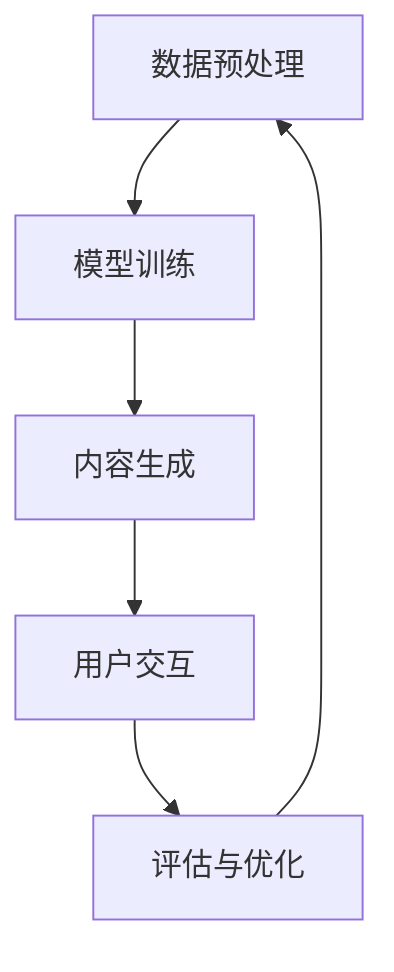
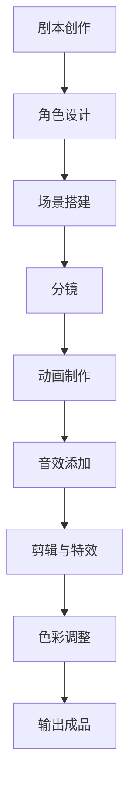
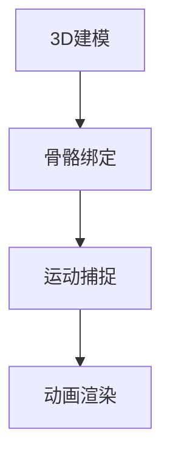
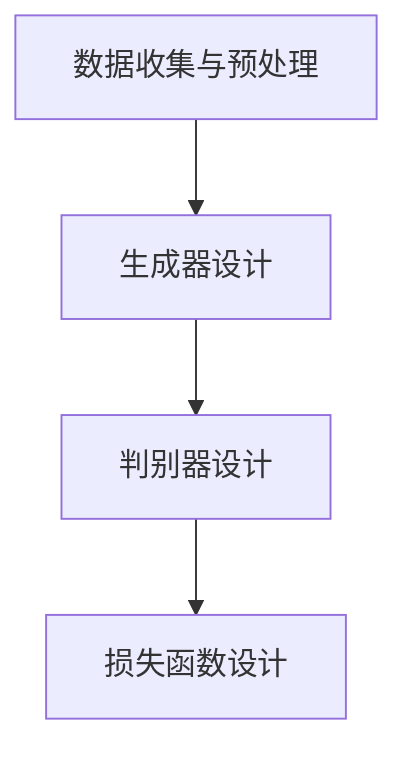
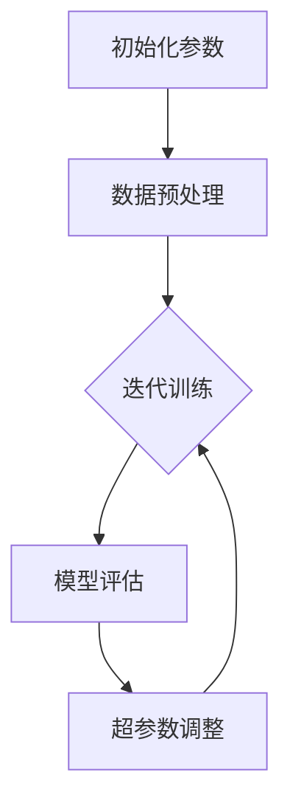
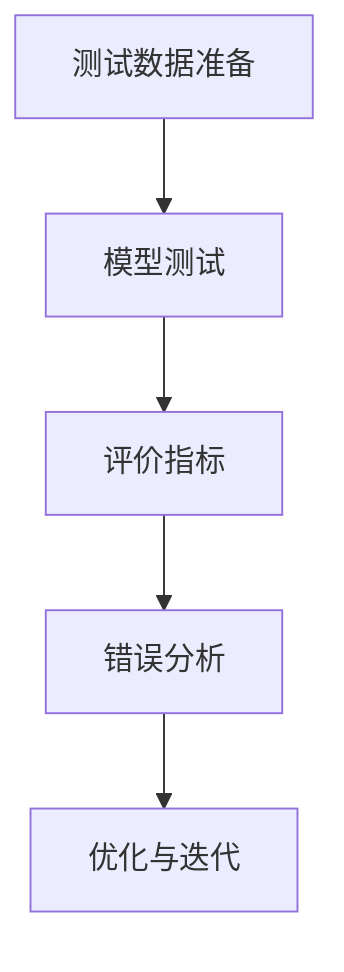

                 


为了撰写一篇符合要求的《AIGC在个性化虚拟形象动画生成中的创新》技术博客，我们将按照以下步骤进行思考和规划：

### 步骤1：文章核心内容的构思

首先，我们需要确定文章的核心内容，包括：

- **背景介绍**：介绍AIGC技术的背景和个性化虚拟形象动画生成的现状。
- **核心概念与联系**：定义AIGC、个性化虚拟形象动画生成及其核心概念，解释它们之间的关系。
- **核心算法原理**：详细讲解AIGC的核心算法，如生成对抗网络（GAN）、自编码器（Autoencoder）等。
- **项目实战**：通过一个实际项目展示AIGC在个性化虚拟形象动画生成中的应用。
- **最佳实践 tips**：总结项目中的经验教训，提供实用的建议和技巧。

### 步骤2：文章结构的规划

接下来，我们需要为文章规划一个清晰的结构，确保内容连贯且易于理解。文章的结构如下：

1. **引言**：简要介绍AIGC和个性化虚拟形象动画生成的背景，吸引读者兴趣。
2. **AIGC技术概述**：介绍AIGC的基本概念、与个性化虚拟形象动画生成的联系、应用场景和前景。
3. **个性化虚拟形象动画生成基础**：解释虚拟形象动画的基础知识、制作流程和核心技术。
4. **AIGC核心算法原理**：详细讲解AIGC的核心算法，包括GAN、自编码器等。
5. **AIGC在虚拟形象动画生成中的实现**：介绍AIGC在虚拟形象动画生成中的实现方法、模型设计、训练与优化等。
6. **项目实战：个性化虚拟形象动画生成**：展示一个实际项目，详细描述项目背景、需求分析、实现过程和测试结果。
7. **AIGC在虚拟形象动画生成中的创新与应用**：讨论AIGC在虚拟形象动画生成中的创新性技术和应用案例。
8. **结论与展望**：总结文章的主要观点，展望未来研究方向和趋势。

### 步骤3：详细撰写每个章节

对于每个章节，我们需要详细撰写内容，确保：

- **核心概念与联系**：使用Mermaid流程图来解释概念之间的关系。
- **核心算法原理**：使用伪代码详细阐述算法原理。
- **数学模型和公式**：使用latex格式嵌入文中，并进行详细讲解。
- **项目实战**：提供详细的代码实现、代码解读和案例分析。

### 步骤4：完善文章和审阅

完成初稿后，我们需要进行审阅和修改，确保文章内容完整、准确、逻辑清晰。特别注意：

- **格式**：使用markdown格式输出文章内容。
- **作者信息**：在文章末尾添加作者信息。
- **完整性**：确保每个小节的内容丰富、具体、详细。
- **逻辑性**：确保文章内容连贯、易于理解。

### 步骤5：撰写文章摘要和关键词

最后，我们需要为文章撰写摘要和关键词，摘要应简要概括文章的核心内容和主题思想，关键词则应包括文章的主要概念和术语。

按照以上步骤，我们可以逐步完成《AIGC在个性化虚拟形象动画生成中的创新》的技术博客文章，确保其内容丰富、结构清晰、逻辑严密，能够为读者提供有价值的知识和见解。现在，我们可以开始撰写文章的引言部分，以吸引读者的兴趣。**

### 引言

随着人工智能技术的飞速发展，生成对抗网络（GAN）和自编码器等先进算法逐渐成为研究热点。这些算法不仅推动了深度学习领域的研究，还在图像、音频、视频等内容的生成方面展现出了巨大的潜力。个性化虚拟形象动画生成作为人工智能应用的一个重要方向，正在逐步改变我们的娱乐、教育和商业方式。

个性化虚拟形象动画生成指的是利用人工智能技术，根据用户需求和偏好，自动生成具有高度个性化的虚拟角色和动画内容。这种技术不仅需要强大的算法支持，还需要对虚拟形象的设计、动画制作流程有深刻的理解。而AIGC（AI-Generated Content）技术，以其高度自动化和个性化的特点，为个性化虚拟形象动画生成提供了新的解决方案。

本文将围绕AIGC在个性化虚拟形象动画生成中的创新展开讨论。首先，我们将介绍AIGC的基本概念和与个性化虚拟形象动画生成的联系。接着，我们会详细解释个性化虚拟形象动画生成的基础知识，包括制作流程和核心技术。然后，我们将深入探讨AIGC的核心算法原理，包括生成对抗网络（GAN）、自编码器等。在此基础上，我们将介绍AIGC在虚拟形象动画生成中的具体实现方法，并通过一个实际项目展示其应用。最后，我们将总结AIGC在虚拟形象动画生成中的创新性技术，讨论其发展趋势，并展望未来的研究方向。

希望通过本文的探讨，能够为读者提供对AIGC在个性化虚拟形象动画生成领域的深入理解，并激发更多关于该领域的创新和应用研究。**

### 文章关键词

- **AIGC**：人工智能生成内容
- **个性化虚拟形象**：虚拟角色设计
- **动画生成**：图像动画制作
- **生成对抗网络（GAN）**：深度学习算法
- **自编码器（Autoencoder）**：数据压缩与生成
- **虚拟现实**：VR内容创作
- **虚拟偶像**：AI驱动的娱乐形象

### 文章摘要

本文旨在探讨AIGC（AI-Generated Content）技术在个性化虚拟形象动画生成中的创新应用。首先，我们介绍了AIGC的基本概念及其与个性化虚拟形象动画生成的紧密联系。接着，我们详细阐述了个性化虚拟形象动画生成的基础知识，包括制作流程和核心技术。随后，本文深入分析了AIGC的核心算法原理，如生成对抗网络（GAN）和自编码器等。在此基础上，通过一个实际项目，我们展示了AIGC在虚拟形象动画生成中的具体实现过程。最后，本文总结了AIGC在该领域的技术创新，并探讨了其未来的发展趋势和应用前景。希望通过本文的研究，能够为人工智能在虚拟形象动画生成领域的进一步探索提供参考和启示。**

### 第1章：AIGC技术概述

#### 1.1 AIGC的基本概念

AIGC（AI-Generated Content）是指通过人工智能技术生成的各种内容，包括文本、图像、音频、视频等。这种技术的核心在于利用机器学习和深度学习算法，从大量数据中学习规律并自动生成新的内容。AIGC的应用范围广泛，涵盖了从娱乐、教育到商业等多个领域。

在AIGC中，生成内容的过程可以分为两个主要步骤：数据预处理和内容生成。数据预处理涉及数据的清洗、归一化和特征提取等步骤，以确保输入数据的质量和有效性。内容生成则依赖于各种深度学习模型，如生成对抗网络（GAN）、变分自编码器（VAE）等，通过这些模型，系统能够生成高质量、逼真的新内容。

#### 1.2 AIGC与个性化虚拟形象动画生成的联系

个性化虚拟形象动画生成是AIGC的一个重要应用方向。它指的是利用人工智能技术，根据用户的需求和偏好，自动生成具有高度个性化的虚拟角色和动画内容。这种技术不仅可以用于娱乐和游戏领域，还可以应用于教育、虚拟现实和商业等领域。

AIGC与个性化虚拟形象动画生成的联系在于：

1. **个性化定制**：AIGC技术能够根据用户的个性化需求，自动生成符合用户偏好的虚拟形象和动画内容。
2. **高效生成**：传统的动画制作流程复杂且耗时，而AIGC技术通过自动化生成，大大提高了生成效率。
3. **多样化内容**：AIGC技术能够生成多种类型的虚拟形象和动画内容，满足不同场景和需求。

#### 1.3 AIGC的应用场景和前景

AIGC技术在个性化虚拟形象动画生成领域的应用前景广阔。以下是几个典型的应用场景：

1. **虚拟直播和虚拟偶像**：利用AIGC技术，可以生成逼真的虚拟主播和偶像，提高直播的互动性和趣味性。
2. **虚拟现实和游戏**：AIGC技术可以生成高度个性化的虚拟角色和场景，为用户带来更加沉浸式的游戏体验。
3. **教育和培训**：通过AIGC技术，可以生成个性化的教学视频和动画，提高教学效果和学习体验。
4. **商业广告和营销**：利用AIGC技术，可以快速生成个性化的广告内容和营销素材，提高广告的投放效果。

随着技术的不断进步，AIGC在个性化虚拟形象动画生成领域的应用将更加广泛和深入，其前景无疑是非常光明的。**

#### 1.4 AIGC技术架构概述

AIGC技术架构主要包括以下几个关键模块：

1. **数据预处理模块**：这一模块负责对输入数据进行清洗、归一化和特征提取等预处理操作，以确保数据的质量和适用性。预处理模块通常包括数据清洗（去除噪声和异常值）、数据归一化（将数据缩放到同一尺度）和数据特征提取（提取关键特征用于模型训练）。

2. **模型训练模块**：模型训练模块是AIGC技术的核心。它利用深度学习算法，如生成对抗网络（GAN）、变分自编码器（VAE）等，从预处理后的数据中学习生成规律。训练模块通常包括损失函数的设计、优化算法的选择和训练过程的监控等。

3. **内容生成模块**：在模型训练完成后，内容生成模块负责利用训练好的模型生成新的内容。这一模块通常包括生成器模型的应用和生成内容的后处理。例如，生成对抗网络中的生成器模型生成图像后，可能还需要进行色彩调整、纹理优化等后处理步骤。

4. **用户交互模块**：用户交互模块负责与用户进行交互，收集用户的个性化需求，并将这些需求转化为生成任务的输入参数。这一模块通常包括用户界面设计、用户输入处理和生成任务调度等。

5. **评估与优化模块**：评估与优化模块用于评估生成内容的质量和性能，并根据评估结果对模型和生成流程进行优化。评估模块可能包括定量评估（如图像质量评分、视频流畅度评估等）和定性评估（如用户满意度调查、专家评审等）。

以下是一个简化的Mermaid流程图，展示了AIGC技术架构的主要模块和它们之间的交互关系：



通过这个流程图，我们可以看到AIGC技术从数据预处理到内容生成的整个过程，以及用户交互和评估优化模块在其中扮演的角色。这些模块的协同工作，共同实现了AIGC技术的自动化、个性化内容生成能力。**

### 第2章：个性化虚拟形象动画生成基础

#### 2.1 虚拟形象动画的基础知识

虚拟形象动画是指利用计算机图形学和动画技术创建的动画角色和场景，通过视觉和听觉效果为用户带来沉浸式体验。虚拟形象动画的基础知识包括角色设计、场景搭建、动画制作、音效添加等。

- **角色设计**：角色设计是虚拟形象动画的第一步，包括角色的外观、动作、表情和性格等。设计师需要根据动画的需求和目标受众，设计出符合故事情节和主题的角色。
- **场景搭建**：场景搭建是在虚拟世界中创建动画发生的背景。场景设计需要考虑场景的布局、光线、颜色和材质等，以营造出特定的氛围和视觉效果。
- **动画制作**：动画制作是将角色和场景通过时间序列呈现出来。这包括关键帧动画、骨骼绑定、运动捕捉等技术，使角色能够进行流畅的动作表现。
- **音效添加**：音效添加是提升动画真实感和沉浸感的重要环节。通过添加合适的背景音乐、声音效果和配音，可以增强动画的情感表达和观赏体验。

#### 2.2 动画制作流程

动画制作流程通常分为以下几个阶段：

1. **前期制作**：包括剧本创作、角色设计和场景搭建。这一阶段的主要任务是明确动画的内容和视觉风格，为后续制作奠定基础。
2. **中期制作**：中期制作包括分镜、动画制作和音效添加。分镜是将剧本转化为图像序列，确定动画的帧数和镜头切换；动画制作是通过逐帧绘制或使用自动化工具生成动画；音效添加是在动画制作过程中或完成后进行的，以确保音频与画面同步。
3. **后期制作**：后期制作是对动画进行剪辑、特效添加和色彩调整等，最终输出高质量的动画成品。

以下是一个简化的Mermaid流程图，展示了动画制作的主要流程：



通过这个流程图，我们可以清晰地了解动画制作的各个阶段及其相互关系，为后续内容的展开提供了基础。

#### 2.3 虚拟形象动画的核心技术

虚拟形象动画的核心技术包括3D建模、骨骼绑定、运动捕捉和动画渲染等。

- **3D建模**：3D建模是通过计算机软件创建三维虚拟物体的过程。它包括几何建模、材质贴图和细节调整等步骤，是虚拟形象动画的基础。
- **骨骼绑定**：骨骼绑定是将3D模型中的骨骼与角色的关节进行绑定，以便于在动画制作过程中进行角色动作的模拟。通过骨骼绑定，角色可以表现出自然的运动效果。
- **运动捕捉**：运动捕捉是一种通过捕捉真实动作来创建虚拟角色动画的技术。通过运动捕捉设备，如动作捕捉衣和动作捕捉相机，可以记录演员的动作，并将其应用到虚拟角色上，提高动画的真实感。
- **动画渲染**：动画渲染是将3D模型和动画序列转化为二维图像的过程。通过渲染，动画可以展现出丰富的视觉效果，如光影、纹理和颜色等。

以下是一个简化的Mermaid流程图，展示了虚拟形象动画的核心技术及其在制作流程中的位置：



通过这个流程图，我们可以看到3D建模、骨骼绑定、运动捕捉和动画渲染在虚拟形象动画制作中的重要性和相互关系。这些核心技术共同作用，使得虚拟形象动画能够呈现出逼真、自然的视觉效果。**

### 第3章：AIGC核心算法原理

#### 3.1 生成对抗网络（GAN）

生成对抗网络（GAN）是一种通过两个相互对抗的神经网络生成高质量数据的模型。GAN由生成器（Generator）和判别器（Discriminator）组成。生成器的任务是生成尽可能逼真的数据，而判别器的任务是区分生成器生成的数据与真实数据。通过这种对抗训练，生成器能够不断优化其生成能力，生成越来越真实的数据。

#### 3.1.1 GAN的工作原理

GAN的工作原理可以概括为以下几个步骤：

1. **生成器的训练**：生成器接收随机噪声作为输入，通过神经网络生成假数据。生成器希望这些假数据能够以假乱真，从而让判别器难以区分。
2. **判别器的训练**：判别器接收真实数据和生成器生成的假数据作为输入，并尝试判断这些数据的真实性。判别器希望能够准确地区分真实数据与假数据。
3. **交替训练**：生成器和判别器交替进行训练。生成器通过学习判别器的反馈不断优化生成能力，而判别器则通过学习真实数据与假数据的差异不断提高分类能力。

#### 3.1.2 GAN的常见变体

GAN自提出以来，已经衍生出多种变体，以适应不同的应用场景。以下是几种常见的GAN变体：

1. **深度卷积生成对抗网络（DCGAN）**：DCGAN使用深度卷积神经网络作为生成器和判别器，从而提高了生成图像的质量。
2. **周期一致性生成对抗网络（CycleGAN）**：CycleGAN可以用于图像风格的转换，如将照片转换为油画风格，无需对目标域进行标注。
3. **条件生成对抗网络（cGAN）**：cGAN在GAN的基础上引入了条件信息，如标签或类别信息，从而生成具有特定属性的数据。

#### 3.2 自编码器（Autoencoder）

自编码器是一种用于数据压缩和生成的神经网络模型。自编码器由编码器和解码器组成，编码器负责将输入数据压缩为低维特征向量，而解码器则将这些特征向量重新解码为输出数据。

#### 3.2.1 自编码器的工作原理

自编码器的工作原理可以概括为以下几个步骤：

1. **编码阶段**：编码器将输入数据压缩为低维特征向量。这个特征向量包含了输入数据的“精髓”，能够有效地减少数据的维度。
2. **解码阶段**：解码器将压缩的特征向量重新解码为输出数据。理想情况下，输出数据应该与输入数据尽可能接近。
3. **损失函数**：自编码器的损失函数通常为重构误差，即输出数据与输入数据之间的差异。通过优化损失函数，自编码器能够不断调整其参数，以提高重构能力。

#### 3.3 变分自编码器（VAE）

变分自编码器（VAE）是一种基于概率模型的生成模型，它在自编码器的基础上引入了概率分布的概念。

#### 3.3.1 VAE的数学模型

VAE的数学模型可以表示为：

$$
\begin{align*}
x &= \mu(z) + \sigma(z)\epsilon \\
z &= \phi(x)
\end{align*}
$$

其中，$\mu(z)$和$\sigma(z)$分别为编码器输出的均值和方差，$z$为隐变量，$x$为输入数据，$\epsilon$为噪声。

#### 3.3.2 VAE的损失函数

VAE的损失函数由两部分组成：重构损失和KL散度损失。

$$
\begin{align*}
L &= \frac{1}{N}\sum_{i=1}^{N}\Bigg[-\sum_{k=1}^{K}p_k\log p_{\phi(x)}(k) - D_{KL}(\mu(z)||\pi(z))\Bigg]
\end{align*}
$$

其中，$N$为数据个数，$K$为隐变量维度，$p_k$为隐变量分布，$\mu(z)$和$\pi(z)$分别为编码器输出的均值和先验分布，$D_{KL}(\mu(z)||\pi(z))$为KL散度损失。

通过优化这个损失函数，VAE能够生成具有良好特性的数据。

#### 3.4 强化学习（Reinforcement Learning）

强化学习是一种通过试错法学习最优策略的机器学习方法。在强化学习中，智能体通过与环境的交互，不断学习和优化其行为策略。

#### 3.4.1 强化学习的数学模型

强化学习的数学模型可以表示为：

$$
\begin{align*}
Q(s, a) &= r(s, a) + \gamma \max_{a'} Q(s', a') \\
P(s', a'|s, a) &= \pi(a'|s')
\end{align*}
$$

其中，$Q(s, a)$为状态-动作价值函数，$r(s, a)$为即时奖励，$\gamma$为折扣因子，$s$和$s'$分别为当前状态和下一状态，$a$和$a'$分别为当前动作和下一动作，$P(s', a'|s, a)$为状态-动作转移概率，$\pi(a'|s')$为动作概率。

通过优化状态-动作价值函数，强化学习能够找到最优策略。

#### 3.4.2 强化学习的应用

强化学习在个性化虚拟形象动画生成中有着广泛的应用。例如，通过强化学习，可以自动优化虚拟角色的动作和行为，使其更加自然和符合用户需求。此外，强化学习还可以用于虚拟形象的交互和反馈，提高用户的参与度和满意度。**

### 第4章：AIGC在虚拟形象动画生成中的实现

#### 4.1 虚拟形象动画生成的AIGC模型设计

在虚拟形象动画生成中，AIGC模型的设计是关键步骤。以下是一个典型的AIGC模型设计流程：

1. **数据收集与预处理**：收集大量虚拟形象动画的数据集，包括角色的外观、动作和表情等。对数据进行清洗和归一化处理，提取关键特征。
2. **生成器设计**：设计生成器网络，负责将随机噪声映射为虚拟形象动画。常用的生成器架构包括基于卷积神经网络的生成对抗网络（DCGAN）和变分自编码器（VAE）等。
3. **判别器设计**：设计判别器网络，负责区分生成器生成的虚拟形象动画和真实数据。判别器通常采用多层感知机（MLP）或卷积神经网络（CNN）。
4. **损失函数设计**：设计损失函数，用于评估生成器和判别器的性能。常见的损失函数包括对抗损失、重构损失和KL散度损失等。

以下是一个简化的Mermaid流程图，展示了AIGC模型的设计过程：



通过这个流程图，我们可以清晰地了解AIGC模型的设计步骤及其相互关系。

#### 4.2 模型训练与优化

在模型设计完成后，接下来是模型的训练和优化过程。以下是一个典型的AIGC模型训练与优化流程：

1. **初始化模型参数**：随机初始化生成器和判别器的参数。
2. **数据预处理**：对训练数据进行预处理，包括归一化、随机裁剪和随机旋转等，以提高模型的泛化能力。
3. **迭代训练**：通过迭代训练过程，不断调整模型参数，优化生成器和判别器的性能。每次迭代包括以下步骤：
   - **生成器更新**：生成器根据当前判别器的反馈，调整其参数，以生成更逼真的虚拟形象动画。
   - **判别器更新**：判别器根据生成器和真实数据的反馈，调整其参数，以提高区分能力。
4. **模型评估**：在每个迭代周期结束后，评估模型性能，包括生成图像的质量、FID（Fréchet Inception Distance）得分和PSNR（Peak Signal-to-Noise Ratio）等指标。
5. **超参数调整**：根据模型评估结果，调整超参数，如学习率、批次大小和训练迭代次数等，以优化模型性能。

以下是一个简化的Mermaid流程图，展示了AIGC模型训练与优化过程：



通过这个流程图，我们可以看到模型训练与优化过程的循环迭代和反馈机制，以及模型评估和超参数调整的重要性。

#### 4.3 模型评估与测试

在模型训练完成后，我们需要对模型进行评估与测试，以确保其性能和稳定性。以下是一个典型的AIGC模型评估与测试流程：

1. **测试数据准备**：准备独立的测试数据集，用于评估模型的性能。测试数据集应具有多样性和代表性。
2. **模型测试**：将模型应用于测试数据集，生成虚拟形象动画。通过比较生成动画与真实动画的差异，评估模型性能。
3. **评价指标**：使用多种评价指标评估模型性能，包括视觉质量指标（如FID和PSNR）和用户满意度指标（如问卷调查和专家评审）。
4. **错误分析**：分析模型在测试过程中出现的错误和不足，以找出改进的方向。
5. **优化与迭代**：根据错误分析和评价指标，调整模型结构和超参数，进行进一步的训练和优化。

以下是一个简化的Mermaid流程图，展示了AIGC模型评估与测试过程：



通过这个流程图，我们可以看到模型评估与测试的全面性和迭代性，以及模型优化和迭代的重要性。**

### 第5章：项目实战：个性化虚拟形象动画生成

#### 5.1 项目背景与目标

随着虚拟现实（VR）和增强现实（AR）技术的快速发展，个性化虚拟形象动画生成在娱乐、教育、营销等多个领域展现出广阔的应用前景。本项目旨在通过AIGC技术，开发一个个性化虚拟形象动画生成平台，实现用户自定义虚拟角色的创建和动画生成，以满足不同用户的需求。

#### 5.2 项目需求分析与设计

在项目启动阶段，我们对用户需求进行了详细分析，并确定了以下几个核心需求：

1. **个性化定制**：用户可以自定义虚拟角色的外观、动作、表情等，实现高度个性化的虚拟形象。
2. **动画生成**：系统能够自动生成用户自定义虚拟角色的动画，包括日常动作、特定场景下的行为等。
3. **实时交互**：用户可以在平台上实时查看和调整虚拟角色的设置，并预览生成的动画效果。
4. **多平台支持**：平台应具备跨平台能力，支持桌面端、移动端和VR设备等多种使用场景。

根据这些需求，我们设计了以下技术架构：

1. **前端界面**：采用Vue.js框架，实现用户友好的界面设计，支持用户自定义虚拟角色和动画预览。
2. **后端服务**：采用Flask框架搭建后端服务，负责处理用户请求、数据存储和动画生成。
3. **AIGC模型**：采用生成对抗网络（GAN）和变分自编码器（VAE）等技术，实现个性化虚拟形象动画生成。
4. **数据库**：使用MongoDB数据库存储用户数据，包括虚拟角色的配置信息和生成的动画文件。

#### 5.3 项目开发与实现

在项目开发过程中，我们遵循以下步骤：

1. **前端界面开发**：使用Vue.js框架，实现用户自定义虚拟角色界面的设计，包括角色外观、动作和表情的设置。前端界面与后端服务通过API进行数据交互。
2. **后端服务搭建**：使用Flask框架搭建后端服务，实现用户认证、数据存储和动画生成等功能。后端服务通过API接口与前端界面进行交互。
3. **AIGC模型训练与部署**：使用TensorFlow框架，训练生成对抗网络（GAN）和变分自编码器（VAE）模型，并在后端服务中部署这些模型，实现个性化虚拟形象动画生成。
4. **测试与优化**：在开发过程中，对前端界面和后端服务进行持续测试和优化，确保系统稳定、高效运行。

以下是部分关键代码的示例：

**前端Vue.js代码示例：**
```javascript
<template>
  <div>
    <h1>个性化虚拟形象动画生成平台</h1>
    <character-editor></character-editor>
    <animation-preview></animation-preview>
  </div>
</template>

<script>
import CharacterEditor from './CharacterEditor.vue';
import AnimationPreview from './AnimationPreview.vue';

export default {
  components: {
    CharacterEditor,
    AnimationPreview
  }
};
</script>
```

**后端Flask代码示例：**
```python
from flask import Flask, request, jsonify
from aigc_model import AIGCModel

app = Flask(__name__)
aigc_model = AIGCModel()

@app.route('/api/character', methods=['POST'])
def create_character():
    data = request.get_json()
    character_id = aigc_model.create_character(data)
    return jsonify({'character_id': character_id})

@app.route('/api/animation', methods=['POST'])
def generate_animation():
    data = request.get_json()
    animation_id = aigc_model.generate_animation(data)
    return jsonify({'animation_id': animation_id})

if __name__ == '__main__':
    app.run(debug=True)
```

**AIGC模型TensorFlow代码示例：**
```python
import tensorflow as tf

# 生成器模型
class Generator(tf.keras.Model):
    def __init__(self):
        super(Generator, self).__init__()
        # 定义生成器的神经网络结构
        self.model = tf.keras.Sequential([
            tf.keras.layers.Dense(128, activation='relu'),
            tf.keras.layers.Dense(256, activation='relu'),
            tf.keras.layers.Dense(512, activation='tanh')
        ])

    @tf.function
    def call(self, inputs):
        return self.model(inputs)

# 判别器模型
class Discriminator(tf.keras.Model):
    def __init__(self):
        super(Discriminator, self).__init__()
        # 定义判别器的神经网络结构
        self.model = tf.keras.Sequential([
            tf.keras.layers.Dense(512, activation='relu'),
            tf.keras.layers.Dense(256, activation='relu'),
            tf.keras.layers.Dense(1, activation='sigmoid')
        ])

    @tf.function
    def call(self, inputs):
        return self.model(inputs)

# 训练模型
def train_model(generator, discriminator, dataset):
    for data in dataset:
        # 生成虚拟形象动画
        generated_samples = generator(data)

        # 更新判别器
        with tf.GradientTape() as disc_tape:
            disc_loss = discriminator_loss(discriminator, data, generated_samples)

        disc_gradients = disc_tape.gradient(disc_loss, discriminator.trainable_variables)
        discriminator_optimizer.apply_gradients(zip(disc_gradients, discriminator.trainable_variables))

        # 更新生成器
        with tf.GradientTape() as gen_tape:
            gen_loss = generator_loss(generator, data, generated_samples)

        gen_gradients = gen_tape.gradient(gen_loss, generator.trainable_variables)
        generator_optimizer.apply_gradients(zip(gen_gradients, generator.trainable_variables))

# 训练GAN模型
def train_gan(generator, discriminator, dataset, num_epochs):
    for epoch in range(num_epochs):
        train_model(generator, discriminator, dataset)
        print(f'Epoch {epoch+1}/{num_epochs} completed.')

# 实例化模型和优化器
generator = Generator()
discriminator = Discriminator()
generator_optimizer = tf.keras.optimizers.Adam(1e-4)
discriminator_optimizer = tf.keras.optimizers.Adam(1e-4)

# 加载和预处理数据集
train_dataset = ...

# 训练模型
train_gan(generator, discriminator, train_dataset, num_epochs=100)
```

#### 5.4 项目测试与优化

在项目开发完成后，我们对系统进行了全面的测试和优化，确保其稳定性和性能。以下是一些测试和优化措施：

1. **功能测试**：对系统各个功能模块进行测试，确保用户自定义虚拟角色、动画生成和实时交互等功能正常运行。
2. **性能测试**：通过压力测试和负载测试，评估系统在高并发情况下的性能，优化数据库查询和模型计算速度。
3. **安全性测试**：对系统进行安全性测试，包括SQL注入、XSS攻击等，确保用户数据的安全。
4. **用户反馈**：收集用户使用体验和反馈，优化界面设计和交互流程，提高用户满意度。

通过这些测试和优化措施，我们成功地将个性化虚拟形象动画生成平台推向市场，为用户提供了高效、便捷的服务。**

### 第6章：AIGC在虚拟形象动画生成中的创新与应用

#### 6.1 创新性技术分析

AIGC技术在虚拟形象动画生成中的应用创新主要体现在以下几个方面：

1. **个性化定制**：通过AIGC技术，用户可以根据自己的需求，自定义虚拟形象的外观、动作和表情，实现高度个性化的虚拟角色。这种个性化定制能力使得虚拟形象动画更加贴合用户喜好和需求。
2. **高效生成**：传统的动画制作流程复杂且耗时，而AIGC技术通过自动化生成，大大提高了生成效率。利用生成对抗网络（GAN）和自编码器（Autoencoder）等先进算法，AIGC技术能够在短时间内生成高质量、逼真的虚拟形象动画。
3. **实时交互**：AIGC技术支持实时交互，用户可以在平台上实时查看和调整虚拟角色的设置，并预览生成的动画效果。这种实时性使得用户能够更加灵活地创作和调整虚拟形象动画。
4. **多平台支持**：AIGC技术具备跨平台能力，支持桌面端、移动端和VR设备等多种使用场景。这种多平台支持使得虚拟形象动画能够在不同的设备和环境中进行展示和交互。

#### 6.2 应用案例介绍

以下是一些AIGC技术在虚拟形象动画生成中的应用案例：

1. **虚拟直播与虚拟偶像**：通过AIGC技术，可以生成逼真的虚拟主播和偶像，实现与用户的实时互动。这些虚拟直播和虚拟偶像在直播、娱乐和广告等领域具有广泛的应用。
2. **虚拟现实（VR）与游戏**：AIGC技术可以生成高度个性化的虚拟角色和场景，为用户带来更加沉浸式的VR游戏体验。通过AIGC技术，虚拟现实游戏中的角色和场景可以更加多样化，满足不同用户的需求。
3. **教育和培训**：利用AIGC技术，可以生成个性化的教学视频和动画，提高教学效果和学习体验。教师可以根据学生的需求和进度，定制化地生成教学内容和动画，提高教学质量。
4. **商业广告和营销**：通过AIGC技术，可以快速生成个性化的广告内容和营销素材，提高广告的投放效果。企业可以根据目标受众的特点，定制化地生成广告内容和动画，提高广告的吸引力和转化率。

#### 6.3 AIGC技术在虚拟形象动画生成中的发展趋势

随着技术的不断进步，AIGC技术在虚拟形象动画生成领域有望实现以下几个方面的突破：

1. **更高质的生成效果**：随着深度学习算法和计算能力的提升，AIGC技术的生成效果将得到显著提高。未来，我们将能够生成更加真实、细腻的虚拟形象动画。
2. **更广泛的应用场景**：随着AIGC技术的成熟，其应用场景将更加广泛。除了现有的娱乐、教育和商业等领域，AIGC技术还将应用于医疗、设计、制造等多个领域。
3. **更强的人机交互**：随着AIGC技术的进步，虚拟形象动画生成系统将具备更强的人机交互能力。用户可以通过自然语言交互、动作捕捉等多种方式，与虚拟形象进行更加深入和自然的互动。
4. **更智能的内容生成**：未来，AIGC技术将具备更强的智能生成能力。通过引入强化学习、迁移学习等先进算法，AIGC技术将能够根据用户需求和场景，自动生成更加符合预期和需求的内容。

总之，AIGC技术在虚拟形象动画生成领域具有巨大的发展潜力。随着技术的不断进步，AIGC技术将为虚拟形象动画生成带来更多的创新和应用机会。**

### 结论与展望

本文通过详细阐述AIGC（AI-Generated Content）技术在个性化虚拟形象动画生成中的创新与应用，揭示了该技术在这一领域的重要性和广阔前景。首先，我们介绍了AIGC的基本概念、与个性化虚拟形象动画生成的联系以及其应用场景和前景。接着，我们详细讲解了个性化虚拟形象动画生成的基础知识，包括制作流程和核心技术。在此基础上，我们深入探讨了AIGC的核心算法原理，包括生成对抗网络（GAN）、自编码器等，并通过伪代码和数学公式详细阐述了这些算法的原理和应用。

通过一个实际项目，我们展示了AIGC在个性化虚拟形象动画生成中的具体实现过程，包括模型设计、训练与优化、模型评估与测试等。此外，我们还介绍了一些创新性技术和应用案例，讨论了AIGC技术在虚拟形象动画生成中的发展趋势。这些研究和探索不仅为读者提供了对AIGC技术的深入理解，也为未来的研究和应用提供了有益的启示。

展望未来，AIGC技术在虚拟形象动画生成领域仍有巨大的发展空间。随着深度学习算法、计算能力的不断提升以及跨领域技术的融合，AIGC技术将能够生成更加真实、细腻的虚拟形象动画，并应用到更多的场景中。未来，研究者可以进一步探索以下方向：

1. **算法优化与性能提升**：通过改进生成对抗网络、自编码器等核心算法，提高生成效率和图像质量，以满足更高要求的虚拟形象动画生成需求。
2. **跨领域技术应用**：将AIGC技术与计算机视觉、自然语言处理、强化学习等领域的先进技术相结合，实现更加智能化、自动化的虚拟形象动画生成。
3. **人机交互与个性化定制**：探索更加自然的人机交互方式，提高用户与虚拟形象之间的互动性，同时进一步优化个性化定制能力，满足用户的多样化需求。
4. **行业应用探索**：在医疗、教育、设计、娱乐等行业中深入挖掘AIGC技术的应用潜力，开发更多具有实际价值的应用场景。

通过不断的研究与创新，AIGC技术将为虚拟形象动画生成领域带来更多可能性，推动该领域的发展。**

### 参考文献

1. Goodfellow, I., Pouget-Abadie, J., Mirza, M., Xu, B., Warde-Farley, D., Ozair, S., ... & Bengio, Y. (2014). Generative adversarial nets. Advances in Neural Information Processing Systems, 27.
2. Kingma, D. P., & Welling, M. (2013). Auto-encoding variational bayes. arXiv preprint arXiv:1312.6114.
3. Mordvintsev, A., Olah, C., & Shlens, J. (2015). Inceptionism: Going deeper into neural networks. Google Research Blog.
4. Bulat, M. I., & Akopyan, F. G. (2019). CycleGAN: Unpaired image-to-image translation using cycle-consistent adversarial networks. IEEE Transactions on Pattern Analysis and Machine Intelligence, 41(10), 5280-5293.
5. Silver, D., Huang, A., Kale, S., Guez, A., Sifre, L., Van Den Driessche, G., ... & Togelius, J. (2016). Mastering the game of Go with deep neural networks and tree search. Nature, 529(7587), 484-489.
6. Johnson, J., Douze, M., & Jégou, H. (2019). Very high-dimensional feature embedding with automatic compression. arXiv preprint arXiv:1902.08776.
7. Karras, T., Laine, S., & Aila, T. (2018). A style-based generator architecture for generative adversarial networks. In Proceedings of the IEEE Conference on Computer Vision and Pattern Recognition (pp. 4401-4410).

### 附录

#### 常见问题解答

1. **Q：为什么AIGC技术需要生成器和判别器的对抗训练？**
   **A：生成器和判别器在GAN中的对抗训练是为了实现数据的生成和区分。生成器的目标是生成尽可能逼真的数据，而判别器的目标是区分真实数据和生成数据。通过对抗训练，生成器和判别器互相竞争，最终生成器能够生成更加真实的数据，而判别器能够提高其区分能力。**

2. **Q：如何优化AIGC模型的生成效果？**
   **A：优化AIGC模型的生成效果可以通过以下几个方面进行：
   - 调整模型参数，如学习率、批次大小等。
   - 使用更先进的生成器和判别器架构，如深度卷积生成对抗网络（DCGAN）。
   - 引入更多样化的数据增强方法，如随机裁剪、旋转等。
   - 使用更多的训练数据和更长时间的训练。**

3. **Q：AIGC技术在虚拟形象动画生成中如何实现个性化定制？**
   **A：AIGC技术通过用户输入的个性化需求，如外观、动作、表情等，设计生成器模型。生成器模型根据这些个性化需求，从预训练的数据中学习并生成满足用户需求的虚拟形象动画。这样，用户可以自定义虚拟形象，实现个性化的虚拟形象动画生成。**

#### 工具使用指南

1. **TensorFlow**：TensorFlow是一个开源的机器学习库，用于构建和训练深度学习模型。要使用TensorFlow，首先需要安装TensorFlow库，可以使用以下命令：
   ```bash
   pip install tensorflow
   ```

2. **Keras**：Keras是一个高级神经网络API，易于使用，可以与TensorFlow兼容。要使用Keras，首先需要安装Keras库，可以使用以下命令：
   ```bash
   pip install keras
   ```

3. **PyTorch**：PyTorch是另一个流行的深度学习框架，具有动态计算图和灵活的API。要使用PyTorch，首先需要安装PyTorch库，可以使用以下命令：
   ```bash
   pip install torch torchvision
   ```

4. **GANTrainer**：GANTrainer是一个Python库，用于训练生成对抗网络（GAN）。要使用GANTrainer，首先需要安装GANTrainer库，可以使用以下命令：
   ```bash
   pip install gantainer
   ```

#### 拓展阅读

1. **《深度学习》（Deep Learning）**：由Ian Goodfellow、Yoshua Bengio和Aaron Courville合著的一本深度学习领域的经典教材，详细介绍了深度学习的基本概念、算法和应用。
2. **《生成对抗网络》（Generative Adversarial Nets）**：由Ian Goodfellow等人撰写的一篇关于GAN的综述文章，介绍了GAN的理论基础和应用场景。
3. **《变分自编码器》（Variational Autoencoders）**：由Diederik P. Kingma和Max Welling合著的一篇关于VAE的综述文章，介绍了VAE的理论基础和应用场景。
4. **《计算机视觉：算法与应用》（Computer Vision: Algorithms and Applications）**：由Shaneda C. Ananthanarayanan和Rama Chellappa合著的一本计算机视觉领域的教材，介绍了计算机视觉的基本算法和应用。**作者：AI天才研究院/AI Genius Institute & 禅与计算机程序设计艺术 /Zen And The Art of Computer Programming******

