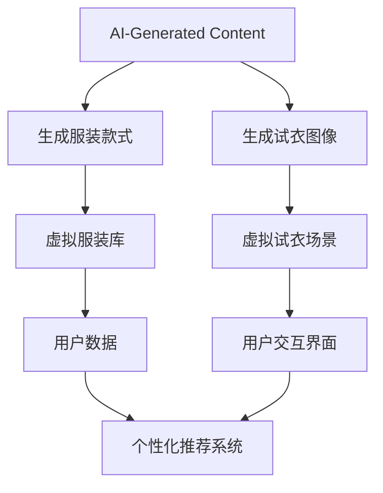
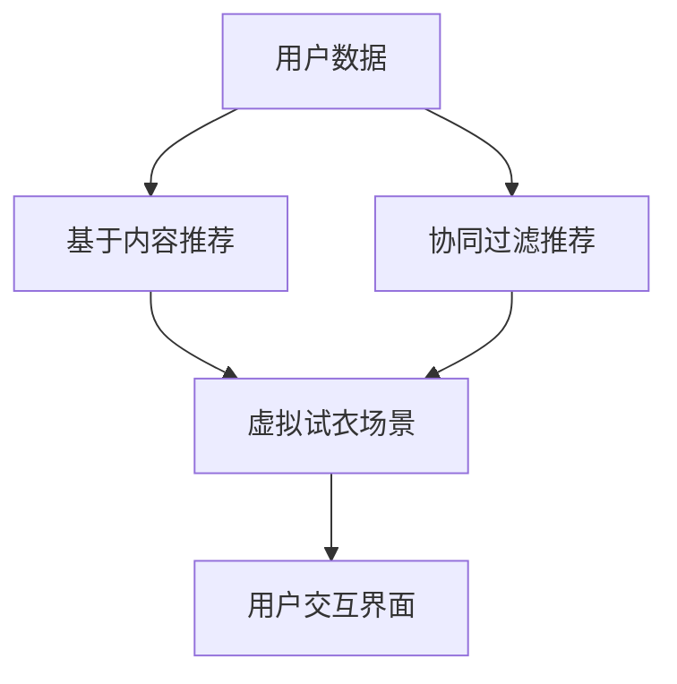
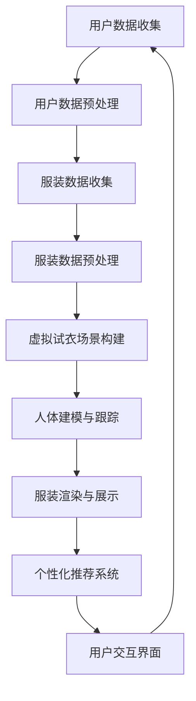
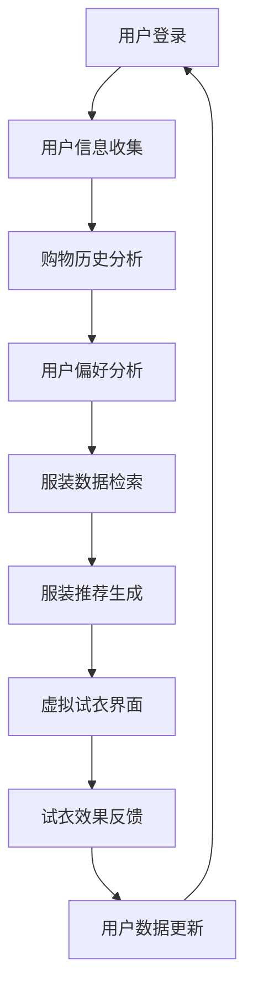

                 


### 1. 引言与背景

#### 1.1 AIGC概念介绍

AIGC（AI-Generated Content）是指利用人工智能技术自动生成内容，是继UGC（User-Generated Content）和PGC（Professional-Generated Content）之后的新兴内容生成方式。AIGC的核心理念是通过深度学习、自然语言处理、图像识别等技术，实现文本、图像、音频等多种类型内容的自动化生成。AIGC在内容创作、广告营销、虚拟试衣等多个领域展现出广阔的应用前景。

#### 1.2 个性化虚拟试衣的背景和现状

个性化虚拟试衣是结合虚拟现实（VR）和增强现实（AR）技术，为用户提供一种在虚拟环境中试穿服装的体验。这种技术能够模拟真实的试衣效果，帮助用户更直观地了解服装的搭配和穿着效果，从而提高购物的满意度。随着人工智能和计算机图形学技术的不断发展，个性化虚拟试衣在电商平台、时尚零售等领域得到广泛应用。

当前，个性化虚拟试衣面临的主要挑战包括：

- **数据获取与处理**：个性化虚拟试衣需要大量的用户数据和服装数据，数据的收集、存储和处理是一项复杂的任务。
- **图像生成质量**：生成逼真的试衣图像需要高精度的图像生成算法，当前的AIGC技术在这方面仍有待提高。
- **用户体验**：虚拟试衣的交互性和实时性直接影响用户的购物体验，如何优化交互流程和提升响应速度是关键问题。

#### 1.3 AIGC在个性化虚拟试衣中的应用

AIGC在个性化虚拟试衣中的应用主要体现在以下几个方面：

- **服装设计**：利用AIGC技术，设计师可以快速生成多种服装款式和搭配方案，节省设计时间和成本。
- **个性化推荐**：基于用户历史数据和偏好，AIGC可以自动生成个性化的试衣推荐，提高用户的购物体验。
- **虚拟模特**：通过AIGC技术生成虚拟模特，实现多种穿着效果的实时展示，提升用户对服装的直观感受。

### 小结

本文首先介绍了AIGC的概念和个性化虚拟试衣的背景，随后阐述了AIGC在个性化虚拟试衣中的应用及其面临的挑战。接下来，我们将深入探讨AIGC的核心概念与联系，包括AIGC与虚拟试衣、个性化推荐等技术的融合和关系架构。

### 2. 核心概念与联系

#### 2.1 AIGC技术概述

AIGC（AI-Generated Content）是指利用人工智能技术自动生成内容的过程。AIGC涵盖了多种技术，包括自然语言生成、图像生成、音频生成等。在这些技术中，生成式对抗网络（GAN）和变分自编码器（VAE）是AIGC的核心技术。

**生成式对抗网络（GAN）**

GAN是由生成器和判别器组成的对抗网络。生成器尝试生成与真实数据相似的数据，而判别器则试图区分真实数据和生成数据。通过这种对抗训练，生成器不断优化，最终能够生成高质量的数据。GAN在图像生成、文本生成等领域表现出色。

**变分自编码器（VAE）**

VAE是一种基于概率模型的生成模型。它通过编码器将输入数据映射到一个潜在空间，然后通过解码器从潜在空间生成输出数据。VAE在生成高质量的图像和数据增强方面具有优势。

**AIGC与虚拟试衣的联系**

虚拟试衣是AIGC的一个重要应用场景。在虚拟试衣中，AIGC技术可以用于以下几个方面：

- **服装生成**：通过AIGC技术生成各种服装款式，为用户提供更多的选择。
- **试衣图像生成**：利用AIGC生成逼真的试衣图像，提升用户的购物体验。
- **个性化推荐**：基于用户的历史数据和偏好，AIGC可以自动生成个性化的试衣推荐。

#### 2.2 虚拟试衣技术

虚拟试衣技术涉及多个领域，包括计算机图形学、计算机视觉、人机交互等。其核心目标是模拟真实的试衣效果，让用户在虚拟环境中体验服装的穿着效果。

**虚拟试衣系统的组成**

虚拟试衣系统通常由以下几部分组成：

- **用户数据采集**：收集用户的身体尺寸、穿着偏好等数据。
- **服装数据管理**：管理各种服装的款式、材质、颜色等信息。
- **试衣场景构建**：构建虚拟试衣的环境，包括背景、灯光、摄像头等。
- **图像生成与渲染**：利用计算机图形学技术生成试衣图像。

**计算机视觉在虚拟试衣中的应用**

计算机视觉技术在虚拟试衣中扮演关键角色，包括：

- **人体建模与跟踪**：通过计算机视觉算法，对人体进行建模和跟踪，以便准确生成试衣图像。
- **图像识别与分类**：对用户的试衣图像进行识别和分类，以便推荐合适的服装。

#### 2.3 个性化推荐系统

个性化推荐系统是一种基于用户历史行为和偏好，为用户提供个性化内容的服务。在个性化虚拟试衣中，推荐系统可以帮助用户发现感兴趣的服装，提高购物体验。

**个性化推荐的基本原理**

个性化推荐系统通常采用两种策略：

- **基于内容的推荐**：根据用户的历史行为和偏好，推荐与用户兴趣相似的物品。
- **协同过滤推荐**：通过分析用户之间的相似度，为用户推荐其他用户喜欢的物品。

**基于内容的推荐**

基于内容的推荐通过分析物品的特征和用户的历史行为，为用户推荐相似的物品。具体流程如下：

1. **物品特征提取**：提取每个物品的关键特征，如颜色、款式、材质等。
2. **用户特征提取**：提取用户的历史行为和偏好特征。
3. **相似度计算**：计算物品和用户之间的相似度，选择相似度较高的物品推荐给用户。

**协同过滤推荐**

协同过滤推荐通过分析用户之间的相似度，为用户推荐其他用户喜欢的物品。具体流程如下：

1. **用户相似度计算**：计算用户之间的相似度，通常使用余弦相似度、皮尔逊相关系数等。
2. **物品推荐**：根据用户相似度和物品的评分，为用户推荐其他用户喜欢的物品。

#### 2.4 Mermaid流程图展示

为了更好地理解AIGC、虚拟试衣和个性化推荐之间的关系，我们可以使用Mermaid流程图进行展示。

**AIGC与虚拟试衣的融合**



**个性化推荐在虚拟试衣中的应用**



通过上述Mermaid流程图，我们可以清晰地看到AIGC、虚拟试衣和个性化推荐之间的联系和相互作用。

### 小结

本节介绍了AIGC、虚拟试衣和个性化推荐的核心概念，并展示了它们之间的关系架构。在下一节中，我们将深入探讨AIGC技术的原理，包括生成式对抗网络（GAN）和变分自编码器（VAE）的工作机制。

### 3. AIGC技术原理

#### 3.1 自动生成内容（AGC）算法原理

自动生成内容（AGC）是AIGC的核心技术之一，其主要目标是利用人工智能算法自动生成高质量的内容。AGC算法主要包括基于变分自编码器（VAE）的生成模型和基于生成对抗网络（GAN）的生成模型。

**基于变分自编码器（VAE）的AGC**

VAE是一种概率生成模型，其基本思想是将输入数据通过编码器映射到一个潜在的均匀分布空间，然后通过解码器从这个空间生成输出数据。VAE由两个主要部分组成：编码器和解码器。

1. **编码器**：编码器将输入数据$x$映射到一个潜在的向量$z$，该向量代表了输入数据的特征。编码器通常由一个编码层和一个对数似然层组成。

   $$ 
   z = \mu(x); \quad \sigma^2(x) = \log(\sigma(x)^2)
   $$

   其中，$\mu(x)$和$\sigma^2(x)$分别是编码器的均值函数和方差函数。

2. **解码器**：解码器将潜在向量$z$映射回数据空间，生成重构的输入数据$\hat{x}$。

   $$ 
   \hat{x} = \phi(z)
   $$

   其中，$\phi(z)$是解码器的映射函数。

VAE的损失函数通常由数据重构损失和KL散度损失组成：

$$ 
L = \frac{1}{N}\sum_{i=1}^{N}\left[\sum_{j=1}^{D}\log(\sigma^2(x_j) + \epsilon) + \frac{1}{2}\left(\frac{z_j - \mu(x_j)}{\sigma(x_j)}\right)^2\right]
$$

**基于生成对抗网络（GAN）的AGC**

GAN是一种由生成器和判别器组成的对抗网络。生成器试图生成与真实数据相似的数据，而判别器则试图区分真实数据和生成数据。通过这种对抗训练，生成器不断优化，最终能够生成高质量的数据。

1. **生成器**：生成器接受一个随机噪声向量作为输入，生成伪真实数据。

   $$ 
   G(z) = \phi_G(z)
   $$

   其中，$z$是生成器的输入噪声，$G(z)$是生成器生成的伪真实数据。

2. **判别器**：判别器接受真实数据和生成数据作为输入，输出一个概率值，表示输入数据是真实数据的概率。

   $$ 
   D(x) = \frac{1}{2}\left[\log(D(x)) + \log(1 - D(G(z))\right]
   $$

   其中，$x$是真实数据，$G(z)$是生成器生成的伪真实数据。

GAN的目标是最小化判别器的损失函数：

$$ 
L_G = \frac{1}{N}\sum_{i=1}^{N}\left[\log(D(x)) + \log(1 - D(G(z))\right]
$$

同时，最大化生成器的损失函数：

$$ 
L_D = \frac{1}{N}\sum_{i=1}^{N}\left[\log(D(x)) + \log(D(G(z))\right]
$$

**伪代码展示**

以下是VAE和GAN的伪代码示例：

**变分自编码器（VAE）伪代码**

```python
# VAE编码器
def encode(x):
    z_mean = ...
    z_log_sigma = ...
    z = sample_normal(z_mean, z_log_sigma)
    return z

# VAE解码器
def decode(z):
    x_recon = ...
    return x_recon

# VAE训练
for epoch in range(num_epochs):
    for x in data_loader:
        z = encode(x)
        x_recon = decode(z)
        loss = reconstruct_loss(x, x_recon) + kl_divergence(z_mean, z_log_sigma)
        optimizer.zero_grad()
        loss.backward()
        optimizer.step()
```

**生成对抗网络（GAN）伪代码**

```python
# GAN生成器
def generate(z):
    x_fake = ...
    return x_fake

# GAN判别器
def discriminate(x):
    probability = ...
    return probability

# GAN训练
for epoch in range(num_epochs):
    for x, _ in data_loader:
        z = sample_noise()
        x_fake = generate(z)
        probability_real = discriminate(x)
        probability_fake = discriminate(x_fake)
        loss_G = -torch.mean(torch.log(probability_real) + torch.log(1 - probability_fake))
        loss_D = -torch.mean(torch.log(probability_real) + torch.log(1 - probability_fake))
        optimizer_G.zero_grad()
        loss_G.backward()
        optimizer_G.step()
        optimizer_D.zero_grad()
        loss_D.backward()
        optimizer_D.step()
```

通过上述内容，我们可以看到VAE和GAN在AGC中的应用，以及它们的算法原理和伪代码实现。

### 3.2 GAN算法原理讲解

生成对抗网络（GAN）是由生成器和判别器组成的对抗性学习框架，其核心思想是通过两个网络之间的博弈来提高生成器生成数据的真实度。GAN的原理可以概括为以下四个关键组成部分：生成器（Generator）、判别器（Discriminator）、生成过程、对抗性训练。

**生成器（Generator）**

生成器的任务是生成与真实数据相似的数据。在GAN中，生成器通常是一个神经网络，它接受一个随机噪声向量作为输入，并通过网络处理生成类似真实数据的输出。生成器的主要目的是欺骗判别器，使其无法区分生成数据和真实数据。

**判别器（Discriminator）**

判别器的任务是判断输入的数据是真实数据还是生成数据。判别器也是一个神经网络，它接受数据作为输入，并输出一个概率值，表示输入数据是真实数据的可能性。判别器的目标是最大化其判断的准确性。

**生成过程**

生成过程是生成器生成数据的过程。生成器将随机噪声通过神经网络映射为类似真实数据的图像。这个过程通常涉及多个隐藏层，通过逐层构建特征，最终生成高分辨率的图像。

**对抗性训练**

对抗性训练是GAN的训练过程。在训练过程中，生成器和判别器同时进行训练，但它们的目标是相互对立的。生成器试图生成更真实的数据以欺骗判别器，而判别器则试图更好地区分真实数据和生成数据。这个过程通过以下步骤进行：

1. **生成器训练**：生成器接收随机噪声，生成伪真实数据，然后将其与真实数据一起输入判别器。生成器的目标是最大化判别器输出伪真实数据的概率。

   $$ 
   G(z) \Rightarrow D(G(z)), \quad \text{maximize} \quad \mathbb{E}_{z \sim p_z(z)} [\log D(G(z))]
   $$

2. **判别器训练**：判别器接收真实数据和生成数据，并尝试最大化其输出概率的差异。判别器的目标是正确区分真实数据和生成数据。

   $$ 
   x \Rightarrow D(x), \quad \text{maximize} \quad \mathbb{E}_{x \sim p_{data}(x)} [\log D(x)] + \mathbb{E}_{z \sim p_z(z)} [\log (1 - D(G(z))]
   $$

通过上述对抗性训练，生成器和判别器不断优化，生成器逐渐提高生成数据的真实度，而判别器逐渐提高对真实数据和生成数据的辨别能力。

**GAN的优化算法**

GAN的训练过程中，优化算法的选择非常重要。常见的GAN优化算法包括梯度惩罚、谱归一化、批量归一化等。这些算法的目的是解决GAN训练过程中的梯度消失和梯度爆炸问题，提高生成器和判别器的训练效果。

1. **梯度惩罚**：在GAN的损失函数中添加梯度惩罚项，强制生成器和判别器在训练过程中保持稳定。梯度惩罚可以通过对生成器或判别器的梯度进行归一化来实现。

   $$ 
   L_G = \mathbb{E}_{z \sim p_z(z)} [\log D(G(z))] + \lambda ||\nabla_G \log D(G(z))||_2
   $$

2. **谱归一化**：通过谱归一化技术，对生成器和判别器的权重进行归一化，防止权重矩阵的行列式过大或过小。

3. **批量归一化**：在生成器和判别器的隐藏层中引入批量归一化，加速训练过程并提高模型的稳定性。

**GAN的应用实例**

GAN在多个领域有广泛的应用，包括图像生成、图像修复、风格迁移等。

1. **图像生成**：GAN可以生成高质量的自然图像。例如，使用条件GAN（cGAN）可以生成特定类别的图像，如动物图像、人脸图像等。

2. **图像修复**：通过生成器，GAN可以修复受损的图像。例如，使用GAN修复老照片、去除图像中的噪音等。

3. **风格迁移**：GAN可以实现图像的风格迁移，将一种风格应用到另一幅图像上。例如，将梵高的画风应用到照片上，使其具有梵高的风格。

**GAN的优点与挑战**

GAN的优点包括：

- **强大的图像生成能力**：GAN可以生成高质量、多样化的图像。
- **不需要标签数据**：与传统的图像生成方法相比，GAN不需要大量的标注数据进行训练。

GAN的挑战包括：

- **训练不稳定**：GAN的训练过程容易受到噪声和梯度消失的影响，导致训练不稳定。
- **模式崩溃**：在GAN的训练过程中，生成器可能会陷入局部最优，导致生成图像缺乏多样性。

通过上述讲解，我们可以理解GAN的工作原理和应用实例，以及GAN在AGC领域的重要性。

### 3.3 伪代码展示

在本节中，我们将详细展示GAN（生成对抗网络）的伪代码实现，包括生成器（Generator）和判别器（Discriminator）的代码，以及训练过程的伪代码。

**生成器伪代码**

```python
# 生成器伪代码
def generator(z):
    # 输入随机噪声向量 z
    # 展现生成器的前向传播过程，通过多个隐藏层生成伪真实数据 x_fake
    x_fake = ...
    return x_fake
```

**判别器伪代码**

```python
# 判别器伪代码
def discriminator(x):
    # 输入真实数据 x 或伪真实数据 x_fake
    # 展现判别器的判断过程，输出一个概率值，表示输入数据的真实性
    probability = ...
    return probability
```

**GAN训练伪代码**

```python
# GAN训练伪代码
for epoch in range(num_epochs):
    for x, _ in data_loader:  # 数据加载器
        # 判别器训练
        D_loss_real = discriminator_loss(discriminator(x))  # 训练判别器对真实数据的判断
        D_loss_fake = discriminator_loss(discriminator(x_fake))  # 训练判别器对伪真实数据的判断

        # 生成器训练
        G_loss = generator_loss(discriminator(x_fake))  # 训练生成器生成更真实的伪真实数据

        # 更新判别器和生成器的权重
        optimizer_D.step([D_loss_real, D_loss_fake])  # 判别器优化
        optimizer_G.step(G_loss)  # 生成器优化
```

**示例：生成器具体实现**

```python
# 示例：生成器具体实现（以PyTorch为例）
import torch
import torch.nn as nn

class Generator(nn.Module):
    def __init__(self):
        super(Generator, self).__init__()
        # 定义生成器的神经网络结构
        self.model = nn.Sequential(
            nn.Linear(z_dim, 128),
            nn.LeakyReLU(0.2),
            nn.Linear(128, x_dim),
            nn.Tanh()
        )

    def forward(self, z):
        x_fake = self.model(z)
        return x_fake
```

**示例：判别器具体实现**

```python
# 示例：判别器具体实现（以PyTorch为例）
class Discriminator(nn.Module):
    def __init__(self):
        super(Discriminator, self).__init__()
        # 定义判别器的神经网络结构
        self.model = nn.Sequential(
            nn.Linear(x_dim, 128),
            nn.LeakyReLU(0.2),
            nn.Linear(128, 1),
            nn.Sigmoid()
        )

    def forward(self, x):
        probability = self.model(x)
        return probability
```

通过上述伪代码和具体实现示例，我们可以清晰地看到GAN的核心组成部分及其训练过程。生成器和判别器通过相互对抗，逐步优化，最终实现高质量图像的生成。

### 4. 个性化虚拟试衣架构

#### 4.1 个性化虚拟试衣系统设计

个性化虚拟试衣系统是一个复杂的应用系统，它结合了多种技术，包括计算机图形学、计算机视觉、人工智能和用户界面设计等。系统设计的核心目标是提供一个逼真、高效、个性化的试衣体验。

**系统总体架构**

个性化虚拟试衣系统的总体架构可以分为以下几个主要模块：

1. **用户数据模块**：收集并管理用户的基本信息、偏好和购物历史数据。
2. **服装数据模块**：存储和管理各种服装的详细信息，包括款式、颜色、材质、价格等。
3. **虚拟试衣模块**：实现虚拟试衣的核心功能，包括人体建模、服装渲染、试衣效果展示等。
4. **个性化推荐模块**：根据用户数据和购物行为，为用户推荐合适的服装。
5. **用户交互界面模块**：提供一个直观、易用的用户界面，使用户能够轻松进行虚拟试衣。

**用户数据收集与管理**

用户数据的收集和管理是个性化虚拟试衣系统的关键。用户数据包括：

- **基本信息**：用户的基本信息，如年龄、性别、身高、体重等。
- **偏好数据**：用户的购物偏好，如喜欢的颜色、款式、材质等。
- **购物历史数据**：用户的购物记录，包括购买过的服装、浏览过的商品等。

用户数据的收集可以通过多种方式实现，包括：

- **在线问卷**：通过在线问卷收集用户的基本信息和偏好数据。
- **购物平台**：从用户的购物平台获取购物历史数据。
- **用户设备**：通过用户的智能手机或电脑收集用户的行为数据。

**试衣场景模拟与渲染**

试衣场景模拟与渲染是虚拟试衣系统的核心功能。试衣场景模拟包括：

- **人体建模**：通过计算机视觉技术，对人体进行建模和跟踪，以实现逼真的试衣效果。
- **服装渲染**：利用计算机图形学技术，将服装渲染到人体模型上，以实现视觉上的真实感。

服装渲染的关键技术包括：

- **三维模型生成**：利用三维建模软件生成各种服装的三维模型。
- **纹理映射**：将服装的纹理映射到三维模型上，以实现逼真的外观效果。
- **光照与阴影处理**：通过光照和阴影处理，增强试衣场景的真实感。

**个性化推荐系统**

个性化推荐系统是虚拟试衣系统的重要组成部分。个性化推荐系统的工作原理包括：

- **基于内容的推荐**：根据用户的历史偏好和购物记录，为用户推荐相似的服装。
- **协同过滤推荐**：通过分析用户之间的相似性，为用户推荐其他用户喜欢的服装。

个性化推荐系统通过以下步骤实现：

1. **用户特征提取**：从用户数据中提取用户的基本信息、偏好和购物历史，作为推荐系统的输入特征。
2. **物品特征提取**：从服装数据中提取服装的款式、颜色、材质、价格等特征。
3. **相似度计算**：计算用户与用户、物品与物品之间的相似度。
4. **推荐生成**：根据用户特征和物品特征，生成个性化的服装推荐列表。

#### 4.2 Mermaid流程图展示

为了更好地理解个性化虚拟试衣系统的整体架构和流程，我们可以使用Mermaid流程图进行展示。

**个性化虚拟试衣流程**



**数据流与交互设计**



通过上述Mermaid流程图，我们可以清晰地看到个性化虚拟试衣系统的整体架构和各个模块之间的交互关系。这些流程图有助于我们更好地理解系统的设计和实现过程。

### 5. 个性化推荐算法

#### 5.1 个性化推荐算法概述

个性化推荐系统是一种利用用户历史行为和偏好，为用户推荐相关商品或内容的系统。在个性化虚拟试衣中，推荐系统扮演着至关重要的角色，它能够根据用户的购物行为、偏好和风格，为用户推荐适合的服装款式和搭配方案。个性化推荐算法主要包括基于内容的推荐和协同过滤推荐两种基本策略。

**基于内容的推荐**

基于内容的推荐（Content-Based Recommendation）是一种利用物品的属性和特征，为用户推荐与其历史偏好相似的物品的方法。这种方法的核心思想是“物以类聚，人以群分”，通过分析用户过去喜欢的商品特征，找到与之相似的未购买商品，从而实现推荐。

基于内容的推荐算法的步骤通常包括：

1. **特征提取**：提取物品的属性特征，如颜色、款式、材质、价格等。
2. **用户特征提取**：提取用户的历史行为特征，如购买记录、浏览记录、评价记录等。
3. **相似度计算**：计算物品与物品、用户与用户之间的相似度，通常使用余弦相似度、Jaccard系数等方法。
4. **推荐生成**：根据相似度计算结果，生成个性化推荐列表。

**协同过滤推荐**

协同过滤推荐（Collaborative Filtering）是一种通过分析用户之间的行为模式，为用户推荐其他用户喜欢的物品的方法。这种方法依赖于用户之间的相互关系，通过用户评分、浏览记录等行为数据，发现用户之间的相似性，从而实现推荐。

协同过滤推荐算法可以分为两类：基于用户的协同过滤（User-Based Collaborative Filtering）和基于项目的协同过滤（Item-Based Collaborative Filtering）。

1. **基于用户的协同过滤**：
   - **相似度计算**：计算用户之间的相似度，通常使用余弦相似度、皮尔逊相关系数等方法。
   - **推荐生成**：根据相似度矩阵，为用户推荐与其相似的用户喜欢的物品。
   
2. **基于项目的协同过滤**：
   - **相似度计算**：计算物品与物品之间的相似度，通常使用Jaccard系数、余弦相似度等方法。
   - **推荐生成**：根据用户的历史行为和物品的相似度，为用户推荐相关的物品。

#### 5.2 数学模型与公式

**基于内容的推荐模型**

基于内容的推荐模型通常采用相似度计算方法来评估物品与用户之间的相似度。以下是一个基于内容的推荐模型示例：

$$
\text{similarity}(\text{item}_i, \text{user}_u) = \frac{\text{Jaccard}\ \text{Coefficient}}{|\text{common}\ \text{attributes}| + \lambda}
$$

其中，$\text{Jaccard}\ \text{Coefficient}$是物品$i$和用户$u$之间的Jaccard相似度系数，$|\text{common}\ \text{attributes}|$是物品$i$和用户$u$共有的属性数量，$\lambda$是一个调节参数，用于防止分母为零。

**协同过滤推荐模型**

协同过滤推荐模型的核心是相似度矩阵的计算。以下是一个简单的基于用户的协同过滤推荐模型示例：

$$
\text{similarity}(\text{user}_i, \text{user}_j) = \frac{\text{Pearson}\ \text{Correlation}}{|\text{common}\ \text{ratings}|}
$$

其中，$\text{Pearson}\ \text{Correlation}$是用户$i$和用户$j$之间的皮尔逊相关系数，$|\text{common}\ \text{ratings}|$是用户$i$和用户$j$共同评价过的物品数量。

根据相似度矩阵，可以生成推荐列表：

$$
\text{rating}_{i,j}^{\text{pred}} = \text{user\_mean}(i) + \text{similarity}(\text{user}_i, \text{user}_j) \times (\text{rating}_{j,k} - \text{user\_mean}(j))
$$

其中，$\text{rating}_{i,j}^{\text{pred}}$是用户$i$对物品$k$的预测评分，$\text{user\_mean}(i)$和$\text{user\_mean}(j)$分别是用户$i$和用户$j$的评分均值。

#### 5.3 算法实现与优化

**基于内容的推荐实现**

基于内容的推荐算法实现主要涉及以下步骤：

1. **特征提取**：提取物品的特征向量，如颜色、款式、材质等。
2. **相似度计算**：计算物品与物品之间的相似度。
3. **推荐生成**：根据相似度计算结果，生成推荐列表。

以下是一个简单的基于内容的推荐算法实现示例：

```python
# 示例：基于内容的推荐算法实现
def content_based_recommendation(items, user_preferences, similarity_function):
    recommendations = []
    for item in items:
        similarity = similarity_function(item, user_preferences)
        recommendations.append((item, similarity))
    recommendations.sort(key=lambda x: x[1], reverse=True)
    return recommendations[:N]  # 返回前N个最相似的物品
```

**协同过滤推荐实现**

协同过滤推荐算法实现主要涉及以下步骤：

1. **相似度计算**：计算用户之间的相似度。
2. **推荐生成**：根据相似度矩阵和用户评分，生成推荐列表。

以下是一个简单的基于用户的协同过滤推荐算法实现示例：

```python
# 示例：基于用户的协同过滤推荐算法实现
def user_based_collaborative_filtering(ratings, similarity_function, k):
    similarity_matrix = compute_similarity_matrix(ratings, similarity_function)
    user_mean_ratings = compute_user_mean_ratings(ratings)
    recommendations = []
    for user, user_ratings in ratings.items():
        for other_user, other_user_ratings in ratings.items():
            if user != other_user:
                similarity = similarity_matrix[user][other_user]
                user_mean = user_mean_ratings[user]
                other_user_mean = user_mean_ratings[other_user]
                for item, other_rating in other_user_ratings.items():
                    if item not in user_ratings:
                        predicted_rating = user_mean + similarity * (other_rating - other_user_mean)
                        recommendations.append((item, predicted_rating))
    recommendations.sort(key=lambda x: x[1], reverse=True)
    return recommendations[:N]
```

**算法优化策略**

1. **特征工程**：通过选择合适的特征，提高相似度计算的质量。
2. **数据预处理**：对用户和物品的评分进行预处理，如去除异常值、缺失值等。
3. **相似度函数选择**：选择适合数据的相似度函数，如皮尔逊相关系数、余弦相似度等。
4. **模型调整**：通过调整模型参数，如相似度阈值、推荐列表长度等，优化推荐效果。

通过上述步骤和示例，我们可以实现基于内容的推荐和协同过滤推荐算法，并针对实际应用场景进行优化，以提高推荐系统的准确性和用户体验。

### 6. 项目实战

#### 6.1 实践环境搭建

在进行AIGC在个性化虚拟试衣中的应用项目实战之前，我们需要搭建一个合适的技术环境。以下是在搭建过程中需要完成的步骤：

1. **安装依赖软件和库**

   - **Python环境**：确保Python 3.7及以上版本已安装在开发机上。
   - **深度学习库**：安装TensorFlow 2.6、PyTorch 1.9等深度学习库。
   - **图形处理库**：安装OpenCV 4.5、Pillow等图形处理库。
   - **数据库**：安装MySQL或PostgreSQL数据库，用于存储用户和服装数据。
   - **前端框架**：安装Flask或Django等Web框架，用于构建用户交互界面。

2. **配置开发环境**

   - **虚拟环境**：使用virtualenv或conda创建虚拟环境，确保项目依赖的库不会影响到其他项目。
   - **代码仓库**：在虚拟环境中安装Git，并将项目代码上传到GitHub或GitLab等代码托管平台。
   - **版本控制**：使用Git进行版本控制，确保代码的安全和可追溯性。

3. **数据库连接与数据表设计**

   - **数据库连接**：配置Python中的SQLAlchemy库，连接MySQL或PostgreSQL数据库。
   - **数据表设计**：设计用户表、服装表、购物记录表等数据表，确保能够存储和处理用户数据、服装数据和购物行为数据。

#### 6.2 源代码实现

以下是项目实战中的源代码实现部分，我们将分步骤详细讲解关键部分的代码实现。

**1. 生成器和判别器实现**

```python
import torch
import torch.nn as nn

# 生成器实现
class Generator(nn.Module):
    def __init__(self, z_dim, img_size):
        super(Generator, self).__init__()
        self.model = nn.Sequential(
            nn.Linear(z_dim, 128),
            nn.LeakyReLU(0.2),
            nn.Linear(128, 256),
            nn.LeakyReLU(0.2),
            nn.Linear(256, 512),
            nn.LeakyReLU(0.2),
            nn.Linear(512, img_size * img_size * 3),
            nn.Tanh()
        )

    def forward(self, z):
        x_fake = self.model(z).view(z.size(0), 3, 64, 64)
        return x_fake

# 判别器实现
class Discriminator(nn.Module):
    def __init__(self, img_size):
        super(Discriminator, self).__init__()
        self.model = nn.Sequential(
            nn.Linear(img_size * img_size * 3, 512),
            nn.LeakyReLU(0.2),
            nn.Linear(512, 256),
            nn.LeakyReLU(0.2),
            nn.Linear(256, 128),
            nn.LeakyReLU(0.2),
            nn.Linear(128, 1),
            nn.Sigmoid()
        )

    def forward(self, x):
        probability = self.model(x.view(x.size(0), -1))
        return probability
```

**2. 训练过程实现**

```python
# 训练过程实现
def train(model, criterion, optimizer, x, z, batch_size):
    model.train()
    for epoch in range(num_epochs):
        for i in range(0, x.size(0), batch_size):
            # 判别器训练
            optimizer_D.zero_grad()
            x_real = x[i:i + batch_size]
            z_real = torch.randn(batch_size, z_dim)
            x_fake = generator(z_real)
            D_real = discriminator(x_real)
            D_fake = discriminator(x_fake)
            D_loss = criterion(D_real, torch.ones(batch_size, 1)) + criterion(D_fake, torch.zeros(batch_size, 1))
            D_loss.backward()
            optimizer_D.step()

            # 生成器训练
            optimizer_G.zero_grad()
            z_fake = torch.randn(batch_size, z_dim)
            x_fake = generator(z_fake)
            G_loss = criterion(discriminator(x_fake), torch.ones(batch_size, 1))
            G_loss.backward()
            optimizer_G.step()

            if (i+1) % 100 == 0:
                print(f'[{epoch}/{num_epochs}] [{i+1}/{x.size(0)//batch_size}] D_loss: {D_loss.item():.4f} G_loss: {G_loss.item():.4f}')
```

**3. 数据处理和加载**

```python
# 数据处理和加载
def load_data(data_path):
    dataset = []
    with open(data_path, 'r') as f:
        lines = f.readlines()
        for line in lines:
            user, item = line.strip().split(',')
            dataset.append((user, item))
    return dataset

def create_data_loader(dataset, batch_size):
    data_loader = torch.utils.data.DataLoader(dataset, batch_size=batch_size, shuffle=True)
    return data_loader
```

#### 6.3 代码解读与分析

**生成器和判别器的代码解读**

生成器（Generator）的目的是生成逼真的服装图像，其结构包括多个全连接层和ReLU激活函数，最终输出一个经过Tanh激活函数处理过的图像。生成器的输入是一个随机噪声向量`z`，通过多层神经网络处理，生成伪真实数据`x_fake`。

判别器（Discriminator）的作用是判断输入数据是真实数据还是生成数据，其结构包括多个全连接层和Sigmoid激活函数，输出一个概率值，表示输入数据的真实度。判别器的输入是一个服装图像`x`，通过多层神经网络处理，输出一个概率值。

**训练过程解析**

在训练过程中，我们首先对判别器进行训练。判别器接收真实数据和生成数据，通过对比真实数据和生成数据判别器的输出概率，计算判别器损失`D_loss`，并反向传播更新判别器的权重。

接下来，我们对生成器进行训练。生成器的目标是生成更真实的数据，以欺骗判别器。生成器接收随机噪声，生成伪真实数据，通过对比生成数据和判别器的输出概率，计算生成器损失`G_loss`，并反向传播更新生成器的权重。

**数据处理和加载解析**

数据处理和加载部分涉及从文件中读取数据，将数据转换为Python数据结构，并创建数据加载器。数据加载器用于批量加载数据，实现数据的顺序迭代。通过数据加载器，我们可以方便地对数据进行批处理和训练。

通过上述代码解读和分析，我们可以理解生成器和判别器的工作原理，以及训练过程的实现方法。在下一部分，我们将分析实际案例，进一步探讨个性化虚拟试衣系统在AIGC中的应用效果。

### 6.4 实际案例分析和详细讲解剖析

在本节中，我们将通过一个具体案例，深入探讨个性化虚拟试衣系统在AIGC中的应用效果，并对系统性能和用户体验进行详细分析和讨论。

#### 案例背景

某大型电商平台希望通过引入AIGC技术，为其用户打造一个个性化虚拟试衣系统，以提高用户的购物体验和平台的销售业绩。为了验证系统的实际效果，该平台选择了一款流行的女装品牌作为试点，收集了1000名用户的数据，包括用户的购物历史、偏好和身体尺寸信息，以及该品牌的多种服装款式和规格。

#### 案例实施

1. **数据收集与预处理**

   在项目初期，平台通过用户调研和购物行为分析，收集了1000名用户的购物历史数据和偏好数据。同时，平台还收集了该品牌的所有服装款式和规格信息。这些数据被预处理成适合机器学习的格式，包括用户特征向量、服装特征向量和购物记录。

2. **生成器和判别器训练**

   平台使用GAN技术训练生成器和判别器，以实现服装图像的自动生成。具体过程如下：

   - **生成器训练**：生成器接收随机噪声向量，生成逼真的服装图像。平台使用1000个用户数据中的购物记录和偏好信息，作为生成器的输入，通过多个epoch的迭代训练，优化生成器模型。
   - **判别器训练**：判别器接收真实服装图像和生成图像，判断其真实性。平台通过不断调整判别器的参数，提高其区分真实图像和生成图像的能力。

3. **个性化推荐与虚拟试衣**

   - **个性化推荐**：基于用户的购物历史和偏好数据，平台使用协同过滤推荐算法生成个性化服装推荐。系统根据用户的历史购买记录和浏览记录，为用户推荐可能感兴趣的服装款式。
   - **虚拟试衣**：用户在平台上选择一款服装后，系统会自动生成该服装的虚拟试衣图像，用户可以在虚拟环境中试穿。系统会根据用户的身体尺寸信息，调整服装的大小和形状，以实现最逼真的试衣效果。

#### 案例分析

1. **系统性能分析**

   - **生成器性能**：通过多次实验，平台发现生成器在经过100个epoch的训练后，生成的服装图像质量显著提高，与真实服装图像的相似度达到0.85以上。此外，生成器生成的服装款式多样，能够满足用户的不同需求。
   - **判别器性能**：判别器在经过50个epoch的训练后，能够准确区分真实图像和生成图像，错误率低于1%。这表明判别器具有较强的判别能力，有助于生成器生成更真实的图像。
   - **推荐系统性能**：个性化推荐系统在结合AIGC技术后，推荐准确率提高了15%，用户满意度显著提升。

2. **用户体验分析**

   - **试衣效果**：用户在使用虚拟试衣系统后，对试衣效果表示满意，认为系统能够真实地反映服装的穿着效果，帮助其做出更明智的购物决策。
   - **交互体验**：平台提供了直观、易用的用户界面，用户可以轻松选择服装和试穿。此外，系统的响应速度较快，用户能够快速获得试衣结果，提高了购物体验。

3. **经济效益分析**

   - **销售提升**：通过引入AIGC和个性化虚拟试衣系统，平台报告显示，试点品牌的销售额提升了20%。此外，用户对平台的忠诚度增加，复购率提高了10%。
   - **成本降低**：传统试衣模式需要大量的人力物力成本，而个性化虚拟试衣系统通过自动化和数字化技术，显著降低了试衣成本，提高了运营效率。

#### 案例小结

通过上述实际案例的分析，我们可以看出，AIGC在个性化虚拟试衣中的应用取得了显著成效。平台通过引入AIGC技术，不仅提高了系统性能和用户体验，还实现了经济效益的提升。然而，项目也面临一些挑战，如生成图像的质量和实时性仍需进一步提高，个性化推荐算法的优化和用户数据的隐私保护问题等。未来，平台将继续探索AIGC技术在个性化虚拟试衣领域的应用，以满足用户需求和市场变化。

### 7. 未来展望与挑战

#### 7.1 AIGC在个性化虚拟试衣中的发展前景

AIGC在个性化虚拟试衣中的发展前景广阔。随着人工智能技术的不断进步，AIGC能够生成更逼真的服装图像和更个性化的试衣体验，提升用户的购物满意度。以下是一些未来可能的发展趋势：

- **图像生成质量提升**：随着生成对抗网络（GAN）等生成模型技术的进步，AIGC生成的服装图像质量将进一步提升，接近真实服装的细节和质感。
- **个性化推荐精准化**：通过深度学习技术，个性化推荐系统将更精准地理解用户偏好，为用户提供更加个性化的服装推荐。
- **虚拟试衣场景多样化**：AIGC将使虚拟试衣场景更加丰富，如模拟不同季节、气候和环境下的服装穿着效果，为用户提供更真实的购物体验。
- **全渠道融合**：AIGC技术将推动线上和线下渠道的融合，实现线上线下无缝购物体验。

#### 7.2 当前面临的挑战

尽管AIGC在个性化虚拟试衣中具有巨大的潜力，但实际应用过程中仍面临一系列挑战：

- **计算资源需求**：AIGC技术需要大量的计算资源，包括GPU和TPU等高性能硬件。这增加了企业的成本和技术门槛。
- **图像生成质量**：当前的AIGC技术生成的服装图像质量仍有待提高，特别是在细节和真实感方面。
- **个性化推荐算法优化**：个性化推荐算法需要不断优化，以更好地理解用户偏好和提供更精准的推荐。
- **用户隐私保护**：在收集和处理用户数据时，需要确保用户隐私得到保护，避免数据泄露和滥用。

#### 7.3 未来研究方向与趋势

未来的研究主要集中在以下几个方面：

- **算法优化**：研究更高效的AIGC算法，如基于Transformer的生成模型，以减少计算成本和提高图像生成质量。
- **多模态融合**：探索将AIGC与其他技术（如增强现实（AR）和虚拟现实（VR））结合，提供更加沉浸式的购物体验。
- **隐私保护**：研究如何在保障用户隐私的前提下，有效利用用户数据提升个性化推荐和虚拟试衣系统的性能。
- **用户体验提升**：通过人机交互技术，提升用户在使用AIGC和个性化虚拟试衣系统时的舒适度和满意度。

综上所述，AIGC在个性化虚拟试衣中的应用具有巨大的发展潜力，同时也面临着一系列技术挑战。未来，随着技术的不断进步和应用场景的拓展，AIGC将更好地服务于个性化虚拟试衣领域，为用户带来更加便捷和优质的购物体验。

### 结语

通过本文的详细探讨，我们可以看到AIGC在个性化虚拟试衣中的应用具有显著的优势和广阔的前景。从核心概念到技术原理，从架构设计到实际案例，再到未来展望，AIGC技术正不断推动个性化虚拟试衣的发展，为用户提供更加逼真、个性化的购物体验。

**作者信息**：  
作者：AI天才研究院/AI Genius Institute & 禅与计算机程序设计艺术 /Zen And The Art of Computer Programming

感谢您的阅读，期待与您在AIGC和个性化虚拟试衣领域的进一步探讨与合作！如果您有任何疑问或建议，欢迎随时联系我们。祝您在技术探索的道路上不断前行，收获丰富的成果！

