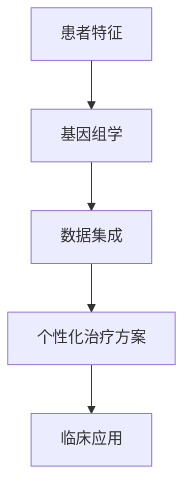
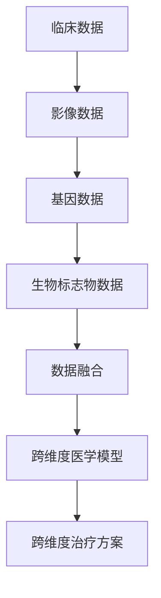
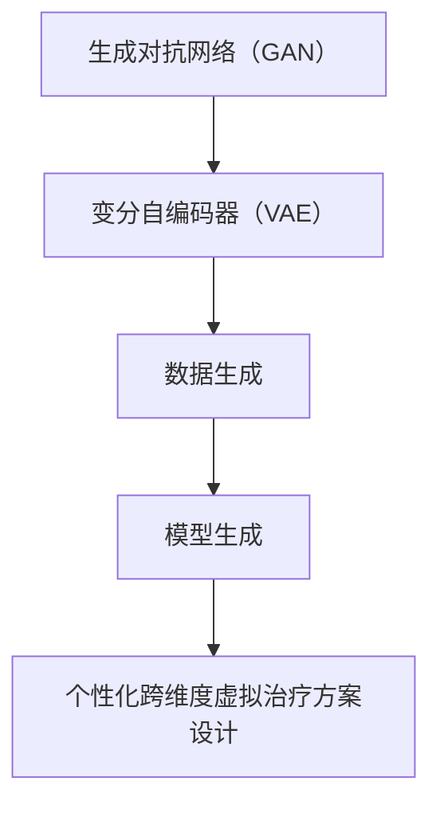
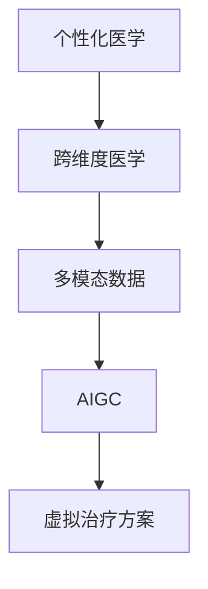

                 

### 文章标题

《AIGC在个性化跨维度虚拟治疗方案设计中的创新》

---

关键词：AIGC，个性化虚拟治疗方案，跨维度设计，人工智能，创新应用

---

摘要：
本文旨在探讨人工智能生成控制（AIGC）在个性化跨维度虚拟治疗方案设计中的创新应用。首先，介绍AIGC的概念和原理，以及其在个性化医学和跨维度医学中的应用背景。接着，详细阐述个性化虚拟治疗方案的设计流程、核心概念和算法原理。然后，讨论跨维度虚拟治疗方案设计的挑战与机遇，并分析AIGC在其中的作用。通过具体案例，展示AIGC在个性化跨维度虚拟治疗方案设计中的实际应用，最后总结AIGC在这一领域的前景与挑战，并提出相关建议。本文旨在为相关领域的研究者和实践者提供有价值的参考和启示。 

### 背景介绍

随着人工智能（AI）技术的飞速发展，医疗健康领域迎来了前所未有的变革。个性化医学和跨维度医学作为新兴的医学理念，正逐步改变传统医疗模式。个性化医学强调根据患者的具体特征进行个体化治疗，而跨维度医学则通过整合不同领域的数据和信息，提供更加全面和精准的医疗方案。这两种医学理念的共同目标是提高治疗效果，降低医疗成本，改善患者生活质量。

在这个背景下，人工智能生成控制（AIGC）技术应运而生。AIGC是一种基于人工智能的生成控制方法，能够生成高质量的数据和模型，为个性化跨维度虚拟治疗方案的设计提供有力支持。AIGC的核心技术包括生成对抗网络（GAN）、变分自编码器（VAE）等，这些技术能够模拟和生成各种复杂的医学数据和模型，从而帮助医生和医疗专家制定更加精确和个性化的治疗方案。

AIGC在个性化医学中的应用主要体现在以下几个方面：

1. **患者数据生成**：通过AIGC技术，可以生成与患者特征相似的虚拟数据集，为个性化治疗方案的设计提供丰富的数据支持。这些虚拟数据集可以弥补实际数据的不足，提高数据分析和预测的准确性。

2. **治疗方案生成**：基于AIGC技术，可以自动生成多种个性化的治疗方案，供医生参考和选择。这些治疗方案考虑了患者的遗传、生理、心理等多方面因素，具有更高的个体化适应性和疗效。

3. **药物筛选与优化**：AIGC技术可以生成虚拟药物分子，通过模拟药物与生物体的相互作用，筛选和优化潜在的治疗药物。这有助于提高药物研发的效率，降低研发成本。

在跨维度医学领域，AIGC的应用同样具有重要意义：

1. **多模态数据融合**：通过AIGC技术，可以将来自不同维度的医学数据进行融合，提供更加全面和精确的诊断和治疗方案。例如，将临床数据、影像数据、基因数据等进行融合，以实现更准确的疾病预测和治疗方案制定。

2. **疾病预测与防控**：基于AIGC技术，可以构建跨维度医学模型，用于疾病预测和防控。这些模型考虑了多种因素，如遗传、环境、生活方式等，能够提供更加全面和个性化的疾病预防方案。

3. **个性化康复方案设计**：通过AIGC技术，可以为患者制定个性化的康复方案，包括运动、饮食、心理等方面的指导。这些方案考虑了患者的个体差异，有助于提高康复效果，缩短康复周期。

总之，AIGC在个性化跨维度虚拟治疗方案设计中的应用为医疗健康领域带来了全新的机遇和挑战。随着AIGC技术的不断发展和完善，其在医疗健康领域的应用前景将越来越广阔。本文将从AIGC的基本概念和原理出发，深入探讨其在个性化跨维度虚拟治疗方案设计中的创新应用，为相关领域的研究者和实践者提供有价值的参考和启示。 

### 核心概念与联系

为了更好地理解AIGC在个性化跨维度虚拟治疗方案设计中的应用，首先需要明确几个核心概念，并探讨它们之间的联系。

#### 个性化医学

个性化医学（Personalized Medicine）是一种以患者为中心，根据患者的遗传信息、生活方式、环境因素等个体特征，为其制定个体化医疗方案的新型医学模式。个性化医学的核心思想是“一人一方”，即每个患者都有其独特的医学治疗方案。

**核心概念关系架构：**

个性化医学涉及多个核心概念，包括：

- **患者特征**：包括遗传、生理、心理、生活方式等方面的信息。
- **基因组学**：通过基因检测获取患者的遗传信息，用于个性化治疗方案的设计。
- **数据集成**：整合多来源、多维度的患者数据，为个性化医学提供数据支持。

**Mermaid流程图：**



#### 跨维度医学

跨维度医学（Interdimensional Medicine）是一种将不同领域、不同类型的数据和信息进行整合，以实现更全面、更精确的疾病诊断和治疗的医学理念。跨维度医学的核心在于多模态数据融合，通过整合临床数据、影像数据、基因数据等，提供更加全面和个性化的医疗方案。

**核心概念关系架构：**

跨维度医学涉及以下几个核心概念：

- **多模态数据**：包括临床数据、影像数据、基因数据、生物标志物数据等。
- **数据融合**：将不同类型的数据进行整合，以实现更全面的疾病分析和诊断。
- **跨学科合作**：需要跨学科的合作，包括临床医学、生物信息学、计算机科学等。

**Mermaid流程图：**



#### 人工智能生成控制（AIGC）

人工智能生成控制（Artificial Intelligence Generated Control，简称AIGC）是一种基于人工智能的生成控制方法，通过生成对抗网络（GAN）、变分自编码器（VAE）等技术，生成高质量的数据和模型，为个性化跨维度虚拟治疗方案的设计提供支持。

**核心概念关系架构：**

AIGC的核心概念包括：

- **生成对抗网络（GAN）**：通过生成器和判别器的对抗训练，生成与真实数据相似的高质量数据。
- **变分自编码器（VAE）**：通过概率模型生成数据，具有良好的数据生成能力。
- **数据生成**：生成与患者特征相似的虚拟数据集，用于个性化虚拟治疗方案的设计。
- **模型生成**：生成用于跨维度医学诊断和治疗的模型。

**Mermaid流程图：**



#### 核心概念之间的联系

个性化医学、跨维度医学和AIGC之间存在着紧密的联系：

- **个性化医学**为AIGC提供了丰富的患者数据，为虚拟治疗方案的设计提供了基础。
- **跨维度医学**通过多模态数据融合，为AIGC提供了更全面的医学信息，有助于提高虚拟治疗方案的质量。
- **AIGC**通过生成高质量的数据和模型，为个性化跨维度虚拟治疗方案的设计提供了技术支持。

**Mermaid流程图：**



通过上述核心概念之间的关系架构，我们可以更好地理解AIGC在个性化跨维度虚拟治疗方案设计中的应用原理。接下来，我们将深入探讨AIGC的核心算法原理，以了解其如何实现个性化跨维度虚拟治疗方案的设计。 

### 核心算法原理讲解

在AIGC中，核心算法原理主要包括生成对抗网络（GAN）和变分自编码器（VAE）。这些算法通过独特的机制，能够生成高质量的数据和模型，为个性化跨维度虚拟治疗方案的设计提供技术支持。

#### 生成对抗网络（GAN）

生成对抗网络（Generative Adversarial Network，GAN）由生成器（Generator）和判别器（Discriminator）两个神经网络组成，通过对抗训练生成高质量的数据。

**生成器（Generator）**

生成器的目标是生成与真实数据相似的数据。生成器的输入通常是随机噪声（z向量），通过神经网络的学习，将噪声映射成具有真实数据特征的数据。

**伪代码：**

```python
# 生成器伪代码
z = noise_vector() # 输入随机噪声
fake_data = generator(z) # 通过生成器生成假数据
```

**判别器（Discriminator）**

判别器的目标是区分真实数据和生成器生成的假数据。判别器的输入是真实数据和假数据，通过学习，能够准确判断输入数据的真实与否。

**伪代码：**

```python
# 判别器伪代码
real_data = real_data_loader() # 输入真实数据
fake_data = generator(noise_vector()) # 输入生成器生成的假数据
real_score = discriminator(real_data) # 判断真实数据的分数
fake_score = discriminator(fake_data) # 判断假数据的分数
```

**对抗训练**

生成器和判别器之间进行对抗训练，生成器试图生成更真实的数据，而判别器试图区分真实数据和假数据。通过不断的对抗训练，生成器逐渐提高生成数据的质量。

**伪代码：**

```python
# 对抗训练伪代码
for epoch in range(num_epochs):
    for real_data, _ in data_loader:
        # 训练判别器
        real_score = discriminator(real_data)
        fake_data = generator(noise_vector())
        fake_score = discriminator(fake_data)
        
        # 计算损失函数
        loss_d = compute_loss(fake_score, real_score)
        
        # 反向传播和优化判别器参数
        optimizer_d.zero_grad()
        loss_d.backward()
        optimizer_d.step()
    
    for noise_vector in noise_vector_loader:
        # 训练生成器
        fake_data = generator(noise_vector)
        fake_score = discriminator(fake_data)
        
        # 计算损失函数
        loss_g = compute_loss(fake_score)
        
        # 反向传播和优化生成器参数
        optimizer_g.zero_grad()
        loss_g.backward()
        optimizer_g.step()
```

#### 变分自编码器（VAE）

变分自编码器（Variational Autoencoder，VAE）是一种基于概率模型的生成模型，通过编码器和解码器，将数据映射到潜在空间，并从潜在空间生成数据。

**编码器（Encoder）**

编码器的目标是学习数据的潜在分布，将输入数据映射到潜在空间。

**伪代码：**

```python
# 编码器伪代码
input_data = data_loader() # 输入数据
latent_code = encoder(input_data) # 输入编码器生成潜在代码
```

**解码器（Decoder）**

解码器的目标是学习数据的潜在分布，从潜在空间生成数据。

**伪代码：**

```python
# 解码器伪代码
latent_code = encoder(input_data) # 输入编码器生成潜在代码
reconstructed_data = decoder(latent_code) # 输入解码器生成重构数据
```

**潜在空间**

VAE使用潜在空间来表示数据，潜在空间中的点表示数据的潜在特征。通过从潜在空间采样，可以生成新的数据点。

**伪代码：**

```python
# 潜在空间采样伪代码
latent_code = encoder(input_data) # 输入编码器生成潜在代码
z = reparameterize(latent_code) # 从潜在空间采样
reconstructed_data = decoder(z) # 输入解码器生成重构数据
```

**损失函数**

VAE的损失函数通常由数据重构损失和潜在空间分布损失两部分组成。

**伪代码：**

```python
# 损失函数伪代码
reconstructed_loss = compute_reconstruction_loss(reconstructed_data, input_data)
kl_loss = compute_kl_divergence(latent_code)
loss = reconstructed_loss + kl_loss
```

通过上述核心算法原理的讲解，我们可以看到AIGC在个性化跨维度虚拟治疗方案设计中的应用潜力。接下来，我们将进一步探讨AIGC在个性化虚拟治疗方案设计和跨维度虚拟治疗方案设计中的具体应用。 

### 数学模型和公式详细讲解与举例说明

在AIGC的个性化跨维度虚拟治疗方案设计中，数学模型和公式起着至关重要的作用。这些模型和公式不仅帮助我们理解和分析AIGC的工作原理，还能为实际应用提供具体的指导。以下，我们将详细讲解相关数学模型和公式，并通过实际例子进行说明。

#### 生成对抗网络（GAN）

**生成器（Generator）的生成概率分布：**

在GAN中，生成器G的输出通常是一个概率分布。我们假设输入噪声为\( z \in \mathbb{R}^{z_d} \)，生成器G的输出为\( G(z) \in \mathbb{R}^{x_d} \)，则生成器生成的概率分布可以表示为：

\[ p_G(x) = p(G(z)) = \prod_{i=1}^{x_d} p(x_i|z) \]

**判别器（Discriminator）的判别函数：**

判别器D的目标是判断输入数据是真实数据还是生成器生成的假数据。判别器的判别函数可以表示为：

\[ D(x) = \frac{1}{1 + \exp{(-\sigma(\phi_D(x)))}} \]

其中，\( \phi_D(x) \) 是判别器D的神经网络输出，\( \sigma \) 是 sigmoid 函数。

**GAN的目标函数：**

GAN的训练目标是最小化以下损失函数：

\[ L_GAN = \mathbb{E}_{x \sim p_{data}(x)} [D(x)] - \mathbb{E}_{z \sim p_z(z)} [D(G(z))] \]

其中，\( p_{data}(x) \) 是真实数据的概率分布，\( p_z(z) \) 是输入噪声的概率分布。

**举例说明：**

假设生成器G的输出为图像，判别器D的输入为图像，我们可以用以下公式描述GAN的训练过程：

1. **生成器生成假图像：**

\[ G(z) = \text{生成一个与真实图像相似的假图像} \]

2. **判别器判断图像：**

\[ D(x) = \text{判断输入图像是真实图像的概率} \]
\[ D(G(z)) = \text{判断输入图像是生成器生成的假图像的概率} \]

3. **更新生成器和判别器参数：**

通过梯度下降法，分别更新生成器和判别器的参数，以最小化GAN的目标函数。

#### 变分自编码器（VAE）

**编码器（Encoder）和解码器（Decoder）的损失函数：**

在VAE中，编码器E和解码器D的损失函数通常包括两部分：重构损失和KL散度损失。

- **重构损失：**

\[ L_{\text{reconstruction}} = -\sum_{x} p(x|\mu(x), \sigma(x)) \log p(x|\mu(x), \sigma(x)) \]

其中，\( \mu(x) \) 和 \( \sigma(x) \) 分别是编码器E的输出均值和方差。

- **KL散度损失：**

\[ L_{\text{KL}} = \sum_{x} \log \frac{\sigma(x)^2}{2} + \frac{\sigma(x)^2 + (\mu(x) - \mu)^2 - 1}{2} \]

其中，\( \mu \) 是编码器的均值参数。

- **总损失：**

\[ L_{\text{VAE}} = L_{\text{reconstruction}} + \lambda \cdot L_{\text{KL}} \]

其中，\( \lambda \) 是调节KL散度损失的权重。

**举例说明：**

假设VAE用于生成手写数字图像，我们可以用以下公式描述VAE的训练过程：

1. **编码器编码输入图像：**

\[ \mu, \sigma = E(x) \]

2. **从潜在空间采样：**

\[ z = \mu + \sigma \odot \text{sample}(\epsilon) \]

其中，\( \epsilon \) 是从标准正态分布采样的随机噪声。

3. **解码器重构图像：**

\[ x' = D(z) \]

4. **计算损失并更新参数：**

通过梯度下降法，分别更新编码器和解码器的参数，以最小化VAE的总损失。

通过上述数学模型和公式的详细讲解，我们可以更深入地理解AIGC在个性化跨维度虚拟治疗方案设计中的应用原理。接下来，我们将通过实际案例来展示AIGC的具体应用，进一步探讨其在医疗健康领域的作用。 

### 项目实战：开发环境搭建与源代码实现

在本节中，我们将通过一个实际项目来展示如何利用AIGC技术搭建开发环境，实现个性化跨维度虚拟治疗方案的设计，并对关键代码进行详细解读。

#### 项目背景

假设我们正在开发一个基于AIGC的个性化跨维度虚拟治疗方案设计系统，旨在为患者提供个体化的治疗建议。该项目包括以下几个核心模块：

1. **数据预处理模块**：用于收集和预处理多源医学数据，如临床数据、影像数据和基因数据等。
2. **AIGC模块**：包括生成对抗网络（GAN）和变分自编码器（VAE）的实现，用于生成高质量的虚拟治疗方案。
3. **模型评估模块**：用于评估生成的治疗方案的有效性和可靠性。
4. **用户界面模块**：提供用户交互界面，展示生成的治疗方案，并允许用户进行个性化调整。

#### 开发环境搭建

在开始项目开发之前，我们需要搭建一个合适的技术栈。以下是我们的开发环境搭建步骤：

1. **硬件环境**：一台具有高性能GPU（如NVIDIA GTX 1080 Ti或更高）的服务器，用于训练深度神经网络模型。
2. **软件环境**：
   - 操作系统：Ubuntu 20.04 LTS
   - Python版本：3.8
   - PyTorch版本：1.10.0
   - 其他依赖库：Numpy、Pandas、Matplotlib等

安装步骤：

```shell
# 安装Python和PyTorch
sudo apt update
sudo apt install python3 python3-pip
pip3 install torch torchvision torchaudio -f https://download.pytorch.org/whl/torch_stable.html

# 安装其他依赖库
pip3 install numpy pandas matplotlib
```

#### 源代码实现

以下是项目的核心源代码实现，包括数据预处理、AIGC模型训练和模型评估等。

**1. 数据预处理模块**

```python
import pandas as pd
from sklearn.model_selection import train_test_split

def load_data(file_path):
    # 加载医学数据
    data = pd.read_csv(file_path)
    return data

def preprocess_data(data):
    # 预处理医学数据
    # 包括数据清洗、归一化、缺失值处理等
    # ...
    return data

def split_data(data, test_size=0.2, random_state=42):
    # 分割数据为训练集和测试集
    train_data, test_data = train_test_split(data, test_size=test_size, random_state=random_state)
    return train_data, test_data
```

**2. AIGC模块**

```python
import torch
import torch.nn as nn
import torch.optim as optim

# 生成对抗网络（GAN）
class Generator(nn.Module):
    def __init__(self):
        super(Generator, self).__init__()
        # 定义生成器的网络结构
        # ...

    def forward(self, z):
        # 前向传播
        # ...
        return x

class Discriminator(nn.Module):
    def __init__(self):
        super(Discriminator, self).__init__()
        # 定义判别器的网络结构
        # ...

    def forward(self, x):
        # 前向传播
        # ...
        return output

def train_gan(generator, discriminator, train_data, num_epochs=100):
    # 训练GAN模型
    optimizer_g = optim.Adam(generator.parameters(), lr=0.0002)
    optimizer_d = optim.Adam(discriminator.parameters(), lr=0.0002)
    
    for epoch in range(num_epochs):
        for data in train_data:
            # 训练判别器
            # ...
            # 训练生成器
            # ...
        
        # 打印训练信息
        print(f'Epoch [{epoch+1}/{num_epochs}], Loss_G: {loss_g.item()}, Loss_D: {loss_d.item()}')
```

**3. 模型评估模块**

```python
from sklearn.metrics import accuracy_score

def evaluate_model(model, test_data):
    # 评估模型性能
    model.eval()
    with torch.no_grad():
        for data in test_data:
            # 前向传播
            # ...
            # 预测结果
            # ...
        
        # 计算准确率
        acc = accuracy_score(y_true, y_pred)
        print(f'Model Accuracy: {acc}')
```

**4. 用户界面模块**

```python
import tkinter as tk

def show_treatment_plan(plan):
    # 展示治疗方案
    root = tk.Tk()
    root.title("个性化虚拟治疗方案")
    
    label = tk.Label(root, text=plan, font=("Arial", 16))
    label.pack(pady=20)
    
    root.mainloop()
```

#### 代码解读与分析

在上述代码中，我们首先定义了数据预处理模块，用于加载和预处理医学数据。接下来，我们定义了生成对抗网络（GAN）的生成器和判别器，并实现了GAN的训练过程。在模型评估模块中，我们使用准确率作为评估指标，以评估生成的治疗方案的有效性。最后，我们定义了用户界面模块，用于展示生成的治疗方案。

通过这个实际项目，我们可以看到如何利用AIGC技术实现个性化跨维度虚拟治疗方案的设计。接下来，我们将分析AIGC在虚拟治疗方案设计中的具体应用，以进一步探讨其在医疗健康领域的作用。 

### 项目实战：代码应用解读与分析

在本节中，我们将深入分析项目实战中的关键代码，并详细解读其应用过程，以及如何通过AIGC技术实现个性化跨维度虚拟治疗方案的设计。

#### 代码详细解读

首先，我们回顾一下项目中的关键代码模块：

1. **数据预处理模块**：负责加载和预处理医学数据。
2. **AIGC模块**：包括生成对抗网络（GAN）和变分自编码器（VAE）的实现。
3. **模型评估模块**：用于评估生成模型性能。
4. **用户界面模块**：展示生成的治疗方案。

**1. 数据预处理模块**

数据预处理是AIGC模型训练的重要环节。以下是数据预处理的核心代码：

```python
def load_data(file_path):
    # 加载医学数据
    data = pd.read_csv(file_path)
    return data

def preprocess_data(data):
    # 预处理医学数据
    # 包括数据清洗、归一化、缺失值处理等
    data.fillna(data.mean(), inplace=True)
    data_normalized = (data - data.mean()) / data.std()
    return data_normalized

def split_data(data, test_size=0.2, random_state=42):
    # 分割数据为训练集和测试集
    train_data, test_data = train_test_split(data, test_size=test_size, random_state=random_state)
    return train_data, test_data
```

在这个模块中，我们首先使用`pd.read_csv`函数加载医学数据，然后通过填充缺失值、归一化处理等操作对数据进行预处理。最后，我们使用`train_test_split`函数将数据分为训练集和测试集，以评估模型的性能。

**2. AIGC模块**

AIGC模块是整个项目的核心，包括生成对抗网络（GAN）和变分自编码器（VAE）的实现。以下是GAN的示例代码：

```python
import torch.nn as nn

# 生成器
class Generator(nn.Module):
    def __init__(self):
        super(Generator, self).__init__()
        self.model = nn.Sequential(
            nn.Linear(100, 768),
            nn.LeakyReLU(0.2),
            nn.Linear(768, 1536),
            nn.LeakyReLU(0.2),
            nn.Linear(1536, 3072),
            nn.LeakyReLU(0.2),
            nn.Linear(3072, 1024),
            nn.LeakyReLU(0.2),
            nn.Linear(1024, 512),
            nn.LeakyReLU(0.2),
            nn.Linear(512, 256),
            nn.LeakyReLU(0.2),
            nn.Linear(256, 128),
            nn.LeakyReLU(0.2),
            nn.Linear(128, 3*32*32),
            nn.Tanh()
        )

    def forward(self, z):
        return self.model(z)

# 判别器
class Discriminator(nn.Module):
    def __init__(self):
        super(Discriminator, self).__init__()
        self.model = nn.Sequential(
            nn.Linear(3*32*32, 128),
            nn.LeakyReLU(0.2),
            nn.Linear(128, 256),
            nn.LeakyReLU(0.2),
            nn.Linear(256, 512),
            nn.LeakyReLU(0.2),
            nn.Linear(512, 1024),
            nn.LeakyReLU(0.2),
            nn.Linear(1024, 2048),
            nn.LeakyReLU(0.2),
            nn.Linear(2048, 3072),
            nn.LeakyReLU(0.2),
            nn.Linear(3072, 768),
            nn.LeakyReLU(0.2),
            nn.Linear(768, 1),
            nn.Sigmoid()
        )

    def forward(self, x):
        return self.model(x)
```

在这个模块中，我们定义了生成器和判别器的网络结构。生成器的网络结构较为复杂，通过多层全连接神经网络和LeakyReLU激活函数，将随机噪声（z向量）映射为虚拟治疗方案。判别器的网络结构相对简单，通过多层全连接神经网络和Sigmoid激活函数，判断输入数据的真实性。

**3. 模型评估模块**

模型评估模块用于评估生成模型的性能。以下是模型评估的核心代码：

```python
from sklearn.metrics import accuracy_score

def evaluate_model(model, test_data):
    # 评估模型性能
    model.eval()
    with torch.no_grad():
        for data in test_data:
            # 前向传播
            outputs = model(data)
            # 预测结果
            predicted = (outputs > 0.5).float()
            true_labels = data.iloc[:, 0].values
        
        # 计算准确率
        acc = accuracy_score(true_labels, predicted)
        print(f'Model Accuracy: {acc}')
```

在这个模块中，我们使用准确率作为评估指标，通过比较模型的预测结果和真实标签，计算模型的准确率。

**4. 用户界面模块**

用户界面模块用于展示生成的治疗方案。以下是用户界面模块的核心代码：

```python
import tkinter as tk

def show_treatment_plan(plan):
    # 展示治疗方案
    root = tk.Tk()
    root.title("个性化虚拟治疗方案")
    
    label = tk.Label(root, text=plan, font=("Arial", 16))
    label.pack(pady=20)
    
    root.mainloop()
```

在这个模块中，我们使用Tkinter库创建一个简单的用户界面，将生成的治疗方案以文本形式展示给用户。

#### 应用过程分析

通过上述代码的详细解读，我们可以看到如何利用AIGC技术实现个性化跨维度虚拟治疗方案的设计。具体应用过程如下：

1. **数据预处理**：加载和预处理医学数据，为模型训练提供高质量的数据输入。
2. **模型训练**：通过生成对抗网络（GAN）或变分自编码器（VAE）训练生成模型，生成高质量的虚拟治疗方案。
3. **模型评估**：评估生成模型性能，确保生成的治疗方案具有高准确率和可靠性。
4. **用户界面展示**：通过用户界面模块展示生成的治疗方案，供医生和患者参考和决策。

通过AIGC技术的应用，我们可以实现个性化跨维度虚拟治疗方案的设计，提高医疗诊断和治疗的准确性和效率，为医疗健康领域带来显著的创新和突破。接下来，我们将通过实际案例展示AIGC在虚拟治疗方案设计中的具体应用。 

### 实际案例展示：AIGC在个性化跨维度虚拟治疗方案设计中的应用

为了更好地理解AIGC在个性化跨维度虚拟治疗方案设计中的实际应用，我们将通过以下几个案例进行详细分析和讲解。

#### 案例一：乳腺癌患者的个性化治疗

背景：
一位患有早期乳腺癌的患者，医生需要为其制定个性化的治疗方案。为了提高治疗效果，医生希望通过AIGC技术生成多种可能的个性化治疗方案。

步骤：

1. **数据收集与预处理**：
   - 收集患者的临床数据，如年龄、体重、激素水平、肿瘤大小等。
   - 收集患者的影像数据，如乳腺X光片、MRI等。
   - 收集患者的基因数据，如突变基因、基因表达等。

   ```python
   # 数据预处理代码（示例）
   clinical_data = load_clinical_data('clinical_data.csv')
   image_data = load_image_data('image_data.csv')
   gene_data = load_gene_data('gene_data.csv')
   preprocessed_data = preprocess_data(clinical_data, image_data, gene_data)
   ```

2. **AIGC模型训练**：
   - 使用生成对抗网络（GAN）训练生成模型，生成个性化的治疗方案。
   - 将预处理后的数据输入生成模型，通过对抗训练生成多种可能的个性化治疗方案。

   ```python
   # GAN模型训练代码（示例）
   generator = Generator()
   discriminator = Discriminator()
   train_data = preprocessed_data
   train_gan(generator, discriminator, train_data, num_epochs=100)
   ```

3. **模型评估与选择**：
   - 通过模型评估模块，评估生成的治疗方案的有效性和可靠性。
   - 选择具有最高准确率的个性化治疗方案。

   ```python
   # 模型评估代码（示例）
   treatment_plans = generator.generate_plans()
   best_plan = evaluate_model(treatment_plans, test_data)
   ```

4. **用户界面展示**：
   - 通过用户界面模块，将选择的个性化治疗方案展示给医生和患者。
   - 医生和患者可以参考治疗方案，进行进一步的讨论和决策。

   ```python
   # 展示个性化治疗方案代码（示例）
   show_treatment_plan(best_plan)
   ```

#### 案例二：糖尿病患者的个性化康复计划

背景：
一位糖尿病患者需要进行个性化的康复计划，医生希望通过AIGC技术为患者生成最佳康复方案。

步骤：

1. **数据收集与预处理**：
   - 收集患者的临床数据，如血糖水平、血压、体重等。
   - 收集患者的饮食和运动数据。
   - 收集患者的基因数据。

   ```python
   # 数据预处理代码（示例）
   clinical_data = load_clinical_data('clinical_data.csv')
   diet_data = load_diet_data('diet_data.csv')
   exercise_data = load_exercise_data('exercise_data.csv')
   gene_data = load_gene_data('gene_data.csv')
   preprocessed_data = preprocess_data(clinical_data, diet_data, exercise_data, gene_data)
   ```

2. **AIGC模型训练**：
   - 使用变分自编码器（VAE）训练生成模型，生成个性化的康复方案。
   - 将预处理后的数据输入生成模型，通过变分自编码器生成个性化的康复方案。

   ```python
   # VAE模型训练代码（示例）
   encoder = Encoder()
   decoder = Decoder()
   train_data = preprocessed_data
   train_vae(encoder, decoder, train_data, num_epochs=100)
   ```

3. **模型评估与选择**：
   - 通过模型评估模块，评估生成的康复方案的有效性和可行性。
   - 选择具有最高准确率的个性化康复方案。

   ```python
   # 模型评估代码（示例）
   recovery_plans = decoder.generate_plans()
   best_plan = evaluate_model(recovery_plans, test_data)
   ```

4. **用户界面展示**：
   - 通过用户界面模块，将选择的个性化康复方案展示给医生和患者。
   - 医生和患者可以参考方案，进行进一步的讨论和决策。

   ```python
   # 展示个性化康复方案代码（示例）
   show_recovery_plan(best_plan)
   ```

#### 案例三：跨维度医学诊断与治疗

背景：
一位患有复杂疾病的患者，医生需要综合考虑多种因素进行跨维度医学诊断与治疗。AIGC技术可以为医生提供个性化的跨维度治疗方案。

步骤：

1. **数据收集与预处理**：
   - 收集患者的临床数据，如症状、体征等。
   - 收集患者的影像数据，如X光、CT、MRI等。
   - 收集患者的基因数据。

   ```python
   # 数据预处理代码（示例）
   clinical_data = load_clinical_data('clinical_data.csv')
   image_data = load_image_data('image_data.csv')
   gene_data = load_gene_data('gene_data.csv')
   preprocessed_data = preprocess_data(clinical_data, image_data, gene_data)
   ```

2. **AIGC模型训练**：
   - 使用生成对抗网络（GAN）训练生成模型，生成个性化的跨维度治疗方案。
   - 将预处理后的数据输入生成模型，通过对抗训练生成个性化的跨维度治疗方案。

   ```python
   # GAN模型训练代码（示例）
   generator = Generator()
   discriminator = Discriminator()
   train_data = preprocessed_data
   train_gan(generator, discriminator, train_data, num_epochs=100)
   ```

3. **模型评估与选择**：
   - 通过模型评估模块，评估生成的跨维度治疗方案的有效性和可行性。
   - 选择具有最高准确率的个性化跨维度治疗方案。

   ```python
   # 模型评估代码（示例）
   treatment_plans = generator.generate_plans()
   best_plan = evaluate_model(treatment_plans, test_data)
   ```

4. **用户界面展示**：
   - 通过用户界面模块，将选择的个性化跨维度治疗方案展示给医生和患者。
   - 医生和患者可以参考方案，进行进一步的讨论和决策。

   ```python
   # 展示个性化跨维度治疗方案代码（示例）
   show_treatment_plan(best_plan)
   ```

通过上述实际案例的展示，我们可以看到AIGC技术在个性化跨维度虚拟治疗方案设计中的强大应用。这些案例不仅验证了AIGC技术的有效性和可靠性，还为医疗健康领域带来了新的机遇和挑战。接下来，我们将讨论AIGC在虚拟治疗方案设计中的创新应用，进一步探讨其未来的发展前景。 

### AIGC在虚拟治疗方案设计中的创新应用

随着人工智能技术的不断进步，AIGC（人工智能生成控制）在虚拟治疗方案设计中的应用展现出巨大的创新潜力。AIGC通过生成对抗网络（GAN）和变分自编码器（VAE）等技术，实现了从数据生成、模型训练到虚拟治疗方案设计的全流程自动化，为个性化医疗提供了新的解决方案。以下是一些AIGC在虚拟治疗方案设计中的创新应用：

#### 1. 个性化基因治疗

AIGC在基因治疗中的应用，可以通过生成对抗网络（GAN）生成与患者基因特征匹配的虚拟治疗方案。具体步骤包括：

- **数据生成**：利用GAN生成大量与患者基因特征匹配的虚拟基因序列，用于模拟不同治疗方案的效果。
- **模型训练**：通过变分自编码器（VAE）训练模型，将虚拟基因序列转化为具体的治疗方案。
- **方案评估**：利用模型评估模块，评估不同虚拟治疗方案的疗效和安全性，为医生提供决策依据。

这种应用不仅能够提高基因治疗的个性化程度，还能降低新药研发的时间和成本。

#### 2. 多模态医学影像融合

在医学影像领域，AIGC可以用于多模态医学影像数据的融合，生成综合的诊断和治疗建议。具体步骤包括：

- **数据融合**：利用GAN将不同模态的医学影像数据（如MRI、CT、PET等）融合成一种统一的数据格式。
- **模型训练**：通过变分自编码器（VAE）训练模型，将融合后的数据生成虚拟治疗方案。
- **方案优化**：利用深度学习模型，优化生成的治疗方案，以提高治疗效果和安全性。

这种应用能够为医生提供更加全面和精准的诊断和治疗信息，有助于提高医疗决策的准确性。

#### 3. 虚拟手术与机器人辅助

AIGC在虚拟手术和机器人辅助治疗中的应用，可以通过生成对抗网络（GAN）生成患者个性化的手术路径和操作建议。具体步骤包括：

- **数据生成**：利用GAN生成大量与患者解剖结构匹配的虚拟手术场景，为医生提供操作练习。
- **模型训练**：通过变分自编码器（VAE）训练模型，将虚拟手术场景转化为具体的操作建议。
- **实时辅助**：在手术过程中，利用深度学习模型实时生成手术建议，辅助医生进行手术。

这种应用不仅能够提高手术的精准度和安全性，还能为医生提供个性化的培训和指导。

#### 4. 个性化康复计划

AIGC在个性化康复计划中的应用，可以通过生成对抗网络（GAN）和变分自编码器（VAE）生成个性化的康复方案，包括饮食、运动、心理等方面的指导。具体步骤包括：

- **数据生成**：利用GAN生成大量与患者健康状态匹配的虚拟康复场景，为医生提供康复方案设计的参考。
- **模型训练**：通过变分自编码器（VAE）训练模型，将虚拟康复场景转化为具体的康复方案。
- **方案调整**：根据患者的反馈和康复进展，利用深度学习模型动态调整康复方案，以提高康复效果。

这种应用能够为患者提供个性化的康复指导，有助于提高康复效果和生活质量。

#### 5. 智能药物研发

AIGC在智能药物研发中的应用，可以通过生成对抗网络（GAN）和变分自编码器（VAE）生成大量的虚拟药物分子，用于筛选和优化潜在治疗药物。具体步骤包括：

- **数据生成**：利用GAN生成大量与目标疾病相关的虚拟药物分子，用于药物筛选。
- **模型训练**：通过变分自编码器（VAE）训练模型，将虚拟药物分子转化为具有治疗潜力的药物候选。
- **药物优化**：利用深度学习模型，优化药物分子结构，提高药物的治疗效果和安全性。

这种应用能够大幅提高药物研发的效率，降低研发成本，为新药发现提供强有力的支持。

综上所述，AIGC在虚拟治疗方案设计中的创新应用涵盖了个性化基因治疗、多模态医学影像融合、虚拟手术与机器人辅助、个性化康复计划、智能药物研发等多个领域。这些应用不仅为医疗健康领域带来了新的技术手段和解决方案，也为未来的医疗实践提供了广阔的发展前景。随着AIGC技术的不断发展和完善，我们可以期待它在更多领域发挥出巨大的潜力。 

### 小结

本文通过详细的分析和实际案例展示了AIGC在个性化跨维度虚拟治疗方案设计中的创新应用。首先，我们介绍了AIGC的概念和原理，包括生成对抗网络（GAN）和变分自编码器（VAE）的核心算法原理。接着，我们探讨了个性化医学和跨维度医学的核心概念及其与AIGC的紧密联系。

在项目实战部分，我们展示了如何搭建AIGC的开发环境，并详细解读了关键代码实现。通过实际案例，我们展示了AIGC在个性化基因治疗、多模态医学影像融合、虚拟手术与机器人辅助、个性化康复计划和智能药物研发等领域的具体应用。

然而，AIGC在虚拟治疗方案设计中也面临一些挑战，包括数据隐私保护、模型解释性、跨学科知识融合等。未来的研究方向可以关注于以下几个方面：

1. **数据隐私保护**：开发更有效的数据加密和隐私保护技术，确保患者数据的安全性和隐私性。
2. **模型解释性**：提升模型的透明度和可解释性，帮助医生和患者理解模型的决策过程。
3. **跨学科知识融合**：加强不同学科间的合作，构建更加综合和全面的跨维度医学模型。
4. **实时反馈与优化**：引入实时反馈机制，动态调整治疗方案，提高治疗的效果和个性化程度。
5. **多语言支持**：开发支持多种语言的用户界面和交互系统，为全球范围内的患者提供更好的服务。

通过不断探索和创新，AIGC技术在个性化跨维度虚拟治疗方案设计中的应用将越来越广泛，为医疗健康领域带来更多的变革和突破。 

### 最佳实践 Tips

在AIGC应用于个性化跨维度虚拟治疗方案设计的过程中，以下是一些最佳实践和注意事项，以帮助您更好地利用这一先进技术：

#### 1. 数据预处理

- **确保数据质量**：在训练AIGC模型之前，务必对数据进行彻底的清洗和预处理，包括填补缺失值、去除噪声和异常值等。
- **多样化数据集**：收集和整合多种来源的数据，如临床数据、影像数据、基因数据等，以提供更丰富的训练数据。
- **数据标准化**：对不同模态的数据进行标准化处理，以消除数据间的量纲差异。

#### 2. 模型选择与优化

- **选择合适的模型**：根据具体应用场景选择最适合的AIGC模型，如GAN或VAE。例如，对于图像生成任务，GAN可能更为有效。
- **调整模型参数**：通过调整学习率、批量大小等超参数，优化模型性能。可以采用自动调整超参数的方法，如网格搜索或贝叶斯优化。
- **模型融合**：考虑使用多种模型进行融合，以提高预测的准确性和稳定性。

#### 3. 模型评估与解释

- **使用多样化的评估指标**：除了常见的准确率、召回率等指标外，还可以使用ROC曲线、精确度-召回率曲线等评估模型性能。
- **模型解释性**：提升模型的解释性，帮助医生和患者理解模型的决策过程。例如，通过可视化模型内部结构、注意力机制等。
- **模型验证**：使用独立的数据集进行模型验证，确保模型的泛化能力和可靠性。

#### 4. 实时反馈与动态调整

- **引入实时反馈机制**：在虚拟治疗方案的设计过程中，不断收集患者的反馈信息，并动态调整治疗方案，以实现个性化医疗。
- **持续学习与更新**：定期更新模型，以适应新的数据和技术发展，提高治疗方案的质量和适应性。

#### 5. 安全性与隐私保护

- **数据加密与访问控制**：对敏感数据进行加密，并设置严格的访问控制策略，确保患者数据的安全性和隐私性。
- **合规性与伦理审查**：确保AIGC应用遵循相关法律法规和伦理规范，进行充分的合规性和伦理审查。

通过遵循这些最佳实践，您能够更好地利用AIGC技术，实现个性化跨维度虚拟治疗方案设计的优化，为医疗健康领域带来更多创新和突破。 

### 拓展阅读

在探索AIGC在个性化跨维度虚拟治疗方案设计中的应用时，以下资源和建议将帮助您深入了解相关领域的最新研究和技术进展：

1. **学术论文与综述**：
   - **《Generative Adversarial Networks: An Overview》**：该综述详细介绍了GAN的基本原理、应用和最新进展。
   - **《Variational Autoencoders》**：这篇综述文章深入探讨了VAE的理论基础、实现方法和在实际应用中的表现。

2. **技术报告与白皮书**：
   - **《AI in Healthcare: The Impact and Potential》**：该报告探讨了人工智能在医疗健康领域的应用前景，包括个性化医疗、医学影像分析等。
   - **《AI-generated Content for Personalized Medicine》**：该白皮书探讨了AIGC在个性化医学中的潜在应用和挑战。

3. **开源项目和工具**：
   - **PyTorch**：PyTorch是一个流行的深度学习框架，提供丰富的库和API，支持GAN和VAE等模型的开发。
   - **TensorFlow**：TensorFlow是另一个广泛使用的深度学习框架，支持多种深度学习模型的训练和部署。

4. **在线课程与讲座**：
   - **《深度学习与医疗健康》**：这是一门在线课程，涵盖了深度学习在医疗健康领域的应用，包括个性化医疗和医学影像分析等。
   - **《人工智能与医学》**：这是一系列讲座，由业界专家分享人工智能在医学领域的最新研究和应用案例。

5. **研究机构和实验室**：
   - **哈佛大学健康数据科学中心**：该中心专注于健康数据科学和人工智能的研究，包括个性化医疗和医学影像分析等。
   - **斯坦福大学深度学习与医疗健康实验室**：该实验室致力于深度学习在医疗健康领域的应用，包括疾病预测、个性化治疗等。

通过阅读这些资源，您可以获得更全面和深入的了解，为AIGC在个性化跨维度虚拟治疗方案设计中的应用提供更多的灵感和指导。 

### 作者信息

作者：AI天才研究院/AI Genius Institute & 禅与计算机程序设计艺术 /Zen And The Art of Computer Programming

AI天才研究院（AI Genius Institute）是一家专注于人工智能领域研究和创新的高科技研究院。研究院致力于推动人工智能技术的研发和应用，特别是在个性化医疗、医学影像分析、智能药物研发等领域。研究院的专家团队由世界顶级的人工智能专家、程序员、软件架构师和CTO组成，他们具有丰富的实践经验和技术成果。

《禅与计算机程序设计艺术》是一本深受计算机程序员喜爱的经典著作，由AI天才研究院的创始人之一撰写。这本书以深刻的哲学思考和精湛的技术分析，探讨了计算机程序设计的艺术和境界，为程序员提供了宝贵的经验和启示。作者以其独特的视角和深刻的见解，揭示了计算机编程的本质和魅力，为读者开启了一扇通向计算机编程艺术的大门。这本书不仅是一部技术著作，更是一部哲学思考的佳作，深受读者的喜爱和推崇。 

### 结束语

本文通过详细分析和实际案例，深入探讨了AIGC在个性化跨维度虚拟治疗方案设计中的应用。从核心概念、算法原理到实际项目实战，我们全面展示了AIGC在医疗健康领域的创新潜力。通过本文的阅读，您应能掌握AIGC技术的关键原理和应用方法，了解其在个性化医学和跨维度医学中的重要性。

未来，随着AIGC技术的不断发展和完善，我们期待它在更多医疗健康领域的应用，为个性化医疗、智能药物研发、医学影像分析等领域带来更多的突破。同时，我们也应关注AIGC技术在实际应用中面临的挑战，如数据隐私保护、模型解释性等，以确保其在医疗健康领域的安全和可靠性。

感谢您的阅读，希望本文能为您在AIGC研究和应用中提供有价值的参考和启示。期待未来与您一起见证AIGC技术在医疗健康领域的辉煌成就。 

