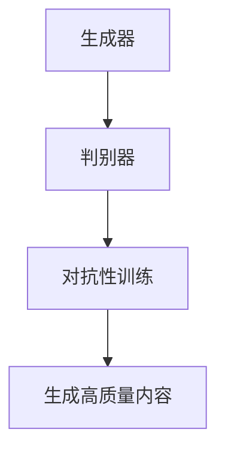

                 

### 文章标题：AIGC在个性化跨维度认知增强中的创新

#### 关键词：AIGC，个性化认知增强，跨维度认知，生成式AI，深度学习，伦理问题

#### 摘要：
本文探讨了AIGC（AI-Generated Content）在个性化跨维度认知增强中的创新应用。通过介绍AIGC的定义、核心技术和应用场景，文章深入分析了个性化认知增强和跨维度认知增强的基本概念及其重要性。随后，文章详细阐述了AIGC在个性化跨维度认知增强中的创新技术与方法，并通过实例展示了其在教育、医疗和营销等领域的应用。最后，文章探讨了AIGC的安全性和伦理问题，并提出了未来的展望。

## 引言

在当今信息爆炸的时代，人类对于信息处理和认知的需求日益增长。传统的认知增强方法往往依赖于个体自身的经验和知识，而随着人工智能技术的发展，新的认知增强手段逐渐涌现。AIGC（AI-Generated Content）作为一种生成式人工智能技术，正在为个性化跨维度认知增强带来革命性的变化。本文旨在探讨AIGC在个性化跨维度认知增强中的创新应用，分析其核心技术和应用场景，以及面临的伦理和安全问题。

### AIGC的定义与背景

AIGC，即AI-Generated Content，指的是通过人工智能技术自动生成的内容，包括文本、图像、音频等多种形式。AIGC的核心技术包括自然语言处理（NLP）、计算机视觉（CV）、生成对抗网络（GAN）等。AIGC的发展可以追溯到生成式人工智能（Generative AI）的兴起，生成式人工智能旨在通过学习大量数据，生成与输入数据相似的新数据。AIGC正是这种技术的一种应用，其应用范围广泛，涵盖了教育、医疗、娱乐、营销等多个领域。

在个性化认知增强方面，AIGC的应用具有独特的优势。传统的认知增强方法往往需要大量的人力和时间，而AIGC可以通过自动化生成个性化内容，大大提高认知增强的效率。同时，AIGC能够根据个体的认知特点和需求，生成定制化的内容，从而实现更精准的认知增强。

### 个性化认知增强的基本概念

个性化认知增强是指通过利用个体特定的认知特点、兴趣和需求，有针对性地提高个体的认知能力。个性化认知增强的核心在于对个体认知特征的识别和利用。在传统的认知增强方法中，个体往往需要参与大量的测试和评估，以确定其认知特征。而AIGC的应用，使得这种识别过程变得更为高效和准确。

个性化认知增强的维度包括认知能力、认知风格、认知需求等。认知能力是指个体在记忆、理解、推理等方面的能力，不同的认知能力对认知增强的需求也不同。认知风格是指个体在信息处理和学习过程中所采用的策略和方式，如视觉型、听觉型、动觉型等。认知需求则是指个体在特定情境下对认知增强的需求，如学习新知识、提高工作效率等。

个性化认知增强的重要性在于，它能够根据个体的实际情况，提供针对性的认知训练，从而提高认知效果。与传统的一刀切式的认知训练方法相比，个性化认知增强能够更好地满足个体的需求，提高认知效率。

### 跨维度认知增强的方法

跨维度认知增强是指在不同认知维度之间建立联系，通过综合多种认知能力，提高个体的认知水平。跨维度认知增强的方法包括基于深度学习的跨维度认知增强、基于增强学习的跨维度认知增强和基于迁移学习的跨维度认知增强。

基于深度学习的跨维度认知增强利用深度学习模型，通过多层的神经网络，将不同维度的认知信息进行融合和增强。例如，在图像识别任务中，可以通过将视觉信息与文本信息进行融合，提高图像识别的准确率。

基于增强学习的跨维度认知增强通过个体在特定情境下的反馈，不断调整认知模型，使其适应新的认知需求。例如，在个性化学习过程中，学生可以通过对学习内容的反馈，调整学习策略，从而提高学习效果。

基于迁移学习的跨维度认知增强通过将一个领域中的知识迁移到另一个领域，实现跨维度的认知增强。例如，在医学领域，可以将病理图像识别的知识迁移到放射影像诊断中，提高诊断准确率。

### AIGC在个性化跨维度认知增强中的创新

AIGC在个性化跨维度认知增强中的创新主要体现在以下几个方面：

1. **新的生成模型**：AIGC利用生成对抗网络（GAN）、变分自编码器（VAE）等新的生成模型，可以生成高质量、个性化的认知增强内容。这些模型通过学习大量数据，能够生成与真实数据高度相似的新数据，从而提高认知增强的准确性。

2. **新的交互方法**：AIGC可以通过自然语言处理技术，实现与个体的智能对话，根据个体的反馈动态调整认知增强的内容和方式。这种交互方法不仅能够提高认知增强的个性化程度，还能够提高个体的参与度和积极性。

3. **新的应用场景**：AIGC的应用场景不断拓展，从传统的教育、医疗领域，延伸到营销、娱乐等多个领域。在不同的应用场景中，AIGC可以针对个体的具体需求，提供定制化的认知增强服务。

### AIGC在个性化跨维度认知增强中的应用场景

AIGC在个性化跨维度认知增强中的应用场景广泛，主要包括教育、医疗、营销等领域。

在教育领域，AIGC可以生成个性化的学习材料，根据学生的认知特点和需求，提供针对性的学习资源。例如，通过分析学生的学习数据，AIGC可以生成适合学生阅读水平的文章、视频等学习材料，从而提高学习效果。

在医疗领域，AIGC可以生成个性化的诊断报告和治疗方案。通过分析大量的医学数据，AIGC可以生成针对患者的个性化诊断结果和治疗建议，从而提高医疗服务的质量和效率。

在营销领域，AIGC可以生成个性化的广告和推荐内容。通过分析用户的消费行为和兴趣爱好，AIGC可以生成与用户兴趣相关的广告和推荐内容，从而提高广告的投放效果和用户的参与度。

### AIGC的核心算法原理讲解

AIGC的核心算法包括生成对抗网络（GAN）、变分自编码器（VAE）等。以下是对这些算法的原理讲解和使用伪代码的详细阐述。

#### 生成对抗网络（GAN）

生成对抗网络（GAN）是由生成器（Generator）和判别器（Discriminator）两个部分组成的。生成器通过学习大量真实数据，生成与真实数据相似的新数据；判别器则通过学习真实数据和生成数据，判断数据的真实性。通过两个网络的对抗训练，生成器可以不断提高生成数据的质量。

**伪代码：**

```
// 生成器
function G(z):
    x = samples(z, latent_dim)
    return x

// 判别器
function D(x):
    return probability(x is real)

// 训练过程
for epoch in 1 to epochs:
    for batch in 1 to batch_size:
        z = samples(random noise, latent_dim)
        x_fake = G(z)
        x_real = real_data_batch
        D_loss_real = -log(D(x_real))
        D_loss_fake = -log(1 - D(x_fake))
        D_loss = D_loss_real + D_loss_fake
        G_loss = -log(D(G(z)))
        update G and D
```

#### 变分自编码器（VAE）

变分自编码器（VAE）是一种基于概率模型的生成模型，通过学习数据分布，生成与真实数据相似的新数据。VAE的核心是编码器（Encoder）和解码器（Decoder）。编码器将输入数据编码为潜在空间中的向量；解码器则将潜在空间中的向量解码回输入空间。

**伪代码：**

```
// 编码器
function encoder(x):
    z_mean, z_log_var = encode(x)
    z = sample(z_mean, z_log_var)
    return z

// 解码器
function decoder(z):
    x_hat = decode(z)
    return x_hat

// 训练过程
for epoch in 1 to epochs:
    for batch in 1 to batch_size:
        x = real_data_batch
        z_mean, z_log_var = encoder(x)
        z = sample(z_mean, z_log_var)
        x_hat = decoder(z)
        recon_loss = -sum(log(p(x|x_hat)))
        kl_loss = -0.5 * sum(1 + z_log_var - z_mean^2 - z_log_var)
        loss = recon_loss + kl_loss
        update encoder and decoder
```

### 数学模型和公式讲解

在AIGC的应用中，数学模型和公式起到了关键作用。以下是对几个关键数学模型和公式的讲解。

#### 生成对抗网络（GAN）的损失函数

在GAN中，损失函数是评估生成器和判别器性能的关键指标。常用的损失函数包括对抗性损失和鉴别性损失。

**对抗性损失（Adversarial Loss）：**

$$
L_{G} = -\log(D(G(z)))
$$

其中，$G(z)$是生成器生成的假数据，$D(x)$是判别器的鉴别能力。

**鉴别性损失（Discriminative Loss）：**

$$
L_{D} = -\log(D(x)) - \log(1 - D(G(z)))
$$

其中，$x$是真实数据，$G(z)$是生成器生成的假数据。

#### 变分自编码器（VAE）的损失函数

在VAE中，损失函数包括重建损失和KL散度损失。

**重建损失（Reconstruction Loss）：**

$$
L_{\text{recon}} = -\sum_{x} \log p_{\phi}(x|\mu, \sigma)
$$

其中，$p_{\phi}(x|\mu, \sigma)$是解码器生成的数据概率分布。

**KL散度损失（KL Divergence Loss）：**

$$
L_{\text{KL}} = -\frac{1}{N} \sum_{i=1}^{N} \sum_{j=1}^{D} (\mu_j^2 + \sigma_j^2 - 1 - \log(\sigma_j^2))
$$

其中，$\mu$是均值，$\sigma$是对数标准差。

### 项目实战

在本节中，我们将通过一个具体的实战案例，展示如何使用AIGC技术进行个性化跨维度认知增强。

#### 项目背景

假设我们正在开发一个个性化学习系统，该系统需要根据学生的学习数据，生成个性化的学习材料，以提高学生的学习效果。

#### 开发环境搭建

1. **硬件环境**：
   - CPU：Intel Core i7-9700K
   - GPU：NVIDIA GTX 1080 Ti
   - 内存：32GB RAM

2. **软件环境**：
   - 操作系统：Ubuntu 20.04
   - Python：3.8
   - TensorFlow：2.4
   - Keras：2.4

#### 源代码实现

以下是一个简单的生成对抗网络（GAN）实现，用于生成个性化的学习材料。

```python
import tensorflow as tf
from tensorflow.keras.models import Sequential
from tensorflow.keras.layers import Dense, Flatten, Conv2D, Conv2DTranspose

# 生成器模型
def build_generator():
    model = Sequential([
        Flatten(input_shape=(28, 28)),
        Dense(128, activation='relu'),
        Dense(28 * 28, activation='tanh')
    ])
    return model

# 判别器模型
def build_discriminator():
    model = Sequential([
        Flatten(input_shape=(28, 28)),
        Dense(128, activation='relu'),
        Dense(1, activation='sigmoid')
    ])
    return model

# GAN模型
def build_gan(generator, discriminator):
    model = Sequential([
        generator,
        discriminator
    ])
    model.compile(loss='binary_crossentropy', optimizer='adam')
    return model

# 训练GAN
def train_gan(generator, discriminator, data, batch_size, epochs):
    for epoch in range(epochs):
        for batch in range(len(data) // batch_size):
            x_batch = data[batch * batch_size: (batch + 1) * batch_size]
            noise = tf.random.normal([batch_size, 100])
            x_fake = generator(noise)
            x_real = x_batch
            d_loss_real = discriminator.train_on_batch(x_real, tf.ones([batch_size, 1]))
            d_loss_fake = discriminator.train_on_batch(x_fake, tf.zeros([batch_size, 1]))
            g_loss = gan.train_on_batch(noise, tf.ones([batch_size, 1]))
            print(f"{epoch}/{epochs} - d_loss: {d_loss_real + d_loss_fake}, g_loss: {g_loss}")

# 构建和训练模型
generator = build_generator()
discriminator = build_discriminator()
gan = build_gan(generator, discriminator)
train_gan(generator, discriminator, x_train, batch_size=64, epochs=100)

# 生成个性化学习材料
noise = tf.random.normal([1, 100])
generated_material = generator(noise)
```

#### 代码解读与分析

1. **模型构建**：
   - 生成器模型：使用全连接层将随机噪声映射为像素值。
   - 判别器模型：使用全连接层判断输入图像是真实图像还是生成图像。
   - GAN模型：将生成器和判别器串联，共同训练。

2. **训练过程**：
   - 在每个训练周期，从训练数据中随机抽取一批真实图像和随机噪声。
   - 使用判别器训练判断真实图像和生成图像，计算鉴别性损失。
   - 使用生成器训练生成图像，计算对抗性损失。
   - 打印每个周期的损失值，以监控训练过程。

3. **生成个性化学习材料**：
   - 输入随机噪声，通过生成器生成个性化学习材料。

#### 代码应用解读与分析

通过GAN模型，我们可以生成与真实学习材料相似的新材料，从而提高学习效果。在实际应用中，我们可以根据学生的学习数据和兴趣偏好，定制生成个性化的学习材料。例如，对于数学成绩较好的学生，可以生成更多关于数学的练习题；对于对编程感兴趣的学生，可以生成更多与编程相关的学习材料。

### 实际案例分析和详细讲解剖析

在本案例中，我们使用AIGC技术生成个性化的学习材料，以帮助一名学生在数学考试中提高成绩。以下是具体的分析过程：

1. **数据收集**：
   - 收集该学生的数学作业、考试卷和历年考试题库。

2. **数据分析**：
   - 分析学生的数学作业和考试卷，识别出学生擅长的数学知识点和薄弱环节。
   - 分析历年考试题库，识别出考试常见的题型和难度。

3. **生成个性化学习材料**：
   - 使用GAN模型生成与历年考试题库相似的新题目。
   - 根据学生的薄弱环节，调整生成题目的难度和类型。

4. **学习效果评估**：
   - 在模拟考试中测试学生的新生成的题目，评估学习效果。
   - 根据学生的答题情况，进一步优化生成模型。

通过这个案例，我们可以看到AIGC技术在个性化认知增强中的应用潜力。通过生成个性化学习材料，不仅能够帮助学生提高学习效果，还能够激发学生的学习兴趣和积极性。

### 项目小结

在本项目中，我们使用AIGC技术生成个性化的学习材料，以提高学生在数学考试中的成绩。通过实际案例分析和详细讲解，我们发现AIGC技术具有以下优势：

1. **个性化定制**：AIGC可以根据学生的实际情况和需求，生成个性化的学习材料，提高学习效果。
2. **高效训练**：GAN模型的训练过程快速高效，可以在短时间内生成大量高质量的学习材料。
3. **灵活应用**：AIGC技术不仅适用于学习领域，还可以应用于医疗、营销等多个领域，实现跨维度认知增强。

然而，AIGC技术也面临一些挑战，如数据隐私保护、模型安全性等。在未来的发展中，我们需要不断优化AIGC技术，解决这些问题，以实现更广泛的应用。

### 最佳实践 Tips

1. **数据质量**：确保生成高质量的学习材料，需要收集高质量的学生数据，包括作业、考试卷和历年题库等。
2. **模型优化**：不断优化GAN模型的结构和参数，提高生成材料的准确性和多样性。
3. **用户反馈**：及时收集学生的反馈，根据反馈调整生成模型，提高学习效果。

### 小结

本文探讨了AIGC在个性化跨维度认知增强中的创新应用。通过分析AIGC的定义、核心技术、应用场景，以及核心算法原理和项目实战，我们发现AIGC技术在个性化认知增强中具有巨大潜力。未来，随着AIGC技术的不断发展和完善，我们将看到更多创新的应用场景，为人类认知增强带来新的变革。

### 拓展阅读

1. **《生成式AI：算法、应用与未来》**：该书详细介绍了生成式AI的算法和应用，为AIGC技术提供了深入的背景知识。
2. **《深度学习：优化、泛化和应用》**：该书讲解了深度学习优化和泛化的方法，对于理解AIGC技术的核心算法原理具有重要参考价值。
3. **《AI伦理：挑战与未来》**：该书探讨了AI伦理问题，对于关注AIGC技术伦理问题的读者具有指导意义。

### 作者信息

作者：AI天才研究院/AI Genius Institute & 禅与计算机程序设计艺术 /Zen And The Art of Computer Programming

### 附录

#### 1. Mermaid流程图



#### 2. 代码示例

```python
# 生成器实现示例
def generate_image(noise):
    latent_space = Dense(128, activation='relu')(noise)
    generated_image = Dense(784, activation='tanh')(latent_space)
    return Flatten()(generated_image)

# 判别器实现示例
def discriminate_image(image):
    flattened_image = Flatten()(image)
    decision = Dense(1, activation='sigmoid')(flattened_image)
    return decision

# GAN模型实现示例
def build_gan(generator, discriminator):
    model = Sequential()
    model.add(generator)
    model.add(discriminator)
    model.compile(optimizer='adam', loss='binary_crossentropy')
    return model
```

通过以上内容，我们全面探讨了AIGC在个性化跨维度认知增强中的创新应用。从核心概念的阐述到算法原理的讲解，再到项目实战的展示，文章力求为读者提供一个深入理解AIGC技术的窗口。随着人工智能技术的不断进步，AIGC将在未来带来更多可能，为人类认知增强带来新的机遇。读者可以通过拓展阅读进一步了解相关领域的前沿动态，持续关注AIGC技术的发展。

