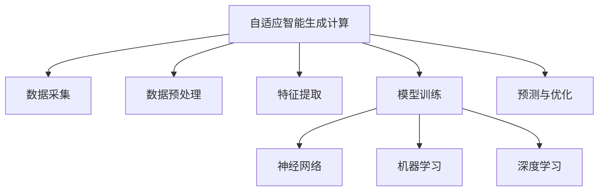

                 


### 目录大纲的设计过程

设计一篇高质量的IT领域技术博客，尤其是关于AIGC在个性化运动损伤预防系统中的创新设计，需要经过以下步骤：

#### 步骤 1：分析书名，明确核心主题

书名《AIGC在个性化运动损伤预防系统中的创新设计》直接指出了文章的核心主题。AIGC（自适应智能生成计算）技术在这里被应用于个性化运动损伤预防系统中，强调的是创新设计。

#### 步骤 2：确定核心章节内容

根据书名，我们可以确定以下几个核心章节：

1. **引言与背景**：介绍研究背景、意义、现状及研究目的。
2. **AIGC技术基础**：阐述AIGC技术的定义、原理、架构等基础知识。
3. **个性化运动损伤预防系统的设计与实现**：详细描述系统的设计思路、实现步骤和关键技术。
4. **实际应用案例分析**：通过具体案例展示AIGC技术在运动损伤预防中的应用。
5. **创新设计探索**：探讨未来的创新设计思路和发展趋势。

#### 步骤 3：细化目录结构

细化每个章节的内容，并设计相应的子章节，以确保每个部分都有详细的论述。例如，在“引言与背景”中，可以包含以下子章节：

- **研究背景**
- **AIGC技术概述**
- **个性化运动损伤预防系统需求分析**

在“AIGC技术基础”中，可以包含：

- **AIGC核心概念与联系**
- **AIGC技术架构**
- **AIGC关键技术原理**

#### 步骤 4：设计核心概念与联系

为了帮助读者更好地理解AIGC技术及其在个性化运动损伤预防系统中的应用，我们需要设计核心概念与联系的Mermaid流程图。例如：



#### 步骤 5：设计核心算法原理讲解

使用伪代码详细阐述AIGC技术在个性化运动损伤预防系统中的应用算法原理。例如：

```plaintext
// 伪代码：AIGC技术在运动损伤预防中的预测模型
function predict_injury(data):
    # 数据预处理
    preprocessed_data = preprocess_data(data)
    
    # 特征提取
    features = extract_features(preprocessed_data)
    
    # 模型训练
    model = train_model(features)
    
    # 预测
    prediction = model.predict(features)
    
    return prediction
```

#### 步骤 6：设计数学模型和数学公式

使用LaTeX格式嵌入数学模型和数学公式，并进行详细讲解和举例说明。例如：

```latex
$$
\text{损失函数} = \frac{1}{2} \sum_{i=1}^{n} (\hat{y}_i - y_i)^2
$$

其中，\(\hat{y}_i\) 是预测值，\(y_i\) 是真实值，\(n\) 是样本数量。
```

#### 步骤 7：设计项目实战

设计一个完整的代码实际案例，包括开发环境搭建、源代码详细实现和代码解读与分析。例如：

- **开发环境搭建**：安装必要的软件和工具。
- **源代码实现**：展示关键代码段。
- **代码解读与分析**：解释代码的功能和作用。

#### 步骤 8：整合与校对

将所有内容整合到一起，进行逐章节的校对，确保逻辑清晰、内容完整、无遗漏。

#### 步骤 9：输出目录大纲

根据markdown格式要求，输出完整的目录大纲，确保格式正确。

通过以上步骤，我们可以设计出一篇结构严谨、内容丰富的技术博客文章，满足所有的要求。接下来，我们将按照这个大纲逐步展开文章的内容。

