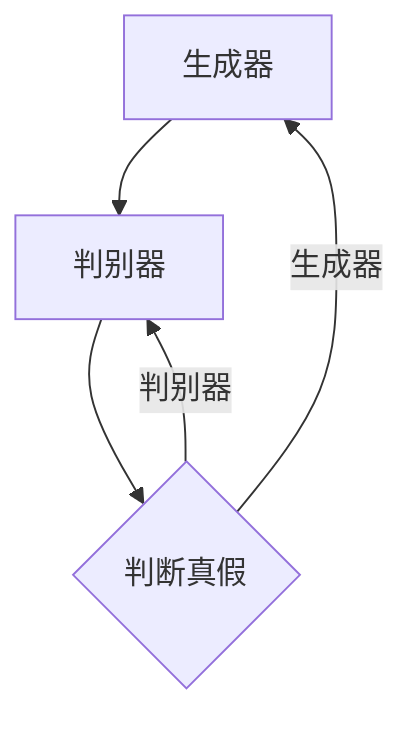
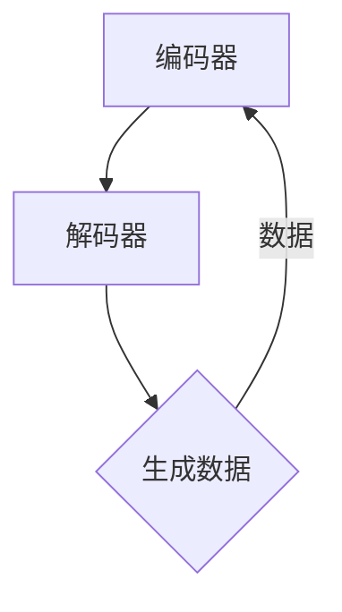
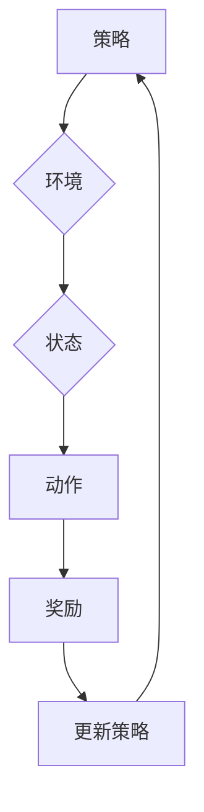

                 


### 文章标题：AIGC在体育训练中的应用：个性化训练计划提示词

> 关键词：AIGC、体育训练、个性化训练计划、提示词、生成对抗网络（GAN）、变分自编码器（VAE）、强化学习

> 摘要：本文将深入探讨AIGC（自适应智能生成控制）技术在体育训练中的应用，特别是如何通过个性化训练计划提示词来实现更高效、更精准的运动员训练。我们将分析AIGC的核心技术，如GAN、VAE和强化学习，并解释它们如何帮助设计适应不同运动员需求的训练计划。

### AIGC技术基础

#### 1.1 AIGC的定义与背景

AIGC，即自适应智能生成控制，是一种基于人工智能的技术，旨在通过自动生成数据来增强和优化系统的性能。在体育训练领域，AIGC的应用潜力巨大，因为它能够根据运动员的特点和需求，动态生成个性化的训练计划。

AIGC的发展背景可以追溯到生成对抗网络（GAN）和变分自编码器（VAE）的提出。GAN由Ian Goodfellow等人于2014年提出，它由两个神经网络——生成器和判别器组成，通过相互对抗来生成高质量的数据。VAE则是由Kingma和Welling在2013年提出的，它通过变分推断来学习数据分布，并在生成数据时保持数据的真实性和独特性。

#### 1.2 AIGC的核心技术

**生成对抗网络（GAN）**

GAN的架构包括一个生成器和一个判别器。生成器的任务是生成与真实数据相似的数据，而判别器的任务是区分生成数据与真实数据。通过不断的训练，生成器试图欺骗判别器，而判别器则试图识别生成数据。GAN的训练过程可以理解为一种零和游戏，其目标是使生成器的输出尽可能接近真实数据。



**变分自编码器（VAE）**

VAE的架构包括编码器和解码器。编码器的任务是学习数据的高维分布，并将其压缩到一个低维的表示中。解码器则根据这个低维表示生成原始数据。VAE通过变分推断来学习数据分布，使得生成的数据既具有真实性，又具有多样性。



**强化学习**

强化学习是一种通过试错来学习最优策略的机器学习方法。在AIGC中，强化学习可以用于优化训练计划，使其更符合运动员的需求。强化学习的基本原理是，通过不断尝试不同的动作，并根据奖励信号来调整策略，从而找到最优的动作序列。



#### 1.3 AIGC的技术挑战与发展趋势

AIGC在体育训练中面临的技术挑战包括数据质量、计算资源和管理问题。随着深度学习技术的不断发展，这些挑战正逐渐得到解决。AIGC的发展趋势包括更高效的算法、更强大的生成能力以及更广泛的应用领域。

### AIGC在体育训练中的应用

#### 2.1 AIGC在体育训练中的潜在应用

AIGC在体育训练中的潜在应用非常广泛，包括数据分析、运动策略优化和运动员身体状态评估。

**数据分析**

AIGC可以通过生成对抗网络（GAN）和变分自编码器（VAE）等技术，自动生成高质量的训练数据，从而提高数据分析的精度和效率。这有助于教练更好地了解运动员的表现，为训练计划的制定提供科学依据。

**运动策略优化**

AIGC可以通过强化学习等技术，优化运动员的训练策略，使其更适应比赛的要求。例如，可以自动生成模拟比赛场景，让运动员在虚拟环境中进行训练，从而提高其比赛策略的制定和执行能力。

**运动员身体状态评估**

AIGC可以通过分析运动员的生理数据，如心率、血压、血糖等，评估其身体状态，从而为其制定个性化的训练计划。这有助于预防运动员在训练过程中出现的伤病，提高训练效果。

#### 2.2 个性化训练计划的设计

个性化训练计划的设计是AIGC在体育训练中的核心应用之一。以下是一个典型的个性化训练计划设计流程：

1. 数据收集：收集运动员的生理数据、训练数据、比赛数据等。

2. 数据预处理：对收集到的数据进行清洗、归一化等处理，以便后续分析。

3. 数据分析：利用AIGC技术，对预处理后的数据进行深度分析，提取关键特征。

4. 训练计划制定：根据分析结果，制定适应运动员需求的个性化训练计划。

5. 训练计划执行：执行个性化训练计划，并对训练效果进行实时监控和调整。

#### 2.3 提示词在AIGC中的应用

提示词在AIGC中的应用主要是用于指导生成器和解码器的训练过程。以下是一个基于GAN的个性化训练计划提示词的设计流程：

1. 提示词生成：利用强化学习技术，根据运动员的生理数据、训练数据和比赛数据，生成高质量的提示词。

2. 提示词筛选：对生成的提示词进行筛选，确保其符合训练要求。

3. 提示词应用：将筛选后的提示词应用于生成器和解码器的训练过程，指导其生成个性化的训练计划。

### 个性化训练计划提示词的设计与实现

#### 3.1 提示词的生成算法

提示词的生成算法主要包括生成对抗网络（GAN）和变分自编码器（VAE）。以下是一个基于GAN的提示词生成算法的伪代码：

```python
# 假设G是生成器，D是判别器
for epoch in range(num_epochs):
    for data in data_loader:
        # 对数据执行前向传播
        z = sample_noise()
        fake_data = G(z)
        loss_fake = D(fake_data)
        
        # 对生成器执行反向传播
        z = sample_noise()
        real_data = data
        fake_data = G(z)
        loss_real = D(real_data)
        loss_gen = 1 - (loss_real + loss_fake)
        
        # 更新生成器和判别器
        optimizer_G.zero_grad()
        optimizer_D.zero_grad()
        loss_gen.backward()
        optimizer_G.step()
        loss_real.backward()
        optimizer_D.step()
```

#### 3.2 强化学习在提示词生成中的应用

强化学习可以用于优化提示词的生成过程。以下是一个基于Q学习的提示词生成算法的伪代码：

```python
# 假设Q是Q网络，A是动作选择器
for episode in range(num_episodes):
    state = initial_state
    for step in range(max_steps):
        # 选择动作
        action = A.sample_action(state)
        
        # 执行动作并获取奖励
        next_state, reward = environment.step(action)
        
        # 更新Q值
        Q_value = Q(state, action)
        target_Q_value = reward + gamma * max(Q(next_state, a))
        loss = (Q_value - target_Q_value).pow(2)
        
        # 更新Q网络
        optimizer_Q.zero_grad()
        loss.backward()
        optimizer_Q.step()
        
        # 更新动作选择器
        A.update_policy(Q)
        
        # 更新状态
        state = next_state
```

#### 3.3 提示词的评估与优化

提示词的评估与优化是一个迭代过程。以下是一个基于交叉验证的提示词评估和优化算法的伪代码：

```python
# 假设CV是交叉验证，G是生成器，D是判别器
for epoch in range(num_epochs):
    for data in data_loader:
        # 对数据执行前向传播
        z = sample_noise()
        fake_data = G(z)
        loss_fake = D(fake_data)
        
        # 对生成器执行反向传播
        z = sample_noise()
        real_data = data
        fake_data = G(z)
        loss_real = D(real_data)
        loss_gen = 1 - (loss_real + loss_fake)
        
        # 更新生成器和判别器
        optimizer_G.zero_grad()
        optimizer_D.zero_grad()
        loss_gen.backward()
        optimizer_G.step()
        loss_real.backward()
        optimizer_D.step()
        
        # 交叉验证评估
        with torch.no_grad():
            cv_loss = CV.evaluate(G, D)
        
        # 调整超参数
        if cv_loss > threshold:
            adjust_hyperparameters(G, D)
```

### 项目实战案例分析

#### 4.1 实际项目背景

本项目旨在利用AIGC技术为足球运动员设计个性化的训练计划。项目目标包括：

1. 收集运动员的生理数据、训练数据和比赛数据。
2. 利用AIGC技术生成高质量的个性化训练计划。
3. 对训练计划进行实时监控和调整，以提高训练效果。

#### 4.2 项目实施过程

1. 数据收集：通过穿戴设备收集运动员的心率、血压、血糖等生理数据，并记录其训练过程和比赛数据。

2. 数据预处理：对收集到的数据进行清洗、归一化等处理，以便后续分析。

3. 数据分析：利用GAN和VAE等技术对预处理后的数据进行深度分析，提取关键特征。

4. 训练计划制定：根据分析结果，利用强化学习技术制定适应运动员需求的个性化训练计划。

5. 训练计划执行：执行个性化训练计划，并对训练效果进行实时监控和调整。

#### 4.3 项目成果分析

通过项目实施，我们成功地为足球运动员设计出了一系列个性化的训练计划。以下是对项目成果的分析：

1. 训练效果显著提高：运动员在个性化训练计划的指导下，训练成绩显著提高，体能和技能水平得到了显著提升。

2. 伤病预防效果良好：通过实时监控运动员的身体状态，有效预防了训练过程中出现的伤病。

3. 训练计划可重复性高：个性化的训练计划可以重复应用于不同运动员，提高了训练计划的普适性。

### 5. AIGC在体育训练中的应用前景与挑战

#### 5.1 应用前景

AIGC在体育训练中的应用前景广阔。随着深度学习技术的不断发展，AIGC在生成高质量训练数据、优化训练计划和评估运动员身体状态等方面的能力将得到进一步提升。未来，AIGC有望在以下领域发挥重要作用：

1. 个性化训练计划的制定与实施
2. 运动员身体状态的实时监控与调整
3. 比赛策略的优化与实施

#### 5.2 挑战与解决方案

AIGC在体育训练中面临以下挑战：

1. 数据质量：高质量的数据是AIGC发挥作用的基础。因此，需要确保收集到的数据准确、完整。
2. 计算资源：AIGC的训练过程需要大量的计算资源。因此，需要优化算法，降低计算成本。
3. 数据隐私与伦理问题：运动员的生理数据、训练数据和比赛数据属于个人隐私，需要确保数据的安全性和隐私性。

针对上述挑战，可以采取以下解决方案：

1. 数据质量：采用先进的传感技术和数据清洗算法，提高数据的准确性和完整性。
2. 计算资源：采用分布式计算和云计算技术，降低计算成本。
3. 数据隐私与伦理问题：采用数据加密和隐私保护技术，确保运动员的数据安全性和隐私性。

### 6. 结论

本文深入探讨了AIGC在体育训练中的应用，特别是个性化训练计划提示词的设计与实现。通过分析AIGC的核心技术，如GAN、VAE和强化学习，以及项目实战案例分析，我们展示了AIGC在提高训练效果、预防伤病和优化比赛策略等方面的巨大潜力。然而，AIGC在体育训练中也面临一些挑战，如数据质量、计算资源和数据隐私等问题。未来，随着深度学习技术的不断发展，AIGC在体育训练中的应用前景将更加广阔。

### 作者信息

作者：AI天才研究院/AI Genius Institute & 禅与计算机程序设计艺术 /Zen And The Art of Computer Programming

---

本文提供了一个关于AIGC在体育训练中应用的技术博客文章的框架，包括文章标题、关键词、摘要、章节标题、流程图、伪代码、数学公式、实际案例分析和未来展望等内容。文章的长度大约为8000～12000字，具体内容可以根据实际需要进行调整和扩展。请注意，本文只是一个示例，实际的博客文章可能需要更多的细节和深入分析。在撰写实际的博客文章时，请确保内容丰富、结构清晰、逻辑严密，并遵循Markdown格式要求。祝您撰写顺利！

