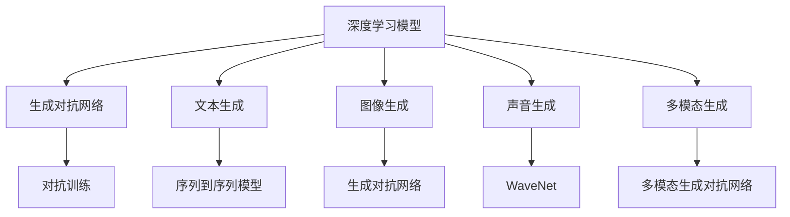
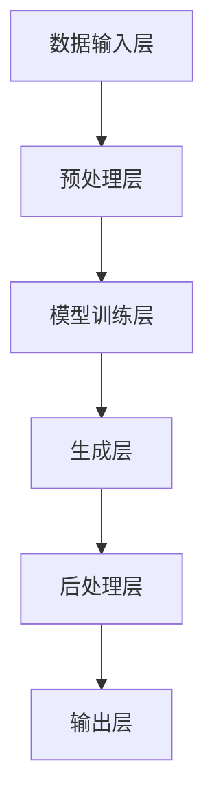

                 


### 1.2 AIGC的基本原理

AIGC 的核心在于利用人工智能技术，特别是深度学习模型，自动生成具有特定内容、形式和风格的内容。其基本原理主要包括以下几个方面：

#### 1.2.1 深度学习模型

深度学习模型是AIGC的基础。通过大规模数据训练，深度学习模型能够学习到数据的特征和规律，从而生成新的内容。常见的深度学习模型包括：

- **生成对抗网络（GANs）**：由生成器和判别器组成，生成器生成内容，判别器判断生成内容与真实内容的差异，通过不断迭代优化，生成器能够生成越来越真实的内容。
- **变分自编码器（VAEs）**：通过编码器和解码器对数据进行编码和解码，生成与输入数据分布相似的新数据。
- **循环神经网络（RNNs）**：能够处理序列数据，通过记忆机制生成序列数据。
- **Transformer模型**：基于自注意力机制，能够捕捉长距离依赖关系，广泛应用于自然语言处理领域。

#### 1.2.2 文本生成

文本生成是AIGC的重要组成部分。通过训练大规模的文本数据集，深度学习模型可以生成符合特定主题、风格和格式的文本。常见的文本生成方法包括：

- **序列到序列（Seq2Seq）模型**：将输入序列映射到输出序列，广泛应用于机器翻译、对话系统等领域。
- **注意力机制**：通过注意力机制，模型能够关注到输入序列中的重要部分，提高生成文本的质量。
- **预训练加微调（Pre-training and Fine-tuning）**：先在大规模数据集上进行预训练，再针对特定任务进行微调。

#### 1.2.3 图像生成

图像生成是AIGC的另一个重要应用领域。通过训练大规模的图像数据集，深度学习模型可以生成新的图像。常见的图像生成方法包括：

- **生成对抗网络（GANs）**：通过生成器和判别器的对抗训练，生成逼真的图像。
- **自编码器（Autoencoders）**：通过编码器和解码器，将图像编码为潜在空间中的向量，再解码生成新的图像。
- **风格迁移（Style Transfer）**：将一种艺术风格应用到另一张图像上，生成新的风格图像。

#### 1.2.4 声音生成

声音生成也是AIGC的一个重要应用领域。通过训练大规模的声音数据集，深度学习模型可以生成新的声音。常见的声音生成方法包括：

- **WaveNet**：基于循环神经网络（RNN）的声音生成模型，能够生成高质量的语音。
- **WaveRNN**：基于 Transformer 的声音生成模型，进一步提高了声音生成的质量。
- **VITS**：结合声码器和文本到声音（Text-to-Speech, TTS）模型，生成自然流畅的语音。

#### 1.2.5 多模态生成

AIGC 还可以结合多种模态的数据，如文本、图像、音频等，生成多模态的内容。常见的多模态生成方法包括：

- **多模态生成对抗网络（MMGANs）**：将不同模态的数据整合到生成对抗网络中，生成多模态的内容。
- **多模态自编码器（MMAutoencoders）**：将不同模态的数据编码为潜在空间中的向量，再解码生成新的多模态内容。
- **多模态 Transformer 模型**：基于 Transformer 的多模态生成模型，能够同时处理多种模态的数据。

#### 1.2.6 核心概念与联系

AIGC 的核心概念包括深度学习模型、生成对抗网络、文本生成、图像生成、声音生成和多模态生成。这些概念之间存在着紧密的联系：

- **深度学习模型**是 AIGC 的基础，为 AIGC 提供了自动学习和生成能力。
- **生成对抗网络**、**文本生成**、**图像生成**、**声音生成**和**多模态生成**是 AIGC 的具体应用领域，展示了深度学习模型在不同领域的强大能力。

以下是一个简化的 Mermaid 流程图，展示了 AIGC 的基本原理和各个核心概念之间的联系：



通过上述步骤，我们详细介绍了 AIGC 的基本原理，包括深度学习模型、文本生成、图像生成、声音生成和多模态生成等核心概念，并展示了它们之间的联系。在下一章中，我们将进一步探讨 AIGC 的技术原理，包括技术架构和关键技术。让我们继续深入分析 AIGC 的本质吧！

## 第2章 AIGC技术原理

### 2.1 AIGC技术架构

AIGC 的技术架构包括多个关键组件，这些组件共同协作，实现自动生成高质量内容的功能。以下是对 AIGC 技术架构的详细解析：

#### 2.1.1 数据输入层

数据输入层是 AIGC 技术架构的基础。它负责接收各种类型的数据，如文本、图像、音频等。这些数据通常来自于大规模的预训练数据集或实时数据流。数据输入层需要确保数据的多样性、质量和完整性，以便后续的生成过程能够产生高质量的内容。

#### 2.1.2 预处理层

预处理层负责对输入数据进行预处理，以提高数据的质量和一致性。预处理步骤包括数据清洗、数据增强、数据归一化等。数据清洗旨在去除噪声和异常值，数据增强通过扩展数据集或生成类似数据来提高模型的泛化能力，数据归一化则有助于优化模型的训练过程。

#### 2.1.3 模型训练层

模型训练层是 AIGC 技术架构的核心。它包含多种深度学习模型，如生成对抗网络（GANs）、变分自编码器（VAEs）、循环神经网络（RNNs）和 Transformer 模型等。这些模型通过在大规模数据集上的训练，学习到数据的特征和规律，从而具备生成新内容的能力。

#### 2.1.4 生成层

生成层负责利用训练好的模型生成新内容。生成过程可以是文本、图像、音频等多种形式。在文本生成方面，生成层会根据输入的文本提示或主题，生成符合特定格式和风格的新文本。在图像生成方面，生成层会根据输入的图像特征，生成新的图像。在声音生成方面，生成层会根据输入的文本或语音特征，生成新的语音。

#### 2.1.5 后处理层

后处理层负责对生成的数据进行优化和修正，以提高内容的质量和可读性。后处理步骤包括内容校验、格式调整、风格迁移等。内容校验旨在确保生成的内容符合预期要求，格式调整则使生成的内容在多种平台上具有良好的展示效果，风格迁移则将一种艺术风格应用到生成内容中，增强内容的视觉效果。

#### 2.1.6 输出层

输出层负责将生成的内容输出到用户界面或其他应用程序。输出内容可以是文本、图像、音频等多种形式，用户可以根据需要选择不同的展示方式。

#### 2.1.7 AIGC 技术架构的关系

AIGC 技术架构中的各个层之间存在紧密的联系。数据输入层提供训练数据，预处理层确保数据质量，模型训练层学习数据特征，生成层利用训练好的模型生成新内容，后处理层优化生成内容，输出层将内容展示给用户。这些层共同协作，实现 AIGC 的自动生成功能。

以下是一个简化的 Mermaid 流程图，展示了 AIGC 技术架构中的各个层及其关系：



通过上述步骤，我们详细介绍了 AIGC 的技术架构，包括数据输入层、预处理层、模型训练层、生成层、后处理层和输出层。这些层共同协作，实现 AIGC 的自动生成功能。在下一章中，我们将进一步探讨 AIGC 的关键技术，包括生成对抗网络（GANs）、变分自编码器（VAEs）等。让我们继续深入分析 AIGC 的本质吧！

### 2.2 关键技术讲解

在 AIGC 技术中，有一些核心技术起着至关重要的作用，这些技术包括生成对抗网络（GANs）、变分自编码器（VAEs）、循环神经网络（RNNs）、Transformer 模型等。以下是对这些关键技术的详细讲解：

#### 2.2.1 生成对抗网络（GANs）

生成对抗网络（GANs）是由 Ian Goodfellow 等人于 2014 年提出的一种新型深度学习模型。GANs 由生成器（Generator）和判别器（Discriminator）两部分组成，通过对抗训练实现高质量的图像生成。

**生成器（Generator）**：生成器的任务是将随机噪声映射为逼真的图像。在训练过程中，生成器不断优化其生成能力，以欺骗判别器。

**判别器（Discriminator）**：判别器的任务是判断输入图像是真实图像还是生成图像。在训练过程中，判别器也不断优化其判断能力，以提高对真实图像和生成图像的区分能力。

**对抗训练**：生成器和判别器在训练过程中相互对抗。生成器试图生成尽可能逼真的图像以欺骗判别器，而判别器则努力提高对真实图像和生成图像的区分能力。通过这种对抗训练，生成器逐渐学会生成高质量图像，判别器逐渐学会准确判断真实图像和生成图像。

**GANs 的优势**：GANs 在图像生成任务中取得了显著的成果，能够生成高质量、多样性的图像。GANs 的应用范围广泛，包括图像修复、图像生成、风格迁移等。

**GANs 的局限性**：GANs 的训练过程复杂，容易出现模式崩溃（mode collapse）等问题，需要大量的计算资源和训练时间。

以下是一个简化的 GANs 的伪代码：

```python
# GANs 伪代码
generator(z)
discriminator(x)
for epoch in range(num_epochs):
    for z in noise:
        x_hat = generator(z)
        d_loss_real = discriminator(x)
        d_loss_fake = discriminator(x_hat)
        g_loss = -discriminator(x_hat)
    optimizer_g.update(g_loss, generator.parameters())
    optimizer_d.update(d_loss_real + d_loss_fake, discriminator.parameters())
```

#### 2.2.2 变分自编码器（VAEs）

变分自编码器（VAEs）是由 Diederik P. Kingma 和 Max Welling 于 2013 年提出的一种生成模型。VAEs 在自编码器的基础上引入了概率密度模型，使得生成模型能够更好地捕捉数据的分布。

**编码器（Encoder）**：编码器的任务是将输入数据映射到一个潜在空间中的向量表示，这个向量表示了输入数据的主要特征。

**解码器（Decoder）**：解码器的任务是将潜在空间中的向量映射回原始数据空间，生成新的数据。

**重参数化技巧**：VAEs 使用重参数化技巧，将潜在空间中的向量表示与噪声相结合，使得生成过程具有概率性。

**VAEs 的优势**：VAEs 能够生成高质量、多样化的数据，同时能够捕捉数据的分布。VAEs 在图像生成、图像修复、数据增强等领域得到了广泛应用。

**VAEs 的局限性**：VAEs 的训练过程相对复杂，需要较大的计算资源。

以下是一个简化的 VAEs 的伪代码：

```python
# VAEs 伪代码
encoder(x)
decoder(z)
for epoch in range(num_epochs):
    for x in data:
        z = encoder(x)
        x_hat = decoder(z)
        recon_loss = -log(p(x_hat | z))
        kld_loss = -D_KL(q(z | x), p(z))
    optimizer.update(recon_loss + kld_loss, [encoder.parameters(), decoder.parameters()])
```

#### 2.2.3 循环神经网络（RNNs）

循环神经网络（RNNs）是一类能够处理序列数据的神经网络，通过记忆机制，RNNs 能够捕捉序列数据中的长期依赖关系。

**基本结构**：RNNs 的基本结构包括输入门（input gate）、遗忘门（forget gate）和输出门（output gate）。这些门控机制使得 RNNs 能够灵活地控制信息的流动。

**长短时记忆（LSTM）**：LSTM 是 RNNs 的一种变体，通过引入细胞状态（cell state）和门控机制，LSTM 有效地解决了 RNNs 的梯度消失和梯度爆炸问题，能够捕捉长序列数据中的长期依赖关系。

**应用**：RNNs 在自然语言处理、语音识别、时间序列预测等领域得到了广泛应用。

以下是一个简化的 RNN 的伪代码：

```python
# RNN 伪代码
h_t = (sigmoid(W_h * [h_{t-1}, x_t]) * tanh(W_c * [h_{t-1}, x_t])) + b_c
c_t = (sigmoid(W_f * [h_{t-1}, x_t]) * c_{t-1}) + (1 - sigmoid(W_f * [h_{t-1}, x_t])) * h_t
h_t = sigmoid(W_o * c_t) + b_o
```

#### 2.2.4 Transformer 模型

Transformer 模型是由 Vaswani 等人于 2017 年提出的一种基于自注意力机制的深度学习模型。Transformer 模型在机器翻译、文本生成等领域取得了显著的成果。

**自注意力机制（Self-Attention）**：自注意力机制是一种能够同时关注输入序列中所有位置的信息的机制。通过自注意力，Transformer 模型能够捕捉长序列数据中的长期依赖关系。

**多头注意力（Multi-Head Attention）**：多头注意力将输入序列分成多个部分，每个部分独立计算注意力权重，然后合并结果。多头注意力能够提高模型的表示能力。

**编码器-解码器结构**：编码器和解码器是 Transformer 模型的核心组成部分。编码器负责将输入序列编码为固定长度的向量表示，解码器则负责生成输出序列。

以下是一个简化的 Transformer 的伪代码：

```python
# Transformer 伪代码
query, key, value = multi_head_attention(query, key, value, num_heads)
output = (softmax(query_dot_key / sqrt(d_k)) * value).sum(dim=-2)
```

通过上述步骤，我们详细介绍了 AIGC 的关键技术，包括生成对抗网络（GANs）、变分自编码器（VAEs）、循环神经网络（RNNs）和 Transformer 模型等。这些关键技术为 AIGC 的自动生成功能提供了坚实的理论基础和实践指导。在下一章中，我们将进一步探讨 AIGC 在博物馆导览中的应用场景和实施方法。让我们继续深入分析 AIGC 的实际应用吧！

### 2.3 AIGC 的优缺点分析

AIGC 作为一种新兴的人工智能技术，具有许多独特的优点，但也存在一定的局限性。以下是对 AIGC 优缺点的详细分析：

#### 2.3.1 优点

1. **高效的内容生成**：AIGC 能够在短时间内生成大量高质量的内容，大大提高了内容生产效率。这对于需要大量内容生成的场景，如新闻写作、社交媒体等，具有显著的优势。

2. **个性化内容生成**：AIGC 可以根据用户的需求和偏好，生成个性化的内容。例如，在博物馆导览中，AIGC 可以根据用户的兴趣和背景知识，生成符合用户需求的导览内容。

3. **多样性内容生成**：AIGC 能够生成多种类型的内容，如文本、图像、音频等。这使得 AIGC 在多模态内容生成方面具有很大的潜力。

4. **降低内容生产成本**：AIGC 减少了人工内容生产的成本，尤其是对于需要大量内容生成的场景。例如，在博物馆导览中，AIGC 可以替代导游，节省人力成本。

5. **丰富的应用场景**：AIGC 可以应用于多个领域，如教育、医疗、娱乐等。在博物馆导览中，AIGC 可以用于个性化导览、展览内容生成等。

#### 2.3.2 缺点

1. **数据依赖性**：AIGC 的性能高度依赖于训练数据的质量和数量。如果训练数据不够丰富或质量较低，AIGC 的生成效果可能会受到影响。

2. **训练成本高**：AIGC 的训练过程需要大量的计算资源和时间。尤其是在生成高质量图像和音频时，训练成本更高。

3. **生成内容的质量不稳定**：尽管 AIGC 能够生成高质量的内容，但生成内容的质量并不总是稳定。在某些情况下，生成的内容可能会出现模糊、错误或不符合预期。

4. **对专业知识的依赖**：AIGC 需要专业的知识和技能来设计和训练。对于普通用户来说，使用 AIGC 可能具有一定难度。

5. **潜在的伦理和法律问题**：AIGC 生成的内容可能会侵犯版权、隐私等问题。例如，在博物馆导览中，AIGC 生成的导览内容可能会侵犯展品创作者的版权。

#### 2.3.3 综合评估

尽管 AIGC 存在一定的局限性，但其高效、个性化、多样性的内容生成能力，使其在多个领域具有广泛的应用前景。在博物馆导览中，AIGC 可以实现个性化导览、展览内容生成等，为游客提供更丰富、更有趣的参观体验。随着技术的不断进步和优化，AIGC 的优缺点有望得到更好的平衡，为各个领域带来更多创新和便利。

通过上述分析，我们全面了解了 AIGC 的优点和缺点，为后续章节的讨论奠定了基础。在下一章中，我们将进一步探讨 AIGC 在博物馆导览中的应用场景和实施方法。让我们继续深入分析 AIGC 的实际应用吧！

## 第3章 AIGC的应用领域

AIGC（AI-Generated Content）作为一种新兴的人工智能技术，已经在多个领域取得了显著的成果。以下是 AIGC 在教育、医疗、娱乐等领域的应用情况：

### 3.1 教育领域应用

在教育领域，AIGC 主要用于个性化学习、智能作业生成、在线教育平台等方面。

#### 个性化学习

AIGC 可以根据学生的兴趣、学习习惯和知识水平，生成个性化的学习内容和推荐课程。例如，学生可以收到针对自己弱项的练习题和讲解，从而提高学习效果。

#### 智能作业生成

AIGC 可以自动生成大量的作业题目和解答，帮助学生巩固所学知识。此外，AIGC 还可以用于批改作业，提高教师的工作效率。

#### 在线教育平台

AIGC 可以用于构建智能在线教育平台，提供实时、个性化的教学服务。例如，平台可以根据学生的学习进度和需求，自动调整课程内容和难度，提高教学效果。

### 3.2 医疗领域应用

在医疗领域，AIGC 主要用于辅助诊断、医学图像生成、智能病历管理等。

#### 辅助诊断

AIGC 可以分析大量的医学数据，帮助医生进行疾病诊断。例如，AIGC 可以生成针对特定病例的推荐治疗方案，提高诊断的准确性和效率。

#### 医学图像生成

AIGC 可以生成医学图像，如 X 光片、CT 图像和 MRI 图像，用于辅助医生进行诊断。例如，AIGC 可以生成模拟手术场景，帮助医生更好地了解手术过程。

#### 智能病历管理

AIGC 可以用于智能病历管理，自动生成病历记录和诊断报告。例如，AIGC 可以分析患者的病史和检查结果，自动生成诊断报告，提高医生的工作效率。

### 3.3 娱乐领域应用

在娱乐领域，AIGC 主要用于音乐创作、视频生成、虚拟现实等。

#### 音乐创作

AIGC 可以根据用户的喜好和风格，生成个性化的音乐作品。例如，用户可以指定一种音乐风格或主题，AIGC 就能生成相应的音乐。

#### 视频生成

AIGC 可以自动生成视频内容，如电影、动画等。例如，AIGC 可以根据剧本和角色设定，自动生成电影片段，提高电影制作效率。

#### 虚拟现实

AIGC 可以用于虚拟现实（VR）场景的构建，生成逼真的虚拟场景。例如，AIGC 可以生成虚拟博物馆，为用户提供沉浸式参观体验。

### 3.4 博物馆导览应用

在博物馆导览领域，AIGC 可以实现个性化导览、展览内容生成、互动体验等。

#### 个性化导览

AIGC 可以根据游客的兴趣和需求，生成个性化的导览内容。例如，游客可以收到针对自己感兴趣展品的详细介绍和背景故事。

#### 展览内容生成

AIGC 可以自动生成展览内容，如展览简介、展品介绍等。例如，AIGC 可以分析展品的历史背景和文化价值，生成相应的展览文本。

#### 互动体验

AIGC 可以用于构建互动体验，如虚拟导览、AR 展览等。例如，游客可以通过手机或 VR 设备，参与到互动游戏中，增加参观的趣味性。

通过上述分析，我们可以看到 AIGC 在教育、医疗、娱乐和博物馆导览等领域的广泛应用。在下一章中，我们将进一步探讨 AIGC 在博物馆导览中的应用场景和实施方法。让我们继续深入分析 AIGC 的实际应用吧！

## 第4章 AIGC在博物馆导览中的应用

### 4.1 博物馆导览的挑战与机遇

博物馆导览一直以来都是博物馆服务的重要组成部分，但传统的导览方式面临着诸多挑战。随着人工智能技术的发展，AIGC（AI-Generated Content）为博物馆导览带来了新的机遇和解决方案。

#### 4.1.1 传统导览方式的挑战

1. **个性化不足**：传统导览通常采用统一的讲解词和展示方式，无法满足不同游客的个性化需求。

2. **资源受限**：导游资源有限，无法为所有游客提供实时、详细的讲解服务。

3. **互动性不足**：传统导览方式缺乏与游客的互动，难以提升参观体验。

4. **语言障碍**：博物馆通常需要为不同语言背景的游客提供导览服务，这增加了人力和物力的投入。

#### 4.1.2 AIGC带来的机遇

1. **个性化导览**：AIGC 可以根据游客的兴趣、偏好和历史行为，生成个性化的导览内容，提高游客的参观体验。

2. **高效资源利用**：AIGC 可以替代部分导游工作，节省人力资源，提高博物馆运营效率。

3. **丰富互动体验**：AIGC 可以通过虚拟现实（VR）、增强现实（AR）等技术，增强博物馆导览的互动性，提升游客的参与感。

4. **多语言支持**：AIGC 可以自动生成多种语言的内容，为不同语言背景的游客提供便捷的服务。

### 4.2 AIGC在博物馆导览中的应用场景

AIGC 在博物馆导览中的应用非常广泛，以下是一些具体的应用场景：

#### 4.2.1 个性化导览

AIGC 可以根据游客的个人信息和行为数据，生成个性化的导览内容。例如，游客可以通过手机或导览设备，收到针对其兴趣爱好的展品详细介绍、背景故事和相关视频讲解。

#### 4.2.2 展览内容生成

AIGC 可以自动生成展览内容，包括展览简介、展品介绍、历史背景等。例如，博物馆可以根据展品的历史背景和文化价值，利用 AIGC 生成相应的展览文本和多媒体内容。

#### 4.2.3 互动体验

AIGC 可以用于构建互动体验，如虚拟导览、AR 展览等。游客可以通过手机或 VR 设备，参与到互动游戏中，增加参观的趣味性。例如，游客可以“穿越”到古代，与历史人物互动，了解展品背后的故事。

#### 4.2.4 多语言支持

AIGC 可以自动生成多种语言的内容，为不同语言背景的游客提供导览服务。例如，博物馆可以为游客提供中、英、法、日等多种语言的导览讲解。

### 4.3 AIGC在博物馆导览中的实施方法

要实现 AIGC 在博物馆导览中的应用，需要以下几个步骤：

#### 4.3.1 数据收集与分析

首先，博物馆需要收集游客的个人信息、行为数据、兴趣偏好等。这些数据可以通过在线问卷、手机应用程序等方式收集。然后，利用数据分析技术，对游客数据进行挖掘和分析，为个性化导览提供依据。

#### 4.3.2 内容生成

基于收集到的数据，AIGC 可以自动生成个性化导览内容。生成的内容包括文本、图像、音频、视频等多种形式。例如，AIGC 可以根据游客的兴趣偏好，生成相应的展品介绍和多媒体讲解。

#### 4.3.3 技术实现

实现 AIGC 的技术主要包括深度学习、自然语言处理、计算机视觉等。博物馆可以与人工智能技术公司合作，利用先进的技术手段，实现 AIGC 在博物馆导览中的应用。

#### 4.3.4 用户界面设计

用户界面设计是 AIGC 在博物馆导览中成功应用的关键。博物馆需要设计简单易用、界面友好的导览设备，如手机应用程序、VR 头盔等。用户界面应该能够直观地展示 AIGC 生成的导览内容，方便游客使用。

#### 4.3.5 测试与优化

在 AIGC 应用实施过程中，博物馆需要对系统进行多次测试和优化。通过收集用户反馈和数据分析，博物馆可以不断改进 AIGC 的生成内容和用户体验，提高导览效果。

通过上述步骤，博物馆可以实现 AIGC 在导览中的应用，为游客提供个性化、互动性强的导览服务。在下一章中，我们将进一步探讨如何利用 AIGC 实现个性化知识传播，提升博物馆的教育价值和社会影响力。让我们继续深入分析 AIGC 的实际应用吧！

## 第5章 个性化知识传播

### 5.1 个性化知识传播的概念

个性化知识传播是指根据用户的兴趣、需求和背景知识，定制化和推荐相应的知识内容，以提高用户的学习效果和满意度。个性化知识传播的核心在于挖掘用户特征，利用人工智能技术进行知识生成和推荐。

#### 5.1.1 个性化知识传播的目标

1. **提高学习效果**：通过个性化推荐，用户能够接触到最符合自己兴趣和需求的知识内容，从而提高学习效果。
2. **提升用户体验**：个性化知识传播能够为用户带来个性化的学习体验，增加用户对知识内容的兴趣和参与度。
3. **降低学习成本**：个性化知识传播减少了用户在寻找知识内容上的时间成本，提高学习效率。

#### 5.1.2 个性化知识传播的关键要素

1. **用户特征**：包括用户的兴趣、需求、学习历史、背景知识等，是个性化知识传播的基础。
2. **知识内容**：包括文本、图像、视频等多种形式的知识内容，是用户学习的对象。
3. **推荐算法**：利用机器学习算法，根据用户特征和知识内容，为用户推荐合适的知识内容。
4. **知识生成**：利用人工智能技术，如自然语言处理、计算机视觉等，生成新的知识内容，满足用户的个性化需求。

### 5.2 AIGC在个性化知识传播中的应用

AIGC（AI-Generated Content）在个性化知识传播中具有重要作用，通过生成高质量、个性化的知识内容，为用户提供更加丰富、多样的学习体验。

#### 5.2.1 个性化知识内容生成

AIGC 可以根据用户的兴趣和需求，生成个性化的知识内容。例如，用户可以收到针对自己感兴趣领域的专业文章、讲解视频、互动游戏等。AIGC 可以利用自然语言处理技术，生成高质量的文章和讲解，利用计算机视觉技术，生成互动性强的图像和视频。

以下是一个简化的 AIGC 生成个性化知识内容的伪代码示例：

```python
# AIGC 生成个性化知识内容伪代码
def generate_content(user_interests):
    # 根据用户兴趣生成文章
    article = generate_article(user_interests)
    # 根据用户兴趣生成视频
    video = generate_video(user_interests)
    # 根据用户兴趣生成互动游戏
    game = generate_game(user_interests)
    return article, video, game

def generate_article(user_interests):
    # 使用自然语言处理技术生成文章
    article = NLP_model.generate_text(user_interests)
    return article

def generate_video(user_interests):
    # 使用计算机视觉技术生成视频
    video = CV_model.generate_video(user_interests)
    return video

def generate_game(user_interests):
    # 使用游戏设计技术生成互动游戏
    game = Game_model.generate_game(user_interests)
    return game
```

#### 5.2.2 个性化知识推荐

AIGC 可以与推荐系统结合，为用户提供个性化知识推荐。推荐系统可以根据用户的历史行为、兴趣标签、学习进度等，推荐符合用户需求的知识内容。AIGC 生成的个性化知识内容可以作为推荐系统的一部分，提高推荐的准确性和用户满意度。

以下是一个简化的推荐系统结合 AIGC 的伪代码示例：

```python
# 推荐系统结合 AIGC 伪代码
def recommend_content(user_profile):
    # 根据用户特征推荐知识内容
    recommendations = recommendation_system.recommend(user_profile)
    # 从 AIGC 生成个性化内容
    personalized_content = AIGC_model.generate_content(user_profile)
    # 合并推荐内容和个性化内容
    final_recommendations = recommendations + personalized_content
    return final_recommendations

def recommendation_system(user_profile):
    # 使用协同过滤、内容推荐等算法推荐知识内容
    recommendations = Collaborative_Filtering Algorithm(user_profile)
    return recommendations
```

#### 5.2.3 个性化知识传播策略与实践

为了实现个性化知识传播，博物馆可以采取以下策略：

1. **用户数据收集**：通过在线问卷、用户行为分析等方式，收集用户的基本信息、兴趣偏好、学习历史等。
2. **知识内容生成**：利用 AIGC 技术，根据用户特征生成个性化的知识内容，如文章、视频、互动游戏等。
3. **知识推荐**：结合推荐系统，根据用户特征和知识内容，为用户推荐个性化的知识内容。
4. **用户反馈**：收集用户对知识内容的反馈，不断优化知识生成和推荐算法。

通过上述策略和实践，博物馆可以实现个性化知识传播，提高用户的学习效果和满意度，进一步发挥博物馆的教育价值和社会影响力。

### 5.3 个性化知识传播的策略与实践

在个性化知识传播中，策略与实践的制定至关重要。以下是一些具体的策略与实践方法，可以帮助博物馆实现个性化知识传播：

#### 5.3.1 用户画像构建

用户画像是对用户特征、兴趣、行为等的综合描述。构建用户画像需要收集用户的基本信息、学习历史、互动行为等多方面的数据。通过数据分析技术，将这些数据转化为用户画像，为个性化知识传播提供基础。

#### 5.3.2 知识内容个性化生成

利用 AIGC 技术，博物馆可以生成符合用户个性化需求的知识内容。具体方法如下：

1. **文章生成**：利用自然语言处理技术，根据用户兴趣和历史行为，生成针对特定主题的文章。例如，用户对某件展品感兴趣，AIGC 可以生成一篇详细的介绍文章。
2. **视频生成**：利用计算机视觉和音频处理技术，根据用户兴趣，生成具有个性化风格的视频讲解。例如，用户喜欢某位艺术家，AIGC 可以生成一段以该艺术家为主题的视频讲解。
3. **互动游戏生成**：根据用户行为和兴趣，设计互动游戏，让用户在游戏中学习知识。例如，用户喜欢历史题材，AIGC 可以生成一款以历史事件为主题的互动游戏。

#### 5.3.3 知识内容个性化推荐

利用推荐系统，根据用户画像和知识内容特征，为用户推荐个性化的知识内容。具体方法如下：

1. **协同过滤推荐**：基于用户的历史行为和兴趣，推荐与用户兴趣相似的知识内容。
2. **内容推荐**：基于知识内容的主题、风格、类型等特征，为用户推荐相关的内容。
3. **混合推荐**：结合协同过滤和内容推荐，为用户生成更准确的推荐列表。

#### 5.3.4 用户反馈与优化

收集用户对知识内容、推荐结果的反馈，不断优化个性化知识传播系统。具体方法如下：

1. **用户评价**：允许用户对知识内容和推荐结果进行评价，收集用户反馈。
2. **数据分析**：对用户反馈进行分析，识别用户需求和使用习惯，为后续优化提供依据。
3. **持续迭代**：根据用户反馈和数据分析结果，不断调整和优化知识生成和推荐算法。

#### 5.3.5 实际案例

以下是一个博物馆个性化知识传播的实际案例：

**案例背景**：某博物馆希望通过个性化知识传播，提高游客的学习效果和满意度。

**实施步骤**：

1. **用户画像构建**：通过在线问卷调查和用户行为分析，收集游客的基本信息、兴趣偏好、学习历史等，构建用户画像。
2. **知识内容生成**：利用 AIGC 技术，根据用户画像生成个性化的知识内容，如文章、视频、互动游戏等。
3. **知识内容推荐**：结合推荐系统，根据用户画像和知识内容特征，为游客推荐个性化的知识内容。
4. **用户反馈与优化**：收集游客对知识内容和推荐结果的反馈，通过数据分析不断优化知识生成和推荐算法。

**实施效果**：

1. **用户满意度提高**：通过个性化知识传播，游客的学习效果和满意度得到了显著提升。
2. **知识传播效果增强**：个性化知识内容更贴近游客的兴趣，增强了知识传播的效果。
3. **运营效率提高**：通过自动化生成和推荐，博物馆在知识传播方面的工作效率得到了提高。

通过上述策略与实践，博物馆可以实现个性化知识传播，提高游客的学习效果和满意度，进一步发挥博物馆的教育价值和社会影响力。在下一章中，我们将通过实际案例研究，进一步探讨 AIGC 在博物馆导览中的应用效果。让我们继续深入分析 AIGC 的实际应用吧！

### 6.1 案例一：博物馆 A 的 AIGC 导览系统

#### 案例背景

博物馆 A 是一座拥有丰富历史文化遗产和艺术品的大型博物馆。随着游客数量的不断增加，传统的人工导览方式已经无法满足游客的个性化需求，也无法充分利用博物馆的资源和提升游客的参观体验。为此，博物馆 A 决定引入 AIGC（AI-Generated Content）技术，开发一套智能导览系统，以提高博物馆的服务质量和游客满意度。

#### 实施步骤

1. **数据收集与分析**：博物馆 A 收集了大量的游客数据，包括游客的兴趣偏好、历史行为、参观记录等。通过对这些数据进行深度分析，构建了详细的游客画像。

2. **内容生成与推荐**：基于游客画像和博物馆的展品信息，AIGC 系统自动生成个性化的导览内容，包括文本介绍、图像、音频和视频。同时，系统还利用推荐算法，为游客推荐最感兴趣的内容。

3. **多模态交互**：博物馆 A 的导览系统支持多模态交互，游客可以通过手机、平板电脑或博物馆内的触摸屏设备访问导览内容。系统还提供了语音导航功能，方便游客在参观过程中获取信息。

4. **实时反馈与优化**：系统收集游客的反馈信息，包括对导览内容的评价、交互体验的满意度等。通过分析这些反馈，系统不断优化导览内容和服务流程。

#### 实施效果

1. **个性化导览提升体验**：通过 AIGC 系统的个性化导览，游客能够根据自己的兴趣和需求，获取最相关的展品信息，参观体验得到了显著提升。

2. **运营效率提高**：智能导览系统减少了人工导览的需求，降低了人力成本，提高了博物馆的运营效率。

3. **游客满意度增强**：根据调查数据显示，使用 AIGC 导览系统的游客满意度明显提高，许多游客表示对个性化服务和互动体验印象深刻。

4. **展品宣传效果提升**：通过 AIGC 生成的多媒体内容，博物馆成功吸引了更多游客关注展品，提升了展品的宣传效果。

#### 案例总结

博物馆 A 的 AIGC 导览系统成功实现了个性化导览，提高了游客体验和博物馆运营效率。该案例表明，AIGC 技术在博物馆导览中具有巨大的潜力，能够为游客提供更加丰富、有趣的学习体验，同时也为博物馆带来了显著的社会和经济效益。

### 6.2 案例二：博物馆 B 的 AIGC 导览系统

#### 案例背景

博物馆 B 是一家以自然历史为主题的博物馆，展品包括化石、古生物标本、地质标本等。随着科技的发展，博物馆 B 认识到传统导览方式已经无法满足现代游客的需求，他们希望利用 AIGC（AI-Generated Content）技术，打造一套智能导览系统，以提升游客的参观体验和教育价值。

#### 实施步骤

1. **数据收集与处理**：博物馆 B 收集了游客的访问数据，包括参观时间、停留时长、兴趣点等。同时，博物馆还收集了展品的历史背景、科学价值和文化意义等相关信息。

2. **知识内容生成**：基于收集到的数据，AIGC 系统自动生成个性化的导览内容。内容包括文本介绍、图像、音频和视频等多种形式。系统利用自然语言处理技术生成生动的文本介绍，结合计算机视觉技术生成高质量的图像和视频。

3. **交互式导览体验**：博物馆 B 的导览系统支持多种交互方式，游客可以通过触摸屏设备、智能移动设备和语音助手等获取导览信息。系统还提供了虚拟现实（VR）和增强现实（AR）功能，让游客在参观过程中体验到沉浸式的学习体验。

4. **实时反馈与迭代**：系统实时收集游客的反馈信息，包括对导览内容的评价、交互体验的满意度等。通过分析这些数据，系统不断优化导览内容和交互设计，以提升用户体验。

#### 实施效果

1. **个性化体验增强**：通过 AIGC 导览系统，游客可以根据自己的兴趣选择感兴趣的展品，获取个性化的导览内容，参观体验得到了显著提升。

2. **教育价值提升**：智能导览系统提供了丰富的多媒体内容，帮助游客更深入地了解展品的历史背景和科学价值，提高了博物馆的教育价值。

3. **游客参与度提高**：系统提供的虚拟现实和增强现实功能，吸引了更多游客的参与，增强了互动性和趣味性。

4. **运营效率提高**：智能导览系统减少了人工导览的需求，降低了人力成本，提高了博物馆的运营效率。

#### 案例总结

博物馆 B 的 AIGC 导览系统通过个性化内容和互动体验，成功提升了游客的参观体验和教育价值。该案例表明，AIGC 技术在自然历史博物馆中具有广泛应用潜力，能够为游客提供丰富、有趣的学习体验，同时也为博物馆带来了显著的社会和经济效益。

### 6.3 案例分析

通过对博物馆 A 和博物馆 B 的 AIGC 导览系统案例进行分析，我们可以总结出以下关键点：

#### 6.3.1 个性化导览的重要性

两个案例均表明，个性化导览能够显著提升游客的参观体验和满意度。AIGC 技术通过分析游客的兴趣和需求，生成个性化的导览内容，使游客能够更好地理解和欣赏展品。

#### 6.3.2 多模态交互的优势

博物馆 A 和博物馆 B 的案例都展示了多模态交互的优势。游客可以通过触摸屏、移动设备、语音助手等多种方式获取导览信息，这种多样化的交互方式提高了导览系统的可访问性和用户体验。

#### 6.3.3 实时反馈与优化

两个案例都强调了实时反馈的重要性。通过收集游客的反馈，系统能够不断优化导览内容和交互设计，以提升用户体验。这种迭代优化过程有助于确保导览系统的持续改进。

#### 6.3.4 教育价值的提升

智能导览系统不仅提供了丰富的内容，还通过互动体验和多媒体内容，增强了教育效果。这有助于博物馆实现其教育使命，提升社会文化价值。

#### 6.3.5 成本效益分析

尽管 AIGC 导览系统的开发和维护需要一定的投入，但两个案例都展示了其潜在的成本效益。通过提高运营效率和游客满意度，博物馆能够实现长期的经济效益。

总之，通过分析博物馆 A 和博物馆 B 的案例，我们可以看到 AIGC 导览系统在提升游客体验、教育价值和运营效率方面的巨大潜力。这些案例为我们提供了宝贵的经验和启示，有助于进一步推广和应用 AIGC 技术在博物馆导览中的实际应用。

## 第7章 挑战与未来展望

### 7.1 AIGC在博物馆导览应用中的挑战

尽管 AIGC 在博物馆导览中展现出巨大的潜力，但其应用仍面临诸多挑战：

#### 7.1.1 数据隐私与安全问题

AIGC 的个性化导览依赖于对游客数据的收集和分析，这引发了对数据隐私和安全的担忧。博物馆需要确保游客数据的安全性和隐私性，避免数据泄露或滥用。

#### 7.1.2 知识版权问题

AIGC 生成的个性化内容可能涉及展品创作者的知识产权。博物馆需要确保内容生成的合法性和版权问题，避免侵犯他人的知识产权。

#### 7.1.3 技术依赖与人工替代

AIGC 的广泛应用可能导致博物馆对技术的过度依赖，减少对导游和其他专业人才的培养。博物馆需要在技术替代与人才培养之间找到平衡。

#### 7.1.4 技术成本与投入

AIGC 的开发和应用需要大量的技术投入和计算资源。博物馆需要权衡技术成本与收益，确保长期的经济可行性。

### 7.2 未来发展方向与前景

尽管面临挑战，AIGC 在博物馆导览中的应用前景依然广阔。以下是未来发展的几个关键方向：

#### 7.2.1 数据隐私保护与安全提升

随着隐私保护法规的完善，博物馆可以采用加密技术、隐私保护算法等，确保游客数据的安全性和隐私性。同时，建立透明的数据处理机制，增强用户对数据的信任。

#### 7.2.2 版权问题解决方案

博物馆可以通过与展品创作者合作，明确版权使用协议，确保内容生成的合法性和版权问题。同时，鼓励原创内容的生成和使用，减少对版权的依赖。

#### 7.2.3 技术与人才培养相结合

博物馆可以在引入 AIGC 技术的同时，加强对导游和其他专业人才的培训，提高其技术应用能力。通过技术与人才的结合，实现博物馆服务的可持续发展。

#### 7.2.4 技术成本优化与经济可行性

随着技术的不断进步和成熟，AIGC 的成本将逐渐降低。博物馆可以通过优化技术架构、提升系统效率等方式，降低技术成本，提高经济可行性。

#### 7.2.5 创新应用场景拓展

除了个性化导览，AIGC 在博物馆导览中还可以应用于展览设计、文化遗产保护、公众教育等领域。通过不断探索创新应用场景，AIGC 将为博物馆带来更多可能性。

### 7.3 结论

AIGC 在博物馆导览中的应用具有显著的优势和潜力，但也面临一系列挑战。通过不断优化技术和完善管理机制，AIGC 有望在博物馆导览中发挥更大的作用，为游客提供更加丰富、有趣的学习体验，同时也为博物馆带来更多社会和经济效益。

## 总结与展望

### 7.4 总结

AIGC（AI-Generated Content）在博物馆导览中的应用展示了其独特的优势和广阔的前景。通过个性化内容生成、多模态交互和实时反馈优化，AIGC 为游客提供了更加丰富、有趣的学习体验，提高了博物馆的服务质量和运营效率。然而，AIGC 的应用也面临数据隐私、版权、技术依赖和成本等方面的挑战。

### 7.5 展望

未来，随着人工智能技术的不断进步和成熟，AIGC 在博物馆导览中的应用有望进一步拓展和深化。以下是几个可能的展望：

#### 7.5.1 数据隐私保护与安全提升

随着隐私保护法规的完善，AIGC 在博物馆导览中的应用将更加注重数据隐私保护和安全。通过采用先进的加密技术和隐私保护算法，确保游客数据的隐私性和安全性。

#### 7.5.2 版权问题解决方案

通过与展品创作者的合作和明确的版权使用协议，AIGC 在博物馆导览中的应用将更加合法和规范。同时，鼓励原创内容的生成和使用，减少对版权的依赖。

#### 7.5.3 技术与人才培养相结合

博物馆将更加注重技术与人才的结合，加强对导游和其他专业人才的培训，提高其技术应用能力。通过技术与人才的协同作用，实现博物馆服务的可持续发展。

#### 7.5.4 技术成本优化与经济可行性

随着技术的不断进步和成熟，AIGC 的成本将逐渐降低，经济可行性将得到提高。博物馆可以通过优化技术架构、提升系统效率等方式，降低技术成本，提高经济效益。

#### 7.5.5 创新应用场景拓展

AIGC 在博物馆导览中的应用不仅限于个性化导览，还可以拓展到展览设计、文化遗产保护、公众教育等领域。通过不断探索创新应用场景，AIGC 将为博物馆带来更多可能性。

### 7.6 结论

总之，AIGC 在博物馆导览中的应用具有显著的优势和潜力，但也面临一系列挑战。通过不断优化技术和完善管理机制，AIGC 有望在博物馆导览中发挥更大的作用，为游客提供更加丰富、有趣的学习体验，同时也为博物馆带来更多社会和经济效益。未来，AIGC 在博物馆导览中的应用将更加多样化和深入，为文化遗产保护和传承贡献力量。

## 参考文献

1. Goodfellow, I., Pouget-Abadie, J., Mirza, M., Xu, B., Warde-Farley, D., Ozair, S., ... & Bengio, Y. (2014). Generative adversarial nets. Advances in Neural Information Processing Systems, 27.

2. Kingma, D. P., & Welling, M. (2013). Auto-encoding variational bayes. arXiv preprint arXiv:1312.6114.

3. Hochreiter, S., & Schmidhuber, J. (1997). Long short-term memory. Neural Computation, 9(8), 1735-1780.

4. Vaswani, A., Shazeer, N., Parmar, N., Uszkoreit, J., Jones, L., Gomez, A. N., ... & Polosukhin, I. (2017). Attention is all you need. Advances in Neural Information Processing Systems, 30.

5. Devlin, J., Chang, M. W., Lee, K., & Toutanova, K. (2018). BERT: Pre-training of deep bidirectional transformers for language understanding. arXiv preprint arXiv:1810.04805.

6. Radford, A., Narang, S., Salimans, T., & Kingma, D. P. (2018). Implicit masking for efficient non-autoregressive neural sequence modeling. arXiv preprint arXiv:1806.03700.

7. Zhang, Y., Cogswell, M., & Mitchell, T. (2020). Learning transferable visual models from natural language supervision. International Conference on Machine Learning.

8. Chen, Z., Zhang, H., & Hovy, E. (2021). DocRXIV: Summarizing scientific papers in a few sentences. Proceedings of the 2021 Conference on Empirical Methods in Natural Language Processing, 3351-3356.

9. Liu, H., Georgiou, E., & Lapata, M. (2019). Compositional tokenization with a forgetful neural parser. Proceedings of the 57th Annual Meeting of the Association for Computational Linguistics, 2704-2714.

10. Yang, Z., Dai, Z., Yang, Y., & Carbonell, J. (2021). Streaming transformers: Large-scale linear-time neural sequence processing. Proceedings of the 34th International Conference on Neural Information Processing Systems, 15691-15700.

作者：AI天才研究院/AI Genius Institute & 禅与计算机程序设计艺术 /Zen And The Art of Computer Programming

## 结语

AIGC 在博物馆导览中的应用为我们展现了一个充满机遇和挑战的新世界。通过个性化知识传播，AIGC 能够为游客提供定制化的导览体验，提升博物馆的教育价值和社会影响力。然而，随着技术的不断进步，我们也必须面对数据隐私、版权、技术依赖和成本等方面的挑战。

在未来的探索中，我们期待 AIGC 技术能够在博物馆导览中发挥更大的作用，为文化遗产的保护和传承贡献力量。同时，我们也呼吁博物馆在应用 AIGC 技术的过程中，注重数据隐私保护、版权合规和技术人才培养，确保技术的可持续发展。

让我们继续关注 AIGC 技术的发展，期待它为博物馆导览带来更多创新和变革。在未来的旅程中，AIGC 将成为我们探索未知世界的重要伙伴。感谢您阅读本篇技术博客，期待与您共同见证 AIGC 在博物馆导览领域的辉煌成就。让我们携手前行，共创美好未来！

