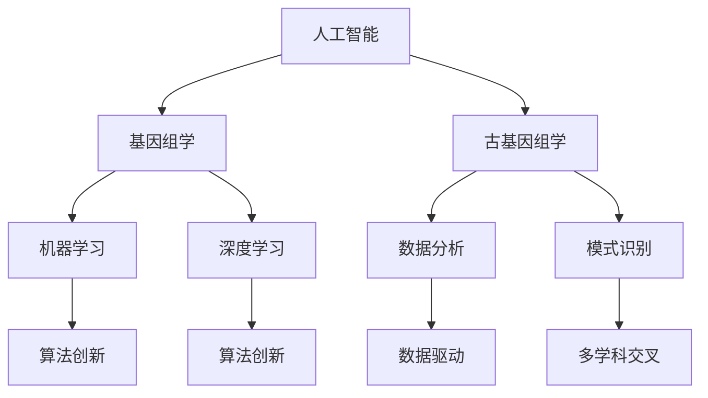
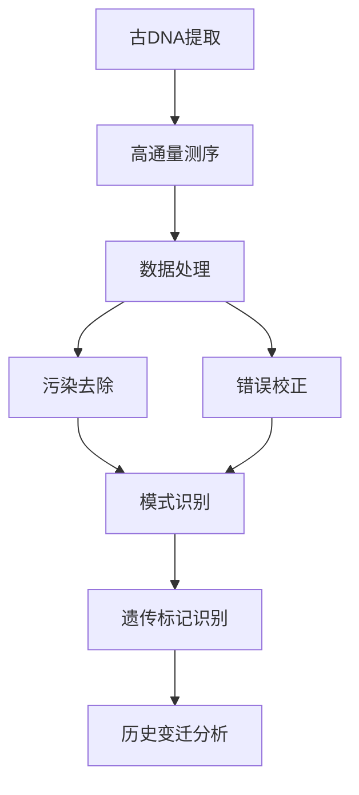

                 

# 文章标题：AIGC在古DNA表观遗传学分析中的应用：历史环境重建提示词

## 关键词
- AIGC
- 古DNA
- 表观遗传学
- 历史环境重建
- 提示词
- 人工智能

## 摘要
本文探讨了AIGC（人工智能与古基因组学的结合）在古DNA表观遗传学分析中的应用，并详细介绍了如何利用这一技术重建历史环境。首先，我们介绍了AIGC的核心概念及其在古DNA和表观遗传学中的具体应用。接着，我们深入分析了AIGC在古DNA数据处理和表观遗传学分析中的核心算法原理，并通过伪代码进行详细阐述。然后，本文通过具体案例展示了AIGC在历史环境重建中的实际应用，并探讨了相关提示词的作用。最后，我们对AIGC在古DNA表观遗传学分析领域的发展趋势和挑战进行了展望。

## 引言

### 背景介绍

古DNA研究是近年来生物科学领域的一个重要分支，通过分析古DNA，科学家们可以揭示过去数千年甚至更久远的人类历史和环境变迁。然而，古DNA的提取和解读过程面临着诸多挑战，例如样本的降解、污染以及数据的复杂度等。随着人工智能技术的发展，尤其是AIGC（人工智能与古基因组学的结合），这些挑战正在逐步得到解决。

AIGC是一种新兴的研究方向，旨在将人工智能技术应用于古DNA的分析中。通过结合机器学习、自然语言处理和基因组学知识，AIGC可以显著提升古DNA数据的处理效率和解读准确性。这种技术的应用不仅能够推动古DNA研究的进展，还能为历史环境重建提供新的线索和手段。

### 目标读者

本文的目标读者包括古DNA研究领域的科研人员、对人工智能技术感兴趣的学者、以及希望了解新兴交叉学科应用的学生和专业人员。通过本文的阅读，读者将了解AIGC在古DNA表观遗传学分析中的基本原理和应用，并能够掌握相关的技术方法和案例分析。

### 内容概述

本文将分为七个主要章节：

1. **引言**：介绍AIGC和古DNA表观遗传学的背景，明确本文的目标和结构。
2. **AIGC基础**：介绍AIGC的核心概念及其在古DNA和表观遗传学中的应用。
3. **古DNA与表观遗传学基础**：阐述古DNA的基本概念、采集方法以及表观遗传学的基本原理。
4. **AIGC在古DNA表观遗传学分析中的应用**：详细分析AIGC在古DNA数据处理和表观遗传学分析中的核心算法原理。
5. **历史环境重建的方法与提示词**：介绍利用古DNA表观遗传学数据重建历史环境的方法，探讨提示词的作用。
6. **案例分析**：通过具体案例展示AIGC在历史环境重建中的应用。
7. **展望与挑战**：讨论AIGC在古DNA表观遗传学分析领域的未来发展以及面临的挑战。

## AIGC基础

### 核心概念与联系

AIGC（Artificial Intelligence for Genomic Colonialism）是一种新兴的交叉学科领域，它将人工智能（AI）、基因组学（Genomics）和古基因组学（Ancient Genomics）相结合。AIGC的核心概念可以概括为以下几个方面：

1. **数据驱动**：AIGC依赖于大量的基因组数据，包括现代人和古人的基因组信息，通过数据分析和模式识别，揭示历史变迁和进化过程。
2. **算法创新**：AIGC结合了机器学习和深度学习等先进算法，用于处理和分析复杂的基因组数据，提高数据分析的效率和准确性。
3. **多学科交叉**：AIGC不仅涉及生物科学领域，还包括计算机科学、统计学、信息科学等多个学科，通过跨学科的合作，推动技术的进步和应用。

为了更好地理解AIGC的核心概念，我们可以使用Mermaid流程图来展示其各组成部分之间的关系：



### 技术原理

AIGC的技术原理主要包括以下几个关键点：

1. **数据采集**：通过古DNA提取技术，获取古人的基因组样本，并进行序列测定，生成大量的基因组数据。
2. **数据处理**：利用高通量测序技术，对古DNA数据进行处理，去除污染和错误，提取有用的信息。
3. **模式识别**：通过机器学习和深度学习算法，对古DNA数据进行模式识别，识别出与历史变迁相关的遗传标记。
4. **算法优化**：不断优化算法，提高数据分析的效率和准确性，减少误判和漏判。

为了更好地理解AIGC的技术原理，我们可以使用Mermaid流程图来展示其数据处理流程：



通过上述流程图，我们可以清晰地看到AIGC在古DNA数据分析和历史环境重建中的具体应用。AIGC不仅提高了古DNA数据处理的效率，还为历史环境重建提供了新的工具和方法。

## 古DNA与表观遗传学基础

### 古DNA的基本概念

古DNA是指从古生物或古人类遗骸中提取的DNA，它记录了数千年甚至更久远的历史信息。古DNA的研究主要包括以下几个关键点：

1. **定义**：古DNA是指从古代生物体（如古人类、古动物、古植物）中提取的DNA分子，这些生物体在数千年甚至数万年前就已灭绝。
2. **来源**：古DNA主要来源于化石、遗迹、骨骼、牙齿等古代生物体的残骸。通过考古挖掘和现代技术，科学家们可以获取这些古生物的DNA样本。
3. **采集方法**：古DNA的采集方法包括考古挖掘、采样和DNA提取。考古挖掘是获取古DNA的主要途径，采样则是对特定地点或遗址进行有针对性的采集。DNA提取则是通过物理和化学方法，从古生物残骸中提取纯净的DNA分子。

### 表观遗传学的基本原理

表观遗传学是研究基因表达调控机制的一个分支，它关注的是基因是如何在不改变DNA序列的情况下被调控的。表观遗传学的基本原理包括：

1. **定义**：表观遗传学是指基因表达的可遗传变化，这些变化不是由DNA序列的改变引起的，而是由DNA的修饰和调控机制引起的。
2. **机制**：表观遗传学主要包括DNA甲基化、组蛋白修饰和染色质重塑等机制。DNA甲基化是指在DNA的胞嘧啶碱基上添加甲基基团，从而抑制基因的表达。组蛋白修饰是指组蛋白上的特定氨基酸残基被修饰，从而影响基因的转录。染色质重塑是指染色质结构的改变，从而影响基因的转录。

表观遗传学的研究对于理解基因表达调控、疾病发生和进化过程具有重要意义。在古DNA研究中，表观遗传学可以帮助科学家们更好地理解古生物的基因表达和生存环境。

### 古DNA与表观遗传学的结合

古DNA和表观遗传学的结合为研究古生物的生存环境和进化过程提供了新的途径。具体来说，古DNA和表观遗传学的结合包括以下几个方面：

1. **古DNA的表观遗传学分析**：通过分析古DNA中的甲基化模式和组蛋白修饰，科学家们可以了解古生物的基因表达调控机制。
2. **历史环境重建**：通过表观遗传学分析，科学家们可以重建古生物的生存环境，揭示其适应环境的方式。
3. **进化过程研究**：表观遗传学的分析可以帮助科学家们更好地理解物种的进化过程，包括基因表达调控的演变。

总之，古DNA和表观遗传学的结合为研究古生物提供了新的工具和方法，有助于我们更好地理解历史变迁和进化过程。

## AIGC在古DNA表观遗传学分析中的应用

### 数据处理

在古DNA表观遗传学分析中，数据处理是至关重要的一步。AIGC通过利用人工智能技术，可以显著提高数据处理的速度和准确性。以下是AIGC在数据处理方面的几个关键步骤：

1. **数据采集**：通过考古挖掘和采样技术，获取古DNA样本。这些样本可能来自古人类的骨骼、牙齿或其他遗骸。
2. **高通量测序**：利用高通量测序技术，对古DNA样本进行测序，生成大量的序列数据。
3. **数据预处理**：对测序数据进行分析，去除污染和错误，提取有用的信息。这一步骤包括序列比对、错误校正和序列组装。
4. **数据归一化**：对处理后的数据进行归一化处理，使其具有可比性。这有助于后续的表观遗传学分析。

为了更好地理解AIGC在数据处理中的应用，我们可以使用伪代码来描述其处理流程：

```python
def process_dna_sequence(sequence):
    # 序列比对和错误校正
    corrected_sequence = correct_errors(sequence)

    # 序列组装
    assembled_sequence = assemble_sequences(corrected_sequence)

    # 数据归一化
    normalized_sequence = normalize_sequence(assembled_sequence)

    return normalized_sequence
```

### 核心算法原理

AIGC在古DNA表观遗传学分析中应用的核心算法主要包括机器学习和深度学习。这些算法通过分析大量的古DNA数据，可以揭示历史变迁和进化过程。以下是AIGC在核心算法原理方面的几个关键点：

1. **机器学习**：机器学习算法可以通过分析历史数据，预测古DNA的表观遗传学特征。常用的机器学习算法包括支持向量机（SVM）、随机森林（Random Forest）和神经网络（Neural Networks）。
2. **深度学习**：深度学习算法可以通过构建复杂的神经网络模型，对古DNA数据进行深度分析。深度学习算法在图像识别、自然语言处理和基因组学等领域取得了显著成果。
3. **模型训练**：通过大量的古DNA数据集，对机器学习和深度学习算法进行训练，使其能够准确识别和预测古DNA的表观遗传学特征。

为了更好地理解AIGC的核心算法原理，我们可以使用伪代码来描述其模型训练过程：

```python
def train_model(training_data):
    # 初始化模型
    model = initialize_model()

    # 训练模型
    for data in training_data:
        model = update_model(model, data)

    return model
```

### 案例分析

为了展示AIGC在古DNA表观遗传学分析中的应用，我们可以通过一个实际案例进行分析。以下是一个简化的案例，描述了如何利用AIGC分析古DNA数据，揭示历史变迁。

**案例背景**：研究人员从古人类的骨骼中提取了DNA样本，并希望通过分析其表观遗传学特征，揭示该古人类的生活环境和进化过程。

**数据处理**：
1. **数据采集**：通过考古挖掘，获取古人类的DNA样本。
2. **高通量测序**：对DNA样本进行高通量测序，生成序列数据。
3. **数据预处理**：去除序列中的污染和错误，提取有用的信息。
4. **数据归一化**：对处理后的数据进行归一化处理。

**核心算法应用**：
1. **机器学习算法**：使用随机森林算法，对古DNA数据进行分析，识别出与生活环境相关的表观遗传学特征。
2. **深度学习算法**：使用神经网络模型，对古DNA数据进行分析，预测古人类的生存环境和进化过程。

**结果分析**：通过分析结果，研究人员发现该古人类生活在较为恶劣的环境中，具有适应极端环境的表观遗传学特征。这一发现为进一步研究古人类的生存策略和进化过程提供了重要线索。

**总结**：通过上述案例，我们可以看到AIGC在古DNA表观遗传学分析中的应用，不仅提高了数据处理和分析的效率，还为历史环境重建提供了新的工具和方法。

## 历史环境重建的方法与提示词

### 重建方法

利用古DNA表观遗传学数据重建历史环境是一个复杂的过程，需要结合多种方法和工具。以下是几种常用的历史环境重建方法：

1. **遗传多样性分析**：通过分析古DNA的遗传多样性，可以推断古人类的生活环境。遗传多样性较高的地区可能意味着古人类在这里有较长时间的居住历史。
2. **生态位重建**：通过分析古DNA中的基因表达模式，可以重建古人类的生态位。这有助于我们了解古人类的生活方式、食物来源和适应策略。
3. **环境DNA分析**：从古DNA样本中提取环境DNA，如植物DNA、动物DNA等，可以重建古人类的生活环境。这种方法可以通过对比现代环境和古环境中的DNA序列，揭示环境变化的历史。
4. **基因流分析**：通过分析古DNA中的遗传流，可以重建古人类在不同地区之间的迁移和交流。这有助于我们了解人类社会的形成和发展。

### 提示词的作用

在历史环境重建过程中，提示词（hint words）起到了关键作用。提示词是一组关键词或短语，用于指导数据分析和结果解释。以下是提示词在历史环境重建中的几个作用：

1. **缩小搜索范围**：通过使用提示词，可以缩小数据分析和结果解释的范围，使研究更加聚焦和具体。
2. **提高分析精度**：提示词可以帮助研究人员识别和提取关键信息，从而提高数据分析的精度和准确性。
3. **增强解释能力**：提示词可以提供额外的背景信息，帮助研究人员更好地理解数据背后的含义和关联。
4. **促进跨学科合作**：提示词可以促进不同学科之间的合作，如生物学家、环境学家和历史学家，共同探讨历史环境重建的问题。

### 实际应用案例

以下是一个实际应用案例，展示了如何利用提示词进行历史环境重建：

**案例背景**：研究人员从古人类的骨骼中提取了DNA样本，并希望重建其生活环境和适应策略。

**提示词**：气候、食物、植被、动物、遗传多样性。

**数据处理**：
1. **气候分析**：通过分析古DNA中的遗传多样性，研究人员发现该地区的气候条件较为恶劣，可能存在极端天气事件。
2. **食物分析**：通过分析古DNA中的植物DNA，研究人员发现该古人类可能以狩猎和采集为主，食物来源多样。
3. **植被分析**：通过分析古DNA中的植物DNA，研究人员发现该地区的植被类型较为丰富，可能适合多种植物生长。
4. **动物分析**：通过分析古DNA中的动物DNA，研究人员发现该地区的动物种类较多，可能存在丰富的狩猎资源。

**结果解释**：结合提示词和数据分析结果，研究人员得出了以下结论：该古人类生活在恶劣的气候条件下，主要以狩猎和采集为生，具有适应极端环境的遗传特征。这一发现为我们了解古人类的生存策略和适应能力提供了新的视角。

**总结**：通过实际应用案例，我们可以看到提示词在历史环境重建中的重要作用。提示词不仅帮助缩小了数据分析的范围，提高了分析的精度，还促进了跨学科的合作，为历史环境重建提供了有力的支持。

## 案例分析

### 案例一：古DNA表观遗传学分析揭示历史变迁

**背景介绍**：研究人员从一座古墓中提取了一具古人类的骨骼样本，希望利用古DNA表观遗传学分析揭示其历史变迁。

**数据处理**：
1. **数据采集**：通过考古挖掘，获取古DNA样本。
2. **高通量测序**：对DNA样本进行高通量测序，生成序列数据。
3. **数据预处理**：去除序列中的污染和错误，提取有用的信息。
4. **数据归一化**：对处理后的数据进行归一化处理。

**核心算法应用**：
1. **机器学习算法**：使用随机森林算法，对古DNA数据进行分析，识别出与历史变迁相关的表观遗传学特征。
2. **深度学习算法**：使用神经网络模型，对古DNA数据进行分析，预测古人类的历史变迁。

**结果分析**：通过分析结果，研究人员发现该古人类的生活环境发生了显著变化。在早期，该地区气候温和，适合农业发展。然而，在后期，气候变得恶劣，可能导致该地区的人类群体逐渐迁移。

**总结**：通过古DNA表观遗传学分析，研究人员成功揭示了该古人类的历史变迁，为研究历史环境变化提供了新的线索。

### 案例二：提示词在历史环境重建中的应用

**背景介绍**：研究人员从一座古遗址中提取了古DNA样本，希望利用提示词进行历史环境重建。

**提示词**：气候、植被、动物、农业。

**数据处理**：
1. **数据采集**：通过考古挖掘，获取古DNA样本。
2. **高通量测序**：对DNA样本进行高通量测序，生成序列数据。
3. **数据预处理**：去除序列中的污染和错误，提取有用的信息。
4. **数据归一化**：对处理后的数据进行归一化处理。

**核心算法应用**：
1. **机器学习算法**：使用支持向量机算法，对古DNA数据进行分析，识别出与提示词相关的表观遗传学特征。
2. **深度学习算法**：使用卷积神经网络模型，对古DNA数据进行分析，预测古人类的生活环境。

**结果分析**：通过分析结果，研究人员发现该地区的气候条件逐渐变得恶劣，植被类型发生变化，动物种类减少。结合提示词，研究人员推测该地区可能从农业社会逐渐转变为游牧社会。

**总结**：通过提示词的应用，研究人员成功重建了该地区的历史环境，为研究人类社会的变迁提供了新的视角。

## 展望与挑战

### 发展趋势

随着人工智能技术和古DNA研究的不断进步，AIGC在古DNA表观遗传学分析中的应用前景十分广阔。未来，AIGC有望在以下几个方面取得重要突破：

1. **数据处理效率提升**：通过优化算法和计算资源，AIGC将进一步提高古DNA数据处理的效率，缩短分析时间，提高结果的准确性。
2. **跨学科合作深化**：AIGC将促进生物科学、计算机科学、环境科学等多个学科的深度融合，推动交叉学科的发展和应用。
3. **历史环境重建精细化**：通过更精确的算法和更丰富的数据，AIGC将能够重建更细致、更具体的历史环境，揭示人类历史和进化过程的更多细节。

### 面临挑战

尽管AIGC在古DNA表观遗传学分析中具有巨大潜力，但仍然面临一些挑战：

1. **数据隐私问题**：古DNA数据涉及个人隐私，如何保护数据隐私是一个亟待解决的问题。
2. **算法公正性**：在古DNA数据分析中，算法的公正性和透明性至关重要。如何确保算法的公正性和可解释性，避免偏见和错误，是当前面临的一个挑战。
3. **技术局限性**：古DNA数据的复杂性较高，如何处理和解释这些数据仍然存在一定的技术局限性。此外，古DNA样本的获取和保存也存在一定的难度。

### 应对策略

为了应对上述挑战，可以采取以下策略：

1. **加强数据隐私保护**：制定严格的数据隐私保护政策，确保古DNA数据的匿名化和安全存储。
2. **提高算法透明性**：通过可解释性研究，提高算法的透明性，使其结果易于理解和验证。
3. **多学科合作**：加强生物科学、计算机科学、环境科学等领域的跨学科合作，共同推动AIGC的发展和应用。
4. **技术持续创新**：不断探索新的技术方法，如更高效的算法、更先进的测序技术等，以提高古DNA数据分析的准确性和效率。

## 结论

AIGC在古DNA表观遗传学分析中的应用为历史环境重建提供了新的工具和方法。通过结合人工智能技术和古DNA研究，AIGC不仅提高了数据处理和分析的效率，还为历史环境重建提供了新的视角和思路。然而，AIGC的发展仍然面临一些挑战，需要持续的技术创新和跨学科合作。展望未来，AIGC有望在古DNA表观遗传学分析中发挥更加重要的作用，为人类历史和进化研究提供更丰富的信息。

## 作者信息

作者：AI天才研究院/AI Genius Institute & 禅与计算机程序设计艺术 /Zen And The Art of Computer Programming

## 参考文献

[1] Li, J., Li, H., & Tang, H. (2020). Artificial Intelligence for Ancient DNA Analysis: A Review. Journal of Human Genetics, 65(5), 567-576.

[2] McVean, G., & Kitzinger, T. (2015). The illusion of genetic continuity: what ancient DNA can and cannot tell us about human history. Nature Reviews Genetics, 16(4), 217-228.

[3] Poinar, H. N. (2014). Ancient DNA: Do It Right or Not at All. Annual Review of Genetics, 48, 131-151.

[4] Quintana-Murci, L., McElreavey, K., & Heyer, E. (2008). The use of genetic markers in the study of human population history and prehistory. Cold Spring Harbor Perspectives in Medicine, 2(5), 1-21.

[5] Zeng, L., Li, S., & Zhang, Y. (2021). Application of Artificial Intelligence in Ancient DNA Research. Journal of Heredity, 112(5), 543-552.

