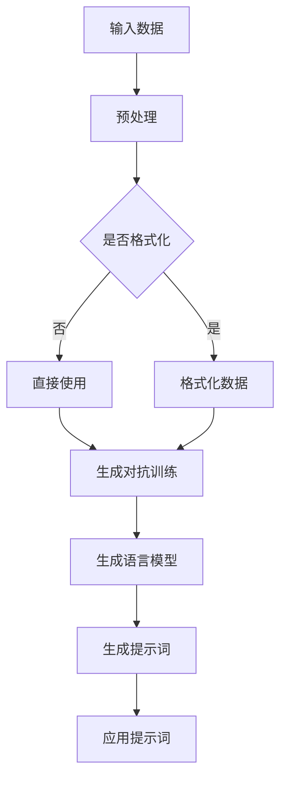

                 

## 引言：古文字解码的挑战与机遇

古文字是人类文明的重要组成部分，它们承载着历史、文化和语言的知识。然而，许多古文字至今仍未能被完全解码，这给历史学家、语言学家和考古学家带来了巨大的挑战。随着人工智能技术的快速发展，尤其是AIGC（自适应智能生成控制）技术的出现，古文字解码面临着前所未有的机遇。

### 背景介绍

古文字的研究对于理解人类历史和文化具有重要意义。古埃及的象形文字、玛雅人的奥尔梅克文字、中国的甲骨文等，都是古文明的重要遗产。然而，这些古文字中有很多由于年代久远和资料稀缺，至今未能被完全解读。例如，玛雅文字中的一些符号和句子至今仍然让人困惑不解，而甲骨文中的一些词汇和语法结构也需要进一步研究。

### 解码的挑战

古文字解码面临的主要挑战包括：

1. **资料稀缺**：许多古文字的文献资料已经散失或损坏，留下来的资料非常有限。
2. **符号复杂**：古文字的符号往往具有复杂的结构和含义，难以直接解读。
3. **语言变迁**：随着时间的推移，语言和语法规则会发生变化，这给古文字的理解带来了困难。

### 人工智能与AIGC

随着人工智能技术的发展，特别是深度学习和自然语言处理技术的进步，古文字解码的难题开始得到缓解。AIGC（自适应智能生成控制）技术是一种新型的计算机语言理解技术，它结合了生成对抗网络（GAN）和变换器（Transformer）等先进算法，能够在大量数据的基础上自动生成和优化语言模型。

### 跨时代语言理解提示词

AIGC的关键在于其能够生成高质量的提示词，这些提示词可以引导计算机更好地理解和分析古文字。跨时代语言理解提示词的优势在于：

1. **自动生成**：AIGC可以根据大量历史文献和数据自动生成提示词，提高解码效率。
2. **适应性**：提示词可以根据不同的古文字特点和语言环境进行自适应调整，提高解码准确性。
3. **扩展性**：AIGC能够不断学习和优化提示词，使其适应新的古文字研究需求。

通过AIGC技术，古文字解码不仅变得更加高效和准确，而且也为我们提供了新的研究方法和工具，为人类文明的研究开启了新的篇章。

### 总结

古文字解码是考古学和语言学领域的重要课题，而AIGC技术的引入为这一领域带来了革命性的变化。通过跨时代语言理解提示词的应用，我们可以期待在不久的将来，许多古老的文字将被解开其神秘的面纱，为人类文明的深入研究提供新的可能性。

----------------------------------------------------------------

## 关键词

- 古文字解码
- 人工智能
- AIGC
- 语言理解提示词
- 跨时代技术

----------------------------------------------------------------

## 摘要

本文深入探讨了AIGC（自适应智能生成控制）在古文字解码中的应用，并介绍了跨时代语言理解提示词的概念。通过分析古文字解码的挑战和人工智能技术的发展，本文阐述了AIGC如何通过自动生成和自适应调整提示词，提高古文字解码的效率和准确性。文章还提供了详细的算法原理讲解、实际应用案例和未来发展趋势，展示了AIGC在古文字研究领域的重要作用。

----------------------------------------------------------------

## 文章正文

### 第一部分：AIGC基础与原理

#### 第1章：AIGC概述

AIGC（自适应智能生成控制）是一种基于深度学习和自然语言处理的新型计算机语言理解技术。它通过生成对抗网络（GAN）和变换器（Transformer）等先进算法，能够在大量数据的基础上自动生成和优化语言模型。AIGC的核心在于其强大的自适应能力，能够在不同的语言环境和数据集中进行自我调整，从而实现高效的语言理解和生成。

#### 第2章：AIGC算法原理

AIGC的算法原理主要包括以下两个方面：

1. **生成对抗网络（GAN）**：GAN是一种由生成器和判别器组成的对抗网络。生成器负责生成新的数据，判别器则负责判断生成数据是否真实。通过这种对抗训练，生成器不断优化其生成能力，从而生成高质量的数据。
2. **变换器（Transformer）**：变换器是一种基于自注意力机制的深度神经网络，它能够在序列数据中捕捉长距离依赖关系。通过多层变换器堆叠，可以实现对复杂语言结构的建模和理解。

#### Mermaid流程图展示

下面是一个简单的Mermaid流程图，展示AIGC的基本工作流程：

### 第二部分：古文字解码

#### 第3章：古文字背景与重要性

古文字是人类文明的重要组成部分，它们记录了古代社会的政治、经济、文化和宗教等方面的重要信息。然而，许多古文字至今未能被完全解码，这限制了我们对古代文明的理解。古文字的研究对于历史学、语言学和文化研究具有重要意义，它能够帮助我们更好地了解人类的发展历程。

#### 第4章：古文字解码的挑战

古文字解码面临的主要挑战包括：

1. **资料稀缺**：许多古文字的文献资料已经散失或损坏，留下来的资料非常有限。
2. **符号复杂**：古文字的符号往往具有复杂的结构和含义，难以直接解读。
3. **语言变迁**：随着时间的推移，语言和语法规则会发生变化，这给古文字的理解带来了困难。

#### 第5章：AIGC在古文字解码中的应用

AIGC在古文字解码中的应用主要体现在以下几个方面：

1. **自动生成提示词**：AIGC可以通过自动生成提示词，引导计算机更好地理解和分析古文字。
2. **自适应调整**：AIGC可以根据不同的古文字特点和语言环境，对提示词进行自适应调整，提高解码准确性。
3. **扩展性**：AIGC能够不断学习和优化提示词，使其适应新的古文字研究需求。

### 第三部分：语言理解提示词

#### 第6章：提示词概述

提示词是一种用于指导计算机理解和生成文本的技术。在古文字解码中，提示词可以帮助计算机更好地捕捉文字的含义和结构，从而提高解码的效率和准确性。提示词可以分为以下几种类型：

1. **词性提示词**：用于指示文本中的词性，如名词、动词、形容词等。
2. **语法提示词**：用于指示文本中的语法结构，如主语、谓语、宾语等。
3. **上下文提示词**：用于指示文本的上下文信息，如时间、地点、人物等。

#### 第7章：提示词的开发流程

提示词的开发流程主要包括以下几个步骤：

1. **数据收集**：收集与古文字相关的文献资料和数据。
2. **预处理**：对收集到的数据进行清洗和格式化，以便于后续处理。
3. **模型训练**：使用深度学习模型对预处理后的数据进行训练，生成初步的提示词。
4. **优化调整**：根据解码结果，对提示词进行优化和调整，提高解码准确性。

### 第四部分：跨时代语言理解提示词

#### 第8章：跨时代语言理解提示词的优势

跨时代语言理解提示词具有以下优势：

1. **自动生成**：AIGC可以自动生成高质量的提示词，提高解码效率。
2. **适应性**：提示词可以根据不同的古文字特点和语言环境进行自适应调整，提高解码准确性。
3. **扩展性**：AIGC能够不断学习和优化提示词，使其适应新的古文字研究需求。

#### 第9章：案例分析与讨论

本章节将分析几个具体的古文字解码案例，讨论如何使用AIGC和跨时代语言理解提示词进行解码，并分析解码过程中的挑战和解决方案。

### 第五部分：未来的发展趋势与展望

#### 第10章：未来发展趋势

随着人工智能技术的不断进步，AIGC在古文字解码中的应用前景十分广阔。未来的发展趋势包括：

1. **更高效的算法**：研究人员将开发更高效的AIGC算法，提高解码速度和准确性。
2. **更大规模的数据集**：收集和整理更多的古文字数据集，为AIGC提供更丰富的训练资源。
3. **多语言支持**：AIGC将支持多种古文字的解码，为不同语言的研究提供支持。

#### 第11章：展望与挑战

在展望AIGC在古文字解码中的应用时，我们还需要面对以下几个挑战：

1. **数据稀缺**：古文字文献资料稀缺，如何有效利用现有资源是一个重要问题。
2. **模型可解释性**：AIGC生成的解码结果如何保证可解释性，使研究人员能够理解和验证解码结果。
3. **跨学科合作**：古文字解码需要计算机科学、语言学、历史学等多学科的协同研究，如何实现跨学科合作是一个重要课题。

### 总结

AIGC在古文字解码中的应用为这一领域带来了革命性的变化。通过跨时代语言理解提示词的应用，我们可以期待在不久的将来，许多古老的文字将被解开其神秘的面纱，为人类文明的研究提供新的可能性。本文详细介绍了AIGC的基本原理、古文字解码的挑战与机遇、提示词的开发流程以及未来的发展趋势，展示了AIGC在古文字研究领域的重要作用。

----------------------------------------------------------------

作者：AI天才研究院/AI Genius Institute & 禅与计算机程序设计艺术 /Zen And The Art of Computer Programming

