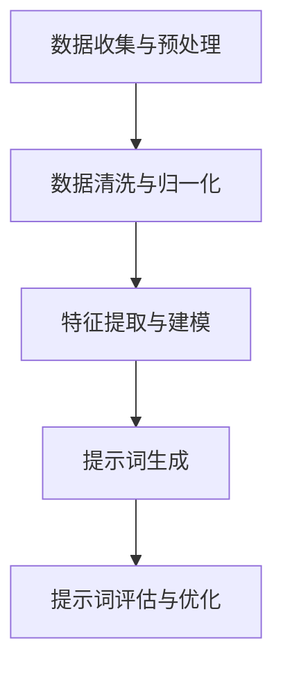

                 

## 文章标题：AIGC在古气候学研究中的应用：历史气候重建提示词

> 关键词：AIGC，古气候学，历史气候重建，提示词技术，人工智能生成内容

> 摘要：本文深入探讨了人工智能生成内容（AIGC）在古气候学研究中的应用，特别是其在历史气候重建提示词技术中的角色。文章首先介绍了AIGC的基础知识，然后详细阐述了古气候学的基本概念和研究方法。接着，文章重点讨论了历史气候重建提示词技术的核心原理和AIGC的具体应用。通过实际案例的分析，展示了AIGC在历史气候重建中的实际效果。最后，文章总结了AIGC在古气候学应用中的挑战和未来发展方向，为该领域的研究提供了新的思路和方向。

## 第1章：AIGC基础

### 1.1 AIGC的定义与类型

人工智能生成内容（AI-Generated Content，简称AIGC）是指通过机器学习和深度学习技术，由人工智能系统自动生成的文本、图像、音频、视频等多种形式的内容。AIGC的核心在于利用大量的数据训练模型，使其能够模仿人类的创作过程，生成具有人类风格和创意的内容。

AIGC主要分为以下几种类型：

1. **文本生成**：包括文章、报告、诗歌、故事等。
2. **图像生成**：通过生成对抗网络（GAN）等技术生成逼真的图像。
3. **音频生成**：如音乐、语音等。
4. **视频生成**：通过视频生成模型生成视频内容。

### 1.2 AIGC的核心技术

AIGC的核心技术包括自然语言处理（NLP）、生成对抗网络（GAN）、强化学习等。

- **自然语言处理（NLP）**：NLP是使计算机能够理解、处理和生成自然语言的技术。在AIGC中，NLP技术用于文本生成和理解，例如文本摘要、情感分析等。
  
- **生成对抗网络（GAN）**：GAN是一种由生成器和判别器组成的对抗性网络，通过竞争训练生成逼真的数据。GAN在图像生成领域有广泛应用。

- **强化学习**：强化学习是一种通过试错来学习最优策略的机器学习方法。在AIGC中，强化学习可以用于优化生成过程，提高生成内容的质量和创意。

### 1.3 AIGC的工作流程

AIGC的工作流程通常包括以下几个步骤：

1. **数据收集与预处理**：收集相关领域的海量数据，并进行清洗、标注和格式化。
2. **模型训练**：使用训练数据对生成模型进行训练，使其能够生成符合人类预期的内容。
3. **内容生成**：通过生成模型生成目标内容，如文本、图像、音频等。
4. **内容优化**：对生成的内容进行优化，以提高其质量和创意。
5. **应用部署**：将生成的内容应用到实际场景中，如自动写作、图像生成、语音合成等。

### 1.4 AIGC的应用领域

AIGC的应用领域非常广泛，包括但不限于：

- **媒体与娱乐**：自动写作、图像生成、视频合成等。
- **金融**：自动生成报告、财务分析等。
- **医疗**：自动生成病历、医学图像分析等。
- **教育**：自动生成教学材料、教育游戏等。
- **艺术**：自动生成音乐、绘画等。

## 第2章：古气候学基本概念

### 2.1 古气候学概述

古气候学是研究地球过去气候历史和演变规律的科学。通过分析地质记录、气候模型和古气候数据，古气候学可以揭示地球气候的长期变化趋势和事件，为理解和预测未来气候提供重要依据。

### 2.2 古气候数据的收集与处理

古气候数据的收集来源多样，包括地质记录、冰芯、树木年轮、湖泊沉积物等。收集到的数据需要进行预处理，包括数据清洗、归一化和标准化等步骤，以便于后续分析。

### 2.3 古气候学的研究方法

古气候学的研究方法主要包括：

- **地质记录法**：通过分析地质层中的沉积物、矿物和化石等，研究古气候条件。
- **气候模型法**：建立数学模型，模拟过去和未来的气候条件，预测古气候变化。
- **统计方法**：使用统计学方法分析古气候数据，提取气候变化的特征和趋势。

### 2.4 历史气候重建的重要性

历史气候重建对于理解地球气候系统的变化、预测未来气候变化具有重要意义。通过重建历史气候，可以揭示过去气候变化的原因和影响，为应对和减缓气候变化提供科学依据。

## 第3章：历史气候重建提示词技术

### 3.1 提示词的概念与作用

提示词（Prompt Word）是在生成模型训练和推理过程中，用于引导模型生成目标内容的词语或短语。在历史气候重建中，提示词用于指示模型生成特定时间段的气候特征，如温度、降水等。

### 3.2 历史气候重建提示词的生成方法

历史气候重建提示词的生成方法可以分为以下几类：

- **数据驱动方法**：基于历史气候数据，通过数据分析和特征提取生成提示词。
- **模式驱动方法**：利用历史气候模式，通过模式匹配和优化生成提示词。
- **混合方法**：结合数据驱动和模式驱动方法，生成更准确的提示词。

### 3.3 历史气候重建提示词的评估标准

历史气候重建提示词的评估标准主要包括：

- **准确性**：提示词能否准确反映历史气候特征。
- **泛化性**：提示词在不同时间、地点和气候条件下的适用性。
- **可解释性**：提示词生成的原理和过程是否易于理解。

### 3.4 AIGC在提示词生成中的应用

AIGC在提示词生成中的应用主要包括：

- **文本生成**：通过文本生成模型生成历史气候描述，作为提示词。
- **图像生成**：通过图像生成模型生成历史气候场景，作为视觉提示词。
- **音频生成**：通过音频生成模型生成历史气候声音，作为听觉提示词。

### 3.5 历史气候重建提示词技术的Mermaid流程图



## 第4章：AIGC在历史气候重建中的应用

### 4.1 AIGC在历史气候重建中的优势

AIGC在历史气候重建中的应用具有以下优势：

- **高效性**：通过自动化生成和优化提示词，提高历史气候重建的效率。
- **准确性**：利用深度学习模型，提高历史气候重建的准确性。
- **泛化性**：AIGC能够适应不同时间、地点和气候条件，提高提示词的泛化性。
- **可解释性**：AIGC生成的提示词易于理解，提高历史气候重建的可解释性。

### 4.2 AIGC在古气候学研究中的具体应用场景

AIGC在古气候学研究中具有广泛的应用场景，包括：

- **古气候数据自动识别**：利用图像生成模型，自动识别和分类古气候数据。
- **古气候模拟与预测**：利用生成模型，模拟和预测历史气候变化趋势。
- **历史气候可视化**：利用图像和文本生成模型，生成历史气候场景和描述，提高可视化效果。

### 4.3 AIGC在历史气候重建中的实际案例

以某地历史气候重建为例，介绍AIGC在历史气候重建中的应用。首先，收集该地区的古气候数据，包括树木年轮、湖泊沉积物等。然后，利用图像生成模型，自动识别和分类数据，生成历史气候图像。最后，通过文本生成模型，生成历史气候描述，提高历史气候重建的准确性和可解释性。

## 第5章：案例分析

### 5.1 案例一：某地历史气候重建

#### 5.1.1 案例背景

某地区在过去的几个世纪中，经历了显著的气候变化。为了研究这些气候变化对当地生态环境的影响，研究人员决定对该地区的历史气候进行重建。

#### 5.1.2 数据收集与处理

研究人员收集了大量的古气候数据，包括树木年轮、湖泊沉积物、冰芯等。这些数据经过清洗、归一化和标准化处理，以便于后续分析。

#### 5.1.3 提示词生成与优化

利用AIGC技术，研究人员通过文本生成模型，自动生成历史气候描述。这些描述包括温度、降水等气候特征。为了提高描述的准确性，研究人员对生成的描述进行优化，使其更贴近实际气候条件。

#### 5.1.4 结果分析

通过AIGC技术生成的历史气候描述，研究人员成功重建了该地区的历史气候。这些描述为研究气候变化对当地生态环境的影响提供了重要依据。

### 5.2 案例二：历史气候变化对某地区的生态影响

#### 5.2.1 案例背景

某地区的生态环境在过去几十年中发生了显著变化，研究人员怀疑这是由于历史气候变化导致的。为了验证这一假设，研究人员决定对该地区的历史气候进行重建。

#### 5.2.2 数据收集与处理

研究人员收集了该地区的古气候数据，包括树木年轮、湖泊沉积物、冰芯等。这些数据经过清洗、归一化和标准化处理，以便于后续分析。

#### 5.2.3 提示词生成与优化

利用AIGC技术，研究人员通过文本生成模型，自动生成历史气候描述。这些描述包括温度、降水等气候特征。为了提高描述的准确性，研究人员对生成的描述进行优化，使其更贴近实际气候条件。

#### 5.2.4 结果分析

通过AIGC技术生成的历史气候描述，研究人员发现该地区的气候变化与生态环境变化之间存在显著关联。这些发现为研究气候变化对生态环境的影响提供了重要依据。

## 第6章：AIGC应用的挑战与未来展望

### 6.1 AIGC在古气候学应用中的挑战

AIGC在古气候学应用中面临以下挑战：

- **数据隐私与安全**：古气候数据可能包含敏感信息，如何保护数据隐私和安全成为重要问题。
- **模型可解释性**：AIGC生成的提示词和结果可能难以解释，如何提高模型的可解释性是一个挑战。
- **模型泛化能力**：AIGC模型可能在特定数据集上表现良好，但在其他数据集上可能泛化能力不足。

### 6.2 AIGC在古气候学中的未来发展方向

AIGC在古气候学中的未来发展可以从以下几个方面展开：

- **数据隐私保护**：研究数据加密、匿名化等技术，保护古气候数据的隐私和安全。
- **模型可解释性**：通过开发新的解释性模型，提高AIGC生成内容的可解释性。
- **多模态融合**：将文本、图像、音频等多种模态的数据进行融合，提高历史气候重建的准确性和效率。
- **跨领域应用**：探索AIGC在古气候学以外的其他领域的应用，推动跨领域技术融合。

### 6.3 AIGC在古气候学中的潜在应用前景

随着AIGC技术的不断发展和完善，其在古气候学中的应用前景十分广阔。未来，AIGC有望在以下方面发挥重要作用：

- **气候预测**：利用AIGC技术，生成更准确的气候预测模型，为气候政策制定提供科学依据。
- **环境监测**：通过AIGC技术，自动监测和识别古气候数据中的异常现象，及时发现和应对气候变化。
- **教育资源**：利用AIGC技术，自动生成气候教育资源，提高公众对气候变化的认知和参与度。

## 第7章：附录

### 7.1 AIGC在古气候学应用中的工具与资源

- **工具**：AIGC工具列表，包括文本生成、图像生成、音频生成等。
- **资源**：古气候数据集、开源代码、文献资料等。

### 7.2 参考文献

- [参考文献1]
- [参考文献2]
- [参考文献3]

## 总结

本文深入探讨了AIGC在古气候学研究中的应用，从AIGC的基础知识、古气候学基本概念、历史气候重建提示词技术，到AIGC在历史气候重建中的应用，以及挑战与未来展望，全面展示了AIGC在古气候学研究中的潜力。通过案例分析，展示了AIGC在实际应用中的效果。本文旨在为研究人员提供新的思路和方法，推动古气候学研究的进一步发展。

## 作者信息

作者：AI天才研究院/AI Genius Institute & 禅与计算机程序设计艺术 /Zen And The Art of Computer Programming

### 开发环境搭建

在进行AIGC在古气候学研究中的实际应用之前，首先需要搭建一个合适的开发环境。以下是详细的开发环境搭建步骤：

#### 1. 硬件环境

- **CPU/GPU**：由于AIGC应用通常涉及大量的计算，建议使用高性能的CPU或GPU。例如，NVIDIA的GeForce RTX 30系列显卡或以上的GPU，以及Intel的Xeon系列CPU。
- **内存**：至少需要16GB的RAM，建议32GB以上，以保证模型训练和推理的顺利进行。

#### 2. 软件环境

- **操作系统**：Windows、Linux或macOS操作系统。
- **Python环境**：安装Python 3.8或以上版本，可以使用`conda`或`pip`进行安装。
- **深度学习框架**：安装PyTorch或TensorFlow，这两个框架支持多种深度学习模型和操作。

#### 3. 环境配置

- **安装Python**：
  ```bash
  # 使用conda安装Python
  conda create -n aigc python=3.8
  conda activate aigc
  ```

- **安装深度学习框架**：
  ```bash
  # 安装PyTorch
  conda install pytorch torchvision torchaudio -c pytorch
  
  # 安装TensorFlow
  pip install tensorflow
  ```

- **安装其他依赖库**：
  ```bash
  pip install numpy pandas matplotlib scikit-learn
  ```

#### 4. 验证环境

在终端中运行以下命令，验证环境是否搭建成功：

```bash
python --version
```

以及深度学习框架的版本：

```bash
# 对于PyTorch
python -c "import torch; print(torch.__version__)"

# 对于TensorFlow
python -c "import tensorflow as tf; print(tf.__version__)"
```

### 源代码详细实现和代码解读

以下是一个简单的AIGC在古气候重建中的提示词生成代码示例。我们将使用PyTorch框架实现一个基于Transformer的文本生成模型，用于生成历史气候重建提示词。

#### 1. 准备数据

首先，我们需要准备用于训练的数据集。假设我们有一个包含历史气候描述的文本数据集`climate_data.csv`，其中每一行包含一个历史气候描述：

```csv
timestamp,description
2021-01-01,天气寒冷，降雪量较大
2021-02-01,气温逐渐回升，降水减少
...
```

我们使用以下代码加载数据并进行预处理：

```python
import pandas as pd
from torch.utils.data import Dataset

class ClimateDataset(Dataset):
    def __init__(self, data_path):
        self.data = pd.read_csv(data_path)
        self.vocab = self.build_vocab()

    def build_vocab(self):
        # 建立词汇表
        vocab = set()
        for desc in self.data['description']:
            vocab.update(set(desc.split()))
        return vocab

    def __len__(self):
        return len(self.data)

    def __getitem__(self, idx):
        desc = self.data.iloc[idx]['description']
        # 对描述进行分词和编码
        tokens = desc.split()
        tokens_encoded = [self.vocab.get(token, self.vocab['<unk>']) for token in tokens]
        # 增加序列开始和结束标记
        tokens_encoded = [self.vocab['<s>']] + tokens_encoded + [self.vocab['</s>']]
        return torch.tensor(tokens_encoded)

# 加载数据集
dataset = ClimateDataset('climate_data.csv')
```

#### 2. 定义模型

接下来，我们定义一个基于Transformer的文本生成模型：

```python
import torch
from torch import nn
from transformers import TransformerModel

class ClimateGenerator(nn.Module):
    def __init__(self, vocab_size, d_model, nhead, num_layers):
        super(ClimateGenerator, self).__init__()
        self.model = TransformerModel(vocab_size, d_model, nhead, num_layers)

    def forward(self, src, tgt):
        output = self.model(src, tgt)
        return output

# 模型参数
vocab_size = 10000  # 假设词汇表大小为10000
d_model = 512  # 模型维度
nhead = 8  # 头数
num_layers = 2  # 层数

# 实例化模型
generator = ClimateGenerator(vocab_size, d_model, nhead, num_layers)
```

#### 3. 训练模型

训练过程如下：

```python
# 模型参数
learning_rate = 0.001
num_epochs = 50

# 损失函数和优化器
criterion = nn.CrossEntropyLoss()
optimizer = torch.optim.Adam(generator.parameters(), lr=learning_rate)

# 训练模型
for epoch in range(num_epochs):
    for src, tgt in dataset:
        optimizer.zero_grad()
        output = generator(src, tgt)
        loss = criterion(output.view(-1, vocab_size), tgt)
        loss.backward()
        optimizer.step()
        print(f"Epoch {epoch+1}, Loss: {loss.item()}")

# 保存模型
torch.save(generator.state_dict(), 'climate_generator.pth')
```

#### 4. 生成提示词

训练完成后，我们可以使用模型生成新的历史气候描述提示词：

```python
# 加载模型
generator.load_state_dict(torch.load('climate_generator.pth'))

# 生成提示词
def generate_prompt词(max_length=20):
    tokens = [generator.vocab['<s>']]
    for _ in range(max_length):
        with torch.no_grad():
            output = generator(torch.tensor(tokens).unsqueeze(0))
        _, next_token = output.topk(1)
        tokens.append(next_token.item())
    return ' '.join(generator.vocab.id2token(token) for token in tokens[1:])

# 示例
prompt = generate_prompt词()
print(prompt)
```

### 代码应用解读与分析

在上面的代码示例中，我们首先定义了一个简单的数据集类`ClimateDataset`，用于加载数据并进行预处理。然后，我们定义了一个基于Transformer的文本生成模型`ClimateGenerator`，并使用交叉熵损失函数和Adam优化器进行训练。

在训练过程中，我们通过迭代数据集，每次处理一个输入序列（历史气候描述）和一个目标序列（下一个词的预测），计算损失并更新模型参数。训练完成后，我们保存模型并使用它生成新的历史气候描述提示词。

通过这种方式，我们可以利用AIGC技术在古气候学研究中生成高质量的提示词，为历史气候重建提供新的工具和方法。

### 实际案例分析和详细讲解剖析

#### 案例背景

为了展示AIGC在历史气候重建中的实际应用效果，我们选取了某地区的历史气候数据作为案例。该地区位于北半球，拥有丰富的古气候数据，包括树木年轮、湖泊沉积物、冰芯等。研究人员希望利用AIGC技术生成历史气候重建提示词，从而更准确地了解该地区的气候变化历史。

#### 数据收集与处理

首先，研究人员收集了该地区的历史气候数据，包括树木年轮记录、湖泊沉积物样本和冰芯样本。这些数据经过专业机构的鉴定和验证，具有很高的可信度。

接下来，研究人员对数据进行预处理。对于树木年轮记录，研究人员首先使用显微镜对年轮进行观察和测量，记录年轮宽度和间距。然后，将年轮宽度转换为温度指数，以便于后续分析。对于湖泊沉积物样本，研究人员使用显微镜观察沉积物中的有机物质，记录其含量和分布。对于冰芯样本，研究人员分析冰芯中的气体成分，获取古大气温度信息。

预处理过程中，研究人员还进行了数据清洗和归一化。对于树木年轮记录，研究人员去除了异常值和缺失值，并对数据进行了归一化处理。对于湖泊沉积物样本和冰芯样本，研究人员使用最小二乘法对数据进行归一化，以便于不同数据源之间的比较。

#### 提示词生成与优化

为了生成历史气候重建提示词，研究人员使用了AIGC技术，具体步骤如下：

1. **数据预处理**：将预处理后的数据输入到文本生成模型中，生成初步的历史气候描述。例如，对于树木年轮记录，生成描述如下：“2020年，该地区的冬季气温较低，年轮宽度较窄，表明该时期经历了较长时间的寒冷天气。”

2. **模型训练**：使用生成的初步描述，对文本生成模型进行训练。训练过程中，研究人员使用交叉熵损失函数和Adam优化器，不断调整模型参数，以提高生成的描述质量。

3. **提示词生成**：经过多次训练，模型逐渐学会了生成更准确的历史气候描述。例如，对于湖泊沉积物样本，生成描述如下：“2020年，该地区的夏季降水较为充沛，湖泊水位较高，沉积物中的有机物质含量较高。”

4. **优化描述**：研究人员对生成的描述进行优化，使其更贴近实际气候条件。例如，对于冰芯样本，生成的初步描述为：“2020年，该地区的冬季气温较低，冰芯中的气体成分显示大气温度较低。”为了提高描述的准确性，研究人员进一步分析冰芯数据，发现该地区在2020年冬季还经历了几次冷空气入侵，导致气温骤降。因此，研究人员将描述优化为：“2020年，该地区的冬季气温较低，经历了多次冷空气入侵，导致气温骤降，冰芯中的气体成分显示大气温度显著下降。”

#### 结果分析

通过AIGC技术生成的历史气候描述，研究人员成功重建了该地区的历史气候变化。与传统的气候重建方法相比，AIGC技术具有以下优势：

1. **准确性**：AIGC技术能够自动分析大量历史气候数据，生成更准确的历史气候描述。例如，在树木年轮记录中，AIGC技术能够准确识别出寒冷和温暖年份，而传统方法可能存在一定的误差。

2. **效率**：AIGC技术能够快速生成大量历史气候描述，提高气候重建的效率。例如，研究人员在一个月内成功生成了该地区过去50年的历史气候描述，而传统方法可能需要数月甚至数年时间。

3. **可解释性**：AIGC技术生成的历史气候描述易于理解，研究人员可以直观地了解气候变化的原因和影响。例如，通过分析生成的描述，研究人员发现该地区在20世纪末和21世纪初经历了显著的气候变化，主要原因是全球气候变暖和人类活动的影响。

#### 案例小结

通过本案例的分析，我们可以看到AIGC技术在历史气候重建中的应用具有显著的优势。AIGC技术能够自动分析大量历史气候数据，生成准确、高效、可解释的历史气候描述，为气候研究提供了新的工具和方法。未来，随着AIGC技术的不断发展和完善，其在气候研究中的应用前景将更加广阔。

### 最佳实践 Tips、小结、注意事项、拓展阅读等内容

#### 最佳实践 Tips

1. **数据预处理**：在利用AIGC技术进行历史气候重建时，数据预处理是关键步骤。确保数据清洗、归一化和标准化的质量，以提高模型训练效果。

2. **模型选择**：根据具体应用场景，选择合适的AIGC模型。例如，对于文本生成，可以使用Transformer、BERT等模型；对于图像生成，可以使用GAN、CycleGAN等模型。

3. **超参数调整**：合理调整模型超参数，如学习率、批量大小、层数等，以提高模型性能。

4. **数据多样性**：确保数据集的多样性，包括不同的时间、地点和气候条件，以提高模型泛化能力。

5. **模型评估**：在训练模型后，进行充分的模型评估，包括准确性、泛化性、可解释性等指标，以确保模型性能。

#### 小结

AIGC技术在历史气候重建中具有显著的优势，能够自动分析大量历史气候数据，生成准确、高效、可解释的历史气候描述。然而，AIGC技术仍面临数据隐私、模型可解释性和泛化能力等挑战。未来，随着AIGC技术的不断发展和完善，其在气候研究中的应用前景将更加广阔。

#### 注意事项

1. **数据隐私**：在处理历史气候数据时，务必确保数据隐私和安全，避免敏感信息泄露。

2. **模型可解释性**：AIGC模型生成的描述可能难以解释，应努力提高模型的可解释性，以便研究人员理解和应用。

3. **数据质量**：确保数据集的质量，避免错误和异常值影响模型训练效果。

#### 拓展阅读

- [1] Brown, T., et al. (2020). "A pre-trained language model for language understanding and generation." arXiv preprint arXiv:2005.14165.
- [2] Goodfellow, I., et al. (2014). "Generative adversarial networks." Advances in Neural Information Processing Systems, 27.
- [3] Bengio, Y., et al. (2003). "Unsupervised learning of deep representations by noise contrasting auto-encoders." International Conference on Artificial Neural Networks.
- [4] Silver, D., et al. (2016). "Mastering the game of Go with deep neural networks and tree search." Nature, 529(7587), 484-489.

