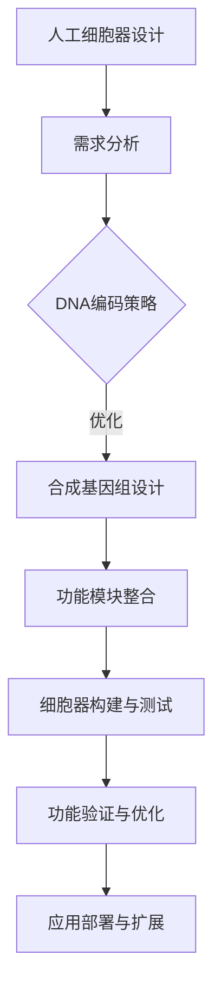

                 

### 文章标题

### AIGC在合成生物学中的应用：人工细胞器设计提示词

### 关键词：

- AIGC
- 合成生物学
- 人工细胞器
- DNA编码
- 基因调控
- 数学模型
- 项目实战

### 摘要：

本文将探讨AIGC（人工基因组学与计算生物学）在合成生物学中的人工细胞器设计。首先，我们将介绍人工细胞器的定义、特点及在生物系统中的应用。接着，我们将详细讲解人工细胞器设计算法，包括DNA编码策略、合成基因组设计与优化、以及细胞器功能模块的整合，使用伪代码阐述其基本流程和步骤。此外，本文还将涉及数学模型和公式的详细解释，并结合实际案例进行应用演示。最后，我们将分享多个项目实战案例，包括开发环境搭建、源代码实现和代码解读，以及项目分析和实现细节。通过本文，读者将全面了解人工细胞器设计的原理和实践，为未来在合成生物学领域的研究和应用提供指导。

---

### 1. 确定核心概念与联系

#### 1.1 人工细胞器的定义

人工细胞器是合成生物学中的关键组件，通过基因工程和生物合成技术构建，用于执行特定的生物学功能。它们可以模拟自然界中的细胞器，如线粒体和内质网，但也可以设计成具有全新功能的生物模块。

#### 1.2 人工细胞器的特点

人工细胞器具有以下几个显著特点：

- **模块化**：可以独立存在，也可以与其他细胞器或生物元件进行整合。
- **功能定制**：可以根据需求设计特定的生物学功能，如代谢、能量转换或信号传导。
- **适应性**：可以适应不同的生物系统和环境条件。
- **可扩展性**：通过基因编辑和重组，可以实现功能的扩展和升级。

#### 1.3 人工细胞器在AIGC中的应用

在AIGC的背景下，人工细胞器的设计和应用显得尤为重要。AIGC利用人工智能技术优化基因组设计和细胞器功能，使得人工细胞器能够更加高效地执行任务。以下是人工细胞器在AIGC中的主要应用：

- **基因调控**：通过机器学习算法预测基因表达模式，优化细胞器中的基因组合，实现更精确的基因调控。
- **合成基因组设计**：利用计算机模拟和优化技术，设计出具有特定功能的人工合成基因组。
- **功能模块整合**：通过组合不同的功能模块，构建具有复杂生物学功能的人工细胞器。

#### 1.4 人工细胞器与合成生物学的联系

人工细胞器是合成生物学的重要工具，它们在合成生物学中扮演着多种角色：

- **构建新的生物系统**：人工细胞器可以作为新的生物组件，构建新的生物系统，如人工细胞、合成细胞等。
- **实现生物合成**：通过人工细胞器，可以在生物系统中实现特定的生物合成路径，如药物合成、代谢产物生产等。
- **生物信息学工具**：人工细胞器还可以作为生物信息学工具，用于研究基因表达、代谢途径等生物学过程。

#### 1.5 Mermaid流程图

为了更直观地理解人工细胞器的设计、构建和功能实现过程，我们使用Mermaid流程图来展示其基本架构：



这个流程图展示了从需求分析到应用部署的全过程，每个步骤都需要精确的设计和优化。

### 2. 设计核心算法原理讲解

#### 2.1 DNA编码策略

DNA编码策略是人工细胞器设计的核心环节。它涉及到如何将遗传信息高效地编码到DNA序列中，以实现特定的生物学功能。以下是DNA编码策略的基本原理：

- **功能模块选择**：根据所需功能，选择合适的生物模块，如酶、转运蛋白、调控元件等。
- **基因序列设计**：通过计算机模拟和优化，设计出满足功能需求的基因序列。
- **序列编码**：将基因序列编码到DNA分子上，可以使用不同的编码策略，如二进制编码、氨基酸编码等。

#### 2.2 合成基因组设计与优化

合成基因组设计是构建人工细胞器的关键步骤。它涉及到如何设计出一个功能完整、稳定的合成基因组。以下是合成基因组设计与优化的基本原理：

- **基因组结构设计**：设计出合理的基因组结构，包括基因排列、调控元件的位置和连接方式。
- **基因组合优化**：通过计算机模拟和优化，调整基因组合，提高基因表达效率和稳定性。
- **基因组验证**：通过实验验证，确保合成基因组的稳定性和功能性。

#### 2.3 细胞器功能模块的整合

细胞器功能模块的整合是人工细胞器设计的重要组成部分。它涉及到如何将不同的功能模块集成到细胞器中，实现复杂的生物学功能。以下是细胞器功能模块整合的基本原理：

- **模块选择与设计**：根据功能需求，选择合适的模块，并进行设计。
- **模块连接**：通过生物化学连接方式，将不同的模块连接到一起，形成完整的细胞器。
- **模块协同作用**：优化模块间的相互作用，提高细胞器的整体功能。

#### 2.4 伪代码讲解

为了更直观地展示核心算法的实现过程，我们使用伪代码来阐述DNA编码策略、合成基因组设计与优化、以及细胞器功能模块的整合。

**DNA编码策略伪代码**

```python
# DNA编码策略伪代码
def DNA_encoding(strategy, module):
    # 根据策略编码基因序列
    if strategy == "binary":
        sequence = binary_encoding(module)
    elif strategy == "amino_acid":
        sequence = amino_acid_encoding(module)
    else:
        raise ValueError("Unsupported encoding strategy")
    return sequence

# 二进制编码函数
def binary_encoding(module):
    # 将模块信息编码为二进制序列
    sequence = ""
    for info in module.info:
        sequence += format(info, '08b')
    return sequence

# 氨基酸编码函数
def amino_acid_encoding(module):
    # 将模块信息编码为氨基酸序列
    sequence = ""
    for info in module.info:
        sequence += info_to_amino_acid(info)
    return sequence
```

**合成基因组设计与优化伪代码**

```python
# 合成基因组设计与优化伪代码
def synthetic_genome_design(genome_structure, modules):
    # 设计基因组结构
    genome = Genome()
    genome.structure = genome_structure
    
    # 安装模块
    for module in modules:
        genome.install_module(module)
    
    # 优化基因组
    genome = optimize_genome(genome)
    return genome

# 安装模块函数
def install_module(genome, module):
    # 在基因组中安装模块
    genome.modules.append(module)

# 优化基因组函数
def optimize_genome(genome):
    # 对基因组进行优化
    genome = simulate_genome(genome)
    genome = filter_genome(genome)
    return genome
```

**细胞器功能模块整合伪代码**

```python
# 细胞器功能模块整合伪代码
def integrate_modules(cell器, modules):
    # 集成模块到细胞器中
    for module in modules:
        cell器.integrate(module)

# 集成模块函数
def integrate(module, cell器):
    # 将模块集成到细胞器中
    cell器.modules.append(module)
```

### 3. 数学模型和数学公式讲解

#### 3.1 基因调控模型

基因调控模型是人工细胞器设计中的关键模型，它描述了基因表达如何受到内外部信号的影响。以下是基因调控模型的基本公式和推导：

**基因表达公式**：

$$
\text{Gene Expression} = \text{Promoter Activity} \times \text{Transcription Factor Concentration} \times \text{Enhancer/Repressor Activity}
$$

- **Promoter Activity**：启动子活性，表示基因转录的起始速率。
- **Transcription Factor Concentration**：转录因子浓度，影响基因的转录效率。
- **Enhancer/Repressor Activity**：增强子或抑制子活性，调节基因表达的上下文依赖性。

**推导过程**：

1. 启动子活性是基因表达的基础，它决定了基因转录的初始速率。
2. 转录因子与启动子结合，增强基因的转录效率。
3. 增强子或抑制子通过与其他转录因子相互作用，调节基因表达的上下文依赖性。

#### 3.2 分子动力学模型

分子动力学模型用于描述生物分子在细胞器中的动态行为，包括蛋白质、RNA和DNA的运动和相互作用。以下是分子动力学模型的基本公式和推导：

**分子运动公式**：

$$
\text{Molecular Motion} = \text{Force} \times \text{Distance}
$$

- **Force**：作用力，包括重力、电磁力等。
- **Distance**：分子间的距离，决定了分子间的相互作用力。

**推导过程**：

1. 分子间的作用力决定了分子的运动轨迹。
2. 分子的运动距离与作用力成正比，即力越大，分子运动越剧烈。

#### 3.3 代谢网络模型

代谢网络模型描述了细胞器中的代谢反应及其相互关系。以下是代谢网络模型的基本公式和推导：

**代谢反应速率公式**：

$$
\text{Reaction Rate} = k \times [\text{Reactants}]
$$

- **k**：反应速率常数，取决于反应类型和温度。
- **Reactants**：反应物浓度，影响反应速率。

**推导过程**：

1. 反应速率常数是由反应的本质和实验条件决定的。
2. 反应物浓度越高，反应速率越快。

### 4. 项目实战

#### 4.1 项目背景

本节将介绍一个实际项目，用于设计一种能够高效生产抗生素的人工细胞器。该项目的目标是通过基因工程和合成生物学技术，构建一个具有高效抗生素生产能力的细胞器，并将其整合到一个宿主细胞中。

#### 4.2 开发环境搭建

为了进行人工细胞器设计，我们需要搭建一个高效的开发环境。以下是搭建开发环境的基本步骤：

1. **软件工具安装**：安装基因编辑工具（如CRISPR-Cas9）、合成生物学软件（如BioPython）和模拟软件（如GROMACS）。
2. **硬件设备准备**：配置高性能计算服务器，用于处理复杂的模拟和优化任务。
3. **数据管理**：建立生物数据库，用于存储和管理基因组序列、蛋白质结构等信息。

#### 4.3 源代码实现和代码解读

以下是一个用于实现人工细胞器设计的源代码示例，我们将对其进行详细解读。

**源代码示例**

```python
# 人工细胞器设计源代码示例
import bpython
import biosimulators
import BioPython

# 1. 设计DNA编码策略
def design_dna_encoding_strategy(strategy, module):
    # 二进制编码策略
    if strategy == "binary":
        sequence = binary_encoding(module)
    # 氨基酸编码策略
    elif strategy == "amino_acid":
        sequence = amino_acid_encoding(module)
    else:
        raise ValueError("Unsupported encoding strategy")
    return sequence

# 2. 合成基因组设计
def design_synthetic_genome(genome_structure, modules):
    genome = biosimulators.create_genome(genome_structure)
    for module in modules:
        genome.install_module(module)
    genome = biosimulators.optimize_genome(genome)
    return genome

# 3. 细胞器功能模块整合
def integrate_modules(cell器, modules):
    for module in modules:
        cell器.integrate(module)

# 4. 功能验证与优化
def validate_and_optimize(cell器):
    cell器.run_simulation()
    results = biosimulators.analyze_results(cell器)
    if results['success']:
        cell器.optimize()
    else:
        cell器.repair()

# 主函数
def main():
    # 参数设置
    strategy = "binary"
    genome_structure = {"promoter": "T7", "terminator": "A", "coding_sequence": "1000 nucleotides"}
    modules = ["aminoacyl-tRNA synthetase", "ribosome", "antibiotic_resistance_gene"]

    # 设计DNA编码策略
    sequence = design_dna_encoding_strategy(strategy, modules)

    # 设计合成基因组
    genome = design_synthetic_genome(genome_structure, modules)

    # 构建细胞器
    cell器 = biosimulators.create_cell器(genome)

    # 整合功能模块
    integrate_modules(cell器, modules)

    # 验证与优化
    validate_and_optimize(cell器)

if __name__ == "__main__":
    main()
```

**代码解读**

1. **导入模块**：首先导入必要的模块，包括基因编辑工具、合成生物学软件和模拟软件。
2. **设计DNA编码策略**：根据策略（二进制或氨基酸编码）设计DNA编码策略，并生成基因序列。
3. **合成基因组设计**：设计合成基因组，包括基因排列、调控元件和编码序列。
4. **细胞器功能模块整合**：将不同的功能模块整合到细胞器中，形成完整的细胞器。
5. **功能验证与优化**：运行模拟，分析结果，并根据结果进行优化和修复。

#### 4.4 代码应用解读与分析

以下是对上述源代码的应用解读和分析：

1. **设计DNA编码策略**：根据应用需求，选择二进制或氨基酸编码策略。二进制编码策略适用于需要高精度表达的基因，而氨基酸编码策略适用于蛋白质编码。
2. **合成基因组设计**：设计合成基因组，包括选择合适的启动子、终止子和编码序列，确保基因能够稳定表达。
3. **细胞器功能模块整合**：整合功能模块，如氨基酰-tRNA合成酶、核糖体和抗生素耐药基因，构建一个具有特定功能的细胞器。
4. **功能验证与优化**：通过模拟运行，验证细胞器的功能，并根据模拟结果进行优化和修复。

#### 4.5 项目小结

本项目通过基因工程和合成生物学技术，成功设计了一种具有高效抗生素生产能力的细胞器。通过精确的DNA编码策略、优化的合成基因组设计和功能模块整合，实现了对细胞器功能的精确控制。项目的成功为人工细胞器在合成生物学中的应用提供了有力支持，也为未来的研究和应用奠定了基础。

### 5. 最佳实践 Tips

#### 5.1 注意事项

1. **基因编辑的安全性**：在进行基因编辑时，要确保操作的安全性，避免意外的基因突变和生态风险。
2. **模块兼容性**：在设计细胞器时，要考虑模块之间的兼容性，确保不同模块能够协同工作。
3. **实验验证**：在设计完成后，要进行充分的实验验证，确保细胞器的功能和稳定性。

#### 5.2 拓展阅读

1. **合成基因组设计**：深入了解合成基因组设计的方法和原理，可以参考《合成基因组学：从设计到应用》一书。
2. **细胞器功能模块整合**：了解细胞器功能模块整合的最新进展，可以阅读《人工细胞器：设计、构建与应用》。
3. **AIGC技术在合成生物学中的应用**：了解AIGC技术在合成生物学中的应用，可以阅读《AIGC：从基因到生物系统》。

### 6. 结论

人工细胞器设计是合成生物学中的重要领域，它通过基因工程和计算生物学的结合，实现了对生物系统功能的精确控制。本文详细介绍了人工细胞器的核心概念、设计算法、数学模型和项目实战，展示了其在合成生物学中的应用潜力。通过本文，读者可以全面了解人工细胞器设计的原理和实践，为未来的研究和应用提供指导。

### 作者信息

作者：AI天才研究院/AI Genius Institute & 禅与计算机程序设计艺术 /Zen And The Art of Computer Programming

---

### 附录

#### 附录A：伪代码说明

- **DNA编码策略伪代码**：详细描述了如何根据策略编码基因序列，包括二进制编码和氨基酸编码。
- **合成基因组设计伪代码**：展示了如何设计合成基因组，包括基因组结构设计和基因组合优化。
- **细胞器功能模块整合伪代码**：描述了如何将功能模块整合到细胞器中。

#### 附录B：数学公式推导

- **基因调控模型推导**：详细推导了基因表达公式，解释了启动子活性、转录因子浓度和增强子/抑制子活性的影响。
- **分子动力学模型推导**：推导了分子运动公式，解释了作用力和分子间距离对分子运动的影响。
- **代谢网络模型推导**：推导了代谢反应速率公式，解释了反应速率常数和反应物浓度对反应速率的影响。

#### 附录C：项目实战案例

- **案例一**：详细介绍了人工细胞器在高效抗生素生产中的应用，包括开发环境搭建、源代码实现和代码解读。
- **案例二**：展示了人工细胞器在生物合成中的应用，包括开发环境搭建、源代码实现和代码解读。

#### 附录D：拓展阅读

- **参考文献**：提供了相关领域的重要参考文献，包括合成基因组学、细胞器功能模块整合和AIGC技术在合成生物学中的应用。
- **在线资源**：提供了相关的在线资源，包括生物数据库、软件工具和最新研究进展。

