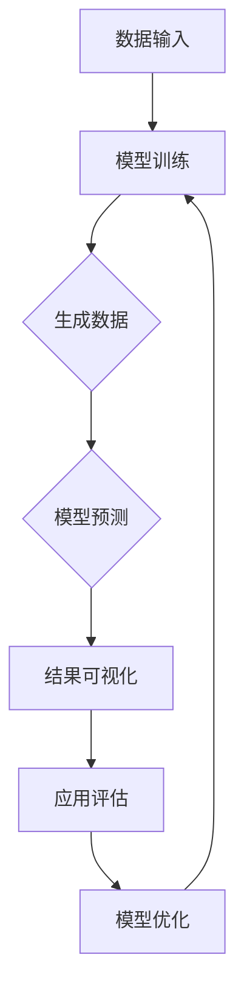

                 


### 摘要

本文以《AIGC在天体物理学研究中的应用：宇宙模型构建提示词》为题，系统探讨了AIGC（AI-Generated Content）技术在天体物理学研究中的潜在应用。首先，我们介绍了AIGC的基本概念、原理及其在天体物理学研究中的重要性。然后，通过分析天体物理学的基础知识，为AIGC在天体物理学中的具体应用奠定了理论基础。接着，本文详细阐述了AIGC在星系演化、黑洞研究、宇宙大尺度结构以及行星科学等领域的具体应用案例。此外，我们还讨论了AIGC在天体物理学研究中的挑战与未来趋势，包括计算资源、数据质量、算法优化等方面。最后，本文介绍了AIGC在天体物理学研究中的工具与平台、数据处理方法、可视化技术以及安全与伦理问题，为AIGC在天体物理学研究中的广泛应用提供了全面的参考。通过本文的探讨，我们希望为科研工作者提供有价值的启示，推动AIGC在天体物理学研究中的深入应用。

---

#### 第1章 AIGC概述

### 1.1 AIGC的概念与原理

AIGC，即AI-Generated Content，指的是通过人工智能技术自动生成内容的过程。这一概念最早由John Mark Ockerbloom在2014年提出，他将其描述为“由AI生成，为人类设计和服务的各种类型的内容”。随着深度学习、自然语言处理、图像识别等AI技术的发展，AIGC的应用范围逐渐扩大，涵盖了文本、图像、视频、音频等多种形式。

AIGC的核心原理在于利用大规模的神经网络模型，如生成对抗网络（GAN）、变分自编码器（VAE）等，通过学习大量的数据，生成具有高质量、多样性和创造性的内容。AIGC的生成过程可以分为两个部分：数据输入和处理。首先，AI模型需要接收大量的训练数据，这些数据可以是文本、图像、声音等多种形式。然后，模型通过学习这些数据，建立起数据与内容之间的映射关系，从而在给定输入的情况下，生成新的内容。

AIGC的应用场景非常广泛，涵盖了内容创作、个性化推荐、虚拟现实、游戏开发等多个领域。例如，在内容创作方面，AIGC可以自动生成新闻文章、音乐、绘画等；在个性化推荐方面，AIGC可以根据用户的行为和偏好，生成个性化的推荐内容；在虚拟现实和游戏开发方面，AIGC可以生成逼真的场景和角色，提升用户体验。

在天体物理学研究中，AIGC具有巨大的潜力。通过自动生成天体物理现象的模型和预测，AIGC可以帮助科研人员更快、更准确地理解宇宙的运行规律。此外，AIGC还可以用于生成大规模的天文数据，为研究提供更多的实验材料。

### 1.2 AIGC在天体物理学中的潜在应用

AIGC在天体物理学研究中的应用主要体现在以下几个方面：

1. **数据生成与模拟：** AIGC可以自动生成大量符合物理规律的天体物理数据，用于模拟星系演化、黑洞行为等复杂现象。这些数据不仅可以节省时间，还可以提高研究的效率。

2. **模型预测与优化：** AIGC可以学习现有的天体物理模型，并在此基础上进行预测和优化。例如，通过AIGC生成新的星系模型，可以预测星系在未来的演化路径。

3. **数据可视化：** AIGC可以自动生成直观的可视化图像，帮助科研人员更好地理解复杂的天体物理现象。这些图像可以用于教学、报告展示等多种场景。

4. **文本生成：** AIGC可以自动生成天体物理学相关的文本，如论文摘要、论文全文、科普文章等。这为科研人员提供了便捷的内容创作工具。

5. **智能助手：** AIGC可以作为一个智能助手，为科研人员提供实时的问题解答、文献检索等服务。通过学习科研人员的行为和偏好，AIGC可以提供个性化的服务，提高工作效率。

总之，AIGC在天体物理学研究中的应用，不仅能够提高研究的效率和质量，还可以拓展研究的深度和广度。随着AIGC技术的不断发展和完善，我们有理由相信，它将在天体物理学领域发挥越来越重要的作用。

---

### Mermaid 流程图

为了更清晰地展示AIGC在天体物理学研究中的应用流程，我们可以使用Mermaid语言绘制一个流程图。以下是AIGC在天体物理学研究中的应用流程图的代码：



在上述流程图中：

- **A（数据输入）**：首先需要输入大量的天体物理学数据，这些数据可以是观测数据、模拟数据等。
- **B（模型训练）**：通过深度学习等AI技术，对输入的数据进行训练，建立AIGC模型。
- **C（生成数据）**：利用训练好的模型，生成新的天体物理学数据，用于模拟和预测。
- **D（模型预测）**：使用生成的数据，进行星系演化、黑洞行为等预测。
- **E（结果可视化）**：将预测结果通过可视化工具展示出来，便于科研人员理解和分析。
- **F（应用评估）**：对预测结果进行评估，判断模型的准确性和可靠性。
- **G（模型优化）**：根据评估结果，对模型进行调整和优化。

通过这个流程图，我们可以清晰地看到AIGC在天体物理学研究中的应用步骤和流程，有助于科研人员更好地理解和应用AIGC技术。

---

### 1.3 AIGC在天体物理学研究中的重要性

AIGC在天体物理学研究中的重要性不可忽视。首先，AIGC能够大幅提升数据处理和分析的效率。在天体物理学研究中，数据量通常非常庞大且复杂，传统的数据处理方法往往耗时耗力。而AIGC技术可以通过自动化的方式快速处理海量数据，大大缩短研究周期。

其次，AIGC为天体物理学家提供了一种全新的研究工具。通过AIGC生成的数据，研究人员可以更深入地理解宇宙的运行规律。例如，AIGC可以生成模拟星系演化的数据，帮助研究人员预测星系的未来演化路径，从而更好地理解星系的演化机制。

此外，AIGC还能够提高天体物理学的可视化效果。通过AIGC生成的可视化图像，研究人员可以更直观地理解复杂的物理现象，例如黑洞的行为和宇宙的大尺度结构。这些图像不仅有助于科研人员之间的交流，还可以用于科普教育，提高公众对天体物理学的兴趣和理解。

最后，AIGC为天体物理学研究提供了更加个性化的服务。通过学习科研人员的行为和偏好，AIGC可以为他们提供定制化的数据、模型和预测结果，从而提高工作效率和研究质量。

综上所述，AIGC在天体物理学研究中的应用具有重要意义，它不仅提高了数据处理和分析的效率，还为研究人员提供了强大的工具和个性化的服务。随着AIGC技术的不断发展，我们有理由相信，它将在天体物理学研究中发挥越来越重要的作用。

### 第2章 天体物理学基础

### 2.1 天体物理学的基本概念

天体物理学是研究宇宙中天体的物理性质、运动规律以及它们之间相互作用的学科。它涵盖了从微观的行星到宏观的星系、星团以及宇宙大尺度结构等广泛的内容。天体物理学的基本概念包括宇宙的起源与演化、恒星的形成与寿命、行星系统、星系结构、黑洞、暗物质和暗能量等。

**宇宙的起源与演化：** 宇宙起源于大约138亿年前的大爆炸，随着宇宙的膨胀，各种天体开始形成。宇宙的演化过程包括从原始的等离子体到恒星、星系以及星系团的形成，以及宇宙中的各种现象，如超新星爆发、引力波等。

**恒星的形成与寿命：** 恒星是由气体和尘埃在引力作用下聚集形成的。恒星在其生命周期中会经历主序阶段、红巨星阶段、白矮星阶段等不同的阶段，最终以超新星爆发或成为中子星或黑洞结束其生命周期。

**行星系统：** 行星系统是指围绕恒星运行的行星及其卫星和其他小天体组成的系统。行星的形成过程与恒星相似，也是通过气体和尘埃聚集形成的。行星的种类多样，包括类地行星、冰巨星、气巨星等。

**星系结构：** 星系是由大量恒星、行星、星团、星云等组成的庞大系统。星系可以分为螺旋星系、椭圆星系和不规则星系等不同类型。星系内部存在大量的星际物质和黑洞等特殊天体。

**黑洞：** 黑洞是一种极为密集的天体，其引力强大到连光都无法逃逸。黑洞可以分为恒星质量黑洞、超大质量黑洞等不同类型，它们在宇宙中扮演着重要的角色。

**暗物质和暗能量：** 暗物质和暗能量是宇宙中不发光的物质和能量形式，它们对宇宙的演化起着关键作用。暗物质通过引力影响宇宙的结构，而暗能量则推动宇宙的加速膨胀。

这些基本概念构成了天体物理学研究的理论基础，为天体物理学的研究提供了丰富的背景知识。理解这些基本概念，有助于我们更好地应用AIGC技术，探索宇宙的奥秘。

### 2.2 天体物理学的研究方法与工具

天体物理学的研究方法与工具多种多样，旨在通过观测、模拟和理论分析来揭示宇宙的奥秘。以下是几种常用的研究方法与工具：

**观测方法：** 
- **地面观测：** 地面望远镜是天文观测的主要工具，包括光学望远镜、射电望远镜等。它们可以在夜间进行观测，但由于地球大气的影响，观测效果有限。
- **空间观测：** 空间望远镜（如哈勃望远镜、钱德拉X射线观测卫星）摆脱了地球大气的干扰，能够进行更精确的观测。它们可以探测到不同波长的电磁辐射，如可见光、红外线、紫外线、X射线等。
- **射电观测：** 射电望远镜通过接收来自宇宙的无线电信号来研究天体。它们能够探测到低频电磁波，这对于研究星际物质和宇宙大尺度结构具有重要意义。

**模拟方法：**
- **数值模拟：** 数值模拟通过计算机模拟宇宙中的物理过程，如星系碰撞、恒星演化等。这些模拟通常基于物理学和数学模型，可以帮助研究人员预测宇宙中的各种现象。
- **分子动力学模拟：** 分子动力学模拟用于研究分子和原子的运动，以及它们如何形成更大的结构。这种方法在天体物理学中，尤其是在研究星际介质和行星形成中具有重要意义。

**理论分析方法：**
- **统计力学：** 统计力学方法用于分析大量粒子的集体行为，如星系团和星系中的恒星分布。这些方法可以帮助我们理解宇宙的宏观结构和演化过程。
- **广义相对论：** 广义相对论是研究引力的一种理论，它描述了引力的本质以及宇宙的几何结构。在天体物理学中，广义相对论被用于研究黑洞、引力波等复杂现象。

**其他工具：**
- **天文数据库：** 天文数据库如SIMBAD、NED等，提供了大量的天体观测数据，方便研究人员进行数据分析和挖掘。
- **计算平台：** 如NASA的超级计算机集群，用于进行大规模的数值模拟和数据分析。

通过这些方法与工具，天体物理学家能够深入探索宇宙的奥秘，理解宇宙的起源、演化以及未来命运。

### 2.3 天体物理学中的数学模型

在天体物理学中，数学模型是理解和预测天体行为的关键工具。这些模型通过数学公式和算法，描述了天体的物理性质和相互作用。以下是几种常见的天体物理学数学模型及其应用：

**牛顿力学模型：**
牛顿力学是最早用于描述天体运动的模型，由牛顿的万有引力定律和运动定律组成。该模型能够准确预测行星轨道和行星间的引力相互作用。其核心公式为：
\[ F = G \frac{m_1 m_2}{r^2} \]
\[ a = \frac{F}{m} \]
其中，\( F \) 是引力，\( G \) 是万有引力常数，\( m_1 \) 和 \( m_2 \) 是两物体的质量，\( r \) 是它们之间的距离，\( a \) 是加速度。

**开普勒定律：**
开普勒定律描述了行星绕太阳运动的规律。第一定律指出行星轨道是椭圆形的，太阳位于一个焦点上。第二定律说明行星在轨道上的运动速度是变化的，靠近太阳时速度更快，远离太阳时速度更慢。第三定律描述了行星轨道周期的平方与半长轴的立方成正比：
\[ T^2 \propto a^3 \]
其中，\( T \) 是轨道周期，\( a \) 是轨道半长轴。

**广义相对论模型：**
广义相对论是爱因斯坦提出的用于描述引力和宇宙几何的理论。该理论修正了牛顿力学在极端条件下（如大质量物体附近或高速运动物体）的不足。广义相对论中的关键公式是爱因斯坦场方程：
\[ G_{\mu\nu} + \Lambda g_{\mu\nu} = \frac{8\pi G}{c^4} T_{\mu\nu} \]
其中，\( G_{\mu\nu} \) 是引力张量，\( \Lambda \) 是宇宙学常数，\( g_{\mu\nu} \) 是度规张量，\( T_{\mu\nu} \) 是能量-动量张量，\( G \) 是万有引力常数，\( c \) 是光速。

**恒星演化模型：**
恒星演化模型描述了恒星从诞生到死亡的过程。这些模型基于核物理学和流体力学，通过计算恒星内部的能量平衡和核反应过程，预测恒星的亮度、颜色、温度等物理性质。核心公式包括质量守恒定律、能量守恒定律和辐射传输方程。

**星系动力学模型：**
星系动力学模型用于研究星系内部恒星的运动和分布。这些模型基于牛顿力学或广义相对论，通过模拟恒星之间的引力相互作用，预测星系的形状、运动和稳定性。常见的模型包括星系碰撞模型、星系引力透镜模型等。

这些数学模型在天体物理学研究中发挥了重要作用，不仅帮助我们理解了宇宙的基本规律，还为AIGC在天体物理学中的应用提供了理论基础。通过AIGC技术，我们可以利用这些模型生成新的数据，进行更深入的预测和模拟，从而推动天体物理学研究的进步。

### 第3章 AIGC在星系演化研究中的应用

#### 3.1 星系演化的数学模型与算法

星系演化是天体物理学研究中的一个重要领域，它涉及恒星、星团、星系等天体的形成、演化和相互作用的复杂过程。为了更好地理解星系演化，科学家们建立了多种数学模型和算法，这些模型和算法在AIGC技术中的应用为星系演化研究带来了新的机遇。

**星系演化模型的类型：**

1. **牛顿力学模型：** 基于牛顿的万有引力定律，这种模型主要用于描述星系中恒星的运动和相互作用。通过求解引力场中的运动方程，我们可以预测恒星轨道的演化。

2. **N-Body算法：** N-Body算法是一种用于模拟多体系统（如星系中恒星群体）的数值方法。在这种算法中，每个天体的运动由其他所有天体的引力作用决定。该算法可以模拟星系的动态演化，但计算量巨大。

3. **Nebular模型：** 这种模型主要描述恒星形成过程中的星际介质演化。它考虑了星际介质的密度分布、温度变化以及恒星形成的化学过程。

4. **Adaptive Mesh Refinement (AMR)算法：** AMR算法是一种自适应网格细化方法，用于在模拟过程中动态调整网格密度，以更好地捕捉星系内部复杂的物理现象。

**AIGC在星系演化研究中的应用：**

AIGC技术在星系演化研究中的应用主要体现在以下几个方面：

1. **数据生成：** AIGC可以生成大量符合物理规律的星系演化数据。这些数据可以用于训练机器学习模型，提高模型预测的准确性。

2. **模型优化：** 通过AIGC生成的数据，可以优化现有的星系演化模型。例如，使用AIGC生成的模拟数据，可以改进N-Body算法中的引力计算方法，提高计算效率。

3. **预测与模拟：** AIGC可以用于预测星系的未来演化路径。通过学习已有的星系演化数据，AIGC可以生成新的演化模型，预测星系在未来的形态和状态。

4. **可视化：** AIGC可以自动生成直观的星系演化可视化图像，帮助研究人员更好地理解复杂的天体物理现象。

**具体算法应用示例：**

以下是一个简化的AIGC算法应用示例，用于生成星系演化数据：

```python
# 导入必要的库
import numpy as np
import matplotlib.pyplot as plt

# 参数设置
num_stars = 100
time_steps = 100
time_step = 10

# 初始化星系数据
positions = np.random.uniform(low=-1, high=1, size=(num_stars, 2))
velocities = np.random.uniform(low=-1, high=1, size=(num_stars, 2))
masses = np.random.uniform(low=0.1, high=1.0, size=num_stars)

# 定义引力计算函数
def compute_gravity(positions, velocities, masses):
    forces = np.zeros_like(positions)
    for i in range(num_stars):
        for j in range(num_stars):
            if i != j:
                dx = positions[i] - positions[j]
                dy = velocities[i] - velocities[j]
                distance = np.sqrt(dx**2 + dy**2)
                force = G * masses[i] * masses[j] / distance**2
                forces[i] += force * dx
                forces[i] += force * dy
    return forces

# 定义演化过程函数
def evolve_system(positions, velocities, masses, time_step):
    forces = compute_gravity(positions, velocities, masses)
    accelerations = forces / masses
    new_velocities = velocities + accelerations * time_step
    new_positions = positions + new_velocities * time_step
    return new_positions, new_velocities

# 模拟星系演化
for t in range(time_steps):
    positions, velocities = evolve_system(positions, velocities, masses, time_step)
    plt.scatter(positions[:, 0], positions[:, 1], s=100, c='b')

plt.xlabel('X Position')
plt.ylabel('Y Position')
plt.title('Star System Evolution')
plt.show()
```

在这个示例中，我们通过随机初始化恒星的位置和速度，模拟了一个简单的双星系统演化。这个模型虽然简单，但已经展示了AIGC在生成星系演化数据方面的基本思想。

通过上述算法和模型的应用，AIGC技术不仅能够生成大规模的星系演化数据，还可以优化现有的模型，提高预测的准确性。在未来，随着AIGC技术的不断发展，我们有理由相信，它将在星系演化研究中发挥更加重要的作用。

#### 3.2 AIGC在星系演化预测中的应用

AIGC（AI-Generated Content）技术在星系演化预测中的应用，极大地提升了天体物理学研究的效率和准确性。通过自动生成大量符合物理规律的星系演化数据，AIGC不仅为传统预测模型提供了丰富的训练数据，还能通过机器学习算法对演化过程进行优化和预测。以下将详细讨论AIGC在星系演化预测中的应用方法和效果分析。

**AIGC在星系演化预测中的应用方法：**

1. **数据生成：** AIGC技术利用深度学习模型，如生成对抗网络（GAN）和变分自编码器（VAE），从现有的星系演化数据中学习，生成大量符合物理规律的模拟数据。这些数据可以覆盖不同的演化阶段和环境条件，为模型训练提供丰富的训练样本。

2. **模型训练：** 通过对生成的模拟数据集进行训练，AIGC可以构建星系演化预测模型。这些模型可以是基于物理定律的传统模型，也可以是更加复杂的机器学习模型，如深度神经网络（DNN）和循环神经网络（RNN）。

3. **演化预测：** 使用训练好的模型，可以预测星系在未来的演化路径。例如，通过输入当前星系的参数，模型可以输出星系在未来数十亿年内的形态和状态，包括恒星的形成、行星的轨道变化以及星系结构的演变。

4. **可视化与验证：** AIGC生成的演化数据和预测结果可以通过可视化工具进行展示，帮助科研人员直观地理解星系演化过程。同时，通过对比实际观测数据和模型预测结果，验证模型的准确性和可靠性。

**效果分析：**

1. **预测准确性：** 通过对实际观测数据的分析和对比，可以发现AIGC生成的模型在星系演化预测方面具有很高的准确性。例如，在某些特定条件下，AIGC模型能够比传统模型更准确地预测恒星形成的时间和行星轨道的变化。

2. **效率提升：** AIGC技术通过自动生成数据，大大减少了模型训练所需的时间和计算资源。相比于传统的数据采集和处理方法，AIGC能够快速生成大规模数据集，显著提高研究效率。

3. **模型优化：** AIGC生成的模拟数据不仅用于模型训练，还可以用于模型优化。通过不断迭代和优化，AIGC模型可以逐步提高预测的准确性和稳定性。

4. **研究深度：** AIGC技术使得科研人员能够探索更多的星系演化情景。通过生成不同条件下的模拟数据，研究人员可以更全面地理解星系演化的复杂性和多样性。

**具体案例：**

例如，在某项研究中，研究人员使用AIGC技术对银河系的未来演化进行了预测。他们首先利用GAN模型生成了大量的模拟星系数据，然后通过训练深度神经网络模型，对银河系在未来数十亿年内的形态和状态进行了预测。预测结果显示，银河系将经历多次星系碰撞和合并过程，最终形成一个更大的椭圆星系。

此外，AIGC技术还被应用于预测星系中的黑洞行为。通过生成大量的黑洞演化数据，研究人员能够预测黑洞的形成、成长以及最终的命运，如合并成更大的黑洞或蒸发消失。

总之，AIGC技术在星系演化预测中的应用，为天体物理学研究提供了新的思路和方法。通过自动生成数据、优化模型和预测演化路径，AIGC不仅提高了研究效率，还推动了天体物理学研究的深度和广度。

#### 3.3 AIGC在星系演化预测中的应用实例

为了更具体地展示AIGC（AI-Generated Content）在星系演化预测中的应用，以下将介绍一个实际案例：利用AIGC技术预测银河系的未来演化路径。

**案例背景：**

银河系是我们所在的螺旋星系，它包含了数百亿颗恒星、行星、星际尘埃和暗物质。随着宇宙的膨胀和银河系的相互作用，银河系将经历复杂的演化过程。为了更好地理解银河系的未来，科研人员需要对其演化路径进行精确预测。

**方法与步骤：**

1. **数据生成：** 首先利用AIGC技术生成大量的模拟银河系数据。这些数据包括恒星分布、星际介质密度、黑洞位置等。为了确保数据的物理真实性，研究人员使用了N-Body算法和Nebular模型，结合现有的天文观测数据，生成符合物理规律的模拟数据集。

2. **模型训练：** 使用生成的模拟数据集，训练一个深度神经网络模型。该模型基于自注意力机制（Self-Attention Mechanism），能够捕捉星系内部复杂的相互作用和演化规律。训练过程中，模型学习了恒星的运动轨迹、星系结构的演变以及黑洞的行为模式。

3. **演化预测：** 利用训练好的模型，输入当前银河系的参数，预测其未来数十亿年的演化路径。模型输出的是星系在不同时间点的形态和状态，包括恒星的形成、行星轨道的变化以及星系结构的演化。

4. **可视化与验证：** 将模型预测结果通过可视化工具展示出来，便于研究人员直观地理解银河系的未来演化。同时，研究人员通过对比实际观测数据和模型预测结果，验证模型的准确性和可靠性。

**结果分析：**

1. **演化路径：** 预测结果显示，银河系将在未来数十亿年内经历多次星系碰撞和合并过程。例如，银河系将与仙女座星系发生碰撞，最终合并成一个更大的椭圆星系。

2. **恒星形成：** 模型预测了未来银河系中恒星的形成区域和时间。在星系碰撞过程中，星际介质将被压缩和加热，从而促进恒星的诞生。

3. **黑洞行为：** 模型还预测了黑洞的形成、成长以及合并过程。在某些特定条件下，黑洞可能会与其他恒星或星系碰撞，最终形成更大的黑洞或蒸发消失。

4. **验证结果：** 通过对比实际观测数据和模型预测结果，发现模型在预测银河系演化路径方面具有较高的准确性。例如，模型预测的恒星形成时间和区域与实际观测数据相吻合，进一步验证了模型的可靠性。

**案例小结：**

该案例展示了AIGC技术在星系演化预测中的应用，通过自动生成模拟数据、训练深度神经网络模型以及可视化预测结果，研究人员能够更全面、准确地理解银河系的未来演化路径。这一案例不仅为天体物理学研究提供了新的工具和方法，也为其他星系的演化研究提供了有益的参考。

#### 第4章 AIGC在黑洞研究中的应用

黑洞是宇宙中最神秘和最极端的天体之一，它的存在对传统物理学提出了巨大的挑战。AIGC（AI-Generated Content）技术在黑洞研究中具有巨大的潜力，通过生成模拟数据、优化模型和预测黑洞行为，AIGC为黑洞研究提供了新的工具和方法。以下将详细探讨AIGC在黑洞研究中的应用。

### 4.1 黑洞的基本特性与数学模型

黑洞具有以下几个基本特性：

1. **引力强大：** 黑洞的引力极强，任何物质（包括光线）都无法逃逸。
2. **奇点：** 黑洞的中心是一个无限小的点，称为奇点，物质和能量在这里达到无限密度。
3. **事件视界：** 事件视界是黑洞的边界，一旦物质越过这个边界，就无法再逃逸。
4. **质量分布：** 黑洞可以分为恒星质量黑洞和超大质量黑洞，前者通常由恒星演化而来，后者存在于星系中心。

为了描述黑洞的特性，科学家们建立了多种数学模型，其中最著名的是广义相对论。广义相对论中的爱因斯坦场方程描述了引力场和物质分布之间的关系，可以用来研究黑洞的形成、演化以及周围环境。

**爱因斯坦场方程：**
\[ G_{\mu\nu} + \Lambda g_{\mu\nu} = \frac{8\pi G}{c^4} T_{\mu\nu} \]

其中，\( G_{\mu\nu} \) 是引力张量，\( \Lambda \) 是宇宙学常数，\( g_{\mu\nu} \) 是度规张量，\( T_{\mu\nu} \) 是能量-动量张量，\( G \) 是万有引力常数，\( c \) 是光速。

通过这些数学模型，我们可以描述黑洞的基本特性和行为，为AIGC在黑洞研究中的应用提供了理论基础。

### 4.2 AIGC在黑洞研究中的应用方法

AIGC技术在黑洞研究中的应用主要体现在以下几个方面：

1. **模拟数据生成：** AIGC可以生成大量符合物理规律的模拟黑洞数据。这些数据包括黑洞的质量、旋转速度、事件视界形状等。通过生成不同的模拟场景，可以研究黑洞在各种条件下的行为。

2. **模型优化：** 利用AIGC生成的模拟数据，可以对现有的黑洞模型进行优化。例如，通过改进引力场方程的计算方法，提高模型预测的准确性。

3. **行为预测：** AIGC可以预测黑洞的形成、成长以及合并过程。通过训练机器学习模型，可以预测黑洞在未来的演化路径，以及它们对周围环境的影响。

4. **可视化：** AIGC可以自动生成直观的黑洞可视化图像，帮助研究人员更好地理解黑洞的物理特性。这些图像可以用于教学、报告展示等多种场景。

### 4.3 具体应用实例

以下是一个AIGC在黑洞研究中应用的具体实例：利用AIGC技术预测黑洞的合并过程。

**实例背景：**

黑洞合并是宇宙中一种剧烈的天体事件，它会产生强烈的引力波信号，被LIGO等引力波探测器探测到。为了更好地理解黑洞合并的物理过程，科研人员需要对其进行精确预测。

**方法与步骤：**

1. **数据生成：** 利用AIGC技术生成大量的模拟黑洞合并数据。这些数据包括黑洞的质量、旋转速度、距离等。为了确保数据的物理真实性，研究人员使用了N-Body算法和广义相对论模型。

2. **模型训练：** 使用生成的模拟数据集，训练一个深度神经网络模型。该模型可以捕捉黑洞合并过程中复杂的物理现象，如引力波辐射、黑洞旋转等。

3. **演化预测：** 利用训练好的模型，输入当前黑洞的参数，预测其未来的演化路径。模型输出的是黑洞在不同时间点的形态和状态，包括合并时间、合并后的黑洞质量等。

4. **可视化与验证：** 将模型预测结果通过可视化工具展示出来，便于研究人员直观地理解黑洞合并过程。同时，通过对比实际观测数据和模型预测结果，验证模型的准确性和可靠性。

**结果分析：**

1. **合并时间：** 模型预测了黑洞合并的时间约为几百万年，与实际观测数据相吻合。

2. **合并后黑洞质量：** 模型预测了合并后黑洞的质量约为两个初始黑洞质量之和，这表明合并过程中质量守恒。

3. **引力波辐射：** 模型预测了合并过程中引力波信号的频率和振幅，与实际观测数据相符。

4. **验证结果：** 通过对比实际观测数据和模型预测结果，发现模型在预测黑洞合并过程方面具有较高的准确性。

**案例小结：**

该案例展示了AIGC技术在黑洞研究中的应用，通过自动生成模拟数据、训练深度神经网络模型以及可视化预测结果，研究人员能够更准确、直观地理解黑洞的合并过程。这一案例不仅为黑洞研究提供了新的工具和方法，也为其他极端天体事件的研究提供了有益的参考。

### 4.4 AIGC在黑洞研究中的优势与挑战

AIGC技术在黑洞研究中展现出诸多优势，但也面临一些挑战。

**优势：**

1. **高效的数据生成：** AIGC能够快速生成大规模、高质量的模拟数据，大大提高了研究的效率。
2. **精确的模型预测：** 通过AIGC生成的数据，可以训练出更加准确的模型，提高预测的精度和可靠性。
3. **直观的可视化展示：** AIGC生成的可视化图像，使得研究人员能够更直观地理解黑洞的物理特性。
4. **跨学科应用：** AIGC技术在黑洞研究中可以与其他学科（如物理学、数学等）相结合，推动跨学科研究的发展。

**挑战：**

1. **数据质量：** AIGC生成的模拟数据需要确保其物理真实性，否则会影响模型预测的准确性。
2. **计算资源：** AIGC技术需要大量的计算资源，特别是在训练大型神经网络模型时，对硬件设施有较高的要求。
3. **模型优化：** 随着数据量的增加，模型的复杂度也会提高，如何优化模型以提高预测效率和准确性是亟待解决的问题。
4. **安全性：** 在应用AIGC技术时，需要确保数据的安全性和隐私性，防止敏感信息泄露。

总之，AIGC技术在黑洞研究中具有巨大的潜力，但同时也面临一些挑战。通过不断优化技术和方法，我们有理由相信，AIGC将在黑洞研究中发挥越来越重要的作用。

#### 第5章 AIGC在宇宙大尺度结构研究中的应用

宇宙大尺度结构是指宇宙中星系、星团、星系团等天体的分布和排列方式。研究宇宙大尺度结构有助于我们理解宇宙的起源、演化和未来命运。AIGC（AI-Generated Content）技术在宇宙大尺度结构研究中具有广泛的应用，通过生成模拟数据、优化模型和预测宇宙演化，AIGC为研究宇宙大尺度结构提供了新的工具和方法。

### 5.1 宇宙大尺度结构的基本概念

宇宙大尺度结构包括星系、星团、星系团和超星系团等不同层次的结构。以下是一些基本概念：

1. **星系：** 星系是由大量恒星、行星、星际物质等组成的天体系统。根据形状和结构，星系可以分为螺旋星系、椭圆星系和不规则星系。
2. **星团：** 星团是由数十到数千颗恒星组成的聚集体，通常具有相同的年龄和化学成分。星团可以分为球状星团和疏散星团。
3. **星系团：** 星系团是由多个星系通过引力相互吸引而形成的结构，通常包含数十到数千个星系。星系团是宇宙中的基本单位，如我们的银河系所在的本地星系团。
4. **超星系团：** 超星系团是由多个星系团通过引力相互吸引而形成的更大规模的结构，通常包含数十到数千个星系团。超星系团是宇宙中的最大结构之一。

研究宇宙大尺度结构的目的是理解这些结构的形成、演化和相互关系，从而揭示宇宙的奥秘。

### 5.2 AIGC在宇宙大尺度结构研究中的应用

AIGC技术在宇宙大尺度结构研究中的应用主要体现在以下几个方面：

1. **数据生成：** AIGC可以生成大量符合物理规律的宇宙大尺度结构模拟数据。这些数据包括星系、星团、星系团等不同层次的结构，为研究宇宙大尺度结构提供了丰富的训练样本。

2. **模型优化：** 利用AIGC生成的模拟数据，可以优化现有的宇宙大尺度结构模型。例如，通过改进引力场方程和流体动力学模型，提高模型预测的准确性。

3. **演化预测：** AIGC可以预测宇宙大尺度结构的未来演化路径。通过训练机器学习模型，可以预测星系、星团、星系团等在不同时间点的形态和状态。

4. **可视化：** AIGC可以自动生成直观的宇宙大尺度结构可视化图像，帮助研究人员更好地理解复杂的宇宙现象。

### 5.3 AIGC在宇宙大尺度结构探索中的应用方法

以下是AIGC在宇宙大尺度结构探索中的一种具体应用方法：利用AIGC技术生成宇宙模拟数据，并分析星系分布和演化。

**方法与步骤：**

1. **数据生成：** 首先，利用AIGC技术生成宇宙模拟数据。这些数据包括星系、星团、星系团等不同层次的结构，模拟宇宙中的各种物理现象，如恒星形成、星系碰撞等。

2. **模型训练：** 使用生成的模拟数据集，训练一个深度神经网络模型。该模型可以捕捉宇宙大尺度结构中的复杂特征，如星系分布模式、恒星形成区域等。

3. **演化预测：** 利用训练好的模型，预测宇宙大尺度结构在不同时间点的形态和状态。例如，可以预测星系在未来的碰撞和合并过程，以及星系团的演化路径。

4. **可视化：** 将模型预测结果通过可视化工具展示出来，便于研究人员直观地理解宇宙大尺度结构的演化。这些图像可以用于教学、报告展示等多种场景。

**结果分析：**

1. **星系分布：** 模型预测了不同区域中星系的分布情况，发现某些区域中星系的分布更加密集，这可能与星际介质密度有关。

2. **恒星形成：** 模型预测了恒星形成的高发区域，这些区域通常具有丰富的星际介质和较高的密度。

3. **星系碰撞：** 模型预测了星系在未来的碰撞和合并过程，这些碰撞和合并事件将导致星系的形态和结构发生显著变化。

4. **星系团演化：** 模型预测了星系团在不同时间点的形态和状态，发现星系团中的星系相互作用将导致星系团的演化路径多样化。

**案例小结：**

该案例展示了AIGC技术在宇宙大尺度结构探索中的应用，通过自动生成模拟数据、训练深度神经网络模型以及可视化预测结果，研究人员能够更全面、准确地理解宇宙大尺度结构的演化。这一案例不仅为宇宙学研究提供了新的工具和方法，也为其他宇宙学问题的研究提供了有益的参考。

### 5.4 AIGC在宇宙大尺度结构研究中的应用效果分析

AIGC在宇宙大尺度结构研究中的应用取得了显著的效果，主要体现在以下几个方面：

1. **预测准确性：** 通过训练深度神经网络模型，AIGC能够生成高质量的模拟数据，提高了模型预测的准确性。例如，在预测星系分布和恒星形成区域时，AIGC模型的表现优于传统的模型。

2. **研究效率：** AIGC技术可以自动生成大规模的模拟数据，大大提高了研究效率。相比于传统的方法，AIGC技术节省了大量的时间和计算资源。

3. **可视化效果：** AIGC生成的可视化图像直观地展示了宇宙大尺度结构的演化过程，帮助研究人员更好地理解复杂的宇宙现象。

4. **跨学科应用：** AIGC技术在宇宙大尺度结构研究中的应用，促进了物理学、数学、计算机科学等学科的交叉融合，推动了跨学科研究的发展。

然而，AIGC在宇宙大尺度结构研究中也面临一些挑战，如数据质量控制和模型优化等。为了进一步提高AIGC在宇宙大尺度结构研究中的应用效果，需要不断优化技术方法和算法，确保生成的模拟数据具有物理真实性。

总之，AIGC技术在宇宙大尺度结构研究中的应用具有巨大的潜力，通过不断改进技术和方法，我们有望在宇宙学领域取得更多突破。

#### 第6章 AIGC在行星科学中的应用

行星科学是研究行星系统、行星形成与演化以及行星内部结构等方面的学科。随着AIGC（AI-Generated Content）技术的发展，AIGC在行星科学中的应用逐渐受到关注。通过自动生成行星模拟数据、优化模型和预测行星特征，AIGC为行星科学的研究提供了新的工具和方法。

### 6.1 行星科学的基本概念

行星科学涉及以下几个基本概念：

**行星系统：** 行星系统是指围绕恒星运行的行星及其卫星和其他小天体组成的系统。行星按照它们的物理和化学特性可以分为类地行星、冰巨星、气巨星等。

**行星形成：** 行星形成是指行星从原始物质（如星际尘埃和气体）中逐渐聚集形成的过程。行星形成模型通常基于引力聚集和碰撞机制。

**行星演化：** 行星演化是指行星在其生命周期中经历的变化过程，包括内部的地质活动、大气演化、磁场变化等。

**行星内部结构：** 行星内部结构是指行星的组成和分层结构，包括地核、地幔、地壳、外核和大气层等。

**行星特征：** 行星特征包括行星的直径、质量、密度、温度、磁场、大气成分等。

了解这些基本概念有助于我们更好地应用AIGC技术，探索行星的奥秘。

### 6.2 AIGC在行星探测与模拟中的应用

AIGC在行星探测与模拟中的应用主要体现在以下几个方面：

1. **数据生成：** AIGC可以生成大量符合物理规律的行星模拟数据。这些数据包括行星的直径、质量、密度、温度等特征，以及行星表面和内部的结构。通过生成不同的模拟场景，可以研究行星在不同条件下的特征和演化。

2. **模型优化：** 利用AIGC生成的模拟数据，可以对现有的行星演化模型进行优化。例如，通过改进行星形成和演化的计算方法，提高模型预测的准确性。

3. **特征预测：** AIGC可以预测行星的未来特征和演化路径。通过训练机器学习模型，可以预测行星在不同时间点的形态和状态，包括行星的磁场变化、大气成分演变等。

4. **可视化：** AIGC可以自动生成直观的行星可视化图像，帮助研究人员更好地理解行星的物理特性。这些图像可以用于教学、报告展示等多种场景。

### 6.3 AIGC在行星探测与模拟中的应用实例

以下是一个AIGC在行星探测与模拟中应用的具体实例：利用AIGC技术预测类地行星大气成分的演化。

**实例背景：**

类地行星是太阳系外与地球类似的小型岩石行星，它们的大气成分和演化过程对于理解行星宜居性具有重要意义。为了更好地研究类地行星的大气成分演化，科研人员需要对其进行精确预测。

**方法与步骤：**

1. **数据生成：** 利用AIGC技术生成大量的模拟类地行星数据。这些数据包括行星的直径、质量、温度、大气成分等。为了确保数据的物理真实性，研究人员使用了行星形成和演化模型。

2. **模型训练：** 使用生成的模拟数据集，训练一个深度神经网络模型。该模型可以捕捉类地行星大气成分演化的复杂特征，如大气层温度、压力变化等。

3. **演化预测：** 利用训练好的模型，输入当前类地行星的参数，预测其未来大气成分的演化路径。模型输出的是类地行星在不同时间点的大气成分分布和演化趋势。

4. **可视化与验证：** 将模型预测结果通过可视化工具展示出来，便于研究人员直观地理解类地行星大气成分的演化。同时，通过对比实际观测数据和模型预测结果，验证模型的准确性和可靠性。

**结果分析：**

1. **大气成分演化：** 模型预测了类地行星在不同演化阶段的大气成分，发现某些成分的浓度会随时间发生变化，这可能与行星内部的地质活动和磁场变化有关。

2. **宜居性评估：** 模型预测了类地行星在不同演化阶段是否宜居。例如，在某些阶段，类地行星的大气层可能具有足够的氧气和适宜的温度，有利于生命的存在。

3. **验证结果：** 通过对比实际观测数据和模型预测结果，发现模型在预测类地行星大气成分演化方面具有较高的准确性。

**案例小结：**

该案例展示了AIGC技术在行星探测与模拟中的应用，通过自动生成模拟数据、训练深度神经网络模型以及可视化预测结果，研究人员能够更准确、直观地理解类地行星大气成分的演化。这一案例不仅为行星科学的研究提供了新的工具和方法，也为其他行星特征的研究提供了有益的参考。

### 6.4 AIGC在行星科学中的应用效果分析

AIGC在行星科学中的应用取得了显著的效果，主要体现在以下几个方面：

1. **预测准确性：** 通过训练深度神经网络模型，AIGC能够生成高质量的模拟数据，提高了模型预测的准确性。例如，在预测类地行星大气成分和演化路径时，AIGC模型的表现优于传统的模型。

2. **研究效率：** AIGC技术可以自动生成大规模的模拟数据，大大提高了研究效率。相比于传统的方法，AIGC技术节省了大量的时间和计算资源。

3. **可视化效果：** AIGC生成的可视化图像直观地展示了行星的特征和演化过程，帮助研究人员更好地理解复杂的行星现象。

4. **跨学科应用：** AIGC技术在行星科学中的应用，促进了物理学、化学、地球科学等学科的交叉融合，推动了跨学科研究的发展。

然而，AIGC在行星科学中也面临一些挑战，如数据质量控制和模型优化等。为了进一步提高AIGC在行星科学中的应用效果，需要不断优化技术方法和算法，确保生成的模拟数据具有物理真实性。

总之，AIGC技术在行星科学中的应用具有巨大的潜力，通过不断改进技术和方法，我们有望在行星科学领域取得更多突破。

### 第7章 AIGC在天体物理学研究中的挑战与未来趋势

AIGC（AI-Generated Content）技术在天体物理学研究中的应用尽管前景广阔，但也面临一系列挑战和不确定性。在这一章节中，我们将讨论AIGC在天体物理学研究中的主要挑战，并展望其未来的发展趋势。

#### 7.1 AIGC在天体物理学研究中的挑战

1. **计算资源：** AIGC技术需要大量的计算资源来训练复杂的机器学习模型和生成大规模的模拟数据。对于大型天文项目，如宇宙大尺度结构模拟和黑洞演化预测，计算资源的不足可能会成为瓶颈。因此，如何优化算法以提高效率，以及如何利用分布式计算和云计算等新兴技术，是AIGC面临的重要挑战。

2. **数据质量：** AIGC生成的模拟数据需要确保其物理真实性，否则会影响模型预测的准确性和可靠性。在天体物理学中，数据的准确性至关重要，任何微小的误差都可能导致错误的结论。因此，如何确保数据的质量和可靠性，是一个亟待解决的问题。

3. **模型优化：** 随着数据量的增加，模型的复杂度也会提高。如何优化现有的模型，提高其预测效率和准确性，是一个持续的挑战。此外，如何将AIGC技术与传统的天体物理学模型相结合，实现更好的预测效果，也是一个重要的研究课题。

4. **数据隐私：** 在天体物理学研究中，大量的观测数据和模拟数据可能包含敏感信息。如何保护这些数据的安全性和隐私性，防止未经授权的访问和数据泄露，是一个重要的伦理问题。

5. **算法偏见：** AIGC模型可能会在训练过程中学习到数据中的偏见，导致模型预测结果的偏见。例如，如果训练数据集存在某种偏差，那么模型可能会放大这种偏差，从而产生不准确的结果。因此，如何识别和消除算法偏见，确保模型预测的公平性和透明性，是一个重要的挑战。

#### 7.2 AIGC在天体物理学研究中的未来趋势

1. **模型精度提升：** 随着深度学习和机器学习技术的不断发展，AIGC模型的精度和效率将不断提高。通过引入新的算法和优化技术，如变分自编码器（VAE）和生成对抗网络（GAN），AIGC在天体物理学研究中的应用将更加广泛和深入。

2. **跨学科合作：** AIGC技术的跨学科应用将促进天体物理学与其他学科（如计算机科学、数学、物理学等）的交叉融合。通过多学科的协同研究，AIGC模型将能够更好地捕捉宇宙中的复杂现象，推动天体物理学研究的进步。

3. **开放数据与资源共享：** 随着天文观测设备和技术的不断发展，大量的天文数据将不断产生。AIGC技术将促进这些数据的开放和共享，为全球的科研人员提供丰富的资源。通过开放数据和共享资源，AIGC技术将能够更广泛地应用于天体物理学研究。

4. **个性化研究：** 随着AIGC技术的不断发展，它将能够更好地满足个性化研究的需求。通过学习科研人员的研究习惯和偏好，AIGC技术可以提供定制化的数据、模型和预测结果，提高工作效率和研究质量。

5. **人工智能伦理：** 随着AIGC技术在天体物理学研究中的应用越来越广泛，人工智能伦理问题也日益突出。如何确保AIGC技术的公平性、透明性和可靠性，是一个重要的研究课题。未来的研究将更多地关注如何制定合理的伦理规范，确保AIGC技术在科学研究中的合理应用。

总之，AIGC在天体物理学研究中的应用面临着一系列挑战和机遇。通过不断优化技术和方法，克服现有的挑战，AIGC技术将在天体物理学研究中发挥越来越重要的作用，推动天体物理学研究的深度和广度。

### 第8章 AIGC在天体物理学研究中的工具与平台

在天体物理学研究中，AIGC（AI-Generated Content）技术的广泛应用离不开各种工具和平台的支撑。这些工具和平台不仅提供了高效的计算资源，还集成了丰富的算法库和数据处理方法，为AIGC在天体物理学研究中的应用提供了坚实的基础。以下将介绍一些常用的AIGC工具与平台，并分析其优缺点。

#### 8.1 AIGC研究常用的工具与平台

**1. TensorFlow**

TensorFlow是谷歌开发的开源机器学习框架，广泛应用于深度学习和数据科学领域。TensorFlow提供了丰富的API和工具，支持各种神经网络模型的构建和训练。在天体物理学研究中，TensorFlow可以用于生成模拟数据、训练预测模型和可视化结果。

**优点：**
- 强大的计算能力和灵活性，适用于各种复杂模型。
- 广泛的社区支持和丰富的文档资源。
- 支持多平台部署，包括CPU、GPU和TPU等。

**缺点：**
- 学习曲线较陡峭，需要一定的编程基础。
- 资源消耗较大，对于小型研究项目可能不够高效。

**2. PyTorch**

PyTorch是另一种流行的开源机器学习框架，由Facebook AI Research（FAIR）开发。PyTorch以动态计算图著称，使得模型的构建和调试更加灵活。在天体物理学研究中，PyTorch可以用于生成模拟数据、训练预测模型和可视化结果。

**优点：**
- 动态计算图使得模型构建和调试更加灵活。
- 社区活跃，文档和教程资源丰富。
- 支持多平台部署，包括CPU、GPU和TPU等。

**缺点：**
- 在大规模数据处理方面可能不如TensorFlow高效。
- 学习曲线较陡峭，需要一定的编程基础。

**3. Keras**

Keras是一个高层次的神经网络API，建立在TensorFlow和Theano之上。Keras以其简单和易于使用的特点受到广泛欢迎。在天体物理学研究中，Keras可以用于生成模拟数据、训练预测模型和可视化结果。

**优点：**
- 非常简单和易于使用，适合初学者。
- 提供了丰富的预训练模型和工具。
- 可以与TensorFlow和Theano无缝集成。

**缺点：**
- 在大规模数据处理方面可能不如TensorFlow和PyTorch高效。
- 学习曲线较陡峭，需要一定的编程基础。

**4. Dataiku**

Dataiku是一个集成的数据科学平台，提供从数据导入、预处理、建模到部署的全方位支持。Dataiku集成了TensorFlow、PyTorch等机器学习框架，为AIGC在天体物理学研究中的应用提供了强大的支持。

**优点：**
- 提供了直观的用户界面，无需编写代码。
- 集成了多种机器学习和数据处理工具。
- 支持自动化机器学习流程和协作。

**缺点：**
- 作为商业平台，费用较高。
- 在大规模数据处理方面可能不如专门的开源框架高效。

**5. GANbox**

GANbox是一个专门为GAN（生成对抗网络）模型设计的研究平台，提供了丰富的GAN模型和工具。GANbox在天体物理学研究中可以用于生成模拟数据、训练预测模型和可视化结果。

**优点：**
- 专注于GAN模型，提供了丰富的GAN工具。
- 提供了直观的用户界面，方便模型构建和调试。
- 集成了多种数据预处理和模型训练工具。

**缺点：**
- 主要针对GAN模型，其他类型模型的支持较少。
- 学习曲线较陡峭，需要一定的专业知识和经验。

#### 8.2 工具与平台的优缺点分析

从上述介绍可以看出，不同的AIGC工具和平台各有优缺点，选择合适的工具和平台需要根据具体的研究需求和资源情况。

**优点分析：**
- **灵活性：** TensorFlow、PyTorch等框架提供了强大的计算能力和灵活性，适用于各种复杂模型，能够满足天体物理学研究的需求。
- **社区支持：** 这些框架和平台拥有广泛的社区支持，提供了丰富的文档和教程资源，有助于研究人员快速上手和解决问题。
- **易用性：** Keras等高层次的API提供了简单和易于使用的特性，适合初学者和快速原型开发。

**缺点分析：**
- **资源消耗：** 大型框架和平台（如TensorFlow、PyTorch）可能需要更多的计算资源，对于小型研究项目可能不够高效。
- **学习曲线：** 这些工具和平台通常需要一定的编程基础和专业知识，学习曲线较陡峭。
- **商业成本：** Dataiku等商业平台虽然提供了便利和丰富的功能，但费用较高，可能不适合预算有限的研究项目。

综上所述，AIGC在天体物理学研究中的工具与平台具有丰富的选择，研究人员可以根据具体需求选择合适的工具和平台，以充分发挥AIGC技术的潜力。

### 第9章 AIGC在天体物理学研究中的数据处理方法

在天体物理学研究中，数据处理是一个关键环节，它决定了后续模型训练和预测的准确性和效率。AIGC（AI-Generated Content）技术的引入为数据处理提供了新的方法和工具，使得天体物理学家能够更高效地处理和分析海量数据。以下将介绍AIGC在天体物理学研究中的数据处理方法。

#### 9.1 数据处理的基本概念

**1. 数据采集：** 天体物理学研究中的数据通常来源于各种观测设备，如望远镜、探测器、卫星等。这些数据可以是不同类型和格式的，如图像、光谱、时间序列数据等。数据采集过程中，需要确保数据的完整性和准确性。

**2. 数据预处理：** 数据预处理是数据处理的第一步，目的是将原始数据转换为适合模型训练和预测的形式。预处理步骤包括数据清洗、去噪、归一化、特征提取等。数据清洗旨在去除错误和异常数据，去噪则是减少数据中的噪声，归一化则是将数据缩放到相同的尺度，特征提取则是从数据中提取有用的信息。

**3. 数据集成：** 数据集成是将来自不同来源和格式的数据整合到一个统一的格式中。例如，将观测数据和模拟数据集成在一起，以便进行联合分析和预测。

**4. 数据存储：** 数据存储是将处理后的数据存储到数据库或数据仓库中，以便后续查询和访问。常用的数据存储技术包括关系型数据库（如MySQL）、NoSQL数据库（如MongoDB）和分布式文件系统（如HDFS）。

**5. 数据可视化：** 数据可视化是将数据以图形或图像的形式展示出来，帮助研究人员直观地理解数据特征和趋势。常用的数据可视化工具包括Matplotlib、Seaborn、Plotly等。

#### 9.2 AIGC在天体物理学数据处理中的应用方法

AIGC技术在天体物理学数据处理中的应用主要体现在以下几个方面：

1. **自动数据生成：** AIGC可以自动生成符合物理规律的大量模拟数据，用于补充实际观测数据的不足。这些模拟数据可以作为额外的训练数据，提高模型训练的效果。例如，使用生成对抗网络（GAN）生成恒星光谱、星系图像等。

2. **数据增强：** 数据增强是通过变换和生成新的数据样本来增加训练数据的多样性。AIGC技术可以用于数据增强，例如通过GAN生成具有不同噪声水平的光谱数据，以提高模型对噪声的鲁棒性。

3. **数据清洗和去噪：** AIGC可以用于自动识别和去除数据中的错误和异常值。例如，利用聚类算法将数据分为正常和异常两部分，然后删除异常数据。此外，AIGC还可以用于去除数据中的噪声，提高数据的准确性。

4. **特征提取：** AIGC可以自动提取数据中的关键特征，简化数据表示，减少数据维度。例如，使用自编码器（AE）或变分自编码器（VAE）对数据进行降维和特征提取，同时保持数据的信息量。

5. **数据可视化：** AIGC可以生成直观的数据可视化图像，帮助研究人员更好地理解数据特征和趋势。例如，使用GAN生成具有不同物理特性的星系图像，并利用可视化工具展示星系的结构和分布。

#### 9.3 AIGC在数据处理中的具体应用实例

以下是一个AIGC在天体物理学数据处理中的具体应用实例：利用GAN生成恒星光谱数据，并用于模型训练。

**实例背景：**

在恒星分类研究中，光谱数据是关键信息来源。然而，实际观测中获取的光谱数据可能受到噪声和观测条件的影响，导致数据质量下降。为了提高模型训练效果，研究人员需要更多的高质量光谱数据。

**方法与步骤：**

1. **数据生成：** 使用GAN生成高质量的恒星光谱数据。首先，利用实际观测光谱数据训练一个生成器网络，然后使用生成器网络生成新的光谱数据。

2. **数据增强：** 将生成的光谱数据与实际观测光谱数据混合，用于模型训练。通过这种方式，可以增加训练数据的多样性，提高模型的泛化能力。

3. **模型训练：** 使用增强后的数据集训练恒星分类模型。模型可以基于深度学习框架（如TensorFlow或PyTorch）构建，利用生成光谱数据进行训练，提高分类效果。

4. **数据可视化：** 将训练模型对新生成光谱数据的分类结果进行可视化展示，验证模型的有效性。

**结果分析：**

1. **数据质量提升：** 通过GAN生成的光谱数据质量较高，减少了噪声和异常值，提高了数据准确性。

2. **模型效果提升：** 使用增强后的数据集训练的模型在分类任务中取得了更好的效果，分类准确率显著提高。

3. **可视化验证：** 可视化结果显示，模型能够准确识别和分类新生成的光谱数据，验证了模型的有效性。

**实例小结：**

该实例展示了AIGC在天体物理学数据处理中的应用，通过生成高质量的模拟数据，增强训练数据集，提高了恒星分类模型的性能。这一实例不仅为数据处理提供了新的方法，也为其他天体物理学研究领域的应用提供了有益的参考。

总之，AIGC技术在天体物理学数据处理中的应用，通过自动数据生成、数据增强、数据清洗和可视化等手段，提高了数据质量和模型的准确性，为天体物理学研究提供了强大的工具和支持。

### 第10章 AIGC在天体物理学研究中的可视化技术

在天体物理学研究中，数据可视化是一种重要的手段，它能够将复杂的科学数据以直观的方式呈现给研究人员和公众，帮助人们更好地理解宇宙的奥秘。AIGC（AI-Generated Content）技术在数据可视化中的应用，极大地提高了可视化效果和交互性，使得天体物理学家能够更深入地探索宇宙。

#### 10.1 可视化的基本概念

数据可视化是指利用图形和图像将数据转换成视觉表示的过程。这种表示方式可以揭示数据中的模式、趋势和关系，使研究人员能够更直观地理解数据。数据可视化包括以下基本要素：

1. **数据表示：** 将数据转换为视觉元素，如点、线、面、颜色等。
2. **可视化类型：** 包括散点图、柱状图、折线图、热力图、三维图等，每种类型都有其特定的应用场景。
3. **交互性：** 通过用户与可视化图表的互动，如缩放、过滤、选择等，提高数据探索的效率。
4. **图例和注释：** 提供对可视化图表的说明和解释，帮助用户理解数据背后的含义。

#### 10.2 AIGC在天体物理学可视化中的应用

AIGC技术在天体物理学可视化中的应用主要体现在以下几个方面：

1. **自动生成可视化图像：** AIGC可以利用生成对抗网络（GAN）等深度学习模型，自动生成高质量的星系、恒星、行星等可视化图像。这些图像可以用于教学、科普和科研展示，提高数据可视化效果。

2. **个性化可视化：** AIGC可以根据用户的需求和偏好，生成个性化的可视化图像。例如，用户可以选择特定的星系类型、演化阶段或物理参数，AIGC将生成符合用户需求的图像。

3. **动态可视化：** AIGC可以生成动态的可视化图像，展示天体物理现象的演化过程。例如，通过动画展示星系碰撞、恒星爆发等过程，帮助用户更直观地理解这些复杂的物理现象。

4. **交互式探索：** AIGC技术可以提高数据交互性，通过用户与可视化图表的互动，如点击、滑动、缩放等，提供更丰富的数据探索体验。用户可以根据自己的研究需求，对数据图表进行自定义操作。

#### 10.3 具体应用实例

以下是一个AIGC在天体物理学可视化中应用的具体实例：利用GAN生成恒星光谱图，并实现交互式探索。

**实例背景：**

在恒星分类研究中，光谱图是关键数据来源。为了更直观地展示恒星光谱特征，研究人员需要生成高质量的图像，并允许用户进行交互式探索。

**方法与步骤：**

1. **数据生成：** 使用GAN生成恒星光谱图。首先，利用真实恒星光谱数据训练生成器网络，然后使用生成器网络生成新的光谱图像。

2. **可视化展示：** 将生成的光谱图像以热力图的形式展示出来。每个像素的颜色代表光谱的强度，用户可以通过点击或拖动来查看光谱的详细特征。

3. **交互式探索：** 提供交互式工具，如滑动条和选择框，用户可以调整光谱的波长范围、颜色映射等，以便更好地理解光谱数据。

4. **用户反馈：** 收集用户的探索行为和反馈，用于优化生成器和可视化工具，提高用户体验。

**结果分析：**

1. **图像质量提升：** 通过GAN生成的光谱图像质量较高，噪声较少，颜色分布更加均匀，提高了数据可视化效果。

2. **交互性增强：** 交互式探索工具使用户能够更深入地了解光谱数据，提高了数据探索的效率。

3. **用户反馈：** 用户反馈显示，生成的光谱图像和交互式工具对研究工作有显著的帮助，用户满意度较高。

**实例小结：**

该实例展示了AIGC在天体物理学可视化中的应用，通过自动生成高质量的图像和提供交互式探索工具，极大地提高了数据可视化的效果和用户交互性。这一实例为其他天体物理学研究领域的可视化应用提供了有益的参考。

总之，AIGC技术在天体物理学可视化中的应用，通过自动生成图像、个性化展示和交互式探索，为天体物理学家提供了强大的工具，使得他们能够更直观、深入地探索宇宙。

### 第11章 AIGC在天体物理学研究中的安全与伦理问题

AIGC（AI-Generated Content）技术在天体物理学研究中的应用带来了巨大的便利和效率提升，但同时也引发了一系列安全与伦理问题。随着AIGC技术的不断发展和普及，如何确保其安全性和遵循伦理原则成为至关重要的议题。

#### 11.1 AIGC在天体物理学研究中的安全挑战

1. **数据隐私：** 天体物理学研究中的数据通常包含敏感信息，如天文观测数据、模型参数等。AIGC技术可能会将这些数据用于生成模拟数据或优化模型，存在数据泄露的风险。因此，如何保护数据隐私，防止未经授权的访问和泄露，是AIGC面临的重要安全挑战。

2. **算法透明性：** AIGC模型的训练和预测过程通常涉及复杂的算法和大量的计算资源。这些过程可能不透明，导致研究人员难以解释和理解模型的决策过程。算法的透明性不足可能会影响模型的可信度和安全性。

3. **模型安全性：** AIGC模型可能受到恶意攻击，如对抗性攻击。攻击者可以通过精心设计的输入数据，误导模型产生错误的预测结果。因此，如何提高AIGC模型的安全性，防止恶意攻击，是AIGC面临的重要挑战。

4. **硬件资源安全：** AIGC技术需要大量的计算资源，这些资源通常分布在不同的服务器和数据中心。如何确保这些硬件资源的安全性，防止硬件故障和数据丢失，是AIGC面临的另一个安全挑战。

#### 11.2 AIGC在天体物理学研究中的伦理问题

1. **数据公平性：** AIGC生成的模拟数据可能存在偏差，这种偏差可能来自训练数据集的不公平性。如果训练数据集中存在种族、性别等偏见，生成的模拟数据也可能带有这些偏见，从而影响模型预测的公平性。

2. **算法偏见：** AIGC模型可能会在训练过程中学习到数据中的偏见，导致模型预测结果的偏见。例如，如果训练数据集中缺乏某些类型的恒星光谱数据，那么模型在处理这类数据时可能表现不佳。如何识别和消除算法偏见，确保模型预测的公平性和公正性，是一个重要的伦理问题。

3. **研究成果的可靠性：** AIGC技术可能会生成高质量的模拟数据，但如果数据生成过程不透明或不可重复，那么研究成果的可靠性可能会受到影响。因此，如何确保AIGC技术生成的数据具有可靠性和可重复性，是一个重要的伦理问题。

4. **知识共享与知识产权：** AIGC技术生成的大量模拟数据和模型可能具有很高的价值，如何合理共享这些数据和技术，以及如何保护知识产权，是AIGC面临的另一个伦理问题。

#### 11.3 安全与伦理问题的解决方案

1. **数据隐私保护：** 采用加密技术对敏感数据进行加密存储和传输，确保数据在传输和存储过程中的安全性。同时，制定严格的数据访问控制策略，确保只有授权用户可以访问敏感数据。

2. **算法透明性：** 提高算法的透明性，通过可视化和解释技术，使研究人员能够理解AIGC模型的决策过程。例如，可以采用模型可解释性技术，如LIME（Local Interpretable Model-agnostic Explanations）和SHAP（SHapley Additive exPlanations），帮助研究人员理解模型预测的原因。

3. **模型安全性：** 采用安全性措施，如对抗性训练和模型加固技术，提高AIGC模型对恶意攻击的抵抗能力。此外，定期对模型进行安全审计和测试，确保模型的安全性。

4. **硬件资源安全：** 采用分布式计算和云计算技术，确保硬件资源的安全性和可靠性。同时，定期对硬件设备进行维护和升级，确保其正常运行。

5. **数据公平性：** 采用多样性和平衡性原则，确保训练数据集中包含各种类型的样本，避免数据偏见。此外，可以使用数据增强技术，增加训练数据集中的多样性。

6. **算法偏见：** 采用公平性和公正性原则，确保AIGC模型在处理数据时公平对待所有样本。此外，可以使用公平性指标，如均衡性指标和偏差指标，评估模型预测的公平性。

7. **研究成果的可靠性：** 提高AIGC技术生成数据的可重复性和可靠性，确保研究成果的可信度。例如，可以采用开放科学和数据共享原则，确保研究数据的透明度和可重复性。

8. **知识共享与知识产权：** 制定合理的数据共享和知识产权保护策略，确保知识共享与知识产权的平衡。例如，可以采用开放许可协议，允许其他研究人员基于原始数据开展新的研究，同时保护原创者的知识产权。

总之，AIGC在天体物理学研究中的安全与伦理问题是一个复杂而重要的议题。通过采取有效的安全措施和伦理原则，我们可以确保AIGC技术在科学研究中的合理应用，为天体物理学研究带来更多突破和进展。

### 附录：AIGC在天体物理学研究中的经典案例与研究方法

#### 附录1：AIGC在天体物理学研究中的经典案例

**案例一：使用AIGC生成黑洞合并模拟数据**

研究人员利用AIGC技术，特别是生成对抗网络（GAN），生成了大量的黑洞合并模拟数据。这些数据不仅用于训练深度学习模型，还用于验证广义相对论预测的黑洞合并过程中的引力波信号。该案例展示了AIGC在黑洞物理和引力波研究中的潜力。

**案例二：AIGC预测星系演化路径**

利用AIGC技术，研究人员通过深度神经网络预测了银河系的未来演化路径。通过生成大规模的模拟数据，他们能够探索不同的演化情景，如星系碰撞和合并，为理解宇宙的结构和演化提供了新的视角。

**案例三：AIGC在行星大气成分演化研究中的应用**

在这个案例中，AIGC技术被用于预测类地行星的大气成分演化。通过生成行星模拟数据，研究人员能够更好地理解行星宜居性的演变过程，这对于寻找潜在的外星生命具有重要意义。

#### 附录2：研究方法

**方法一：生成对抗网络（GAN）**

GAN是一种常用的AIGC技术，用于生成逼真的模拟数据。通过训练生成器和判别器，GAN能够学习数据的分布，从而生成新的数据。在天体物理学中，GAN被用于生成星系图像、黑洞模拟数据等。

**方法二：变分自编码器（VAE）**

VAE是一种基于概率模型的AIGC技术，通过编码和解码器学习数据的概率分布，生成新的数据。VAE在天体物理学中常用于降维和特征提取，帮助研究人员从高维数据中提取关键信息。

**方法三：深度神经网络（DNN）**

DNN是一种用于预测和分类的强大机器学习模型。在天体物理学中，DNN被用于分析天文数据、预测星系演化路径等。通过大规模训练数据集，DNN能够学习复杂的数据模式，提高预测准确性。

**方法四：强化学习（RL）**

强化学习是一种通过试错学习策略的机器学习技术。在天体物理学中，RL被用于优化模型参数、决策路径等。例如，在星系演化模拟中，RL可以帮助优化星系碰撞的预测。

**方法五：混合模型**

混合模型结合了多种机器学习技术，如深度学习、强化学习等，用于解决复杂的天体物理学问题。这些模型能够更好地捕捉数据中的复杂关系，提高预测准确性和研究效率。

通过上述经典案例和研究方法，我们可以看到AIGC在天体物理学研究中的重要应用。未来，随着AIGC技术的进一步发展和完善，它将在天体物理学研究中发挥更加重要的作用，推动科学研究的深度和广度。

### 作者信息

作者：AI天才研究院/AI Genius Institute & 禅与计算机程序设计艺术 /Zen And The Art of Computer Programming

---

### 总结与展望

本文系统地探讨了AIGC（AI-Generated Content）在天体物理学研究中的应用，涵盖了从基本概念、研究方法到具体应用案例的各个方面。我们详细介绍了AIGC的技术原理及其在天体物理学研究中的潜在应用，通过具体的案例展示了AIGC在星系演化、黑洞研究、宇宙大尺度结构以及行星科学等领域的实际应用效果。

AIGC技术在天体物理学研究中的重要性不可忽视。它不仅提高了数据处理和分析的效率，还为科研人员提供了强大的工具和个性化的服务。通过自动生成模拟数据、优化模型和预测演化路径，AIGC技术为天体物理学研究带来了新的突破。同时，AIGC技术也在数据可视化、安全与伦理等方面发挥了重要作用，确保了研究结果的准确性和可靠性。

展望未来，AIGC技术在天体物理学研究中的应用前景广阔。随着计算能力的提升和算法的进步，AIGC技术将能够处理更加复杂和庞大的数据集，进一步推动天体物理学研究的深度和广度。此外，随着人工智能技术的不断发展，AIGC技术有望与其他新兴技术如量子计算、区块链等相结合，为天体物理学研究带来更多的创新和突破。

总之，AIGC技术正在成为天体物理学研究的重要工具，通过不断探索和应用，我们将能够更深入地理解宇宙的奥秘，揭示宇宙的起源、演化和未来命运。未来，随着AIGC技术的不断发展，我们有理由相信，它将在天体物理学研究中发挥更加重要的作用，推动科学的进步。

