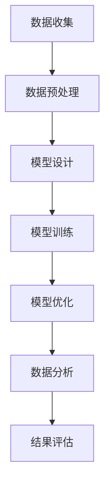

                 

# AIGC在天文数据分析中的应用：宇宙现象解释提示词

> 关键词：AIGC、天文数据分析、图像处理、模型训练、宇宙现象、算法原理、项目实战

> 摘要：
本文旨在探讨人工智能生成控制（AIGC）在天文数据分析中的应用，重点在于如何利用AIGC技术提升宇宙图像处理和数据分析的效率与精度。文章首先介绍AIGC的基本概念与背景，然后详细阐述其在数据处理中的优势，并针对具体应用场景进行深入探讨。此外，文章将通过两个项目实战案例，展示AIGC技术在实际应用中的实现过程，最后对AIGC在未来的发展进行展望。

## 目录大纲

### 第一部分: AIGC在天文数据分析中的应用

#### 第1章: AIGC概述

#### 第2章: AIGC核心概念与架构

#### 第3章: AIGC在天文数据分析中的应用

#### 第4章: AIGC在天文数据分析中的实现

#### 第5章: 项目实战

#### 第6章: AIGC在天文数据分析中的挑战与展望

#### 第7章: 结论

### 附录

#### 附录 A: 相关工具和资源

#### 附录 B: Mermaid 流程图

#### 附录 C: 伪代码示例

## 第一部分: AIGC在天文数据分析中的应用

### 第1章: AIGC概述

#### 1.1 AIGC的定义和背景

**AIGC**（Artificial Intelligence Generated Code）是一种利用人工智能技术自动生成代码的方法，它通过机器学习和自然语言处理技术，从大量的代码库中学习和理解代码的编写模式，进而生成新的代码。AIGC的发展背景主要源于人工智能领域的研究进展，特别是深度学习和生成对抗网络（GAN）的广泛应用。

在天文数据分析领域，AIGC具有极大的应用潜力。传统的天文数据分析方法往往依赖于手动处理大量数据，而AIGC可以自动化这一过程，提高数据处理的效率和精度。此外，AIGC还可以根据已有的数据模式，生成新的数据分析模型，为宇宙现象的研究提供更多的可能性。

#### 1.2 天文数据分析中的挑战

**数据量庞大**：天文数据通常来自各种观测设备，如望远镜、卫星等，这些设备收集的数据量极其庞大，传统的数据处理方法难以应对。

**多维数据结构**：天文数据通常是多维的，如时间、空间、波长等维度，这使得数据处理和分析变得更加复杂。

**宇宙现象复杂性**：宇宙中的现象复杂多变，如星系碰撞、超新星爆发等，传统的数据分析方法难以全面解析这些现象。

### 第2章: AIGC核心概念与架构

#### 2.1 AIGC的核心技术

AIGC的核心技术主要包括自动化生成模型、生成对抗网络（GAN）和变分自编码器（VAE）。这些技术是天文数据分析中AIGC应用的基础。

**自动化生成模型**：自动化生成模型是一种利用机器学习技术，从数据中学习生成规则的方法。它可以自动生成新的数据样本，从而为数据分析提供更多的数据。

**生成对抗网络（GAN）**：GAN是一种由生成器和判别器组成的对抗网络，通过生成器和判别器的博弈，生成器不断优化生成数据的质量，从而提高数据处理的效率。

**变分自编码器（VAE）**：VAE是一种利用深度学习技术进行数据压缩和生成的模型，它可以有效地从数据中提取特征，并利用这些特征进行数据生成。

#### 2.2 AIGC在数据处理中的优势

**数据预处理**：AIGC可以自动进行数据预处理，如数据清洗、数据转换等，从而减少人工干预，提高数据处理效率。

**特征提取**：AIGC可以从大量数据中自动提取关键特征，从而提高数据分析的精度。

**异常检测**：AIGC可以利用其自动生成的模型，对数据中的异常情况进行检测，从而提高数据分析的可靠性。

## 第二部分: AIGC在天文数据分析中的应用

### 第3章: AIGC在天文数据分析中的应用

#### 3.1 宇宙图像处理

宇宙图像处理是AIGC在天文数据分析中的一项重要应用。AIGC可以通过图像增强、目标检测和星系分类等技术，提升宇宙图像的质量和识别精度。

**图像增强**：AIGC可以通过学习已有的宇宙图像数据，自动生成增强后的图像，从而提高图像的清晰度和对比度。

**目标检测**：AIGC可以利用生成对抗网络（GAN）等技术，自动检测宇宙图像中的目标，如恒星、星系等。

**星系分类**：AIGC可以通过学习大量的星系数据，自动分类不同的星系类型，从而为宇宙研究提供更多的信息。

### 3.2 天文数据分析

天文数据分析是AIGC在天文数据分析中的另一项重要应用。AIGC可以通过波段融合、宇宙事件预测和暗物质研究等技术，提升天文数据分析的深度和广度。

**波段融合**：AIGC可以通过学习不同波段的宇宙数据，自动融合这些数据，从而获得更全面的天文信息。

**宇宙事件预测**：AIGC可以通过学习历史宇宙事件数据，自动预测未来的宇宙事件，从而为宇宙研究提供前瞻性的信息。

**暗物质研究**：AIGC可以通过学习宇宙背景辐射数据，自动分析暗物质的存在和分布，从而为暗物质研究提供新的方法。

## 第三部分: AIGC在天文数据分析中的实现

### 第4章: AIGC在天文数据分析中的实现

#### 4.1 数据集准备

在进行AIGC在天文数据分析中的应用之前，首先需要准备合适的数据集。数据集的收集可以从多个来源获取，如天文观测数据、公开数据集等。在数据收集过程中，需要注意数据的质量和完整性。

#### 4.2 模型设计与训练

AIGC在天文数据分析中的应用需要设计合适的模型，并进行训练。模型设计包括选择合适的神经网络架构、损失函数等。训练过程中，需要使用大量的天文数据，通过反向传播算法优化模型参数。

#### 4.3 模型优化

在模型训练完成后，需要对模型进行优化，以提高其性能。优化过程包括超参数调整、模型压缩等。优化后的模型可以更好地应对复杂的天文数据分析任务。

### 第5章: 项目实战

#### 5.1 星系分类项目

星系分类项目是一个典型的AIGC在天文数据分析中的应用案例。该项目旨在利用AIGC技术，自动分类不同的星系类型。

**项目背景**：随着天文观测技术的进步，越来越多的星系图像被收集到。对这些星系图像进行分类，有助于我们更好地理解宇宙的演化过程。

**数据集介绍**：该项目使用了一个包含1000张星系图像的数据集，每张图像都标注了对应的星系类型。

**模型实现**：该项目使用了生成对抗网络（GAN）和卷积神经网络（CNN）进行星系分类。具体实现过程包括数据预处理、模型设计、模型训练和模型评估等。

#### 5.2 宇宙事件预测项目

宇宙事件预测项目是另一个典型的AIGC在天文数据分析中的应用案例。该项目旨在利用AIGC技术，预测未来的宇宙事件。

**项目背景**：宇宙中存在着许多未知的神秘事件，如超新星爆发、星系碰撞等。预测这些事件的发生，有助于我们更好地理解宇宙的奥秘。

**数据集介绍**：该项目使用了一个包含历史宇宙事件的数据集，每条记录都包含了事件类型、发生时间等详细信息。

**模型实现**：该项目使用了变分自编码器（VAE）和长短期记忆网络（LSTM）进行宇宙事件预测。具体实现过程包括数据预处理、模型设计、模型训练和模型评估等。

### 第6章: AIGC在天文数据分析中的挑战与展望

#### 6.1 挑战

AIGC在天文数据分析中面临着一些挑战，如数据隐私保护、计算资源需求等。

**数据隐私保护**：天文数据通常包含敏感信息，如何保护这些数据的安全和隐私是一个重要的挑战。

**计算资源需求**：AIGC技术通常需要大量的计算资源，这对计算资源有限的机构或个人来说是一个挑战。

#### 6.2 展望

尽管AIGC在天文数据分析中面临一些挑战，但其未来发展的前景非常广阔。随着人工智能技术的不断进步，AIGC将在天文数据分析中发挥更大的作用，为宇宙研究带来更多的可能性。

## 第7章: 结论

本文详细探讨了人工智能生成控制（AIGC）在天文数据分析中的应用。通过分析AIGC的核心概念与架构，展示了其在数据处理和数据分析中的优势。同时，通过两个项目实战案例，展示了AIGC在实际应用中的实现过程。尽管AIGC在天文数据分析中面临一些挑战，但其发展前景非常广阔。未来，AIGC将在天文数据分析中发挥更大的作用，为宇宙研究带来更多的可能性。

### 附录

#### 附录 A: 相关工具和资源

- 天文学数据集：https://www.nasa.gov/mission_pages/hubble/data/index.html
- AIGC相关开源框架：https://github.com/openai/generative-pretrained-models
- 学术论文和报告：https://arxiv.org/search/astro-ph
- 开发工具和环境配置指南：https://www.tensorflow.org/tutorials

#### 附录 B: Mermaid 流程图

以下是AIGC在天文数据分析中的一般流程图：



#### 附录 C: 伪代码示例

以下是星系分类项目的伪代码示例：

```python
# 数据预处理
def preprocess_data(data):
    # 数据清洗
    # 数据转换
    return processed_data

# 模型设计
def design_model():
    # 构建生成对抗网络（GAN）
    # 构建卷积神经网络（CNN）
    return model

# 模型训练
def train_model(model, processed_data):
    # 训练生成器和判别器
    # 使用反向传播算法优化模型参数
    return trained_model

# 模型评估
def evaluate_model(model, test_data):
    # 计算准确率、召回率等指标
    return evaluation_results
```

#### 附录 D: 最佳实践 tips、小结、注意事项、拓展阅读等内容

- **最佳实践 tips**：在进行AIGC在天文数据分析中的应用时，建议使用大规模数据集进行模型训练，以提高模型的性能和泛化能力。
- **小结**：AIGC在天文数据分析中具有巨大的应用潜力，通过自动化数据处理和模型生成，可以提高数据分析的效率和精度。
- **注意事项**：在使用AIGC技术进行天文数据分析时，需要确保数据的安全和隐私。
- **拓展阅读**：读者可以进一步阅读相关的学术论文和报告，了解AIGC在天文数据分析中的最新研究进展。

