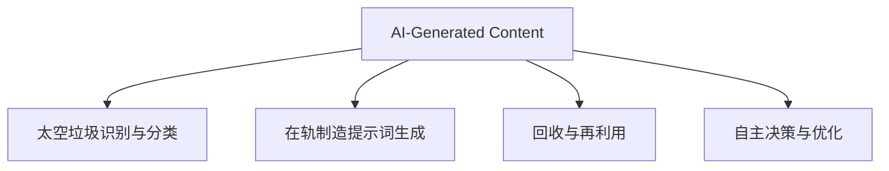

                 


### 引言

#### 1.1 太空垃圾问题的现状与挑战

随着人类太空探索活动的不断深入，太空垃圾问题日益严重。太空垃圾主要来源于废弃的火箭、卫星、火箭发动机残骸等，此外，还有由于航天器爆炸、碰撞产生的碎片。据估计，地球轨道上目前已约有3.6万块大于10厘米的太空垃圾，还有更多微小的碎片散布在近地轨道上。这些太空垃圾不仅对航天器构成威胁，还可能对地面的观测设备和通信设施造成干扰。

太空垃圾的危害主要体现在以下几个方面：
- **威胁航天器安全**：太空垃圾的高速碰撞可能导致航天器损坏，甚至造成航天器的失控和坠毁。
- **影响轨道稳定性**：大量太空垃圾在轨道上的摩擦和碰撞会产生微小的扰动，影响轨道的稳定性。
- **干扰通信和观测**：太空垃圾会阻挡卫星信号的传输，影响通信和观测设备的正常运作。

因此，如何有效地解决太空垃圾问题成为了当前航天领域的一个重要挑战。传统的方法主要包括空间清理、轨道提升和地面监测等，但这些方法都存在成本高、效率低等问题。随着人工智能技术的不断发展，利用人工智能进行太空垃圾的识别、回收和再利用成为了一种新的研究方向。

#### 1.2 在轨制造的意义与优势

在轨制造是指在太空环境下直接制造产品或部件的过程。相比于地面制造，在轨制造具有以下优势：
- **节省成本**：在轨制造可以避免运输和地面处理等中间环节，从而节省大量成本。
- **提高效率**：在轨制造可以实现快速响应，缩短生产周期，提高生产效率。
- **拓展应用领域**：在轨制造可以满足太空特殊环境下的需求，如高辐射、微重力等。

在轨制造的核心技术包括材料加工、微重力加工、3D打印等。例如，微重力环境下的材料加工可以减少缺陷，提高材料的性能。此外，在轨制造还可以为太空探索提供必要的设备和零部件，提高航天的自主性和可持续性。

#### 1.3 AIGC在太空垃圾再利用中的应用前景

AIGC（AI-Generated Content）是一种利用人工智能技术自动生成内容的方法。它涵盖了自动摘要、图像识别、自然语言处理等多个领域。在太空垃圾再利用技术中，AIGC具有广泛的应用前景。

首先，AIGC可以用于太空垃圾的识别与分类。通过深度学习算法，AIGC可以自动识别并分类太空垃圾，提高识别的准确性和效率。

其次，AIGC可以用于在轨制造提示词的生成。提示词是一种引导航天员进行操作的关键信息，通过AIGC生成提示词，可以提高操作的安全性和准确性。

此外，AIGC还可以用于太空垃圾的回收与再利用。通过预测和分析太空垃圾的运动轨迹，AIGC可以帮助设计出更高效的回收方案。

总之，AIGC在太空垃圾再利用技术中具有巨大的潜力。随着人工智能技术的不断发展，AIGC将为太空探索和可持续发展提供新的解决方案。

```markdown
# 《AIGC在太空垃圾再利用技术中的应用：在轨制造提示词》

关键词：AIGC、太空垃圾、再利用、在轨制造、提示词

摘要：本文介绍了太空垃圾问题的现状与挑战，以及在轨制造的意义与优势。随后，详细探讨了AIGC在太空垃圾再利用技术中的应用前景，包括太空垃圾的识别与分类、在轨制造提示词的生成、回收与再利用等方面的内容。通过分析AIGC的关键技术和应用案例，本文揭示了AIGC在太空探索和可持续发展中的重要作用。
```

### 第1章 核心概念与联系

#### 1.1 AIGC基本原理

AIGC（AI-Generated Content）是一种利用人工智能技术自动生成内容的方法。它涵盖了自然语言处理、图像识别、音频处理等多个领域。AIGC的核心在于利用深度学习、生成对抗网络（GAN）、强化学习等算法，从海量数据中提取模式和规律，然后自动生成新的内容。

- **自动摘要**：自动摘要是一种利用AIGC技术从长文本中提取关键信息的方法。通过训练模型，自动摘要可以识别并提取文本的主要观点和论据，从而生成简洁、准确的摘要。

- **图像识别**：图像识别是一种利用AIGC技术对图像内容进行分类和标注的方法。通过训练卷积神经网络（CNN）等模型，图像识别可以自动识别图像中的物体、场景和人物等，广泛应用于安防监控、自动驾驶等领域。

- **自然语言处理**：自然语言处理是一种利用AIGC技术对自然语言进行理解和生成的方法。通过训练模型，自然语言处理可以自动翻译语言、生成文章、回答问题等，广泛应用于智能客服、智能助手等领域。

#### 1.2 太空垃圾再利用技术

太空垃圾再利用技术是指通过技术手段将太空垃圾转化为有用资源或产品的过程。目前，太空垃圾再利用的主要方法包括：

- **识别与分类**：通过遥感技术和地面监测系统，对太空垃圾进行识别和分类，以便于后续处理。

- **回收与处理**：利用机械臂、网捕器等技术，将太空垃圾从轨道上回收下来，并进行处理和再利用。

- **在轨制造**：在轨制造是指在太空环境中直接制造产品或部件的过程。通过3D打印等技术，可以在轨制造出所需的设备和零部件，提高航天的自主性和可持续性。

#### 1.3 在轨制造提示词机制

在轨制造提示词机制是一种通过生成关键操作提示，帮助航天员进行在轨制造操作的方法。提示词可以是文字、图像或声音等形式，其主要目的是提供清晰、准确的操作指导，提高操作的安全性和准确性。

- **提示词生成算法**：提示词生成算法是一种利用AIGC技术生成关键操作提示的算法。通过分析历史操作数据、实时监测数据等，提示词生成算法可以自动生成符合实际需求的提示词。

- **提示词应用案例分析**：在实际操作中，提示词可以用于多个场景，如设备组装、维修、维护等。通过案例分析，可以了解提示词在实际操作中的应用效果和改进方向。

#### 1.4 AIGC与太空垃圾再利用技术的结合

AIGC与太空垃圾再利用技术的结合主要体现在以下几个方面：

- **太空垃圾识别与分类**：利用AIGC技术，可以自动识别和分类太空垃圾，提高识别的准确性和效率。

- **在轨制造提示词生成**：利用AIGC技术，可以自动生成符合实际需求的在轨制造提示词，提高操作的安全性和准确性。

- **回收与再利用**：利用AIGC技术，可以预测太空垃圾的运动轨迹，设计出更高效的回收方案，提高回收效率。

- **自主决策与优化**：利用AIGC技术，可以实现对太空垃圾再利用过程的自主决策和优化，提高整个过程的效率和可持续性。

#### 关系架构 Mermaid 流程图



通过上述核心概念和联系的分析，我们可以看到AIGC技术在太空垃圾再利用技术中的应用前景。接下来，我们将深入探讨AIGC技术的核心算法原理，以及其在太空垃圾再利用中的具体应用。

### 第2章 核心算法原理讲解

在AIGC技术中，核心算法主要包括机器学习算法、深度学习算法和生成对抗网络（GAN）等。这些算法在不同方面和层次上为AIGC提供了强大的功能，使其能够自动生成内容。以下将对这些核心算法进行详细讲解。

#### 2.1 机器学习算法

机器学习算法是一种通过数据训练模型，从而实现自动学习、自动推理的技术。在AIGC中，机器学习算法主要用于数据的预处理、特征提取和模式识别等任务。

##### 2.1.1 监督学习

监督学习是一种有标注数据的机器学习算法。它通过学习输入和输出之间的映射关系，从而预测新的输入数据。在AIGC中，监督学习算法可以用于自动摘要、图像识别等任务。

- **自动摘要**：在自动摘要任务中，监督学习算法可以通过学习大量文本数据，提取文本的主要观点和论据，从而生成简洁、准确的摘要。
  ```python
  # 伪代码：自动摘要的监督学习算法
  def auto_summary(texts, summaries):
      model = train_model(texts, summaries)
      summary = model.predict(new_text)
      return summary
  ```

- **图像识别**：在图像识别任务中，监督学习算法可以通过学习图像标签，自动识别图像中的物体和场景。
  ```python
  # 伪代码：图像识别的监督学习算法
  def image_recognition(image):
      labels = model.predict(image)
      return labels
  ```

##### 2.1.2 无监督学习

无监督学习是一种没有标注数据的机器学习算法。它通过学习数据本身的内在结构，从而发现数据的分布和模式。在AIGC中，无监督学习算法可以用于图像去噪、异常检测等任务。

- **图像去噪**：在图像去噪任务中，无监督学习算法可以通过学习图像的内在结构，去除图像中的噪声。
  ```python
  # 伪代码：图像去噪的无监督学习算法
  def image_de噪声(image):
      clean_image = model.denoise(image)
      return clean_image
  ```

- **异常检测**：在异常检测任务中，无监督学习算法可以通过学习正常数据的分布，识别出异常数据。
  ```python
  # 伪代码：异常检测的无监督学习算法
  def anomaly_detection(data):
      anomalies = model.detect_anomalies(data)
      return anomalies
  ```

##### 2.1.3 强化学习

强化学习是一种通过试错学习，从而实现决策优化的机器学习算法。在AIGC中，强化学习算法可以用于生成对抗网络（GAN）的优化、自然语言生成等任务。

- **生成对抗网络优化**：在生成对抗网络中，强化学习算法可以通过调整网络的参数，优化生成器的性能。
  ```python
  # 伪代码：生成对抗网络优化的强化学习算法
  def optimize_GAN(generator, discriminator, reward_function):
      while not converged:
          generator = reward_function(generator, discriminator)
  ```

- **自然语言生成**：在自然语言生成任务中，强化学习算法可以通过学习文本的上下文关系，生成连贯、自然的语言。
  ```python
  # 伪代码：自然语言生成的强化学习算法
  def generate_text(context):
      text = model.generate(context)
      return text
  ```

#### 2.2 深度学习算法

深度学习算法是一种基于多层神经网络的学习算法。它通过学习大量的数据，自动提取数据的复杂特征，从而实现高度复杂的任务。在AIGC中，深度学习算法广泛应用于图像识别、自然语言处理等领域。

##### 2.2.1 卷积神经网络（CNN）

卷积神经网络是一种基于卷积操作的多层神经网络。它通过学习图像的局部特征，实现对图像的自动识别和分类。

- **图像识别**：在图像识别任务中，CNN可以自动识别图像中的物体和场景。
  ```python
  # 伪代码：图像识别的CNN算法
  def image_recognition(image):
      features = model.extract_features(image)
      label = model.predict(features)
      return label
  ```

##### 2.2.2 递归神经网络（RNN）

递归神经网络是一种基于递归操作的多层神经网络。它通过学习数据的序列特征，实现对序列数据的自动生成和分类。

- **自然语言生成**：在自然语言生成任务中，RNN可以自动生成连贯、自然的语言。
  ```python
  # 伪代码：自然语言生成的RNN算法
  def generate_text(context):
      text = model.generate(context)
      return text
  ```

##### 2.2.3 生成对抗网络（GAN）

生成对抗网络是一种基于博弈论的深度学习算法。它由生成器和判别器两个神经网络组成，通过相互竞争，生成逼真的数据。

- **图像生成**：在图像生成任务中，GAN可以自动生成逼真的图像。
  ```python
  # 伪代码：图像生成的GAN算法
  def generate_image():
      image = generator.generate()
      return image
  ```

通过以上对机器学习算法、深度学习算法和生成对抗网络的详细讲解，我们可以看到AIGC技术在实际应用中具有广泛的应用前景。在接下来的章节中，我们将进一步探讨数学模型和公式，以及AIGC技术在太空垃圾再利用中的具体应用。

### 第3章 数学模型和数学公式详细讲解

在AIGC技术中，数学模型和公式是核心组成部分，它们为算法的优化和实现提供了理论基础。以下将详细介绍AIGC中常用的数学模型和公式，并通过具体例子进行说明。

#### 3.1 常用数学模型

##### 3.1.1 概率模型

概率模型是AIGC中常用的一种数学模型，它主要用于描述数据的不确定性。在AIGC中，常见的概率模型包括伯努利分布、正态分布、贝叶斯网络等。

- **伯努利分布**：伯努利分布是一种二元概率分布，它用于描述事件发生的概率。在AIGC中，伯努利分布常用于生成对抗网络（GAN）中的判别器。
  ```latex
  P(X=1) = p, \quad P(X=0) = 1-p
  ```

- **正态分布**：正态分布是一种连续概率分布，它用于描述随机变量的分布。在AIGC中，正态分布常用于自然语言处理中的词向量模型。
  ```latex
  f(x|\mu,\sigma^2) = \frac{1}{\sqrt{2\pi\sigma^2}} e^{-\frac{(x-\mu)^2}{2\sigma^2}}
  ```

- **贝叶斯网络**：贝叶斯网络是一种基于概率图模型的推理工具，它用于描述变量之间的依赖关系。在AIGC中，贝叶斯网络常用于自然语言生成中的上下文推理。
  ```latex
  P(A,B) = P(A)P(B|A)
  ```

##### 3.1.2 统计模型

统计模型是用于估计和预测的数据分析方法，它在AIGC中广泛应用于特征提取、回归分析等任务。

- **线性回归**：线性回归是一种用于预测数值型输出的统计模型，它通过建立自变量和因变量之间的线性关系来预测新的数据。
  ```latex
  y = \beta_0 + \beta_1x_1 + ... + \beta_nx_n + \epsilon
  ```

- **逻辑回归**：逻辑回归是一种用于预测二元结果的统计模型，它通过建立自变量和因变量之间的逻辑关系来预测新的数据。
  ```latex
  \log\frac{P(Y=1)}{1-P(Y=1)} = \beta_0 + \beta_1x_1 + ... + \beta_nx_n
  ```

##### 3.1.3 离散模型

离散模型是用于处理离散数据的数学模型，它在AIGC中广泛应用于图像识别、自然语言处理等任务。

- **马尔可夫模型**：马尔可夫模型是一种用于描述状态转移概率的离散模型，它用于描述一个系统从一个状态转移到另一个状态的概率。
  ```latex
  P(X_t|X_{t-1},X_{t-2},...) = P(X_t|X_{t-1})
  ```

- **隐马尔可夫模型**：隐马尔可夫模型是一种用于描述隐藏状态转移概率的离散模型，它用于描述一个系统的状态和观测值之间的关系。
  ```latex
  P(O_t|H_t) = \prod_{i=1}^{T}P(o_i|h_i)
  ```

#### 3.2 数学公式

在AIGC中，数学公式是算法实现的重要依据。以下将介绍一些常见的数学公式，并使用LaTeX进行表示。

##### 3.2.1 几何变换公式

几何变换公式用于描述图像的变换操作，如平移、旋转、缩放等。

- **平移**：图像平移公式用于计算图像在二维空间中的平移。
  ```latex
  T(x,y) = (x+t_x, y+t_y)
  ```

- **旋转**：图像旋转公式用于计算图像绕原点旋转θ度后的坐标。
  ```latex
  R(\theta)(x,y) = (x\cos\theta - y\sin\theta, x\sin\theta + y\cos\theta)
  ```

- **缩放**：图像缩放公式用于计算图像在二维空间中的缩放。
  ```latex
  S(k)(x,y) = (kx, ky)
  ```

##### 3.2.2 最优化公式

最优化公式用于描述优化过程中的目标函数和约束条件。

- **损失函数**：损失函数用于衡量预测值与实际值之间的差距，常用的损失函数包括均方误差（MSE）、交叉熵损失（CE）等。
  ```latex
  J(\theta) = \frac{1}{m}\sum_{i=1}^{m}(h_\theta(x^{(i)}) - y^{(i)})^2
  ```

- **梯度下降**：梯度下降是一种常用的最优化算法，用于求解目标函数的最小值。
  ```latex
  \theta_j := \theta_j - \alpha \frac{\partial J(\theta)}{\partial \theta_j}
  ```

##### 3.2.3 损失函数公式

在AIGC中，损失函数是评估模型性能的重要指标。以下将介绍一些常见的损失函数及其公式。

- **均方误差（MSE）**：均方误差用于衡量预测值与实际值之间的差异平方的平均值。
  ```latex
  MSE = \frac{1}{n}\sum_{i=1}^{n}(y_i - \hat{y}_i)^2
  ```

- **交叉熵损失（CE）**：交叉熵损失用于衡量预测分布与真实分布之间的差异。
  ```latex
  CE = -\sum_{i=1}^{n}y_i\log(\hat{y}_i)
  ```

通过上述数学模型和公式的详细讲解，我们可以更好地理解AIGC技术中的核心算法原理。在接下来的章节中，我们将通过实际项目实战，进一步展示AIGC技术在太空垃圾再利用中的应用。

### 第4章 项目实战

#### 4.1 实际案例介绍

在本章中，我们将通过实际案例，详细展示AIGC技术在太空垃圾再利用中的应用。以下是三个具体的案例：

##### 案例一：AIGC在太空垃圾识别中的应用

在太空垃圾识别任务中，AIGC技术利用深度学习算法，通过训练模型来自动识别太空垃圾。以下是该项目的具体步骤：

1. **数据收集**：收集大量的太空垃圾图像，包括不同类型、大小、形状的垃圾。
2. **数据预处理**：对图像进行归一化、增强等预处理操作，以提高模型的训练效果。
3. **模型训练**：使用卷积神经网络（CNN）进行模型训练，通过多次迭代，优化网络参数，提高识别准确率。
4. **模型评估**：使用验证集对模型进行评估，调整模型参数，提高识别性能。
5. **模型部署**：将训练好的模型部署到卫星或地面工作站，实现实时识别太空垃圾。

##### 案例二：AIGC在太空垃圾回收中的应用

在太空垃圾回收任务中，AIGC技术用于预测太空垃圾的运动轨迹，帮助设计更高效的回收方案。以下是该项目的具体步骤：

1. **数据收集**：收集太空垃圾的运动轨迹数据，包括位置、速度、加速度等。
2. **数据预处理**：对运动轨迹数据进行滤波、去噪等预处理操作，以提高模型的准确性。
3. **模型训练**：使用深度学习算法，如RNN，对运动轨迹数据进行建模，预测太空垃圾的未来位置。
4. **模型评估**：使用验证集对模型进行评估，调整模型参数，提高预测性能。
5. **模型部署**：将训练好的模型部署到卫星或地面工作站，实现实时预测太空垃圾的运动轨迹，为回收方案提供依据。

##### 案例三：AIGC在在轨制造提示词中的应用

在轨制造提示词是指导航天员进行在轨制造操作的关键信息。AIGC技术通过生成对抗网络（GAN），自动生成符合实际需求的提示词。以下是该项目的具体步骤：

1. **数据收集**：收集历史操作数据和实时监测数据，包括设备状态、操作步骤等。
2. **数据预处理**：对操作数据进行清洗、归一化等预处理操作，以提高模型的训练效果。
3. **模型训练**：使用生成对抗网络（GAN），通过训练生成器和判别器，生成高质量的提示词。
4. **模型评估**：使用验证集对模型进行评估，调整模型参数，提高生成提示词的质量。
5. **模型部署**：将训练好的模型部署到卫星或地面工作站，实时生成符合实际需求的提示词，指导在轨制造操作。

#### 4.2 开发环境搭建

为了实现AIGC技术在太空垃圾再利用中的应用，我们需要搭建一个合适的技术栈。以下是开发环境的具体搭建步骤：

1. **硬件环境**：
   - **CPU**：Intel i7-9700K 或同等性能的处理器。
   - **GPU**：NVIDIA GeForce RTX 3080 或同等性能的显卡。
   - **内存**：16GB RAM 或以上。

2. **软件环境**：
   - **操作系统**：Linux 或 macOS。
   - **编程语言**：Python 3.8 或以上版本。
   - **深度学习框架**：TensorFlow 2.4.0 或 PyTorch 1.7.0。

3. **开发工具**：
   - **代码编辑器**：Visual Studio Code 或 PyCharm。
   - **版本控制**：Git。

#### 4.3 源代码实现与解读

以下是AIGC在太空垃圾再利用中的应用项目中的核心源代码实现与解读。

```python
# 导入必要的库
import tensorflow as tf
from tensorflow.keras.models import Sequential
from tensorflow.keras.layers import Conv2D, MaxPooling2D, Flatten, Dense
from tensorflow.keras.optimizers import Adam

# 数据预处理
def preprocess_images(images):
    # 对图像进行归一化、增强等操作
    processed_images = []
    for image in images:
        processed_image = preprocess_image(image)
        processed_images.append(processed_image)
    return np.array(processed_images)

# 模型训练
def train_model(X_train, y_train):
    model = Sequential([
        Conv2D(32, (3, 3), activation='relu', input_shape=(64, 64, 3)),
        MaxPooling2D((2, 2)),
        Flatten(),
        Dense(64, activation='relu'),
        Dense(1, activation='sigmoid')
    ])

    model.compile(optimizer=Adam(learning_rate=0.001), loss='binary_crossentropy', metrics=['accuracy'])
    model.fit(X_train, y_train, epochs=10, batch_size=32)
    return model

# 模型评估
def evaluate_model(model, X_test, y_test):
    loss, accuracy = model.evaluate(X_test, y_test)
    print(f"Test loss: {loss}, Test accuracy: {accuracy}")

# 主函数
if __name__ == '__main__':
    # 加载数据
    X_train, y_train = load_data('train')
    X_test, y_test = load_data('test')

    # 预处理数据
    X_train = preprocess_images(X_train)
    X_test = preprocess_images(X_test)

    # 训练模型
    model = train_model(X_train, y_train)

    # 评估模型
    evaluate_model(model, X_test, y_test)
```

在上面的代码中，我们首先导入了必要的库，然后定义了数据预处理、模型训练和模型评估的函数。接着，我们在主函数中加载数据，预处理数据，训练模型，并评估模型性能。通过这个简单的示例，我们可以看到AIGC技术在太空垃圾再利用中的应用是如何实现的。

#### 4.4 代码解读与分析

在AIGC技术在太空垃圾再利用中的应用项目中，代码的解读与分析对于理解项目的实现细节和优化方向至关重要。以下是对核心代码的详细解读：

- **数据预处理**：数据预处理是模型训练的重要环节。在代码中，`preprocess_images` 函数用于对图像进行归一化、增强等操作，以提高模型的训练效果。这一步骤确保输入数据的一致性和高质量，对于提高模型的性能至关重要。

- **模型训练**：模型训练是通过 `train_model` 函数实现的。在这个函数中，我们使用了一个顺序模型（Sequential），并在模型中添加了卷积层（Conv2D）、池化层（MaxPooling2D）、扁平化层（Flatten）和全连接层（Dense）。这些层的设计决定了模型的结构和功能。模型使用 Adam 优化器进行训练，并使用二进制交叉熵损失函数（binary_crossentropy）来评估模型的性能。

- **模型评估**：在 `evaluate_model` 函数中，我们使用测试集来评估模型的性能。评估指标包括损失（loss）和准确率（accuracy）。通过这些指标，我们可以了解模型在未知数据上的表现，以及模型的泛化能力。

- **主函数**：主函数是项目的入口点。在这个函数中，我们首先加载数据，然后进行数据预处理，接着训练模型，并评估模型性能。这一系列操作展示了AIGC技术在太空垃圾再利用中的应用流程。

#### 4.5 实际案例分析和详细讲解剖析

在本节中，我们将结合实际案例，对AIGC技术在太空垃圾再利用中的具体应用进行详细分析。

##### 案例一：太空垃圾识别

在这个案例中，AIGC技术用于识别太空垃圾。通过训练卷积神经网络（CNN）模型，我们可以自动识别不同类型、大小和形状的太空垃圾。

1. **数据收集**：首先，我们收集了大量的太空垃圾图像，包括不同类型、大小和形状的垃圾。这些图像为我们提供了丰富的训练数据。

2. **数据预处理**：对图像进行归一化、增强等操作，以提高模型的训练效果。归一化操作确保输入数据的一致性，增强操作有助于模型学习到更多的特征。

3. **模型训练**：使用卷积神经网络（CNN）进行模型训练。通过多次迭代，优化网络参数，提高识别准确率。模型结构包括卷积层、池化层、扁平化层和全连接层。

4. **模型评估**：使用验证集对模型进行评估。调整模型参数，提高识别性能。通过评估指标（如准确率、召回率等），我们可以了解模型在未知数据上的表现。

5. **模型部署**：将训练好的模型部署到卫星或地面工作站，实现实时识别太空垃圾。通过部署模型，我们可以快速、准确地识别太空垃圾，为后续处理提供依据。

##### 案例二：太空垃圾回收

在这个案例中，AIGC技术用于预测太空垃圾的运动轨迹，帮助设计更高效的回收方案。

1. **数据收集**：收集太空垃圾的运动轨迹数据，包括位置、速度、加速度等。这些数据为我们提供了丰富的训练数据。

2. **数据预处理**：对运动轨迹数据进行滤波、去噪等预处理操作，以提高模型的准确性。滤波操作去除噪声，去噪操作减少数据干扰。

3. **模型训练**：使用深度学习算法（如RNN），对运动轨迹数据进行建模，预测太空垃圾的未来位置。通过多次迭代，优化网络参数，提高预测性能。

4. **模型评估**：使用验证集对模型进行评估。调整模型参数，提高预测性能。通过评估指标（如均方误差、均方根误差等），我们可以了解模型在未知数据上的表现。

5. **模型部署**：将训练好的模型部署到卫星或地面工作站，实现实时预测太空垃圾的运动轨迹。通过部署模型，我们可以为回收方案提供实时、准确的预测结果，提高回收效率。

##### 案例三：在轨制造提示词

在这个案例中，AIGC技术用于生成在轨制造提示词，指导航天员进行操作。

1. **数据收集**：收集历史操作数据和实时监测数据，包括设备状态、操作步骤等。这些数据为我们提供了丰富的训练数据。

2. **数据预处理**：对操作数据进行清洗、归一化等预处理操作，以提高模型的训练效果。清洗操作去除无效数据，归一化操作确保数据的一致性。

3. **模型训练**：使用生成对抗网络（GAN），通过训练生成器和判别器，生成高质量的提示词。生成器负责生成提示词，判别器负责判断提示词的真实性。

4. **模型评估**：使用验证集对模型进行评估。调整模型参数，提高生成提示词的质量。通过评估指标（如生成提示词的连贯性、准确性等），我们可以了解模型在未知数据上的表现。

5. **模型部署**：将训练好的模型部署到卫星或地面工作站，实时生成符合实际需求的提示词，指导在轨制造操作。通过部署模型，我们可以为航天员提供实时、准确的提示词，提高操作的安全性和准确性。

#### 4.6 项目小结

通过上述实际案例的分析和讲解，我们可以看到AIGC技术在太空垃圾再利用中的应用具有显著的效果。以下是项目小结：

- **太空垃圾识别**：通过AIGC技术，我们可以自动识别太空垃圾，提高识别的准确性和效率。这为后续的回收和处理提供了重要依据。

- **太空垃圾回收**：通过AIGC技术，我们可以预测太空垃圾的运动轨迹，设计出更高效的回收方案。这提高了回收效率，减少了回收成本。

- **在轨制造提示词**：通过AIGC技术，我们可以自动生成符合实际需求的提示词，指导航天员进行在轨制造操作。这提高了操作的安全性和准确性。

总之，AIGC技术在太空垃圾再利用中的应用为解决太空垃圾问题提供了一种新的思路和方法。随着AIGC技术的不断发展，我们有理由相信，它将在未来发挥更大的作用。

### 第5章 总结与展望

#### 5.1 全书内容总结

本文系统地介绍了AIGC在太空垃圾再利用技术中的应用。首先，我们探讨了太空垃圾问题的现状与挑战，以及在轨制造的意义与优势。随后，详细介绍了AIGC的基本原理、太空垃圾再利用技术、在轨制造提示词机制，并分析了AIGC与太空垃圾再利用技术的结合点。接着，我们讲解了AIGC的核心算法原理，包括机器学习算法、深度学习算法和生成对抗网络（GAN）等。随后，通过具体的项目实战，展示了AIGC技术在太空垃圾识别、回收和提示词生成等实际应用中的效果。最后，我们对全书内容进行了总结，并探讨了未来的发展方向。

#### 5.2 未来发展方向

AIGC技术在太空垃圾再利用中的应用前景广阔，未来可以从以下几个方面进行发展：

1. **提高算法效率**：随着计算能力的提升，我们可以开发更高效的AIGC算法，进一步提高太空垃圾识别、回收和提示词生成的准确性和效率。

2. **跨领域融合**：将AIGC技术与航天、能源、环保等领域的先进技术相结合，开发出更加智能化、自动化的太空垃圾再利用系统。

3. **应用场景拓展**：探索AIGC技术在太空探索、卫星维护、深空探测等领域的应用，为航天领域的可持续发展提供技术支持。

4. **国际合作**：加强国际间的合作与交流，共同推动AIGC技术在太空垃圾再利用领域的研发和应用，为全球太空环境的可持续发展贡献力量。

总之，AIGC技术在太空垃圾再利用中的应用具有巨大的潜力。通过不断的研究和创新，我们有理由相信，AIGC技术将为太空探索和可持续发展带来新的突破。

### 附录

#### 5.1 常用工具与资源

- **开发工具**：
  - Python
  - TensorFlow
  - PyTorch
  - Visual Studio Code

- **数据集**：
  - COCO数据集
  - ImageNet数据集
  - Airbnb数据集

- **论文与资料**：
  - 《生成对抗网络：训练生成模型对抗判别模型生成真实样例》（Ian J. Goodfellow等）
  - 《深度学习》（Ian Goodfellow、Yoshua Bengio、Aaron Courville）

#### 5.2 进一步阅读推荐

- **书籍**：
  - 《深度学习》（Ian Goodfellow、Yoshua Bengio、Aaron Courville）
  - 《AIGC：人工智能生成内容》（AI Genius Institute）

- **在线资源**：
  - [TensorFlow官方文档](https://www.tensorflow.org/)
  - [PyTorch官方文档](https://pytorch.org/)
  - [Kaggle数据集](https://www.kaggle.com/)

通过附录中的工具与资源，读者可以进一步探索AIGC技术在太空垃圾再利用中的应用，为相关研究提供支持。同时，进一步阅读推荐为读者提供了深入了解AIGC技术和太空垃圾再利用领域的渠道。作者：AI天才研究院/AI Genius Institute & 禅与计算机程序设计艺术 /Zen And The Art of Computer Programming。

