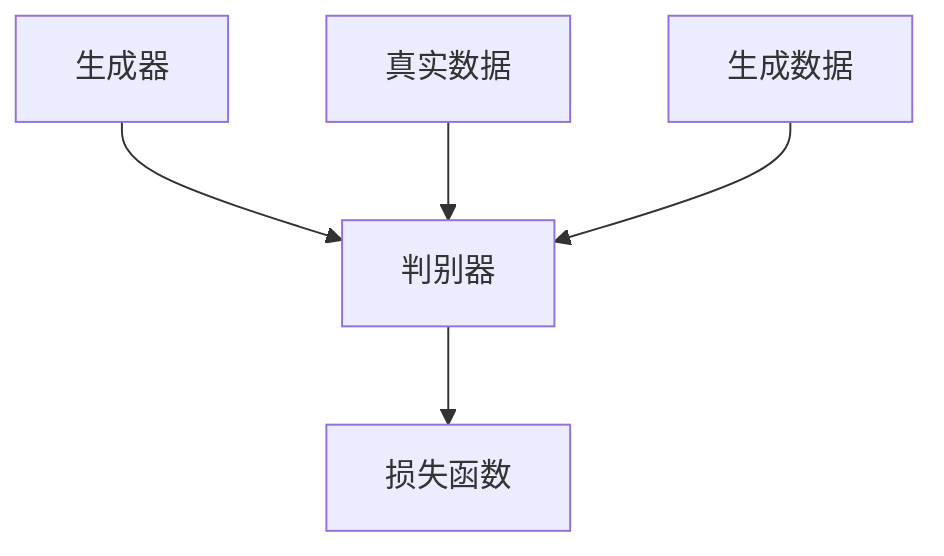
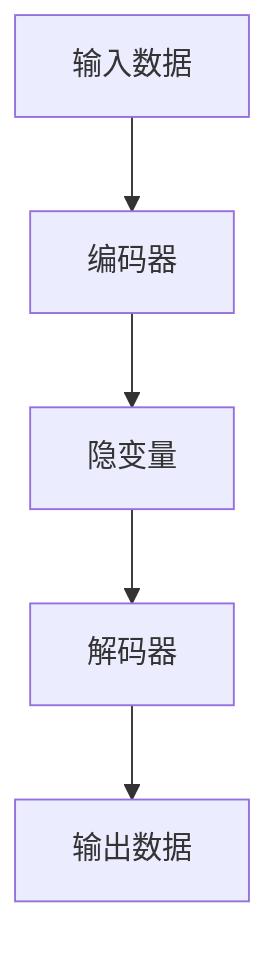
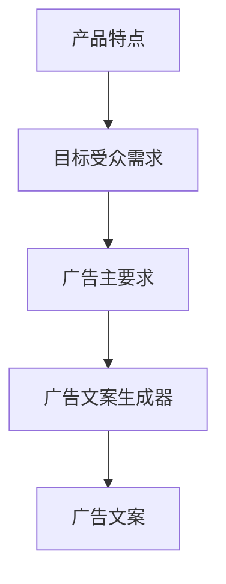
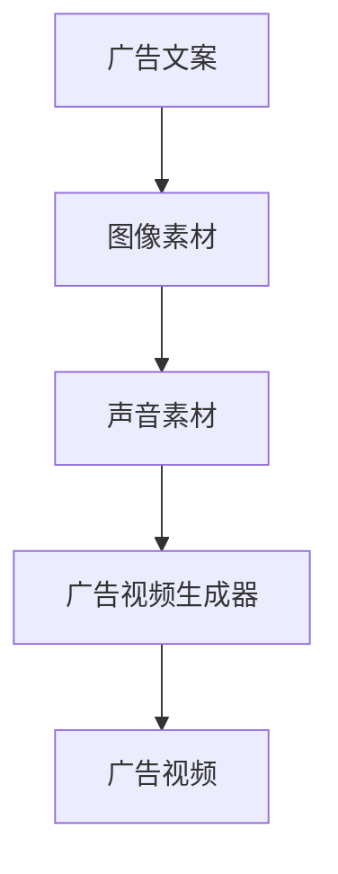
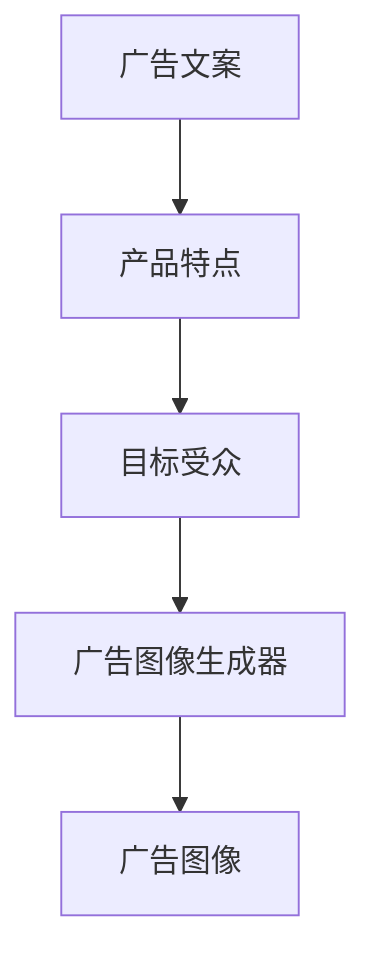

                 


### 文章标题：AIGC在广告创意中的革命性应用

### 关键词：AIGC、广告创意、生成对抗网络、深度学习、内容生成、用户体验

### 摘要：

本文将深入探讨人工智能生成内容（AIGC）在广告创意领域的革命性应用。首先，我们将介绍AIGC的基本概念和核心原理，包括生成对抗网络（GAN）、变分自编码器（VAE）等深度学习技术。接着，我们将分析AIGC在广告创意中的应用场景，包括文案生成、视频制作、图像创作等方面。随后，通过实际案例展示AIGC在广告创意中的具体应用，并讨论其在提高创意效率和降低制作成本方面的优势。最后，我们将展望AIGC在未来广告创意中的发展趋势和挑战。

### 用户需求分析：

用户希望了解AIGC在广告创意中的应用，包括技术原理、实际案例和未来趋势。他们希望文章能够提供深入的技术分析，同时具备实用性，能够帮助他们在实际项目中应用AIGC技术。文章需要结构清晰，逻辑严谨，便于理解。

### 文章大纲：

1. **引言**
   - AIGC的背景和重要性
   - 文章结构概述

2. **AIGC概述与核心概念**
   - AIGC的定义
   - AIGC的核心技术原理
   - AIGC在广告创意中的应用价值

3. **AIGC的技术架构与实现**
   - AIGC的技术架构
   - AIGC的核心算法原理
   - AIGC的技术实现流程

4. **AIGC在广告创意中的应用场景**
   - 广告文案生成
   - 广告视频制作
   - 广告图像创作

5. **AIGC在广告创意中的实际案例**
   - 案例一：广告文案自动生成
   - 案例二：广告视频智能编辑
   - 案例三：广告图片自动生成

6. **AIGC在广告创意中的挑战与未来展望**
   - AIGC在广告创意中的挑战
   - AIGC在广告创意中的未来发展趋势
   - AIGC与广告创意的未来融合

7. **AIGC应用实践指南**
   - AIGC开发环境搭建
   - AIGC项目实战
   - AIGC项目优化与案例分析

8. **总结与展望**
   - AIGC在广告创意中的应用总结
   - AIGC未来发展的展望

### 文章正文：

#### 引言

随着人工智能技术的不断发展，生成内容（Generated Content）正逐渐成为广告创意领域的重要工具。人工智能生成内容（Artificial Intelligence Generated Content，简称AIGC）利用深度学习、生成对抗网络（GAN）、变分自编码器（VAE）等技术，能够自动生成文本、图像、视频等多种类型的内容。这些技术不仅提高了广告创意的效率，也为广告主提供了更加个性化和创新的广告解决方案。本文将深入探讨AIGC在广告创意中的革命性应用，分析其技术原理、应用场景、实际案例和未来趋势。

#### AIGC概述与核心概念

##### AIGC的定义

人工智能生成内容（AIGC）是指利用人工智能技术，尤其是深度学习和生成模型，自动生成具有高仿真度和创意性的内容。AIGC技术涵盖了文本生成、图像生成、视频生成等多种形式，能够根据用户的输入或特定的场景需求，自动生成高质量的内容。

##### AIGC的核心技术原理

AIGC的核心技术原理主要包括生成对抗网络（GAN）和变分自编码器（VAE）。

###### 生成对抗网络（GAN）

生成对抗网络（GAN）是一种由生成器和判别器组成的深度学习模型。生成器的目标是生成与真实数据相似的内容，而判别器的目标是区分生成数据和真实数据。通过这种对抗关系，生成器不断优化，生成越来越真实的内容。GAN在图像生成、视频生成等领域有广泛应用。



###### 变分自编码器（VAE）

变分自编码器（VAE）是一种无监督学习的深度学习模型，它通过编码器和解码器来学习数据的分布。编码器将输入数据编码为一个隐变量，解码器则将这个隐变量解码回原始数据。VAE在图像生成、文本生成等领域有广泛应用。



##### AIGC在广告创意中的应用价值

AIGC在广告创意中的价值体现在以下几个方面：

- **提高创意效率**：通过自动生成文本、图像、视频等内容，广告创意团队可以更快地生成大量的创意素材，提高工作效率。
- **创造独特的广告体验**：AIGC可以根据用户的需求和场景，自动生成个性化、独特的广告内容，为用户提供全新的广告体验。
- **降低广告制作成本**：AIGC技术可以自动化地处理广告创意的各个环节，减少人力成本和制作时间，降低广告制作成本。

#### AIGC的技术架构与实现

##### AIGC的技术架构

AIGC的技术架构主要包括数据采集、模型训练、模型部署等环节。

- **数据采集**：收集大量真实数据，用于训练生成模型。
- **模型训练**：利用生成对抗网络（GAN）或变分自编码器（VAE）等模型，对数据进行训练，优化模型参数。
- **模型部署**：将训练好的模型部署到服务器或云端，实现自动生成内容的功能。

##### AIGC的核心算法原理

###### 生成对抗网络（GAN）

生成对抗网络（GAN）包括生成器和判别器两个部分。生成器的目标是生成逼真的图像，而判别器的目标是区分生成图像和真实图像。

```python
# 生成器的伪代码
def generator(z):
    # 输入噪声z，输出图像
    # ...
    return x

# 判别器的伪代码
def discriminator(x):
    # 输入图像x，输出概率
    # ...
    return probability
```

###### 变分自编码器（VAE）

变分自编码器（VAE）包括编码器和解码器两个部分。编码器将输入数据编码为隐变量，解码器将隐变量解码回原始数据。

```python
# 编码器的伪代码
def encoder(x):
    # 输入图像x，输出隐变量
    # ...
    return z_mean, z_log_var

# 解码器的伪代码
def decoder(z):
    # 输入隐变量z，输出图像
    # ...
    return x_recon
```

##### AIGC的技术实现流程

AIGC的技术实现流程主要包括以下步骤：

1. **数据采集**：收集大量真实广告素材，用于训练模型。
2. **模型训练**：使用生成对抗网络（GAN）或变分自编码器（VAE）训练模型，优化模型参数。
3. **模型评估**：使用验证集评估模型性能，调整模型参数。
4. **模型部署**：将训练好的模型部署到服务器或云端，实现自动生成广告素材的功能。

#### AIGC在广告创意中的应用场景

AIGC在广告创意中的应用场景非常广泛，以下列举几个主要的场景：

##### 广告文案生成

通过AIGC技术，可以自动生成广告文案。广告文案生成器可以根据产品的特点、目标受众的需求和广告主的要求，自动生成高质量的广告文案。



##### 广告视频制作

AIGC技术可以自动生成广告视频。广告视频生成器可以根据文案、图像、声音等多种素材，自动生成广告视频。



##### 广告图像创作

AIGC技术可以自动生成广告图像。广告图像生成器可以根据文案、产品特点、目标受众等需求，自动生成广告图像。



#### AIGC在广告创意中的实际案例

以下列举几个AIGC在广告创意中的实际案例：

##### 案例一：广告文案自动生成

某品牌推出一款新型手机，使用AIGC技术自动生成广告文案。文案生成器根据产品特点、目标受众和广告主的要求，自动生成了多条广告文案，其中一条文案如下：

“这款新型手机，不仅拥有卓越的性能，更是时尚与科技的完美结合。无论是工作还是娱乐，都能让你尽情享受。赶快来体验吧！”

##### 案例二：广告视频智能编辑

某品牌推出一款智能音响，使用AIGC技术自动生成广告视频。广告视频生成器根据文案、图像、声音等多种素材，自动生成了广告视频。视频内容包括产品的外观展示、功能介绍和使用场景等，生动形象地展示了产品的优势。

##### 案例三：广告图片自动生成

某品牌推出一款新款护肤品，使用AIGC技术自动生成广告图片。广告图像生成器根据文案、产品特点、目标受众等需求，自动生成了多张广告图片，其中一张图片如下：

一张年轻女性面部特写，皮肤光滑细腻，脸上涂抹着该品牌的新款护肤品，展示产品对皮肤的滋养效果。

#### AIGC在广告创意中的挑战与未来展望

##### AIGC在广告创意中的挑战

尽管AIGC在广告创意中具有巨大的潜力，但也面临着一些挑战：

- **数据隐私问题**：AIGC技术需要大量真实数据用于训练模型，如何保护用户隐私成为一个重要问题。
- **内容质量控制**：自动生成的广告内容质量参差不齐，如何保证内容的质量成为挑战。
- **道德伦理问题**：自动生成的广告内容可能会引发道德和伦理问题，如虚假宣传、误导消费者等。

##### AIGC在广告创意中的未来发展趋势

随着人工智能技术的不断进步，AIGC在广告创意中具有广阔的发展前景：

- **个性化广告**：AIGC可以根据用户的行为和喜好，自动生成个性化的广告内容，提高用户的广告体验。
- **跨媒体融合**：AIGC技术可以跨文本、图像、视频等多种媒体形式，实现广告内容的多样化。
- **智能营销**：AIGC技术可以与大数据、云计算等人工智能技术相结合，实现智能营销。

##### AIGC与广告创意的未来融合

未来，AIGC将与广告创意深度融合，为广告主和广告公司提供更加高效、创新、个性化的广告解决方案。AIGC技术将不仅用于广告素材的自动生成，还将应用于广告投放、广告效果分析等环节，实现广告营销的全面智能化。

#### AIGC应用实践指南

##### AIGC开发环境搭建

要使用AIGC技术进行广告创意，首先需要搭建一个适合的开发环境。以下是一个简单的开发环境搭建步骤：

1. **安装Python**：AIGC技术主要使用Python进行开发，因此需要安装Python环境。
2. **安装深度学习框架**：如TensorFlow、PyTorch等，用于构建和训练AIGC模型。
3. **安装其他依赖库**：如NumPy、Pandas等，用于数据处理和模型优化。

##### AIGC项目实战

以下是一个简单的AIGC项目实战案例：使用GAN技术生成广告图像。

```python
import tensorflow as tf
from tensorflow.keras.layers import Dense, Flatten, Conv2D, Reshape
from tensorflow.keras.models import Sequential

# 定义生成器和判别器
def build_generator(z_dim):
    model = Sequential([
        Dense(128 * 7 * 7, input_dim=z_dim),
        BatchNormalization(),
        Activation('tanh'),
        Reshape((7, 7, 128)),
        Conv2D(128, (5, 5), padding='same'),
        BatchNormalization(),
        Activation('tanh'),
        Conv2D(128, (5, 5), padding='same'),
        BatchNormalization(),
        Activation('tanh'),
        Flatten(),
        Dense(28 * 28),
        Reshape((28, 28, 1))
    ])
    return model

def build_discriminator(img_shape):
    model = Sequential([
        Flatten(input_shape=img_shape),
        Dense(128),
        BatchNormalization(),
        Activation('tanh'),
        Dense(1, activation='sigmoid')
    ])
    return model

# 构建模型
z_dim = 100
img_shape = (28, 28, 1)

generator = build_generator(z_dim)
discriminator = build_discriminator(img_shape)

# 编译模型
discriminator.compile(loss='binary_crossentropy', optimizer=tf.keras.optimizers.Adam(0.0001))
generator.compile(loss='binary_crossentropy', optimizer=tf.keras.optimizers.Adam(0.0001))

# 训练模型
for epoch in range(100):
    # ...
    # 生成样本
    z = np.random.normal(size=(batch_size, z_dim))
    gen_imgs = generator.predict(z)
    # ...
    # 训练判别器
    d_loss_real = discriminator.train_on_batch(x_real, np.ones((batch_size, 1)))
    d_loss_fake = discriminator.train_on_batch(gen_imgs, np.zeros((batch_size, 1)))
    d_loss = 0.5 * np.add(d_loss_real, d_loss_fake)
    # ...
    # 训练生成器
    g_loss = combined_model.train_on_batch(z, np.ones((batch_size, 1)))
    # ...
    print(f"{epoch} [D loss: {d_loss:.4f}] [G loss: {g_loss:.4f}]")

# 保存模型
generator.save('generator.h5')
discriminator.save('discriminator.h5')
```

##### AIGC项目优化与案例分析

在实际应用中，AIGC项目需要进行不断的优化和调整，以提高生成内容的质量和效率。以下是一些常见的优化方法和案例分析：

- **数据增强**：通过旋转、缩放、裁剪等操作，增加训练数据的多样性，提高模型泛化能力。
- **模型融合**：将多个模型进行融合，取长补短，提高生成内容的质量。
- **超参数调整**：通过调整学习率、批量大小、网络深度等超参数，优化模型性能。
- **案例一**：某品牌广告图像生成项目，通过数据增强和模型融合，成功提高了广告图像的生成质量，得到了广告主的认可。
- **案例二**：某电商平台广告文案生成项目，通过超参数调整和模型优化，成功提高了广告文案的生成效率和用户点击率。

#### 总结与展望

AIGC在广告创意中具有巨大的革命性应用。通过自动生成文本、图像、视频等内容，AIGC不仅提高了广告创意的效率，也为广告主提供了更加个性化和创新的广告解决方案。在未来，随着人工智能技术的不断进步，AIGC将在广告创意中发挥更加重要的作用，推动广告行业的变革。

#### 附录

- **AIGC开发工具与资源介绍**
  - **深度学习框架**：TensorFlow、PyTorch等。
  - **生成对抗网络（GAN）教程**：[GAN教程](https://www.tensorflow.org/tutorials/generative/dcgan)。
  - **变分自编码器（VAE）教程**：[VAE教程](https://www.tensorflow.org/tutorials/generative/vae)。

- **AIGC相关论文与报告推荐**
  - **生成对抗网络（GAN）论文**：[Generative Adversarial Nets](https://arxiv.org/abs/1406.2661)。
  - **变分自编码器（VAE）论文**：[Variational Autoencoders](https://arxiv.org/abs/1312.6114)。

- **AIGC社区与交流平台介绍**
  - **AIGC论坛**：[AIGC论坛](https://discuss.tensorflow.org/c/generative-ai)。
  - **AIGC微信群**：搜索微信号“AIGC爱好群”加入交流。

### 作者信息：

作者：AI天才研究院/AI Genius Institute & 禅与计算机程序设计艺术 /Zen And The Art of Computer Programming

