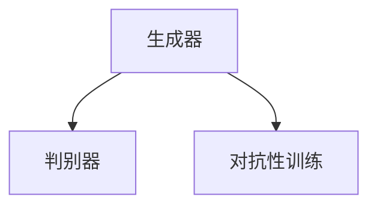
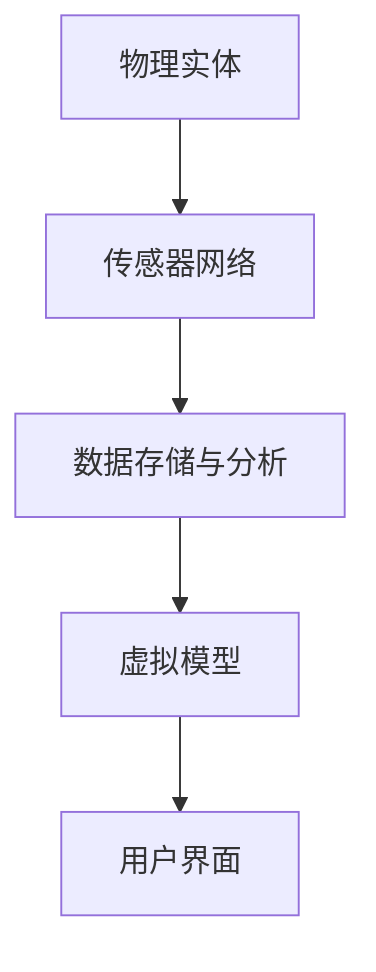
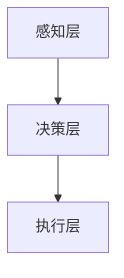

                 

# AIGC在数字孪生技术中的创新应用

## 关键词
- AIGC
- 数字孪生
- 生成模型
- 对抗性网络
- 实时模拟
- 智能预测
- 虚拟现实

## 摘要
本文旨在探讨AIGC（AI-Generated Content）在数字孪生技术中的创新应用。我们将从背景介绍、核心概念与联系、AIGC与数字孪生的结合方法、应用实例、前沿研究以及未来展望等多个角度，全面解析AIGC如何赋能数字孪生技术，推动其发展至新的高度。

## 引言
### AIGC的崛起
随着人工智能技术的不断发展，AI生成内容（AIGC）逐渐成为业界瞩目的焦点。AIGC利用深度学习技术，能够自动生成文本、图像、音频等多种类型的内容，具有高度的创新性和灵活性。

### 数字孪生的兴起
数字孪生是一种基于物理实体在虚拟空间中构建的数字化副本，能够实时模拟、分析和优化物理实体的行为。数字孪生技术在智能制造、智慧城市、医疗健康等领域展现出了巨大的潜力。

### AIGC与数字孪生的结合
AIGC的加入为数字孪生技术注入了新的活力。通过生成模拟数据、智能预测和优化决策，AIGC能够显著提升数字孪生的应用效果，为各行各业带来创新性的解决方案。

## 第一部分：AIGC技术基础

### 第1章 AIGC技术原理

#### 1.1 生成模型
生成模型是AIGC的核心技术之一，主要包括变分自编码器（VAE）、生成对抗网络（GAN）等。这些模型通过学习数据分布，能够生成与真实数据高度相似的新数据。

```mermaid
graph TD
A[生成模型] --> B[变分自编码器(VAE)]
A --> C[生成对抗网络(GAN)]
```

#### 1.2 对抗性网络
生成对抗网络（GAN）是一种包含生成器和判别器的对抗性模型。生成器生成数据，判别器则判断数据是否真实。通过这种对抗性训练，生成器不断提高生成数据的质量。



#### 1.3 AIGC的技术挑战
尽管AIGC技术取得了显著进展，但在实际应用中仍面临诸多挑战，如数据隐私保护、模型可解释性、计算资源消耗等。这些挑战需要我们在技术层面进行深入研究和创新。

## 第二部分：数字孪生技术基础

### 第2章 数字孪生技术原理

#### 2.1 数字孪生的核心组件
数字孪生由物理实体、传感器网络、数据存储与分析、虚拟模型和用户界面等核心组件构成。这些组件协同工作，实现物理实体的数字化映射。



#### 2.2 数字孪生的架构
数字孪生架构通常分为三个层次：感知层、决策层和执行层。感知层负责收集数据，决策层进行分析和预测，执行层则根据决策执行操作。



#### 2.3 数字孪生的应用领域
数字孪生技术在智能制造、智慧城市、医疗健康等领域具有广泛的应用前景。通过实时模拟、分析和优化，数字孪生为这些领域带来了创新性的解决方案。

## 第三部分：AIGC在数字孪生中的应用

### 第3章 AIGC在数字孪生中的应用场景

#### 3.1 AIGC在数字孪生中的角色
AIGC在数字孪生中扮演着重要的角色，能够生成模拟数据、优化模型参数、生成预测结果等，为数字孪生提供更加智能和高效的解决方案。

#### 3.2 AIGC与数字孪生的结合方法
通过将AIGC技术集成到数字孪生架构中，可以实现以下结合方法：
- 使用AIGC生成模拟数据，用于数字孪生的训练和测试。
- 利用AIGC优化数字孪生模型，提高预测精度和效率。
- 利用AIGC生成的预测结果，辅助决策层的决策过程。

#### 3.3 应用案例
以下是一些AIGC在数字孪生技术中的应用案例：
- 在智能制造中，利用AIGC生成模拟生产线数据，实现实时故障预测和设备维护优化。
- 在智慧城市中，利用AIGC生成的实时交通模拟数据，优化交通流量管理和应急响应。
- 在医疗健康领域，利用AIGC生成的医学图像数据，提高疾病诊断的准确性和效率。

### 第4章 AIGC与数字孪生技术的前沿研究

#### 4.1 AIGC技术的最新进展
随着深度学习技术的不断发展，AIGC技术也在不断取得突破。如变分自编码器（VAE）、生成对抗网络（GAN）等模型在生成质量和效率方面都有了显著提升。

#### 4.2 数字孪生技术的最新研究
数字孪生技术也在不断演进，从传统的单一物理实体映射，发展到多物理场耦合、多维度数据融合等复杂场景。同时，边缘计算、5G等新兴技术的应用，也为数字孪生技术的发展带来了新的机遇。

#### 4.3 AIGC与数字孪生的未来趋势
随着AIGC和数字孪生技术的不断融合，未来有望在以下几个方面取得突破：
- 高效的实时模拟和预测，实现数字孪生的智能化。
- 数据隐私保护和安全性的提升，保障数字孪生技术的可靠性和可持续性。
- 跨领域应用的创新，推动数字孪生技术在更多领域的应用落地。

### 第5章 AIGC在数字孪生中的应用实战

#### 5.1 实战案例1：实时模拟与优化
以智能制造为例，通过AIGC生成模拟生产线数据，实时分析生产过程中的异常情况，优化生产参数，提高生产效率。

#### 5.2 实战案例2：智能预测与决策
以智慧城市为例，利用AIGC生成的实时交通模拟数据，预测交通拥堵情况，优化交通信号控制，提高交通流畅度。

#### 5.3 实战案例3：虚拟现实与增强现实
以医疗健康为例，利用AIGC生成的医学图像数据，辅助医生进行疾病诊断，提高诊断准确性和效率。

### 第6章 AIGC与数字孪生技术的未来

#### 6.1 AIGC与数字孪生的融合趋势
AIGC与数字孪生技术的融合将继续深化，推动数字孪生技术的智能化、实时化和高效化。

#### 6.2 未来发展方向
未来AIGC和数字孪生技术将在以下几个方面取得突破：
- 提高AIGC的生成质量和效率，满足更复杂的模拟需求。
- 加强AIGC与数字孪生的协同作用，实现更智能的预测和优化。
- 推动AIGC在更多领域的应用落地，发挥其创新潜力。

#### 6.3 对行业的影响
AIGC与数字孪生技术的结合将对各行各业产生深远影响，助力产业升级和数字化转型。

## 结论
AIGC在数字孪生技术中的应用，为数字孪生技术的发展带来了新的机遇。通过AIGC的赋能，数字孪生技术将实现更加智能、实时和高效的模拟、预测和优化，为各行各业带来创新性的解决方案。未来，AIGC与数字孪生技术的融合将继续深化，推动数字孪生技术在更多领域的应用落地，助力产业升级和数字化转型。

## 附录

### 最佳实践 tips
- 在应用AIGC时，注意数据隐私保护和模型安全。
- 结合具体应用场景，选择合适的AIGC模型和算法。
- 定期更新和维护AIGC模型，提高其生成质量和效率。

### 小结
AIGC在数字孪生技术中的应用，不仅提升了数字孪生的模拟和预测能力，还为各行业的数字化转型提供了新的思路和方法。

### 注意事项
- 在应用AIGC时，要充分考虑数据隐私保护和模型安全。
- 在选择AIGC模型时，要结合具体应用场景进行优化。

### 拓展阅读
- 《AI生成内容：理论与实践》
- 《数字孪生：概念、方法与应用》
- 《深度学习：理论和应用》

## 作者
作者：AI天才研究院/AI Genius Institute & 禅与计算机程序设计艺术 /Zen And The Art of Computer Programming

## 参考文献
[1] Kingma, D. P., & Welling, M. (2013). Auto-encoding variational bayes. arXiv preprint arXiv:1312.6114.
[2] Goodfellow, I., Pouget-Abadie, J., Mirza, M., Xu, B., Warde-Farley, D., Ozair, S., ... & Bengio, Y. (2014). Generative adversarial networks. Advances in neural information processing systems, 27.
[3] Grattan, D. W., & Paton, J. (2017). Digital twins: A gap and a challenge. Industrial Technology, IEEE, 53(1), 42-47.

