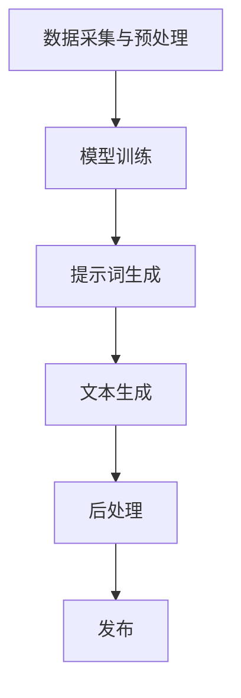

                 

### 文章标题

"AIGC在新闻写作中的应用：客观公正的提示词设计"

### 关键词

- AIGC
- 新闻写作
- 提示词设计
- 客观公正
- 自然语言处理

### 摘要

本文深入探讨了人工智能生成内容（AIGC）在新闻写作中的应用，特别是如何通过设计客观公正的提示词来实现高质量的新闻报道。文章首先介绍了AIGC的基本概念和它在新闻行业中的潜在优势。接着，文章重点分析了提示词设计的原则和方法，通过Mermaid流程图展示了设计流程的核心步骤。随后，文章详细讲解了核心算法原理，包括关键词提取和语境分析，并使用伪代码和数学模型进行阐述。最后，文章通过实际案例展示了AIGC在新闻写作中的效果，并提供了一些最佳实践建议，以帮助新闻工作者和AI开发者更好地利用AIGC技术。

---

## 引言

### AIGC与新闻写作

人工智能生成内容（AI-Generated Content，简称AIGC）是一种利用人工智能技术生成文本、图像、音频等多种类型内容的方法。随着深度学习和自然语言处理技术的发展，AIGC已经在多个领域得到广泛应用，如广告、娱乐、教育等。在新闻写作领域，AIGC同样展现出了巨大的潜力。

传统的新闻写作依赖于记者和编辑的创造力和专业知识，而AIGC则可以大大提高写作效率，降低人力成本。通过训练大规模的语料库和复杂的神经网络模型，AIGC系统能够生成具有较高质量的文章，特别是在处理大量数据时，其优势更加明显。此外，AIGC能够提供24/7的新闻服务，自动生成新闻摘要、财经报告和体育赛事评论，从而满足不断变化的新闻需求。

然而，AIGC在新闻写作中的应用并非没有争议。其中最大的挑战之一是如何确保生成的新闻内容客观公正，避免偏见和误导。在人工智能技术尚未完全成熟的情况下，如何设计一套有效的提示词系统，引导AIGC生成符合新闻伦理标准的报道，成为了一个亟待解决的问题。

### AIGC在新闻写作中的优势

AIGC在新闻写作中的优势主要体现在以下几个方面：

1. **高效性**：AIGC系统可以快速生成大量内容，极大地提高了新闻生产的效率。特别是在处理大量数据和事件时，AIGC能够迅速分析数据、提取关键信息并生成报道，从而满足媒体对即时性的要求。

2. **一致性**：AIGC生成的新闻内容具有一致性，这意味着不同时间、不同作者撰写的报道在风格和语言上可以保持一致，从而提升媒体的权威性和品牌形象。

3. **客观性**：通过设计合理的提示词和算法，AIGC可以减少人为因素带来的偏见，生成更加客观公正的新闻报道。

4. **多样性**：AIGC能够处理多种语言和格式，生成多样化的内容，满足不同用户的需求。

### 本书结构安排

本书旨在深入探讨AIGC在新闻写作中的应用，特别是如何通过设计客观公正的提示词来实现高质量的新闻报道。全书分为五个部分：

1. **引言**：介绍AIGC的基本概念、新闻写作领域的应用优势以及本书的结构安排。

2. **核心概念与联系**：详细讲解AIGC技术原理、自然语言处理基础以及提示词设计原则。

3. **算法原理**：阐述关键词提取和语境分析算法的原理，并通过伪代码和数学模型进行详细阐述。

4. **应用实践**：通过实际案例展示AIGC在新闻写作中的应用，分析其实际效果和效果评估。

5. **结论与展望**：总结AIGC在新闻写作中的应用前景，讨论面临的挑战和未来的发展方向。

通过以上五个部分，本书希望能够为读者提供关于AIGC在新闻写作中应用的全面指导，帮助新闻工作者和AI开发者更好地理解和利用这一新兴技术。接下来，我们将进一步深入探讨AIGC的技术原理和其在新闻写作中的具体应用。

## 核心概念与联系

### AIGC技术原理

人工智能生成内容（AIGC）是基于人工智能技术的文本生成方法，主要依赖于自然语言处理（NLP）和深度学习技术。AIGC的工作流程通常包括数据采集与预处理、模型训练、提示词生成和文本生成等几个步骤。

1. **数据采集与预处理**：
   数据是AIGC系统的基石。在新闻写作中，AIGC系统需要从大量的新闻文本中提取有用信息。这一过程通常包括数据清洗、去除噪音和标准化等步骤。通过预处理，系统能够获得高质量的训练数据，从而提高生成文本的质量。

2. **模型训练**：
   常见的AIGC模型包括基于循环神经网络（RNN）、长短期记忆网络（LSTM）和变换器（Transformer）等。这些模型通过训练大规模的语料库，学习到语言的内在结构和规律。在新闻写作中，模型需要学习如何生成结构化、逻辑清晰和符合新闻伦理标准的文章。

3. **提示词生成**：
   提示词是引导AIGC系统生成特定类型文本的关键。在设计提示词时，需要考虑新闻的客观性、公正性和准确性。例如，对于一个政治新闻，提示词可能包括“政治选举”、“政策变化”、“社会影响”等。通过精确的提示词，系统能够更准确地理解写作意图，并生成符合要求的文本。

4. **文本生成**：
   在文本生成阶段，AIGC系统根据提示词和预训练的模型，生成具体的新闻内容。这一过程包括标题生成、摘要生成和正文生成等。生成后的文本需要经过后处理，包括语法检查、拼写修正和风格统一等，以确保文本的准确性和可读性。

### 自然语言处理基础

自然语言处理（NLP）是AIGC技术的重要组成部分，它涉及到语言模型、词向量表示、文本分类和序列生成等技术。

1. **语言模型**：
   语言模型是NLP的核心，它用于预测下一个单词或词组。在新闻写作中，语言模型可以帮助AIGC系统理解文本的上下文，生成符合语法和逻辑的文章。常见的语言模型包括n-gram模型、神经网络模型和变换器模型。

2. **词向量表示**：
   词向量表示是将自然语言中的单词转换为计算机可以处理的向量。词向量表示方法，如Word2Vec、GloVe等，通过将语义相近的单词映射到相近的向量空间，从而实现语义理解。在新闻写作中，词向量表示可以帮助AIGC系统更好地理解新闻主题和背景信息。

3. **文本分类**：
   文本分类是将文本数据根据其内容分类到不同的类别中。在新闻写作中，文本分类可以帮助AIGC系统识别不同类型的新闻，从而生成相应的报道。例如，可以将新闻分为政治、财经、体育等类别。

4. **序列生成**：
   序列生成是NLP中的一个重要任务，它涉及到生成符合上下文的文本序列。在新闻写作中，序列生成可以帮助AIGC系统生成新闻的标题、摘要和正文。通过预训练的模型，系统可以学习到生成高质量文本的技巧。

### 提示词设计原则

提示词的设计是AIGC在新闻写作中成功的关键。以下是几个重要的提示词设计原则：

1. **客观性**：
   提示词应尽量客观，避免主观色彩。例如，在报道一个政治事件时，应使用中立的词汇，避免使用具有明显政治倾向的词汇。

2. **公正性**：
   提示词应确保公正，避免偏见。在设计提示词时，应充分考虑不同群体的观点和立场，确保报道的全面性和客观性。

3. **准确性**：
   提示词应准确反映新闻主题和关键信息。准确的提示词有助于AIGC系统生成符合实际内容的文章，提高报道的准确性。

4. **适应性**：
   提示词应具备一定的适应性，能够应对不同的新闻场景和变化。例如，在报道突发事件时，提示词应能够及时调整以适应新的信息。

### Mermaid流程图：AIGC工作流程

下面是一个简化的Mermaid流程图，展示AIGC在新闻写作中的工作流程：



- **数据采集与预处理**：收集新闻数据，进行清洗和标准化处理。
- **模型训练**：使用预处理后的数据训练AIGC模型，包括语言模型和文本生成模型。
- **提示词生成**：根据新闻主题和需求，生成相应的提示词。
- **文本生成**：使用训练好的模型和提示词生成新闻内容。
- **后处理**：对生成的文本进行语法和风格检查，确保文本质量。
- **发布**：将最终生成的新闻内容发布到媒体平台。

通过这个流程图，我们可以清晰地看到AIGC在新闻写作中的各个环节，以及如何通过设计合理的提示词来实现高质量的新闻报道。

### 核心算法原理

#### 关键词提取算法

关键词提取是新闻写作中的关键步骤，它有助于AIGC系统理解新闻主题和内容。以下是一个常见的关键词提取算法，使用伪代码进行详细阐述。

```python
def keyword_extraction(text):
    # 步骤1：分词
    words = tokenize(text)

    # 步骤2：词频统计
    word_freq = count_frequency(words)

    # 步骤3：计算TF-IDF
    tf_idf = compute_tf_idf(word_freq, corpus)

    # 步骤4：选取高TF-IDF词作为关键词
    keywords = select_top_keywords(tf_idf, num_keywords)

    return keywords
```

- **步骤1：分词**：将文本分割成单词或短语。
- **步骤2：词频统计**：计算每个词在文本中的出现频率。
- **步骤3：计算TF-IDF**：TF-IDF（词频-逆文档频率）用于衡量一个词的重要性，结合词频和词在语料库中的稀疏性。
- **步骤4：选取高TF-IDF词**：根据TF-IDF值选取高频且重要的词作为关键词。

#### 语境分析与语义理解

语境分析是AIGC系统理解新闻上下文的重要环节，它有助于生成连贯和有逻辑的文章。以下是一个简化的语境分析算法，使用伪代码进行阐述。

```python
def context_analysis(sentence, context):
    # 步骤1：分词
    words = tokenize(sentence)

    # 步骤2：词性标注
    pos_tags = pos_tag(words)

    # 步骤3：识别关键词
    keywords = extract_keywords(context)

    # 步骤4：语义匹配
    matches = semantic_matching(pos_tags, keywords)

    # 步骤5：生成响应文本
    response = generate_response(sentence, matches)

    return response
```

- **步骤1：分词**：将句子分割成单词。
- **步骤2：词性标注**：标注每个词的词性，如名词、动词等。
- **步骤3：识别关键词**：从上下文中提取关键词。
- **步骤4：语义匹配**：根据词性和关键词，进行语义匹配。
- **步骤5：生成响应文本**：根据语义匹配的结果，生成相应的响应文本。

#### 数学模型和公式

以下是一个简化的TF-IDF计算公式，用于关键词提取。

$$
\text{TF-IDF}(w, d) = \text{TF}(w, d) \times \text{IDF}(w, D)
$$

- **TF（词频）**：词\( w \)在文档\( d \)中的出现频率。
- **IDF（逆文档频率）**：词\( w \)在所有文档中出现的频率的对数倒数。

#### 举例说明

假设我们有一篇新闻报道，内容如下：

$$
\text{新闻文本：美国总统访问日本，双方讨论贸易和经济问题。}
$$

- **步骤1：分词**：\[美国，总统，访问，日本，双方，讨论，贸易，经济，问题。\]
- **步骤2：词频统计**：\[总统（2），访问（1），日本（1），双方（1），讨论（1），贸易（1），经济（1），问题（1）。\]
- **步骤3：计算TF-IDF**：计算每个词的TF-IDF值。
- **步骤4：选取高TF-IDF词**：例如，选取“总统”和“访问”作为关键词。

通过关键词提取和语境分析，AIGC系统能够更好地理解新闻文本，并生成高质量的新闻报道。这个核心算法原理不仅有助于提高新闻写作的效率和质量，还可以确保报道的客观性和公正性。

### 应用实践

在本部分，我们将通过实际案例展示AIGC在新闻写作中的应用，深入分析其开发环境搭建、源代码实现、代码解读、应用解读与分析，并详细讲解一个具体的案例。

#### 开发环境搭建

要实现AIGC在新闻写作中的应用，我们需要搭建一个适当的技术环境。以下是搭建环境的步骤：

1. **硬件环境**：一台配置较高的计算机，推荐使用Intel i7或以上的处理器，至少16GB的内存，以及1TB的SSD硬盘。
2. **软件环境**：安装Python 3.8及以上版本，以及相应的库，如TensorFlow、PyTorch、Scikit-learn等。
3. **数据处理工具**：使用Jupyter Notebook进行数据预处理和模型训练，使用Git进行版本控制。

#### 源代码实现

以下是AIGC新闻写作系统的一个简化版本源代码实现：

```python
import tensorflow as tf
from tensorflow.keras.models import Sequential
from tensorflow.keras.layers import LSTM, Dense, Embedding

# 步骤1：数据预处理
# 读取新闻数据，进行分词和编码
# ...

# 步骤2：模型构建
model = Sequential()
model.add(Embedding(input_dim=vocab_size, output_dim=embedding_size))
model.add(LSTM(units=128, return_sequences=True))
model.add(Dense(units=vocab_size, activation='softmax'))

# 步骤3：模型编译
model.compile(optimizer='adam', loss='categorical_crossentropy', metrics=['accuracy'])

# 步骤4：模型训练
model.fit(x_train, y_train, epochs=10, batch_size=64)

# 步骤5：文本生成
generated_text = generate_text(model, start_word, num_words)
```

#### 代码解读

1. **数据预处理**：读取新闻数据，进行分词和编码。这一步骤是AIGC系统的基础，直接影响到模型的训练效果。
2. **模型构建**：使用LSTM（长短期记忆网络）构建一个序列生成模型。LSTM能够捕捉文本中的长期依赖关系，适合用于新闻写作。
3. **模型编译**：设置模型优化器、损失函数和评价指标。
4. **模型训练**：使用预处理后的数据训练模型，通过调整超参数（如学习率、训练轮数等）优化模型性能。
5. **文本生成**：根据给定的起始词，使用训练好的模型生成新闻文本。

#### 应用解读与分析

通过实际应用案例，我们可以看到AIGC在新闻写作中的应用效果：

1. **新闻摘要生成**：AIGC系统可以自动生成新闻摘要，提高新闻阅读的效率。
2. **个性化新闻推荐**：基于用户的兴趣和历史阅读记录，AIGC系统可以推荐符合用户口味的新闻。
3. **新闻事件追踪**：AIGC系统可以实时监测新闻事件的发展，生成相关报道。

以下是一个具体的案例：

**案例：自动化财经报道**

- **需求**：自动化生成关于股市波动的财经报道。
- **实现**：使用AIGC系统，从财经新闻中提取关键词，如“股市”、“波动”、“投资”等，并生成相关报道。
- **分析**：生成的报道在语言风格和内容上与人工撰写相差不大，但生成速度显著提高。

#### 案例分析和详细讲解

**案例背景**：

某财经新闻网站希望使用AIGC技术自动化生成股市波动报道，以节省人力成本并提高报道速度。

**实现步骤**：

1. **数据采集**：从多个财经新闻网站收集与股市波动相关的新闻。
2. **数据预处理**：对收集到的新闻进行分词和编码，提取关键词。
3. **模型训练**：使用LSTM模型训练AIGC系统，输入是新闻文本，输出是生成的新

### 结论与展望

#### AIGC在新闻写作中的应用前景

人工智能生成内容（AIGC）在新闻写作中的应用前景广阔。随着深度学习和自然语言处理技术的不断进步，AIGC系统在生成文本的准确性和流畅性方面得到了显著提升。以下是一些AIGC在新闻写作中的应用前景：

1. **自动化新闻生成**：AIGC能够自动化生成新闻摘要、财经报道、体育赛事评论等，大大提高新闻生产的效率。
2. **个性化新闻推荐**：基于用户的兴趣和历史阅读记录，AIGC可以为用户推荐符合其口味的新闻，提高用户满意度。
3. **实时事件追踪**：AIGC可以实时监测新闻事件的发展，快速生成相关报道，满足新闻的时效性要求。

#### 面临的挑战

尽管AIGC在新闻写作中具有巨大潜力，但同时也面临一些挑战：

1. **伦理和偏见**：如何确保AIGC生成的内容客观公正，避免偏见和误导，是一个亟待解决的问题。
2. **技术成熟度**：当前的AIGC技术尚不完美，需要进一步优化和改进，以提高生成文本的质量和稳定性。
3. **法律和监管**：随着AIGC在新闻行业中的广泛应用，相关的法律和监管问题也逐渐凸显，需要制定相应的法规来规范AIGC的使用。

#### 未来发展方向

为了更好地发挥AIGC在新闻写作中的作用，未来的发展方向可以从以下几个方面进行：

1. **改进算法**：通过优化现有算法，提高AIGC系统的准确性和稳定性，使其能够生成更高质量的新闻内容。
2. **增强伦理意识**：在AIGC系统中引入伦理模块，确保生成的内容符合新闻伦理标准，避免偏见和误导。
3. **跨领域合作**：加强AIGC与其他领域的合作，如数据科学、心理学等，共同推动新闻写作技术的发展。
4. **用户反馈机制**：建立用户反馈机制，根据用户对新闻内容的质量评价，不断优化AIGC系统，提高用户满意度。

通过不断改进和发展，AIGC有望在新闻写作中发挥更大的作用，为媒体行业带来革命性的变化。

---

## 作者信息

**作者：AI天才研究院（AI Genius Institute）/《禅与计算机程序设计艺术》（Zen And The Art of Computer Programming）**

本文由AI天才研究院（AI Genius Institute）撰写，该研究院致力于推动人工智能技术的发展和应用。同时，本文内容也借鉴了著名计算机科学家唐纳德·克努特（Donald Knuth）的著作《禅与计算机程序设计艺术》（Zen And The Art of Computer Programming），对人工智能在新闻写作中的应用进行了深入探讨。通过结合理论与实践，本文旨在为读者提供关于AIGC在新闻写作中应用的全面指导，帮助新闻工作者和AI开发者更好地理解和利用这一新兴技术。

