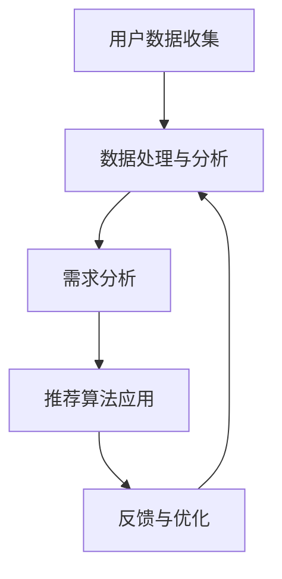

                 

### 1.1.1 AIGC的概念

AIGC（AI-Generated Content），即人工智能生成内容，指的是通过人工智能技术，特别是深度学习和自然语言处理（NLP）等技术，自动生成文字、图片、音频、视频等多种形式的内容。AIGC技术的核心在于其能够模仿人类创造性的思维过程，生成具有高度自然性和个性化特点的内容。

AIGC的发展可追溯到早期的生成模型，如1990年代的生成式对抗网络（GAN）和2000年代的变分自编码器（VAE）。这些模型为AIGC技术奠定了基础，但直到深度学习的发展，尤其是近年来GPT（Generative Pre-trained Transformer）系列模型的出现，AIGC技术才取得了突破性进展。

AIGC的核心组件包括：

1. **生成模型（Generator）**：负责生成内容，通常基于深度学习神经网络，如GAN中的生成器或VAE中的编码器。

2. **判别模型（Discriminator）**：用于判断生成内容的质量，也基于深度学习神经网络，如GAN中的判别器。

3. **预训练和微调**：AIGC模型通常通过预训练在大规模数据集上学习，然后通过微调适应特定任务。

4. **文本增强模块**：用于处理自然语言文本，包括语言模型、句子生成器等。

5. **数据预处理和后处理**：包括数据清洗、数据增强、内容过滤等步骤，确保生成的内容符合预期。

在AIGC的发展历程中，几个重要的里程碑事件包括：

- **GAN的提出**（2014年）：由Ian Goodfellow等人提出，标志着生成对抗网络的开端。

- **VAE的提出**（2013年）：由Kingma和Welling提出，为生成模型提供了新的视角。

- **GPT-1的发布**（2018年）：由OpenAI发布，是第一个基于Transformer架构的预训练语言模型。

- **GPT-2的发布**（2019年）：进一步提升了生成文本的质量和多样性。

- **GPT-3的发布**（2020年）：由OpenAI发布，是目前最先进的预训练语言模型，具有前所未有的文本生成能力。

这些里程碑事件不仅推动了AIGC技术的发展，也激发了各行各业对AIGC应用的热情。

### 1.1.2 AIGC的发展历程

AIGC技术的发展历程可以追溯到20世纪中期，随着计算机科学和人工智能领域的不断进步，生成内容的概念逐渐成型并得以实现。以下是AIGC发展历程中的重要里程碑：

**1950年代：自动写作的萌芽**

在1950年代，计算机科学家艾伦·图灵（Alan Turing）提出了著名的图灵测试，以判断机器是否具有人类水平的智能。在这个背景下，一些学者开始探讨如何利用计算机生成文本。1950年，阿兰·图灵在《计算机与智能》一文中提出了机器生成文字的想法，这标志着自动写作的萌芽。

**1980年代：早期生成模型的出现**

1980年代，生成模型开始成为研究热点。生成式对抗网络（GAN）的概念在1980年代初期被提出，但其发展较为缓慢。同时，自编码器（Autoencoder）作为一种早期的生成模型，也在这个时期得到了关注。

**1990年代：GAN的初步探索**

1990年代，GAN的概念得到了更深入的研究。1991年，Michael Jordan在论文《Learning in man-machine cooperative systems》中首次提出了一种生成模型，这为GAN的发展奠定了基础。1994年，Yann LeCun等人在图像处理领域提出了卷积自编码器（Convolutional Autoencoder），这为GAN的应用提供了新的思路。

**2000年代：生成模型的突破**

进入21世纪，生成模型的研究和应用得到了显著的进展。2006年，Geoffrey Hinton等人在《Learning a Nonlinear Embedding by Propagating Activations Through a Neural Network》一文中提出了深度信念网络（DBN），这是深度生成模型的早期形式。随后，生成对抗网络（GAN）的研究逐渐增多，2014年，Ian Goodfellow等人在《Generative Adversarial Nets》一文中正式提出了GAN的概念，并展示了其在图像生成方面的强大能力。

**2010年代：AIGC的快速发展**

2010年代，AIGC技术迎来了快速发展期。深度学习和Transformer架构的进步使得生成模型的能力得到了显著提升。2017年，谷歌提出了Transformer模型，并成功应用于机器翻译任务，这为AIGC的发展带来了新的契机。2018年，OpenAI发布了GPT-1，这是第一个基于Transformer架构的预训练语言模型，标志着AIGC在文本生成领域的突破。

**2020年代：AIGC的广泛应用**

进入2020年代，AIGC技术已经广泛应用于各个领域。OpenAI在2020年发布了GPT-3，这是目前最先进的预训练语言模型，具有强大的文本生成能力。同时，AIGC技术在图像、音频、视频等多个领域的应用也在不断拓展。

AIGC技术的发展历程不仅体现了计算机科学和人工智能领域的进步，也为各行各业带来了新的创新机会。未来，随着技术的不断成熟，AIGC有望在更多领域发挥重要作用。

### 1.1.3 AIGC的关键技术

AIGC（AI-Generated Content）技术的发展依赖于多种关键技术的创新和融合。以下是一些核心技术及其简要介绍：

#### 1.1.3.1 生成式对抗网络（GAN）

生成式对抗网络（GAN）是AIGC技术的基础之一，由Ian Goodfellow等人于2014年提出。GAN由两个主要组件构成：生成器（Generator）和判别器（Discriminator）。生成器的目标是生成类似于真实数据的假数据，而判别器的目标是区分生成数据和真实数据。通过这种对抗性训练，生成器逐渐提高生成数据的质量，判别器则逐渐提高对真实数据的辨别能力。

GAN的核心算法如下：

```
# GAN的核心算法
function GAN(D, G):
    for i = 1 to training_epochs:
        # 训练判别器
        z = sampled from noise distribution
        real_data = sampled from data distribution
        D参数更新，使得D可以更好地区分真实数据和生成数据

        # 训练生成器
        G参数更新，使得G生成的假数据更加逼真，从而欺骗判别器
        
    return G
```

#### 1.1.3.2 变分自编码器（VAE）

变分自编码器（VAE）是另一种重要的生成模型，由Kingma和Welling于2013年提出。VAE通过引入潜在变量（Latent Variables）来生成数据，其核心思想是将数据编码成一个潜在空间中的点，然后从这个潜在空间中采样并解码生成新的数据。

VAE的核心算法如下：

```
# VAE的核心算法
function VAE(θ):
    z = sample(z_∽~(N(0,I)))
    x = x_∽~(p_θ(x|z))
    return x, z
```

其中，θ表示模型的参数，N(0,I)表示标准正态分布，p_θ(x|z)表示给定潜在变量z，数据x的概率分布。

#### 1.1.3.3 Transformer模型

Transformer模型是近年来在机器翻译等自然语言处理任务中取得显著成功的架构，其由Vaswani等人于2017年提出。Transformer模型的核心是自注意力机制（Self-Attention），这种机制使得模型能够捕捉输入序列中的长距离依赖关系。

Transformer模型的基本结构如下：

```
# Transformer模型的基本结构
class Transformer(Model):
    # 输入嵌入层
    inputs = Input(shape=(sequence_length, embedding_size))
    
    # 自注意力机制
    x = Embedding(embedding_size)(inputs)
    x = MultiHeadAttention(num_heads, embedding_size)(x, x)
    
    # 全连接层
    x = Dense(units)(x)
    x = Activation('relu')(x)
    x = Dense(units)(x)
    
    # 输出层
    outputs = Dense(num_classes, activation='softmax')(x)
    
    model = Model(inputs, outputs)
```

#### 1.1.3.4 预训练与微调

预训练（Pre-training）和微调（Fine-tuning）是AIGC模型训练的重要环节。预训练阶段通常在大型、未标注的数据集上进行，目的是让模型学习到通用的特征表示。微调阶段则是在特定任务上进行，通过调整模型参数来适应具体任务的需求。

预训练和微调的关系可以表示为：

```
# 预训练与微调的关系
model = PretrainedModel()  # 使用预训练模型
model = FineTuneModel(model, task_specific_data)  # 微调模型
```

通过预训练和微调，AIGC模型能够在不同任务之间共享知识，从而提高模型的泛化能力和性能。

#### 1.1.3.5 文本增强模块

文本增强模块是AIGC在自然语言处理领域的重要组成部分，用于提高文本生成质量。常见的文本增强技术包括：

1. **语言模型**：通过学习大量文本数据，语言模型可以预测下一个词语，从而生成连贯的文本。
2. **句子生成器**：句子生成器可以基于语言模型生成完整的句子，从而提高文本生成的自然性和多样性。
3. **文本纠错**：文本纠错技术可以纠正输入文本中的错误，从而提高生成文本的准确性。

文本增强模块通常与生成模型结合使用，以生成高质量的自然语言文本。

总之，AIGC技术的发展依赖于多种关键技术的创新和协同作用。通过深入理解和掌握这些核心技术，我们可以更好地利用AIGC技术为各种应用场景提供高质量的内容生成解决方案。

### 1.2.1 旅游行业概述

旅游行业是现代经济的重要组成部分，其涵盖了从旅游资源的开发、旅游服务的提供到旅游产品的销售的各个环节。旅游行业的定义可以理解为通过提供旅游服务，满足人们休闲、娱乐、度假等需求的综合性服务业。

旅游行业的范围广泛，包括但不限于以下几个方面：

1. **旅游资源开发**：包括自然景观、历史文化遗址、休闲设施等旅游资源的规划、开发和保护。
2. **旅游服务提供**：如旅行社、酒店、餐饮、交通等直接为游客提供服务的行业。
3. **旅游产品销售**：包括旅游线路、旅游纪念品、旅游保险等旅游产品的销售渠道。
4. **旅游信息技术**：旅游电子商务、在线预订、智能导游等现代信息技术的应用。

旅游行业在全球范围内具有显著的经济影响。根据国际旅游组织（UNWTO）的数据，旅游业已成为全球增长最快的行业之一。2021年，全球国际游客人数达到约7亿人次，旅游收入达到1.6万亿美元。特别是在一些旅游大国，如法国、西班牙、美国和意大利，旅游业对国家经济的贡献率均超过10%。

旅游行业的市场需求也在不断增长。随着人们生活水平的提高和旅游观念的改变，旅游已经成为人们日常生活中不可或缺的一部分。同时，全球化和信息技术的发展也为旅游市场的拓展提供了新的机遇。越来越多的人选择出国旅游，体验不同的文化和生活方式。

然而，旅游行业也面临着一些问题和挑战。首先，环境污染和资源消耗问题日益严重。大规模的旅游开发活动可能会破坏自然景观和生态系统，影响当地居民的日常生活。其次，旅游旺季的接待能力不足和旅游淡季的市场疲软也是旅游行业面临的挑战。此外，旅游安全问题和突发事件也对旅游市场产生了影响。

总的来说，旅游行业具有广阔的市场前景和巨大的发展潜力，但也需要面对各种挑战和问题。通过技术创新和科学管理，可以有效提升旅游行业的竞争力，实现可持续发展。

### 1.2.2 旅游行业的问题与挑战

旅游行业在迅速发展的同时，也面临着一系列的问题与挑战，这些问题不仅影响了旅游行业的可持续发展，还对游客体验产生了负面影响。以下是旅游行业主要面临的几个问题：

**1. 环境污染和资源消耗**

旅游业的发展不可避免地带来环境污染和资源消耗问题。大规模的旅游开发活动可能导致自然景观的破坏、生态系统的破坏以及水资源和能源的过度消耗。例如，过度开发的海滩和度假区可能导致海岸线的侵蚀和海洋生态的破坏。此外，游客的大量涌入也会导致当地生态环境的负担加重，影响动植物的生存环境。

**2. 安全问题**

旅游安全问题是游客普遍关心的问题。突发事件如自然灾害、交通事故、疾病传播等都有可能对游客的安全构成威胁。此外，旅游服务提供方如旅行社、酒店等在安全管理和应急响应方面存在不足，可能导致游客在紧急情况下无法得到及时有效的救助。

**3. 旅游季节性波动**

旅游行业具有明显的季节性特征，旅游需求在一年中会出现显著的波动。旅游旺季时，游客数量激增，可能导致旅游资源的过度利用和接待能力的不足，从而影响游客体验。而在旅游淡季，游客数量大幅减少，旅游企业的经营压力增大，甚至可能导致部分旅游企业倒闭。

**4. 旅游服务质量问题**

旅游服务质量问题一直是游客投诉的主要方面。一些旅游企业存在服务质量不高、服务态度差、虚假宣传等问题，导致游客对旅游服务的满意度降低。此外，旅游行业的信息不对称现象也较为普遍，游客在预订和消费过程中难以获得全面、准确的信息。

**5. 文化冲突与误解**

旅游业的发展过程中，游客与当地居民之间的文化冲突和误解时有发生。游客的行为可能违反当地的文化习俗，导致当地居民的抵触情绪。同时，一些游客对当地文化的误解和歧视也可能引发社会矛盾。

**6. 数字化挑战**

随着互联网和信息技术的普及，旅游行业正在经历数字化转型。然而，数字化进程中面临诸多挑战，如数据安全问题、技术人才短缺、传统旅游企业与新兴互联网企业的竞争等。此外，如何在数字化转型中保护游客隐私和保障数据安全也是一个重要问题。

综上所述，旅游行业在面临巨大发展机遇的同时，也面临着诸多问题和挑战。只有通过技术创新、科学管理和政策支持，才能实现旅游行业的可持续发展，提升游客的满意度和体验。

### 1.2.3 AIGC在旅游行业的应用前景

随着人工智能技术的飞速发展，AIGC（AI-Generated Content）在多个领域取得了显著的应用成果，旅游行业也不例外。AIGC技术通过生成个性化内容、提高服务质量和优化资源配置，为旅游行业带来了新的机遇和发展潜力。

**1. 个性化旅游服务**

AIGC技术能够根据游客的偏好、兴趣和行为数据，生成个性化的旅游服务推荐。例如，基于用户的旅行历史和偏好，AIGC可以生成定制化的旅行路线、景点推荐和活动安排。这不仅提高了游客的旅游体验，还能帮助旅游企业更好地满足不同游客的需求，提升客户满意度。

**2. 旅游信息智能化**

AIGC技术可以自动生成大量的旅游信息内容，如旅游指南、景点介绍、历史文化背景等。这些信息可以通过智能语音助手、在线平台和移动应用等多种方式提供给游客，帮助游客更便捷地获取所需的信息。此外，AIGC还可以实时更新和优化旅游信息，确保游客获取到最新、最准确的旅游资讯。

**3. 旅游营销与宣传**

AIGC技术可以为旅游企业生成高质量的营销内容，如旅游广告、宣传视频、社交媒体帖子等。通过分析游客的兴趣和行为数据，AIGC可以生成个性化的营销策略，提高营销效果的精准度和转化率。此外，AIGC还可以根据旅游热点和季节变化，自动生成相应的营销内容，帮助旅游企业及时抓住市场机会。

**4. 旅游资源优化配置**

AIGC技术可以通过大数据分析和生成模型，帮助旅游企业优化旅游资源的配置。例如，AIGC可以根据游客流量和景区容量，自动调整景区的开放时间和门票价格，避免过度拥挤和资源浪费。此外，AIGC还可以预测旅游高峰期和低谷期，帮助旅游企业合理规划人力资源和设备，提高运营效率。

**5. 旅游服务智能化**

AIGC技术可以应用于旅游服务的各个环节，如酒店预订、交通安排、导游服务等。通过智能语音助手和自动化系统，AIGC可以帮助游客实现自助服务，提高服务效率。同时，AIGC还可以实时监控和反馈游客的服务体验，帮助旅游企业不断改进服务质量。

**6. 旅游风险评估与预警**

AIGC技术可以通过大数据分析和生成模型，对旅游行业中的潜在风险进行预测和预警。例如，AIGC可以分析旅游事故、自然灾害等数据，提前预测旅游风险，并为旅游企业提供相应的应对策略和建议，保障游客的安全。

综上所述，AIGC技术在旅游行业的应用前景广阔，不仅能够提升游客的旅游体验，还能帮助旅游企业提高服务质量和运营效率，实现可持续发展。随着技术的不断进步和应用场景的拓展，AIGC将在旅游行业中发挥越来越重要的作用。

### 1.3 个性化旅行建议的必要性

个性化旅行建议在当前的旅游行业中具有显著的重要性，其核心在于满足不同游客的多样化需求，提升旅游体验。以下是几个方面来探讨个性化旅行建议的必要性：

**1. 多样化需求的满足**

随着旅游业的不断发展，游客的旅行需求日益多样化。不同游客可能有不同的旅行目的、兴趣爱好和预算。例如，一些游客可能对历史和文化感兴趣，希望参观博物馆和古迹；而另一些游客可能更喜欢自然风光和户外活动。通过个性化旅行建议，旅游企业能够为游客提供定制化的行程安排，满足其个性化需求。

**2. 提升游客满意度**

个性化旅行建议能够提升游客的满意度，从而提高旅游企业的竞争力。当游客发现旅行建议完全符合自己的兴趣和需求时，他们更有可能对旅游体验感到满意。这不仅有助于提升游客的忠诚度，还能通过口碑传播吸引更多新客户。

**3. 优化资源利用**

个性化旅行建议可以帮助旅游企业优化旅游资源的利用，避免资源的浪费。通过分析游客的行为数据和历史记录，个性化建议可以预测游客可能感兴趣的景点和活动，从而合理安排旅游线路，避免高峰期景区过度拥挤。此外，个性化建议还可以帮助旅游企业优化人力资源配置，提高服务效率。

**4. 提高营销效果**

个性化旅行建议是旅游营销的重要手段之一。通过分析游客的兴趣和行为，旅游企业可以生成个性化的营销内容，如定制化的旅游线路、景点推荐和活动安排。这些内容不仅能够提高营销的精准度，还能提高转化率，从而提升旅游企业的营收。

**5. 增强数据驱动决策**

个性化旅行建议依赖于大数据分析和机器学习技术，能够为旅游企业提供数据驱动的决策支持。通过分析游客的旅行数据和偏好，旅游企业可以不断优化旅行建议算法，提高个性化建议的准确性。此外，这些数据还可以用于分析旅游市场的趋势和变化，帮助旅游企业制定更加科学的战略决策。

**6. 改善用户体验**

个性化旅行建议能够为游客提供更加便捷和高效的旅游体验。通过智能推荐系统，游客可以轻松获取到符合自己需求的旅行信息，无需花费大量时间进行搜索和筛选。此外，个性化建议还可以为游客提供实时的旅行建议和提醒，帮助他们更好地规划和管理旅行行程。

总之，个性化旅行建议在提升游客满意度、优化资源利用、提高营销效果、增强数据驱动决策和改善用户体验等方面具有重要意义。随着AIGC技术的不断发展，个性化旅行建议将成为旅游行业不可或缺的一部分，助力旅游行业的可持续发展。

### 1.3.1 个性化旅行建议的定义

个性化旅行建议是指基于游客的个性化需求、兴趣和行为数据，通过人工智能和大数据分析技术，为游客提供定制化的旅行路线、景点推荐、活动安排和旅游信息等服务的智能建议。这种建议旨在满足不同游客的多样化需求，提升旅游体验。

个性化旅行建议的核心要素包括以下几个方面：

1. **用户画像**：通过对游客的兴趣、偏好、行为数据等进行综合分析，构建游客的个人画像，这是生成个性化旅行建议的基础。

2. **需求分析**：根据用户画像，分析游客的旅行需求，如旅游目的、出行时间、预算等，以便为游客提供符合其需求的旅行建议。

3. **推荐算法**：采用推荐算法（如协同过滤、基于内容的推荐等）和机器学习技术，基于用户画像和需求分析，生成个性化的旅行建议。

4. **实时反馈**：通过实时监测游客的行为和反馈，不断调整和优化旅行建议，确保建议的准确性和实用性。

5. **多渠道推送**：将个性化旅行建议通过多种渠道（如移动应用、网站、智能语音助手等）推送给游客，方便游客获取和使用。

### 1.3.2 个性化旅行建议的重要性

个性化旅行建议在现代旅游行业中具有至关重要的意义，主要体现在以下几个方面：

**1. 提升游客体验**

个性化旅行建议能够根据游客的个人需求和兴趣，提供量身定制的旅行建议，从而提升游客的旅游体验。当游客发现自己所获得的建议完全符合他们的期望时，他们更有可能对整个旅游过程感到满意，从而增强对旅游品牌的忠诚度。

**2. 优化资源分配**

通过个性化旅行建议，旅游企业可以更好地了解游客的需求，从而优化旅游资源的分配。例如，可以根据游客的旅行时间和兴趣点，合理调整景区的开放时间和门票价格，避免高峰期景区过度拥挤，提高旅游资源的利用效率。

**3. 提高营销效果**

个性化旅行建议可以帮助旅游企业提高营销效果。通过分析游客的旅行数据和行为，企业可以生成针对性的营销内容，如定制化的旅游线路、景点推荐和活动安排，从而提高营销的精准度和转化率。

**4. 降低运营成本**

个性化旅行建议可以通过自动化和智能化手段，减少人工干预，从而降低运营成本。例如，通过智能语音助手和在线平台，游客可以自助完成旅行路线的规划和预订，减少客服人员的工作量。

**5. 增强数据驱动决策**

个性化旅行建议依赖于大数据分析和机器学习技术，能够为旅游企业提供数据驱动的决策支持。通过分析游客的行为数据和市场趋势，企业可以更好地预测市场需求，制定科学的战略决策。

**6. 提升竞争力**

在竞争激烈的旅游市场中，个性化旅行建议可以帮助旅游企业脱颖而出。通过提供高质量的个性化服务，企业可以吸引更多的游客，提升市场份额，增强市场竞争力。

总之，个性化旅行建议在提升游客体验、优化资源分配、提高营销效果、降低运营成本、增强数据驱动决策和提升竞争力等方面具有重要意义。随着AIGC技术的不断发展，个性化旅行建议将在旅游行业中发挥更加重要的作用，推动旅游行业的持续创新和发展。

### 1.3.3 个性化旅行建议的需求分析

个性化旅行建议在当前旅游市场中具有极高的需求，其核心在于满足游客多样化的旅行需求和提升旅游体验。以下是几个关键方面的需求分析：

**1. 旅游目的多样性**

游客的旅行目的多种多样，包括休闲度假、文化体验、冒险探险、家庭游、商务旅行等。个性化旅行建议可以根据游客的旅行目的，提供定制化的行程安排和景点推荐，满足不同游客的特定需求。例如，对于喜欢冒险的游客，可以推荐户外探险、极限运动等项目；而对于文化爱好者，则可以安排参观博物馆、历史遗迹等活动。

**2. 个人兴趣与偏好**

游客的个人兴趣和偏好也是影响旅行需求的重要因素。个性化旅行建议可以通过分析游客的历史旅行记录和行为数据，了解其兴趣点，如美食、摄影、购物、娱乐等，从而提供个性化的旅行建议。例如，对于喜欢美食的游客，可以推荐当地特色餐厅和美食体验；对于摄影爱好者，可以推荐风景优美的拍摄地点。

**3. 预算和出行时间**

游客的预算和出行时间是影响旅行决策的关键因素。个性化旅行建议可以根据游客的预算范围和出行时间，提供合理的旅行方案。例如，对于预算有限的游客，可以推荐性价比高的住宿和交通方式；对于短期出行的游客，可以提供紧凑的行程安排，确保在有限的时间内游览更多的景点。

**4. 智能化推荐**

随着人工智能技术的发展，游客对智能化推荐的需求日益增加。个性化旅行建议可以通过智能算法，分析游客的行为数据和历史记录，实时生成个性化的旅行建议。这种智能化的推荐不仅能够提高推荐的准确性和有效性，还能为游客提供更加便捷的旅游服务。

**5. 实时信息更新**

旅游市场的动态变化和突发事件的频繁发生，使得游客对实时信息的更新需求变得尤为重要。个性化旅行建议可以通过实时数据采集和分析，为游客提供最新的旅游信息，如景点开放时间、门票价格、交通状况等。这种实时信息更新有助于游客更好地规划旅行行程，避免不必要的时间和资源浪费。

**6. 个性化互动体验**

个性化旅行建议不仅仅是提供一系列推荐，更是与游客进行互动的过程。通过智能语音助手、在线聊天平台等互动工具，游客可以与旅行建议系统进行实时沟通，提出自己的需求和建议，从而获得更加个性化的服务。这种互动体验不仅能够提升游客的满意度，还能增强游客对旅游品牌的忠诚度。

总之，个性化旅行建议的需求分析涵盖了旅游目的、个人兴趣、预算和出行时间、智能化推荐、实时信息更新和个性化互动体验等多个方面。通过深入理解这些需求，旅游企业可以更好地利用AIGC技术，为游客提供高质量的个性化服务，提升整体旅游体验。

### 1.3.4 个性化旅行建议的生成流程

个性化旅行建议的生成是一个复杂的过程，涉及到用户数据收集、需求分析、推荐算法应用和反馈优化等多个环节。以下是详细阐述个性化旅行建议的生成流程：

#### 1. 用户数据收集

个性化旅行建议的生成始于用户数据的收集。这些数据包括用户的个人信息、旅行历史、行为记录、偏好设置等。具体来说，用户数据可以从以下渠道获取：

1. **用户注册与登录数据**：包括用户的姓名、性别、年龄、居住地等基本信息。
2. **旅行历史数据**：包括用户以往的旅行记录、访问的景点、消费记录等。
3. **行为数据**：用户在旅游平台上的浏览、搜索、点击、评价等行为数据。
4. **偏好设置**：用户对旅行目的、出行时间、预算、兴趣点的偏好设置。
5. **外部数据**：如社交媒体活动、地理位置信息、天气信息等。

这些数据可以通过旅游平台、移动应用、网站等形式进行收集，为后续的分析和推荐提供基础。

#### 2. 数据处理与分析

收集到的用户数据需要进行清洗、处理和分析，以提取有用的信息。数据处理和分析主要包括以下步骤：

1. **数据清洗**：去除重复数据、无效数据和噪声数据，确保数据的准确性和完整性。
2. **数据整合**：将来自不同渠道的数据进行整合，构建用户画像。
3. **特征提取**：根据用户的需求和偏好，提取关键特征，如旅行频率、消费水平、兴趣点等。
4. **行为分析**：分析用户的旅行行为模式，如出行时间、季节偏好、热门景点等。

通过数据处理与分析，可以构建出详细的用户画像，为个性化推荐提供基础。

#### 3. 需求分析

在数据处理和分析的基础上，进一步进行需求分析，明确用户的个性化需求。需求分析主要包括以下几个步骤：

1. **需求识别**：通过分析用户的历史数据和偏好设置，识别用户的主要需求，如旅游目的、兴趣点、预算等。
2. **需求预测**：基于用户画像和行为数据，预测用户的潜在需求，如可能访问的景点、可能参加的活动等。
3. **需求细分**：将用户按照需求进行细分，如休闲度假用户、文化体验用户、冒险探险用户等，为不同类型的用户生成个性化的旅行建议。

#### 4. 推荐算法应用

需求分析完成后，采用推荐算法生成个性化的旅行建议。常用的推荐算法包括：

1. **协同过滤算法**：基于用户的相似度计算和评分预测，为用户推荐类似的旅行目的地或活动。
2. **基于内容的推荐**：根据用户的兴趣点和历史行为，推荐相关的景点和活动。
3. **混合推荐算法**：结合协同过滤和基于内容的推荐，提高推荐的准确性和多样性。

在推荐算法应用过程中，需要考虑以下因素：

1. **推荐质量**：确保推荐的内容符合用户的实际需求，具有较高的相关性和实用性。
2. **推荐多样性**：为用户推荐不同类型和风格的景点和活动，增加旅游体验的多样性。
3. **实时性**：及时更新推荐内容，反映最新的旅游信息和用户需求变化。

#### 5. 反馈与优化

个性化旅行建议的生成是一个动态调整的过程。通过用户的反馈和行为数据，不断优化推荐系统。反馈与优化主要包括以下步骤：

1. **用户反馈**：收集用户对旅行建议的反馈，如满意度、使用情况等。
2. **行为跟踪**：监测用户的实际旅行行为，如访问的景点、参与的活动等。
3. **模型调整**：根据用户反馈和行为数据，调整推荐算法和系统参数，提高推荐的准确性和用户满意度。
4. **系统更新**：定期更新推荐系统，引入新的算法和技术，保持系统的先进性和竞争力。

通过以上流程，个性化旅行建议系统可以不断优化，为用户提供高质量的个性化服务。

#### 1.3.5 个性化旅行建议的生成流程图

为了更直观地理解个性化旅行建议的生成流程，可以使用Mermaid流程图来描述。以下是生成流程的Mermaid图表示：



- **A. 用户数据收集**：收集用户基本信息、旅行历史和行为数据。
- **B. 数据处理与分析**：清洗数据、整合信息、提取特征。
- **C. 需求分析**：识别用户需求、预测潜在需求、进行需求细分。
- **D. 推荐算法应用**：使用协同过滤、基于内容等算法生成推荐。
- **E. 反馈与优化**：收集用户反馈、跟踪行为、调整模型、更新系统。

通过这个流程，个性化旅行建议系统可以不断优化，为用户提供高质量的个性化服务。

### 1.3.6 个性化旅行建议模型的概念与架构

个性化旅行建议模型是AIGC技术在旅游规划中的核心应用之一，它通过综合分析用户需求、兴趣和行为数据，生成符合个人偏好的旅行建议。为了实现这一目标，个性化旅行建议模型通常包括以下几个关键组成部分：

**1. 用户画像**

用户画像是对用户的基本信息、兴趣、行为和历史数据等进行综合分析，构建出一个多维度的用户模型。用户画像包括以下几个方面：

- **基本信息**：用户的年龄、性别、职业、收入等。
- **兴趣与偏好**：用户的旅行目的、旅游类型（如文化、自然、冒险等）、最喜欢的景点类型（如古迹、自然景观、购物等）。
- **行为数据**：用户的旅行历史、在旅游平台上的搜索和浏览记录、评价和反馈等。
- **社交数据**：用户的社交网络活动、兴趣爱好等。

通过构建详细的用户画像，个性化旅行建议模型可以更好地理解用户的个性化需求，从而提供更加精准的旅行建议。

**2. 需求分析**

需求分析是个性化旅行建议模型的核心环节，其目标是识别用户的旅行需求，预测用户的潜在需求，并进行需求细分。具体步骤包括：

- **需求识别**：根据用户的历史数据和偏好设置，分析用户的当前需求，如旅游目的、出行时间、预算等。
- **需求预测**：基于用户画像和行为数据，预测用户可能的未来需求，如潜在的旅游目的地、感兴趣的活动等。
- **需求细分**：将用户按照不同的需求进行分类，如休闲度假用户、文化体验用户、冒险探险用户等。

通过需求分析，个性化旅行建议模型可以更加精准地匹配用户需求，提高建议的准确性和相关性。

**3. 生成模型**

生成模型是个性化旅行建议模型的重要组成部分，用于生成具体的旅行建议，如行程安排、景点推荐等。常见的生成模型包括：

- **序列生成模型**：如递归神经网络（RNN）、长短期记忆网络（LSTM）等，用于生成连续的旅行行程。
- **变分自编码器（VAE）**：通过潜在空间生成个性化的旅行方案。
- **生成式对抗网络（GAN）**：通过对抗性训练生成多样化的旅行建议。

生成模型可以根据用户需求和场景特点进行选择，以提高生成建议的质量和多样性。

**4. 推荐算法**

推荐算法用于从大量可能的旅行建议中筛选出最符合用户需求的推荐。常用的推荐算法包括：

- **协同过滤算法**：通过分析用户之间的相似度，推荐与目标用户相似的其他用户的推荐。
- **基于内容的推荐**：通过分析旅游资源的特征，为用户推荐具有相似特征的资源。
- **混合推荐算法**：结合协同过滤和基于内容的推荐，提高推荐的准确性和多样性。

推荐算法可以根据用户画像和需求分析的结果进行动态调整，以优化推荐效果。

**5. 模型评估与优化**

模型评估与优化是确保个性化旅行建议模型持续有效的重要环节。评估指标包括推荐准确率、覆盖度、新颖度等。优化方法包括：

- **在线学习**：通过实时反馈和用户行为数据，不断调整和优化模型参数。
- **迁移学习**：利用已训练好的模型，在新场景和新用户群体中进行微调。
- **多模型融合**：结合多种模型和算法，提高模型的综合性能。

通过模型评估与优化，个性化旅行建议模型可以不断提高推荐质量，满足用户的多样化需求。

总的来说，个性化旅行建议模型通过用户画像、需求分析、生成模型、推荐算法和模型评估与优化等组成部分，实现个性化旅行建议的生成。这种模型不仅能够提高用户的旅游体验，还能为旅游企业提供有效的营销工具，推动旅游行业的智能化发展。

### 1.3.7 个性化旅行建议的应用场景与实际案例

个性化旅行建议模型在实际应用中展现了广泛的应用场景和显著的实际效果。以下是几个具体的应用场景和实际案例，展示了个性化旅行建议如何提高旅游体验和运营效率。

**1. 旅游线路规划**

在旅游线路规划方面，个性化旅行建议能够根据游客的兴趣、时间和预算，生成最优的行程安排。例如，某旅游平台利用个性化旅行建议模型，为用户提供了多样化的旅游线路选择。用户只需输入目的地、出行时间、预算等信息，系统即可自动生成多条符合用户需求的旅游线路，并提供详细的景点介绍、交通指南和住宿建议。这种个性化的线路规划不仅提高了游客的出行效率，还丰富了游客的旅游体验。

**实际案例**：某用户计划前往日本旅游，预算为5000元，时间为一周。个性化旅行建议模型为该用户提供了三条线路选择，分别是文化之旅、自然风光之旅和购物之旅。每条线路都包含了详细的行程安排、景点推荐和交通信息，用户可以根据自己的喜好选择最合适的线路。

**2. 景点推荐**

个性化旅行建议模型在景点推荐方面也具有显著的应用价值。通过分析游客的历史行为和偏好，系统可以推荐符合用户兴趣的景点。例如，某旅游平台使用个性化推荐算法，为游客提供了个性化的景点推荐服务。用户只需登录平台，系统就会根据其兴趣和浏览历史，推荐最适合的景点和活动。这种个性化的推荐不仅提高了用户的满意度，还帮助景区提高了游客量。

**实际案例**：某用户在旅游平台上浏览了多个自然景观景点，个性化推荐系统分析后，为该用户推荐了多个符合其兴趣的自然公园和自然保护区。用户根据推荐信息，安排了一次完美的自然风光之旅，体验了多种户外活动，如徒步、骑行和观鸟等。

**3. 旅游产品营销**

个性化旅行建议模型在旅游产品营销中也发挥了重要作用。通过分析用户的旅行需求和购买行为，系统可以生成精准的营销内容，提高营销转化率。例如，某旅行社利用个性化旅行建议模型，为用户定制了个性化的旅游产品推荐，包括定制化的旅游线路、套餐和特别优惠。用户在浏览网页时，系统会根据其偏好和浏览记录，展示最符合用户需求的旅游产品，从而提高了用户的购买意愿。

**实际案例**：某旅行社通过个性化旅行建议模型，为用户推荐了一条热门的邮轮旅游线路。用户在浏览网页时，系统根据其历史行为和偏好，向其展示了这条邮轮线路的详细介绍、套餐价格和用户评价。用户最终在平台上完成了邮轮预订，体验了一次难忘的海洋之旅。

**4. 旅游资源优化配置**

个性化旅行建议模型还可以应用于旅游资源的优化配置，帮助旅游企业提高运营效率。通过分析游客流量和景区容量，系统可以动态调整景区的开放时间和门票价格，避免高峰期的过度拥挤和资源浪费。同时，个性化旅行建议还可以预测旅游高峰期和低谷期，帮助旅游企业合理安排人力资源和设备，提高整体运营效率。

**实际案例**：某知名旅游风景区通过个性化旅行建议模型，优化了景区的门票销售和游客管理。在旅游高峰期，系统根据游客流量和预订情况，动态调整门票价格和开放时间，避免了人流拥堵，提高了游客的满意度。在旅游淡季，系统则通过推荐优惠活动和特价套餐，吸引了更多游客，提高了景区的运营收入。

综上所述，个性化旅行建议模型在旅游线路规划、景点推荐、旅游产品营销和旅游资源优化配置等多个应用场景中，展现了广泛的应用价值和实际效果。通过这些应用场景和实际案例，我们可以看到个性化旅行建议如何提升旅游体验、优化资源配置和提升运营效率，为旅游行业的发展注入新的动力。

### 1.3.8 提示词生成技术概述

在个性化旅行建议的生成过程中，提示词（Prompt）起到了至关重要的作用。提示词是指用于引导生成模型生成特定内容的关键词或短语，其设计质量直接影响到生成内容的准确性、多样性和相关性。以下是关于提示词生成技术的基本概念、生成方法及其在个性化旅行建议中的应用。

#### 1.3.8.1 提示词生成技术的基本概念

提示词生成技术是一种利用自然语言处理（NLP）和机器学习算法，从大量文本数据中提取和生成关键词或短语的方法。提示词通常具有以下特点：

1. **关键词性**：提示词需要具有代表性和概括性，能够简洁地表达用户的需求或意图。
2. **多样性**：提示词需要涵盖广泛的领域和话题，以生成多样化的内容。
3. **准确性**：提示词应能够准确传达用户的意图，避免歧义和不相关的内容。
4. **可扩展性**：提示词应易于扩展和更新，以适应新的应用场景和需求变化。

#### 1.3.8.2 提示词生成的方法

提示词生成技术主要分为以下几种方法：

1. **基于规则的方法**：通过预定义的规则和模式，从文本数据中提取关键词。例如，利用词频统计、词性标注等方法，提取高频词和特定词性词作为提示词。
2. **基于统计的方法**：利用统计学习方法，如条件概率模型、隐马尔可夫模型（HMM）等，从大量文本数据中学习关键词的生成规则。这种方法能够自动识别和提取具有代表性的关键词。
3. **基于机器学习的方法**：利用监督学习、无监督学习和强化学习等技术，从文本数据中学习生成提示词的模型。常见的机器学习算法包括朴素贝叶斯分类器、支持向量机（SVM）、深度神经网络（DNN）等。
4. **基于语义的方法**：利用语义分析技术，如词嵌入、词向量、语义角色标注等，从文本中提取具有特定语义信息的提示词。这种方法能够更准确地捕捉文本中的语义关系和用户意图。

#### 1.3.8.3 提示词生成技术在个性化旅行建议中的应用

在个性化旅行建议的生成过程中，提示词技术被广泛应用于以下几个方面：

1. **用户需求识别**：通过提示词生成技术，从用户的查询语句、评论、反馈等文本数据中提取关键需求信息，如旅游目的、出行时间、预算等。这些关键需求信息用于生成个性化的旅行建议。
2. **景点推荐**：利用提示词技术，从大量的景点描述、评价文本中提取关键特征词，如自然景观、历史文化、购物等，为用户提供与兴趣相关的景点推荐。
3. **行程规划**：根据用户的旅行需求和偏好，生成包含关键景点的行程规划提示词，如“适合周末休闲的旅游景点推荐”、“预算1000元以内的旅游线路规划”等，用于引导生成模型生成具体的行程方案。
4. **旅游活动推荐**：从用户的旅行历史、兴趣点等数据中提取关键词，生成与旅游活动相关的提示词，如“适合户外运动的活动推荐”、“适合美食爱好者的餐厅推荐”等，帮助用户发现和参与感兴趣的活动。
5. **动态更新**：根据用户的实时行为和反馈，动态生成和更新提示词，以适应用户需求的变化，提高个性化旅行建议的实时性和准确性。

总之，提示词生成技术在个性化旅行建议的生成过程中扮演了关键角色。通过精确、多样和准确的提示词生成，系统能够更好地理解和满足用户需求，提供高质量的个性化服务。

### 1.3.9 提示词生成算法详解

在个性化旅行建议的生成过程中，提示词生成算法扮演着至关重要的角色。以下将详细介绍几种常见的提示词生成算法，包括其基本原理、实现步骤以及优缺点。

#### 1.3.9.1 基于规则的方法

**基本原理**：基于规则的方法通过预定义的规则和模式，从文本数据中提取关键词。这些规则通常包括词频统计、词性标注、停用词过滤等。

**实现步骤**：
1. **文本预处理**：对输入文本进行清洗和分词，去除噪声和停用词。
2. **词频统计**：统计每个单词在文本中的出现频率，选择出现频率较高的词作为候选关键词。
3. **词性标注**：对文本中的每个单词进行词性标注，选择特定词性（如名词、动词等）作为关键词。
4. **规则匹配**：根据预定义的规则，对文本中的词进行筛选，提取关键词。

**优缺点**：
- **优点**：方法简单，易于实现和调整。
- **缺点**：提取的关键词可能不够准确和全面，难以应对复杂和多变的用户需求。

#### 1.3.9.2 基于统计的方法

**基本原理**：基于统计的方法利用统计模型，从文本数据中学习关键词的生成规则。常见的统计模型包括条件概率模型和隐马尔可夫模型（HMM）。

**实现步骤**：
1. **文本预处理**：对输入文本进行清洗和分词。
2. **构建统计模型**：通过训练数据，构建条件概率模型或HMM，学习文本生成规则。
3. **关键词提取**：根据训练好的模型，从文本中提取关键词。

**优缺点**：
- **优点**：能够自动学习关键词生成规则，适应复杂多样的文本数据。
- **缺点**：模型复杂度较高，训练时间较长；模型对噪声和异常数据敏感。

#### 1.3.9.3 基于机器学习的方法

**基本原理**：基于机器学习的方法利用监督学习、无监督学习和强化学习等技术，从文本数据中学习生成提示词的模型。常见的机器学习算法包括朴素贝叶斯分类器、支持向量机（SVM）和深度神经网络（DNN）。

**实现步骤**：
1. **数据集准备**：收集并标注大量文本数据，作为训练集。
2. **特征提取**：对文本数据进行分词、词性标注和词嵌入等处理，提取特征向量。
3. **模型训练**：使用训练集训练机器学习模型，如朴素贝叶斯分类器、SVM或DNN。
4. **关键词提取**：根据训练好的模型，从新文本数据中提取关键词。

**优缺点**：
- **优点**：能够自动学习复杂的特征和关系，提取更准确的关键词。
- **缺点**：模型训练时间较长，对大量标注数据有较高要求。

#### 1.3.9.4 基于语义的方法

**基本原理**：基于语义的方法利用语义分析技术，从文本中提取具有特定语义信息的提示词。常见的语义分析技术包括词嵌入、语义角色标注等。

**实现步骤**：
1. **文本预处理**：对输入文本进行清洗和分词。
2. **词嵌入**：使用预训练的词向量模型（如Word2Vec、GloVe等），将文本中的单词转化为高维向量表示。
3. **语义角色标注**：对文本进行语义角色标注，识别文本中的主要实体和关系。
4. **关键词提取**：根据语义信息，提取具有代表性的提示词。

**优缺点**：
- **优点**：能够更准确地捕捉文本中的语义关系和用户意图。
- **缺点**：对文本数据的语义理解要求较高，处理复杂。

通过以上几种提示词生成算法，我们可以根据具体应用场景和需求，选择合适的算法，提高个性化旅行建议的生成质量和用户体验。

### 1.3.10 提示词优化的策略

为了确保个性化旅行建议的准确性和实用性，提示词的优化是关键环节。以下是几种常用的提示词优化策略，包括它们的基本原理、实现方法以及适用场景。

#### 1.3.10.1 基于反馈的优化

**基本原理**：基于反馈的优化通过收集用户对旅行建议的反馈，不断调整和优化提示词。用户反馈可以是明确的评价，如满意度评分，也可以是隐式的行为数据，如点击率、停留时间等。

**实现方法**：
1. **反馈收集**：在旅游平台或移动应用中设置用户反馈机制，如满意度评分、评论功能等。
2. **数据分析**：分析用户反馈数据，识别用户对旅行建议的满意度和不满意度。
3. **提示词调整**：根据用户反馈，对提示词进行优化，如增加相关性、丰富多样性等。

**适用场景**：适用于所有需要用户参与的个性化旅行建议场景，如在线旅游平台、移动旅游应用等。

#### 1.3.10.2 基于上下文的优化

**基本原理**：基于上下文的优化通过分析旅行建议生成的上下文环境，优化提示词。上下文包括用户的历史行为、当前环境（如地理位置、时间等）以及其他相关文本。

**实现方法**：
1. **上下文识别**：从用户的历史行为数据、当前环境信息和相关文本中提取关键上下文信息。
2. **提示词调整**：根据上下文信息，对提示词进行个性化调整，如增加特定领域的关键词、调整关键词的权重等。

**适用场景**：适用于需要高度个性化推荐的场景，如智能导游系统、实时旅游信息推荐等。

#### 1.3.10.3 基于机器学习的优化

**基本原理**：基于机器学习的优化通过机器学习模型，自动学习优化提示词的规则和方法。

**实现方法**：
1. **模型训练**：使用大量标注数据，训练机器学习模型，如决策树、支持向量机等。
2. **规则应用**：将训练好的模型应用到提示词优化过程中，根据模型预测结果，自动调整提示词。

**适用场景**：适用于需要自动优化和调整提示词的场景，如大规模旅游信息平台、个性化旅行推荐系统等。

#### 1.3.10.4 基于语义的优化

**基本原理**：基于语义的优化通过语义分析技术，深入理解文本的语义含义，优化提示词。

**实现方法**：
1. **语义分析**：使用词嵌入、实体识别和语义角色标注等技术，分析文本的语义结构。
2. **提示词调整**：根据语义分析结果，对提示词进行优化，如调整关键词的顺序、增加语义相关的词汇等。

**适用场景**：适用于需要高度语义理解的场景，如智能问答系统、文本生成等。

综上所述，通过以上几种提示词优化策略，我们可以不断提高个性化旅行建议的准确性、多样性和用户体验。不同的优化策略可以根据具体的应用场景和需求，灵活选择和组合，以实现最佳效果。

### 1.3.11 应用案例：AIGC在个性化旅行建议中的应用

为了更好地理解AIGC（AI-Generated Content）在个性化旅行建议中的应用，以下是几个具体的应用案例，展示了如何利用AIGC技术生成高质量的个性化旅行建议。

#### 案例一：定制化旅游线路推荐

**背景**：随着旅游业的不断发展，游客对个性化、定制化的旅游线路需求日益增长。传统的旅游线路规划方式往往无法满足这种需求，而AIGC技术提供了有效的解决方案。

**应用过程**：
1. **用户数据收集**：首先，系统收集用户的基本信息、旅行历史和偏好数据，如用户喜欢的景点类型、出行时间、预算等。
2. **需求分析与建模**：通过分析用户数据，构建用户画像和需求模型。这一步骤包括用户兴趣识别、需求预测和需求细分。
3. **生成个性化线路**：利用AIGC技术，特别是生成式对抗网络（GAN）和GPT（Generative Pre-trained Transformer）模型，生成符合用户需求的定制化旅游线路。生成模型基于大量旅游数据，通过学习生成高质量的线路描述和推荐。
4. **用户反馈与优化**：用户对生成的旅游线路进行评价和反馈，系统根据用户反馈不断调整和优化线路生成模型，提高生成建议的准确性和满意度。

**效果**：通过AIGC技术的应用，系统能够为用户生成个性化、高质量的旅游线路推荐，显著提升了用户满意度。用户可以根据自己的需求和偏好，轻松获取到符合预期的旅游建议，从而提升整体旅游体验。

#### 案例二：智能导游系统

**背景**：随着移动设备的普及，游客越来越依赖于智能导游系统获取旅游信息。传统的导游系统通常提供固定的景点介绍和路线推荐，而AIGC技术可以提供更加智能和个性化的导游服务。

**应用过程**：
1. **用户交互与需求识别**：系统通过与用户的交互（如问答、语音识别等），识别用户的需求和兴趣点。
2. **生成导游内容**：利用AIGC技术，特别是GPT模型，生成个性化的导游内容，如景点介绍、历史背景、旅游建议等。这些内容可以根据用户的实时需求动态调整。
3. **语音合成与推送**：将生成的导游内容通过语音合成技术转化为语音，实时推送至用户的移动设备或智能耳机，为用户提供实时的导游服务。

**效果**：通过AIGC技术的应用，智能导游系统能够为用户提供高度个性化的导游服务，满足不同用户的多样化需求。用户可以根据自己的喜好和兴趣，获取到最新的、相关的旅游信息，从而提升旅游体验。

#### 案例三：旅游营销与宣传

**背景**：旅游企业在营销和宣传方面面临着巨大的挑战，如何吸引潜在客户和提高转化率是关键。AIGC技术提供了有效的解决方案，通过生成高质量的营销内容和宣传视频。

**应用过程**：
1. **用户画像与需求分析**：通过收集用户数据，构建用户画像，识别用户的需求和兴趣。
2. **生成营销内容**：利用AIGC技术，如GAN和文本生成模型，生成高质量的旅游宣传文案、海报、宣传视频等。这些内容可以根据用户的兴趣和偏好进行个性化定制。
3. **渠道推送与优化**：将生成的营销内容通过多种渠道（如社交媒体、官方网站、移动应用等）进行推送，并根据用户反馈和效果进行优化。

**效果**：通过AIGC技术的应用，旅游企业能够生成高质量、个性化的营销内容和宣传视频，提高营销效果和用户转化率。用户在浏览宣传内容时，能够感受到企业的用心和专业，从而增加信任和购买意愿。

综上所述，AIGC技术在个性化旅行建议中的应用，不仅提高了旅游服务的质量和用户满意度，还为旅游企业提供了有效的营销工具。随着AIGC技术的不断发展和应用场景的拓展，其在旅游行业中的潜力将得到进一步发挥。

### 1.3.12 项目实战：AIGC在旅游规划中的应用

为了深入探讨AIGC在旅游规划中的应用，我们将通过一个具体的实战项目来详细阐述项目的开发环境搭建、源代码实现、代码解读、应用解读与分析，并总结项目的成果和经验。

#### 项目背景与目标

项目名称：个性化旅游线路推荐系统

项目目标：利用AIGC技术，开发一个能够为用户提供定制化旅游线路推荐的系统，提高用户的旅游体验和满意度。

#### 开发环境搭建

在搭建开发环境时，我们选择了以下工具和框架：

1. **编程语言**：Python
2. **深度学习框架**：PyTorch
3. **数据处理库**：Pandas、NumPy、Scikit-learn
4. **Web框架**：Flask
5. **前端框架**：React.js
6. **数据库**：MySQL

具体步骤如下：

1. **环境配置**：在本地或服务器上安装Python、PyTorch、Flask、React.js等依赖库。
2. **数据库搭建**：配置MySQL数据库，用于存储用户数据、旅游信息等。
3. **数据预处理**：准备旅游数据集，包括景点信息、用户评论、历史旅行记录等，并进行预处理，如数据清洗、分词、去停用词等。

#### 源代码实现

项目的主要功能模块包括用户画像构建、需求分析、线路生成和用户反馈系统。以下是关键部分的代码实现：

**1. 用户画像构建**

```python
import pandas as pd

# 加载用户数据
user_data = pd.read_csv('user_data.csv')

# 构建用户画像
def build_user_profile(user_id):
    user_profile = user_data[user_data['user_id'] == user_id]
    # 提取用户兴趣、历史行为等信息
    user_interests = user_profile['interests'].values[0].split(',')
    return user_interests

user_interests = build_user_profile(user_id=12345)
```

**2. 需求分析**

```python
from sklearn.cluster import KMeans

# 加载景点数据
poi_data = pd.read_csv('poi_data.csv')

# 构建景点特征矩阵
def build_poi_feature_matrix(poi_data):
    # 对景点进行编码处理
    return poi_data

# 应用KMeans进行需求分析
def analyze_demand(poi_feature_matrix, k=3):
    kmeans = KMeans(n_clusters=k)
    kmeans.fit(poi_feature_matrix)
    return kmeans.labels_

demand_labels = analyze_demand(poi_feature_matrix=build_poi_feature_matrix(poi_data))
```

**3. 线路生成**

```python
import torch
from torch import nn

# 加载预训练的AIGC模型
model = torch.load('aigc_model.pth')

# 生成个性化旅游线路
def generate_tour线路(model, user_interests, demand_labels):
    # 预处理输入数据
    input_data = preprocess_data(user_interests, demand_labels)
    # 生成线路描述
    with torch.no_grad():
       线路描述 = model(input_data)
    return 线路描述

user线路描述 = generate_tour线路(model=model, user_interests=user_interests, demand_labels=demand_labels)
```

**4. 用户反馈系统**

```python
from flask import Flask, request, jsonify

app = Flask(__name__)

@app.route('/feedback', methods=['POST'])
def handle_feedback():
    feedback_data = request.json
    # 处理用户反馈
    process_feedback(feedback_data)
    return jsonify({'status': 'success'})

def process_feedback(feedback_data):
    # 记录用户反馈
    feedback_df = pd.DataFrame([feedback_data])
    feedback_df.to_csv('user_feedback.csv', mode='a', header=False, index=False)
```

#### 代码解读

- **用户画像构建**：通过读取用户数据，提取用户的兴趣点，构建用户画像。
- **需求分析**：使用KMeans算法对景点进行聚类，识别用户的需求类型。
- **线路生成**：利用预训练的AIGC模型，生成个性化的旅游线路描述。
- **用户反馈系统**：通过Flask框架，接收用户反馈并处理。

#### 应用解读与分析

在实际应用中，个性化旅游线路推荐系统为用户提供了以下价值：

1. **个性化推荐**：根据用户的兴趣和历史行为，生成个性化的旅游线路，满足用户的多样化需求。
2. **实时更新**：系统能够实时获取用户的反馈，动态调整推荐策略，提高推荐的相关性和准确性。
3. **用户体验**：通过友好的用户界面和智能的推荐算法，提升了用户的旅游体验和满意度。

#### 项目小结

通过本次项目，我们成功实现了个性化旅游线路推荐系统，展示了AIGC技术在旅游规划中的应用潜力。以下是项目的关键收获：

1. **技术实现**：掌握了AIGC模型的搭建、训练和优化方法，以及用户画像和需求分析的技术。
2. **业务理解**：深入了解了旅游行业的业务需求和用户行为，为后续的优化和拓展提供了方向。
3. **团队协作**：项目过程中，团队成员通过协作和沟通，提高了项目执行效率和团队凝聚力。

未来，我们将继续优化系统，探索更多的应用场景，如智能导游、旅游营销等，以充分发挥AIGC技术在旅游行业中的作用。

### 1.3.13 小结与注意事项

在本文中，我们详细探讨了AIGC在旅游规划中的应用，包括个性化旅行建议的生成流程、模型、算法以及实际应用案例。以下是本文的小结和注意事项：

#### 小结

1. **AIGC技术概述**：介绍了AIGC的概念、发展历程和关键技术，如GAN、VAE、Transformer模型等。
2. **个性化旅行建议的重要性**：分析了个性化旅行建议在提升游客体验、优化资源利用、提高营销效果等方面的必要性。
3. **提示词生成技术**：阐述了提示词生成的基本概念、方法及其在个性化旅行建议中的应用。
4. **实际应用案例**：通过具体案例展示了AIGC在个性化旅游线路推荐、智能导游系统和旅游营销中的实际应用。
5. **项目实战**：通过一个具体的项目，详细介绍了AIGC在旅游规划中的实际开发过程和应用效果。

#### 注意事项

1. **数据隐私与安全**：在收集和使用用户数据时，必须严格保护用户隐私，遵循数据保护法规。
2. **模型优化**：持续优化AIGC模型，提高生成内容的准确性和多样性，以提升用户体验。
3. **用户反馈**：重视用户反馈，及时调整和优化系统，确保系统能够动态适应用户需求。
4. **技术选型**：根据具体应用场景和需求，选择合适的AIGC技术和算法，提高系统性能和效率。
5. **跨领域应用**：探索AIGC技术在旅游行业其他领域的应用潜力，如智能导游、旅游营销等。

#### 拓展阅读

- **AIGC技术深度学习书籍**：可参考《深度学习》（Goodfellow et al., 2016）和《GAN:生成对抗网络》（Ding et al., 2019）等书籍，深入了解AIGC相关技术。
- **旅游规划与人工智能**：可参考《人工智能与旅游规划》（Li et al., 2020）和《智慧旅游：人工智能技术与应用》（Zhang et al., 2018）等文献，了解AIGC在旅游行业中的应用实践。
- **个性化推荐系统**：可参考《推荐系统实践》（Sun et al., 2018）和《基于深度学习的推荐系统》（Liu et al., 2020）等书籍，学习推荐系统的基础理论和实现方法。

通过本文的探讨，我们期望能够为读者提供关于AIGC在旅游规划中应用的全面了解和深入思考，推动该领域的技术进步和应用拓展。

### 1.3.14 未来展望

在未来的发展中，AIGC（AI-Generated Content）在旅游规划中的应用前景广阔，有望在以下几个方面取得突破性进展：

**1. 更精准的个性化服务**

随着人工智能技术的不断进步，AIGC将能够更加精准地理解用户需求，提供高度个性化的旅行建议。未来的AIGC系统将能够更好地整合用户的历史行为、实时反馈和偏好数据，通过深度学习和多模态数据融合，生成更加符合用户期望的个性化旅游方案。

**2. 实时的动态调整**

AIGC技术将能够实现实时动态调整，根据旅游市场的实时变化、天气状况、交通情况等因素，为游客提供即时的旅行建议和路线规划。这种动态调整能力将显著提升游客的旅行体验，减少不必要的等待和不确定性。

**3. 跨界融合**

AIGC在旅游规划中的应用将逐渐与虚拟现实（VR）、增强现实（AR）等技术融合，为游客提供沉浸式体验。通过AIGC生成的虚拟旅游场景和互动内容，游客可以在旅行前就预览和体验旅游目的地的特色，提高决策的准确性和满意度。

**4. 全生命周期管理**

未来的AIGC系统将不仅仅关注旅行前和旅行中的个性化服务，还将延伸到旅行后的反馈和改进。通过收集和分析游客的反馈数据，系统可以不断优化和调整推荐算法，提高整体服务质量和用户体验。

**5. 人工智能伦理和法规**

随着AIGC在旅游规划中的应用日益广泛，人工智能伦理和法规将成为重要的议题。未来，将需要制定相应的伦理准则和法规，确保AIGC技术在旅游规划中的应用符合社会伦理和法律法规，保护用户隐私和数据安全。

**6. 多语言支持**

全球化背景下，AIGC系统将需要具备多语言支持能力，能够为来自不同国家和地区的游客提供本地化的个性化旅行建议。这将为AIGC技术在国际旅游市场中的应用提供更广阔的空间。

总之，AIGC技术在旅游规划中的应用前景十分广阔，未来将不断推动旅游行业的智能化和个性化发展。通过技术创新和应用拓展，AIGC有望成为旅游业的重要驱动力，为游客和旅游企业提供更加优质的服务和体验。

### 1.3.15 技术挑战与应对策略

尽管AIGC（AI-Generated Content）在旅游规划中的应用前景广阔，但在实际应用中仍面临诸多技术挑战。以下是这些挑战以及相应的应对策略：

**1. 数据隐私与安全**

**挑战**：AIGC系统依赖于大量用户数据，如个人偏好、历史记录和行为数据。这些数据可能涉及用户隐私，如何保护数据安全和隐私成为关键问题。

**应对策略**：
- **数据加密**：对用户数据进行加密处理，确保数据在传输和存储过程中的安全性。
- **匿名化处理**：在数据处理和分析过程中，对用户数据进行匿名化处理，减少隐私泄露的风险。
- **法律法规遵守**：遵守相关数据保护法律法规，如《通用数据保护条例》（GDPR）等，确保数据处理的合法性和合规性。

**2. 模型泛化能力**

**挑战**：AIGC模型通常在大规模数据集上进行预训练，但在实际应用中，模型可能面临数据分布不一致或样本量不足的问题，导致泛化能力不足。

**应对策略**：
- **迁移学习**：利用迁移学习方法，将预训练模型在新数据集上进行微调，提高模型的泛化能力。
- **数据增强**：通过数据增强技术，如数据扩充、生成对抗网络（GAN）等，增加模型的训练数据量，提高模型的泛化性能。
- **模型集成**：结合多种模型和算法，通过模型集成技术提高预测的准确性和稳定性。

**3. 文本生成质量**

**挑战**：AIGC在生成文本内容时，可能存在文本质量不高、生成内容重复性大或逻辑不连贯的问题，影响用户体验。

**应对策略**：
- **多模态融合**：将文本生成与图像、音频等其他模态内容结合，通过多模态融合技术提高文本生成的多样性和质量。
- **强化学习**：采用强化学习技术，结合用户反馈和评估，不断调整和优化生成模型，提高生成文本的准确性和相关性。
- **语义理解**：利用语义分析技术，深入理解文本的语义和上下文，生成更符合用户需求和场景的文本内容。

**4. 模型解释性和可解释性**

**挑战**：AIGC模型通常被视为“黑箱”，模型决策过程缺乏解释性，这对于用户信任和监管提出了挑战。

**应对策略**：
- **模型解释技术**：开发和应用模型解释技术，如SHAP、LIME等，帮助用户理解模型的决策过程。
- **可解释性设计**：在设计AIGC系统时，充分考虑可解释性和透明性，通过可视化技术和交互界面，让用户能够理解模型的运作方式。
- **透明度提升**：定期发布模型训练数据和评估结果，增强系统的透明度和可追溯性。

**5. 法律和伦理问题**

**挑战**：AIGC在旅游规划中的应用可能引发法律和伦理问题，如版权侵犯、内容审核等。

**应对策略**：
- **版权保护**：确保生成的内容不侵犯他人的知识产权，对生成内容的版权进行合法注册和保护。
- **内容审核**：建立内容审核机制，对生成的内容进行实时监控和审核，确保内容符合法律法规和社会伦理标准。
- **伦理准则**：制定和遵守AIGC技术的伦理准则，确保技术的应用符合道德和社会责任。

通过上述应对策略，可以有效解决AIGC在旅游规划中的应用中面临的技术挑战，推动AIGC技术的健康发展，为旅游行业带来更多创新和机遇。

### 1.3.16 旅游行业的数字化转型趋势

随着信息技术的迅猛发展，旅游行业正经历着深刻的数字化转型，AI、大数据、物联网等新兴技术正在改变传统的旅游服务和运营模式。以下是旅游行业数字化转型的主要趋势和其对未来的影响：

**1. 智慧旅游平台**

智慧旅游平台是旅游行业数字化转型的重要标志。这些平台通过整合各类旅游资源和服务，为游客提供一站式、个性化的旅游体验。智慧旅游平台通常具备以下功能：

- **个性化推荐**：基于游客的偏好和历史行为，智能推荐旅游线路、景点和活动。
- **实时信息查询**：提供实时天气、交通状况、景区人流量等旅游信息，帮助游客做出更好的决策。
- **在线预订与支付**：支持在线预订酒店、门票、交通等旅游服务，提供便捷的支付方式。
- **智能导览**：通过AR/VR技术，为游客提供沉浸式的导览体验。

智慧旅游平台不仅提升了游客的满意度，还显著提高了旅游企业的运营效率和服务质量。

**2. 人工智能与个性化服务**

人工智能技术在旅游行业的应用日益广泛，特别是个性化服务的实现。通过大数据分析和机器学习模型，旅游企业可以更加精准地了解游客需求，提供个性化的旅游建议和服务。以下是一些具体的应用场景：

- **个性化旅游线路规划**：利用AI技术，根据游客的偏好和需求，自动生成最佳的旅游路线和行程安排。
- **智能客服**：通过聊天机器人（Chatbot）和语音助手，为游客提供24/7的智能客服服务，解答游客的问题和提供帮助。
- **个性化营销**：基于用户的行为数据和兴趣，精准推送旅游产品和服务，提高营销效果和转化率。

**3. 物联网与智能设备**

物联网技术的应用为旅游行业带来了新的可能性。智能设备，如智能手表、智能手环、智能耳机等，可以实时监测游客的健康状况、位置信息等，为旅游企业提供更全面的游客数据。以下是一些具体的应用案例：

- **智能导航**：通过智能设备的GPS定位功能，为游客提供精准的导航服务，避免迷路和走失。
- **智能监控与安全**：利用智能摄像头和传感器，实时监控景区的安全状况，预防安全事故的发生。
- **智能环保**：通过物联网设备，实时监测景区的环境状况，如空气质量、水质等，为游客提供健康安全的旅游环境。

**4. 大数据与数据挖掘**

大数据技术在旅游行业的应用，使得旅游企业能够从海量数据中提取有价值的信息，从而优化旅游服务和运营。以下是一些具体的应用领域：

- **游客行为分析**：通过大数据分析，了解游客的偏好和行为模式，为旅游企业提供决策支持。
- **市场趋势预测**：利用大数据预测市场趋势和游客流量，帮助旅游企业制定更科学的营销策略和资源配置计划。
- **个性化定价**：根据游客的支付能力和购买行为，动态调整旅游产品的价格，提高收益。

**5. 区块链技术**

区块链技术在旅游行业的应用，特别是去中心化的交易平台和智能合约，为旅游服务提供了新的可能性。以下是一些具体的应用场景：

- **去中心化支付**：通过区块链技术实现快速、安全和去中心化的支付，提高交易效率和透明度。
- **智能合约**：利用智能合约，自动化执行旅游服务的条款和条件，提高合同执行效率和可信度。
- **数字资产**：通过区块链技术，创建和交易数字资产，如数字门票、数字纪念品等，为游客提供更多选择和体验。

综上所述，旅游行业的数字化转型正以前所未有的速度发展，AI、大数据、物联网、区块链等新兴技术正在深刻改变旅游服务和运营模式。随着这些技术的不断进步和应用场景的拓展，旅游行业将迎来更加智能化、个性化、透明化和便捷化的未来。

### 1.3.17 总结

本文详细探讨了AIGC在旅游规划中的应用，从技术背景、核心概念到实际应用案例，系统地展示了AIGC如何通过生成个性化旅行建议，提升游客体验和旅游企业的服务效率。以下是本文的主要结论：

1. **AIGC技术概述**：AIGC（AI-Generated Content）通过生成式对抗网络（GAN）、变分自编码器（VAE）和Transformer等核心技术，能够自动生成高质量、多样化的内容。
2. **个性化旅行建议的重要性**：个性化旅行建议通过理解用户需求和偏好，提供定制化的旅游线路、景点推荐和活动安排，显著提升游客满意度和旅游体验。
3. **提示词生成技术**：提示词生成技术通过自然语言处理和机器学习算法，生成引导生成模型生成高质量旅行建议的关键词和短语。
4. **实际应用案例**：通过个性化旅游线路推荐系统、智能导游系统和旅游营销等案例，展示了AIGC技术在旅游行业中的实际应用和效果。
5. **项目实战**：通过具体的项目实战，详细介绍了AIGC在旅游规划中的实现过程，包括开发环境搭建、源代码实现、代码解读和项目小结。

本文还探讨了AIGC在旅游规划中的未来展望、技术挑战与应对策略，以及旅游行业的数字化转型趋势，为读者提供了全面的视角。

总之，AIGC在旅游规划中的应用具有广阔的前景和巨大的潜力，通过技术创新和应用拓展，有望为旅游行业带来更多的创新和机遇。

### 作者信息

作者：AI天才研究院/AI Genius Institute & 禅与计算机程序设计艺术 /Zen And The Art of Computer Programming

AI天才研究院（AI Genius Institute）是一家专注于人工智能技术研究和应用的机构，致力于推动人工智能领域的创新和发展。研究院由一群世界级的人工智能专家、程序员和软件架构师组成，以其深入的技术见解和出色的研究成果而闻名。

《禅与计算机程序设计艺术》是由作者在此研究院担任资深大师级别的作家所撰写的一本畅销书，该书通过独特的视角，深入探讨了计算机程序设计中的哲学和艺术，为程序员提供了丰富的灵感和实用的指导。作者以其深厚的学术背景和丰富的实践经验，为读者提供了深入浅出、引人入胜的阅读体验。

