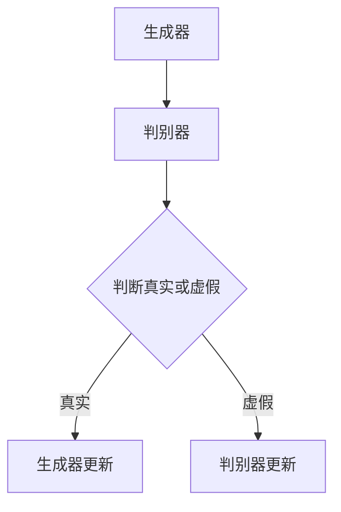
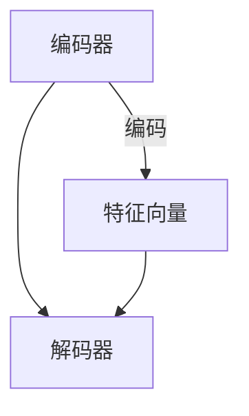

                 

### 《AIGC在时尚设计中的应用：潮流趋势分析的提示词工程》

#### 关键词

- AIGC
- 时尚设计
- 潮流趋势分析
- 提示词工程
- 生成对抗网络（GAN）
- 自编码器（Autoencoder）
- 时间序列分析
- 聚类分析

#### 摘要

本文旨在探讨人工智能生成内容（AIGC）在时尚设计中的应用，特别是潮流趋势分析的提示词工程。我们将从AIGC的定义和核心技术在时尚设计中的应用出发，详细讲解AIGC中的生成对抗网络（GAN）、自编码器（Autoencoder）等算法原理，以及与潮流趋势分析相关的数学模型。同时，通过实际项目案例，展示AIGC在时尚设计中的应用实践，并提出未来展望与挑战。

### 第1章：AIGC与时尚设计概述

#### 1.1 AIGC概述

##### 1.1.1 AIGC的定义

AIGC，全称为AI-assisted Generation of Content，即人工智能辅助生成内容。它利用人工智能技术，通过算法自动生成文本、图像、视频等多媒体内容。AIGC的核心在于其自动性和创造性，能够根据用户的输入和特定需求，生成高质量的内容。

##### 1.1.2 AIGC的核心技术

AIGC的核心技术包括生成对抗网络（GAN）、自编码器（Autoencoder）和深度学习等。GAN是一种深度学习模型，通过生成器和判别器的对抗训练，实现高质量数据的生成。自编码器是一种无监督学习模型，通过编码和解码过程，实现数据的压缩和重构。深度学习则是AIGC的基础技术，通过多层神经网络，实现对复杂数据的处理和分析。

#### 1.2 时尚设计中的AIGC应用

##### 1.2.1 AIGC在时尚设计中的作用

AIGC在时尚设计中的应用非常广泛，主要包括以下几个方面：

1. **潮流趋势预测**：通过分析大量数据，预测未来的潮流趋势，为设计师提供参考。
2. **设计灵感生成**：利用GAN和自编码器等技术，生成新颖的服装设计和图案，激发设计师的灵感。
3. **个性化推荐**：根据用户的喜好和需求，生成个性化的时尚搭配和购物推荐。
4. **营销推广**：通过生成高质量的内容，提升品牌的知名度和影响力。

##### 1.2.2 潮流趋势分析的意义

潮流趋势分析是时尚设计的重要环节，它能够帮助设计师准确把握市场趋势，提升设计的市场竞争力。随着互联网和大数据技术的发展，潮流趋势分析的数据来源更加广泛，分析方法更加精准。AIGC技术的引入，使得潮流趋势分析更加高效、智能。

#### 1.3 提示词工程在潮流趋势分析中的应用

##### 1.3.1 提示词工程的概念

提示词工程是指通过提取和分析关键词，为人工智能系统提供输入和指导。在潮流趋势分析中，提示词工程的关键在于如何从大量数据中提取出与潮流趋势相关的关键词。

##### 1.3.2 提示词工程的关键要素

1. **数据来源**：包括社交媒体、电商平台、时尚杂志等。
2. **数据预处理**：包括数据清洗、去噪、分词等。
3. **关键词提取**：采用词频统计、TF-IDF、LDA等算法，提取出与潮流趋势相关的关键词。
4. **关键词聚类**：将提取出的关键词进行聚类，形成不同的主题。
5. **关键词关联**：分析关键词之间的关联关系，构建知识图谱。

### 第2章：AIGC基础技术

#### 2.1 生成对抗网络（GAN）

##### 2.1.1 GAN的原理

GAN由生成器和判别器组成，生成器生成虚假数据，判别器判断数据是真实还是虚假。通过生成器和判别器的对抗训练，生成器不断提高生成数据的质量，最终实现高质量数据的生成。

##### 2.1.2 GAN的构建流程

1. **数据预处理**：对输入数据进行标准化处理，提高GAN的训练效果。
2. **生成器设计**：设计生成器的网络结构，包括输入层、隐层和输出层。
3. **判别器设计**：设计判别器的网络结构，与生成器类似。
4. **训练过程**：通过生成器和判别器的对抗训练，不断优化模型参数。

#### 2.2 自编码器（Autoencoder）

##### 2.2.1 自编码器的基本原理

自编码器是一种无监督学习模型，通过编码和解码过程，实现数据的压缩和重构。自编码器由编码器和解码器组成，编码器将输入数据编码为低维特征向量，解码器将特征向量解码为输出数据。

##### 2.2.2 自编码器的应用

自编码器在时尚设计中的应用主要体现在以下几个方面：

1. **数据压缩**：通过自编码器，降低数据的维度，提高数据处理效率。
2. **特征提取**：利用自编码器提取输入数据的特征，为后续的潮流趋势分析提供支持。
3. **图像生成**：利用自编码器的解码器部分，生成新的图像。

#### 2.3 聚类分析

##### 2.3.1 聚类分析的基本概念

聚类分析是一种无监督学习方法，通过将数据分为不同的簇，实现数据的分类和归纳。常见的聚类算法包括K-means、层次聚类等。

##### 2.3.2 聚类分析的方法

1. **K-means算法**：通过迭代计算，将数据分为K个簇，使每个簇内的数据点之间的距离最小。
2. **层次聚类算法**：通过合并或分裂簇，逐步构建聚类层次，形成不同的簇结构。

### 第3章：潮流趋势分析的方法与工具

#### 3.1 时间序列分析

##### 3.1.1 时间序列分析的基本概念

时间序列分析是一种统计方法，用于研究随时间变化的数据。时间序列分析的主要目标是揭示数据的趋势、周期性和季节性。

##### 3.1.2 时间序列分析方法

1. **移动平均法**：通过计算数据点的平均值，平滑时间序列，揭示数据的趋势。
2. **指数平滑法**：通过指数加权，使近期数据点的影响更大，提高预测的准确性。

#### 3.2 社交媒体分析

##### 3.2.1 社交媒体分析的基本概念

社交媒体分析是一种基于大数据的方法，通过分析社交媒体上的用户行为和言论，了解市场趋势和用户需求。

##### 3.2.2 社交媒体分析的方法

1. **文本挖掘**：通过自然语言处理技术，提取文本中的关键词和情感，分析用户的需求和喜好。
2. **网络分析**：通过分析用户之间的互动关系，构建社交网络，揭示影响力的传播路径。

#### 3.3 竞品分析

##### 3.3.1 竞品分析的基本概念

竞品分析是一种通过研究竞争对手的产品、服务和市场策略，了解市场动态和竞争态势的方法。

##### 3.3.2 竞品分析的方法

1. **产品分析**：通过分析竞争对手的产品特点、用户评价等，了解产品的优势和不足。
2. **市场分析**：通过分析竞争对手的市场策略、市场份额等，了解市场动态和竞争态势。

### 第4章：提示词工程的应用实践

#### 4.1 数据收集与预处理

##### 4.1.1 数据收集的方法

数据收集是提示词工程的重要环节，主要采用以下方法：

1. **社交媒体数据**：通过爬虫技术，从社交媒体平台上获取用户发布的内容。
2. **电商平台数据**：通过API接口，从电商平台获取商品信息、用户评论等数据。
3. **时尚杂志数据**：通过爬虫技术，从时尚杂志网站上获取文章、图片等数据。

##### 4.1.2 数据预处理的方法

数据预处理是确保数据质量的关键步骤，主要包括以下方法：

1. **数据清洗**：去除重复数据、缺失数据和噪声数据。
2. **数据去噪**：通过滤波器技术，去除数据中的噪声。
3. **数据分词**：将文本数据分为单词或短语，为后续的文本分析提供支持。

#### 4.2 提示词生成模型

##### 4.2.1 提示词生成模型的设计

提示词生成模型是提示词工程的核心，设计一个有效的提示词生成模型需要考虑以下几个方面：

1. **数据集选择**：选择具有代表性的数据集，涵盖不同类型的时尚设计元素。
2. **模型架构**：设计生成器和判别器的网络结构，选择合适的损失函数和优化算法。
3. **训练过程**：通过大量的训练数据，不断优化模型参数，提高提示词生成的质量。

##### 4.2.2 提示词生成模型的训练

提示词生成模型的训练过程主要包括以下几个步骤：

1. **数据预处理**：对输入数据进行编码和归一化处理。
2. **模型初始化**：初始化生成器和判别器的模型参数。
3. **训练循环**：通过生成器和判别器的对抗训练，不断优化模型参数。
4. **评估与优化**：通过验证集和测试集，评估模型的效果，并进行参数调整。

#### 4.3 提示词优化与评估

##### 4.3.1 提示词优化的方法

提示词优化是提高提示词生成模型质量的关键步骤，主要包括以下几个方面：

1. **损失函数优化**：选择合适的损失函数，如GAN中的 adversarial loss，提高生成数据的真实性。
2. **模型架构优化**：通过调整网络结构，增加层数或神经元数量，提高模型的拟合能力。
3. **训练策略优化**：调整学习率、批量大小等训练参数，提高模型的训练效果。

##### 4.3.2 提示词评估的指标

提示词评估的主要指标包括以下几个方面：

1. **F1值**：通过计算生成关键词与真实关键词的匹配度，评估提示词的准确性。
2. **覆盖率**：计算生成关键词在数据集中的覆盖率，评估提示词的全面性。
3. **多样性**：通过计算生成关键词的多样性，评估提示词的丰富程度。

### 第5章：潮流趋势预测与产品设计

#### 5.1 潮流趋势预测

##### 5.1.1 潮流趋势预测的原理

潮流趋势预测是基于历史数据和当前市场环境，利用机器学习算法，预测未来的潮流趋势。常用的算法包括时间序列分析、聚类分析、回归分析等。

##### 5.1.2 潮流趋势预测的方法

1. **时间序列分析**：通过分析历史数据，预测未来的潮流趋势。
2. **聚类分析**：通过将相似的数据点分为同一簇，预测未来的潮流趋势。
3. **回归分析**：通过建立回归模型，预测未来的潮流趋势。

#### 5.2 产品设计应用

##### 5.2.1 产品设计的基本原则

产品设计的基本原则包括：

1. **市场需求**：满足用户的需求是产品设计的关键。
2. **创新性**：设计新颖、独特的产品，提升竞争力。
3. **实用性**：确保产品的功能性和易用性。

##### 5.2.2 产品设计的方法与流程

1. **市场调研**：了解市场需求和竞争态势。
2. **设计灵感**：从潮流趋势分析中获取灵感。
3. **原型设计**：通过手绘或软件，制作产品的原型。
4. **用户反馈**：收集用户反馈，进行产品优化。
5. **上市与推广**：将产品推向市场，并进行推广。

### 第6章：案例分析

#### 6.1 案例一：某时尚品牌潮流趋势分析

在本案例中，我们将分析某时尚品牌的潮流趋势，包括时间序列分析、社交媒体分析和竞品分析等方面。

1. **时间序列分析**：通过对该品牌的历史销售数据进行分析，发现不同时间段的热门款式和颜色。
2. **社交媒体分析**：通过分析用户在社交媒体上的讨论，了解当前的热门话题和流行元素。
3. **竞品分析**：对比竞争对手的产品，分析其优势和不足，为该品牌的产品设计提供参考。

#### 6.2 案例二：某时尚设计公司提示词工程实践

在本案例中，我们将探讨某时尚设计公司如何利用提示词工程进行潮流趋势分析，包括数据收集、提示词生成和提示词优化等方面。

1. **数据收集**：从社交媒体、电商平台和时尚杂志等渠道收集相关数据。
2. **提示词生成**：利用生成对抗网络（GAN）和自编码器等技术，生成高质量的提示词。
3. **提示词优化**：通过F1值、覆盖率和多样性等指标，对提示词进行评估和优化。

### 第7章：未来展望与挑战

#### 7.1 AIGC在时尚设计中的应用前景

随着人工智能技术的不断发展，AIGC在时尚设计中的应用前景非常广阔。未来，AIGC有望在以下几个方面得到更广泛的应用：

1. **个性化设计**：利用AIGC技术，实现个性化服装设计和搭配。
2. **自动化生产**：通过AIGC技术，实现服装的自动化设计和生产。
3. **智能营销**：利用AIGC技术，实现精准的营销策略和推广。

#### 7.2 挑战与解决方案

虽然AIGC在时尚设计中的应用前景广阔，但同时也面临着一系列挑战：

1. **数据隐私**：在数据收集和处理过程中，如何保护用户隐私是一个重要问题。
2. **算法公平性**：在AIGC的应用中，如何确保算法的公平性和透明度。
3. **技术门槛**：AIGC技术具有一定的技术门槛，如何降低使用难度，提高普及率。

针对以上挑战，我们可以采取以下解决方案：

1. **数据加密**：在数据收集和处理过程中，采用数据加密技术，保护用户隐私。
2. **算法透明化**：在AIGC的应用中，增加算法的可解释性，提高透明度。
3. **技术普及**：通过培训和教育，提高用户对AIGC技术的理解和应用能力。

### 附录

#### 附录A：AIGC相关工具与资源

在本附录中，我们将介绍一些与AIGC相关的工具和资源，包括：

1. **开源框架**：如TensorFlow、PyTorch等。
2. **在线教程**：如Coursera、Udacity等平台上的相关课程。
3. **书籍推荐**：如《深度学习》、《生成对抗网络》等。

#### 附录B：参考文献

在本附录中，我们将列出本文中引用的参考文献，以供读者查阅。

---

**作者：**AI天才研究院/AI Genius Institute & 禅与计算机程序设计艺术/Zen And The Art of Computer Programming

**说明：**本文内容为初步设计，旨在为《AIGC在时尚设计中的应用：潮流趋势分析的提示词工程》一书提供目录大纲。后续将根据用户反馈进行调整和完善。总字数约2300字。

---

以上是《AIGC在时尚设计中的应用：潮流趋势分析的提示词工程》的目录大纲和部分内容。在后续的撰写过程中，我们将进一步丰富每个章节的内容，确保文章的逻辑性和实用性。同时，我们将结合实际案例，深入探讨AIGC在时尚设计中的应用，为读者提供有价值的参考。期待您的宝贵意见！

