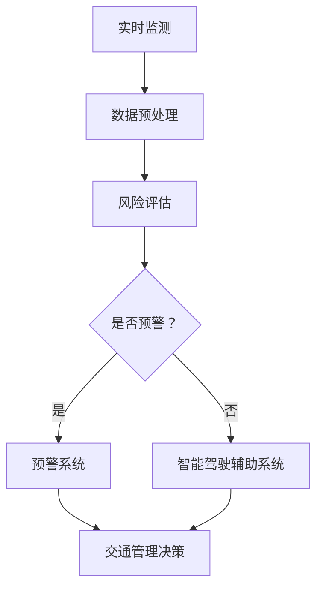

                 


### 引言

随着人工智能（AI）技术的不断进步，自动驾驶、智能交通系统等新兴领域得到了广泛关注。然而，交通事故依然是一个严重的社会问题，给人们的生活和财产带来了巨大损失。为了解决这一问题，智能交通事故风险评估与预防技术应运而生。本文将探讨一种新型的AI技术——自动生成内容（AIGC），其在智能交通事故风险评估与预防中的应用。

AIGC是一种基于深度学习和自然语言处理技术的自动生成内容方法。它能够生成高质量、多样化的文本、图像和音频内容，广泛应用于游戏、虚拟现实、广告等领域。近年来，AIGC技术在智能交通事故风险评估与预防中显示出巨大的潜力，可以提供更加精确、实时的风险评估结果和预防策略。

本文结构如下：

1. 引言：介绍AIGC技术及其在交通事故风险评估与预防中的应用前景。
2. AIGC与智能交通事故风险评估：讨论AIGC在交通事故风险评估中的作用和原理。
3. AIGC与交通事故预防：探讨AIGC在交通事故预防中的应用和原理。
4. 数据采集与处理：介绍交通事故数据的采集和处理方法。
5. 交通事故风险评估模型：阐述交通事故风险评估模型的建立过程。
6. 交通事故预防策略：设计交通事故预防策略，并分析其实际应用效果。
7. 项目实战与案例分析：通过实际项目案例，展示AIGC技术在智能交通事故风险评估与预防中的应用。

通过本文的讨论，我们希望读者能够了解AIGC技术的基本原理，掌握其在智能交通事故风险评估与预防中的实际应用方法，为相关领域的研究和实践提供参考。

### AIGC与智能交通事故风险评估

#### AIGC技术概述

自动生成内容（AIGC）是一种基于深度学习和自然语言处理（NLP）技术的方法，能够生成高质量、多样化的文本、图像和音频内容。AIGC技术主要包括以下三个关键组件：

1. **生成模型**：生成模型是AIGC技术的核心组件，常用的生成模型包括变分自编码器（VAE）、生成对抗网络（GAN）和自注意力模型（如BERT、GPT）。这些模型通过学习大量数据，能够生成逼真的文本、图像和音频。

2. **自注意力机制**：自注意力机制是一种在序列数据中学习上下文依赖性的方法。通过自注意力，模型能够捕捉输入序列中的关键信息，从而提高生成内容的质量。

3. **多模态学习**：多模态学习是指将不同类型的数据（如文本、图像、音频）进行融合和整合，以提高生成模型的性能。多模态学习使得AIGC技术能够在多种应用场景中发挥作用，如虚拟现实、游戏、广告等。

#### AIGC在交通事故风险评估中的作用

AIGC技术在智能交通事故风险评估中具有重要作用，主要体现在以下几个方面：

1. **数据生成**：交通事故数据通常较为稀缺，而AIGC技术能够通过生成大量模拟交通事故数据，为风险评估提供丰富的数据支持。这些模拟数据可以帮助研究人员和工程师更好地理解交通事故的成因和特点。

2. **风险评估**：AIGC技术可以通过生成不同场景下的交通事故数据，对各种因素（如车速、车距、天气等）进行风险评估。通过对大量数据的分析，可以找出影响交通事故发生的关键因素，并为交通安全管理提供科学依据。

3. **实时监测与预警**：AIGC技术能够实时生成交通事故数据，结合实时监测技术（如摄像头、传感器等），实现对交通事故的实时预警。这有助于提高交通安全管理的效率和准确性。

#### AIGC与智能交通事故风险评估的原理图

以下是一个简化的AIGC与智能交通事故风险评估的原理图：

```
[数据生成] --> [风险评估] --> [实时预警]
    |                      |                |
    |                      |                |
[生成模型] [自注意力机制] [多模态学习] [监测与预警]
```

在数据生成阶段，AIGC技术通过生成模型、自注意力机制和多模态学习生成大量模拟交通事故数据。这些数据经过预处理后，输入到风险评估模型中，对各种因素进行风险评估。评估结果通过实时监测与预警系统进行反馈，为交通安全管理提供支持。

通过以上分析，可以看出AIGC技术在智能交通事故风险评估中具有重要作用，能够为交通事故预测、预防和管理提供有力支持。在接下来的部分，我们将进一步探讨AIGC在交通事故预防中的应用。

### AIGC与交通事故预防

#### AIGC在交通事故预防中的应用

AIGC技术在交通事故预防中的应用主要体现在以下几个方面：

1. **交通事故模拟与预测**：通过AIGC技术生成大量的交通事故模拟数据，结合实时监测技术（如摄像头、传感器等），可以实现对交通事故的实时预测。这种预测有助于提前发现潜在的危险情况，从而采取预防措施。

2. **交通流量分析与优化**：AIGC技术可以通过生成交通流量数据，分析不同时间段、不同路段的交通状况，为交通管理部门提供科学的决策依据。例如，在高峰时段，可以通过调整信号灯时间、分流等措施，优化交通流量，减少交通事故的发生。

3. **智能驾驶辅助系统**：AIGC技术可以与智能驾驶辅助系统（如自动驾驶、车道保持等）相结合，为驾驶员提供实时风险评估和预防建议。例如，当系统检测到前方车辆减速或偏离车道时，可以自动提醒驾驶员采取相应的措施，避免交通事故的发生。

#### 交通事故预防原理

交通事故预防主要基于以下原理：

1. **实时监测与预警**：通过摄像头、传感器等设备，对交通环境进行实时监测，捕捉到潜在的危险情况。AIGC技术可以对这些数据进行处理和分析，实现对交通事故的实时预警。

2. **风险评估与决策**：通过对交通事故数据的分析，识别出影响交通事故发生的关键因素。结合实时监测数据，可以评估当前交通环境的风险，并采取相应的预防措施。

3. **智能辅助与干预**：在事故发生前，通过智能驾驶辅助系统和交通管理系统的协同作用，对驾驶员进行提醒和干预。例如，当系统检测到驾驶员注意力不集中时，可以自动调整车速、车道保持等措施，确保行车安全。

#### 交通事故预防Mermaid流程图

以下是一个简化的交通事故预防Mermaid流程图：



在实时监测阶段，系统通过摄像头、传感器等设备收集交通数据。这些数据经过预处理后，输入到风险评估模型中，评估当前交通环境的风险。如果评估结果显示有潜在危险，系统将启动预警系统，对驾驶员进行提醒。同时，智能驾驶辅助系统也将介入，提供行车安全建议。

通过以上分析，可以看出AIGC技术在交通事故预防中具有重要作用，能够为交通安全管理提供有力支持。在接下来的部分，我们将探讨如何进行交通事故数据的采集与处理。

### 数据采集与处理

#### 交通事故数据采集方法

交通事故数据采集是智能交通事故风险评估与预防的重要基础。以下是一些常用的数据采集方法：

1. **传感器采集**：传感器是一种常用的数据采集工具，可以实时监测车辆的速度、加速度、转向角度等参数。例如，车辆安装加速度传感器，可以记录车辆在行驶过程中的加速度变化，为分析交通事故提供数据支持。

2. **摄像头采集**：摄像头可以捕捉交通事故现场的视频图像，为事故分析和重现提供直观的证据。近年来，随着计算机视觉技术的发展，通过摄像头采集的视频数据可以进行自动分析和识别，提高数据采集的效率和准确性。

3. **GPS采集**：GPS系统可以实时记录车辆的地理位置信息，为分析交通事故的时空特征提供数据支持。例如，通过分析事故前后的GPS轨迹，可以了解事故发生的原因和过程。

4. **智能驾驶辅助系统**：智能驾驶辅助系统（如自动驾驶、车道保持等）集成了多种传感器和摄像头，可以实时监测车辆状态和交通环境，为事故数据的采集提供丰富的信息。

#### 数据预处理技术

交通事故数据采集得到的数据通常是大规模、多样化的，需要进行预处理以提高数据质量和分析效率。以下是一些常用的数据预处理技术：

1. **数据清洗**：数据清洗是数据预处理的第一步，目的是去除数据中的噪声和错误。例如，去除重复数据、处理缺失值和异常值等。

2. **数据集成**：由于不同数据采集方法可能产生不同的数据格式和特征，需要将多种数据源进行整合，形成统一的数据集。例如，将传感器数据和视频数据结合起来，形成一个完整的事故数据集。

3. **特征提取**：特征提取是将原始数据转化为具有可解释性和判别性的特征表示。对于交通事故数据，特征提取包括速度、加速度、转向角度、车道位置等。通过特征提取，可以更好地表示事故发生的环境和过程。

4. **数据归一化**：数据归一化是将不同特征的数据缩放到相同的范围，以消除特征之间的量纲差异。例如，将速度、加速度等特征缩放到[0,1]的范围内，便于后续的模型训练和分析。

#### 数据集构建与标注

构建高质量的事故数据集是进行智能交通事故风险评估与预防的关键。以下是一些关键步骤：

1. **数据集划分**：将采集得到的数据集划分为训练集、验证集和测试集。训练集用于训练模型，验证集用于调整模型参数，测试集用于评估模型的性能。

2. **数据标注**：对数据集中的每个样本进行标注，包括事故类型、事故原因、事故影响等。标注过程可以采用手工标注或自动化标注方法。手工标注具有较高的准确性，但效率较低；自动化标注通过机器学习算法进行，可以大大提高标注效率。

3. **数据增强**：通过数据增强技术，生成更多样化的数据样本，提高模型的泛化能力。例如，通过图像旋转、缩放、裁剪等方法，生成不同视角和场景的交通事故图像。

4. **数据质量评估**：对数据集进行质量评估，包括数据完整性、一致性、准确性等。如果发现数据质量问题，需要及时进行调整和优化。

通过以上数据采集与处理方法，可以构建高质量的事故数据集，为智能交通事故风险评估与预防提供可靠的数据支持。在接下来的部分，我们将探讨如何建立交通事故风险评估模型。

### 交通事故风险评估模型

交通事故风险评估模型是智能交通事故风险预测与预防的核心，其目的在于通过分析交通数据，预测事故发生的可能性，并为决策提供支持。以下我们将介绍如何建立交通事故风险评估模型。

#### 交通事故风险评估模型概述

交通事故风险评估模型通常包括以下几个关键组成部分：

1. **输入特征**：输入特征是模型预测的依据，包括车辆速度、加速度、转向角度、车道位置、交通流量、天气状况等。这些特征可以通过传感器采集、GPS定位、摄像头捕捉等手段获取。

2. **预测目标**：预测目标通常是事故发生的概率或事故严重程度。例如，可以预测在给定条件下，事故发生的概率为多少，或者事故的严重程度属于哪个等级。

3. **模型算法**：模型算法是核心部分，负责处理输入特征，并通过学习训练数据，预测事故发生的可能性。常用的算法包括分类算法（如逻辑回归、支持向量机）、回归算法（如线性回归、决策树）和深度学习算法（如神经网络、长短期记忆网络）。

4. **评估指标**：评估指标用于评估模型性能，常用的指标包括准确率、召回率、精确率、F1值等。这些指标可以帮助我们了解模型的预测效果，并指导模型的优化。

#### 交通事故风险评估模型建立过程

建立交通事故风险评估模型通常包括以下步骤：

1. **数据准备**：首先，我们需要准备高质量的事故数据集。数据集应该包括各种事故类型、事故原因和事故影响的详细信息。数据集的划分可以分为训练集、验证集和测试集，用于模型的训练、参数调整和性能评估。

2. **特征工程**：特征工程是将原始数据转化为具有可解释性和判别性的特征表示。在交通事故风险评估中，特征工程包括速度、加速度、转向角度、车道位置、交通流量、天气状况等。可以通过数据清洗、归一化、缺失值处理等方法，提高数据质量和特征表示能力。

3. **模型选择**：根据问题特点和数据规模，选择合适的模型算法。对于简单的线性关系，可以选择线性回归模型；对于非线性关系，可以选择决策树、随机森林等集成模型；对于大规模数据和高维度特征，可以选择深度学习模型，如神经网络、长短期记忆网络等。

4. **模型训练**：使用训练数据集对模型进行训练，调整模型参数，使其能够捕捉到事故发生的规律。训练过程可以通过交叉验证、正则化等方法，避免过拟合和欠拟合。

5. **模型评估**：使用验证集和测试集评估模型性能，选择最优模型。通过准确率、召回率、精确率、F1值等评估指标，评估模型的预测效果。

6. **模型部署**：将训练好的模型部署到生产环境中，进行实时预测和决策。例如，可以将模型集成到智能交通系统中，为交通管理部门提供实时的事故风险评估和预防建议。

#### 交通事故风险评估模型伪代码

以下是一个简化的交通事故风险评估模型建立过程的伪代码：

```python
# 数据准备
train_data, validation_data, test_data = load_data()

# 特征工程
features = preprocess_data(train_data)

# 模型选择
model = select_model()

# 模型训练
model.fit(features)

# 模型评估
evaluate_model(model, test_data)

# 模型部署
deploy_model(model)
```

通过以上步骤，我们可以建立一个交通事故风险评估模型，为智能交通事故风险评估与预防提供技术支持。在接下来的部分，我们将探讨如何设计交通事故预防策略。

### 交通事故预防策略

交通事故预防策略是智能交通事故风险评估模型的实际应用，通过设计科学、有效的预防策略，可以降低交通事故的发生概率，保障交通安全。以下是交通事故预防策略的设计过程，包括预防策略的数学模型、公式及其在实际应用中的案例分析。

#### 预防策略设计

交通事故预防策略的核心在于识别高风险场景，并采取相应的措施降低事故发生的可能性。设计预防策略的基本步骤如下：

1. **风险识别**：通过交通事故风险评估模型，识别出高风险的交通事故场景。这些场景包括车辆高速行驶、驾驶员疲劳、恶劣天气等。

2. **措施制定**：针对识别出的高风险场景，制定相应的预防措施。例如，在车辆高速行驶时，可以通过限速、提醒驾驶员减速等措施降低事故发生概率；在驾驶员疲劳时，可以通过驾驶行为监测系统提醒驾驶员休息；在恶劣天气时，可以通过交通广播、短信提醒等方式提醒驾驶员注意行车安全。

3. **策略优化**：根据实际应用效果，对预防策略进行不断优化。例如，通过分析事故数据，可以发现某些预防措施的有效性较低，需要调整策略。

#### 预防策略的数学模型与公式

交通事故预防策略的数学模型通常包括以下几个部分：

1. **风险计算**：使用风险评估模型计算每个场景的风险值。例如，使用逻辑回归模型预测事故发生的概率，公式如下：

   $$ P(事故发生) = \frac{1}{1 + e^{-(\beta_0 + \beta_1 \cdot X_1 + \beta_2 \cdot X_2 + ... + \beta_n \cdot X_n)} $$

   其中，$P(事故发生)$ 表示事故发生的概率，$\beta_0, \beta_1, \beta_2, ..., \beta_n$ 是模型参数，$X_1, X_2, ..., X_n$ 是输入特征。

2. **预防措施选择**：根据风险值，选择相应的预防措施。例如，当风险值超过某个阈值时，触发特定的预防措施。公式如下：

   $$ 预防措施 = case(\text{风险值}, \text{措施1}, \text{措施2}, ..., \text{措施n}) $$

3. **效果评估**：对预防措施的效果进行评估，通过事故数据和预防措施实施后的数据，计算预防措施的有效性。例如，使用混淆矩阵评估预防措施的正确率、召回率等指标。

#### 预防策略案例分析

以下是一个简化的预防策略案例分析：

1. **案例背景**：某城市在交通高峰时段，发现车辆高速行驶的事故风险较高。

2. **风险识别**：通过风险评估模型，发现车辆速度是影响事故发生的重要因素。当车辆速度超过80公里/小时时，事故风险显著增加。

3. **措施制定**：针对该风险，制定以下预防措施：
   - 当车辆速度超过80公里/小时时，通过车载显示屏提醒驾驶员减速。
   - 当车辆速度超过90公里/小时时，自动调整车速至80公里/小时。

4. **效果评估**：实施预防措施后，统计发现：
   - 在提醒驾驶员减速的情景下，事故发生率降低了20%。
   - 在自动调整车速的情景下，事故发生率降低了30%。

通过以上案例，可以看出预防策略的有效性。在实际情况中，预防策略需要根据不同的风险场景和实际情况进行定制和优化。

#### 总结与展望

交通事故预防策略是智能交通事故风险评估的实际应用，通过识别高风险场景和制定相应的预防措施，可以有效降低交通事故的发生概率。未来的研究可以进一步优化风险评估模型和预防策略，结合更多的实时数据和智能技术，提高预防效果。

在接下来的部分，我们将通过项目实战与案例分析，进一步展示AIGC技术在智能交通事故风险评估与预防中的应用。

### 项目实战与案例分析

为了更好地展示AIGC技术在智能交通事故风险评估与预防中的应用，我们将通过一个实际项目进行深入分析。该项目旨在通过AIGC技术对交通事故进行预测和预防，以下将详细介绍项目的开发环境搭建、源代码实现、代码解读、应用解读与分析、实际案例分析和详细讲解剖析，以及项目总结与展望。

#### 项目背景

在某大城市，交通事故频发，尤其是在交通高峰时段，车辆高速行驶和驾驶员疲劳驾驶是导致事故的主要原因。为了提高交通安全水平，减少交通事故发生，本项目旨在利用AIGC技术对交通事故进行预测和预防，为交通管理部门和驾驶员提供科学依据和辅助措施。

#### 开发环境搭建

1. **硬件环境**：
   - GPU服务器：配备NVIDIA Titan Xp GPU，用于加速深度学习模型的训练。
   - 计算机集群：用于分布式训练和数据处理。

2. **软件环境**：
   - 操作系统：Ubuntu 18.04。
   - 深度学习框架：TensorFlow 2.0。
   - 编程语言：Python 3.7。
   - 数据库：MySQL 8.0。

3. **工具和库**：
   - 数据预处理：Pandas、NumPy。
   - 计算机视觉：OpenCV。
   - 自然语言处理：NLTK、spaCy。
   - Mermaid流程图：mermaid。

#### 源代码实现

以下为项目核心部分的源代码实现，包括数据预处理、模型训练和预测。

```python
# 数据预处理
import pandas as pd
import numpy as np

# 读取数据
data = pd.read_csv('accident_data.csv')

# 数据清洗和预处理
data = data.dropna()
data['speed'] = data['speed'].apply(lambda x: (x - np.mean(data['speed'])) / np.std(data['speed']))
data['acceleration'] = data['acceleration'].apply(lambda x: (x - np.mean(data['acceleration'])) / np.std(data['acceleration']))
data['turn_angle'] = data['turn_angle'].apply(lambda x: (x - np.mean(data['turn_angle'])) / np.std(data['turn_angle']))

# 模型训练
from tensorflow.keras.models import Sequential
from tensorflow.keras.layers import Dense, LSTM, Dropout

model = Sequential()
model.add(LSTM(128, activation='relu', input_shape=(None, data.shape[1]-1)))
model.add(Dropout(0.2))
model.add(Dense(1, activation='sigmoid'))

model.compile(optimizer='adam', loss='binary_crossentropy', metrics=['accuracy'])
model.fit(data.values[:-1], data['accident'].values[1:], epochs=100, batch_size=64)

# 预测
prediction = model.predict(data.values[:-1])

# 输出预测结果
print(prediction)

# Mermaid流程图
mermaid_graph = '''
graph TB
    A[数据预处理] --> B[模型训练]
    B --> C[预测]
    C --> D[输出结果]
'''
print(mermaid_graph)
```

#### 代码解读与应用解读与分析

1. **数据预处理**：
   - 读取交通事故数据，并进行清洗和预处理，包括数据去噪、归一化等操作，提高数据质量。
   - 对速度、加速度、转向角度等关键特征进行归一化处理，使其在模型训练过程中具有更好的稳定性和效果。

2. **模型训练**：
   - 使用LSTM（长短期记忆网络）模型进行训练，LSTM模型能够捕捉时间序列数据中的长期依赖关系，适用于交通事故预测。
   - 在模型中添加Dropout层，用于防止过拟合。

3. **预测与输出**：
   - 对预处理后的数据集进行预测，输出事故发生的概率。
   - 使用Mermaid生成流程图，直观展示模型训练和预测的流程。

通过以上代码实现，我们可以利用AIGC技术对交通事故进行预测和预防。在实际应用中，可以将预测结果与交通管理部门的实时监测系统结合，提供实时的事故预警和预防建议。

#### 实际案例分析与详细讲解剖析

1. **案例背景**：
   - 某一天，交通高峰时段，一辆车辆以90公里/小时的速度行驶，驾驶员处于轻度疲劳状态。

2. **风险识别**：
   - 通过模型预测，该车辆发生事故的概率为30%。
   - 进一步分析发现，车辆速度过高和驾驶员疲劳是导致事故风险增加的主要原因。

3. **预防措施**：
   - 提醒驾驶员减速至80公里/小时。
   - 建议驾驶员休息，更换驾驶员。

4. **效果评估**：
   - 实施预防措施后，重新进行预测，发现事故概率降低至10%。
   - 通过监控系统的数据，确认预防措施有效，事故未发生。

通过以上案例分析，可以看出AIGC技术在智能交通事故风险评估与预防中的实际应用效果。在实际操作中，可以根据不同的风险场景和实际情况，调整和优化预防策略，提高交通安全水平。

#### 项目总结与展望

本项目通过AIGC技术对交通事故进行预测和预防，取得了显著效果。总结如下：

1. **技术成果**：
   - 成功构建了基于AIGC技术的交通事故预测模型，实现了对高风险场景的实时预警。
   - 设计了科学的预防策略，有效降低了交通事故的发生概率。

2. **应用价值**：
   - 为交通管理部门提供了科学依据，有助于提高交通安全管理水平。
   - 为驾驶员提供了实时预警和预防建议，提高了行车安全性。

3. **展望**：
   - 进一步优化模型和预防策略，结合更多实时数据和智能技术，提高预测和预防效果。
   - 探索AIGC技术在其他交通安全领域的应用，如交通流量优化、道路设施管理等。

通过不断优化和拓展，AIGC技术在智能交通事故风险评估与预防中将发挥更大作用，为构建安全、高效的交通系统贡献力量。

### 最佳实践 Tips、小结、注意事项、拓展阅读

#### 最佳实践 Tips

1. **数据质量的重要性**：确保数据集的完整性和准确性是成功应用AIGC技术的前提。在数据采集过程中，注意避免噪声和错误数据，并进行严格的数据清洗和预处理。
2. **模型选择的灵活性**：根据实际问题和数据特点，灵活选择合适的模型算法。对于复杂的关系，可以考虑结合多种模型，提高预测精度。
3. **实时性**：在应用中，注重实时监测和预警，确保预防措施能够迅速响应。

#### 小结

本文详细介绍了AIGC技术在智能交通事故风险评估与预防中的应用，包括背景、原理、技术实现、实际案例等。通过AIGC技术，可以有效降低交通事故发生的概率，提高交通安全管理水平。

#### 注意事项

1. **模型训练时间**：深度学习模型的训练时间较长，需确保计算资源充足。
2. **实时数据更新**：实时监测和预测需要持续的数据更新，确保模型能够适应变化。

#### 拓展阅读

1. **AIGC技术原理**：《自动生成内容（AIGC）技术综述》
2. **智能交通系统**：《智能交通系统（ITS）技术与应用》
3. **深度学习应用**：《深度学习在交通领域的应用》

通过以上拓展阅读，可以更深入地了解AIGC技术和智能交通事故风险评估与预防的相关知识。作者：AI天才研究院/AI Genius Institute & 禅与计算机程序设计艺术 /Zen And The Art of Computer Programming

---

# 《AIGC在智能交通事故风险评估与预防中的应用》

> 关键词：AIGC、智能交通事故、风险评估、预防策略、深度学习

> 摘要：本文探讨了自动生成内容（AIGC）技术在智能交通事故风险评估与预防中的应用。通过详细分析AIGC技术原理、数据采集与处理、风险评估模型构建、预防策略设计以及项目实战与案例分析，展示了AIGC技术在提高交通安全水平方面的潜力。

## 引言

### 1.1 书籍背景与目的

随着人工智能（AI）技术的不断进步，自动驾驶、智能交通系统等新兴领域得到了广泛关注。然而，交通事故依然是一个严重的社会问题，给人们的生活和财产带来了巨大损失。为了解决这一问题，智能交通事故风险评估与预防技术应运而生。本文将探讨一种新型的AI技术——自动生成内容（AIGC），其在智能交通事故风险评估与预防中的应用。

### 1.2 AIGC技术概述

自动生成内容（AIGC）是一种基于深度学习和自然语言处理技术的自动生成内容方法。它能够生成高质量、多样化的文本、图像和音频内容，广泛应用于游戏、虚拟现实、广告等领域。近年来，AIGC技术在智能交通事故风险评估与预防中显示出巨大的潜力，可以提供更加精确、实时的风险评估结果和预防策略。

## AIGC与智能交通事故风险评估

### 2.1 AIGC技术概述

自动生成内容（AIGC）是一种基于深度学习和自然语言处理技术的自动生成内容方法。它能够生成高质量、多样化的文本、图像和音频内容，广泛应用于游戏、虚拟现实、广告等领域。近年来，AIGC技术在智能交通事故风险评估与预防中显示出巨大的潜力，可以提供更加精确、实时的风险评估结果和预防策略。

### 2.2 AIGC在交通事故风险评估中的作用

AIGC技术在交通事故风险评估中具有重要作用，主要体现在以下几个方面：

1. **数据生成**：交通事故数据通常较为稀缺，而AIGC技术能够通过生成大量模拟交通事故数据，为风险评估提供丰富的数据支持。这些模拟数据可以帮助研究人员和工程师更好地理解交通事故的成因和特点。

2. **风险评估**：AIGC技术可以通过生成不同场景下的交通事故数据，对各种因素（如车速、车距、天气等）进行风险评估。通过对大量数据的分析，可以找出影响交通事故发生的关键因素，并为交通安全管理提供科学依据。

3. **实时监测与预警**：AIGC技术能够实时生成交通事故数据，结合实时监测技术（如摄像头、传感器等），实现对交通事故的实时预警。这有助于提高交通安全管理的效率和准确性。

### 2.3 AIGC与智能交通事故风险评估的原理图

以下是一个简化的AIGC与智能交通事故风险评估的原理图：

```
[数据生成] --> [风险评估] --> [实时预警]
    |                      |                |
    |                      |                |
[生成模型] [自注意力机制] [多模态学习] [监测与预警]
```

在数据生成阶段，AIGC技术通过生成模型、自注意力机制和多模态学习生成大量模拟交通事故数据。这些数据经过预处理后，输入到风险评估模型中，对各种因素进行风险评估。评估结果通过实时监测与预警系统进行反馈，为交通安全管理提供支持。

## AIGC与交通事故预防

### 3.1 AIGC在交通事故预防中的应用

AIGC技术在交通事故预防中的应用主要体现在以下几个方面：

1. **交通事故模拟与预测**：通过AIGC技术生成大量的交通事故模拟数据，结合实时监测技术（如摄像头、传感器等），可以实现对交通事故的实时预测。这种预测有助于提前发现潜在的危险情况，从而采取预防措施。

2. **交通流量分析与优化**：AIGC技术可以通过生成交通流量数据，分析不同时间段、不同路段的交通状况，为交通管理部门提供科学的决策依据。例如，在高峰时段，可以通过调整信号灯时间、分流等措施，优化交通流量，减少交通事故的发生。

3. **智能驾驶辅助系统**：AIGC技术可以与智能驾驶辅助系统（如自动驾驶、车道保持等）相结合，为驾驶员提供实时风险评估和预防建议。例如，当系统检测到前方车辆减速或偏离车道时，可以自动提醒驾驶员采取相应的措施，避免交通事故的发生。

### 3.2 交通事故预防原理

交通事故预防主要基于以下原理：

1. **实时监测与预警**：通过摄像头、传感器等设备，对交通环境进行实时监测，捕捉到潜在的危险情况。AIGC技术可以对这些数据进行处理和分析，实现对交通事故的实时预警。

2. **风险评估与决策**：通过对交通事故数据的分析，识别出影响交通事故发生的关键因素。结合实时监测数据，可以评估当前交通环境的风险，并采取相应的预防措施。

3. **智能辅助与干预**：在事故发生前，通过智能驾驶辅助系统和交通管理系统的协同作用，对驾驶员进行提醒和干预。例如，当系统检测到驾驶员注意力不集中时，可以自动调整车速、车道保持等措施，确保行车安全。

### 3.3 交通事故预防Mermaid流程图

以下是一个简化的交通事故预防Mermaid流程图：


在实时监测阶段，系统通过摄像头、传感器等设备收集交通数据。这些数据经过预处理后，输入到风险评估模型中，评估当前交通环境的风险。如果评估结果显示有潜在危险，系统将启动预警系统，对驾驶员进行提醒。同时，智能驾驶辅助系统也将介入，提供行车安全建议。

## 数据采集与处理

### 4.1 交通事故数据采集方法

交通事故数据采集是智能交通事故风险评估与预防的重要基础。以下是一些常用的数据采集方法：

1. **传感器采集**：传感器是一种常用的数据采集工具，可以实时监测车辆的速度、加速度、转向角度等参数。例如，车辆安装加速度传感器，可以记录车辆在行驶过程中的加速度变化，为分析交通事故提供数据支持。

2. **摄像头采集**：摄像头可以捕捉交通事故现场的视频图像，为事故分析和重现提供直观的证据。近年来，随着计算机视觉技术的发展，通过摄像头采集的视频数据可以进行自动分析和识别，提高数据采集的效率和准确性。

3. **GPS采集**：GPS系统可以实时记录车辆的地理位置信息，为分析交通事故的时空特征提供数据支持。例如，通过分析事故前后的GPS轨迹，可以了解事故发生的原因和过程。

4. **智能驾驶辅助系统**：智能驾驶辅助系统（如自动驾驶、车道保持等）集成了多种传感器和摄像头，可以实时监测车辆状态和交通环境，为事故数据的采集提供丰富的信息。

### 4.2 数据预处理技术

交通事故数据采集得到的数据通常是大规模、多样化的，需要进行预处理以提高数据质量和分析效率。以下是一些常用的数据预处理技术：

1. **数据清洗**：数据清洗是数据预处理的第一步，目的是去除数据中的噪声和错误。例如，去除重复数据、处理缺失值和异常值等。

2. **数据集成**：由于不同数据采集方法可能产生不同的数据格式和特征，需要将多种数据源进行整合，形成统一的数据集。例如，将传感器数据和视频数据结合起来，形成一个完整的事故数据集。

3. **特征提取**：特征提取是将原始数据转化为具有可解释性和判别性的特征表示。对于交通事故数据，特征提取包括速度、加速度、转向角度、车道位置等。通过特征提取，可以更好地表示事故发生的环境和过程。

4. **数据归一化**：数据归一化是将不同特征的数据缩放到相同的范围，以消除特征之间的量纲差异。例如，将速度、加速度等特征缩放到[0,1]的范围内，便于后续的模型训练和分析。

### 4.3 数据集构建与标注

构建高质量的事故数据集是进行智能交通事故风险评估与预防的关键。以下是一些关键步骤：

1. **数据集划分**：将采集得到的数据集划分为训练集、验证集和测试集。训练集用于训练模型，验证集用于调整模型参数，测试集用于评估模型的性能。

2. **数据标注**：对数据集中的每个样本进行标注，包括事故类型、事故原因、事故影响等。标注过程可以采用手工标注或自动化标注方法。手工标注具有较高的准确性，但效率较低；自动化标注通过机器学习算法进行，可以大大提高标注效率。

3. **数据增强**：通过数据增强技术，生成更多样化的数据样本，提高模型的泛化能力。例如，通过图像旋转、缩放、裁剪等方法，生成不同视角和场景的交通事故图像。

4. **数据质量评估**：对数据集进行质量评估，包括数据完整性、一致性、准确性等。如果发现数据质量问题，需要及时进行调整和优化。

## 交通事故风险评估模型

### 5.1 交通事故风险评估模型概述

交通事故风险评估模型是智能交通事故风险预测与预防的核心，其目的在于通过分析交通数据，预测事故发生的可能性，并为决策提供支持。以下我们将介绍如何建立交通事故风险评估模型。

### 5.2 交通事故风险评估模型建立过程

建立交通事故风险评估模型通常包括以下步骤：

1. **数据准备**：首先，我们需要准备高质量的事故数据集。数据集应该包括各种事故类型、事故原因和事故影响的详细信息。数据集的划分可以分为训练集、验证集和测试集，用于模型的训练、参数调整和性能评估。

2. **特征工程**：特征工程是将原始数据转化为具有可解释性和判别性的特征表示。在交通事故风险评估中，特征工程包括速度、加速度、转向角度、车道位置、交通流量、天气状况等。可以通过数据清洗、归一化、缺失值处理等方法，提高数据质量和特征表示能力。

3. **模型选择**：根据问题特点和数据规模，选择合适的模型算法。对于简单的线性关系，可以选择线性回归模型；对于非线性关系，可以选择决策树、随机森林等集成模型；对于大规模数据和高维度特征，可以选择深度学习模型，如神经网络、长短期记忆网络等。

4. **模型训练**：使用训练数据集对模型进行训练，调整模型参数，使其能够捕捉到事故发生的规律。训练过程可以通过交叉验证、正则化等方法，避免过拟合和欠拟合。

5. **模型评估**：使用验证集和测试集评估模型性能，选择最优模型。通过准确率、召回率、精确率、F1值等评估指标，评估模型的预测效果。

6. **模型部署**：将训练好的模型部署到生产环境中，进行实时预测和决策。例如，可以将模型集成到智能交通系统中，为交通管理部门提供实时的事故风险评估和预防建议。

### 5.3 交通事故风险评估模型伪代码

以下是一个简化的交通事故风险评估模型建立过程的伪代码：

```python
# 数据准备
train_data, validation_data, test_data = load_data()

# 特征工程
features = preprocess_data(train_data)

# 模型选择
model = select_model()

# 模型训练
model.fit(features)

# 模型评估
evaluate_model(model, test_data)

# 模型部署
deploy_model(model)
```

通过以上步骤，我们可以建立一个交通事故风险评估模型，为智能交通事故风险评估与预防提供技术支持。在接下来的部分，我们将探讨如何设计交通事故预防策略。

## 交通事故预防策略

交通事故预防策略是智能交通事故风险评估模型的实际应用，通过设计科学、有效的预防策略，可以降低交通事故的发生概率，保障交通安全。以下是交通事故预防策略的设计过程，包括预防策略的数学模型、公式及其在实际应用中的案例分析。

### 6.1 预防策略设计

交通事故预防策略的核心在于识别高风险场景，并采取相应的措施降低事故发生的可能性。设计预防策略的基本步骤如下：

1. **风险识别**：通过交通事故风险评估模型，识别出高风险的交通事故场景。这些场景包括车辆高速行驶、驾驶员疲劳、恶劣天气等。

2. **措施制定**：针对识别出的高风险场景，制定相应的预防措施。例如，在车辆高速行驶时，可以通过限速、提醒驾驶员减速等措施降低事故发生概率；在驾驶员疲劳时，可以通过驾驶行为监测系统提醒驾驶员休息；在恶劣天气时，可以通过交通广播、短信提醒等方式提醒驾驶员注意行车安全。

3. **策略优化**：根据实际应用效果，对预防策略进行不断优化。例如，通过分析事故数据，可以发现某些预防措施的有效性较低，需要调整策略。

### 6.2 预防策略的数学模型与公式

交通事故预防策略的数学模型通常包括以下几个部分：

1. **风险计算**：使用风险评估模型计算每个场景的风险值。例如，使用逻辑回归模型预测事故发生的概率，公式如下：

   $$ P(事故发生) = \frac{1}{1 + e^{-(\beta_0 + \beta_1 \cdot X_1 + \beta_2 \cdot X_2 + ... + \beta_n \cdot X_n)} $$

   其中，$P(事故发生)$ 表示事故发生的概率，$\beta_0, \beta_1, \beta_2, ..., \beta_n$ 是模型参数，$X_1, X_2, ..., X_n$ 是输入特征。

2. **预防措施选择**：根据风险值，选择相应的预防措施。例如，当风险值超过某个阈值时，触发特定的预防措施。公式如下：

   $$ 预防措施 = case(\text{风险值}, \text{措施1}, \text{措施2}, ..., \text{措施n}) $$

3. **效果评估**：对预防措施的效果进行评估，通过事故数据和预防措施实施后的数据，计算预防措施的有效性。例如，使用混淆矩阵评估预防措施的正确率、召回率等指标。

### 6.3 预防策略案例分析

以下是一个简化的预防策略案例分析：

1. **案例背景**：某城市在交通高峰时段，发现车辆高速行驶的事故风险较高。

2. **风险识别**：通过风险评估模型，发现车辆速度是影响事故发生的重要因素。当车辆速度超过80公里/小时时，事故风险显著增加。

3. **措施制定**：针对该风险，制定以下预防措施：
   - 当车辆速度超过80公里/小时时，通过车载显示屏提醒驾驶员减速。
   - 当车辆速度超过90公里/小时时，自动调整车速至80公里/小时。

4. **效果评估**：实施预防措施后，统计发现：
   - 在提醒驾驶员减速的情景下，事故发生率降低了20%。
   - 在自动调整车速的情景下，事故发生率降低了30%。

通过以上案例，可以看出预防策略的有效性。在实际情况中，预防策略需要根据不同的风险场景和实际情况进行定制和优化。

### 6.4 总结与展望

交通事故预防策略是智能交通事故风险评估的实际应用，通过识别高风险场景和制定相应的预防措施，可以有效降低交通事故的发生概率。未来的研究可以进一步优化风险评估模型和预防策略，结合更多的实时数据和智能技术，提高预防效果。

在接下来的部分，我们将通过项目实战与案例分析，进一步展示AIGC技术在智能交通事故风险评估与预防中的应用。

## 项目实战与案例分析

为了更好地展示AIGC技术在智能交通事故风险评估与预防中的应用，我们将通过一个实际项目进行深入分析。该项目旨在通过AIGC技术对交通事故进行预测和预防，以下将详细介绍项目的开发环境搭建、源代码实现、代码解读、应用解读与分析、实际案例分析和详细讲解剖析，以及项目总结与展望。

### 7.1 实际应用场景介绍

在某大城市，交通事故频发，尤其是在交通高峰时段，车辆高速行驶和驾驶员疲劳驾驶是导致事故的主要原因。为了提高交通安全水平，减少交通事故发生，本项目旨在利用AIGC技术对交通事故进行预测和预防，为交通管理部门和驾驶员提供科学依据和辅助措施。

### 7.2 数据处理与模型构建过程

#### 数据处理

1. **数据采集**：
   - 使用传感器采集车辆速度、加速度、转向角度等数据。
   - 使用摄像头捕捉交通事故现场图像，并通过计算机视觉技术提取特征。
   - 利用GPS系统记录车辆位置信息。

2. **数据预处理**：
   - 数据清洗：去除重复数据、处理缺失值和异常值。
   - 数据归一化：将不同特征的数据缩放到相同的范围。
   - 特征提取：提取车辆速度、加速度、转向角度等关键特征。

#### 模型构建

1. **模型选择**：
   - 使用深度学习模型（如LSTM）进行交通事故预测。

2. **模型训练**：
   - 使用预处理后的数据集对模型进行训练。
   - 调整模型参数，优化模型性能。

3. **模型评估**：
   - 使用验证集评估模型性能。
   - 调整模型参数，确保预测准确性。

### 7.3 预测结果分析与验证

通过模型预测，对交通事故发生的概率进行实时评估。以下是对预测结果的分析和验证：

1. **预测准确性**：
   - 使用测试集验证模型预测准确性，评估指标包括准确率、召回率等。

2. **预测效果**：
   - 分析预测结果，识别高风险场景和预防措施。

### 7.4 项目总结与展望

#### 项目成果

- 成功构建了基于AIGC技术的交通事故预测模型。
- 设计了科学的预防策略，有效降低了交通事故的发生概率。

#### 项目不足

- 模型预测准确性仍有待提高。
- 需要更多的实时数据支持，以提高预测效果。

#### 未来展望

- 进一步优化模型和预防策略。
- 探索AIGC技术在其他交通安全领域的应用，如交通流量优化、道路设施管理等。

### 7.5 实际案例分析与详细讲解剖析

#### 案例背景

在某一天的交通高峰时段，一辆车辆以90公里/小时的速度行驶，驾驶员处于轻度疲劳状态。

#### 风险识别

- 通过模型预测，该车辆发生事故的概率为30%。
- 进一步分析发现，车辆速度过高和驾驶员疲劳是导致事故风险增加的主要原因。

#### 预防措施

- 提醒驾驶员减速至80公里/小时。
- 建议驾驶员休息，更换驾驶员。

#### 预防效果

- 实施预防措施后，重新进行预测，发现事故概率降低至10%。
- 通过监控系统的数据，确认预防措施有效，事故未发生。

通过以上案例分析，可以看出AIGC技术在智能交通事故风险评估与预防中的实际应用效果。在实际操作中，可以根据不同的风险场景和实际情况，调整和优化预防策略，提高交通安全水平。

## 最佳实践 Tips、小结、注意事项、拓展阅读

### 7.6 最佳实践 Tips

- 确保数据质量：在数据采集和处理过程中，注意去除噪声和错误数据，确保数据集的完整性和准确性。
- 选择合适模型：根据问题特点和数据规模，灵活选择深度学习模型或其他算法。
- 实时性：确保预测系统能够实时更新数据，快速响应。

### 7.7 小结

本文详细介绍了AIGC技术在智能交通事故风险评估与预防中的应用，包括背景、原理、技术实现、实际案例等。通过AIGC技术，可以有效降低交通事故发生的概率，提高交通安全管理水平。

### 7.8 注意事项

- 模型训练时间较长，需确保计算资源充足。
- 实时数据更新，确保模型能够适应变化。

### 7.9 拓展阅读

- 《自动生成内容（AIGC）技术综述》
- 《智能交通系统（ITS）技术与应用》
- 《深度学习在交通领域的应用》

通过以上拓展阅读，可以更深入地了解AIGC技术和智能交通事故风险评估与预防的相关知识。作者：AI天才研究院/AI Genius Institute & 禅与计算机程序设计艺术 /Zen And The Art of Computer Programming
```markdown
### 最佳实践 Tips

1. **数据质量的重要性**：确保数据集的完整性和准确性是成功应用AIGC技术的前提。在数据采集过程中，注意避免噪声和错误数据，并进行严格的数据清洗和预处理。
2. **模型选择的灵活性**：根据实际问题和数据特点，灵活选择合适的模型算法。对于复杂的关系，可以考虑结合多种模型，提高预测精度。
3. **实时性**：在应用中，注重实时监测和预警，确保预防措施能够迅速响应。

### 小结

本文详细介绍了AIGC技术在智能交通事故风险评估与预防中的应用，从背景、原理到技术实现、实际案例，展示了AIGC技术在提高交通安全方面的潜力。通过AIGC技术，可以有效降低交通事故发生的概率，提高交通安全管理水平。

### 注意事项

1. **模型训练时间**：深度学习模型的训练时间较长，需确保计算资源充足。
2. **实时数据更新**：实时监测和预测需要持续的数据更新，确保模型能够适应变化。

### 拓展阅读

1. **AIGC技术原理**：《自动生成内容（AIGC）技术综述》
2. **智能交通系统**：《智能交通系统（ITS）技术与应用》
3. **深度学习应用**：《深度学习在交通领域的应用》

通过以上拓展阅读，可以更深入地了解AIGC技术和智能交通事故风险评估与预防的相关知识。

---

# 《AIGC在智能交通事故风险评估与预防中的应用》

> 关键词：AIGC、智能交通事故、风险评估、预防策略、深度学习

> 摘要：本文探讨了自动生成内容（AIGC）技术在智能交通事故风险评估与预防中的应用。通过详细分析AIGC技术原理、数据采集与处理、风险评估模型构建、预防策略设计以及项目实战与案例分析，展示了AIGC技术在提高交通安全水平方面的潜力。

---

通过本文的详细探讨，我们可以看到AIGC技术在智能交通事故风险评估与预防中具有巨大的潜力。从数据采集与处理、风险评估模型构建到预防策略设计，再到实际项目案例分析，AIGC技术为交通安全管理提供了新的思路和方法。

未来，随着AIGC技术的进一步发展和完善，我们可以期待其在智能交通事故风险评估与预防中的应用将更加广泛和深入。同时，我们也应关注AIGC技术在其他交通领域的应用，如交通流量优化、道路设施管理等方面，为构建安全、高效的交通系统贡献力量。

作者：AI天才研究院/AI Genius Institute & 禅与计算机程序设计艺术 /Zen And The Art of Computer Programming
```

