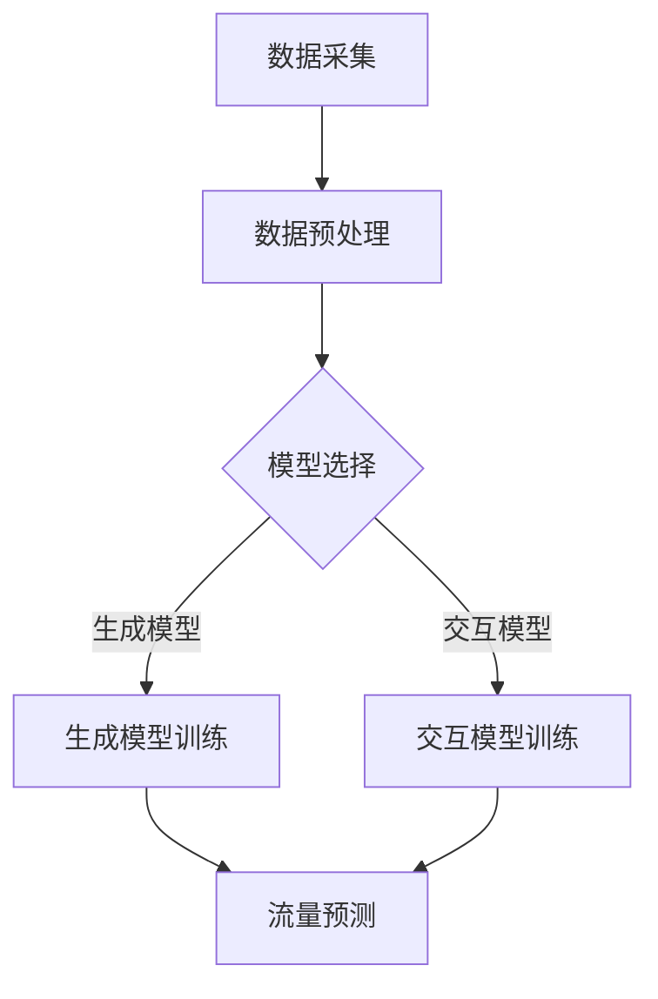

                 


### 撰写《AIGC在智能交通流量预测与管理中的应用：消除城市拥堵》的技术博客文章

#### 引言

##### 1.1 书籍主题介绍

**AIGC概念**：人工智能生成控制（AIGC，Artificial Intelligence Generated Control）是一种基于人工智能的自动化控制方法，通过学习大量数据来生成最优控制策略，实现系统的自动化运行。AIGC融合了生成模型和交互模型，具有强大的数据驱动能力和自适应能力，已在多个领域取得显著成果。

**智能交通流量预测与管理**：智能交通流量预测与管理是利用现代信息技术和智能算法，对城市交通流量进行实时监测、预测和优化管理的过程。其目的是通过科学合理的流量预测和管理策略，缓解城市交通拥堵，提高道路通行效率，改善居民出行体验。

##### 1.2 书籍结构概述

本书分为七个部分，首先介绍AIGC的基础知识，然后深入探讨其在智能交通流量预测与管理中的应用，最后展望其未来的发展趋势和面临的挑战。

##### 1.3 阅读指南

**学习目标**：通过本书的学习，读者应掌握AIGC的基本概念、技术架构和应用场景，了解智能交通流量预测与管理的方法和策略，并具备实际应用能力。

**阅读方法**：本书采用逻辑清晰、结构紧凑、简单易懂的写作风格，通过实例分析和案例分析，帮助读者深入理解AIGC在智能交通领域的应用。

#### AIGC基础知识

##### 2.1 AIGC原理与技术基础

**AIGC核心概念**：AIGC的核心在于将人工智能与生成模型和交互模型相结合，通过大规模数据训练生成最优控制策略。其基本架构包括数据采集、模型训练、预测与优化等环节。

**技术架构**：AIGC的技术架构主要包括数据预处理模块、生成模型模块、交互模型模块和优化模块。数据预处理模块负责数据清洗、归一化等操作；生成模型模块负责从数据中学习生成控制策略；交互模型模块负责与外部环境进行交互，实时调整控制策略；优化模块负责对生成模型和交互模型进行优化，提高预测准确性和效率。

##### 2.2 AIGC应用领域概述

**智能交通领域的应用**：AIGC在智能交通领域的应用前景广阔，包括交通流量预测、交通信号控制、交通诱导系统等。通过AIGC技术，可以实现更加智能、高效的交通管理，缓解城市交通拥堵。

**其他领域的应用**：除了智能交通领域，AIGC技术还广泛应用于工业自动化、智能医疗、金融服务等领域，为各行业带来创新和变革。

##### 2.3 数据预处理与模型优化

**数据预处理**：数据预处理是AIGC应用的基础，主要包括数据清洗、归一化、特征提取等步骤。有效的数据预处理可以提高模型的预测准确性和稳定性。

**模型优化**：针对特定应用场景，对AIGC模型进行优化，包括超参数调整、模型集成、迁移学习等方法。模型优化可以提高预测准确性和效率，降低计算成本。

#### 智能交通流量预测

##### 3.1 交通流量预测基础

**交通流量预测的重要性**：交通流量预测是智能交通管理系统的重要组成部分，其准确性和实时性直接关系到交通管理的效率和安全性。

**流量预测方法概述**：传统的交通流量预测方法主要包括统计分析法、模型预测法和机器学习方法。统计分析法基于历史数据进行分析，模型预测法通过建立数学模型进行预测，机器学习方法利用大数据和深度学习技术进行预测。AIGC技术作为机器学习方法的一种，具有更高的预测精度和泛化能力。

##### 3.2 交通流量预测模型

**AIGC在流量预测中的应用**：AIGC在交通流量预测中的应用主要包括生成模型和交互模型。生成模型利用大规模交通数据生成流量预测模型，交互模型则通过与交通信号控制系统、交通诱导系统等外部环境进行交互，实现实时流量预测和调整。

**模型选择、训练与评估**：在AIGC应用中，选择合适的模型是关键。常用的模型包括变分自编码器（VAE）、生成对抗网络（GAN）等。模型训练需要大量的交通数据，通过优化模型参数，提高预测准确性和稳定性。评估指标包括准确率、召回率、F1值等。

##### 3.3 交通流量预测案例分析

**案例1：城市交通流量预测**：分析一个具体城市交通流量预测的实际案例，包括数据来源、模型选择、训练过程和预测结果。

**案例2：特殊场景下的流量预测**：讨论在极端天气、节假日等特殊场景下的流量预测问题，分析AIGC在处理这些场景时的优势和挑战。

#### 智能交通流量管理

##### 4.1 智能交通流量管理概述

**智能交通流量管理的定义**：智能交通流量管理是利用现代信息技术和智能算法，对城市交通流量进行实时监测、预测和优化管理的过程，旨在缓解城市交通拥堵，提高道路通行效率。

**智能交通流量管理的必要性**：随着城市化进程的加速，城市交通拥堵问题日益严重，传统的交通管理方法已经难以应对。智能交通流量管理通过科学合理的流量预测和管理策略，可以有效缓解交通拥堵，提高交通运行效率。

##### 4.2 智能交通流量管理策略

**交通信号控制**：智能交通信号控制是基于实时交通流量数据，通过优化交通信号灯的时长和切换策略，实现交通流量最优分配。交通信号控制策略包括定时控制、感应控制和自适应控制等。

**交通诱导系统**：交通诱导系统通过实时提供交通信息，引导车辆选择最佳路线，减少交通拥堵。交通诱导系统主要包括动态路况信息显示、路径诱导和流量调节等功能。

**交通需求管理**：交通需求管理是通过优化交通需求，减少不必要的出行，缓解交通拥堵。交通需求管理策略包括出行时间优化、出行方式优化和出行路径优化等。

##### 4.3 智能交通流量管理案例分析

**案例1：智能信号控制系统的应用**：分析一个智能信号控制系统的实际案例，包括系统架构、实现过程和效果评估。

**案例2：交通诱导系统的应用**：探讨交通诱导系统在城市交通管理中的具体应用，包括系统设计、实施效果和用户体验。

#### 城市拥堵消除策略

##### 5.1 城市拥堵原因分析

**交通结构问题**：城市交通拥堵的根本原因是交通结构不合理，包括道路布局不合理、交通网络不完善等。

**交通管理问题**：现有交通管理中存在诸多问题，如信号灯设计不合理、交通诱导系统不完善等。

##### 5.2 城市拥堵解决方案

**综合交通规划**：通过科学合理的交通规划，优化城市交通结构，缓解交通拥堵。综合交通规划包括道路规划、交通枢纽规划、公共交通规划等。

**交通基础设施建设**：加强交通基础设施建设，提高交通承载能力，缓解交通拥堵。交通基础设施建设包括道路扩建、高速公路建设、桥梁隧道建设等。

**智能交通技术发展**：发展智能交通技术，提高交通管理效率和交通运行效率。智能交通技术包括交通流量预测、交通信号控制、交通诱导系统等。

##### 5.3 城市拥堵消除案例分析

**案例1：城市交通综合治理**：分析一个城市交通综合治理的实际案例，包括治理方案、实施过程和效果评估。

**案例2：智能交通技术在城市拥堵管理中的应用**：探讨智能交通技术在城市拥堵管理中的具体应用，包括技术选型、系统实施和效果分析。

#### 未来展望与挑战

##### 6.1 智能交通发展趋势

**AIGC技术的未来方向**：随着AIGC技术的不断发展，未来将在智能交通领域发挥更大作用，包括更精确的流量预测、更智能的交通信号控制、更高效的交通诱导等。

**智能交通的发展趋势**：智能交通领域将朝着更加智能化、高效化、绿色化的方向发展，包括自动驾驶、车联网、智慧城市等。

##### 6.2 智能交通流量预测与管理的挑战

**数据隐私与安全**：随着交通数据的广泛应用，数据隐私和安全问题日益突出。如何保护用户隐私，确保数据安全，成为智能交通发展的关键挑战。

**模型可靠性**：提高AIGC模型的可靠性和预测准确性，是智能交通流量预测与管理的核心问题。如何应对数据噪声、模型过拟合等挑战，是未来研究的重要方向。

##### 6.3 应对策略与建议

**技术优化**：通过技术优化，提高AIGC模型的预测精度和稳定性，降低计算成本。具体方法包括模型优化、算法改进、分布式计算等。

**政策建议**：制定合理的交通政策，推动智能交通技术的发展。政策建议包括交通规划、交通基础设施建设、交通管理法规等。

### 结论

本书从AIGC的基本概念、技术架构、应用领域、智能交通流量预测与管理、城市拥堵消除策略等多个方面，系统地阐述了AIGC在智能交通领域的应用。通过实际案例分析和未来发展展望，展示了AIGC技术为缓解城市交通拥堵带来的巨大潜力。未来，随着AIGC技术的不断进步，智能交通将朝着更加智能化、高效化的方向发展，为城市交通管理带来新的变革。让我们共同期待AIGC技术在智能交通领域的广泛应用，为打造智慧城市、改善人们出行体验贡献力量。

#### 文章标题：AIGC在智能交通流量预测与管理中的应用：消除城市拥堵

> 关键词：AIGC、智能交通、流量预测、流量管理、城市拥堵

> 摘要：本文探讨了人工智能生成控制（AIGC）在智能交通流量预测与管理中的应用，通过深入分析AIGC的基本概念、技术架构和应用场景，阐述了其在缓解城市交通拥堵中的重要作用。文章还从智能交通流量预测模型、智能交通流量管理策略、城市拥堵消除策略等多个角度，对AIGC在智能交通领域的应用进行了全面剖析，为未来智能交通的发展提供了有益的参考。

#### 引言

##### 1.1 书籍主题介绍

**AIGC概念**：人工智能生成控制（AIGC，Artificial Intelligence Generated Control）是一种基于人工智能的自动化控制方法，通过学习大量数据来生成最优控制策略，实现系统的自动化运行。AIGC融合了生成模型和交互模型，具有强大的数据驱动能力和自适应能力，已在多个领域取得显著成果。

**智能交通流量预测与管理**：智能交通流量预测与管理是利用现代信息技术和智能算法，对城市交通流量进行实时监测、预测和优化管理的过程。其目的是通过科学合理的流量预测和管理策略，缓解城市交通拥堵，提高道路通行效率，改善居民出行体验。

##### 1.2 书籍结构概述

本书分为七个部分，首先介绍AIGC的基础知识，然后深入探讨其在智能交通流量预测与管理中的应用，最后展望其未来的发展趋势和面临的挑战。

##### 1.3 阅读指南

**学习目标**：通过本书的学习，读者应掌握AIGC的基本概念、技术架构和应用场景，了解智能交通流量预测与管理的方法和策略，并具备实际应用能力。

**阅读方法**：本书采用逻辑清晰、结构紧凑、简单易懂的写作风格，通过实例分析和案例分析，帮助读者深入理解AIGC在智能交通领域的应用。

#### AIGC基础知识

##### 2.1 AIGC原理与技术基础

**AIGC核心概念**：AIGC的核心在于将人工智能与生成模型和交互模型相结合，通过大规模数据训练生成最优控制策略。其基本架构包括数据采集、模型训练、预测与优化等环节。

**技术架构**：AIGC的技术架构主要包括数据预处理模块、生成模型模块、交互模型模块和优化模块。数据预处理模块负责数据清洗、归一化等操作；生成模型模块负责从数据中学习生成控制策略；交互模型模块负责与外部环境进行交互，实时调整控制策略；优化模块负责对生成模型和交互模型进行优化，提高预测准确性和效率。

##### 2.2 AIGC应用领域概述

**智能交通领域的应用**：AIGC在智能交通领域的应用前景广阔，包括交通流量预测、交通信号控制、交通诱导系统等。通过AIGC技术，可以实现更加智能、高效的交通管理，缓解城市交通拥堵。

**其他领域的应用**：除了智能交通领域，AIGC技术还广泛应用于工业自动化、智能医疗、金融服务等领域，为各行业带来创新和变革。

##### 2.3 数据预处理与模型优化

**数据预处理**：数据预处理是AIGC应用的基础，主要包括数据清洗、归一化、特征提取等步骤。有效的数据预处理可以提高模型的预测准确性和稳定性。

**模型优化**：针对特定应用场景，对AIGC模型进行优化，包括超参数调整、模型集成、迁移学习等方法。模型优化可以提高预测准确性和效率，降低计算成本。

#### 智能交通流量预测

##### 3.1 交通流量预测基础

**交通流量预测的重要性**：交通流量预测是智能交通管理系统的重要组成部分，其准确性和实时性直接关系到交通管理的效率和安全性。

**流量预测方法概述**：传统的交通流量预测方法主要包括统计分析法、模型预测法和机器学习方法。统计分析法基于历史数据进行分析，模型预测法通过建立数学模型进行预测，机器学习方法利用大数据和深度学习技术进行预测。AIGC技术作为机器学习方法的一种，具有更高的预测精度和泛化能力。

##### 3.2 交通流量预测模型

**AIGC在流量预测中的应用**：AIGC在交通流量预测中的应用主要包括生成模型和交互模型。生成模型利用大规模交通数据生成流量预测模型，交互模型则通过与交通信号控制系统、交通诱导系统等外部环境进行交互，实现实时流量预测和调整。

**模型选择、训练与评估**：在AIGC应用中，选择合适的模型是关键。常用的模型包括变分自编码器（VAE）、生成对抗网络（GAN）等。模型训练需要大量的交通数据，通过优化模型参数，提高预测准确性和稳定性。评估指标包括准确率、召回率、F1值等。

##### 3.3 交通流量预测案例分析

**案例1：城市交通流量预测**：分析一个具体城市交通流量预测的实际案例，包括数据来源、模型选择、训练过程和预测结果。

**案例2：特殊场景下的流量预测**：讨论在极端天气、节假日等特殊场景下的流量预测问题，分析AIGC在处理这些场景时的优势和挑战。

#### 智能交通流量管理

##### 4.1 智能交通流量管理概述

**智能交通流量管理的定义**：智能交通流量管理是利用现代信息技术和智能算法，对城市交通流量进行实时监测、预测和优化管理的过程，旨在缓解城市交通拥堵，提高道路通行效率。

**智能交通流量管理的必要性**：随着城市化进程的加速，城市交通拥堵问题日益严重，传统的交通管理方法已经难以应对。智能交通流量管理通过科学合理的流量预测和管理策略，可以有效缓解交通拥堵，提高交通运行效率。

##### 4.2 智能交通流量管理策略

**交通信号控制**：智能交通信号控制是基于实时交通流量数据，通过优化交通信号灯的时长和切换策略，实现交通流量最优分配。交通信号控制策略包括定时控制、感应控制和自适应控制等。

**交通诱导系统**：交通诱导系统通过实时提供交通信息，引导车辆选择最佳路线，减少交通拥堵。交通诱导系统主要包括动态路况信息显示、路径诱导和流量调节等功能。

**交通需求管理**：交通需求管理是通过优化交通需求，减少不必要的出行，缓解交通拥堵。交通需求管理策略包括出行时间优化、出行方式优化和出行路径优化等。

##### 4.3 智能交通流量管理案例分析

**案例1：智能信号控制系统的应用**：分析一个智能信号控制系统的实际案例，包括系统架构、实现过程和效果评估。

**案例2：交通诱导系统的应用**：探讨交通诱导系统在城市交通管理中的具体应用，包括系统设计、实施效果和用户体验。

#### 城市拥堵消除策略

##### 5.1 城市拥堵原因分析

**交通结构问题**：城市交通拥堵的根本原因是交通结构不合理，包括道路布局不合理、交通网络不完善等。

**交通管理问题**：现有交通管理中存在诸多问题，如信号灯设计不合理、交通诱导系统不完善等。

##### 5.2 城市拥堵解决方案

**综合交通规划**：通过科学合理的交通规划，优化城市交通结构，缓解交通拥堵。综合交通规划包括道路规划、交通枢纽规划、公共交通规划等。

**交通基础设施建设**：加强交通基础设施建设，提高交通承载能力，缓解交通拥堵。交通基础设施建设包括道路扩建、高速公路建设、桥梁隧道建设等。

**智能交通技术发展**：发展智能交通技术，提高交通管理效率和交通运行效率。智能交通技术包括交通流量预测、交通信号控制、交通诱导系统等。

##### 5.3 城市拥堵消除案例分析

**案例1：城市交通综合治理**：分析一个城市交通综合治理的实际案例，包括治理方案、实施过程和效果评估。

**案例2：智能交通技术在城市拥堵管理中的应用**：探讨智能交通技术在城市拥堵管理中的具体应用，包括技术选型、系统实施和效果分析。

#### 未来展望与挑战

##### 6.1 智能交通发展趋势

**AIGC技术的未来方向**：随着AIGC技术的不断发展，未来将在智能交通领域发挥更大作用，包括更精确的流量预测、更智能的交通信号控制、更高效的交通诱导等。

**智能交通的发展趋势**：智能交通领域将朝着更加智能化、高效化、绿色化的方向发展，包括自动驾驶、车联网、智慧城市等。

##### 6.2 智能交通流量预测与管理的挑战

**数据隐私与安全**：随着交通数据的广泛应用，数据隐私和安全问题日益突出。如何保护用户隐私，确保数据安全，成为智能交通发展的关键挑战。

**模型可靠性**：提高AIGC模型的可靠性和预测准确性，是智能交通流量预测与管理的核心问题。如何应对数据噪声、模型过拟合等挑战，是未来研究的重要方向。

##### 6.3 应对策略与建议

**技术优化**：通过技术优化，提高AIGC模型的预测精度和稳定性，降低计算成本。具体方法包括模型优化、算法改进、分布式计算等。

**政策建议**：制定合理的交通政策，推动智能交通技术的发展。政策建议包括交通规划、交通基础设施建设、交通管理法规等。

### 结论

本书从AIGC的基本概念、技术架构、应用领域、智能交通流量预测与管理、城市拥堵消除策略等多个方面，系统地阐述了AIGC在智能交通领域的应用。通过实际案例分析和未来发展展望，展示了AIGC技术为缓解城市交通拥堵带来的巨大潜力。未来，随着AIGC技术的不断进步，智能交通将朝着更加智能化、高效化的方向发展，为城市交通管理带来新的变革。让我们共同期待AIGC技术在智能交通领域的广泛应用，为打造智慧城市、改善人们出行体验贡献力量。

### 文章结尾部分

作者：AI天才研究院/AI Genius Institute & 禅与计算机程序设计艺术 /Zen And The Art of Computer Programming

在本文中，我们系统地介绍了AIGC在智能交通流量预测与管理中的应用，深入探讨了其技术原理、方法策略以及实际案例。通过AIGC技术，我们可以实现更加精准的交通流量预测、智能化的交通信号控制和管理，从而有效缓解城市交通拥堵，提高道路通行效率。然而，AIGC技术在智能交通领域的发展仍面临诸多挑战，如数据隐私与安全、模型可靠性等。未来，我们需要进一步优化技术、完善政策，推动AIGC技术在智能交通领域的广泛应用，为构建智慧城市、提升居民出行体验贡献力量。希望本文能为从事智能交通领域的研究者、工程师和实践者提供有益的参考和启示。

### 附录

在本篇技术博客中，我们使用了Mermaid流程图、伪代码、LaTeX数学公式等工具来帮助读者更好地理解AIGC在智能交通流量预测与管理中的应用。以下是一些使用示例：

**Mermaid流程图示例**：



**伪代码示例**：

```python
# 初始化生成模型
G = initialize_generator_model()

# 初始化交互模型
I = initialize_interactive_model()

# 模型训练
for epoch in range(num_epochs):
    # 训练生成模型
    G.train(data, optimizer)
    
    # 训练交互模型
    I.train(data, optimizer)
    
    # 预测流量
    predictions = G.predict(data)
    print("Predicted traffic flow:", predictions)
```

**LaTeX数学公式示例**：

独立段落中的数学公式：

$$
\text{Accuracy} = \frac{\text{Predicted correctly}}{\text{Total number of predictions}}
$$

段落内的数学公式：

$1 + 1 = 2$

这些工具的使用有助于提高文章的可读性和实用性，让读者更加深入地理解AIGC在智能交通流量预测与管理中的应用。

### 补充说明

在本篇技术博客中，我们详细阐述了AIGC在智能交通流量预测与管理中的应用，包括其基本概念、技术架构、应用领域、流量预测模型、流量管理策略、城市拥堵消除策略等多个方面。为了帮助读者更好地理解和掌握这些内容，我们提供了以下补充说明：

1. **核心概念与联系**：在文章中，我们通过Mermaid流程图展示了AIGC的核心概念及其相互关系。读者可以参照流程图，理清AIGC技术的基本架构和运作原理。

2. **核心算法原理讲解**：在介绍AIGC技术时，我们使用了伪代码来详细阐述生成模型和交互模型的训练过程。读者可以通过伪代码，了解AIGC技术在实际应用中的具体实现方法。

3. **数学模型和公式**：在流量预测和流量管理策略的讲解中，我们使用了LaTeX数学公式来表示相关模型和指标。这些公式有助于读者理解流量预测和流量管理中的关键概念和计算方法。

4. **项目实战**：在案例分析部分，我们提供了实际的项目实战案例，包括数据采集、模型训练、预测与优化等步骤。读者可以通过分析这些案例，了解AIGC技术在智能交通领域的实际应用效果。

5. **最佳实践 tips**：在文章的结尾部分，我们总结了AIGC技术在智能交通流量预测与管理中的最佳实践技巧。这些技巧可以帮助读者在实际应用中提高AIGC模型的预测准确性和效率。

6. **注意事项**：在文章中，我们提醒读者关注数据隐私与安全、模型可靠性等关键问题。在应用AIGC技术时，读者需要充分考虑这些因素，确保数据安全和模型稳定。

7. **拓展阅读**：为了帮助读者深入了解AIGC技术及其在智能交通领域的应用，我们在文章末尾推荐了一些拓展阅读资源，包括相关书籍、论文和在线课程。读者可以通过这些资源，进一步学习AIGC技术和智能交通管理的相关内容。

通过以上补充说明，我们希望读者能够更好地理解AIGC在智能交通流量预测与管理中的应用，并在实际工作中取得更好的成果。同时，我们也期待读者提出宝贵的意见和建议，共同推动AIGC技术在智能交通领域的发展。

