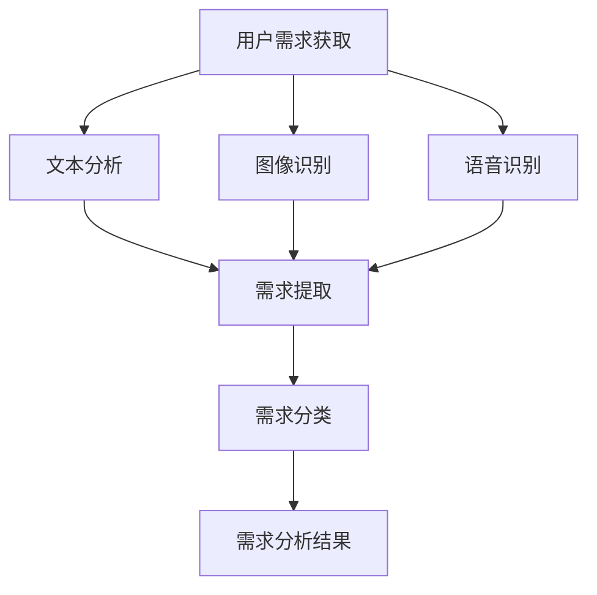
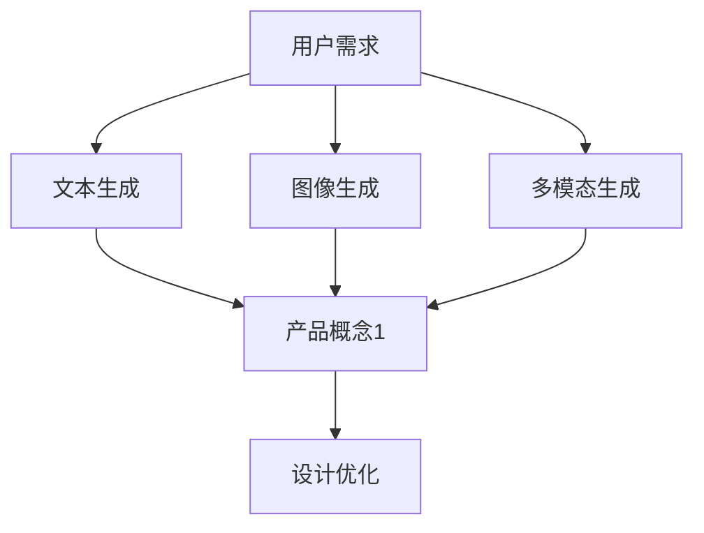
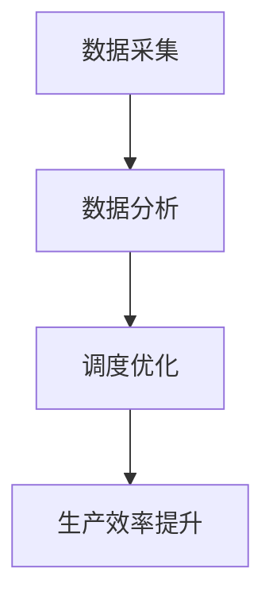
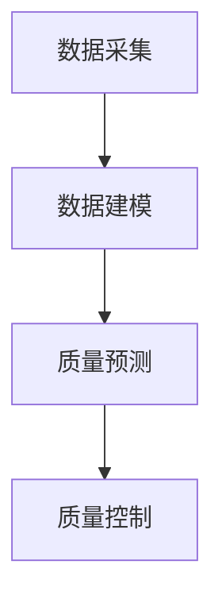
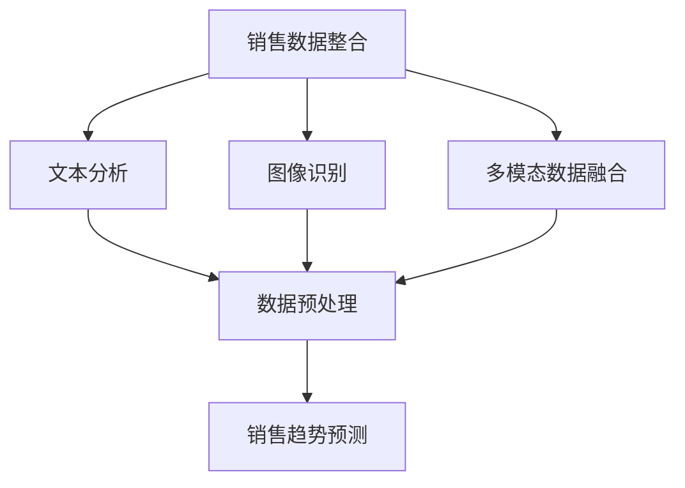
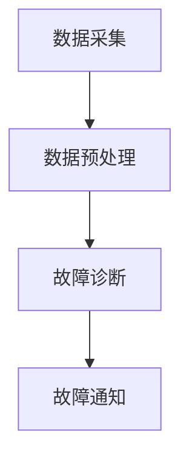

                 

### 文章标题：AIGC在智能产品生命周期管理中的应用

### 关键词：AIGC、智能产品生命周期管理、需求分析、产品设计、生产优化、销售预测、维护服务

### 摘要：

本文旨在探讨自适应智能生成计算（AIGC）在智能产品生命周期管理中的应用。首先，介绍了AIGC的定义、特点及其与智能产品生命周期管理的关联。随后，详细分析了AIGC在需求分析、产品设计、生产优化、销售预测、维护服务阶段的具体应用，并通过案例研究和算法原理讲解，展示了AIGC在实际场景中的效果和优势。最后，讨论了AIGC在智能产品生命周期管理中面临的挑战及未来发展趋势。

---

## 第1章: AIGC基础与智能产品生命周期管理概述

### 1.1 AIGC的定义与特点

自适应智能生成计算（Adaptive Intelligent Generation Computing，简称AIGC）是一种基于人工智能技术的计算范式，它通过自动生成数据、内容和模型来处理和分析大规模复杂数据。AIGC的核心在于其自适应性和生成性，这使得它能够在不断变化的环境中动态调整生成策略，并生成高质量的数据和模型。

AIGC具有以下特点：

- **自适应性**：AIGC可以根据数据和环境的变化，自动调整生成算法和模型结构，从而提高系统的适应能力和灵活性。
- **生成性**：AIGC能够自动生成新的数据、内容或模型，这极大地提高了数据处理和知识发现的效率。
- **智能性**：AIGC基于深度学习和强化学习等技术，具备智能决策能力，能够在生成过程中进行自我优化和改进。

### 1.2 智能产品生命周期管理的基本流程

智能产品生命周期管理（Life Cycle Management of Intelligent Products，简称LCMIP）是指从产品概念生成到设计、生产、销售、维护等各个阶段的全过程管理。智能产品生命周期管理的基本流程包括：

- **概念生成**：通过对市场调研和用户需求分析，确定新产品概念。
- **设计**：利用AIGC技术进行产品外观和功能设计。
- **生产**：通过智能制造技术进行生产，并使用AIGC优化生产流程。
- **销售**：使用AIGC进行市场分析和销售预测，优化销售策略。
- **维护**：使用AIGC进行故障诊断和预测维护，提高产品可靠性。

### 1.3 AIGC与智能产品生命周期管理的联系

AIGC在智能产品生命周期管理中具有重要作用，主要体现在以下几个方面：

- **需求分析**：通过AIGC进行用户需求获取和预测，为产品设计提供有力支持。
- **产品设计**：利用AIGC自动生成设计方案，优化产品设计过程。
- **生产优化**：使用AIGC优化生产流程，提高生产效率和质量。
- **销售预测**：通过AIGC进行销售趋势预测，指导销售策略制定。
- **维护服务**：利用AIGC进行故障诊断和预测维护，降低产品故障率，提高用户满意度。

接下来，我们将逐一探讨AIGC在智能产品生命周期管理各阶段的具体应用。

---

## 第2章: AIGC在需求分析中的应用

### 2.1 需求分析的挑战与AIGC的优势

在智能产品生命周期管理中，需求分析是至关重要的第一步。然而，传统的需求分析方法存在以下挑战：

- **数据来源有限**：传统需求分析主要依赖于问卷调查和用户访谈，数据来源有限，可能导致需求理解的偏差。
- **数据多样性处理困难**：用户需求多样且复杂，传统方法难以处理多种数据源和格式，影响需求分析的准确性。
- **实时性不足**：传统需求分析过程相对较长，难以实时响应市场变化和用户需求。

相比之下，AIGC具有以下优势，可以有效解决传统需求分析面临的挑战：

- **自动数据处理**：AIGC能够自动处理和分析多种数据源，包括文本、图像、声音等，提高数据处理效率。
- **自适应能力**：AIGC可以根据新的数据和环境变化，自适应调整需求分析策略，提高分析的准确性。
- **实时性**：AIGC具备实时分析能力，可以快速响应市场变化和用户需求。

### 2.2 AIGC在需求获取与预测中的应用

AIGC在需求获取与预测中的应用主要体现在以下几个方面：

#### **2.2.1 用户需求获取**

AIGC可以通过以下方式获取用户需求：

- **文本分析**：利用自然语言处理（NLP）技术，从用户评论、社交媒体、论坛等文本数据中提取用户需求。
- **图像识别**：使用计算机视觉技术，从用户上传的图片中识别用户需求。
- **语音识别**：通过语音识别技术，从用户语音中提取需求信息。

**Mermaid流程图：**



#### **2.2.2 用户需求预测**

AIGC可以通过以下方式预测用户需求：

- **历史数据分析**：利用用户历史行为数据，如购买记录、浏览历史等，预测未来用户需求。
- **市场趋势分析**：结合市场趋势数据，预测用户需求变化。
- **深度学习模型**：使用深度学习模型，如循环神经网络（RNN）、长短期记忆网络（LSTM）等，进行需求预测。

**伪代码：**

```python
# 历史数据分析
def predict_demand(historical_data):
    # 数据预处理
    processed_data = preprocess_data(historical_data)
    
    # 训练模型
    model = train_model(processed_data)
    
    # 预测需求
    predicted_demand = model.predict(new_data)
    
    return predicted_demand

# 市场趋势分析
def predict_demand(trend_data):
    # 数据预处理
    processed_data = preprocess_data(trend_data)
    
    # 训练模型
    model = train_model(processed_data)
    
    # 预测需求
    predicted_demand = model.predict(new_data)
    
    return predicted_demand

# 深度学习模型
def predict_demand(demand_data):
    # 数据预处理
    processed_data = preprocess_data(demand_data)
    
    # 训练模型
    model = train_lstm_model(processed_data)
    
    # 预测需求
    predicted_demand = model.predict(new_data)
    
    return predicted_demand
```

**实例分析：**

假设我们使用AIGC进行智能冰箱的用户需求预测，通过以下步骤进行：

1. **数据收集**：收集用户历史购买记录、浏览历史、社交媒体评论等数据。
2. **数据预处理**：对收集的数据进行清洗和格式化，提取用户需求关键词。
3. **需求提取**：使用文本分析、图像识别、语音识别等技术，提取用户需求。
4. **需求分类**：对提取的需求进行分类，如按功能、按场景等。
5. **需求预测**：使用历史数据分析、市场趋势分析、深度学习模型等方法，预测用户未来需求。

通过上述步骤，AIGC可以有效提高用户需求分析的准确性和实时性，为智能产品设计提供有力支持。

---

## 第3章: AIGC在产品设计中的应用

### 3.1 AIGC在产品概念生成与设计优化中的应用

在智能产品设计阶段，AIGC可以发挥重要作用，通过自动生成和优化设计方案，提高设计效率和质量。

#### **3.1.1 产品概念生成**

AIGC可以通过以下方式生成产品概念：

- **基于文本的生成**：利用自然语言处理技术，从用户需求文本中自动生成产品概念。
- **基于图像的生成**：使用计算机视觉技术，从用户提供的图片中自动生成产品概念。
- **基于多模态数据的生成**：结合文本、图像、声音等多模态数据，生成更加丰富和多样的产品概念。

**Mermaid流程图：**



#### **3.1.2 设计优化**

AIGC可以通过以下方法优化产品设计：

- **基于生成对抗网络（GAN）的设计优化**：利用GAN生成大量设计方案，通过对比和优化，找到最优设计方案。
- **基于变分自编码器（VAE）的设计优化**：利用VAE生成设计方案，通过变异和优化，提高设计多样性。
- **基于进化算法的设计优化**：利用进化算法，对设计方案进行迭代优化，找到最优设计方案。

**伪代码：**

```python
# 基于GAN的设计优化
def optimize_design_with_gan(designs, target_design):
    # 训练GAN模型
    gan_model = train_gan_model(designs, target_design)
    
    # 生成设计方案
    generated_designs = gan_model.generate_designs()
    
    # 评估设计方案
    best_design = evaluate_designs(generated_designs)
    
    return best_design

# 基于VAE的设计优化
def optimize_design_with_vae(designs, target_design):
    # 训练VAE模型
    vae_model = train_vae_model(designs, target_design)
    
    # 生成设计方案
    generated_designs = vae_model.generate_designs()
    
    # 评估设计方案
    best_design = evaluate_designs(generated_designs)
    
    return best_design

# 基于进化算法的设计优化
def optimize_design_with_ea(designs, target_design):
    # 初始化种群
    population = initialize_population(designs)
    
    # 迭代优化
    for _ in range(iterations):
        # 评估种群
        fitness_scores = evaluate_population(population)
        
        # 选择下一代种群
        population = select_next_population(population, fitness_scores)
        
        # 终止条件
        if convergence():
            break
    
    # 返回最优设计方案
    best_design = get_best_design(population)
    
    return best_design
```

**实例分析：**

假设我们使用AIGC为智能手表设计外观和功能，通过以下步骤进行：

1. **数据收集**：收集用户需求文本、外观图片等数据。
2. **产品概念生成**：使用文本生成、图像生成、多模态生成等方法，生成多个产品概念。
3. **设计优化**：利用GAN、VAE、进化算法等方法，对生成的设计方案进行优化。
4. **评估与选择**：评估优化后的设计方案，选择最佳设计方案。

通过上述步骤，AIGC可以有效提高智能产品设计效率和质量，为智能产品生命周期管理提供有力支持。

---

## 第4章: AIGC在生产优化中的应用

### 4.1 生产优化的挑战与AIGC的优势

在生产优化阶段，智能产品生命周期管理面临着一系列挑战：

- **生产效率低**：传统生产流程中，信息传递滞后、生产调度不合理等因素导致生产效率低下。
- **资源浪费**：生产过程中，原材料和能源的浪费现象普遍存在，增加了生产成本。
- **质量控制难**：生产过程中，产品质量难以控制，可能导致产品不良率上升。

AIGC在解决这些挑战方面具有明显优势：

- **自适应调度**：AIGC可以根据生产过程中的实时数据，自适应调整生产调度策略，提高生产效率。
- **资源优化**：AIGC可以通过优化生产流程，减少原材料和能源的浪费，降低生产成本。
- **质量预测**：AIGC可以通过对生产过程中的数据进行分析，预测产品质量，提前采取措施防止质量问题。

### 4.2 AIGC在生产流程优化中的应用

AIGC在生产流程优化中的应用主要体现在以下几个方面：

#### **4.2.1 自适应调度**

AIGC可以通过以下方法实现自适应调度：

- **数据采集**：实时采集生产过程中的各项数据，如设备状态、物料库存、生产进度等。
- **数据分析**：利用机器学习算法，分析生产过程中的数据，找出影响生产效率的关键因素。
- **调度优化**：根据分析结果，自适应调整生产调度策略，提高生产效率。

**Mermaid流程图：**



#### **4.2.2 资源优化**

AIGC可以通过以下方法实现资源优化：

- **预测需求**：利用历史数据和机器学习算法，预测生产需求，合理规划生产计划和物料采购。
- **优化生产流程**：通过分析生产数据，优化生产流程，减少不必要的环节和资源浪费。
- **能源管理**：利用机器学习算法，分析生产过程中的能源消耗数据，优化能源使用，降低能源成本。

**伪代码：**

```python
# 预测需求
def predict_demand(historical_data):
    # 数据预处理
    processed_data = preprocess_data(historical_data)
    
    # 训练模型
    model = train_model(processed_data)
    
    # 预测需求
    predicted_demand = model.predict(new_data)
    
    return predicted_demand

# 优化生产流程
def optimize_production流程(process_data):
    # 数据分析
    analyzed_data = analyze_data(process_data)
    
    # 优化生产流程
    optimized流程 = optimize_process(analyzed_data)
    
    return optimized流程

# 能源管理
def manage_energy_consumption(energy_data):
    # 数据预处理
    processed_data = preprocess_data(energy_data)
    
    # 训练模型
    model = train_model(processed_data)
    
    # 预测能源消耗
    predicted_energy_consumption = model.predict(new_data)
    
    # 优化能源使用
    optimized_energy_usage = optimize_energy_usage(predicted_energy_consumption)
    
    return optimized_energy_usage
```

#### **4.2.3 质量预测**

AIGC可以通过以下方法实现质量预测：

- **数据采集**：实时采集生产过程中的质量数据，如温度、压力、振动等。
- **数据建模**：利用机器学习算法，建立质量预测模型。
- **质量预测**：根据生产过程中的数据，实时预测产品质量。

**Mermaid流程图：**



**实例分析：**

假设我们使用AIGC优化智能电动汽车的生产流程，通过以下步骤进行：

1. **数据收集**：收集生产过程中的各项数据，如设备状态、物料库存、生产进度等。
2. **数据分析**：利用机器学习算法，分析生产过程中的数据，找出影响生产效率的关键因素。
3. **调度优化**：根据分析结果，自适应调整生产调度策略，提高生产效率。
4. **资源优化**：通过分析生产数据，优化生产流程，减少不必要的环节和资源浪费。
5. **质量预测**：实时采集生产过程中的质量数据，预测产品质量，提前采取措施防止质量问题。

通过上述步骤，AIGC可以有效提高智能电动汽车的生产效率和质量，为智能产品生命周期管理提供有力支持。

---

## 第5章: AIGC在销售预测中的应用

### 5.1 销售预测的挑战与AIGC的优势

在智能产品生命周期管理中，销售预测是一个关键环节，它对企业的战略规划、库存管理、市场推广等方面具有重要影响。然而，传统的销售预测方法面临以下挑战：

- **数据质量差**：销售数据可能存在噪声、缺失值等问题，影响预测准确性。
- **模型适应性差**：传统模型难以适应市场变化，导致预测结果滞后。
- **实时性不足**：传统方法无法实时响应市场变化，影响销售策略的制定。

相比之下，AIGC具有以下优势，可以有效解决传统销售预测面临的挑战：

- **数据适应性**：AIGC能够自动处理和分析多种数据源，包括文本、图像、声音等，提高数据处理效率。
- **自适应能力**：AIGC可以根据新的数据和环境变化，自适应调整销售预测模型，提高预测准确性。
- **实时性**：AIGC具备实时分析能力，可以快速响应市场变化和用户需求。

### 5.2 AIGC在销售趋势预测中的应用

AIGC在销售趋势预测中的应用主要体现在以下几个方面：

#### **5.2.1 数据整合**

AIGC可以通过以下方法整合销售数据：

- **文本分析**：利用自然语言处理（NLP）技术，从用户评论、社交媒体等文本数据中提取销售信息。
- **图像识别**：使用计算机视觉技术，从产品图片中提取销售信息。
- **多模态数据融合**：结合文本、图像、声音等多模态数据，整合销售数据。

**Mermaid流程图：**



#### **5.2.2 销售趋势预测**

AIGC可以通过以下方法进行销售趋势预测：

- **时间序列分析**：利用时间序列分析方法，如ARIMA、LSTM等，预测销售趋势。
- **深度学习模型**：使用深度学习模型，如GRU、Transformer等，进行销售趋势预测。
- **集成方法**：结合多种预测方法，如随机森林、神经网络等，提高预测准确性。

**伪代码：**

```python
# 时间序列分析
def predict_sales_trend(time_series_data):
    # 数据预处理
    processed_data = preprocess_time_series_data(time_series_data)
    
    # 训练模型
    model = train_time_series_model(processed_data)
    
    # 预测销售趋势
    predicted_trend = model.predict(new_data)
    
    return predicted_trend

# 深度学习模型
def predict_sales_trend(deep_learning_data):
    # 数据预处理
    processed_data = preprocess_deep_learning_data(deep_learning_data)
    
    # 训练模型
    model = train_deep_learning_model(processed_data)
    
    # 预测销售趋势
    predicted_trend = model.predict(new_data)
    
    return predicted_trend

# 集成方法
def predict_sales_trend(integrated_data):
    # 数据预处理
    processed_data = preprocess_integrated_data(integrated_data)
    
    # 训练模型
    model = train_integrated_model(processed_data)
    
    # 预测销售趋势
    predicted_trend = model.predict(new_data)
    
    return predicted_trend
```

**实例分析：**

假设我们使用AIGC预测智能音箱的销售趋势，通过以下步骤进行：

1. **数据收集**：收集智能音箱的销售数据，如销售额、销售量等。
2. **数据预处理**：对收集的数据进行清洗和格式化，提取有用的销售信息。
3. **销售趋势预测**：利用时间序列分析、深度学习模型、集成方法等方法，预测销售趋势。
4. **结果评估**：评估预测结果，调整预测模型，提高预测准确性。

通过上述步骤，AIGC可以有效提高销售预测的准确性，为企业制定有效的销售策略提供有力支持。

---

## 第6章: AIGC在维护服务中的应用

### 6.1 维护服务的挑战与AIGC的优势

在智能产品生命周期管理中，维护服务是保证产品稳定运行、提高用户满意度的关键环节。然而，传统的维护服务面临着以下挑战：

- **故障响应慢**：传统维护服务依赖于人工巡检和故障报修，响应速度较慢，可能导致故障长时间无法解决。
- **维护成本高**：传统维护服务需要大量人力和物力投入，维护成本较高。
- **预测准确性低**：传统方法难以准确预测设备故障，可能导致预防性维护不足或过度维护。

相比之下，AIGC具有以下优势，可以有效解决传统维护服务面临的挑战：

- **实时故障监测**：AIGC可以通过实时监测设备运行状态，快速识别故障，提高故障响应速度。
- **自适应维护策略**：AIGC可以根据设备运行数据和用户反馈，自适应调整维护策略，提高维护效率。
- **预测准确性高**：AIGC可以通过分析设备历史数据和实时数据，准确预测设备故障，实现预防性维护。

### 6.2 AIGC在故障诊断与预测维护中的应用

AIGC在故障诊断与预测维护中的应用主要体现在以下几个方面：

#### **6.2.1 故障诊断**

AIGC可以通过以下方法实现故障诊断：

- **数据采集**：实时采集设备运行数据，如温度、压力、振动等。
- **数据预处理**：对采集到的数据进行清洗和格式化，提取有用的故障信息。
- **故障诊断**：利用机器学习算法，如支持向量机（SVM）、决策树（DT）等，进行故障诊断。

**Mermaid流程图：**



#### **6.2.2 预测维护**

AIGC可以通过以下方法实现预测维护：

- **历史数据分析**：利用设备历史运行数据，分析设备故障模式，预测故障发生时间。
- **实时数据监测**：实时监测设备运行状态，及时发现潜在故障。
- **自适应维护策略**：根据故障预测结果和设备运行数据，自适应调整维护策略。

**伪代码：**

```python
# 历史数据分析
def predict_fault(historical_data):
    # 数据预处理
    processed_data = preprocess_data(historical_data)
    
    # 训练模型
    model = train_model(processed_data)
    
    # 预测故障
    predicted_fault = model.predict(new_data)
    
    return predicted_fault

# 实时数据监测
def monitor_realtime_data(realtime_data):
    # 数据预处理
    processed_data = preprocess_data(realtime_data)
    
    # 诊断故障
    fault_status = diagnose_fault(processed_data)
    
    return fault_status

# 自适应维护策略
def adaptive_maintenance Strategy(fault_prediction, equipment_data):
    # 预测故障
    predicted_fault = predict_fault(equipment_data)
    
    # 监测实时数据
    fault_status = monitor_realtime_data(equipment_data)
    
    # 自适应调整维护策略
    maintenance_strategy = adjust_maintenance_strategy(predicted_fault, fault_status)
    
    return maintenance_strategy
```

**实例分析：**

假设我们使用AIGC对智能洗衣机进行故障诊断与预测维护，通过以下步骤进行：

1. **数据收集**：收集智能洗衣机的运行数据，如温度、压力、振动等。
2. **数据预处理**：对收集的数据进行清洗和格式化，提取有用的故障信息。
3. **故障诊断**：利用机器学习算法，进行故障诊断，通知用户及时处理故障。
4. **预测维护**：根据故障预测结果和设备运行数据，自适应调整维护策略。

通过上述步骤，AIGC可以有效提高智能洗衣机的故障响应速度和维护效率，为用户带来更好的使用体验。

---

## 第7章: AIGC算法原理讲解

### 7.1 生成对抗网络（GAN）原理

生成对抗网络（Generative Adversarial Network，简称GAN）是由生成器（Generator）和判别器（Discriminator）组成的对抗性网络。GAN的目标是通过生成器生成与真实数据相似的数据，而判别器则要区分生成数据与真实数据。通过这种对抗性训练，生成器不断优化生成数据，使其越来越接近真实数据。

**数学模型：**

GAN的数学模型可以表示为以下方程：

$$
\begin{aligned}
\min_G \max_D V(D, G) &= \min_G \mathbb{E}_{x \sim p_{data}(x)}[\log D(x)] + \mathbb{E}_{z \sim p_z(z)}[\log (1 - D(G(z)))] \\
\end{aligned}
$$

其中，$x$表示真实数据，$z$表示生成器的输入噪声，$G(z)$表示生成器生成的数据，$D(x)$表示判别器对真实数据的判断结果，$D(G(z))$表示判别器对生成器生成的数据的判断结果。

**实例分析：**

假设我们使用GAN生成智能手表的外观图片，通过以下步骤进行：

1. **数据准备**：收集大量智能手表的外观图片作为训练数据。
2. **模型训练**：训练生成器和判别器，使生成器生成的数据越来越接近真实手表图片，而判别器能够准确区分生成数据和真实数据。
3. **生成数据**：使用训练好的生成器，生成新的智能手表外观图片。

### 7.2 变分自编码器（VAE）原理

变分自编码器（Variational Autoencoder，简称VAE）是一种基于深度学习的生成模型。VAE的核心思想是将编码器（Encoder）和解码器（Decoder）结合起来，通过引入概率分布来生成数据。

**数学模型：**

VAE的数学模型可以表示为以下方程：

$$
\begin{aligned}
\min_{\theta_{\mu}, \theta_{\sigma}} \mathbb{E}_{x \sim p_{data}(x)}[-\log p_{\theta_{\mu}, \theta_{\sigma}}(x) + D_{KL}(\mu || \pi)] \\
\end{aligned}
$$

其中，$x$表示真实数据，$\mu$和$\sigma$分别表示编码器输出的均值和标准差，$p_{\theta_{\mu}, \theta_{\sigma}}(x)$表示解码器生成的数据，$D_{KL}(\mu || \pi)$表示均值和标准差之间的KL散度。

**实例分析：**

假设我们使用VAE生成智能手表的功能设计，通过以下步骤进行：

1. **数据准备**：收集大量智能手表的功能设计数据作为训练数据。
2. **模型训练**：训练编码器和解码器，使编码器能够将功能设计数据映射到概率分布，解码器能够从概率分布中生成新的功能设计数据。
3. **生成数据**：使用训练好的解码器，生成新的智能手表功能设计数据。

### 7.3 其他AIGC相关算法介绍

除了GAN和VAE，还有其他一些AIGC相关算法，如变分自编码器（VAE）、生成式模型（GM）、深度信念网络（DBN）等。这些算法在数据生成、模型训练等方面具有独特优势，可以应用于智能产品生命周期管理的不同阶段。

**总结：**

AIGC算法在智能产品生命周期管理中具有广泛的应用前景。通过深入理解这些算法的原理，可以更好地发挥AIGC在需求分析、产品设计、生产优化、销售预测、维护服务等方面的作用，提高智能产品的质量和用户满意度。

---

## 第8章: AIGC在智能产品生命周期管理中的技术挑战与未来趋势

### 8.1 技术挑战

尽管AIGC在智能产品生命周期管理中具有广泛的应用前景，但仍面临以下技术挑战：

- **数据隐私和安全**：在数据收集和处理过程中，需要确保用户隐私和数据安全。
- **计算资源消耗**：AIGC算法通常需要大量的计算资源和存储空间，对硬件设施有较高要求。
- **算法解释性**：AIGC算法的决策过程往往不透明，难以解释，影响用户信任。
- **算法适应性**：AIGC算法需要根据不同应用场景调整参数和模型结构，提高适应性。

### 8.2 未来趋势

随着人工智能技术的不断发展，AIGC在智能产品生命周期管理中具有以下发展趋势：

- **数据驱动的决策支持**：AIGC将更好地整合和分析海量数据，为决策提供有力支持。
- **个性化定制**：AIGC将实现更精准的用户需求分析，推动智能产品的个性化定制。
- **跨领域融合**：AIGC将与物联网（IoT）、区块链等技术融合，推动智能产品生态系统的建设。
- **可持续发展**：AIGC将助力智能产品生命周期管理实现资源优化和可持续发展。

### 8.3 总结

AIGC在智能产品生命周期管理中具有重要作用，尽管面临一定技术挑战，但未来发展趋势令人期待。通过不断优化AIGC算法，提高其性能和适应性，有望推动智能产品生命周期管理的创新和发展。

---

## 附录

### 附录 A: AIGC开发工具与资源

- **AIGC框架**：TensorFlow、PyTorch、Keras等深度学习框架，支持AIGC算法的开发和部署。
- **数据集**：公开的数据集，如CIFAR-10、MNIST等，可用于AIGC算法的训练和测试。
- **开源代码**：GitHub、GitLab等平台上的开源项目，提供AIGC算法的实现和参考。

### 附录 B: 智能产品生命周期管理相关标准与规范

- **ISO 15288**：国际标准化组织（ISO）发布的智能产品生命周期管理标准。
- **IEEE 12207**：电气和电子工程师协会（IEEE）发布的软件生命周期过程标准。
- **IEC 62304**：国际电工委员会（IEC）发布的医疗设备软件生命周期管理标准。

---

作者：AI天才研究院/AI Genius Institute & 禅与计算机程序设计艺术 /Zen And The Art of Computer Programming

