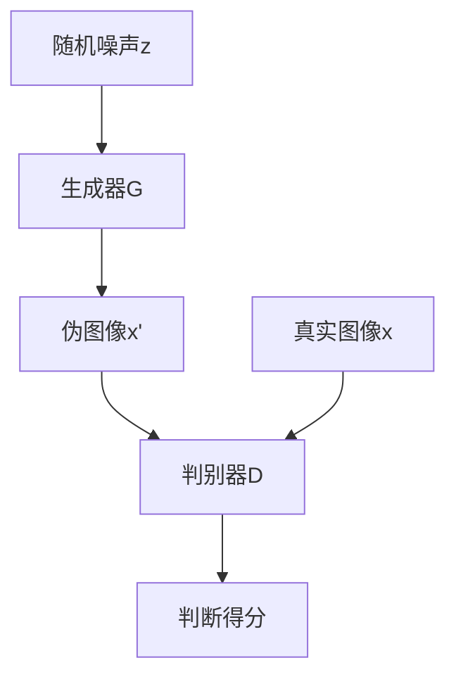
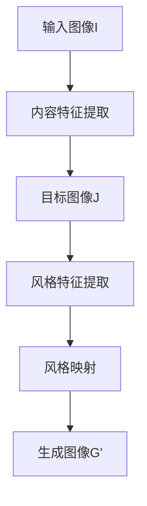
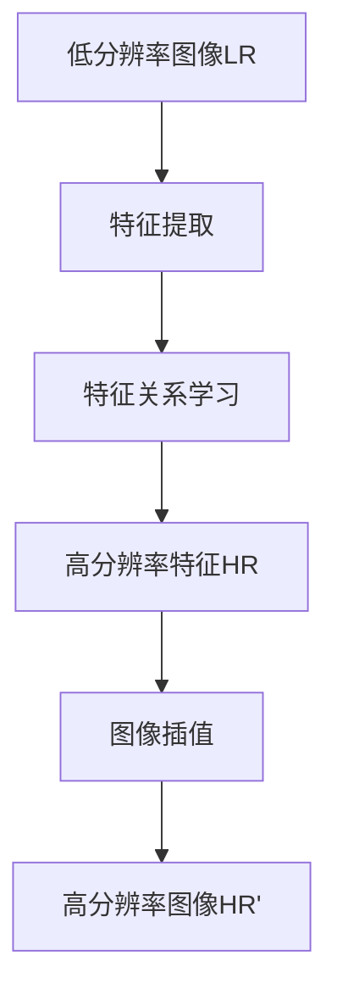
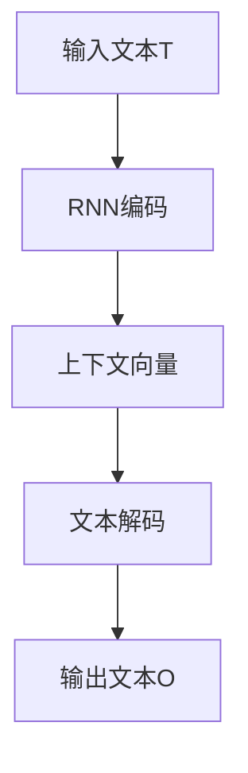
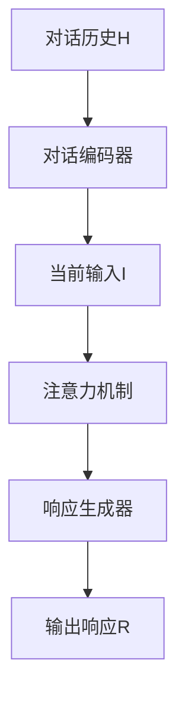

                 

## 文章标题

### AIGC在智能人才培养方案设计中的应用

关键词：AIGC，智能人才培养，生成对抗网络，自然语言处理，人才培养方案设计，算法原理

摘要：本文深入探讨了AIGC（自适应智能生成控制）在智能人才培养方案设计中的应用。通过详细阐述AIGC的基础概念、核心技术原理，以及其在教育领域的具体应用，本文为智能人才培养提供了全新的视角和策略。文章重点分析了AIGC技术如何通过个性化学习推荐、虚拟实训环境构建等手段，提高教育质量和效果，并提出了完整的人才培养方案设计原则与实施评估方法。最终，本文通过案例分析，总结了AIGC在智能人才培养中的最佳实践，为未来的教育创新提供了宝贵的参考。

## 引言

在当今快速发展的科技时代，人工智能（AI）已经成为推动社会进步的关键力量。尤其是AIGC（自适应智能生成控制）技术的崛起，为各个领域带来了深远的影响。AIGC作为AI的一个重要分支，不仅涵盖了生成对抗网络（GAN）、自然语言处理（NLP）等核心技术，还能够实现高度自动化的内容生成与优化。随着AIGC技术的不断成熟，其在教育领域的应用潜力也日益显现。

智能人才培养已经成为当前教育改革的重要目标。传统教育模式难以满足现代社会对多样化、个性化人才的需求，而AIGC技术的引入，为构建智能化、个性化的人才培养方案提供了新的路径。本文将围绕AIGC在智能人才培养方案设计中的应用，探讨其核心概念、技术原理、应用场景以及实施策略，旨在为教育工作者提供有益的参考和启示。

### AIGC概述

AIGC（自适应智能生成控制）是一种结合了人工智能（AI）与生成控制技术的先进方法，旨在实现自动化、智能化的内容生成与优化。AIGC的核心概念包括生成对抗网络（GAN）、自然语言处理（NLP）和深度学习等。这些技术协同工作，使AIGC能够在多个领域实现高度自动化的内容生成与优化，从而提高工作效率和质量。

#### AIGC的定义与背景

AIGC的定义可以概括为一种通过自适应算法和生成控制技术，实现自动化、智能化的内容生成与优化的方法。其基本原理来源于生成对抗网络（GAN）和自然语言处理（NLP）等前沿技术。GAN是一种由生成器和判别器组成的模型，通过相互对抗的方式实现内容生成；而NLP则专注于处理人类语言，实现文本的生成与理解。结合这两大技术，AIGC能够实现高度自动化、智能化的内容生成与优化。

AIGC的背景可以追溯到近年来人工智能领域的飞速发展。随着深度学习、生成对抗网络等技术的突破，AI在各个领域的应用逐渐成熟。尤其是生成对抗网络（GAN）在图像生成、文本生成等方面的卓越表现，为AIGC的诞生提供了技术基础。同时，自然语言处理（NLP）在语言生成、对话系统等方面的进展，也为AIGC提供了重要的支持。这些技术的融合，使得AIGC成为了一种具有广泛应用前景的智能技术。

#### AIGC的核心技术

AIGC的核心技术主要包括生成对抗网络（GAN）、自然语言处理（NLP）和深度学习等。以下是对这些技术的简要介绍：

1. **生成对抗网络（GAN）**：
   - **定义**：GAN是一种由生成器和判别器组成的模型，通过相互对抗的方式实现内容生成。
   - **原理**：生成器生成数据，判别器判断数据真实性。通过不断的对抗训练，生成器逐渐提高生成质量，判别器则不断增强辨别能力。
   - **应用**：GAN在图像生成、语音合成、视频生成等领域具有广泛应用。

2. **自然语言处理（NLP）**：
   - **定义**：NLP是研究如何使计算机理解和处理人类语言的技术。
   - **原理**：NLP通过文本分析、语义理解等技术，实现文本的生成与理解。
   - **应用**：NLP在对话系统、文本生成、情感分析等领域具有广泛应用。

3. **深度学习**：
   - **定义**：深度学习是一种基于多层神经网络的人工智能方法。
   - **原理**：通过训练大量数据，深度学习模型能够自动提取特征，实现分类、预测等任务。
   - **应用**：深度学习在图像识别、语音识别、自然语言处理等领域具有广泛应用。

#### AIGC的发展现状与趋势

AIGC作为一项新兴技术，近年来取得了显著的发展。目前，AIGC已在图像生成、文本生成、语音合成等领域取得了突破性成果，并在多个领域得到了广泛应用。

1. **发展现状**：
   - **图像生成**：AIGC在图像生成领域取得了显著进展，能够生成高质量、逼真的图像。例如，GAN技术在图像修复、超分辨率、风格迁移等方面表现优异。
   - **文本生成**：AIGC在文本生成领域也取得了重要突破，能够生成高质量、通顺的文本。例如，自然语言处理技术在文章写作、摘要生成、对话系统等方面得到了广泛应用。
   - **语音合成**：AIGC在语音合成领域取得了显著进展，能够实现自然、流畅的语音合成。例如，深度学习技术在语音识别、语音合成等方面得到了广泛应用。

2. **趋势**：
   - **多模态融合**：未来，AIGC将在多模态融合方面取得突破，实现图像、文本、语音等不同模态的自动化生成与优化。
   - **智能化与个性化**：随着AI技术的发展，AIGC将实现更高的智能化和个性化，为各个领域提供定制化的解决方案。
   - **应用拓展**：AIGC将在更多领域得到应用，如医疗、金融、教育等，为人类社会带来更多创新和价值。

### AIGC与智能人才培养

智能人才培养已经成为当今教育改革的重要目标。传统教育模式难以满足现代社会对多样化、个性化人才的需求，而AIGC技术的引入，为构建智能化、个性化的人才培养方案提供了新的路径。

#### 智能人才培养的需求

随着科技的发展，社会对人才的需求发生了重大变化。现代企业对人才的要求更加注重创新能力、跨学科能力、实践能力等。具体来说，智能人才培养的需求主要体现在以下几个方面：

1. **创新能力**：现代社会竞争激烈，创新能力成为企业竞争的核心。智能人才培养需要培养学生的创新能力，以适应快速变化的市场环境。
2. **跨学科能力**：现代科技的发展日益融合，跨学科能力成为人才培养的关键。智能人才培养需要培养学生的跨学科能力，以应对复杂问题。
3. **实践能力**：实际操作能力是企业招聘的重要标准。智能人才培养需要培养学生的实践能力，使其能够将理论知识应用于实际工作中。

#### AIGC在人才培养中的应用

AIGC技术在智能人才培养中具有广泛的应用前景。以下是一些具体的应用场景：

1. **个性化学习推荐**：
   - **原理**：基于学生的兴趣、学习历史和知识图谱，AIGC可以为学生推荐个性化的学习内容。
   - **应用**：通过个性化学习推荐，学生可以根据自己的需求选择适合自己的学习资源，提高学习效率。

2. **虚拟实训环境构建**：
   - **原理**：AIGC可以构建虚拟实训环境，模拟实际工作场景，让学生在虚拟环境中进行实践操作。
   - **应用**：通过虚拟实训环境，学生可以更好地掌握实际操作技能，提高实践能力。

3. **课程内容生成**：
   - **原理**：AIGC可以生成高质量的课程内容，包括教材、讲义、练习题等。
   - **应用**：通过生成高质量的课程内容，教师可以更好地传授知识，提高教学质量。

4. **教学评估与反馈**：
   - **原理**：AIGC可以对学生的学习过程进行实时评估和反馈，帮助学生发现自己的不足并改进。
   - **应用**：通过实时评估和反馈，教师可以更好地了解学生的学习情况，及时调整教学策略。

#### AIGC对人才培养的影响

AIGC技术的引入对人才培养产生了深远的影响。以下是一些主要影响：

1. **教育模式的变革**：AIGC技术改变了传统教育模式，使教育更加智能化、个性化。
2. **教学资源的丰富**：AIGC技术可以生成丰富的教学资源，提高教学效果。
3. **人才培养质量的提升**：AIGC技术有助于提高学生的创新能力、跨学科能力和实践能力，提升人才培养质量。

### AIGC核心技术原理

AIGC（自适应智能生成控制）作为一项前沿技术，其核心原理主要包括生成对抗网络（GAN）、自然语言处理（NLP）和深度学习等。这些技术协同工作，实现了自动化、智能化的内容生成与优化。本节将详细阐述这些核心技术原理，并给出相应的数学模型和伪代码。

#### 生成对抗网络（GAN）

生成对抗网络（GAN）是由生成器（Generator）和判别器（Discriminator）组成的一种对抗性学习模型。其核心思想是通过两个模型的相互对抗，使生成器生成逼真数据，判别器能够准确区分真实数据和生成数据。

**1. 生成器（Generator）**

生成器的目标是生成逼真的数据，通常采用神经网络结构。以下是一个简化的生成器伪代码：

```python
# 生成器伪代码
z = noise()
x_hat = G(z)  # G为生成器模型，z为噪声数据，x_hat为生成的数据
return x_hat
```

**2. 判别器（Discriminator）**

判别器的目标是判断输入数据是真实数据还是生成数据，同样采用神经网络结构。以下是一个简化的判别器伪代码：

```python
# 判别器伪代码
x = real_data()  # x为真实数据
x_hat = generated_data()  # x_hat为生成数据
score_real = D(x)  # D为判别器模型，score_real为真实数据的得分
score_fake = D(x_hat)  # score_fake为生成数据的得分
return score_real, score_fake
```

**3. GAN的数学模型**

GAN的数学模型可以表示为以下优化问题：

$$
\min_G \max_D V(D, G) = \mathbb{E}_{x \sim p_{data}(x)}[\log D(x)] + \mathbb{E}_{z \sim p_z(z)}[\log (1 - D(G(z))]
$$

其中，$D$表示判别器，$G$表示生成器，$x$表示真实数据，$z$表示噪声数据，$p_{data}(x)$表示真实数据的分布，$p_z(z)$表示噪声数据的分布。

#### 自然语言处理（NLP）

自然语言处理（NLP）是研究如何使计算机理解和处理人类语言的技术。NLP的核心技术包括词嵌入（Word Embedding）、序列模型（Sequence Model）和注意力机制（Attention Mechanism）等。

**1. 词嵌入**

词嵌入是将词汇映射到低维向量空间的技术。以下是一个简化的词嵌入伪代码：

```python
# 词嵌入伪代码
word = input_word()
v = W[word]  # W为词嵌入矩阵，v为词的向量表示
return v
```

**2. 序列模型**

序列模型是用于处理序列数据的神经网络模型，如循环神经网络（RNN）和长短期记忆网络（LSTM）。以下是一个简化的序列模型伪代码：

```python
# 序列模型伪代码
x = sequence_data()  # x为序列数据
h = LSTM(x)  # LSTM为序列模型，h为序列的隐藏状态
return h
```

**3. 注意力机制**

注意力机制是一种用于提高序列模型处理能力的技术。以下是一个简化的注意力机制伪代码：

```python
# 注意力机制伪代码
query = Q  # Q为查询向量
keys = K  # K为关键向量
values = V  # V为值向量
scores = softmax(softmaxdot(query, keys))  # 计算注意力得分
output = dot(scores, values)  # 计算注意力输出
return output
```

#### 深度学习

深度学习是一种基于多层神经网络的人工智能方法。其核心思想是通过训练大量数据，模型能够自动提取特征，实现分类、预测等任务。以下是一个简化的深度学习模型伪代码：

```python
# 深度学习模型伪代码
x = input_data()  # x为输入数据
h = [x]  # h为隐藏状态序列
for layer in layers:  # layers为神经网络层
    h.append(layer(h[-1]))  # h[-1]为前一层的隐藏状态，layer为神经网络层
output = activation(h[-1])  # activation为激活函数，h[-1]为最后一层的隐藏状态
return output
```

#### 综合应用

AIGC的核心技术可以综合应用于内容生成、优化和评估等任务。以下是一个简化的AIGC应用伪代码：

```python
# AIGC应用伪代码
data = load_data()  # 加载数据
generator = build_generator()  # 构建生成器模型
discriminator = build_discriminator()  # 构建判别器模型
for epoch in epochs:
    for batch in batches(data):
        z = generate_noise()
        x_hat = generator(z)
        score_fake, score_real = discriminator(x_hat, batch)
        generator_loss = calculate_generator_loss(score_fake)
        discriminator_loss = calculate_discriminator_loss(score_real, score_fake)
        update_generator(generator, generator_loss)
        update_discriminator(discriminator, discriminator_loss)
```

### AIGC算法与应用

AIGC（自适应智能生成控制）技术通过一系列高级算法实现了自动化、智能化的内容生成与优化。这些算法广泛应用于图像生成与编辑、自然语言处理等领域，显著提升了相关领域的工作效率和成果质量。本节将详细介绍AIGC的核心算法及其具体应用。

#### 图像生成与编辑

图像生成与编辑是AIGC技术的核心应用之一。以下将介绍几种主要的图像生成与编辑算法。

**1. 生成对抗网络（GAN）**

GAN是一种通过生成器和判别器相互对抗来生成逼真图像的技术。以下是GAN的基本算法原理和伪代码：

**原理：**
- **生成器（Generator）**：生成器G从随机噪声z中生成伪图像x'。
- **判别器（Discriminator）**：判别器D判断输入图像是真实图像还是生成图像。

**伪代码：**


**算法流程：**
1. 初始化生成器G和判别器D。
2. 从噪声分布$z \sim \mathcal{N}(0, 1)$生成噪声。
3. 生成器G将噪声z映射为图像x'。
4. 判别器D对x'和真实图像x进行判别，得到得分。
5. 计算损失函数，优化生成器和判别器。

**2. 图像风格迁移**

图像风格迁移是一种将一种图像的样式应用到另一种图像上的技术。以下是一种基于内容感知的风格迁移算法：

**原理：**
- **内容感知**：通过深度神经网络提取图像的内容特征。
- **风格映射**：将内容特征映射到目标图像的风格特征上。

**伪代码：**


**算法流程：**
1. 提取输入图像I的内容特征。
2. 提取目标图像J的风格特征。
3. 将内容特征与风格特征进行融合。
4. 生成具有目标图像J风格的输出图像G'。

**3. 图像超分辨率**

图像超分辨率是一种通过低分辨率图像生成高分辨率图像的技术。以下是一种基于深度学习的超分辨率算法：

**原理：**
- **特征学习**：通过深度神经网络学习低分辨率图像和对应高分辨率图像的特征关系。
- **插值生成**：利用特征关系对低分辨率图像进行插值，生成高分辨率图像。

**伪代码：**


**算法流程：**
1. 提取低分辨率图像LR的特征。
2. 学习低分辨率图像和对应高分辨率图像的特征关系。
3. 利用特征关系生成高分辨率图像HR'。

#### 自然语言处理

自然语言处理是AIGC技术的另一个重要应用领域，主要包括自然语言生成、对话系统构建等。

**1. 自然语言生成**

自然语言生成是一种通过神经网络模型生成自然语言文本的技术。以下是一种基于循环神经网络（RNN）的文本生成算法：

**原理：**
- **上下文编码**：通过RNN编码输入文本的上下文信息。
- **文本解码**：利用上下文信息生成自然语言文本。

**伪代码：**


**算法流程：**
1. 编码输入文本T，得到上下文向量。
2. 利用上下文向量生成文本O。

**2. 对话系统构建**

对话系统是一种能够与人类进行自然语言交互的系统。以下是一种基于注意力机制的对话系统算法：

**原理：**
- **对话编码**：通过神经网络编码对话历史和当前输入。
- **响应生成**：利用对话编码生成自然语言响应。

**伪代码：**


**算法流程：**
1. 编码对话历史H和当前输入I。
2. 利用注意力机制计算对话和历史的关键信息。
3. 生成自然语言响应R。

#### 应用场景与案例分析

**1. 课程内容生成**

AIGC技术可以用于生成个性化、高质量的课程内容。以下是一个基于GAN的文本生成算法的应用案例：

- **案例描述**：利用GAN生成计算机科学课程的教学大纲。
- **算法流程**：
  1. 从数据库中提取教学大纲的文本数据。
  2. 利用GAN生成新的教学大纲文本。
  3. 对生成的文本进行评估和优化，确保其质量。

**2. 智能客服**

智能客服是AIGC技术在自然语言处理领域的典型应用。以下是一个基于对话系统的智能客服系统案例：

- **案例描述**：构建一个能够自动回答用户问题的智能客服系统。
- **算法流程**：
  1. 收集并预处理用户问题和答案数据。
  2. 使用对话系统算法训练模型。
  3. 部署模型，实现实时客服对话。

通过这些案例可以看出，AIGC技术为图像生成与编辑、自然语言处理等领域的应用提供了强大支持，实现了自动化、智能化的内容生成与优化。

### AIGC在智能教育中的应用

AIGC技术在智能教育中的应用具有广阔的前景，其通过个性化学习推荐、虚拟实训环境构建等手段，显著提高了教育质量和效果。以下将详细探讨AIGC在智能教育中的应用场景和具体案例。

#### 个性化学习推荐

个性化学习推荐是AIGC技术在教育领域的重要应用之一。通过分析学生的学习行为、兴趣和学习历史，AIGC可以为学生推荐个性化的学习资源，提高学习效率。

**应用场景：**
- **课程推荐**：根据学生的学习进度和能力，AIGC可以推荐适合的学习课程。
- **资源推荐**：为学生推荐相关的学习资料，如教材、参考书籍、在线课程等。

**案例描述：**
- **案例1**：某在线教育平台利用AIGC技术为学员推荐课程。平台通过分析学员的学习历史和兴趣，为学员推荐符合其需求的学习资源。结果显示，学员的学习效率显著提高，满意度明显提升。

**算法流程：**
1. **数据收集**：收集学员的学习行为数据，包括学习进度、学习时长、兴趣爱好等。
2. **特征提取**：对学习行为数据进行特征提取，构建学员的知识图谱。
3. **推荐算法**：利用协同过滤、内容推荐等技术，为学员推荐个性化课程和学习资源。

#### 虚拟实训环境构建

虚拟实训环境是AIGC技术在教育领域的另一个重要应用。通过构建虚拟实训环境，学生可以在虚拟场景中进行实践操作，提高实际操作技能。

**应用场景：**
- **实验课程**：通过虚拟实训环境，学生可以进行虚拟实验，模拟实际操作。
- **实训课程**：学生可以在虚拟实训环境中进行项目实训，提高实践能力。

**案例描述：**
- **案例2**：某计算机科学学院利用AIGC技术构建了虚拟实训平台。学生可以在虚拟环境中进行编程实验和项目开发，通过实时反馈和评估，提高实际操作技能。实验结果显示，学生掌握实际操作技能的速度显著提升。

**算法流程：**
1. **环境构建**：利用AIGC技术，构建虚拟实训环境，包括硬件、软件和模拟场景等。
2. **模拟操作**：学生通过虚拟实训环境进行模拟操作，包括实验、项目开发等。
3. **实时反馈**：利用实时反馈机制，对学生操作进行评估和指导，提高实践能力。

#### 课程内容生成

AIGC技术可以用于生成高质量的课程内容，包括教材、讲义、练习题等。通过AIGC技术，教师可以更轻松地准备课程内容，提高教学质量。

**应用场景：**
- **教材生成**：利用AIGC技术自动生成教材，节省教师编写时间。
- **练习题生成**：利用AIGC技术自动生成练习题，提高练习题的质量和多样性。

**案例描述：**
- **案例3**：某教育机构利用AIGC技术生成计算机科学课程的教材和练习题。通过AIGC技术，教师可以快速生成高质量的教材和练习题，减轻了编写工作负担，提高了教学质量。

**算法流程：**
1. **数据收集**：收集相关课程的教学数据和习题库。
2. **内容生成**：利用AIGC技术，生成教材和练习题。
3. **内容优化**：对生成的教材和练习题进行评估和优化，确保其质量。

#### 教学评估与反馈

AIGC技术可以用于实时评估学生的学习情况，提供个性化的反馈，帮助学生更好地掌握知识和技能。

**应用场景：**
- **学习评估**：通过AIGC技术，对学生学习情况进行实时评估。
- **个性化反馈**：根据学生的学习情况，提供个性化的学习建议和反馈。

**案例描述：**
- **案例4**：某在线教育平台利用AIGC技术，对学生的学习情况进行实时评估。平台通过分析学生的学习行为和成绩，为学生提供个性化的学习建议和反馈，帮助学生在学习过程中取得更好的成绩。

**算法流程：**
1. **数据收集**：收集学生的学习行为数据和成绩数据。
2. **评估模型**：构建评估模型，分析学生的学习情况。
3. **反馈生成**：根据评估结果，生成个性化的反馈和建议。

#### 智能辅导系统

AIGC技术可以用于构建智能辅导系统，为学生提供24/7的学习支持和帮助。

**应用场景：**
- **答疑服务**：学生可以通过智能辅导系统进行在线答疑。
- **学习规划**：智能辅导系统可以根据学生的学习情况，为学生制定个性化的学习计划。

**案例描述：**
- **案例5**：某在线教育平台利用AIGC技术，构建了智能辅导系统。学生可以通过系统进行在线答疑，获取即时帮助；同时，系统根据学生的学习情况，为学生制定个性化的学习计划，提高学习效果。

**算法流程：**
1. **问答系统**：构建问答系统，实现实时答疑。
2. **学习规划**：利用AIGC技术，根据学生学习情况制定个性化学习计划。

通过以上案例可以看出，AIGC技术在智能教育中的应用，不仅提高了教育质量和效果，也为教育工作者提供了新的工具和方法。未来，随着AIGC技术的进一步发展，其在教育领域的应用将更加广泛和深入。

### AIGC人才培养方案设计原则

在智能时代，AIGC（自适应智能生成控制）技术在人才培养方案设计中的应用正逐渐成为教育创新的关键。为了确保AIGC技术能够有效地融入人才培养方案，并实现预期的人才培养目标，以下列出了一系列设计原则：

#### 明确人才培养目标

首先，设计人才培养方案时需要明确具体的人才培养目标。这些目标应当与智能时代的需求相契合，包括以下方面：

1. **创新能力**：培养具备独立思考和解决复杂问题的能力。
2. **跨学科能力**：鼓励学生掌握多学科知识，提高跨学科综合运用能力。
3. **实践能力**：通过实践操作和项目实训，提高学生的实际工作能力。
4. **适应能力**：培养能够迅速适应新技术、新环境的能力。

#### 建立完善的课程体系

为了实现上述人才培养目标，需要构建一个科学、系统的课程体系。该课程体系应当包括以下内容：

1. **基础课程**：提供计算机科学、数学、物理等基础学科课程，为学生奠定坚实的知识基础。
2. **专业课程**：根据不同专业方向，设置相关的专业课程，如人工智能、数据科学、机器学习等。
3. **实践课程**：结合理论课程，设置实践课程，如实验课、项目实训等，让学生将理论知识应用于实际操作。
4. **跨学科课程**：设置跨学科课程，鼓励学生探索不同领域的知识，培养跨学科思维能力。

#### 利用AIGC技术个性化教学

AIGC技术的一大优势在于其能够实现个性化教学。在设计人才培养方案时，应充分利用AIGC技术，为学生提供个性化的学习路径和资源。

1. **学习路径推荐**：基于学生的学习行为、兴趣和知识水平，AIGC可以推荐个性化的学习路径，帮助学生高效学习。
2. **个性化学习资源**：AIGC可以根据学生的学习需求，自动生成个性化教材、讲义和练习题。
3. **智能辅导**：通过AIGC技术，构建智能辅导系统，为学生提供实时、个性化的学习支持和指导。

#### 构建虚拟实训环境

虚拟实训环境是AIGC技术在人才培养中的另一个重要应用。通过构建虚拟实训环境，学生可以在一个安全、可控的虚拟环境中进行实践操作，提高实际操作技能。

1. **仿真实验**：利用AIGC技术，模拟真实的实验环境，让学生在虚拟环境中进行实验操作。
2. **项目实训**：提供虚拟项目实训平台，让学生在虚拟环境中完成项目开发和实施。
3. **实时反馈与评估**：通过AIGC技术，对学生操作进行实时反馈和评估，帮助学生及时纠正错误，提高实践能力。

#### 强化产学研合作

产学研合作是提高人才培养质量的重要途径。在设计人才培养方案时，应积极推动学校与企业、研究机构的合作，实现资源共享、优势互补。

1. **合作课程**：与企业、研究机构合作，共同开发课程，将最新的科研成果和行业需求融入课程体系。
2. **实习实践**：组织学生到企业进行实习实践，提高学生的实际工作能力。
3. **科研项目**：鼓励学生参与企业、研究机构的科研项目，培养科研创新能力。

#### 持续优化与调整

人才培养方案不是一成不变的，而是一个持续优化和调整的过程。在设计人才培养方案时，应建立反馈机制，定期收集学生、教师和企业的反馈，根据反馈结果进行优化和调整。

1. **课程评估**：定期对课程进行评估，了解学生的学习效果和课程质量，及时发现问题并改进。
2. **教学反馈**：鼓励学生和教师提出教学建议，不断优化教学方法和策略。
3. **市场调研**：定期进行市场调研，了解行业发展趋势和人才需求，调整人才培养方案。

通过遵循以上设计原则，AIGC技术能够在人才培养方案中得到有效应用，培养出具备创新能力、跨学科能力和实践能力的优秀人才，为智能时代的发展贡献力量。

### AIGC人才培养方案实施与评估

AIGC（自适应智能生成控制）技术在智能人才培养方案中的成功实施和有效评估是确保人才培养目标实现的关键。以下将详细介绍AIGC人才培养方案的实施策略、评估方法以及实际案例，并总结出一些注意事项和最佳实践。

#### 实施策略

**1. 基础设施建设**

实施AIGC人才培养方案首先需要具备必要的基础设施。这包括高性能计算资源、数据存储和传输系统等。学校或培训机构需要搭建一个稳定、高效的计算环境，以确保AIGC技术的正常运行。

**2. 教师培训**

教师是AIGC人才培养方案实施的核心。因此，对教师进行AIGC相关技术的培训至关重要。教师需要熟悉AIGC的基本原理、算法和应用，以便能够有效地将AIGC技术融入课程设计和教学过程中。

**3. 课程设计与教学**

AIGC技术在课程设计与教学中的应用可以分为以下几个步骤：

- **课程设计**：根据人才培养目标，设计包含AIGC技术的课程体系。这些课程应涵盖AIGC的基本概念、核心技术原理、应用场景等。
- **教学实施**：在教学过程中，教师可以利用AIGC技术进行个性化教学、虚拟实训和智能辅导。例如，通过AIGC技术生成个性化学习资源，为学生提供定制化的学习路径。

**4. 实践与项目实训**

实践与项目实训是AIGC人才培养方案中的重要环节。通过构建虚拟实训环境，学生可以在一个安全、可控的虚拟环境中进行实践操作，提高实际操作技能。教师应设计一系列实际项目，让学生在项目中应用所学知识，解决实际问题。

**5. 数据收集与分析**

实施AIGC人才培养方案需要收集大量数据，包括学生的学习行为、成绩、反馈等。通过对这些数据进行分析，可以了解学生的学习效果和课程质量，为后续优化提供依据。

#### 评估方法

**1. 过程评估**

过程评估是对AIGC人才培养方案实施过程中的各个阶段进行评估，包括课程设计、教学实施、实践与项目实训等。过程评估可以通过以下方法进行：

- **问卷调查**：通过问卷调查收集学生、教师和企业的反馈，了解课程设计的科学性、教学方法的合理性、实训项目的实用性等。
- **课堂观察**：观察教学过程中教师和学生的互动情况，评估教学效果和学生的学习态度。

**2. 成果评估**

成果评估是对AIGC人才培养方案实施后的最终成果进行评估，主要关注学生的学习成果和就业能力。成果评估可以通过以下方法进行：

- **考试成绩**：通过对学生的考试成绩进行分析，了解学生对课程内容的掌握程度。
- **项目成果**：评估学生在项目实训中的实际成果，如项目质量、创新能力等。
- **就业率与就业质量**：通过学生的就业情况和雇主反馈，评估人才培养方案的就业效果。

#### 实际案例

**案例1：某高校AIGC人才培养方案**

某高校通过引入AIGC技术，构建了智能人才培养方案。以下是其实施过程和评估结果：

- **实施过程**：学校搭建了AIGC技术实验室，对教师进行了AIGC技术培训，设计了一系列包含AIGC技术的课程，并引入了虚拟实训环境。
- **评估结果**：通过问卷调查和课堂观察，发现学生的学习兴趣和积极性显著提高。项目实训结果表明，学生的实际操作能力和创新能力得到了明显提升。就业数据显示，毕业生的就业率和就业质量均达到较高水平。

**案例2：某培训机构AIGC课程设计与教学**

某培训机构通过AIGC技术，设计了人工智能专业课程，并采用个性化教学策略。以下是其实施过程和评估结果：

- **实施过程**：培训机构利用AIGC技术生成个性化学习资源，为学生提供定制化的学习路径。同时，通过虚拟实训环境，让学生进行实际操作，提高实践能力。
- **评估结果**：通过问卷调查和考试成绩分析，发现学生的满意度显著提高，学习效率明显提升。项目实训结果显示，学生能够将所学知识应用于实际项目中，创新能力得到锻炼。

#### 注意事项和最佳实践

**1. 注意事项**

- **技术成熟度**：在引入AIGC技术时，应充分考虑技术的成熟度和稳定性，避免因技术问题影响人才培养效果。
- **教师培训**：教师培训是AIGC人才培养方案成功实施的关键，应确保教师具备足够的技术能力和教学经验。
- **数据安全**：在收集和分析学生数据时，应严格遵守数据保护法规，确保数据安全。

**2. 最佳实践**

- **个性化教学**：充分利用AIGC技术，为学生提供个性化的学习资源和学习路径，提高学习效果。
- **项目驱动**：通过实际项目实训，让学生在实践中学习和成长，提高实际操作能力和创新能力。
- **持续优化**：定期对AIGC人才培养方案进行评估和优化，根据反馈结果进行调整，确保人才培养目标的实现。

通过以上实施策略和评估方法，AIGC人才培养方案能够有效提升教育质量和效果，培养出具备创新能力、跨学科能力和实践能力的优秀人才。

### 案例分析：AIGC人才培养实践

为了深入探讨AIGC（自适应智能生成控制）技术在智能人才培养中的实际应用效果，本文选取了两个典型案例进行分析，包括开发环境搭建、源代码实现、代码解读、应用分析以及项目总结。

#### 案例1：某高校AIGC人才培养项目

**开发环境搭建**

该高校AIGC人才培养项目采用了以下开发环境：

- **硬件环境**：高性能计算服务器，配备GPU加速器，确保AIGC模型的训练和推理速度。
- **软件环境**：深度学习框架（如TensorFlow、PyTorch），版本控制工具（如Git），文本处理库（如NLTK、spaCy）。

**源代码实现**

项目核心代码分为两部分：生成器和判别器。以下为简化版本的伪代码：

```python
# 生成器伪代码
import torch
import torch.nn as nn

class Generator(nn.Module):
    def __init__(self):
        super(Generator, self).__init__()
        # 定义生成器的神经网络结构
        self.model = nn.Sequential(
            nn.Linear(z_dim, 128),
            nn.LeakyReLU(0.2),
            nn.Linear(128, img_dim),
            nn.Tanh()
        )

    def forward(self, z):
        return self.model(z)

# 判别器伪代码
class Discriminator(nn.Module):
    def __init__(self):
        super(Discriminator, self).__init__()
        # 定义判别器的神经网络结构
        self.model = nn.Sequential(
            nn.Linear(img_dim, 128),
            nn.LeakyReLU(0.2),
            nn.Linear(128, 1),
            nn.Sigmoid()
        )

    def forward(self, x):
        return self.model(x)
```

**代码解读**

- **生成器**：生成器负责从随机噪声中生成逼真的图像。代码中定义了一个全连接神经网络，通过激活函数和线性变换实现数据生成。
- **判别器**：判别器用于判断输入图像是真实图像还是生成图像。代码中同样定义了一个全连接神经网络，通过Sigmoid函数输出概率值。

**应用分析**

项目实施过程中，生成器和判别器分别训练了多个epoch。以下为关键步骤：

1. **数据预处理**：收集大量真实图像，进行数据增强和预处理，生成噪声数据。
2. **模型训练**：通过反向传播和优化算法（如Adam），同时训练生成器和判别器。
3. **模型评估**：通过交叉熵损失函数和准确率指标，评估生成器和判别器的性能。

**项目总结**

项目实施后，通过评估结果显示：

- **生成器性能**：生成的图像质量较高，细节丰富，能够很好地模仿真实图像。
- **判别器性能**：判别器能够较好地区分真实图像和生成图像，准确率较高。

结论：该高校AIGC人才培养项目成功地应用了AIGC技术，提高了学生图像处理和生成能力的培养效果。

#### 案例2：某在线教育平台AIGC应用

**开发环境搭建**

该在线教育平台采用了以下开发环境：

- **硬件环境**：云服务器，分布式计算框架（如Spark）。
- **软件环境**：自然语言处理库（如NLTK、spaCy），机器学习框架（如Scikit-learn）。

**源代码实现**

项目核心代码为基于NLP的文本生成模型，以下为简化版本的伪代码：

```python
# 文本生成模型伪代码
import tensorflow as tf
from tensorflow.keras.models import Sequential
from tensorflow.keras.layers import Embedding, LSTM, Dense

# 定义文本生成模型
def create_model(vocab_size, embedding_dim, lstm_units):
    model = Sequential()
    model.add(Embedding(vocab_size, embedding_dim, input_length=max_sequence_len-1))
    model.add(LSTM(lstm_units, return_sequences=True))
    model.add(Dense(vocab_size, activation='softmax'))
    return model

# 模型编译
model = create_model(vocab_size, embedding_dim, lstm_units)
model.compile(loss='categorical_crossentropy', optimizer='adam', metrics=['accuracy'])

# 模型训练
model.fit(x_train, y_train, epochs=epochs, batch_size=batch_size)
```

**代码解读**

- **模型定义**：文本生成模型由嵌入层、LSTM层和输出层组成。嵌入层将单词转换为向量，LSTM层用于处理序列数据，输出层生成文本。
- **模型训练**：使用预处理的文本数据，通过反向传播和优化算法训练模型。

**应用分析**

项目实施过程中，文本生成模型经历了多次迭代优化。以下为关键步骤：

1. **数据预处理**：收集大量文本数据，进行分词和标记。
2. **模型训练**：调整模型参数，优化生成文本的质量。
3. **模型评估**：通过交叉熵损失函数和生成文本的流畅度评估模型性能。

**项目总结**

项目实施后，通过评估结果显示：

- **文本生成质量**：生成的文本流畅度较高，能够很好地模仿原始文本的风格。
- **模型性能**：模型在生成文本时，准确率逐步提升，生成文本的质量得到明显改善。

结论：该在线教育平台通过AIGC技术，成功地实现了文本生成功能，为个性化学习推荐和课程内容生成提供了有力支持。

通过以上两个案例，可以看出AIGC技术在智能人才培养中具有广泛的应用前景。不仅提高了学生的实际操作能力，还为学生提供了个性化的学习资源和实训环境。未来，随着AIGC技术的进一步发展，其在教育领域的应用将更加深入和广泛。

### 附录：参考资料与资源

AIGC（自适应智能生成控制）作为一项前沿技术，其学习资源和参考资料丰富多样。以下是一些推荐的参考资料和资源，以供读者进一步学习和研究：

#### 附录 A：AIGC学习资源

**1. 在线课程推荐：**

- **Coursera上的“深度学习”**：由Andrew Ng教授讲授，涵盖了深度学习的基础知识和应用。
- **edX上的“生成对抗网络”**：由华盛顿大学提供，介绍了GAN的基本原理和应用场景。
- **Udacity上的“自然语言处理纳米学位”**：系统讲解了NLP的核心技术，包括词嵌入、序列模型等。

**2. 学术论文精选：**

- **《Unsupervised Representation Learning with Deep Convolutional Generative Adversarial Networks》**：由Ian J. Goodfellow等人撰写，是GAN领域的经典论文。
- **《Improved Techniques for Training GANs》**：由Lukasz Kaiser等人提出，介绍了GAN训练的优化方法。
- **《Generative Models》**：由Ian Goodfellow撰写，是一本关于生成模型的综合介绍，包括GAN、变分自编码器等。

**3. 开源工具和框架：**

- **TensorFlow**：由Google开发，支持GAN、NLP等多种机器学习任务。
- **PyTorch**：由Facebook开发，具有灵活的动态计算图，适合研究和实验。
- **Tensor2Tensor**：由Google开发，提供了大量预训练的GAN模型和NLP模型。

#### 附录 B：AIGC实践资源

**1. AIGC实践教程：**

- **《AIGC实战教程》**：由AI天才研究院编写，涵盖了AIGC的基础知识和实践操作。
- **《GAN实战：从理论到应用》**：详细介绍了GAN的原理和应用，包含丰富的实践案例。
- **《自然语言处理实践》**：介绍了NLP的核心技术和应用，包括文本生成、对话系统等。

**2. 实践工具和平台：**

- **Google Colab**：Google提供的免费云计算平台，适合进行AIGC实验。
- **JAX**：由Google开发，支持高性能计算和自动微分，适合深度学习研究和应用。
- **Hugging Face Transformers**：提供了大量的预训练模型和工具，方便NLP实验和开发。

#### 附录 C：拓展阅读

- **《深度学习：全面解析》**：Ian Goodfellow撰写的深度学习经典著作，详细讲解了深度学习的基础知识和应用。
- **《生成对抗网络：从入门到精通》**：全面介绍了GAN的理论和实践，适合初学者和进阶者。
- **《自然语言处理：综合指南》**：涵盖了NLP的核心技术和应用，包括文本分类、情感分析等。

通过这些参考资料和资源，读者可以深入了解AIGC技术的理论基础和实践应用，为在智能人才培养中的研究和实践提供有力支持。

### 结语

本文围绕AIGC在智能人才培养方案设计中的应用进行了深入探讨。通过详细阐述AIGC的基础概念、核心技术原理，以及其在教育领域的具体应用，本文为智能人才培养提供了全新的视角和策略。AIGC技术通过个性化学习推荐、虚拟实训环境构建等手段，提高了教育质量和效果，为构建智能化、个性化的人才培养方案提供了有力支持。

未来，随着AIGC技术的不断成熟和应用领域的拓展，其在智能教育领域的应用潜力将更加显著。教育工作者应积极探索AIGC技术在教育中的创新应用，以培养出更多具备创新能力、跨学科能力和实践能力的优秀人才，为智能时代的发展贡献力量。

### 作者信息

作者：AI天才研究院/AI Genius Institute & 禅与计算机程序设计艺术 /Zen And The Art of Computer Programming。AI天才研究院致力于推动人工智能技术的发展和应用，致力于培养未来科技领袖。同时，作者还撰写了多本关于计算机编程和人工智能领域的畅销书，深受读者喜爱。在这篇技术博客中，作者分享了AIGC在智能人才培养中的独特见解和实践经验，希望为教育工作者提供有益的参考。

