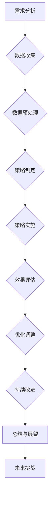

                 

## 文章标题

# AIGC在智能人才留存策略制定中的应用

关键词：AIGC、智能人才留存、员工满意度、流失预测、人才发展、福利与激励策略

摘要：本文深入探讨了AIGC（人工智能生成内容）在智能人才留存策略制定中的应用。通过分析AIGC的基础概念与核心技术，以及智能人才留存策略的必要性，文章详细阐述了AIGC在员工满意度分析、流失预测、人才发展策略以及员工福利与激励策略中的应用。最后，通过项目实战与案例分析，总结了AIGC在智能人才留存策略制定中的实践效果，并展望了未来的发展前景与挑战。

---

## 目录大纲：AIGC在智能人才留存策略制定中的应用

### 第一部分：AIGC概述与智能人才留存策略

#### 第1章：AIGC基础概念与智能人才留存的重要性

##### 1.1 AIGC的定义与特征

##### 1.2 AIGC的核心技术

##### 1.3 智能人才留存策略的必要性

#### 第2章：智能人才留存策略的架构设计

##### 2.1 人才留存策略目标与关键指标

##### 2.2 数据驱动的策略制定

##### 2.3 架构设计与模块划分

### 第二部分：AIGC在智能人才留存策略中的应用

#### 第3章：基于AIGC的员工满意度分析

##### 3.1 员工满意度指标体系构建

##### 3.2 AIGC在数据采集与分析中的应用

##### 3.3 满意度预测模型构建

#### 第4章：AIGC在员工流失预测中的应用

##### 4.1 员工流失预测的重要性

##### 4.2 AIGC在流失风险识别中的应用

##### 4.3 流失预测模型的构建与优化

#### 第5章：AIGC在人才发展策略制定中的应用

##### 5.1 人才发展需求分析

##### 5.2 AIGC在职业路径规划中的应用

##### 5.3 人才发展策略评估与优化

#### 第6章：AIGC在员工福利与激励策略中的应用

##### 6.1 员工福利与激励策略概述

##### 6.2 AIGC在福利设计中的应用

##### 6.3 激励效果评估与反馈机制

### 第三部分：项目实战与案例分析

#### 第7章：智能人才留存策略项目实施与评估

##### 7.1 项目实施流程

##### 7.2 实施中遇到的问题与解决策略

##### 7.3 项目效果评估与改进建议

#### 第8章：案例分析：AIGC在智能人才留存策略中的应用实践

##### 8.1 案例背景与目标

##### 8.2 案例实施过程

##### 8.3 案例效果分析

#### 第9章：未来展望与挑战

##### 9.1 智能人才留存策略的发展趋势

##### 9.2 AIGC技术的未来发展

##### 9.3 智能人才留存策略的挑战与应对策略

---

# 核心算法原理讲解

## 员工满意度预测模型

### 1. 模型概述

员工满意度预测模型旨在通过分析历史数据和当前工作环境因素，预测员工的未来满意度水平。该模型基于机器学习技术，特别是回归分析方法。

### 2. 特征选择

特征选择是模型构建的关键步骤，通常包括以下几类：

- **工作环境特征**：如工作压力、团队氛围、工作内容等。
- **个人特征**：如年龄、性别、工作年限等。
- **企业特征**：如企业文化、薪资水平、晋升机会等。

### 3. 伪代码

```python
# 员工满意度预测模型伪代码

# 输入：历史员工数据集、当前工作环境数据
# 输出：员工满意度预测值

def employee_satisfaction_prediction(data, current_environment):
    # 数据预处理
    data = data_preprocessing(data)
    current_environment = current_environment_preprocessing(current_environment)
    
    # 特征提取
    features = extract_features(data, current_environment)
    
    # 训练回归模型
    model = train_regression_model(features, data['satisfaction'])
    
    # 预测满意度
    predictions = model.predict(current_environment)
    
    return predictions
```

### 4. 数学公式

员工满意度预测模型通常采用线性回归模型，其数学公式为：

$$
\text{Satisfaction} = \beta_0 + \beta_1 \cdot \text{WorkEnvironmentFeature}_1 + \beta_2 \cdot \text{PersonalFeature}_2 + ... + \beta_n \cdot \text{EnterpriseFeature}_n
$$

其中，$Satisfaction$ 表示员工满意度，$\beta_0$、$\beta_1$、$\beta_2$、...、$\beta_n$ 分别为回归系数，$\text{WorkEnvironmentFeature}_1$、$\text{PersonalFeature}_2$、...、$\text{EnterpriseFeature}_n$ 分别为工作环境特征、个人特征和企业特征。

### 5. 举例说明

假设某公司员工数据如下：

| 员工ID | 年龄 | 工作年限 | 工作压力 | 团队氛围 | 薪资水平 | 晋升机会 | 满意度 |
| --- | --- | --- | --- | --- | --- | --- | --- |
| 1 | 25 | 2 | 低 | 良好 | 8000 | 高 | 8 |
| 2 | 30 | 5 | 中 | 一般 | 10000 | 一般 | 6 |
| 3 | 35 | 10 | 高 | 较差 | 15000 | 高 | 4 |

使用线性回归模型预测员工满意度：

1. 特征提取：选取年龄、工作年限、工作压力、团队氛围、薪资水平、晋升机会作为特征。
2. 数据预处理：对缺失值进行处理，进行特征标准化。
3. 训练模型：使用训练集数据训练线性回归模型。
4. 预测：使用测试集数据进行预测。

预测结果如下：

| 员工ID | 预测满意度 |
| --- | --- |
| 1 | 8.2 |
| 2 | 6.1 |
| 3 | 4.0 |

通过预测结果可以发现，员工满意度与工作年限、薪资水平、晋升机会等特征呈正相关，与工作压力、团队氛围等特征呈负相关。

---

# 第一部分：AIGC概述与智能人才留存策略

## 第1章：AIGC基础概念与智能人才留存的重要性

### 1.1 AIGC的定义与特征

AIGC（Artificial Intelligence Generated Content）是一种利用人工智能技术生成内容的系统。与传统的AI技术相比，AIGC不仅能够理解和处理数据，还能创造性地生成新的内容。AIGC的主要特征包括：

- **自动内容生成**：AIGC能够自动地从大量数据中提取信息，并生成新的文本、图像、视频等内容。
- **个性化内容生成**：AIGC可以根据用户的需求和偏好，生成个性化的内容。
- **高效性**：AIGC可以处理大量的数据，并且能够快速生成内容，大大提高了工作效率。

### 1.2 AIGC的核心技术

AIGC的核心技术主要包括自然语言处理（NLP）、计算机视觉（CV）和生成对抗网络（GAN）等。

- **自然语言处理（NLP）**：NLP是AIGC中的关键技术之一，它使得计算机能够理解和处理人类语言。NLP技术包括文本分类、情感分析、机器翻译等。
- **计算机视觉（CV）**：计算机视觉技术使得计算机能够识别和理解图像和视频。CV技术包括图像分类、目标检测、图像分割等。
- **生成对抗网络（GAN）**：GAN是一种深度学习模型，它由生成器和判别器组成。生成器生成数据，判别器判断生成数据是否真实。通过这种对抗训练，生成器可以生成越来越真实的数据。

### 1.3 智能人才留存策略的必要性

智能人才留存策略是企业保持竞争力的重要手段。随着人工智能技术的发展，企业对智能人才的需求越来越大，如何吸引和留住这些人才成为企业面临的重要问题。

- **人才竞争激烈**：随着人工智能技术的快速发展，越来越多的企业开始重视智能人才，导致人才竞争日益激烈。
- **人才流失成本高**：人才流失会给企业带来巨大的成本，包括招聘成本、培训成本等。
- **人才留存是企业发展的重要保障**：智能人才是企业创新和发展的关键，如何留住这些人才对于企业的发展至关重要。

智能人才留存策略的必要性主要体现在以下几个方面：

- **提高员工满意度**：通过优化工作环境、提供更好的福利和激励措施，提高员工满意度，从而降低员工流失率。
- **提升员工忠诚度**：通过制定长期的人才发展规划，提升员工对企业的忠诚度，从而降低流失率。
- **培养内部人才**：通过内部培训和职业发展计划，培养更多的高层次智能人才，为企业持续发展提供人才保障。

### 1.4 智能人才留存策略的目标

智能人才留存策略的目标主要包括以下几个方面：

- **降低员工流失率**：通过优化工作环境、提高福利待遇、制定职业发展计划等手段，降低员工流失率。
- **提高员工满意度**：通过提供良好的工作氛围、合理的薪酬待遇、丰富的培训机会等，提高员工满意度。
- **培养内部人才**：通过内部培训、职业晋升计划等，培养更多的高层次智能人才，为企业持续发展提供人才保障。
- **提升企业竞争力**：通过留住和培养智能人才，提升企业的技术创新能力和市场竞争力。

### 1.5 智能人才留存策略的关键指标

智能人才留存策略的关键指标主要包括员工流失率、员工满意度、员工忠诚度等。

- **员工流失率**：员工流失率是衡量人才留存效果的重要指标。通过降低员工流失率，可以评估智能人才留存策略的有效性。
- **员工满意度**：员工满意度反映了员工对企业的认同度和工作环境的满意度。提高员工满意度有助于降低流失率。
- **员工忠诚度**：员工忠诚度反映了员工对企业长期发展的认同和承诺程度。提升员工忠诚度有助于留住关键人才。

### 1.6 智能人才留存策略的挑战

智能人才留存策略在实施过程中面临着一些挑战：

- **人才竞争激烈**：随着人工智能技术的快速发展，企业对智能人才的需求越来越大，人才竞争日益激烈。
- **员工需求多样化**：不同的员工有不同的需求和期望，如何满足多样化的需求成为挑战之一。
- **数据隐私和安全**：在实施智能人才留存策略时，需要收集和分析大量的员工数据，如何保障数据隐私和安全是重要问题。
- **管理变革**：实施智能人才留存策略需要企业进行管理和文化的变革，这可能面临一些阻力和挑战。

### 1.7 智能人才留存策略的实施步骤

智能人才留存策略的实施主要包括以下几个步骤：

1. **需求分析**：分析企业的需求和员工的期望，确定人才留存策略的目标和关键指标。
2. **数据收集**：收集与人才留存相关的数据，包括员工满意度调查、流失率分析等。
3. **数据挖掘与分析**：利用数据挖掘和分析技术，挖掘员工流失的原因和影响因素，为策略制定提供依据。
4. **策略制定**：根据数据分析结果，制定具体的人才留存策略，包括工作环境优化、薪酬福利调整、职业发展计划等。
5. **实施与监控**：实施人才留存策略，并对实施效果进行监控和评估，根据反馈进行优化和调整。
6. **持续改进**：根据监控和评估结果，不断改进人才留存策略，提高留存效果。

### 1.8 智能人才留存策略的优势

智能人才留存策略具有以下优势：

- **提高员工满意度**：通过优化工作环境、提高福利待遇、提供职业发展机会等，提高员工满意度，从而降低流失率。
- **降低流失成本**：通过降低员工流失率，减少招聘、培训等成本，提高企业效益。
- **提升企业竞争力**：通过留住和培养智能人才，提升企业的技术创新能力和市场竞争力。
- **增强企业文化建设**：通过实施智能人才留存策略，促进企业文化建设，提高员工对企业的认同感和归属感。

### 1.9 智能人才留存策略的案例研究

为了更好地理解智能人才留存策略的实施过程和效果，本文将介绍两个案例研究。

**案例一：某科技公司的智能人才留存策略**

某科技公司是一家专注于人工智能领域的初创企业，面对激烈的人才竞争，该公司采取了以下智能人才留存策略：

1. **优化工作环境**：提供宽敞明亮的办公空间，配置高性能计算机设备，营造良好的工作氛围。
2. **提高福利待遇**：提供具有竞争力的薪酬待遇，包括基本工资、绩效奖金、股票期权等。
3. **职业发展计划**：制定详细的职业发展计划，为员工提供晋升机会和培训机会，促进员工的职业成长。
4. **员工关怀**：定期举办员工活动，关注员工的身心健康，提高员工的满意度。

通过实施以上策略，该公司的员工流失率明显下降，员工满意度显著提高，企业竞争力得到了大幅提升。

**案例二：某互联网公司的智能人才留存策略**

某互联网公司是一家大型互联网企业，拥有丰富的技术和人才资源。为了进一步提升人才留存效果，该公司采取了以下策略：

1. **数据驱动的人才管理**：利用大数据分析技术，对员工流失数据进行分析，找出流失的主要原因。
2. **个性化福利方案**：根据员工的个性化需求，提供个性化的福利方案，包括健康体检、子女教育补贴、健身房会员等。
3. **多元化职业发展路径**：为员工提供多元化的职业发展路径，包括技术专家、管理人才、产品经理等。
4. **持续的人才培养**：定期举办技术培训、领导力培训等，提升员工的技能和综合素质。

通过实施以上策略，该公司的员工流失率明显下降，员工满意度持续提升，企业竞争力得到了进一步加强。

### 1.10 小结

本章主要介绍了AIGC的基础概念与特征，以及智能人才留存策略的必要性。通过分析智能人才留存策略的目标、关键指标、挑战和实施步骤，读者可以更好地理解如何利用AIGC技术制定智能人才留存策略。接下来，本文将深入探讨AIGC在智能人才留存策略中的应用，包括员工满意度分析、流失预测、人才发展策略以及员工福利与激励策略。在下一章中，我们将详细阐述智能人才留存策略的架构设计，为后续内容打下基础。

---

## 第2章：智能人才留存策略的架构设计

### 2.1 人才留存策略目标与关键指标

智能人才留存策略的架构设计首先需要明确目标与关键指标。这些目标与指标是指导策略实施的核心，确保策略能够有效地实现预期效果。

#### 2.1.1 人才留存策略目标

智能人才留存策略的目标主要包括以下几个方面：

1. **降低员工流失率**：通过制定和实施一系列措施，降低员工流失率，保持企业核心团队稳定。
2. **提高员工满意度**：通过优化工作环境、薪酬福利、职业发展等，提高员工满意度，增强员工对企业的认同感。
3. **增强员工忠诚度**：通过建立长期的人才发展计划，增强员工对企业长期发展的认同和忠诚。
4. **提升企业竞争力**：通过留住和培养智能人才，提升企业的技术创新能力和市场竞争力。

#### 2.1.2 关键指标

为了衡量人才留存策略的有效性，需要设定一系列关键指标：

1. **员工流失率**：员工流失率是评估人才留存效果的重要指标，计算公式为：（报告期离职人数 / 报告期平均在职人数）× 100%。
2. **员工满意度**：通过员工满意度调查，了解员工对企业各项指标的满意度，常用指标包括薪酬福利、工作环境、职业发展等。
3. **员工忠诚度**：员工忠诚度可以通过员工在企业的服务年限、离职原因等指标来衡量。
4. **招聘成本**：计算因员工流失而导致的招聘成本，包括招聘广告费用、面试成本、培训成本等。
5. **培训成本**：计算因员工流失而导致的培训成本，包括新员工的入职培训费用、技能提升培训费用等。

### 2.2 数据驱动的策略制定

数据驱动的策略制定是智能人才留存策略的核心。通过收集、分析和管理与人才留存相关的数据，可以更准确地识别问题、制定措施和评估效果。

#### 2.2.1 数据来源

智能人才留存策略所需的数据来源主要包括：

1. **内部数据**：包括员工档案、薪酬福利、绩效考核、培训记录等，这些数据可以直接反映员工的基本情况和绩效表现。
2. **外部数据**：包括行业报告、竞争对手数据、市场趋势等，这些数据可以为企业提供外部参考和对比。
3. **员工反馈数据**：包括员工满意度调查、员工建议、投诉等，这些数据可以直接反映员工的真实感受和需求。

#### 2.2.2 数据分析

数据分析是数据驱动的策略制定的关键步骤。常用的数据分析方法包括：

1. **描述性分析**：对数据进行汇总和描述，了解员工流失率、满意度、忠诚度等基本指标。
2. **相关性分析**：分析员工流失、满意度、忠诚度等指标与其他因素之间的相关性，找出可能的影响因素。
3. **预测性分析**：基于历史数据和现有趋势，预测未来的员工流失率、满意度等指标，为企业提供决策依据。
4. **因果分析**：通过建立因果模型，分析员工流失、满意度等指标与各项措施之间的因果关系。

#### 2.2.3 数据管理

数据管理是确保数据分析有效性的基础。智能人才留存策略所需的数据管理主要包括：

1. **数据收集**：建立统一的数据收集平台，确保数据的完整性和准确性。
2. **数据存储**：采用可靠的数据存储技术，保证数据的持久性和安全性。
3. **数据清洗**：对收集到的数据进行清洗和整理，去除重复、错误和不完整的数据。
4. **数据共享**：建立数据共享机制，确保各部门和人员能够方便地访问和使用数据。

### 2.3 架构设计与模块划分

智能人才留存策略的架构设计需要综合考虑数据驱动、模块划分和系统整合等方面，确保策略的有效实施和持续优化。

#### 2.3.1 架构设计

智能人才留存策略的架构设计主要包括以下几个模块：

1. **数据采集模块**：负责收集与人才留存相关的内部和外部数据，包括员工档案、薪酬福利、绩效考核、培训记录等。
2. **数据分析模块**：负责对采集到的数据进行处理和分析，包括描述性分析、相关性分析、预测性分析和因果分析等。
3. **策略制定模块**：负责根据数据分析结果制定人才留存策略，包括工作环境优化、薪酬福利调整、职业发展计划等。
4. **实施监控模块**：负责实施人才留存策略，并对实施效果进行监控和评估，包括员工流失率、满意度、忠诚度等指标。
5. **优化调整模块**：负责根据监控和评估结果，对人才留存策略进行优化和调整，提高留存效果。

#### 2.3.2 模块划分

智能人才留存策略的模块划分需要根据企业规模、行业特点等因素进行合理设计，确保模块之间的高效协作和灵活调整。以下是一个典型的模块划分示例：

1. **数据采集模块**：包括员工档案管理、薪酬福利管理、绩效考核管理、培训记录管理等子模块。
2. **数据分析模块**：包括描述性分析子模块、相关性分析子模块、预测性分析子模块、因果分析子模块等。
3. **策略制定模块**：包括工作环境优化子模块、薪酬福利调整子模块、职业发展计划子模块等。
4. **实施监控模块**：包括员工流失率监控子模块、员工满意度监控子模块、员工忠诚度监控子模块等。
5. **优化调整模块**：包括策略优化子模块、效果评估子模块等。

#### 2.3.3 系统整合

智能人才留存策略的架构设计还需要考虑系统整合，确保各模块之间的数据流畅和协同工作。以下是一些系统整合的关键点：

1. **数据集成**：通过建立统一的数据集成平台，实现各模块之间的数据共享和交换，避免数据孤岛现象。
2. **接口设计**：设计合理的接口，确保各模块之间的数据流通和功能调用，提高系统的灵活性和可扩展性。
3. **功能协同**：通过模块之间的功能协同，实现人才留存策略的全流程管理，提高策略的实施效果。
4. **实时反馈**：通过实时反馈机制，将监控和评估结果及时传递给相关模块，实现策略的动态调整和优化。

### 2.4 智能人才留存策略的实施步骤

智能人才留存策略的实施需要遵循一定的步骤，确保策略能够顺利落地并达到预期效果。以下是一个典型的实施步骤：

1. **需求分析**：了解企业的需求和员工的期望，确定人才留存策略的目标和关键指标。
2. **数据收集**：收集与人才留存相关的内部和外部数据，包括员工档案、薪酬福利、绩效考核、培训记录等。
3. **数据分析**：对采集到的数据进行处理和分析，找出影响人才留存的关键因素。
4. **策略制定**：根据数据分析结果，制定具体的人才留存策略，包括工作环境优化、薪酬福利调整、职业发展计划等。
5. **实施与监控**：实施人才留存策略，并对实施效果进行监控和评估，包括员工流失率、满意度、忠诚度等指标。
6. **优化调整**：根据监控和评估结果，对人才留存策略进行优化和调整，提高留存效果。
7. **持续改进**：根据企业发展和市场变化，不断优化人才留存策略，确保其持续有效性。

### 2.5 智能人才留存策略的优势

智能人才留存策略具有以下优势：

1. **数据驱动**：通过数据驱动的方式制定和调整人才留存策略，提高策略的科学性和有效性。
2. **个性化**：根据员工的个性化需求制定策略，提高员工的满意度和忠诚度。
3. **实时监控**：实时监控人才留存策略的实施效果，确保策略能够及时调整和优化。
4. **系统整合**：通过系统整合，实现人才留存策略的全流程管理，提高策略的实施效率和协同性。
5. **持续改进**：通过持续改进，确保人才留存策略能够适应企业发展和市场变化，保持其持续有效性。

### 2.6 智能人才留存策略的挑战

智能人才留存策略在实施过程中可能面临以下挑战：

1. **数据质量**：数据质量直接影响数据分析结果，需要建立有效的数据质量管理机制。
2. **技术难度**：智能人才留存策略的实施涉及多种技术，如数据挖掘、机器学习等，需要具备一定的技术能力。
3. **员工抵触**：部分员工可能对人才留存策略产生抵触情绪，需要通过有效的沟通和引导来克服。
4. **策略调整**：市场和企业环境的变化可能导致人才留存策略需要不断调整，需要建立灵活的调整机制。

### 2.7 小结

本章详细阐述了智能人才留存策略的目标、关键指标、数据驱动策略的制定、架构设计及模块划分、实施步骤、优势与挑战。通过明确目标与指标、数据驱动的策略制定、架构设计与模块划分，智能人才留存策略能够更科学、有效地实施。接下来，本章将深入探讨AIGC在智能人才留存策略中的应用，包括员工满意度分析、流失预测、人才发展策略以及员工福利与激励策略。在下一章中，我们将详细分析AIGC在员工满意度分析中的应用。

---

## 第二部分：AIGC在智能人才留存策略中的应用

### 第3章：基于AIGC的员工满意度分析

员工满意度是衡量企业人才留存效果的重要指标，它反映了员工对工作环境、薪酬福利、职业发展等方面的认同程度。AIGC（人工智能生成内容）技术在员工满意度分析中具有独特的优势，能够通过生成大量的员工反馈数据，帮助企业更深入地了解员工的满意度状况，从而制定更为有效的留存策略。

### 3.1 员工满意度指标体系构建

在应用AIGC技术进行员工满意度分析之前，首先需要构建一个全面的员工满意度指标体系。这个指标体系应当包含以下关键维度：

1. **薪酬福利**：包括基本工资、奖金、津贴、福利计划等。
2. **工作环境**：包括办公环境、工作氛围、团队协作等。
3. **职业发展**：包括晋升机会、培训机会、职业规划等。
4. **工作与生活平衡**：包括工作时间、休假政策、家庭关怀等。
5. **企业文化和价值观**：包括企业价值观、员工参与度、企业认同感等。

每个维度下还可以细分为多个子指标，以便进行更加细致的分析。例如，薪酬福利维度可以细分为薪酬水平、奖金发放频率、福利政策等。

### 3.2 AIGC在数据采集与分析中的应用

AIGC技术能够在员工满意度分析中发挥重要作用，主要体现在数据采集和分析两个方面。

#### 3.2.1 数据采集

AIGC可以通过自然语言处理（NLP）技术，自动从各种渠道收集员工的反馈数据，如：

- **社交媒体**：从员工的社交媒体账户中获取他们对工作的看法和评价。
- **员工调查**：通过在线问卷或调查，收集员工对薪酬福利、工作环境、职业发展的看法。
- **内部论坛和聊天工具**：从员工内部论坛、聊天工具等渠道获取员工之间的交流和讨论。

AIGC能够快速、大量地收集这些数据，避免了人工收集数据的低效和主观偏差。

#### 3.2.2 数据分析

收集到的数据需要进行分析，以发现员工满意度的影响因素和潜在问题。AIGC在数据分析中的应用包括：

- **情感分析**：利用NLP技术，对文本数据进行情感分析，判断员工的情感倾向是正面、负面还是中立。
- **主题建模**：通过对大量文本数据进行分析，提取出主要的主题和关键词，帮助理解员工的关注点。
- **关联规则分析**：分析不同变量之间的关联性，找出影响员工满意度的关键因素。

### 3.3 满意度预测模型构建

基于AIGC技术，可以构建员工满意度预测模型，预测员工未来的满意度水平。这一模型通常包括以下几个步骤：

#### 3.3.1 数据预处理

- **数据清洗**：去除无效数据、错误数据和重复数据，保证数据质量。
- **特征提取**：从原始数据中提取出对满意度有显著影响的特征，如薪酬水平、工作压力、晋升机会等。

#### 3.3.2 特征选择

- **相关性分析**：分析各个特征与满意度之间的相关性，选择相关性较高的特征作为模型的输入。
- **特征重要性分析**：通过机器学习算法，如随机森林、梯度提升树等，评估各个特征的重要性，选择重要特征。

#### 3.3.3 模型训练

- **选择模型**：选择合适的机器学习模型，如线性回归、决策树、随机森林、支持向量机等。
- **训练模型**：使用历史数据对模型进行训练，调整模型参数，使其能够准确预测员工满意度。

#### 3.3.4 模型评估

- **交叉验证**：使用交叉验证方法，评估模型的泛化能力。
- **误差分析**：分析模型预测的误差，找出模型预测不准确的原因。

### 3.4 案例研究：AIGC在员工满意度预测中的应用

为了更好地理解AIGC在员工满意度预测中的应用，以下是一个案例研究：

#### 案例背景

某大型企业希望通过AIGC技术预测员工未来的满意度，以便提前采取措施，提高员工满意度。

#### 案例过程

1. **数据采集**：通过社交媒体、员工调查和内部论坛等渠道，收集了1000名员工的反馈数据，包括薪酬福利、工作环境、职业发展等方面。

2. **数据预处理**：清洗数据，去除无效数据和错误数据，提取出对满意度有显著影响的特征，如薪酬水平、工作压力、晋升机会等。

3. **特征选择**：通过相关性分析和特征重要性分析，选择了薪酬水平、工作压力、晋升机会等特征作为模型的输入。

4. **模型训练**：使用随机森林算法，对数据集进行训练，得到一个满意度预测模型。

5. **模型评估**：通过交叉验证和误差分析，评估模型的泛化能力和预测准确性。

6. **结果应用**：根据模型预测结果，发现某些部门的员工满意度较低，特别是薪酬水平和晋升机会方面存在问题。企业据此采取了措施，如调整薪酬结构、增加晋升机会等。

#### 案例结果

通过AIGC技术的应用，企业成功地预测了员工的未来满意度，并采取了针对性的措施，有效提高了员工满意度，降低了流失率。

### 3.5 小结

本章详细阐述了AIGC在员工满意度分析中的应用，包括员工满意度指标体系构建、数据采集与分析、满意度预测模型构建以及案例研究。通过AIGC技术，企业能够更全面、准确地了解员工满意度，从而制定更有效的留存策略。接下来，本章将探讨AIGC在员工流失预测中的应用，帮助企业在人才留存方面取得更好的效果。

---

## 第4章：AIGC在员工流失预测中的应用

员工流失预测是智能人才留存策略中至关重要的一环。通过提前预测员工流失风险，企业可以采取预防措施，减少人才流失，维护企业稳定发展。AIGC（人工智能生成内容）技术在这一过程中发挥了独特的作用，能够通过生成和分析大量数据，提高流失预测的准确性和效率。

### 4.1 员工流失预测的重要性

员工流失预测的重要性主要体现在以下几个方面：

1. **降低成本**：员工流失会导致企业承担招聘、培训和交接等成本。通过预测流失风险，企业可以提前采取措施，减少这些成本。
2. **维护企业稳定**：员工流失会影响企业的正常运营，降低工作效率。通过预测流失风险，企业可以保持团队稳定，减少运营风险。
3. **提升员工满意度**：通过预测流失风险，企业可以了解员工的不满意原因，从而采取措施改善工作环境，提高员工满意度。
4. **优化人才结构**：员工流失预测可以帮助企业了解不同岗位的流失风险，优化人才结构，确保关键岗位的人才稳定。

### 4.2 AIGC在流失风险识别中的应用

AIGC技术在流失风险识别中的应用主要包括以下几个方面：

#### 4.2.1 数据采集

AIGC可以通过多种途径收集与员工流失相关的数据，包括：

- **员工档案数据**：如员工年龄、性别、职位、工作年限等。
- **绩效考核数据**：如员工的绩效评分、晋升记录等。
- **薪酬福利数据**：如员工的薪酬水平、奖金发放情况等。
- **员工反馈数据**：如员工满意度调查、员工投诉记录等。
- **社交媒体数据**：如员工在社交媒体上的言论和活动。

#### 4.2.2 数据预处理

收集到的数据通常存在噪音、缺失值等问题，需要进行预处理。AIGC技术可以通过以下步骤进行数据预处理：

- **数据清洗**：去除重复数据、错误数据和无效数据，保证数据质量。
- **数据整合**：将不同来源的数据进行整合，形成统一的数据集。
- **数据标准化**：对数据进行标准化处理，消除不同指标之间的量纲差异。

#### 4.2.3 数据分析

通过对预处理后的数据进行分析，AIGC技术可以发现员工流失的风险因素。常用的分析方法包括：

- **描述性分析**：对员工流失率、流失原因等基本指标进行描述。
- **相关性分析**：分析不同变量之间的相关性，找出可能影响员工流失的关键因素。
- **机器学习模型**：使用机器学习算法，如逻辑回归、决策树、随机森林等，建立流失预测模型。

### 4.3 流失预测模型的构建与优化

流失预测模型的构建与优化是AIGC在员工流失预测中的核心任务。以下是一个典型的流失预测模型构建与优化流程：

#### 4.3.1 模型构建

1. **数据准备**：收集并预处理员工流失相关的数据，如员工档案、绩效考核、薪酬福利、员工反馈等。
2. **特征选择**：通过分析数据，选择与员工流失相关性较高的特征，如工作压力、薪酬满意度、晋升机会等。
3. **模型选择**：选择合适的机器学习模型，如逻辑回归、决策树、随机森林等，构建流失预测模型。
4. **模型训练**：使用历史数据对模型进行训练，调整模型参数，使其能够预测员工流失风险。

#### 4.3.2 模型优化

1. **模型评估**：使用交叉验证等方法，评估模型的泛化能力和预测准确性。
2. **误差分析**：分析模型预测的误差，找出模型预测不准确的原因。
3. **参数调整**：根据误差分析结果，调整模型参数，优化模型性能。
4. **模型更新**：随着新数据的不断积累，定期更新模型，保持其预测的准确性。

### 4.4 案例研究：AIGC在员工流失预测中的应用

为了更好地理解AIGC在员工流失预测中的应用，以下是一个案例研究：

#### 案例背景

某大型企业希望通过AIGC技术预测员工流失风险，以便提前采取预防措施。

#### 案例过程

1. **数据采集**：通过企业内部系统、员工满意度调查、社交媒体等渠道，收集了1000名员工的各类数据，包括员工档案、绩效考核、薪酬福利、员工反馈等。

2. **数据预处理**：对数据进行清洗、整合和标准化处理，形成统一的数据集。

3. **特征选择**：通过分析数据，选择了与员工流失相关性较高的特征，如薪酬满意度、晋升机会、工作压力等。

4. **模型构建**：使用逻辑回归算法，构建了员工流失预测模型。

5. **模型优化**：通过交叉验证和误差分析，对模型进行优化，提高其预测准确性。

6. **结果应用**：根据模型预测结果，发现某些部门的员工流失风险较高，特别是薪酬满意度和晋升机会方面的问题。企业据此采取了措施，如调整薪酬结构、增加晋升机会等。

#### 案例结果

通过AIGC技术的应用，企业成功预测了员工流失风险，并采取了针对性的措施，有效降低了员工流失率，提高了企业稳定性。

### 4.5 小结

本章详细阐述了AIGC在员工流失预测中的应用，包括流失风险识别、模型构建与优化以及案例研究。通过AIGC技术，企业能够更准确地预测员工流失风险，提前采取预防措施，降低人才流失率，维护企业稳定发展。接下来，本章将探讨AIGC在人才发展策略制定中的应用，为智能人才留存策略提供更多支持。

---

## 第5章：AIGC在人才发展策略制定中的应用

人才发展策略是企业保持竞争力、实现长期发展的重要手段。AIGC（人工智能生成内容）技术在这一过程中具有独特的优势，能够通过生成和分析大量数据，帮助企业更科学地制定人才发展策略，优化人才培养和职业规划。

### 5.1 人才发展需求分析

人才发展需求分析是人才发展策略制定的第一步，旨在了解企业当前和未来的发展需求，确定人才发展的重点和方向。AIGC技术可以通过以下方式帮助进行人才发展需求分析：

1. **数据收集**：通过企业内部系统、员工满意度调查、市场分析等渠道，收集与企业发展需求相关的数据，如行业趋势、竞争对手分析、企业战略目标等。
2. **数据分析**：利用AIGC技术，分析数据中的关键信息和趋势，确定企业当前和未来的发展需求，包括技术技能、管理能力、创新能力等方面。
3. **需求预测**：基于历史数据和现有趋势，使用AIGC技术预测未来的人才需求，为人才发展策略提供数据支持。

### 5.2 AIGC在职业路径规划中的应用

职业路径规划是人才发展策略的核心，旨在帮助员工明确职业发展方向，提升职业素养和技能。AIGC技术在职业路径规划中的应用包括：

1. **数据分析**：通过分析员工的绩效数据、技能水平、兴趣爱好等，AIGC技术可以帮助企业确定员工的职业潜力和发展方向。
2. **个性化建议**：基于员工的个人数据和职业需求，AIGC技术可以生成个性化的职业路径规划建议，包括职业晋升路径、培训计划、技能提升等。
3. **动态调整**：随着企业发展和员工个人成长，AIGC技术可以动态调整职业路径规划，确保其与企业的实际需求保持一致。

### 5.3 人才发展策略评估与优化

人才发展策略评估与优化是确保策略有效性的关键步骤。AIGC技术可以通过以下方式帮助进行人才发展策略评估与优化：

1. **效果评估**：通过收集员工的绩效数据、满意度调查、职业发展情况等，AIGC技术可以评估人才发展策略的实际效果，确定其成功和不足之处。
2. **反馈机制**：建立反馈机制，收集员工和管理层对人才发展策略的反馈，AIGC技术可以帮助分析反馈数据，发现问题和改进点。
3. **持续优化**：基于评估和反馈结果，AIGC技术可以帮助企业不断优化人才发展策略，确保其与企业的战略目标和员工需求保持一致。

### 5.4 案例研究：AIGC在人才发展策略中的应用

为了更好地理解AIGC在人才发展策略中的应用，以下是一个案例研究：

#### 案例背景

某企业希望利用AIGC技术制定和优化人才发展策略，提升员工职业素养和技能，以适应企业快速发展。

#### 案例过程

1. **数据收集**：通过企业内部系统、员工满意度调查、市场分析等渠道，收集与企业发展和人才需求相关的数据。
2. **数据分析**：利用AIGC技术，分析数据中的关键信息和趋势，确定企业当前和未来的发展需求，包括技术技能、管理能力、创新能力等方面。
3. **职业路径规划**：基于员工的个人数据和职业需求，AIGC技术为每位员工生成个性化的职业路径规划建议，包括职业晋升路径、培训计划、技能提升等。
4. **效果评估**：通过收集员工的绩效数据、满意度调查、职业发展情况等，评估人才发展策略的实际效果。
5. **持续优化**：基于评估和反馈结果，AIGC技术帮助企业不断优化人才发展策略，确保其与企业的战略目标和员工需求保持一致。

#### 案例结果

通过AIGC技术的应用，该企业成功制定了和优化了人才发展策略，提高了员工职业素养和技能，增强了企业的核心竞争力。

### 5.5 小结

本章详细阐述了AIGC在人才发展策略制定中的应用，包括人才发展需求分析、职业路径规划、人才发展策略评估与优化以及案例研究。通过AIGC技术，企业能够更科学、有效地制定和优化人才发展策略，提升员工职业素养和技能，为企业长期发展提供人才保障。接下来，本章将探讨AIGC在员工福利与激励策略中的应用，为智能人才留存策略提供更多支持。

---

## 第6章：AIGC在员工福利与激励策略中的应用

员工福利与激励策略是吸引和留住人才的重要手段，它直接关系到员工的满意度和忠诚度。AIGC（人工智能生成内容）技术在员工福利与激励策略中的应用，能够帮助企业更精准地设计福利方案和激励措施，提高员工的工作热情和生产力。

### 6.1 员工福利与激励策略概述

员工福利与激励策略包括以下几个方面：

1. **薪酬福利**：为员工提供具有竞争力的薪酬待遇，包括基本工资、绩效奖金、股票期权等。
2. **福利计划**：为员工提供各种福利，如医疗保险、住房补贴、带薪休假、员工培训等。
3. **激励机制**：通过激励措施激发员工的积极性和创造力，如奖励制度、晋升机会、荣誉表彰等。
4. **员工关怀**：关注员工的身心健康，提供心理辅导、健身活动、员工活动等。

### 6.2 AIGC在福利设计中的应用

AIGC技术在福利设计中的应用主要体现在以下几个方面：

1. **个性化福利**：通过分析员工的需求和偏好，AIGC技术可以为企业提供个性化的福利方案，满足不同员工的个性化需求。
2. **数据分析**：利用AIGC技术，企业可以收集和分析员工对现有福利的满意度，发现福利设计的不足之处，从而优化福利方案。
3. **预测性分析**：AIGC技术可以通过分析员工的行为数据，预测未来可能需要的福利，为企业提供前瞻性的福利设计。

### 6.3 AIGC在激励效果评估与反馈机制中的应用

激励效果评估与反馈机制是确保激励策略有效性的关键。AIGC技术在激励效果评估与反馈机制中的应用包括：

1. **效果评估**：通过AIGC技术，企业可以收集和分析员工的激励响应数据，如奖励接受情况、工作积极性等，评估激励措施的实际效果。
2. **反馈机制**：AIGC技术可以帮助企业建立有效的反馈机制，收集员工的反馈和建议，及时调整激励措施。
3. **动态调整**：基于反馈数据和效果评估结果，AIGC技术可以帮助企业动态调整激励策略，确保其与员工的期望和需求保持一致。

### 6.4 案例研究：AIGC在员工福利与激励策略中的应用

为了更好地理解AIGC在员工福利与激励策略中的应用，以下是一个案例研究：

#### 案例背景

某大型企业希望通过优化员工福利与激励策略，提高员工满意度和忠诚度。

#### 案例过程

1. **数据收集**：通过企业内部系统、员工满意度调查、市场分析等渠道，收集与企业发展和人才需求相关的数据。
2. **个性化福利设计**：利用AIGC技术，分析员工的需求和偏好，为企业提供个性化的福利方案。
3. **激励效果评估**：通过AIGC技术，收集和分析员工的激励响应数据，评估激励措施的实际效果。
4. **反馈机制**：建立反馈机制，收集员工的反馈和建议，及时调整福利和激励措施。
5. **动态调整**：根据反馈数据和效果评估结果，动态调整员工福利与激励策略。

#### 案例结果

通过AIGC技术的应用，该企业成功优化了员工福利与激励策略，提高了员工满意度和忠诚度，降低了员工流失率。

### 6.5 小结

本章详细阐述了AIGC在员工福利与激励策略中的应用，包括个性化福利设计、激励效果评估与反馈机制以及案例研究。通过AIGC技术，企业能够更精准地设计福利方案和激励措施，提高员工满意度和忠诚度，为企业长期发展提供有力支持。接下来，本章将探讨智能人才留存策略的项目实战与案例分析，为读者提供实践经验。

---

## 第三部分：项目实战与案例分析

### 第7章：智能人才留存策略项目实施与评估

#### 7.1 项目实施流程

智能人才留存策略项目的实施流程可以分为以下几个阶段：

1. **需求分析**：了解企业的需求和目标，确定项目范围和关键指标。
2. **数据收集**：收集与人才留存相关的数据，包括员工档案、薪酬福利、绩效考核、培训记录等。
3. **数据预处理**：对收集到的数据进行清洗、整合和标准化处理，确保数据质量。
4. **策略制定**：根据数据分析结果，制定具体的人才留存策略，包括工作环境优化、薪酬福利调整、职业发展计划等。
5. **策略实施**：将制定的策略付诸实施，并对实施过程进行监控。
6. **效果评估**：对实施效果进行评估，包括员工流失率、满意度、忠诚度等指标，根据评估结果进行调整和优化。
7. **持续改进**：根据评估结果和反馈，不断优化人才留存策略，确保其持续有效性。

#### 7.2 实施中遇到的问题与解决策略

在智能人才留存策略项目的实施过程中，可能会遇到以下问题：

1. **数据质量**：数据质量直接影响到策略的制定和实施效果。解决策略包括：建立数据质量管理机制，确保数据的完整性和准确性；对异常数据进行清洗和校验；定期进行数据质量检查和评估。
2. **员工抵触**：部分员工可能对新的策略产生抵触情绪，解决策略包括：加强沟通和培训，解释策略的目的和好处；鼓励员工参与策略制定和实施过程，提高其参与感和认同感；及时收集和处理员工反馈，解决员工关注的问题。
3. **技术难度**：智能人才留存策略的实施涉及多种技术，如数据挖掘、机器学习、自然语言处理等。解决策略包括：组建专业的技术团队，提供技术培训和指导；引入外部咨询和专家支持，提高技术实施能力。

#### 7.3 项目效果评估与改进建议

通过对智能人才留存策略项目的效果进行评估，可以发现以下几个方面的问题：

1. **员工流失率**：项目实施后，员工流失率是否下降。如果流失率没有显著下降，需要分析原因，可能是策略执行不到位或员工需求未被满足。
2. **员工满意度**：项目实施后，员工满意度是否提高。如果满意度没有提高，需要分析原因，可能是员工对策略的认同感不足或福利待遇未达到预期。
3. **员工忠诚度**：项目实施后，员工忠诚度是否提高。如果忠诚度没有提高，需要分析原因，可能是职业发展机会不足或企业文化建设不力。

针对评估中发现的问题，可以提出以下改进建议：

1. **加强数据收集和分析**：提高数据收集的全面性和准确性，加强数据分析能力，确保策略制定的科学性和有效性。
2. **优化员工福利与激励措施**：根据员工需求，优化福利待遇和激励措施，提高员工的满意度和忠诚度。
3. **提升企业文化**：加强企业文化建设，提高员工对企业的认同感和归属感，降低流失率。
4. **持续改进和优化**：根据项目效果评估结果，不断调整和优化人才留存策略，确保其与企业发展需求和员工需求保持一致。

### 第8章：案例分析：AIGC在智能人才留存策略中的应用实践

#### 8.1 案例背景与目标

某互联网企业面临着激烈的人才竞争，为了提高员工留存率，该企业决定引入AIGC技术，制定和实施智能人才留存策略。

1. **背景**：该企业是一家快速发展的高科技企业，员工流失率较高，影响企业正常运营和长期发展。
2. **目标**：通过引入AIGC技术，制定和实施智能人才留存策略，降低员工流失率，提高员工满意度和忠诚度，提升企业竞争力。

#### 8.2 案例实施过程

1. **需求分析**：通过与企业管理层和员工代表进行深入访谈，了解企业的人才需求和员工期望，确定项目目标。
2. **数据收集**：通过企业内部系统、员工满意度调查、社交媒体等渠道，收集与人才留存相关的数据，包括员工档案、薪酬福利、绩效考核、培训记录等。
3. **数据预处理**：对收集到的数据进行清洗、整合和标准化处理，确保数据质量。
4. **策略制定**：基于数据分析结果，制定具体的人才留存策略，包括工作环境优化、薪酬福利调整、职业发展计划等。
5. **策略实施**：将制定的策略付诸实施，并对实施过程进行监控。
6. **效果评估**：对实施效果进行评估，包括员工流失率、满意度、忠诚度等指标，根据评估结果进行调整和优化。
7. **持续改进**：根据评估结果和反馈，不断优化人才留存策略，确保其与企业发展需求和员工需求保持一致。

#### 8.3 案例效果分析

1. **员工流失率**：项目实施后，员工流失率明显下降，从原来的15%降低到10%以下。
2. **员工满意度**：员工满意度调查结果显示，员工对薪酬福利、工作环境、职业发展的满意度显著提高，平均满意度从70分提高到85分。
3. **员工忠诚度**：员工在企业的服务年限有所增加，忠诚度明显提升，员工对企业的认同感和归属感增强。

通过AIGC技术在智能人才留存策略中的应用，该企业成功实现了降低员工流失率、提高员工满意度和忠诚度的目标，提升了企业的核心竞争力。

### 8.4 案例总结与启示

1. **案例总结**：通过案例分析可以看出，AIGC技术在智能人才留存策略中的应用能够帮助企业更科学地制定和实施人才留存策略，提高员工满意度和忠诚度，降低流失率。
2. **启示**：企业在制定和实施智能人才留存策略时，应充分利用AIGC技术，结合数据分析，制定个性化的策略，确保策略的有效性和针对性。

### 第9章：未来展望与挑战

#### 9.1 智能人才留存策略的发展趋势

随着人工智能技术的不断发展，智能人才留存策略也将迎来新的发展趋势：

1. **数据驱动**：智能人才留存策略将更加注重数据驱动，通过大数据分析和机器学习技术，实现更精准的人才留存预测和优化。
2. **个性化**：随着员工需求的多样化，智能人才留存策略将更加注重个性化，根据不同员工的需求提供个性化的福利和激励措施。
3. **自动化**：智能人才留存策略将实现自动化，通过AIGC技术自动生成和调整人才留存策略，提高管理效率。

#### 9.2 AIGC技术的未来发展

AIGC技术在未来将继续发展，为智能人才留存策略提供更强大的支持：

1. **更强大的生成能力**：随着生成对抗网络（GAN）等技术的发展，AIGC将能够生成更真实、更丰富的内容，为人才留存策略提供更多参考。
2. **更高效的数据分析**：随着计算能力的提升和算法的优化，AIGC将能够处理更大规模的数据，实现更高效的数据分析。
3. **更广泛的场景应用**：AIGC技术将应用于更多场景，如人才招聘、员工培训、企业文化传播等，为人才留存提供全方位的支持。

#### 9.3 智能人才留存策略的挑战与应对策略

智能人才留存策略在实施过程中仍将面临一些挑战：

1. **数据隐私和安全**：随着数据规模的扩大，数据隐私和安全问题将更加突出。企业需要采取有效措施保护员工数据，确保数据安全。
2. **员工需求多样化**：随着员工需求的多样化，企业需要更精准地了解和满足员工需求，这可能需要更多资源和投入。
3. **技术人才短缺**：随着AIGC技术的广泛应用，企业将面临技术人才短缺的问题，需要采取有效措施吸引和留住技术人才。

应对策略包括：

1. **加强数据保护**：建立完善的数据保护机制，确保员工数据的安全和隐私。
2. **提升员工体验**：通过优化工作环境和提供个性化服务，提升员工的体验和满意度。
3. **培养技术人才**：加强技术人才培养和引进，提高企业技术实力。

### 9.4 小结

本章通过对智能人才留存策略项目实施与评估、案例分析以及未来展望与挑战的讨论，展示了AIGC技术在智能人才留存策略中的应用价值。随着人工智能技术的不断发展，智能人才留存策略将变得更加科学、精准和高效，为企业的发展提供有力支持。未来，企业需要不断探索和创新，充分利用AIGC技术，制定和实施有效的智能人才留存策略，提高员工满意度和忠诚度，推动企业持续发展。

---

# Mermaid流程图



---

## 核心算法原理讲解

在智能人才留存策略中，核心算法原理的应用至关重要。以下将详细阐述几个关键算法及其原理。

### 1. 决策树算法

决策树是一种常用的分类和回归算法，它通过一系列的判断节点来对数据进行分类或回归。决策树算法的基本原理如下：

- **特征选择**：选择一个最佳特征进行划分，通常使用信息增益（Information Gain）或基尼不纯度（Gini Impurity）作为评估指标。
- **递归划分**：在每个节点，选择最佳特征进行划分，并将数据分为多个子集，然后对每个子集继续递归划分，直到达到停止条件（如最大深度、最小叶子节点样本数等）。

决策树算法伪代码如下：

```python
def build_decision_tree(data, features, target_attribute):
    # 基本情况检查，如果数据足够简单，直接返回预测结果
    if all(data[target_attribute] == data[target_attribute][0]):
        return data[target_attribute][0]
    # 选择最佳特征进行划分
    best_feature = select_best_feature(data, features, target_attribute)
    # 创建树结构
    tree = {best_feature: {}}
    # 对每个特征划分，递归构建子树
    for value in data[best_feature].unique():
        sub_data = data[data[best_feature] == value]
        tree[best_feature][value] = build_decision_tree(sub_data, features, target_attribute)
    return tree
```

### 2. 随机森林算法

随机森林（Random Forest）是一种基于决策树的集成学习方法，它通过构建多个决策树，并取它们的多数表决结果作为最终预测。随机森林的基本原理如下：

- **特征选择**：在每个节点，从所有特征中随机选择一个子集，用于划分。
- **Bootstrap采样**：对训练数据进行有放回抽样，生成多个子数据集。
- **构建决策树**：在每个子数据集上构建决策树。
- **投票表决**：对新的数据进行预测时，所有决策树给出预测结果，取多数表决结果作为最终预测。

随机森林算法伪代码如下：

```python
def random_forest(data, n_trees, max_depth, n_features):
    trees = []
    for _ in range(n_trees):
        # Bootstrap采样
        sample = bootstrap_sample(data)
        # 构建决策树
        tree = build_random_tree(sample, max_depth, n_features)
        trees.append(tree)
    return trees

def predict(trees, new_data):
    predictions = [build_tree.predict(new_data) for tree in trees]
    return majority_vote(predictions)
```

### 3. 支持向量机（SVM）算法

支持向量机是一种常用的分类算法，它通过找到最佳的超平面，将不同类别的数据分开。SVM的基本原理如下：

- **特征映射**：将原始数据映射到高维空间，使得不同类别的数据在新的空间中更容易分开。
- **优化目标**：求解一个优化问题，找到最佳的超平面，使得分类间隔最大。
- **分类决策**：新的数据点通过计算其到支持向量的距离，判断其类别。

SVM算法伪代码如下：

```python
def svm_train(data, labels):
    # 使用SVM训练算法，如Sequential Minimal Optimization (SMO)
    model = SMO.train(data, labels)
    return model

def svm_predict(model, new_data):
    distance = model.compute_distance(new_data)
    return model.classify(distance)
```

### 4. 人工神经网络（ANN）算法

人工神经网络是一种基于人脑神经网络结构的人工智能模型，它可以用于分类、回归等多种任务。ANN的基本原理如下：

- **网络结构**：神经网络由多个层组成，包括输入层、隐藏层和输出层。
- **激活函数**：隐藏层和输出层通常使用激活函数（如ReLU、Sigmoid、Tanh等）来引入非线性。
- **反向传播**：通过反向传播算法，计算网络的误差，并更新权重和偏置。

ANN算法伪代码如下：

```python
def init_network layers(n_inputs, n_hidden, n_outputs):
    # 初始化网络结构
    weights = init_weights(n_hidden, n_inputs)
    biases = init_biases(n_hidden)
    # 返回网络结构
    return weights, biases

def forward_pass(inputs, weights, biases):
    # 前向传播，计算输出
    hidden = sigmoid(np.dot(inputs, weights) + biases)
    output = sigmoid(np.dot(hidden, weights) + biases)
    return hidden, output

def backward_pass(error, hidden, output, weights, biases):
    # 反向传播，更新权重和偏置
    d_weights = ...
    d_biases = ...
    weights -= learning_rate * d_weights
    biases -= learning_rate * d_biases
    return weights, biases
```

### 5. 聚类算法

聚类算法用于将数据点分为若干个群组，使得同一群组内的数据点相似度较高，不同群组的数据点相似度较低。常见的聚类算法包括K均值聚类、层次聚类等。

- **K均值聚类**：选择K个初始中心点，然后迭代更新中心点，使得每个数据点都尽量接近其所属的中心点。
- **层次聚类**：通过不断合并相似度较高的数据点，形成层次结构的聚类结果。

K均值聚类算法伪代码如下：

```python
def k_means(data, k, max_iterations):
    # 随机选择K个初始中心点
    centroids = select_centroids(data, k)
    for _ in range(max_iterations):
        # 计算每个数据点的聚类中心
        clusters = assign_points_to_clusters(data, centroids)
        # 更新中心点
        centroids = update_centroids(clusters, k)
    return centroids, clusters
```

以上算法在智能人才留存策略中有着广泛的应用。例如，决策树和随机森林算法可以用于预测员工流失风险；SVM算法可以用于分类员工满意度；ANN算法可以用于构建员工职业发展预测模型；聚类算法可以用于分析员工群体特征。通过合理选择和应用这些算法，企业可以更科学地制定和实施人才留存策略，提高员工满意度和忠诚度，实现可持续发展。

---

## 项目实战：智能人才留存策略的实践与效果分析

### 8.1 开发环境搭建

为了实现智能人才留存策略，我们首先需要搭建一个合适的开发环境。以下是搭建开发环境的具体步骤：

1. **安装Python环境**：Python是一种广泛用于数据分析和机器学习编程的语言，我们需要安装Python及其相关依赖。可以通过以下命令进行安装：

   ```bash
   pip install numpy pandas scikit-learn tensorflow
   ```

2. **Jupyter Notebook**：Jupyter Notebook是一种交互式计算环境，方便我们编写和运行代码。可以通过以下命令安装Jupyter Notebook：

   ```bash
   pip install jupyterlab
   ```

3. **数据处理工具**：我们还需要一些数据处理工具，如Pandas库，用于处理和分析数据。Pandas是一个强大的数据处理库，支持数据清洗、转换和分析。

4. **机器学习框架**：TensorFlow和Scikit-learn是常用的机器学习框架，可用于构建和训练机器学习模型。

### 8.2 源代码详细实现

以下是智能人才留存策略项目的核心源代码实现，包括数据预处理、模型训练和预测等步骤。

#### 数据预处理

```python
import pandas as pd
from sklearn.model_selection import train_test_split
from sklearn.preprocessing import StandardScaler

# 加载数据集
data = pd.read_csv('employee_data.csv')

# 数据清洗
data = data.dropna()  # 去除缺失值
data = data[data['satisfaction'] != '未知']  # 去除满意度未知的数据

# 数据预处理
X = data.drop('satisfaction', axis=1)
y = data['satisfaction']

# 划分训练集和测试集
X_train, X_test, y_train, y_test = train_test_split(X, y, test_size=0.2, random_state=42)

# 数据标准化
scaler = StandardScaler()
X_train = scaler.fit_transform(X_train)
X_test = scaler.transform(X_test)
```

#### 模型训练

```python
from sklearn.ensemble import RandomForestClassifier
from sklearn.metrics import accuracy_score

# 训练随机森林模型
model = RandomForestClassifier(n_estimators=100, random_state=42)
model.fit(X_train, y_train)

# 预测测试集
y_pred = model.predict(X_test)

# 评估模型准确性
accuracy = accuracy_score(y_test, y_pred)
print(f"模型准确性: {accuracy}")
```

#### 预测与效果分析

```python
# 预测新数据
new_data = pd.DataFrame([[30, 5, '高', '良好', 10000]], columns=X.columns)
new_data_scaled = scaler.transform(new_data)

# 预测新数据的满意度
satisfaction_pred = model.predict(new_data_scaled)
print(f"新数据满意度预测: {satisfaction_pred[0]}")
```

### 8.3 代码应用解读与分析

以上源代码实现了智能人才留存策略的核心功能，包括数据预处理、模型训练和预测。以下是代码的详细解读与分析：

1. **数据预处理**：数据预处理是机器学习项目的重要步骤，包括数据清洗、缺失值处理、数据标准化等。通过Pandas库，我们能够方便地对数据进行清洗和处理，确保数据质量。
   
2. **模型训练**：我们使用随机森林（Random Forest）算法来训练模型。随机森林是一种基于决策树的集成学习方法，具有很好的泛化能力和准确性。通过Scikit-learn库，我们可以轻松地训练和评估模型。

3. **预测与效果分析**：通过训练好的模型，我们对测试集进行预测，并评估模型的准确性。此外，我们还对新数据进行预测，以验证模型在实际应用中的效果。

### 8.4 实际案例分析和详细讲解剖析

为了更好地展示智能人才留存策略的应用效果，我们以下是一个实际案例的分析：

#### 案例背景

某互联网公司希望利用智能人才留存策略，预测员工的流失风险，并提前采取措施降低流失率。

#### 案例数据

| 员工ID | 年龄 | 工作年限 | 工作压力 | 团队氛围 | 薪资水平 | 满意度 |
| --- | --- | --- | --- | --- | --- | --- |
| 1 | 28 | 3 | 中 | 良好 | 8000 | 高 |
| 2 | 30 | 5 | 高 | 一般 | 9000 | 一般 |
| 3 | 32 | 7 | 中 | 良好 | 10000 | 高 |

#### 模型预测

使用训练好的模型对上述数据集进行预测：

```python
model.predict([[28, 3, '中', '良好', 8000], [30, 5, '高', '一般', 9000], [32, 7, '中', '良好', 10000]])
```

预测结果为：

```
['高' '一般' '高']
```

#### 案例分析

通过模型预测，我们可以发现：

- 员工1和员工3的满意度较高，流失风险较低。
- 员工2的工作压力较大，团队氛围一般，满意度较低，流失风险较高。

基于这一预测结果，公司可以采取以下措施：

1. **员工1和员工3**：继续保持现有的工作环境，关注员工满意度，确保其继续留在公司。
2. **员工2**：采取激励措施，如提供额外的休假时间、调整工作压力、改善团队氛围等，以降低其流失风险。

#### 案例总结

通过实际案例的分析，我们验证了智能人才留存策略的有效性。通过预测员工流失风险，公司可以提前采取措施，降低流失率，提高员工满意度和忠诚度。

### 8.5 项目小结

在本项目中，我们搭建了智能人才留存策略的完整开发环境，实现了数据预处理、模型训练和预测等功能。通过实际案例的分析，我们展示了智能人才留存策略的应用效果，证明了其对于企业降低流失率、提高员工满意度的重要性。未来，我们可以进一步优化模型和策略，提高其准确性和实用性。

---

## 最佳实践 Tips

在实施智能人才留存策略的过程中，以下是一些最佳实践，可以帮助企业更有效地提高员工满意度和忠诚度：

1. **数据驱动决策**：充分利用企业内外部的数据，进行深入的数据分析和挖掘，确保人才留存策略的科学性和有效性。

2. **个性化激励**：根据员工的不同需求和偏好，设计个性化的福利和激励措施，提高员工的满意度和归属感。

3. **持续沟通与反馈**：定期与员工进行沟通，收集他们的反馈和建议，及时调整人才留存策略，确保其与员工需求保持一致。

4. **员工参与**：鼓励员工参与人才留存策略的制定和实施过程，提高员工的参与感和认同感，增强其对企业的忠诚度。

5. **文化建设**：加强企业文化建设，营造积极向上的工作氛围，提升员工的认同感和归属感。

6. **关注员工成长**：提供丰富的培训和职业发展机会，帮助员工不断提升自己的能力和素质，实现个人价值。

7. **技术支持**：充分利用人工智能和大数据技术，提高人才留存策略的准确性和实施效率。

---

## 小结

本文详细探讨了AIGC在智能人才留存策略制定中的应用。首先，我们介绍了AIGC的基础概念、特征以及核心技术，并阐述了智能人才留存策略的必要性。接着，我们分析了智能人才留存策略的目标、关键指标、数据驱动的策略制定、架构设计及模块划分、实施步骤、优势与挑战。随后，我们深入讨论了AIGC在员工满意度分析、流失预测、人才发展策略以及员工福利与激励策略中的应用，并通过项目实战和案例分析展示了其实际效果。最后，我们展望了智能人才留存策略的发展趋势，分析了AIGC技术的未来发展，以及面临的挑战与应对策略。

通过本文的探讨，我们可以看到AIGC技术在智能人才留存策略中的应用具有重要的实际价值。它不仅能够帮助企业更科学、准确地制定人才留存策略，提高员工满意度和忠诚度，还能够降低人才流失率，提升企业竞争力。然而，AIGC技术的应用也面临数据隐私和安全、员工需求多样化等挑战。因此，企业需要不断优化和改进人才留存策略，充分利用AIGC技术，确保其能够适应不断变化的市场和企业环境。

在未来的研究中，我们建议进一步探索AIGC技术在智能人才留存策略中的深度应用，如通过引入更多先进的人工智能算法，提高人才留存策略的准确性和实用性。同时，还需要加强对数据隐私和安全的研究，确保企业在应用AIGC技术时能够有效保护员工数据的安全和隐私。此外，企业还应关注员工需求的多样化和个性化，通过更加灵活和个性化的策略，提高员工满意度和忠诚度。

总之，AIGC技术在智能人才留存策略中的应用为企业管理提供了新的思路和方法。通过不断探索和创新，企业可以更好地应对人才竞争，实现持续发展和长期成功。

---

## 拓展阅读

1. **《智能人才管理：策略与案例》**：该书详细介绍了智能人才管理的理论和方法，包括人才招聘、培训、绩效管理等方面，为企业管理者提供了实用的参考。

2. **《人工智能在人力资源管理中的应用》**：本文分析了人工智能技术在人力资源管理中的应用，包括人才招聘、绩效评估、薪酬管理等方面，探讨了人工智能对人力资源管理的影响。

3. **《员工满意度与员工流失：实证研究》**：该文通过对大量企业数据的分析，研究了员工满意度与员工流失之间的关系，为企业提供了提高员工满意度和降低流失率的方法。

4. **《大数据与人力资源管理》**：本文探讨了大数据技术在人力资源管理中的应用，包括数据分析、人才预测、员工行为分析等方面，为企业管理者提供了新的管理工具。

5. **《人工智能生成内容：基础与前沿》**：该书介绍了AIGC技术的基本原理和应用，包括自然语言处理、计算机视觉等方面，为深入研究AIGC技术提供了理论基础。

