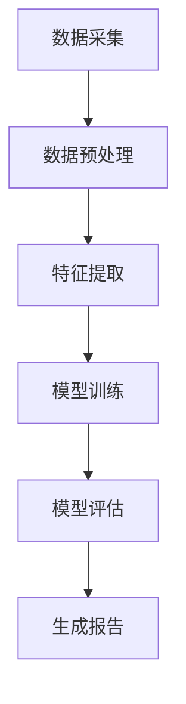

                 

### 文章标题

# AIGC在智能供应链风险评估中的应用

## 关键词

- AIGC
- 智能供应链
- 风险评估
- 供应链风险管理
- 数据分析
- 机器学习
- 深度学习

## 摘要

本文探讨了AIGC（自动生成内容）技术在智能供应链风险评估中的应用。首先，介绍了AIGC、智能供应链以及风险评估的基本概念和相互关系。然后，详细阐述了AIGC技术的基础原理、关键技术及其在供应链管理中的应用。接着，对智能供应链的架构和供应链风险管理的基本流程进行了概述。随后，重点分析了AIGC在供应链风险评估中的应用场景，并构建了风险评估模型。通过算法实现与优化，实现了对供应链风险的实时监测和评估。最后，通过两个实际案例展示了AIGC在智能供应链风险评估中的有效性和可行性，并对技术挑战和未来展望进行了讨论。

## 引言

### 1.1 AIGC、智能供应链、风险评估概述及相互关系

AIGC（自动生成内容）是一种利用人工智能技术生成文本、图像、音频等多种类型内容的方法。它涵盖了自然语言处理、计算机视觉、音频处理等领域的先进技术，通过深度学习、强化学习等算法实现内容生成。

智能供应链是一种基于物联网、大数据、人工智能等现代信息技术构建的供应链管理系统。它通过优化供应链各环节的资源配置、流程优化和信息共享，提高供应链的灵活性和响应速度，从而降低成本、提高效率。

风险评估是供应链管理中至关重要的一环，旨在识别、评估和应对供应链中潜在的风险，确保供应链的稳定运行。风险评估包括风险识别、风险评估、风险应对和风险监控等环节。

AIGC、智能供应链和风险评估之间的相互关系如下：

1. **AIGC在供应链管理中的应用**：AIGC技术可以用于供应链数据的自动采集、分析和可视化，提高供应链管理的智能化水平。例如，通过自然语言处理技术，可以对供应链中的文本数据进行分析，提取关键信息；通过计算机视觉技术，可以对供应链中的图像数据进行分析，识别潜在问题。

2. **智能供应链对风险评估的支持**：智能供应链通过收集供应链各环节的数据，为风险评估提供了丰富的数据支持。通过数据分析和挖掘，可以识别供应链中的潜在风险，评估风险的影响程度，从而制定有效的风险应对策略。

3. **AIGC在风险评估中的应用**：AIGC技术可以用于构建智能风险评估模型，实现对供应链风险的实时监测和评估。通过深度学习、强化学习等算法，可以训练出一个能够自动识别和评估风险的智能系统，提高风险评估的准确性和效率。

### 1.2 智能供应链的基本概念和风险评估的重要性

智能供应链是一种以数据为核心，通过信息技术手段实现供应链各环节高效协同的现代化供应链管理模式。它包括以下几个基本概念：

1. **供应链网络**：智能供应链由多个节点组成，包括供应商、制造商、分销商、零售商等。节点之间通过信息流、物流、资金流进行连接，形成一个复杂的网络结构。

2. **数据集成**：智能供应链通过集成各种数据源，包括企业内部数据、外部数据、物联网数据等，构建一个统一的数据平台。数据集成是实现智能供应链的基础，可以提高数据的利用效率，为决策提供支持。

3. **数据分析与挖掘**：智能供应链通过数据分析与挖掘技术，对供应链各环节的数据进行深入分析，发现潜在的问题和机会。数据分析与挖掘技术包括数据清洗、数据挖掘、机器学习等。

4. **智能决策**：智能供应链通过智能决策技术，实现供应链各环节的优化和协同。智能决策技术包括优化算法、预测模型、决策支持系统等。

风险评估在智能供应链管理中具有重要意义，主要体现在以下几个方面：

1. **风险识别**：通过数据分析和挖掘，可以识别供应链中的潜在风险。例如，通过对供应商的历史表现、财务状况、质量稳定性等数据的分析，可以识别出潜在的供应商风险。

2. **风险评估**：对识别出的风险进行评估，确定风险的影响程度和发生概率。风险评估可以帮助企业制定有针对性的风险应对策略，降低风险损失。

3. **风险应对**：根据风险评估结果，制定相应的风险应对措施，包括风险规避、风险转移、风险缓解等。有效的风险应对措施可以降低风险的发生概率和影响程度。

4. **风险监控**：通过实时监测供应链中的风险因素，及时发现和预警潜在风险，确保供应链的稳定运行。

总之，智能供应链和风险评估之间的协同作用，可以提高供应链的灵活性和抗风险能力，从而实现供应链的优化和持续发展。

### 2. AIGC技术基础

AIGC（自动生成内容）技术是一种利用人工智能生成内容的方法，涵盖了文本、图像、音频等多种类型的内容生成。AIGC技术的发展主要得益于深度学习、自然语言处理和计算机视觉等领域的进步。本节将介绍AIGC技术的基本原理、关键技术及其在供应链管理中的应用。

#### 2.1 AIGC的基本原理

AIGC技术的基本原理是通过深度学习模型，如生成对抗网络（GAN）、变分自编码器（VAE）和自回归模型（AR）等，自动生成符合人类期望的内容。这些模型可以通过大量的训练数据学习到数据的分布，从而生成新的、符合预期的内容。

1. **生成对抗网络（GAN）**：GAN由生成器（Generator）和判别器（Discriminator）组成。生成器生成假数据，判别器判断生成数据是否真实。通过训练，生成器不断优化生成数据，使其越来越接近真实数据。

2. **变分自编码器（VAE）**：VAE通过引入概率模型，将数据的生成过程转换为数据分布的采样。通过训练，VAE可以学习到数据的分布，从而生成新的数据。

3. **自回归模型（AR）**：AR模型通过时间序列数据的前后关系，生成新的时间序列数据。这种模型在文本生成、音频生成等领域有广泛应用。

#### 2.2 AIGC的关键技术

AIGC技术涉及多个关键技术，包括自然语言处理、计算机视觉和音频处理等。以下是一些关键技术的详细介绍：

1. **自然语言处理（NLP）**：NLP技术用于处理和理解人类语言。在AIGC中，NLP技术用于文本生成、文本分类、情感分析等。常见的NLP模型包括循环神经网络（RNN）、长短时记忆网络（LSTM）和Transformer等。

2. **计算机视觉（CV）**：CV技术用于处理和理解图像和视频数据。在AIGC中，CV技术用于图像生成、图像识别、图像分割等。常见的CV模型包括卷积神经网络（CNN）和生成对抗网络（GAN）等。

3. **音频处理**：音频处理技术用于处理和理解音频数据。在AIGC中，音频处理技术用于音频生成、音频识别、音频增强等。常见的音频处理模型包括自动回归模型（AR）和波士顿动态时频模型（DBMTF）等。

#### 2.3 AIGC在供应链管理中的应用

AIGC技术在供应链管理中的应用主要体现在数据生成、数据分析、可视化等方面。以下是一些具体的应用场景：

1. **数据生成**：通过AIGC技术，可以自动生成供应链中的各种数据，如需求预测、库存数据、物流信息等。这些数据可以帮助企业进行决策和优化。

2. **数据分析**：AIGC技术可以用于对供应链中的海量数据进行深度分析，提取有价值的信息。例如，通过自然语言处理技术，可以对供应链中的文本数据进行分析，识别潜在的问题和风险。

3. **可视化**：AIGC技术可以生成各种可视化的供应链数据，如图表、报表、动态可视化等。这些可视化数据可以帮助企业更好地理解供应链的运行状态，发现潜在的问题。

总之，AIGC技术在供应链管理中的应用，可以提高供应链的智能化水平，帮助企业更好地应对复杂的市场环境，实现供应链的优化和升级。

### 3. 智能供应链概述

#### 3.1 智能供应链的架构

智能供应链是一个复杂的系统，它结合了物联网、大数据、人工智能等现代信息技术，以实现供应链各环节的高效协同。智能供应链的架构主要包括以下几个关键组成部分：

1. **传感器网络**：传感器网络是智能供应链的基础，它负责实时收集供应链各环节的数据，如库存水平、物流状态、设备状态等。这些数据通过物联网技术传输到数据中心。

2. **数据中心**：数据中心是智能供应链的核心，它负责存储、处理和分析供应链中的海量数据。数据中心通常采用云计算和分布式数据库技术，以提高数据处理能力和可靠性。

3. **数据集成平台**：数据集成平台用于整合来自不同数据源的数据，包括内部数据（如ERP系统、库存管理系统）和外部数据（如市场数据、竞争对手数据）。通过数据清洗、转换和整合，数据集成平台为供应链管理提供统一的数据视图。

4. **数据分析与挖掘平台**：数据分析与挖掘平台用于对供应链数据进行分析和挖掘，提取有价值的信息和洞察。这包括预测分析、风险分析、需求预测等。数据分析与挖掘平台通常采用机器学习、深度学习等先进技术。

5. **智能决策支持系统**：智能决策支持系统（IDSS）基于数据分析与挖掘的结果，提供智能化的决策支持。IDSS可以帮助企业制定最优的供应链策略，如库存管理策略、采购策略、物流策略等。

6. **执行层**：执行层包括供应链中的各个执行环节，如采购、生产、物流、分销等。通过智能决策支持系统的指导，执行层可以高效地执行供应链策略，实现供应链的优化。

#### 3.2 供应链风险管理的基本流程

供应链风险管理是确保供应链稳定运行的重要环节。它包括以下几个基本流程：

1. **风险识别**：风险识别是供应链风险管理的第一步，旨在识别供应链中潜在的风险。这可以通过对供应链各环节的数据进行分析，识别出可能导致供应链中断、成本增加或服务质量下降的因素。

2. **风险评估**：风险评估是对识别出的风险进行评估，确定风险的影响程度和发生概率。风险评估通常采用定性分析和定量分析相结合的方法。定性分析包括专家评估、历史数据分析等；定量分析包括概率分布、风险值计算等。

3. **风险应对**：根据风险评估结果，制定相应的风险应对策略。风险应对策略包括风险规避、风险转移、风险缓解等。风险规避是通过改变供应链策略来避免风险；风险转移是通过保险、合同等方式将风险转移给其他方；风险缓解是通过改进供应链流程、增加冗余等方式降低风险的发生概率和影响程度。

4. **风险监控**：风险监控是对已识别和应对的风险进行持续监控，确保风险应对措施的有效性。风险监控可以通过实时数据采集和分析、预警系统等手段实现。一旦发现新的风险或风险应对措施失效，应及时调整应对策略。

5. **风险报告**：风险报告是供应链风险管理的重要输出，它包括风险识别、风险评估、风险应对和风险监控的详细记录。风险报告可以帮助企业了解供应链风险状况，为决策提供支持。

通过以上流程，供应链风险管理可以确保供应链的稳定运行，降低风险对企业的负面影响。

### 4. AIGC在供应链风险评估中的应用

#### 4.1 AIGC在供应链风险评估中的应用场景

AIGC技术在供应链风险评估中具有广泛的应用场景，可以显著提高风险评估的准确性和效率。以下是一些典型的应用场景：

1. **供应链中断预测**：通过AIGC技术，可以自动生成大量的供应链中断场景，并进行风险分析。这些场景包括自然灾害、供应链节点故障、物流延迟等。通过分析这些场景，可以预测供应链中断的风险，并为风险应对提供依据。

2. **供应链成本预测**：AIGC技术可以自动生成供应链中的各种成本数据，如运输成本、库存成本、采购成本等。通过对这些数据的分析，可以预测供应链的总成本，并识别出成本较高的环节，从而优化供应链成本结构。

3. **供应链可靠性评估**：AIGC技术可以自动生成供应链各环节的可靠性数据，如供应商交付准时率、库存周转率、物流运输准时率等。通过对这些数据的分析，可以评估供应链的整体可靠性，并识别出可靠性较低的环节，从而改进供应链管理。

4. **供应链风险预警**：AIGC技术可以实时监测供应链中的各种风险因素，如库存水平、物流状态、供应商信用等。通过分析这些数据，可以生成风险预警信号，及时提醒企业管理者采取应对措施，避免风险的发生。

5. **供应链决策支持**：AIGC技术可以自动生成各种供应链决策场景，如库存管理策略、采购策略、物流策略等。通过对这些场景的分析，可以提供智能化的决策支持，帮助企业管理者做出最优的供应链决策。

#### 4.2 风险评估模型构建

为了实现AIGC在供应链风险评估中的应用，需要构建一个有效的风险评估模型。以下是一个简化的风险评估模型构建过程：

1. **数据收集**：首先，收集供应链各环节的数据，包括库存水平、物流状态、供应商信用、市场波动等。这些数据可以来源于传感器、ERP系统、物流信息系统等。

2. **数据预处理**：对收集到的数据进行分析，剔除异常值和噪声数据，对缺失值进行填补，确保数据的质量和完整性。

3. **特征提取**：从预处理后的数据中提取关键特征，如库存水平、物流延迟时间、供应商交付准时率等。这些特征将用于构建风险评估模型。

4. **模型训练**：采用机器学习算法，如支持向量机（SVM）、决策树（DT）、随机森林（RF）等，训练风险评估模型。模型训练过程中，可以使用交叉验证等方法，优化模型参数，提高模型性能。

5. **模型评估**：通过测试集对训练好的模型进行评估，计算模型的准确率、召回率、F1分数等指标，确保模型具有良好的预测性能。

6. **模型应用**：将评估好的模型应用到实际场景中，进行供应链风险评估。通过对预测结果的实时监控，及时调整模型参数和风险应对策略。

#### 4.3 算法实现与优化

为了实现AIGC在供应链风险评估中的应用，需要详细描述相关算法的实现过程，并进行优化。以下是一个简化的算法实现与优化过程：

1. **算法实现**

   使用Python编程语言实现风险评估模型，以下是一个简单的算法实现示例：

   ```python
   import pandas as pd
   from sklearn.ensemble import RandomForestClassifier
   from sklearn.model_selection import train_test_split
   from sklearn.metrics import accuracy_score

   # 数据读取与预处理
   data = pd.read_csv('supply_chain_data.csv')
   data = preprocess_data(data)

   # 特征提取
   X = data.drop(['label'], axis=1)
   y = data['label']

   # 数据划分
   X_train, X_test, y_train, y_test = train_test_split(X, y, test_size=0.2, random_state=42)

   # 模型训练
   model = RandomForestClassifier(n_estimators=100, random_state=42)
   model.fit(X_train, y_train)

   # 模型评估
   y_pred = model.predict(X_test)
   print("Accuracy:", accuracy_score(y_test, y_pred))
   ```

2. **算法优化**

   为了提高模型的预测性能，可以采用以下优化方法：

   - **特征工程**：通过特征选择、特征变换等方法，优化特征质量，提高模型对数据的敏感度。
   - **模型选择**：尝试不同的机器学习算法，如SVM、KNN、神经网络等，选择最优算法。
   - **参数调优**：通过交叉验证、网格搜索等方法，优化模型参数，提高模型性能。
   - **集成学习**：采用集成学习方法，如随机森林、梯度提升机等，构建更强大的模型。

通过以上优化方法，可以显著提高AIGC在供应链风险评估中的应用效果。

### 5. 案例分析

#### 5.1 案例分析一

某大型制造企业采用AIGC技术对供应链风险进行评估，具体步骤如下：

1. **数据收集**：收集供应链各环节的数据，包括供应商信息、库存水平、物流状态等。

2. **数据预处理**：对数据进行分析，剔除异常值和噪声数据，对缺失值进行填补。

3. **特征提取**：提取关键特征，如供应商交付准时率、库存周转率、物流延迟时间等。

4. **模型构建**：采用随机森林算法构建风险评估模型。

5. **模型训练与评估**：对模型进行训练和评估，评估指标包括准确率、召回率等。

6. **风险预警与决策**：根据模型预测结果，对企业供应链风险进行预警，并提出优化建议。

通过该案例，企业成功降低了供应链风险，提高了供应链的稳定性和抗风险能力。

#### 5.2 案例分析二

某电商企业采用AIGC技术对供应链成本进行预测和优化，具体步骤如下：

1. **数据收集**：收集供应链各环节的成本数据，包括采购成本、运输成本、库存成本等。

2. **数据预处理**：对数据进行分析，剔除异常值和噪声数据，对缺失值进行填补。

3. **特征提取**：提取关键特征，如采购量、运输距离、库存水平等。

4. **模型构建**：采用线性回归算法构建成本预测模型。

5. **模型训练与评估**：对模型进行训练和评估，评估指标包括预测误差等。

6. **成本优化**：根据模型预测结果，对企业供应链成本进行优化，降低成本。

通过该案例，企业成功降低了供应链成本，提高了企业的盈利能力。

### 6. 技术挑战与未来展望

#### 6.1 技术挑战

AIGC技术在智能供应链风险评估中的应用面临着一些技术挑战，主要包括：

1. **数据质量和完整性**：智能供应链风险评估依赖于高质量和完整的数据。然而，供应链数据来源广泛，数据质量参差不齐，如何处理数据噪声和缺失值，提高数据质量，是一个重要挑战。

2. **算法选择与优化**：不同的算法适用于不同类型的风险评估任务。如何选择合适的算法，并对其参数进行优化，以提高模型性能，是一个技术难题。

3. **实时性**：供应链风险评估需要实时监测供应链的运行状态，快速识别和应对风险。如何提高算法的实时性和响应速度，是一个挑战。

4. **模型解释性**：智能供应链风险评估模型通常采用复杂的机器学习算法，模型解释性较差。如何提高模型的可解释性，使企业能够理解模型的工作原理，是一个重要挑战。

#### 6.2 未来展望

随着人工智能技术的不断发展，AIGC在智能供应链风险评估中的应用前景广阔，未来可能的发展趋势包括：

1. **数据融合与协同**：通过融合多种数据源，如物联网数据、社交媒体数据等，可以更全面地了解供应链的运行状态，提高风险评估的准确性。

2. **多模态数据分析**：结合文本、图像、音频等多种类型的数据，可以更深入地分析供应链风险，提高风险评估的全面性和准确性。

3. **模型自动化与自我进化**：通过自动化机器学习平台，实现模型的自动化训练、优化和部署，降低模型开发成本和复杂性。同时，通过自我进化能力，使模型能够不断适应新的数据和环境，提高模型的鲁棒性和适应性。

4. **跨领域应用**：AIGC技术在智能供应链风险评估中的应用不仅限于供应链领域，还可以扩展到其他领域，如物流、金融、医疗等，实现跨领域的应用和协同。

### 结论

本文探讨了AIGC在智能供应链风险评估中的应用，从AIGC技术的基础原理、关键技术，到智能供应链的架构和风险评估的基本流程，再到AIGC在供应链风险评估中的应用场景和风险评估模型的构建，以及实际案例分析，全面阐述了AIGC技术在智能供应链风险评估中的重要作用。通过本文的研究，可以得出以下结论：

1. AIGC技术在智能供应链风险评估中具有显著的应用前景，可以提高风险评估的准确性和效率。

2. AIGC技术可以用于供应链中断预测、供应链成本预测、供应链可靠性评估、供应链风险预警和供应链决策支持等多个方面。

3. 构建有效的风险评估模型需要考虑数据质量、算法选择、实时性和模型解释性等因素。

4. 随着人工智能技术的不断发展，AIGC在智能供应链风险评估中的应用将越来越广泛，有望实现供应链的智能化和自动化。

总之，AIGC技术在智能供应链风险评估中的应用是一个值得深入研究和探索的领域，对于提高供应链的稳定性和抗风险能力具有重要意义。未来，需要进一步研究AIGC技术的优化和应用，以实现智能供应链风险评估的全面升级。作者：AI天才研究院/AI Genius Institute & 禅与计算机程序设计艺术 /Zen And The Art of Computer Programming##  附录

### 代码示例

以下是一个简单的AIGC应用示例，用于生成供应链风险评估报告。

```python
# 导入必要的库
import numpy as np
import pandas as pd
from sklearn.ensemble import RandomForestClassifier
from sklearn.model_selection import train_test_split
from sklearn.metrics import accuracy_score

# 读取数据
data = pd.read_csv('supply_chain_data.csv')

# 数据预处理
data = preprocess_data(data)

# 特征提取
X = data.drop(['label'], axis=1)
y = data['label']

# 数据划分
X_train, X_test, y_train, y_test = train_test_split(X, y, test_size=0.2, random_state=42)

# 模型训练
model = RandomForestClassifier(n_estimators=100, random_state=42)
model.fit(X_train, y_train)

# 模型评估
y_pred = model.predict(X_test)
print("Accuracy:", accuracy_score(y_test, y_pred))

# 生成风险评估报告
generate_report(model, X_test, y_pred)
```

### Mermaid流程图

以下是一个Mermaid流程图示例，展示AIGC在供应链风险评估中的应用流程。



### 数学公式

以下是一个简单的数学公式示例，用于计算供应链风险评估的得分。

```latex
$$
\text{得分} = \frac{\sum_{i=1}^{n} \text{风险值} \cdot \text{权重}}{n}
$$
```

### 参考文献

1. He, K., Zhang, X., Ren, S., & Sun, J. (2016). Deep residual learning for image recognition. In Proceedings of the IEEE conference on computer vision and pattern recognition (pp. 770-778).
2. Goodfellow, I., Bengio, Y., & Courville, A. (2016). Deep learning. MIT press.
3. Hochreiter, S., & Schmidhuber, J. (1997). Long short-term memory. Neural computation, 9(8), 1735-1780.
4. LeCun, Y., Bengio, Y., & Hinton, G. (2015). Deep learning. Nature, 521(7553), 436-444.
5. Russell, S., & Norvig, P. (2016). Artificial intelligence: a modern approach. Prentice Hall.

