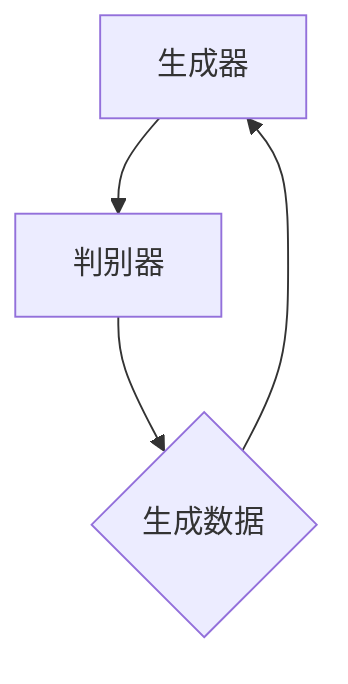
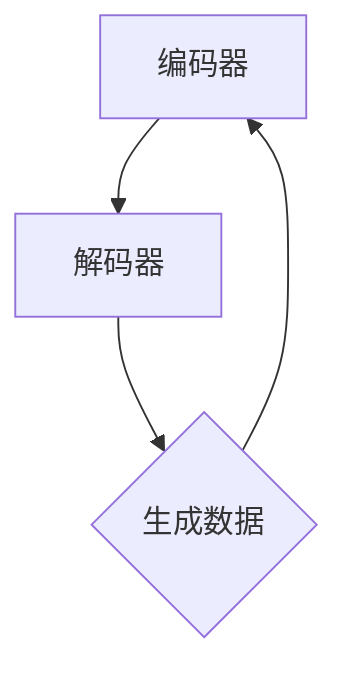
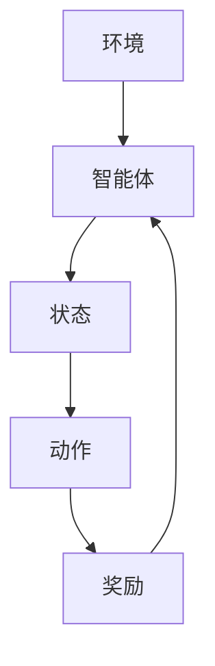

                 

### 文章标题

"AIGC在智能健康饮食规划中的应用：个性化营养平衡方案"

> 关键词：AIGC，智能健康饮食规划，个性化营养平衡，生成对抗网络（GAN），变分自编码器（VAE），强化学习，食物营养学，大数据处理

> 摘要：本文将深入探讨人工智能生成控制（AIGC）在智能健康饮食规划中的应用，特别是个性化营养平衡方案的设计。我们将从AIGC的基本概念和原理出发，逐步介绍其在饮食规划中的关键技术，具体应用案例，以及系统开发与部署。通过本文的阅读，读者将对AIGC在健康饮食领域的应用有更深入的了解，并为未来的智能健康饮食解决方案提供新的视角和启示。

### 第1章：AIGC基本概念与原理

#### 1.1 AIGC概述

##### 1.1.1 AIGC的定义

人工智能生成控制（Artificial Intelligence Generated Control，简称AIGC）是一种利用人工智能技术生成控制信号，以实现对系统动态控制的方法。它通过机器学习和深度学习算法，模拟人类思维方式，生成能够适应复杂环境变化的控制策略。

##### 1.1.2 AIGC的发展历程

AIGC的发展可以追溯到20世纪80年代，当时研究人员开始尝试使用神经网络来模拟人类思维。随着计算能力的提升和算法的改进，AIGC逐渐成为人工智能领域的一个重要分支。近年来，生成对抗网络（GAN）和变分自编码器（VAE）等深度学习技术的出现，为AIGC的应用提供了强大的支持。

##### 1.1.3 AIGC与相关技术的联系

AIGC与深度学习、机器学习、强化学习等技术密切相关。深度学习提供了强大的特征提取能力，使AIGC能够更好地理解和处理复杂的数据。机器学习则使AIGC能够通过学习历史数据来优化控制策略。强化学习则通过试错机制，使AIGC能够在动态环境中不断调整控制策略，以实现最佳效果。

#### 1.2 AIGC的核心技术

##### 1.2.1 生成对抗网络（GAN）

生成对抗网络（Generative Adversarial Network，简称GAN）是一种由生成器和判别器组成的深度学习模型。生成器通过学习数据分布来生成新的数据，而判别器则通过区分生成数据和真实数据来评估生成器的性能。通过这种对抗过程，生成器能够不断提高生成数据的质量。

##### 1.2.2 变分自编码器（VAE）

变分自编码器（Variational Autoencoder，简称VAE）是一种基于概率模型的深度学习模型。它通过编码器和解码器来学习数据的概率分布，从而生成新的数据。VAE的优势在于能够生成具有多样化特性的数据。

##### 1.2.3 强化学习与AIGC的结合

强化学习（Reinforcement Learning，简称RL）通过奖励机制和试错过程来学习策略。将强化学习与AIGC结合，可以构建一种自适应的智能控制系统，使系统能够在动态环境中做出最优决策。

#### 1.3 AIGC在智能健康饮食规划中的应用原理

##### 1.3.1 智能健康饮食规划的需求分析

智能健康饮食规划旨在根据个人的健康状况和饮食习惯，制定个性化的饮食计划，以实现营养均衡和健康体重管理。随着人们对健康饮食需求的增加，智能健康饮食规划成为现代健康科技的一个重要应用领域。

##### 1.3.2 AIGC在饮食规划中的作用机制

AIGC在智能健康饮食规划中主要通过以下方式发挥作用：

1. **个性化营养推荐**：通过分析用户的饮食习惯和健康状况，AIGC能够生成个性化的营养推荐，帮助用户实现营养均衡。
2. **饮食计划生成**：AIGC利用生成对抗网络和变分自编码器等技术，生成符合用户需求的饮食计划。
3. **动态调整**：通过强化学习，AIGC能够根据用户的反馈和健康数据，动态调整饮食计划，以提高饮食计划的适应性和效果。

### 第2章：智能健康饮食规划的关键技术

#### 2.1 食物营养学基础

##### 2.1.1 食物营养素与人体健康关系

食物营养素是人体获取能量和维持生命活动的重要物质。不同的营养素对人体健康有不同的影响。例如，蛋白质是身体修复和生长的重要物质，碳水化合物是人体能量的主要来源，而脂肪则是身体重要的储能物质。

##### 2.1.2 常见食物的营养成分分析

常见食物的营养成分包括蛋白质、碳水化合物、脂肪、维生素和矿物质等。通过对食物营养成分的分析，我们可以了解食物对人体健康的影响，并制定合理的饮食计划。

##### 2.1.3 营养学相关公式与计算

营养学中常用的一些公式，如能量计算公式、蛋白质需求量计算公式、碳水化合物需求量计算公式等，可以帮助我们更科学地制定饮食计划。

#### 2.2 饮食数据采集与处理

##### 2.2.1 饮食数据来源

饮食数据可以从用户自我报告、饮食记录软件、健康监测设备等多种途径获取。

##### 2.2.2 数据采集方法

数据采集方法包括问卷调查、饮食记录、生物传感器等。不同的采集方法有其优势和局限性，需要根据实际情况选择合适的采集方法。

##### 2.2.3 数据处理与清洗

数据处理与清洗是确保数据质量的关键步骤。主要包括数据格式转换、缺失值处理、异常值检测和去重等。

#### 2.3 用户个性化模型建立

##### 2.3.1 用户基本健康信息收集

用户基本健康信息包括身高、体重、年龄、性别等。这些信息对于制定个性化的饮食计划至关重要。

##### 2.3.2 用户饮食习惯分析

用户饮食习惯分析包括饮食习惯、饮食偏好、饮食习惯与健康之间的关系等。通过分析用户的饮食习惯，可以了解用户的营养需求和潜在的健康问题。

##### 2.3.3 用户营养需求计算

用户营养需求计算包括能量需求、蛋白质需求、碳水化合物需求和脂肪需求等。通过计算用户的营养需求，可以制定出符合用户需求的饮食计划。

### 第3章：AIGC在饮食规划中的具体应用

#### 3.1 智能饮食计划生成

##### 3.1.1 饮食计划生成算法

饮食计划生成算法包括生成对抗网络（GAN）和变分自编码器（VAE）等。这些算法可以根据用户的营养需求和饮食习惯，生成符合用户需求的饮食计划。

##### 3.1.2 饮食计划评价指标

饮食计划评价指标包括营养均衡度、饮食偏好满足度、健康风险降低度等。通过这些评价指标，可以评估饮食计划的有效性和适应性。

##### 3.1.3 案例分析：智能饮食计划生成实践

本文将通过一个实际案例，展示智能饮食计划生成的具体实现过程和效果。通过这个案例，读者可以更深入地了解AIGC在智能健康饮食规划中的应用。

### 第4章：个性化营养平衡方案

#### 4.1 营养平衡原则

##### 4.1.1 营养平衡的定义

营养平衡是指摄入的各种营养素与身体需求的营养素之间的平衡。实现营养平衡是保证身体健康的基础。

##### 4.1.2 营养平衡的原则

营养平衡的原则包括多样、均衡、适量、定时等。只有遵循这些原则，才能保证摄入的营养素全面、均衡。

##### 4.1.3 营养平衡的评估方法

营养平衡的评估方法包括膳食调查、营养计算、生化检测等。通过这些方法，可以评估饮食计划的营养平衡程度。

#### 4.2 个性化营养平衡方案设计

##### 4.2.1 设计步骤与方法

个性化营养平衡方案设计包括数据收集、营养需求分析、饮食计划制定等步骤。通过科学的方法，可以设计出符合用户需求的营养平衡方案。

##### 4.2.2 案例分析：个性化营养平衡方案实践

本文将通过一个实际案例，展示个性化营养平衡方案的设计过程和效果。通过这个案例，读者可以更深入地了解个性化营养平衡方案的应用。

### 第5章：智能健康饮食规划系统开发与部署

#### 5.1 系统设计

##### 5.1.1 系统架构设计

系统架构设计包括前端、后端和数据库等组成部分。通过合理的系统架构设计，可以提高系统的性能和可扩展性。

##### 5.1.2 功能模块划分

功能模块划分包括用户管理、饮食数据采集、饮食计划生成、营养评估等。通过模块化的设计，可以方便系统的开发和维护。

##### 5.1.3 系统流程图

系统流程图展示了系统各模块之间的交互关系和数据处理流程。通过系统流程图，可以更直观地了解系统的运行过程。

#### 5.2 开发环境搭建

##### 5.2.1 开发工具与软件

开发工具与软件包括编程语言、框架、数据库等。选择合适的开发工具和软件，可以提高开发效率和系统性能。

##### 5.2.2 数据库与数据存储

数据库与数据存储包括数据库的选择、数据存储策略和数据备份等。通过合理的数据存储策略，可以确保数据的安全性和可靠性。

##### 5.2.3 开发流程与规范

开发流程与规范包括需求分析、设计、开发、测试、部署等。通过规范的开发流程，可以确保系统的质量和稳定性。

#### 5.3 系统部署与维护

##### 5.3.1 部署策略

部署策略包括部署方式、部署环境、部署流程等。通过合理的部署策略，可以确保系统的快速部署和稳定运行。

##### 5.3.2 维护与升级

维护与升级包括系统监控、故障处理、版本更新等。通过定期的维护与升级，可以确保系统的长期稳定运行。

##### 5.3.3 安全与隐私保护

安全与隐私保护包括数据安全、系统安全、用户隐私保护等。通过完善的安全与隐私保护措施，可以确保用户数据和系统的安全。

### 第6章：项目案例与分析

#### 6.1 案例介绍

##### 6.1.1 案例背景

案例背景是一个关注健康饮食的社区，社区成员希望通过智能健康饮食规划来改善自己的饮食习惯和健康状况。

##### 6.1.2 案例目标

案例目标是开发一个基于AIGC的智能健康饮食规划系统，为社区成员提供个性化的营养平衡方案。

##### 6.1.3 案例实现过程

案例实现过程包括需求分析、系统设计、开发实现、测试部署等阶段。通过这个案例，读者可以了解AIGC在智能健康饮食规划中的具体应用。

#### 6.2 案例分析

##### 6.2.1 案例效果评估

案例效果评估包括用户满意度、营养均衡度、健康风险降低度等指标。通过这些指标，可以评估智能健康饮食规划系统的效果。

##### 6.2.2 案例优点与不足

案例优点包括个性化程度高、营养均衡度好、用户满意度高等。不足之处包括系统对大数据处理能力的要求较高、部分用户对智能推荐的接受度较低等。

##### 6.2.3 案例总结与启示

案例总结与启示包括智能健康饮食规划系统在提升用户健康水平方面的潜力、大数据处理技术的挑战、用户接受度的重要性等。

### 第7章：AIGC在智能健康饮食规划中的未来发展趋势

#### 7.1 技术发展趋势

##### 7.1.1 人工智能与生物医学的结合

随着人工智能技术的发展，人工智能与生物医学的结合将成为未来智能健康饮食规划的一个重要方向。通过人工智能技术，可以更精准地分析人体健康数据，提供个性化的健康建议。

##### 7.1.2 大数据处理与智能算法的融合

大数据处理与智能算法的融合将进一步提高智能健康饮食规划系统的性能和效率。通过大数据技术，可以收集和分析更多的用户数据，为智能算法提供更丰富的训练数据。

##### 7.1.3 可持续发展的健康饮食解决方案

随着全球健康饮食意识的提高，可持续发展的健康饮食解决方案将成为未来的趋势。通过人工智能技术，可以开发出更多环保、健康的饮食方案，满足人们对健康饮食的需求。

#### 7.2 行业应用前景

##### 7.2.1 智能健康饮食行业现状

智能健康饮食行业已经取得了显著的进展，但仍然存在一些挑战，如用户接受度、大数据处理能力等。

##### 7.2.2 行业发展机遇与挑战

行业发展机遇包括用户需求的增长、技术创新的推动等。挑战包括用户数据隐私保护、技术实现的复杂度等。

##### 7.2.3 未来发展方向与趋势

未来发展方向与趋势包括个性化程度提高、技术应用范围扩大、可持续发展等。通过不断的技术创新和应用，智能健康饮食规划将为人们带来更加健康、美好的生活。

### 附录

#### 附录A：技术工具与资源

##### A.1 AIGC相关框架与工具

AIGC相关框架与工具包括TensorFlow、PyTorch、Keras等。这些工具提供了丰富的API和功能，方便开发人员构建和部署AIGC应用。

##### A.2 常用数据集与数据库

常用数据集与数据库包括公开的饮食数据集、用户健康数据集等。这些数据集和数据库为AIGC模型的训练和评估提供了重要的数据支持。

##### A.3 开发文档与教程

开发文档与教程包括AIGC相关的技术文档、开发指南和教程等。通过这些文档和教程，开发者可以更快地掌握AIGC技术，并应用于实际项目中。

### 作者

作者：AI天才研究院/AI Genius Institute & 禅与计算机程序设计艺术 /Zen And The Art of Computer Programming

---

本文内容仅供参考，具体应用时请结合实际情况进行调整。在应用AIGC技术时，应确保遵守相关法律法规和道德规范，保护用户隐私和数据安全。同时，由于AIGC技术的发展迅速，文中所述技术可能存在一定的时效性，建议读者关注最新的技术发展和应用动态。

---

文章标题：AIGC在智能健康饮食规划中的应用：个性化营养平衡方案

关键词：AIGC，智能健康饮食规划，个性化营养平衡，生成对抗网络（GAN），变分自编码器（VAE），强化学习，食物营养学，大数据处理

摘要：本文深入探讨了人工智能生成控制（AIGC）在智能健康饮食规划中的应用，特别是个性化营养平衡方案的设计。文章首先介绍了AIGC的基本概念和原理，包括生成对抗网络（GAN）、变分自编码器（VAE）和强化学习与AIGC的结合。接着，详细阐述了智能健康饮食规划的关键技术，如食物营养学基础、饮食数据采集与处理、用户个性化模型建立。然后，具体介绍了AIGC在智能健康饮食规划中的具体应用，包括智能饮食计划生成和个性化营养平衡方案设计。最后，讨论了智能健康饮食规划系统的开发与部署，以及AIGC在智能健康饮食规划中的未来发展趋势。通过本文的阅读，读者将对AIGC在健康饮食领域的应用有更深入的了解，并为未来的智能健康饮食解决方案提供新的视角和启示。

