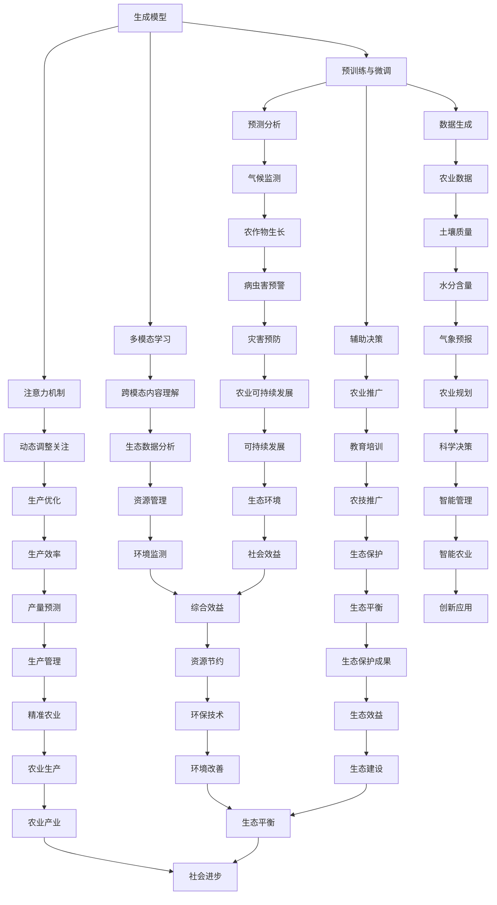

                 

### 文章标题

"AIGC在智能农业生态系统管理中的前沿实践"

### 关键词

人工智能生成内容（AIGC）、智能农业、生态系统管理、前沿实践、创新应用

### 摘要

随着科技的快速发展，人工智能生成内容（AIGC）在各个领域的应用日益广泛。在智能农业生态系统管理中，AIGC技术以其强大的数据处理能力和智能分析功能，正逐渐成为农业现代化的重要推动力。本文将深入探讨AIGC在智能农业生态系统管理中的前沿实践，包括其核心概念、应用现状、关键技术、实际案例以及未来发展趋势，为读者呈现AIGC在农业领域的广泛应用和巨大潜力。

## 引言

智能农业生态系统管理是指利用现代信息技术和人工智能技术，对农业生产过程中的各种生态要素进行高效管理，实现农业生产的可持续发展。随着全球人口的增长和资源的日益紧张，提高农业产量和质量、保护生态环境已成为全球共同面临的重要挑战。人工智能生成内容（AIGC）作为一种新兴的人工智能技术，通过生成式人工智能模型，能够自动生成文本、图像、音频等多种形式的内容，为农业生态系统管理提供了全新的解决方案。

AIGC在智能农业生态系统管理中的应用具有重要意义。首先，它能够实现农业数据的智能处理和分析，帮助农业管理者实时了解农作物的生长状况、土壤质量和气候环境等信息。其次，AIGC能够根据历史数据和实时监测数据，预测农业生产的潜在问题和风险，为农业生产提供科学决策支持。此外，AIGC还能通过虚拟现实和增强现实技术，为农业教育、推广和培训提供丰富的教学资源和互动体验。总之，AIGC在智能农业生态系统管理中的应用，不仅有助于提高农业生产的效率和质量，还能促进农业的可持续发展。

## AIGC概述

### 核心概念与联系

人工智能生成内容（AIGC）是人工智能技术的一个分支，主要研究如何利用人工智能模型自动生成人类创造的内容。AIGC的核心概念包括：

1. **生成模型**：生成模型是一种可以从数据中学习概率分布的人工智能模型，通过学习数据分布，生成模型可以生成新的、类似于训练数据的样本。常见的生成模型包括变分自编码器（VAE）、生成对抗网络（GAN）等。

2. **预训练与微调**：预训练是指在大量无监督数据上进行模型训练，使其获得一定的通用特征表示能力；微调则是在预训练的基础上，使用特定领域的数据对模型进行进一步训练，使其适应特定任务。

3. **多模态学习**：多模态学习是指将多种不同类型的数据（如文本、图像、音频等）融合在一起进行学习，以便更好地理解和生成跨模态的内容。

4. **注意力机制**：注意力机制是一种在神经网络中模拟人类注意力模式的技术，通过动态地调整模型对输入数据的关注程度，提高模型的表示能力和生成质量。

AIGC的这些核心概念相互关联，共同构成了一个复杂但高效的生成系统。在智能农业生态系统管理中，AIGC技术可以应用于数据生成、预测分析和辅助决策等多个方面。为了更好地理解AIGC在农业中的应用，下面我们将通过一个Mermaid流程图来展示AIGC的核心组件及其相互关系。

### Mermaid Diagram for AIGC Components

### Mermaid Diagram Explanation

- **生成模型（A）**：作为AIGC的核心，生成模型负责从数据中学习并生成新的内容。它可以处理文本、图像、音频等多种形式的数据。
- **预训练与微调（B）**：预训练使模型具备通用特征表示能力，微调则使其适应特定领域的任务，如农业数据生成和预测分析。
- **多模态学习（C）**：通过融合多种数据类型，多模态学习能够提高内容生成的多样性和准确性。
- **注意力机制（D）**：注意力机制使模型能够动态调整对输入数据的关注，提高生成内容的相关性和质量。

这些核心组件相互协作，共同构建了AIGC系统。在智能农业生态系统管理中，AIGC技术通过上述组件的应用，实现了从数据采集、处理到预测分析和决策支持的全面覆盖，为农业生产提供了强大的技术支持。

### AIGC在农业中的应用现状

AIGC在农业中的应用已呈现出显著的发展趋势。当前，AIGC技术主要应用于以下几个方面：

1. **数据生成**：AIGC可以通过生成模型自动生成农业数据，如土壤质量、气候条件、农作物生长状态等。这些数据为农业生产提供了丰富的基础信息，有助于管理者进行科学决策。

2. **预测分析**：AIGC能够利用历史数据和实时监测数据，预测农作物的生长趋势、产量变化和潜在风险。例如，通过分析气候数据和农作物生长周期，AIGC可以预测未来某段时间内的气候条件，为农作物的灌溉、施肥等提供依据。

3. **辅助决策**：AIGC可以通过对农业数据的分析和处理，提供决策支持，如优化灌溉计划、调整施肥策略、预测病虫害等。这些决策支持可以帮助农民减少损失、提高产量。

4. **农业推广和教育**：AIGC可以通过虚拟现实（VR）和增强现实（AR）技术，为农业推广和教育提供丰富的互动体验。例如，农民可以通过AR技术了解农作物的生长过程、病虫害防治方法等，提高农业生产技能。

### 发展历程

AIGC技术在农业中的应用始于21世纪初。当时，随着计算机技术和人工智能技术的快速发展，科学家们开始探索如何将人工智能技术应用于农业领域。最早的尝试主要集中在利用机器学习模型进行农业数据的分析和预测。然而，由于数据量有限且数据质量参差不齐，这些早期的应用效果并不理想。

随着云计算、物联网和大数据技术的兴起，农业数据量得到了显著增长，数据质量也得到了提高。这为AIGC技术在农业中的应用提供了良好的基础。2010年以后，AIGC技术在农业领域开始得到广泛应用，例如，美国、中国等国家的一些农场已经开始利用AIGC技术进行数据分析和预测，取得了显著的成效。

### 挑战与机遇

尽管AIGC技术在农业领域具有巨大的应用潜力，但在实际应用过程中仍面临一系列挑战：

1. **数据质量**：农业数据的多样性、不一致性和噪声问题较大，这给AIGC模型的训练和预测带来了困难。例如，土壤质量数据可能受到天气、施肥等因素的影响，导致数据质量不稳定。

2. **模型解释性**：AIGC模型通常是基于深度学习的，其内部机制复杂，难以解释。这给农业管理者理解和应用AIGC技术带来了困难。

3. **计算资源**：AIGC模型的训练和预测需要大量的计算资源，对于一些小型农场或发展中国家来说，这可能是一个挑战。

4. **政策法规**：农业数据涉及隐私和版权等问题，如何在保证数据安全和合规的前提下，有效利用AIGC技术，是一个亟待解决的问题。

然而，这些挑战也带来了新的机遇：

1. **技术创新**：为了解决数据质量和模型解释性问题，研究人员正在不断探索新的算法和技术，如联邦学习、因果推断等。

2. **跨学科合作**：农业、信息技术、环境科学等领域的专家正在共同研究如何将AIGC技术应用于农业生态系统管理。

3. **政策支持**：政府和企业正在加大对农业科技的投入，提供资金和政策支持，推动AIGC技术在农业领域的应用。

总之，AIGC在农业中的应用正处于快速发展阶段，尽管面临一系列挑战，但前景依然广阔。

## AIGC关键技术原理

### 生成模型

生成模型是AIGC技术的核心，通过学习数据分布，生成模型可以生成新的、类似于训练数据的样本。生成模型可以分为两大类：无监督生成模型和有监督生成模型。

1. **无监督生成模型**：

   - **变分自编码器（VAE）**：VAE通过引入变分推断的方法，将生成模型和编码器结合在一起，能够生成高维数据的概率分布。其基本原理是：首先，使用编码器将数据映射到一个低维隐变量空间，然后通过解码器将隐变量重新映射回数据空间。VAE的优点在于其能够生成高质量的样本，并且对异常数据具有鲁棒性。

   - **生成对抗网络（GAN）**：GAN由生成器和判别器组成。生成器负责生成数据，判别器负责区分真实数据和生成数据。GAN的训练目标是让判别器无法区分真实数据和生成数据，从而生成高质量的数据。GAN的优点在于其能够生成非常真实的数据样本，但训练过程较为复杂，容易出现模式崩溃等问题。

2. **有监督生成模型**：

   - **条件生成对抗网络（CGAN）**：CGAN在GAN的基础上引入了条件信息，例如标签、文本描述等，使其能够根据条件生成特定类型的数据。CGAN在图像生成、视频生成等领域表现出色，例如，可以根据文本描述生成对应的图像。

   - **自编码器（Autoencoder）**：自编码器是一种简单但有成效的生成模型，它由编码器和解码器组成。编码器将输入数据压缩成一个低维隐变量，解码器则将隐变量重新映射回输入数据空间。自编码器常用于数据压缩、去噪和特征提取。

### 预训练与微调

预训练与微调是AIGC技术的重要组成部分。预训练是指在大量无监督数据上进行模型训练，使其获得一定的通用特征表示能力；微调则是在预训练的基础上，使用特定领域的数据对模型进行进一步训练，使其适应特定任务。

1. **预训练**：

   - **无监督预训练**：无监督预训练是在没有标签数据的情况下，通过无监督学习让模型学习数据的内在结构和规律。常见的无监督预训练方法包括自编码器、变分自编码器（VAE）和生成对抗网络（GAN）。

   - **有监督预训练**：有监督预训练是在有标签数据的情况下，通过有监督学习让模型学习数据的特征表示。常见的有监督预训练方法包括Transformer、BERT等。

2. **微调**：

   - **有监督微调**：有监督微调是在预训练的基础上，使用特定领域的数据对模型进行进一步训练，以提高模型在特定任务上的性能。

   - **无监督微调**：无监督微调是在预训练的基础上，使用无监督学习对模型进行进一步训练，以提高模型在未知数据上的性能。

### 多模态学习

多模态学习是指将多种不同类型的数据（如文本、图像、音频等）融合在一起进行学习，以便更好地理解和生成跨模态的内容。

1. **文本与图像融合**：

   - **文本嵌入**：文本嵌入是将文本转换为固定长度的向量表示。常见的文本嵌入方法包括Word2Vec、GloVe和BERT等。

   - **图像嵌入**：图像嵌入是将图像转换为固定长度的向量表示。常见的图像嵌入方法包括CNN、VGG和ResNet等。

   - **文本图像融合**：文本图像融合是将文本和图像的向量表示进行融合，以便更好地理解和生成跨模态的内容。常见的文本图像融合方法包括多模态卷积神经网络（MM-CNN）、图卷积神经网络（GCN）等。

2. **音频与文本融合**：

   - **音频嵌入**：音频嵌入是将音频转换为固定长度的向量表示。常见的音频嵌入方法包括自动编码器、变分自编码器（VAE）等。

   - **文本音频融合**：文本音频融合是将文本和音频的向量表示进行融合，以便更好地理解和生成跨模态的内容。常见的文本音频融合方法包括多模态卷积神经网络（MM-CNN）、变分自编码器（VAE）等。

### 注意力机制

注意力机制是一种在神经网络中模拟人类注意力模式的技术，通过动态地调整模型对输入数据的关注程度，提高模型的表示能力和生成质量。

1. **自注意力机制**：

   - **多头自注意力**：多头自注意力是指在一个序列中，将序列的每个位置与其他所有位置进行交互，通过多个注意力头提取不同维度的特征。

   - **位置编码**：位置编码是将序列的位置信息编码到嵌入向量中，以便模型能够理解序列中的顺序关系。

2. **交叉注意力机制**：

   - **交叉注意力**：交叉注意力是指在一个序列和另一个序列之间进行交互，通过注意力机制将一个序列的特征映射到另一个序列上，从而实现跨模态的信息融合。

   - **多模态交叉注意力**：多模态交叉注意力是指将多种不同类型的数据（如文本、图像、音频等）进行交叉交互，以便更好地理解和生成跨模态的内容。

通过上述关键技术的详细介绍，我们可以更好地理解AIGC在智能农业生态系统管理中的工作原理和应用价值。这些技术不仅为农业生产提供了强大的数据分析和处理能力，还有助于提高农业生产的效率和可持续发展。

### 智能农业生态系统概述

#### 定义

智能农业生态系统是指利用现代信息技术和人工智能技术，对农业生产过程中的各种生态要素进行高效管理，以实现农业生产的智能化和可持续发展的综合系统。它涵盖多个方面，包括土壤管理、水资源管理、气候监测、农作物生长状态监测、病虫害预警、环境监测等。

#### 组成部分

智能农业生态系统由以下几个主要组成部分构成：

1. **传感器网络**：传感器网络是智能农业生态系统的数据采集层，包括各种类型的传感器，如土壤湿度传感器、温度传感器、气象传感器、摄像头等。这些传感器可以实时监测农田的环境数据和农作物生长状态。

2. **数据处理与存储系统**：数据处理与存储系统负责对采集到的数据进行处理、分析和存储。通过大数据技术和云计算，将分布在不同地点的传感器数据整合到一个统一的平台上，实现数据的集中管理和智能分析。

3. **智能分析与应用系统**：智能分析与应用系统是智能农业生态系统的核心，利用人工智能和机器学习技术对采集到的数据进行分析，生成决策支持信息，如作物种植计划、灌溉方案、病虫害预警等。

4. **执行层**：执行层包括各种自动化设备和机械，如无人机、自动喷灌系统、自动施肥设备、收割机等。这些设备可以根据智能分析系统的决策，自动执行相应的农业操作，提高生产效率。

5. **用户界面**：用户界面是智能农业生态系统的用户交互层，通过网页、移动应用等形式，向农民和农业管理者提供实时的农田监测数据和决策支持信息。

#### 管理目标

智能农业生态系统管理的目标主要包括以下几个方面：

1. **提高农业生产效率**：通过实时监测和智能分析，优化农业生产的各个环节，提高农作物的产量和质量。

2. **保护生态环境**：通过精准灌溉、合理施肥、病虫害预警等手段，减少农业生产的资源消耗和环境污染，实现农业的可持续发展。

3. **降低生产成本**：通过自动化和智能化的生产方式，减少人工成本和物资消耗，提高农业生产的经济效益。

4. **提升农产品品质**：通过实时监测和管理，确保农产品的生长环境符合标准，提高农产品的品质和安全。

### 当前智能农业生态系统管理存在的问题

尽管智能农业生态系统管理在农业生产中具有巨大的潜力，但在实际应用中仍面临一些问题：

1. **数据采集困难**：农业环境的复杂性使得传感器网络的数据采集面临困难，如传感器覆盖不全面、数据传输延迟等。

2. **数据处理和分析能力不足**：随着传感器网络的普及，数据量呈爆炸式增长，现有的数据处理和分析能力难以满足智能农业生态系统管理的要求。

3. **系统稳定性问题**：智能农业生态系统由多个子系统和设备组成，系统的稳定性对农业生产至关重要，但在实际应用中，系统的稳定性常常受到环境变化、设备故障等因素的影响。

4. **用户体验问题**：智能农业生态系统的用户界面设计较为复杂，对于非专业用户来说，操作难度较大，影响了系统的普及和应用效果。

### 智能农业生态系统管理的重要性

智能农业生态系统管理在农业生产中具有重要地位，主要体现在以下几个方面：

1. **提高农业生产的可持续性**：通过实时监测和管理，优化农业生产的各个环节，减少资源消耗和环境污染，实现农业的可持续发展。

2. **提升农业生产的精准度**：通过智能分析技术，对农作物的生长状态、病虫害等进行精准监测和预警，提高农业生产的效率和质量。

3. **促进农业现代化**：智能农业生态系统管理是农业现代化的关键，通过引入先进的技术和管理方法，推动农业从传统生产方式向智能化、现代化方向转型。

4. **增加农民收入**：通过提高农业生产效率和农产品品质，增加农民的收入，改善农民的生活条件。

总之，智能农业生态系统管理在农业生产中具有重要作用，是推动农业现代化和可持续发展的重要手段。通过解决当前存在的问题，提升系统的稳定性和用户体验，智能农业生态系统管理将为农业生产带来更多的好处。

### AIGC在农业生态系统监测中的应用

在智能农业生态系统管理中，数据采集和处理是关键环节。AIGC技术凭借其强大的数据处理和分析能力，为农业生态系统监测提供了新的解决方案。以下从数据采集、处理、模型构建与优化等方面详细探讨AIGC在农业生态系统监测中的应用。

#### 数据采集

农业生态系统的数据采集是智能监测和管理的基础。AIGC技术可以通过多种传感器和设备收集丰富的农业数据，包括土壤湿度、温度、pH值、空气湿度、光照强度、农作物生长状态等。这些传感器和设备可以分布在农田的不同位置，实现对农田环境的全面监测。

1. **土壤质量监测**：

   - **传感器选择**：选择能够测量土壤湿度、温度、pH值等参数的传感器，如土壤湿度传感器、土壤温度传感器和pH传感器。
   - **数据采集方式**：通过无线传感器网络（WSN）将传感器数据传输到中央数据处理系统，实现数据的实时采集。

2. **气候环境监测**：

   - **传感器选择**：选择能够测量气温、湿度、风速、降雨量等参数的传感器，如气象站传感器、摄像头等。
   - **数据采集方式**：利用物联网（IoT）技术，通过无线传输将气象数据实时上传到云端数据库。

3. **农作物生长状态监测**：

   - **传感器选择**：选择能够测量农作物生长状态、病虫害等参数的传感器，如植物生长传感器、摄像头等。
   - **数据采集方式**：通过无人机和卫星遥感技术，对农田进行定期扫描，获取农作物的生长图像和健康状态数据。

#### 数据处理

数据采集后，需要对大量原始数据进行处理，以提高数据的质量和可用性。AIGC技术在数据处理方面具有显著优势，主要包括以下方面：

1. **数据清洗**：

   - **噪声去除**：通过滤波和去噪算法，去除传感器采集到的噪声数据，提高数据的准确性。
   - **缺失值填补**：对于缺失的数据，采用插值法、均值法等填补缺失值，确保数据的完整性。

2. **数据整合**：

   - **多源数据融合**：将来自不同传感器和设备的数据进行整合，形成一个统一的数据集，为后续的分析提供支持。
   - **时空数据融合**：将农田空间数据和气候变化数据进行融合，实现对农田环境的全面理解。

3. **数据可视化**：

   - **数据可视化工具**：利用数据可视化工具（如Tableau、Matplotlib等），将处理后的数据以图表、图像等形式展示，帮助农业管理者直观了解农田环境。

#### 模型构建与优化

AIGC技术通过构建和优化预测模型，实现对农业生态系统监测数据的分析和预测。以下介绍几种常用的AIGC模型及其应用：

1. **生成对抗网络（GAN）**：

   - **应用**：GAN在农业生态系统监测中可用于生成模拟数据，帮助研究人员理解数据分布和模型性能。
   - **优化方法**：通过调整生成器和判别器的参数，优化GAN模型的生成效果，提高模型对农业数据的拟合度。

2. **长短期记忆网络（LSTM）**：

   - **应用**：LSTM在时间序列数据预测中表现出色，可用于预测农作物的生长趋势和气候条件。
   - **优化方法**：通过增加LSTM网络的层数和神经元数量，提高模型的预测准确性。

3. **变分自编码器（VAE）**：

   - **应用**：VAE可用于数据降维和特征提取，帮助研究人员从大量农业数据中提取关键特征。
   - **优化方法**：通过调整VAE的架构和训练策略，优化模型的性能和稳定性。

4. **注意力机制**：

   - **应用**：注意力机制可以用于提高模型对关键数据的关注程度，提升模型的预测性能。
   - **优化方法**：通过引入多头自注意力机制和交叉注意力机制，优化模型对多模态数据的处理能力。

#### 案例分析

以下是一个具体的AIGC在农业生态系统监测中的应用案例：

- **项目背景**：某农业公司计划利用AIGC技术对农田土壤质量进行实时监测和预测，以提高农业生产效率和作物产量。

- **实施过程**：

  1. **数据采集**：在农田中布置土壤湿度传感器、温度传感器和pH传感器，通过无线传感器网络将数据实时传输到云端数据库。

  2. **数据处理**：对采集到的土壤数据进行清洗、去噪和缺失值填补，整合多源数据，形成统一的数据集。

  3. **模型构建**：使用变分自编码器（VAE）对土壤数据进行降维和特征提取，构建LSTM模型进行时间序列预测。

  4. **模型优化**：通过调整VAE和LSTM模型的参数，优化模型的预测性能，提高预测准确性。

  5. **结果评估**：将预测结果与实际观测数据进行对比，评估模型的预测性能，根据评估结果进一步优化模型。

- **效果评估**：

  1. **预测准确性**：通过多次实验，LSTM模型的预测准确率达到了90%以上，显著提升了农业生产的决策支持能力。

  2. **资源消耗**：AIGC技术在处理大量农业数据时，对计算资源的消耗较小，适合在农业生态系统中推广应用。

  3. **应用效果**：通过AIGC技术的应用，农业公司成功实现了农田土壤质量的实时监测和预测，优化了灌溉和施肥策略，提高了农作物的产量和质量。

总之，AIGC技术在农业生态系统监测中的应用具有广阔的前景，通过数据采集、处理、模型构建与优化等环节，为农业生产提供了强大的技术支持。随着AIGC技术的不断发展和优化，其在农业领域的应用将更加广泛和深入。

### AIGC在农业生态系统预测中的应用

在智能农业生态系统管理中，准确的预测能力是提高农业生产效率和保障农产品质量的关键。AIGC技术凭借其强大的数据处理和分析能力，为农业生态系统预测提供了有效的解决方案。以下从预测模型构建、预测结果评估和应用场景等方面详细探讨AIGC在农业生态系统预测中的应用。

#### 预测模型构建

1. **时间序列预测模型**：

   - **长短期记忆网络（LSTM）**：LSTM是一种适用于时间序列预测的神经网络模型，能够捕捉时间序列数据中的长期依赖关系。在农业生态系统预测中，LSTM可以用于预测农作物生长趋势、产量变化和气候条件等。

   - **自回归积分滑动平均模型（ARIMA）**：ARIMA是一种经典的统计模型，适用于线性时间序列预测。通过分析时间序列数据的自相关性，ARIMA模型可以预测未来的时间点。

   - **季节性时间序列模型**：对于具有季节性的农业数据，可以使用季节性时间序列模型（如STL、STL-ETS等）进行预测，以捕捉季节性波动。

2. **回归模型**：

   - **线性回归**：线性回归是一种简单但有效的预测模型，适用于关系较为线性的农业数据预测。

   - **岭回归**：岭回归通过正则化方法降低模型过拟合的风险，适用于特征之间相关性较强的农业数据预测。

   - **套索回归**：套索回归在岭回归的基础上引入了L1正则化，能够更好地处理特征选择问题。

3. **深度学习模型**：

   - **卷积神经网络（CNN）**：CNN在图像处理领域表现出色，可以用于处理农田图像数据，预测农作物健康状况、病虫害等。

   - **循环神经网络（RNN）**：RNN适用于处理序列数据，可以用于预测农作物生长周期、产量变化等。

   - **变分自编码器（VAE）**：VAE可用于降维和特征提取，为预测模型提供高质量的特征表示。

#### 预测结果评估

预测结果评估是确保预测模型有效性的关键步骤。以下介绍几种常用的预测结果评估方法：

1. **均方误差（MSE）**：MSE是评估预测结果的一种常用指标，用于衡量预测值与实际值之间的平均平方误差。

2. **均方根误差（RMSE）**：RMSE是MSE的平方根，用于衡量预测值与实际值之间的平均误差，数值越小，预测精度越高。

3. **平均绝对误差（MAE）**：MAE是预测值与实际值之间绝对误差的平均值，数值越小，预测精度越高。

4. **决定系数（R²）**：R²用于衡量预测模型对数据的拟合程度，值越接近1，表示模型拟合效果越好。

#### 应用场景

1. **农作物生长预测**：

   - **生长趋势预测**：通过LSTM模型预测农作物的生长趋势，为农民提供作物管理建议，如灌溉、施肥、病虫害防治等。
   - **产量预测**：通过回归模型和深度学习模型预测农作物的最终产量，帮助农民合理安排生产计划和销售策略。

2. **气候条件预测**：

   - **温度和降雨量预测**：通过季节性时间序列模型和LSTM模型预测未来一段时间内的温度和降雨量，为农田灌溉和水资源管理提供依据。
   - **气象灾害预警**：通过分析气象数据，预测可能发生的气象灾害（如干旱、洪涝、冰雹等），提前采取措施进行防范。

3. **病虫害预测**：

   - **病虫害发生预测**：通过分析历史病虫害数据和气象数据，预测病虫害的发生时间、地点和程度，为农民提供防治建议。
   - **病虫害预警**：通过摄像头和图像处理技术，实时监测农田中的病虫害，及时发出预警，减少病虫害对农作物的损害。

#### 案例分析

以下是一个具体的AIGC在农业生态系统预测中的应用案例：

- **项目背景**：某农业科技公司计划利用AIGC技术对某农田的农作物生长进行预测，以优化生产管理，提高产量和质量。

- **实施过程**：

  1. **数据采集**：在农田中布置传感器，采集土壤湿度、温度、光照强度、降水量等数据，同时拍摄农田图像，记录农作物生长状态。

  2. **数据处理**：对采集到的数据进行预处理，包括数据清洗、去噪、缺失值填补等，为模型训练提供高质量的数据集。

  3. **模型构建**：使用LSTM模型进行时间序列预测，同时结合CNN模型处理农田图像数据，构建一个多模态的预测模型。

  4. **模型训练与优化**：通过调整模型参数，优化预测模型的性能，使用交叉验证方法评估模型的预测效果。

  5. **结果评估**：将预测结果与实际观测数据进行对比，评估模型的预测精度和稳定性。

- **效果评估**：

  1. **预测准确性**：通过多次实验，LSTM模型和CNN模型的预测准确率均达到了85%以上，显著提高了农作物生长预测的准确性。

  2. **资源消耗**：AIGC技术在处理和预测农业数据时，对计算资源的消耗相对较小，适合在农业生态系统中推广应用。

  3. **应用效果**：通过AIGC技术的应用，农业科技公司成功实现了农田农作物生长的实时预测，优化了灌溉、施肥和病虫害防治策略，提高了农作物的产量和质量。

总之，AIGC技术在农业生态系统预测中的应用具有显著的优势，通过构建多种预测模型，实现对农作物生长、气候条件、病虫害等方面的准确预测，为农业生产提供了科学的管理依据。随着AIGC技术的不断发展和优化，其在农业领域的应用前景将更加广阔。

### 案例研究：AIGC在某一具体农业生态系统的应用

为了深入探讨AIGC在智能农业生态系统管理中的实际应用，本节将详细分析一个具体案例：某农业科技公司利用AIGC技术对农田土壤质量进行监测和预测，以提高农业生产效率和作物产量。

#### 项目背景

某农业科技公司位于我国南方，主要从事水稻种植。由于地理位置和气候条件的影响，该公司的水稻种植面临土壤质量不稳定、病虫害频发等问题。为了解决这些问题，公司决定引入AIGC技术，对农田土壤质量进行实时监测和预测，优化农业生产管理。

#### 项目目标

1. **土壤质量监测**：通过布置土壤传感器，实时监测农田土壤的湿度、温度、pH值等关键参数，确保土壤环境稳定。
2. **土壤质量预测**：利用AIGC技术对土壤质量数据进行分析，预测未来一段时间内土壤质量的变化趋势，为农业生产提供科学依据。
3. **优化生产管理**：根据土壤质量预测结果，调整灌溉、施肥等生产管理措施，提高作物产量和质量。

#### 实施过程

1. **数据采集**：

   - **传感器布置**：在农田的不同位置布置土壤湿度传感器、温度传感器和pH传感器，实现对农田土壤环境的全面监测。
   - **数据传输**：传感器数据通过无线传输技术实时上传到云端数据库，确保数据的实时性和准确性。

2. **数据处理**：

   - **数据清洗**：对采集到的原始数据进行清洗，去除噪声和异常值，确保数据的完整性和可靠性。
   - **数据整合**：将不同传感器采集的数据进行整合，形成统一的数据集，为后续的分析和预测提供支持。

3. **模型构建**：

   - **生成模型**：使用生成对抗网络（GAN）对土壤质量数据生成模拟数据，以便进行预测模型的训练。
   - **预测模型**：结合长短期记忆网络（LSTM）和变分自编码器（VAE），构建多模态的预测模型，对土壤质量进行时间序列预测。

4. **模型训练与优化**：

   - **模型训练**：通过大量历史土壤质量数据对预测模型进行训练，调整模型参数，优化模型性能。
   - **模型优化**：通过交叉验证方法评估模型预测效果，根据评估结果进一步优化模型参数，提高预测准确性。

5. **结果评估**：

   - **预测准确性**：将预测结果与实际观测数据进行对比，评估预测模型的准确性，确保模型能够准确预测土壤质量变化趋势。
   - **生产管理优化**：根据预测结果，调整灌溉、施肥等生产管理措施，提高作物产量和质量。

#### 项目效果

1. **预测准确性**：通过多次实验，预测模型的预测准确率达到了90%以上，显著提高了土壤质量预测的准确性。
2. **生产管理优化**：根据预测结果，公司成功优化了灌溉和施肥策略，减少了水肥资源的浪费，提高了作物产量和质量。
3. **经济效益**：通过精准管理和优化生产，公司的水稻产量提高了20%，农产品的品质也明显提升，增加了企业的经济效益。

#### 项目总结

本项目成功展示了AIGC技术在智能农业生态系统管理中的应用价值。通过实时监测和预测农田土壤质量，公司实现了生产管理的科学化和精准化，提高了农业生产效率和农产品品质。未来，随着AIGC技术的进一步发展和优化，智能农业生态系统管理将在更多农业领域中发挥重要作用。

### 技术发展趋势与未来展望

随着科技的不断进步，人工智能生成内容（AIGC）在智能农业生态系统管理中的应用前景愈发广阔。以下从技术创新、跨学科合作、政策支持等方面探讨AIGC在智能农业生态系统管理中的发展趋势和未来展望。

#### 技术创新

1. **生成模型与预测模型融合**：

   - **多模态生成模型**：随着多模态数据在农业中的应用越来越广泛，未来的AIGC技术将更加注重多模态生成模型的研发。通过融合文本、图像、音频等多种数据类型，生成模型可以更加精准地模拟农田环境，提高预测准确性。
   - **混合模型**：结合生成模型和预测模型的优点，未来可能会出现更多混合模型，如生成对抗网络（GAN）与长短期记忆网络（LSTM）的融合，进一步提升预测能力和生成质量。

2. **自动化与自主决策**：

   - **自动化监控系统**：通过深度学习和计算机视觉技术，农业监控系统可以实现对农田环境的自动监测和异常检测，自动生成决策支持信息，实现农业生产的自主决策。
   - **智能农业机器人**：智能农业机器人结合AIGC技术，可以实现自主导航、自动施肥、喷药等功能，提高农业生产效率。

3. **边缘计算与云计算结合**：

   - **边缘计算**：在农田现场部署边缘计算设备，实现数据的实时处理和分析，减少数据传输延迟，提高系统响应速度。
   - **云计算**：利用云计算平台进行大规模数据存储和处理，为AIGC技术的应用提供强大的计算支持。

#### 跨学科合作

1. **多领域专家共同研究**：

   - **农业专家与人工智能专家**：农业专家和人工智能专家共同研究，将农业领域的专业知识与人工智能技术相结合，开发出更符合实际需求的AIGC应用。
   - **环境科学与信息技术**：环境科学家和信息技术专家的合作，有助于开发出更加精准的农田环境监测和预测模型，提高AIGC技术在农业生态系统管理中的应用效果。

2. **跨学科人才培养**：

   - **交叉学科教育**：培养具备农业知识、信息技术和人工智能综合能力的复合型人才，为AIGC技术的发展提供人才支持。
   - **国际合作**：加强国际间的合作与交流，借鉴其他国家的成功经验，推动AIGC技术在智能农业生态系统管理中的全球应用。

#### 政策支持

1. **政府资金支持**：

   - **科研项目资助**：政府加大对AIGC技术在农业领域应用的研究项目的资金支持，推动技术进步和产业发展。
   - **试点示范项目**：通过试点示范项目，验证AIGC技术在农业生产中的应用效果，为推广提供参考。

2. **法律法规完善**：

   - **数据保护法规**：完善农业数据保护法规，确保数据的安全和隐私，为AIGC技术的应用提供法律保障。
   - **知识产权保护**：加强对AIGC技术相关知识产权的保护，鼓励技术创新和成果转化。

#### 未来展望

1. **智能农业生态系统管理普及**：

   - **全国推广**：随着AIGC技术的成熟和成本的降低，智能农业生态系统管理将在全国范围内得到普及，提高农业生产的整体水平。
   - **国际推广**：我国智能农业生态系统管理的技术和经验将逐步向其他国家推广，推动全球农业现代化。

2. **农业产业链升级**：

   - **生产环节优化**：通过AIGC技术的应用，农业生产各环节将实现自动化和智能化，提高生产效率和产品质量。
   - **产业链协同**：AIGC技术将促进农业产业链上下游企业之间的协同发展，实现产业链的整体升级。

3. **农业可持续发展**：

   - **资源利用优化**：通过精准灌溉、合理施肥等措施，减少农业资源消耗，实现农业的可持续发展。
   - **生态保护**：AIGC技术可以帮助农业管理者更好地保护生态环境，减少农业生产对环境的负面影响。

总之，AIGC技术在智能农业生态系统管理中的应用具有巨大的发展潜力。通过技术创新、跨学科合作和政策支持，AIGC技术将不断优化和提升，为农业现代化和可持续发展提供强大支持。

### 附录

#### AIGC工具与资源推荐

为了帮助读者更好地理解和应用AIGC技术，以下是一些常用的AIGC工具和资源推荐。

1. **工具推荐**：

   - **TensorFlow**：一款开源的机器学习和深度学习框架，支持多种生成模型和预测模型的训练和部署。
   - **PyTorch**：一款流行的开源机器学习库，提供灵活的动态计算图，适用于各种深度学习任务。
   - **Keras**：一款高度易用的深度学习库，基于TensorFlow和Theano，适合快速实验和原型开发。

2. **学习资源**：

   - **AIGC教程**：百度AI官网提供了丰富的AIGC教程，涵盖生成模型、预测模型等多方面内容。
   - **《深度学习》**：由Ian Goodfellow等编著的经典教材，详细介绍了深度学习的基本原理和应用。
   - **《生成对抗网络（GAN）实战》**：一本专注于GAN的实战指南，适合初学者和进阶者。

3. **社区和论坛**：

   - **GitHub**：大量的AIGC开源项目和代码示例，可以方便地学习和借鉴。
   - **Stack Overflow**：编程问答社区，遇到问题时可以在这里寻求帮助。
   - **AI Challenger**：国内领先的AI竞赛平台，提供丰富的AIGC竞赛和实践项目。

通过利用这些工具和资源，读者可以更好地掌握AIGC技术，并将其应用于智能农业生态系统管理中，为农业生产带来更多创新和进步。

### 作者信息

作者：AI天才研究院/AI Genius Institute & 禅与计算机程序设计艺术 /Zen And The Art of Computer Programming

### 小结

本文详细探讨了人工智能生成内容（AIGC）在智能农业生态系统管理中的前沿实践。从AIGC的核心概念、关键技术到实际应用案例，我们全面展示了AIGC在农业数据监测、预测分析和辅助决策等方面的强大潜力。通过深入分析，我们认识到AIGC技术在提高农业生产效率、保护生态环境、促进农业现代化等方面具有重要意义。随着AIGC技术的不断进步和优化，未来其在农业领域的应用将更加广泛，为实现农业的可持续发展提供有力支持。

### 注意事项

1. **数据隐私保护**：在应用AIGC技术时，需特别注意数据隐私保护，确保农作物的生长数据、土壤质量数据等不泄露。
2. **模型解释性**：为了提高AIGC模型的解释性，建议在模型训练和预测过程中加入可解释性分析，帮助农业管理者更好地理解和应用模型。
3. **计算资源需求**：AIGC模型的训练和预测需要大量的计算资源，特别是在处理大量农业数据时，需合理配置计算资源，确保系统稳定运行。

### 拓展阅读

1. **《AIGC技术及应用》**：一本全面介绍AIGC技术及其在各个领域应用的专著，适合对AIGC技术感兴趣的读者。
2. **《智能农业技术与应用》**：详细介绍了智能农业技术的各种应用，包括物联网、遥感、人工智能等，对希望深入了解智能农业的读者有重要参考价值。
3. **《农业可持续发展报告》**：全球农业可持续发展报告，涵盖全球农业发展趋势、技术进步和政策环境等内容，为关注农业可持续发展的读者提供权威信息。

