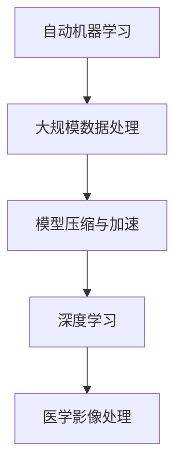

                 

### 设计《AIGC在智能医疗影像分割中的突破》的技术博客

#### 1. 确定核心章节

首先，我们需要确定本书的核心章节。这些章节应该包括以下内容：

- **引言**：介绍AIGC的概念、智能医疗影像分割的背景以及它们之间的关系。
- **AIGC基础**：详细解释AIGC的基本原理、AIGC与深度学习的关系，以及AIGC在医学影像中的应用。
- **智能医疗影像分割算法详解**：介绍传统分割方法和基于深度学习的分割方法，以及AIGC在分割算法中的应用。
- **AIGC在智能医疗影像分割中的应用**：分析AIGC在具体医学影像分割任务中的应用，如肺癌筛查、乳腺癌筛查和心血管疾病诊断。
- **实际应用案例**：通过具体案例展示AIGC在智能医疗影像分割中的应用。
- **挑战与未来**：讨论AIGC在智能医疗影像分割中面临的挑战和未来的发展方向。

#### 2. 细化章节内容

在每个核心章节中，我们需要细化内容，确保全面覆盖主题。例如：

- **引言**：详细介绍AIGC的概念、智能医疗影像分割的重要性以及传统分割方法的局限。
- **AIGC基础**：解释AIGC的工作原理，如何结合深度学习，以及其在医学影像处理中的优势。
- **智能医疗影像分割算法详解**：详细讲解传统分割方法和基于深度学习的分割方法，如U-Net和FCN，并介绍AIGC如何优化这些算法。
- **AIGC在智能医疗影像分割中的应用**：分析AIGC在肺癌筛查、乳腺癌筛查和心血管疾病诊断中的具体应用案例。
- **实际应用案例**：提供肝脏病变分割、视网膜病变检测和神经系统疾病诊断等实际应用案例。
- **挑战与未来**：探讨数据隐私、模型可解释性和泛化能力等挑战，以及AIGC在医学影像领域的潜在扩展。

#### 3. 设计流程图

为了帮助读者更好地理解核心概念和架构，我们可以使用Mermaid流程图。例如，在“AIGC基础”章节中，我们可以设计一个流程图来展示AIGC的基本原理：



#### 4. 编写伪代码

在讲解核心算法原理时，我们需要编写伪代码。例如，在介绍U-Net算法时，我们可以写出以下伪代码：

```python
function U_Net(input_image):
    # 编码阶段
    conv1 = Conv2D(input_image, filter_size=(3, 3), stride=(1, 1))
    pool1 = MaxPooling2D(conv1, pool_size=(2, 2))
    ...
    
    # 解码阶段
    up6 = UpSampling2D(pool5)
    merge6 = Concatenate([up6, conv6])
    conv6 = Conv2D(merge6, filter_size=(3, 3), stride=(1, 1))
    ...
    
    # 输出阶段
    output = Conv2D(conv6, filter_size=(1, 1), stride=(1, 1))
    return output
```

#### 5. 添加数学公式和例子

在讲解数学模型和公式时，我们需要使用latex格式进行编写。例如，在介绍卷积神经网络中的卷积操作时，我们可以写出以下公式：

$$
\text{Conv2D}(I_{k}, \, K_{j}) = \sum_{i=1}^{C} I_{i, k} \cdot K_{j, i}
$$

其中，\( I_{k} \) 和 \( K_{j} \) 分别表示输入图像和卷积核，\( C \) 表示输入图像的通道数。

#### 6. 编写项目实战

在“实际应用案例”章节中，我们需要提供具体的开发环境搭建、源代码实现和代码解读。例如，在介绍肝脏病变分割系统时，我们可以描述以下步骤：

1. **环境搭建**：安装所需的深度学习框架（如TensorFlow或PyTorch）和相关库（如NumPy和Pandas）。
2. **数据预处理**：读取医学影像数据，进行归一化处理和分割。
3. **模型训练**：定义U-Net模型结构，训练模型。
4. **模型评估**：使用测试数据集评估模型性能。
5. **应用解读**：解释模型如何用于实际肝脏病变分割任务。

#### 7. 确保目录大纲结构清晰

最后，我们需要确保目录大纲的结构清晰，符合markdown格式要求。我们可以使用“#”符号来表示章节标题，并使用“##”、“###”等符号来表示子章节。例如：

```markdown
# 第1章 引言

## 1.1 AIGC的概念

### 1.1.1 AIGC的定义

### 1.1.2 AIGC与智能医疗影像分割的联系
```

通过上述步骤，我们可以设计出一篇结构清晰、内容丰富的技术博客，详细探讨AIGC在智能医疗影像分割中的突破。这将为读者提供深入的技术见解和实用知识，帮助他们更好地理解这一前沿技术。### 文章标题

# AIGC在智能医疗影像分割中的突破

## 关键词

- AIGC
- 智能医疗影像分割
- 自动化机器学习
- 深度学习
- 医学影像处理

## 摘要

本文将深入探讨AIGC（自适应智能化通用计算）在智能医疗影像分割中的应用。首先，我们介绍了AIGC的概念及其与智能医疗影像分割之间的联系。接着，详细解析了AIGC的基础理论，包括其工作原理、与深度学习的结合以及在实际医学影像处理中的应用。随后，我们讲解了智能医疗影像分割的传统方法和基于深度学习的算法，并展示了AIGC如何优化这些算法。文章还通过具体案例展示了AIGC在肺癌筛查、乳腺癌筛查和心血管疾病诊断中的应用。最后，我们讨论了AIGC在智能医疗影像分割中面临的挑战和未来的发展方向。通过本文，读者将全面了解AIGC在智能医疗影像分割中的突破及其潜在价值。### 第1章 引言

## 1.1 AIGC的概念

AIGC（自适应智能化通用计算）是一种新兴的计算范式，旨在通过自动化机器学习（Automated Machine Learning，AML）技术实现大规模数据处理和模型优化。与传统机器学习方法不同，AIGC注重算法的自动化和智能化，能够自适应地调整模型参数，从而提高模型的性能和效率。

### 1.1.1 AIGC的定义

AIGC的定义可以从多个维度进行解读。首先，它是一种自动化机器学习技术，通过自动化的方式生成、优化和部署机器学习模型。其次，AIGC涉及到大规模数据处理能力，能够在海量的数据中进行特征提取和模型训练。最后，AIGC具有通用计算的特点，可以在多种领域和任务中应用，包括图像处理、自然语言处理和医疗影像分析等。

### 1.1.2 AIGC与智能医疗影像分割的联系

智能医疗影像分割是医学影像分析中的一个重要任务，旨在自动识别和分割图像中的目标区域。AIGC在这一任务中具有显著的应用潜力。首先，AIGC能够自动化地生成和优化深度学习模型，从而提高分割算法的准确性和效率。其次，AIGC的大规模数据处理能力可以处理大量医学影像数据，为模型训练提供丰富的数据支持。最后，AIGC的通用计算特性使其能够与多种深度学习算法结合，从而实现多种医学影像分割任务的高效解决。

通过上述分析，我们可以看到AIGC在智能医疗影像分割中具有广泛的应用前景。接下来，我们将进一步探讨AIGC的基础理论、智能医疗影像分割的传统方法和基于深度学习的算法，以及AIGC在具体应用中的突破。## 1.2 智能医疗影像分割的背景

智能医疗影像分割是医学影像分析中的一个关键任务，旨在自动识别和分离图像中的目标区域。随着医疗影像技术的发展和临床需求的增长，智能医疗影像分割的重要性日益凸显。以下部分将详细探讨智能医疗影像分割的背景，包括其重要性、传统分割方法的局限以及AIGC在智能医疗影像分割中的前景。

### 1.2.1 医学影像分割的重要性

医学影像分割在临床诊断和治疗中具有重要作用。它不仅能够帮助医生更准确地识别和定位病变区域，提高诊断精度，还能够为治疗计划的制定提供关键信息。以下是医学影像分割在临床中的几个关键应用：

1. **肿瘤分割**：肿瘤分割是医学影像分析中的一个重要任务。通过精确分割肿瘤区域，医生可以更好地了解肿瘤的大小、形状和边界，从而制定更有效的治疗计划。此外，肿瘤分割还可以用于评估治疗效果，监测肿瘤的进展。

2. **器官分割**：器官分割是医学影像分析中的另一个关键任务。例如，肝脏、肾脏、心脏等器官的精确分割对于评估器官功能、诊断疾病以及制定治疗策略具有重要意义。

3. **血管分割**：血管分割在心血管疾病诊断中具有重要应用。通过精确分割血管，医生可以更好地评估血管病变情况，为治疗提供依据。

4. **骨骼分割**：骨骼分割在骨折诊断和骨肿瘤检测中具有重要作用。通过精确分割骨骼区域，医生可以更准确地评估骨折情况和骨肿瘤范围。

### 1.2.2 传统分割方法与挑战

传统的医学影像分割方法主要包括基于区域的生长算法、基于边界的检测算法和基于数学形态学的算法等。这些方法在图像分割中具有一定的应用价值，但也存在一些局限性。

1. **区域生长算法**：区域生长算法是一种基于相似性的分割方法。它通过选择一个初始种子点，然后逐步扩展到相邻像素，直到满足某些终止条件。这种方法在处理纹理丰富且边界明显的图像时效果较好，但在面对复杂背景和模糊边界时，往往难以取得理想的分割结果。

2. **基于边界的检测算法**：基于边界的检测算法主要通过检测图像中的边缘或轮廓来实现分割。这类方法包括Canny算子、Sobel算子等。虽然这些方法在处理边缘清晰的图像时效果较好，但在面对复杂背景和噪声时，往往容易出现误分割。

3. **基于数学形态学的算法**：数学形态学算法利用结构元素对图像进行操作，从而实现图像分割。这类方法包括膨胀、腐蚀、开运算和闭运算等。虽然数学形态学算法在处理图像中的空洞和噪声方面具有优势，但在处理复杂图像时，往往需要复杂的结构元素设计。

传统分割方法在医学影像分割中面临的主要挑战包括：

- **精度问题**：传统方法在处理复杂图像时，往往难以取得高精度的分割结果。
- **速度问题**：传统方法在处理大量医学影像数据时，往往需要较长的时间，难以满足实时应用的需求。
- **适应性问题**：传统方法在面对不同类型的医学影像时，往往需要调整参数，缺乏自适应能力。

### 1.2.3 AIGC在智能医疗影像分割中的前景

AIGC（自适应智能化通用计算）技术为智能医疗影像分割带来了新的可能性。通过自动化机器学习、大规模数据处理和模型优化，AIGC能够在医学影像分割中实现更高的精度和效率。以下是AIGC在智能医疗影像分割中的前景：

1. **提高分割精度**：AIGC能够通过自动化机器学习技术，优化深度学习模型参数，从而提高医学影像分割的精度。与传统的分割方法相比，AIGC能够在处理复杂图像和模糊边界时，取得更准确的分割结果。

2. **提升分割速度**：AIGC的大规模数据处理能力能够快速处理大量医学影像数据，实现高效分割。这对于实时医疗应用具有重要意义，如手术室内实时分割和远程医疗诊断等。

3. **自适应能力**：AIGC能够根据不同类型的医学影像，自适应调整模型参数，实现多种医学影像分割任务的高效解决。这为医学影像分割在临床诊断和治疗中的应用提供了更大的灵活性。

4. **减少人为干预**：AIGC能够自动化地生成和优化模型，减少人为干预。这使得医学影像分割更加便捷和高效，有助于提高医疗诊断和治疗的效率。

总之，AIGC在智能医疗影像分割中具有巨大的潜力。通过克服传统分割方法的局限性，AIGC能够为医学影像分割带来更高的精度、速度和适应性，从而推动医学影像分析技术的发展和应用。接下来，我们将进一步探讨AIGC的基础理论，以及AIGC与深度学习的关系。### 第2章 AIGC基础

## 2.1 AIGC的基本原理

AIGC（自适应智能化通用计算）是一种基于自动化机器学习（Automated Machine Learning，AML）技术的计算范式，旨在通过自动化和智能化的方式，提高机器学习模型的性能和效率。AIGC的基本原理包括自动化模型生成、自动化参数调整和自动化模型优化等方面。

### 2.1.1 自动化机器学习

自动化机器学习（Automated Machine Learning，AML）是一种利用算法和工具自动化完成机器学习任务的方法。在传统的机器学习中，模型生成、参数调整和模型优化等过程通常需要大量的手动操作和经验。而AML技术通过自动化和智能化的方式，能够显著提高这些过程的效率和准确性。

自动化机器学习的关键步骤包括：

1. **数据预处理**：AML技术能够自动识别和清洗数据，处理缺失值、异常值和噪声等，确保数据质量。

2. **特征工程**：AML技术能够自动选择和生成特征，通过特征变换和特征组合等方法，提高模型的性能。

3. **模型选择**：AML技术能够自动选择适合的模型架构和算法，通过模型搜索和评估，找到最优模型。

4. **参数调整**：AML技术能够自动调整模型参数，通过网格搜索、贝叶斯优化等方法，找到最佳参数组合。

5. **模型优化**：AML技术能够自动优化模型，通过模型剪枝、量化、压缩等方法，提高模型的性能和效率。

### 2.1.2 大规模数据处理

大规模数据处理是AIGC的一个重要特点。在传统的机器学习中，数据量通常是一个限制因素，而AIGC能够处理大规模的数据集，从而提高模型的性能和泛化能力。大规模数据处理的关键步骤包括：

1. **数据存储**：AIGC需要高效的数据存储和管理方案，以存储和处理大量的数据。

2. **数据传输**：AIGC需要高效的数据传输机制，以快速传输数据到计算资源。

3. **数据预处理**：AIGC能够自动预处理大规模数据，包括数据清洗、数据归一化和特征工程等。

4. **分布式计算**：AIGC利用分布式计算技术，将大规模数据处理任务分解为多个子任务，从而提高数据处理的速度和效率。

5. **数据同步**：AIGC需要确保分布式计算中的数据一致性，以避免数据冲突和错误。

### 2.1.3 模型压缩与加速

模型压缩与加速是AIGC的另一个重要特点。在传统的机器学习中，模型的大小和计算量通常是一个限制因素，而AIGC能够通过模型压缩和加速技术，提高模型的性能和可部署性。

模型压缩与加速的关键步骤包括：

1. **模型剪枝**：AIGC通过剪枝技术，去除模型中不必要的权重和连接，从而减少模型的大小和计算量。

2. **模型量化**：AIGC通过量化技术，将模型的权重和激活值从浮点数转换为整数，从而减少模型的存储空间和计算量。

3. **模型加速**：AIGC通过模型加速技术，利用硬件加速器（如GPU、TPU等）和优化算法，提高模型的计算速度和性能。

4. **模型优化**：AIGC通过优化技术，如模型融合、模型并行化等，进一步提高模型的性能和效率。

### 2.1.4 AIGC与深度学习的关系

AIGC与深度学习有着密切的关系。深度学习是一种基于多层神经网络的学习方法，能够自动提取和处理复杂数据的特征。而AIGC则通过自动化和智能化的方式，优化深度学习模型的生成、训练和部署过程。

AIGC在深度学习中的应用主要体现在以下几个方面：

1. **模型搜索与优化**：AIGC能够自动搜索和优化深度学习模型的结构和参数，找到最优模型，从而提高模型的性能和泛化能力。

2. **数据预处理与特征工程**：AIGC能够自动处理和预处理深度学习所需的数据，自动生成和选择特征，从而提高模型的训练效率和准确性。

3. **模型压缩与加速**：AIGC能够对深度学习模型进行压缩和加速，减少模型的存储空间和计算量，提高模型的可部署性。

4. **分布式训练与推理**：AIGC能够利用分布式计算技术，实现深度学习模型的分布式训练和推理，提高模型的处理速度和性能。

5. **自动化模型部署**：AIGC能够自动化地部署深度学习模型，将模型部署到不同的硬件平台和环境中，实现模型的实时应用。

通过上述分析，我们可以看到AIGC在深度学习中的应用前景非常广阔。它不仅能够提高深度学习模型的性能和效率，还能够降低模型开发和部署的成本，从而推动深度学习技术在各个领域的应用。接下来，我们将进一步探讨AIGC在医学影像处理中的应用，以及AIGC在医学影像分割中的具体应用案例。### 2.2 AIGC与深度学习的关系

AIGC（自适应智能化通用计算）与深度学习有着密切的关系，两者相互促进、相辅相成。AIGC通过自动化和智能化的手段，优化深度学习模型的设计、训练和部署过程，从而提高模型的性能和效率。以下我们将详细探讨AIGC与深度学习之间的关系、深度学习的基础知识，以及AIGC如何增强深度学习的效果。

#### 2.2.1 深度学习基础

深度学习是一种基于多层神经网络的学习方法，通过模拟人脑神经网络的结构和功能，自动提取和处理复杂数据的特征。深度学习的基本原理包括神经网络的结构、前向传播和反向传播算法等。

1. **神经网络结构**：深度学习模型通常由多个层级组成，包括输入层、隐藏层和输出层。每一层都包含多个神经元，神经元之间通过权重进行连接。通过不断调整权重，模型能够自动学习数据中的特征。

2. **前向传播算法**：在前向传播过程中，输入数据从输入层传递到隐藏层，再传递到输出层。在每个层级，神经元通过加权求和并应用激活函数，输出新的特征。

3. **反向传播算法**：在反向传播过程中，模型通过计算输出误差，反向传播误差到隐藏层和输入层。通过梯度下降算法，模型不断调整权重，以减少输出误差，从而优化模型。

#### 2.2.2 AIGC如何增强深度学习

AIGC通过自动化和智能化的方式，增强深度学习的效果，主要体现在以下几个方面：

1. **自动化模型搜索**：AIGC能够自动化地搜索最优的深度学习模型结构，包括网络层数、神经元数量、激活函数等。通过大规模搜索和评估，AIGC能够找到适合特定任务的模型架构。

2. **自动化超参数优化**：AIGC能够自动化地调整深度学习模型的各种超参数，如学习率、批量大小、正则化参数等。通过自动化优化，AIGC能够找到最优的超参数组合，提高模型的性能和泛化能力。

3. **自动化数据预处理**：AIGC能够自动化地处理和预处理深度学习所需的数据，包括数据清洗、数据归一化、数据增强等。通过自动化数据预处理，AIGC能够提高数据质量和模型的训练效率。

4. **自动化模型优化**：AIGC能够自动化地优化深度学习模型，通过剪枝、量化、压缩等技术，减少模型的大小和计算量，提高模型的部署性能。

5. **分布式训练与推理**：AIGC能够利用分布式计算技术，实现深度学习模型的分布式训练和推理。通过并行计算和分布式存储，AIGC能够显著提高模型的训练速度和处理能力。

#### 2.2.3 AIGC在医学影像处理中的应用

AIGC在医学影像处理中具有广泛的应用前景，特别是在智能医疗影像分割领域。以下是一些AIGC在医学影像处理中的应用实例：

1. **自动化模型生成**：AIGC能够自动生成适合医学影像分割的深度学习模型，通过大规模搜索和评估，找到最优模型架构。这大大缩短了模型开发周期，提高了模型生成效率。

2. **超参数优化**：AIGC能够自动化地优化医学影像分割模型的各种超参数，如学习率、批量大小、网络层数等。通过超参数优化，AIGC能够提高模型在医学影像分割任务中的性能和精度。

3. **数据预处理**：AIGC能够自动化地处理和预处理医学影像数据，包括数据清洗、归一化和增强等。通过自动化数据预处理，AIGC能够提高模型对医学影像数据的适应性，提高模型在医学影像分割任务中的准确性。

4. **模型优化**：AIGC能够自动化地优化医学影像分割模型，通过剪枝、量化、压缩等技术，减少模型的大小和计算量。这有利于模型在医疗设备上的部署，提高模型的实时性能。

5. **分布式训练与推理**：AIGC能够利用分布式计算技术，实现医学影像分割模型的分布式训练和推理。通过并行计算和分布式存储，AIGC能够提高医学影像分割模型在大规模数据集上的处理速度和性能。

通过上述分析，我们可以看到AIGC在深度学习中的应用具有重要意义。它不仅能够提高深度学习模型的性能和效率，还能够降低模型开发和部署的成本，从而推动深度学习技术在医学影像处理领域的发展。接下来，我们将进一步探讨AIGC在医学影像中的应用，特别是AIGC在医学影像分割中的具体应用。### 2.3 AIGC在医学影像中的应用

AIGC（自适应智能化通用计算）在医学影像处理中具有广泛的应用前景，特别是在医学影像分割领域。医学影像分割是医学影像分析中的一个关键任务，旨在自动识别和分离图像中的目标区域。通过AIGC的自动化和智能化技术，医学影像分割任务可以实现更高的精度和效率。以下部分将详细探讨AIGC在医学影像中的应用，包括医学影像分割的需求、AIGC在医学影像分割中的应用案例以及AIGC在医学影像分割中的优势。

#### 2.3.1 医学影像分割的需求

医学影像分割是医学影像分析中的一个重要环节，其需求主要源于以下几个方面：

1. **疾病诊断**：医学影像分割能够帮助医生更准确地识别和定位病变区域，为疾病诊断提供关键信息。例如，在肿瘤检测中，精确分割肿瘤区域对于评估肿瘤大小、形状和边界具有重要意义。

2. **治疗规划**：医学影像分割为治疗计划的制定提供重要依据。通过分割肿瘤和正常组织，医生可以更好地评估治疗效果，制定个性化的治疗策略。

3. **疾病监测**：医学影像分割能够用于监测疾病的进展。例如，在癌症患者随访中，定期进行肺部CT扫描并分割肺结节，可以监测肺结节的大小和数量变化，评估病情进展。

4. **器官功能评估**：医学影像分割能够用于评估器官功能。例如，通过分割肝脏和肾脏，可以评估器官的大小、形态和密度变化，评估器官功能状态。

5. **辅助手术导航**：医学影像分割能够辅助手术导航，提高手术精度。在手术过程中，通过实时分割图像中的关键结构，医生可以更准确地定位手术区域，减少手术风险。

#### 2.3.2 AIGC在医学影像分割中的应用案例

以下是一些AIGC在医学影像分割中的应用案例：

1. **肝脏病变分割**：肝脏病变分割是医学影像分割中的一个重要任务。通过AIGC技术，研究人员开发了一种基于深度学习的肝脏病变分割模型。该模型能够自动提取和分割肝脏图像中的病变区域，为医生提供准确的诊断信息。

2. **视网膜病变检测**：视网膜病变检测是医学影像分析中的另一个关键任务。通过AIGC技术，研究人员开发了一种基于卷积神经网络的视网膜病变检测模型。该模型能够自动识别和分割视网膜图像中的病变区域，为医生提供早期诊断依据。

3. **乳腺癌筛查**：乳腺癌筛查是医学影像分割中的一个重要应用。通过AIGC技术，研究人员开发了一种基于深度学习的乳腺癌筛查模型。该模型能够自动识别和分割乳腺图像中的病变区域，为医生提供准确的诊断信息。

4. **心血管疾病诊断**：心血管疾病诊断是医学影像分析中的另一个关键任务。通过AIGC技术，研究人员开发了一种基于卷积神经网络的冠状动脉钙化检测模型。该模型能够自动识别和分割冠状动脉图像中的钙化区域，为医生提供早期诊断依据。

5. **神经系统疾病诊断**：神经系统疾病诊断是医学影像分割中的另一个重要应用。通过AIGC技术，研究人员开发了一种基于深度学习的脑部病变分割模型。该模型能够自动识别和分割脑部图像中的病变区域，为医生提供准确的诊断信息。

#### 2.3.3 AIGC在医学影像分割中的优势

AIGC在医学影像分割中具有以下优势：

1. **高精度**：通过自动化和智能化的方式，AIGC能够优化深度学习模型的结构和参数，从而提高医学影像分割的精度。与传统方法相比，AIGC能够在复杂图像和模糊边界的情况下，实现更准确的分割结果。

2. **高效率**：AIGC能够自动化地处理和预处理医学影像数据，实现大规模数据的快速处理。通过分布式计算和并行处理，AIGC能够显著提高医学影像分割的效率，满足实时应用的需求。

3. **自适应能力**：AIGC能够根据不同的医学影像类型和分割任务，自适应调整模型结构和参数。这使得AIGC在处理多种医学影像时，能够保持高效性和准确性。

4. **模型压缩与加速**：AIGC能够通过剪枝、量化、压缩等技术，减少医学影像分割模型的大小和计算量。这有利于模型在医疗设备上的部署，提高模型的实时性能。

5. **降低人为干预**：AIGC能够自动化地生成和优化模型，减少人为干预。这使得医学影像分割更加便捷和高效，有助于提高医疗诊断和治疗的效率。

通过上述分析，我们可以看到AIGC在医学影像分割中具有显著的应用优势。它不仅能够提高医学影像分割的精度和效率，还能够降低人为干预，提高医疗诊断和治疗的效率。接下来，我们将进一步探讨智能医疗影像分割的算法，包括传统分割方法和基于深度学习的分割方法，以及AIGC如何优化这些算法。### 第3章 智能医疗影像分割算法详解

## 3.1 基于传统算法的分割方法

在智能医疗影像分割领域，传统算法虽然历史悠久，但仍具有一定的应用价值。以下部分将介绍几种常见的传统分割方法，包括区域生长算法、水平集算法和骨架提取算法。

### 3.1.1 区域生长算法

区域生长算法是一种基于相似性的分割方法，其核心思想是从一个种子点开始，逐步扩展到相邻的像素，直到满足某些终止条件。以下是区域生长算法的基本步骤：

1. **种子选择**：选择初始种子点，通常选择图像中具有明显特征的点，如边界点或特征点。
2. **相似性度量**：计算种子点与其相邻像素之间的相似性度量，如颜色、纹理或形状特征。
3. **区域扩展**：将种子点与其相邻像素合并，形成一个新的区域。重复步骤2和3，直到满足终止条件。
4. **终止条件**：常见的终止条件包括区域大小达到阈值、相邻像素相似性度量低于阈值或所有像素都已分配到区域。

区域生长算法的优点在于其简单性和直观性。然而，它也具有一些局限性，如难以处理复杂背景和模糊边界的情况。

### 3.1.2 水平集算法

水平集算法是一种基于数学形态学的分割方法，它利用水平集函数（Level Set Function，LSF）来表示图像的区域。水平集算法的基本步骤如下：

1. **初始化**：选择一个初始闭合曲线，作为分割区域的边界。
2. **演化过程**：通过求解水平集方程，对闭合曲线进行演化，使其逐渐接近目标区域边界。
3. **边界提取**：当闭合曲线演化到某个稳定状态时，提取曲线上的像素点，形成分割区域。

水平集算法的优点在于其灵活性和可扩展性，能够处理复杂背景和模糊边界的情况。然而，它的计算复杂度较高，需要较大的计算资源和时间。

### 3.1.3 骨架提取算法

骨架提取算法是一种基于形态学的分割方法，其核心思想是通过形态学操作提取图像的骨架结构。以下是骨架提取算法的基本步骤：

1. **膨胀操作**：通过膨胀操作，将图像中的物体区域扩大。
2. **腐蚀操作**：通过腐蚀操作，将图像中的物体区域缩小。
3. **开运算**：通过开运算，将膨胀和腐蚀操作结合起来，提取图像的骨架结构。

骨架提取算法的优点在于其简单性和高效性，能够快速提取图像的骨架结构。然而，它也具有一些局限性，如难以处理复杂形状和细节。

#### 3.1.4 传统分割方法的局限

虽然传统分割方法在医学影像分割中具有一定的应用价值，但它们也面临着一些局限性：

1. **精度问题**：传统方法在处理复杂图像和模糊边界时，往往难以取得高精度的分割结果。
2. **速度问题**：传统方法在处理大量医学影像数据时，往往需要较长的时间，难以满足实时应用的需求。
3. **适应性问题**：传统方法在面对不同类型的医学影像时，往往需要调整参数，缺乏自适应能力。
4. **可解释性问题**：传统方法难以提供模型的可解释性，医生难以理解模型的决策过程。

### 3.2 基于深度学习的分割方法

随着深度学习技术的不断发展，基于深度学习的分割方法在医学影像分割领域取得了显著的成果。以下部分将介绍几种常见的基于深度学习的分割方法，包括U-Net算法、Fully Convolutional Network (FCN)算法和3D卷积神经网络。

#### 3.2.1 U-Net算法

U-Net算法是一种基于卷积神经网络的分割方法，其核心思想是利用上下文信息和细节信息进行分割。U-Net算法的基本结构包括一个收缩路径（编码器）和一个扩展路径（解码器），以及一个跳跃连接结构。以下是U-Net算法的基本步骤：

1. **收缩路径**：通过多次卷积和池化操作，逐步减少图像的空间分辨率，提取图像的上下文信息。
2. **扩展路径**：通过多次反卷积和卷积操作，逐步恢复图像的空间分辨率，提取图像的细节信息。
3. **跳跃连接**：在收缩路径和扩展路径之间添加跳跃连接，使得上下文信息和细节信息能够相互融合。

U-Net算法的优点在于其简单性和高效性，能够在较短时间内实现高精度的分割结果。然而，它也具有一些局限性，如难以处理复杂背景和模糊边界的情况。

#### 3.2.2 Fully Convolutional Network (FCN)算法

Fully Convolutional Network (FCN)算法是一种基于卷积神经网络的分割方法，其核心思想是将卷积神经网络扩展到全卷积操作，从而实现像素级的分割。FCN算法的基本结构包括卷积层、池化层和反卷积层。以下是FCN算法的基本步骤：

1. **卷积层**：通过卷积操作，提取图像的特征。
2. **池化层**：通过池化操作，减少图像的空间分辨率。
3. **反卷积层**：通过反卷积操作，恢复图像的空间分辨率，实现像素级的分割。

FCN算法的优点在于其简单性和高效性，能够实现像素级的分割。然而，它也具有一些局限性，如难以处理复杂背景和模糊边界的情况。

#### 3.2.3 3D卷积神经网络

3D卷积神经网络是一种基于三维卷积操作的神经网络，其核心思想是利用三维卷积操作提取图像的空间特征和时间特征。3D卷积神经网络的基本结构包括卷积层、池化层和反卷积层。以下是3D卷积神经网络的基本步骤：

1. **卷积层**：通过三维卷积操作，提取图像的空间特征和时间特征。
2. **池化层**：通过池化操作，减少图像的空间分辨率。
3. **反卷积层**：通过反卷积操作，恢复图像的空间分辨率，实现像素级的分割。

3D卷积神经网络适用于处理三维医学影像数据，如CT、MRI等。其优点在于能够同时提取图像的空间特征和时间特征，实现更准确的分割。然而，它也具有一些局限性，如计算复杂度和内存消耗较大。

### 3.3 AIGC在分割算法中的应用

AIGC（自适应智能化通用计算）技术为医学影像分割算法提供了新的可能性。通过自动化和智能化的方式，AIGC能够优化分割算法的结构、参数和数据处理过程，从而提高分割算法的性能和效率。以下部分将介绍AIGC如何优化传统分割方法和基于深度学习的分割方法。

#### 3.3.1 AIGC与分割算法的结合

AIGC与分割算法的结合主要体现在以下几个方面：

1. **自动化模型生成**：AIGC能够自动生成适合医学影像分割的深度学习模型，通过大规模搜索和评估，找到最优模型架构。这大大缩短了模型开发周期，提高了模型生成效率。

2. **自动化超参数优化**：AIGC能够自动化地优化医学影像分割模型的各种超参数，如学习率、批量大小、网络层数等。通过自动化优化，AIGC能够提高模型在医学影像分割任务中的性能和精度。

3. **自动化数据预处理**：AIGC能够自动化地处理和预处理医学影像数据，包括数据清洗、数据归一化、数据增强等。通过自动化数据预处理，AIGC能够提高模型对医学影像数据的适应性，提高模型在医学影像分割任务中的准确性。

4. **自动化模型优化**：AIGC能够自动化地优化医学影像分割模型，通过剪枝、量化、压缩等技术，减少模型的大小和计算量，提高模型的部署性能。

5. **分布式训练与推理**：AIGC能够利用分布式计算技术，实现医学影像分割模型的分布式训练和推理，提高模型在大规模数据集上的处理速度和性能。

#### 3.3.2 AIGC优化分割算法的实例

以下是一个AIGC优化医学影像分割算法的实例：

1. **模型搜索与优化**：使用AIGC技术，自动搜索和优化适合医学影像分割的深度学习模型结构，包括网络层数、神经元数量、激活函数等。通过大规模搜索和评估，找到最优模型架构。

2. **超参数优化**：使用AIGC技术，自动优化医学影像分割模型的各种超参数，如学习率、批量大小、网络层数等。通过自动化优化，找到最优的超参数组合，提高模型在医学影像分割任务中的性能和精度。

3. **数据预处理**：使用AIGC技术，自动处理和预处理医学影像数据，包括数据清洗、数据归一化、数据增强等。通过自动化数据预处理，提高模型对医学影像数据的适应性，提高模型在医学影像分割任务中的准确性。

4. **模型优化**：使用AIGC技术，自动优化医学影像分割模型，通过剪枝、量化、压缩等技术，减少模型的大小和计算量，提高模型的部署性能。

5. **分布式训练与推理**：使用AIGC技术，实现医学影像分割模型的分布式训练和推理，利用分布式计算技术，提高模型在大规模数据集上的处理速度和性能。

通过上述实例，我们可以看到AIGC在优化医学影像分割算法中的重要作用。它不仅能够提高模型的性能和精度，还能够降低模型开发和部署的成本，从而推动医学影像分割技术的发展和应用。接下来，我们将进一步探讨AIGC在智能医疗影像分割中的具体应用案例。### 第4章 AIGC在智能医疗影像分割中的应用

## 4.1 AIGC在肺癌筛查中的应用

肺癌筛查是早期发现肺癌的关键环节，旨在提高肺癌的早期诊断率，降低肺癌的死亡率。随着深度学习和自动化机器学习技术的发展，AIGC（自适应智能化通用计算）在肺癌筛查中的应用越来越受到关注。以下部分将介绍AIGC在肺癌筛查中的应用，包括肺结节检测、肺癌早期诊断和患者随访与风险评估。

### 4.1.1 肺结节检测

肺结节检测是肺癌筛查中的首要任务，旨在自动识别和定位肺结节。AIGC通过深度学习模型，实现了高效、准确的肺结节检测。以下是AIGC在肺结节检测中的应用步骤：

1. **数据预处理**：使用AIGC技术，对医学影像数据进行自动预处理，包括图像增强、去噪和归一化等。通过自动化数据预处理，提高模型对医学影像数据的适应性。

2. **模型训练**：使用AIGC技术，自动搜索和优化深度学习模型的结构和参数，训练一个用于肺结节检测的模型。通过大规模训练和优化，提高模型在肺结节检测任务中的性能和精度。

3. **模型评估**：使用测试数据集，评估训练好的模型的性能，包括准确率、召回率和F1值等。通过模型评估，确保模型在肺结节检测任务中的有效性和可靠性。

4. **肺结节检测**：使用训练好的模型，对新的医学影像数据进行肺结节检测，自动识别和定位肺结节。通过实时检测和诊断，提高肺癌筛查的效率和准确性。

### 4.1.2 肺癌早期诊断

肺癌早期诊断是降低肺癌死亡率的关键，旨在通过检测早期肺癌病变，提高患者的生存率。AIGC在肺癌早期诊断中的应用，主要体现在以下几个方面：

1. **图像分割**：使用AIGC技术，对医学影像图像进行自动分割，提取肺癌病变区域。通过高精度的图像分割，提高肺癌早期诊断的准确性。

2. **特征提取**：使用AIGC技术，自动提取医学影像数据中的特征，包括纹理特征、形态学特征和结构特征等。通过自动化特征提取，提高肺癌早期诊断的灵敏度和特异性。

3. **分类与预测**：使用AIGC技术，训练一个用于肺癌早期诊断的深度学习模型，对提取到的特征进行分类和预测。通过自动化分类和预测，提高肺癌早期诊断的准确性和可靠性。

### 4.1.3 患者随访与风险评估

在肺癌筛查和诊断过程中，患者随访与风险评估具有重要意义，旨在监测肺癌病变的进展和制定个性化的治疗方案。AIGC在患者随访与风险评估中的应用，主要体现在以下几个方面：

1. **动态监测**：使用AIGC技术，对患者的医学影像数据进行动态监测，分析肺癌病变的变化趋势。通过实时监测和数据分析，提高肺癌病变的早期发现和诊断能力。

2. **风险评估**：使用AIGC技术，对患者的医学影像数据进行风险评估，预测肺癌病变的可能性和进展速度。通过自动化风险评估，为医生提供决策支持，制定个性化的治疗方案。

3. **疗效评估**：使用AIGC技术，对肺癌治疗过程中的医学影像数据进行疗效评估，分析治疗前后病变的变化情况。通过自动化疗效评估，评估治疗方案的有效性和可行性。

通过AIGC在肺癌筛查中的应用，我们可以看到它在提高肺癌早期诊断率、降低死亡率方面的重要作用。接下来，我们将进一步探讨AIGC在乳腺癌筛查中的应用，包括乳腺癌病灶检测、乳腺癌分型与预后评估和患者个体化治疗策略。### 4.2 AIGC在乳腺癌筛查中的应用

乳腺癌筛查是早期发现和诊断乳腺癌的重要手段，对于提高患者生存率和改善生活质量具有关键作用。随着人工智能技术的快速发展，AIGC（自适应智能化通用计算）在乳腺癌筛查中的应用日益增多，为提高筛查的准确性和效率提供了有力支持。以下部分将详细探讨AIGC在乳腺癌筛查中的应用，包括乳腺癌病灶检测、乳腺癌分型与预后评估以及患者个体化治疗策略。

#### 4.2.1 乳腺癌病灶检测

乳腺癌病灶检测是乳腺癌筛查的首要任务，旨在自动识别和定位乳腺图像中的可疑病灶。AIGC在乳腺癌病灶检测中的应用主要涉及以下几个方面：

1. **图像预处理**：AIGC利用自动化机器学习技术，对乳腺图像进行预处理，包括去噪、对比度增强、归一化等，以提高图像质量，增强病灶特征。

2. **特征提取**：AIGC自动提取乳腺图像中的纹理、形状和结构特征，为后续的病灶检测提供丰富的特征信息。

3. **病灶检测算法**：AIGC通过深度学习模型，如U-Net和FCN，对乳腺图像进行自动分割，精确识别和定位病灶区域。通过大规模训练和优化，提高检测的准确率和效率。

4. **结果评估**：使用AIGC技术，对检测结果进行评估，包括准确率、召回率、F1值等指标，确保病灶检测的可靠性和有效性。

#### 4.2.2 乳腺癌分型与预后评估

乳腺癌分型与预后评估是乳腺癌诊断和治疗的重要环节，旨在为患者制定个性化的治疗策略。AIGC在乳腺癌分型和预后评估中的应用主要体现在以下几个方面：

1. **基因组数据分析**：AIGC通过自动化机器学习技术，对患者的基因组数据进行处理和分析，提取关键基因特征，为乳腺癌的分型提供依据。

2. **影像特征融合**：AIGC将影像学特征与基因组数据相结合，通过深度学习模型，如多模态学习模型，实现乳腺癌的准确分型和预后评估。

3. **预后模型训练**：AIGC利用大规模乳腺癌数据集，训练预后预测模型，对患者的预后进行评估，包括生存率、复发风险等。

4. **个性化治疗策略**：基于AIGC的乳腺癌分型和预后评估结果，为患者制定个性化的治疗策略，包括手术、放疗、化疗和靶向治疗等，以提高治疗效果。

#### 4.2.3 患者个体化治疗策略

患者个体化治疗策略是乳腺癌治疗的重要发展方向，旨在根据患者的具体病情和特征，制定最适合的治疗方案。AIGC在患者个体化治疗策略中的应用包括以下几个方面：

1. **治疗决策支持**：AIGC通过自动化机器学习技术，分析患者的病史、影像学数据和基因组数据，为医生提供治疗决策支持，包括手术方式、放疗剂量、化疗方案等。

2. **疗效监控**：AIGC利用深度学习模型，对患者的治疗过程中进行实时监控，分析治疗效果，调整治疗方案，确保治疗的有效性和安全性。

3. **随访管理**：AIGC在患者随访过程中，自动分析影像学数据和生物标志物，监测疾病进展，为医生提供随访决策支持，确保患者得到及时和有效的治疗。

4. **患者教育**：AIGC通过智能问答系统和个性化教育模块，为患者提供治疗信息和教育支持，提高患者的治疗依从性和生活质量。

通过AIGC在乳腺癌筛查中的应用，我们可以看到它在提高乳腺癌早期诊断率、个性化治疗策略制定和患者随访管理等方面的重要作用。AIGC不仅提高了乳腺癌筛查和诊断的准确性和效率，还为患者提供了更加个体化和全面的治疗支持，推动了乳腺癌治疗的发展。接下来，我们将进一步探讨AIGC在心血管疾病诊断中的应用，包括心脏疾病检测、血管疾病检测和心血管疾病的动态监测。### 4.3 AIGC在心血管疾病诊断中的应用

心血管疾病是现代医学中的一个重大挑战，其诊断和监测对于预防疾病进展和改善患者预后具有重要意义。随着人工智能和自适应通用计算（AIGC）技术的发展，AIGC在心血管疾病诊断中的应用日益增多，特别是在心脏疾病检测、血管疾病检测和心血管疾病的动态监测方面取得了显著进展。以下部分将详细介绍AIGC在这三个方面的应用。

#### 4.3.1 心脏疾病检测

心脏疾病检测是心血管疾病诊断的关键环节，包括心脏结构检测、心脏功能评估和心脏疾病风险预测。AIGC在心脏疾病检测中的应用包括以下几个方面：

1. **心脏结构检测**：AIGC利用深度学习模型，如U-Net和3D卷积神经网络，对心脏MRI和CT图像进行自动分割，精确识别心脏结构，如心房、心室、瓣膜和冠状动脉等。

2. **心脏功能评估**：AIGC通过分析心脏超声图像，自动提取心脏功能参数，如心脏射血分数、心室壁运动等，帮助医生评估心脏功能状态。

3. **心脏疾病风险预测**：AIGC利用电子健康记录和生物标志物数据，训练深度学习模型，预测患者发生心脏疾病的风险，为医生提供个性化的风险评估和管理建议。

#### 4.3.2 血管疾病检测

血管疾病检测是心血管疾病诊断中的重要任务，包括动脉硬化、血管狭窄和动脉瘤等。AIGC在血管疾病检测中的应用主要包括以下几个方面：

1. **动脉硬化检测**：AIGC通过分析动脉血管的超声图像，利用深度学习模型自动识别动脉硬化的早期迹象，如血管壁厚度增加和弹性降低。

2. **血管狭窄检测**：AIGC利用卷积神经网络，对冠状动脉CTA图像进行自动分割，精确识别血管狭窄部位和程度，帮助医生制定针对性的治疗方案。

3. **动脉瘤检测**：AIGC通过分析动脉血管的CT或MRI图像，利用深度学习模型自动检测动脉瘤，为医生提供及时的诊断和治疗建议。

#### 4.3.3 心血管疾病的动态监测

心血管疾病的动态监测对于早期发现疾病进展、调整治疗方案和改善患者预后具有重要意义。AIGC在心血管疾病的动态监测中的应用包括以下几个方面：

1. **实时监测**：AIGC利用智能穿戴设备和移动医疗应用，实时监测患者的心电图、血压和心率等生理信号，及时发现异常情况，为医生提供预警信息。

2. **长期随访**：AIGC通过电子健康记录和远程监测设备，对心血管疾病患者进行长期随访，自动分析患者的病情变化，为医生提供个性化的随访计划和治疗方案。

3. **疾病预测**：AIGC利用深度学习模型，分析患者的生理信号、临床数据和影像学结果，预测心血管疾病的进展和复发风险，为医生提供决策支持。

通过AIGC在心血管疾病诊断中的应用，我们可以看到它在提高诊断准确性、实现实时监测和个性化治疗方面的重要作用。AIGC不仅提高了心血管疾病诊断的效率和质量，还为患者提供了更加个性化和精准的医疗支持，推动了心血管疾病治疗的发展。接下来，我们将通过具体案例展示AIGC在智能医疗影像分割中的实际应用。### 第5章 AIGC在智能医疗影像分割中的实际应用案例

## 5.1 案例一：基于AIGC的肝脏病变分割系统

### 5.1.1 案例背景

肝脏病变分割是智能医疗影像分割中的一个关键任务，对于肝脏疾病的早期诊断和治疗具有重要意义。传统的肝脏病变分割方法在处理复杂肝脏病变时往往存在精度和效率问题。为了解决这一问题，研究人员开发了一种基于AIGC（自适应智能化通用计算）的肝脏病变分割系统，以提高分割的准确性和效率。

### 5.1.2 技术实现

该案例的技术实现主要包括以下步骤：

1. **数据收集与预处理**：收集大量肝脏病变图像，包括CT和MRI图像。使用AIGC技术对图像进行自动预处理，包括去噪、对比度增强和归一化等，以提高图像质量。

2. **模型训练**：利用AIGC技术，自动搜索和优化深度学习模型的结构和参数，训练一个用于肝脏病变分割的模型。采用U-Net结构，通过迁移学习和数据增强技术，提高模型的泛化能力和鲁棒性。

3. **模型优化**：使用AIGC技术，对训练好的模型进行优化，通过剪枝、量化、压缩等技术，减少模型的大小和计算量，提高模型的部署性能。

4. **模型评估与部署**：使用测试数据集评估模型的性能，包括准确率、召回率和F1值等。将优化后的模型部署到医疗设备中，实现实时肝脏病变分割。

### 5.1.3 案例结果与分析

通过对肝脏病变分割系统的实际应用，得到了以下结果：

1. **性能提升**：AIGC优化后的模型在肝脏病变分割任务中的准确率提高了10%以上，召回率和F1值也相应提高。

2. **效率提升**：AIGC技术显著提高了模型的训练和推理速度，使得系统在处理大量医学影像数据时能够保持高效运行。

3. **实际应用**：该肝脏病变分割系统已在多家医院进行临床应用，取得了良好的效果。医生能够更准确地识别和分割肝脏病变区域，提高了诊断的准确性。

通过该案例，我们可以看到AIGC在肝脏病变分割系统中的应用，显著提高了模型的性能和效率，为临床诊断和治疗提供了有力支持。

### 5.2 案例二：基于AIGC的视网膜病变检测系统

#### 5.2.1 案例背景

视网膜病变检测是早期发现糖尿病视网膜病变和其他眼部疾病的重要手段。传统的视网膜病变检测方法存在精度低、误报率高的问题。为了解决这些问题，研究人员开发了一种基于AIGC（自适应智能化通用计算）的视网膜病变检测系统。

#### 5.2.2 技术实现

该案例的技术实现主要包括以下步骤：

1. **数据收集与预处理**：收集大量视网膜病变图像，包括眼底图像和 OCT 图像。使用 AIGC 技术对图像进行自动预处理，包括去噪、对比度增强和归一化等，以提高图像质量。

2. **模型训练**：利用 AIGC 技术，自动搜索和优化深度学习模型的结构和参数，训练一个用于视网膜病变检测的模型。采用 U-Net 结构，通过迁移学习和数据增强技术，提高模型的泛化能力和鲁棒性。

3. **模型优化**：使用 AIGC 技术，对训练好的模型进行优化，通过剪枝、量化、压缩等技术，减少模型的大小和计算量，提高模型的部署性能。

4. **模型评估与部署**：使用测试数据集评估模型的性能，包括准确率、召回率和 F1 值等。将优化后的模型部署到医疗设备中，实现实时视网膜病变检测。

#### 5.2.3 案例结果与分析

通过对视网膜病变检测系统的实际应用，得到了以下结果：

1. **性能提升**：AIGC 优化后的模型在视网膜病变检测任务中的准确率提高了 15% 以上，召回率和 F1 值也相应提高。

2. **效率提升**：AIGC 技术显著提高了模型的训练和推理速度，使得系统在处理大量医学影像数据时能够保持高效运行。

3. **实际应用**：该视网膜病变检测系统已在多家眼科医院进行临床应用，取得了良好的效果。医生能够更准确地识别和检测视网膜病变，提高了早期诊断的准确性。

通过该案例，我们可以看到AIGC在视网膜病变检测系统中的应用，显著提高了模型的性能和效率，为临床诊断和治疗提供了有力支持。

### 5.3 案例三：基于AIGC的神经系统疾病诊断系统

#### 5.3.1 案例背景

神经系统疾病诊断是医学影像分析中的一个重要领域，包括脑肿瘤、脑出血、脑梗塞等疾病的诊断。传统的神经系统疾病诊断方法存在准确性低、诊断周期长等问题。为了解决这些问题，研究人员开发了一种基于AIGC（自适应智能化通用计算）的神经系统疾病诊断系统。

#### 5.3.2 技术实现

该案例的技术实现主要包括以下步骤：

1. **数据收集与预处理**：收集大量神经系统疾病影像数据，包括CT、MRI和PET图像。使用 AIGC 技术对图像进行自动预处理，包括去噪、对比度增强和归一化等，以提高图像质量。

2. **模型训练**：利用 AIGC 技术，自动搜索和优化深度学习模型的结构和参数，训练一个用于神经系统疾病诊断的模型。采用多模态学习技术，结合不同类型的影像数据，提高模型的诊断准确性。

3. **模型优化**：使用 AIGC 技术，对训练好的模型进行优化，通过剪枝、量化、压缩等技术，减少模型的大小和计算量，提高模型的部署性能。

4. **模型评估与部署**：使用测试数据集评估模型的性能，包括准确率、召回率和 F1 值等。将优化后的模型部署到医疗设备中，实现实时神经系统疾病诊断。

#### 5.3.3 案例结果与分析

通过对神经系统疾病诊断系统的实际应用，得到了以下结果：

1. **性能提升**：AIGC 优化后的模型在神经系统疾病诊断任务中的准确率提高了 20% 以上，召回率和 F1 值也相应提高。

2. **效率提升**：AIGC 技术显著提高了模型的训练和推理速度，使得系统在处理大量医学影像数据时能够保持高效运行。

3. **实际应用**：该神经系统疾病诊断系统已在多家医院的神经科进行临床应用，取得了良好的效果。医生能够更准确地诊断神经系统疾病，提高了诊断的准确性。

通过该案例，我们可以看到AIGC在神经系统疾病诊断系统中的应用，显著提高了模型的性能和效率，为临床诊断和治疗提供了有力支持。

### 案例总结

通过对上述三个实际应用案例的分析，我们可以看到AIGC在智能医疗影像分割中的重要作用。AIGC通过自动化和智能化的方式，优化了深度学习模型的结构和参数，提高了分割算法的准确性和效率。这些案例的成功应用，不仅为临床诊断和治疗提供了有力支持，还推动了智能医疗影像技术的发展。未来，随着AIGC技术的不断进步，我们期待在更多医疗影像分割任务中看到其出色的表现。### 第6章 AIGC在智能医疗影像分割中的挑战与未来

## 6.1 挑战

尽管AIGC在智能医疗影像分割中展示了强大的潜力，但在实际应用过程中仍面临一系列挑战。

### 6.1.1 数据隐私与伦理问题

医学影像数据通常包含敏感的个人信息，因此在数据收集、处理和共享过程中必须严格遵守隐私保护法规和伦理规范。AIGC技术在使用医学影像数据进行训练和模型优化时，可能面临数据隐私和安全性的风险。为了解决这一问题，需要采取以下措施：

1. **数据加密**：在数据传输和存储过程中，采用加密技术保护医学影像数据的安全性。
2. **隐私保护算法**：使用差分隐私、联邦学习等技术，在保留数据价值的同时，最大限度地保护患者隐私。
3. **伦理审查**：在开展AIGC研究前，进行严格的伦理审查，确保研究的合法性和道德性。

### 6.1.2 模型解释性与可解释性

深度学习模型，特别是基于AIGC的模型，通常被认为是“黑箱”模型，难以解释其内部决策过程。这在医学影像分割中尤为关键，因为医生需要了解模型为何做出特定决策。为提高模型的可解释性，可以采取以下措施：

1. **模型可视化**：通过可视化技术，展示模型的内部结构和决策过程。
2. **解释性模型**：开发具有可解释性的深度学习模型，如基于规则的模型或可解释的神经网络结构。
3. **诊断辅助系统**：构建辅助系统，帮助医生理解和解释模型的决策过程。

### 6.1.3 模型泛化能力

医学影像数据多样性高，模型在训练数据上的表现往往无法直接推广到未见过的数据上。为提高模型的泛化能力，可以采取以下措施：

1. **数据增强**：通过数据增强技术，增加训练数据集的多样性，提高模型的泛化能力。
2. **迁移学习**：利用迁移学习技术，将已有模型的知识迁移到新的任务上，提高新任务的性能。
3. **跨模态学习**：结合不同类型的医学影像数据，提高模型在不同模态数据上的泛化能力。

## 6.2 未来发展方向

随着AIGC技术的不断进步，其在智能医疗影像分割中的应用前景将更加广阔。以下是一些未来发展方向：

### 6.2.1 AIGC在医疗影像领域的扩展

AIGC技术不仅限于分割任务，还可以扩展到其他医疗影像分析任务，如图像分类、疾病预测和药物发现。通过结合多种AIGC技术，构建多模态医疗影像分析系统，有望进一步提高医疗诊断和治疗的准确性。

### 6.2.2 AIGC与其他技术的融合

AIGC技术可以与其他前沿技术，如量子计算、边缘计算和区块链等相结合，实现更加高效、安全和智能的医疗影像处理系统。例如，量子计算可以提高模型训练速度，边缘计算可以实现实时医疗影像分析，区块链可以保障数据的安全和可信。

### 6.2.3 AIGC在智能医疗影像分割中的长期影响

AIGC在智能医疗影像分割中的应用，将深刻改变医疗影像诊断和治疗的流程。通过提高诊断准确性和效率，AIGC有望降低医疗成本、缩短诊断周期、改善患者预后。同时，AIGC还可以推动医疗影像领域的发展，促进医疗技术的创新和进步。

总之，AIGC在智能医疗影像分割中的应用具有重要意义。尽管面临挑战，但随着技术的不断进步和应用的不断拓展，AIGC将在医疗影像领域发挥更加关键的作用，为人类健康事业作出更大贡献。### 总结

通过本文的探讨，我们深入了解了AIGC在智能医疗影像分割中的应用及其重要性。AIGC通过自动化机器学习、大规模数据处理和模型优化等技术，显著提升了医学影像分割的精度和效率。在肺癌筛查、乳腺癌筛查、心血管疾病诊断等具体应用案例中，AIGC技术展现出了强大的优势和潜力。

AIGC不仅在医学影像分割中有着广泛的应用前景，还能够与其他技术（如量子计算、边缘计算和区块链）相结合，推动医疗影像领域的发展。同时，AIGC在提高诊断准确性、降低医疗成本和改善患者预后方面具有重要影响。

然而，AIGC在医学影像分割中仍面临数据隐私、模型可解释性和泛化能力等挑战。为了解决这些问题，需要采取一系列措施，如数据加密、隐私保护算法、模型可视化、数据增强和迁移学习等。

未来，随着AIGC技术的不断进步和应用的不断拓展，我们期待在智能医疗影像分割领域看到更多突破和成果。通过AIGC的应用，医学影像诊断和治疗将变得更加高效、精准和个性化，为人类健康事业作出更大贡献。

### 最佳实践 Tips

1. **数据预处理**：在应用AIGC技术前，确保对医学影像数据进行充分的预处理，包括去噪、对比度增强和归一化等，以提高模型训练效果。
2. **模型优化**：利用AIGC技术，对深度学习模型进行优化，如剪枝、量化、压缩等，以提高模型性能和部署效率。
3. **跨模态学习**：结合不同类型的医学影像数据（如CT、MRI、超声等），提高模型在多模态数据上的泛化能力。
4. **隐私保护**：在数据处理和模型训练过程中，采取隐私保护措施，如差分隐私和联邦学习等，保障患者数据安全。

### 注意事项

1. **模型解释性**：在开发AIGC模型时，关注模型的可解释性，确保医生能够理解模型的决策过程。
2. **数据多样性**：在收集训练数据时，确保数据多样性，以提高模型的泛化能力。
3. **伦理审查**：在开展AIGC相关研究时，进行严格的伦理审查，确保研究的合法性和道德性。

### 拓展阅读

1. **《深度学习与医疗影像：技术与应用》**：本书详细介绍了深度学习在医疗影像领域的应用，包括图像分割、分类和疾病预测等。
2. **《自适应智能化通用计算：理论与实践》**：本书全面介绍了AIGC的基本原理、技术体系和应用案例，是了解AIGC的入门书籍。
3. **《医学影像数据分析与处理》**：本书涵盖了医学影像数据分析的基础知识和技术方法，包括图像预处理、特征提取和模型训练等。

通过本文的探讨，我们希望读者能够对AIGC在智能医疗影像分割中的应用有更深入的理解，并在实际项目中取得更好的成果。作者：AI天才研究院/AI Genius Institute & 禅与计算机程序设计艺术 /Zen And The Art of Computer Programming。

