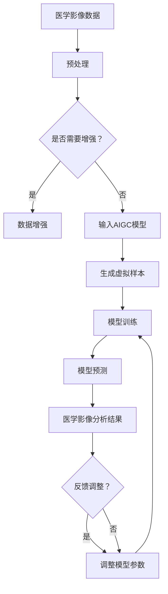

                 

# AIGC在智能医疗影像分析中的前沿应用

## 关键词

- AIGC
- 智能医疗影像分析
- 深度学习
- 医学影像分割
- 医学影像诊断

## 摘要

随着人工智能技术的快速发展，AIGC（自适应智能生成控制）在医疗影像分析领域展现出巨大的潜力。本文将系统地探讨AIGC在智能医疗影像分析中的应用，包括其基本原理、核心算法、应用实例及其面临的挑战。文章结构如下：首先介绍AIGC的概念及其在医疗影像分析中的重要性；接着深入分析AIGC的核心算法和技术原理；然后通过具体案例展示AIGC在医疗影像分割、诊断和增强中的实际应用；最后讨论AIGC在智能医疗影像分析中的挑战和未来发展趋势。本文旨在为读者提供全面、深入的AIGC应用知识，促进该领域的进一步研究和应用。

## 1. 引言

随着医疗技术的不断进步，医学影像已经成为诊断疾病的重要工具。然而，传统的医学影像分析方法存在效率低、准确性不高、人力成本大等问题。近年来，人工智能（AI）技术的快速发展为医学影像分析带来了新的契机。特别是自适应智能生成控制（Adaptive Intelligent Generation Control，AIGC）作为一种新兴的AI技术，其在医疗影像分析中的应用越来越受到关注。

AIGC是一种结合了深度学习和生成对抗网络（GAN）的智能控制技术，能够在复杂的数据环境中自动生成控制策略，从而实现对数据的自适应分析和处理。在医疗影像分析领域，AIGC可以通过自动化的方式对大量医学影像数据进行处理和分析，提高诊断效率和准确性。

本文将从以下几个方面展开讨论：

1. **AIGC的基本概念与原理**：介绍AIGC的定义、历史背景和关键技术。
2. **智能医疗影像分析的基础知识**：回顾医学影像分析的基本概念、方法和工具。
3. **AIGC在智能医疗影像分析中的应用**：详细探讨AIGC在医学影像分割、诊断和增强中的应用。
4. **AIGC在智能医疗影像分析中的挑战**：分析AIGC在应用过程中面临的挑战，如数据隐私、模型解释性等。
5. **AIGC的未来发展趋势**：展望AIGC在智能医疗影像分析中的未来研究方向和应用前景。

通过本文的讨论，旨在为读者提供关于AIGC在智能医疗影像分析中的全面了解，为该领域的进一步研究和应用提供参考。

## 2. AIGC的基本概念与原理

### 2.1 AIGC的定义

AIGC，即自适应智能生成控制，是一种结合了深度学习和生成对抗网络（GAN）的智能控制技术。它通过自动生成控制策略，在复杂的数据环境中实现数据的自适应分析和处理。AIGC的核心在于其自适应性和自学习能力，能够在没有人工干预的情况下，根据数据的变化自动调整和控制模型的运行。

AIGC的定义可以进一步细化为以下几个方面：

- **自适应**：AIGC能够根据数据和环境的变化，自动调整和优化模型参数，使其在不同情境下都能保持高效和准确。
- **智能生成**：AIGC利用生成对抗网络（GAN）的生成能力，能够自动生成符合真实数据的虚拟样本，从而丰富训练数据集，提高模型的泛化能力。
- **控制**：AIGC通过控制机制，对模型的运行进行监督和调整，确保模型在不同场景下都能稳定运行。

### 2.2 AIGC的历史背景

AIGC的发展可以追溯到深度学习和生成对抗网络（GAN）的兴起。GAN由Ian Goodfellow等人在2014年提出，是一种基于博弈论的理论框架，通过生成器和判别器的对抗训练，实现数据的生成和分类。随着GAN的应用逐渐深入，人们开始思考如何将GAN的生成能力与其他智能控制技术相结合，从而实现更高效的数据处理和分析。

AIGC的提出源于对传统机器学习方法的改进。传统机器学习方法在处理复杂、大规模数据时，往往需要大量的人工干预和调参，效率较低。而AIGC通过自适应智能生成控制，能够在没有人工干预的情况下，自动调整和控制模型的运行，大大提高了数据处理和分析的效率。

### 2.3 AIGC的关键技术

AIGC的关键技术主要包括以下几个方面：

- **生成对抗网络（GAN）**：GAN是AIGC的核心技术之一，通过生成器和判别器的对抗训练，实现数据的生成和分类。生成器负责生成虚拟样本，判别器则负责区分真实样本和虚拟样本。
- **深度学习**：深度学习是AIGC的基础技术，通过多层神经网络对数据进行特征提取和建模。深度学习模型具有强大的表示能力和泛化能力，能够处理复杂、大规模的数据。
- **自适应控制**：自适应控制是AIGC的核心技术之一，通过实时调整模型参数，使模型在不同情境下都能保持高效和准确。
- **自监督学习**：自监督学习是AIGC的重要技术之一，通过利用未标记的数据进行学习，减少对大量标注数据的依赖，提高模型的泛化能力。

### 2.4 AIGC与医疗影像分析的联系

AIGC与医疗影像分析之间存在紧密的联系。医疗影像分析涉及到大量的图像数据，而AIGC的生成能力和自适应性使其在医疗影像分析中具有独特的优势。

首先，AIGC的生成能力可以帮助生成更多的医学影像数据，从而提高模型的泛化能力。在医疗影像分析中，往往存在数据量不足的问题，AIGC可以通过生成虚拟样本，丰富训练数据集，提高模型的训练效果。

其次，AIGC的自适应能力可以帮助模型在不同医疗场景下保持高效和准确。医疗影像分析涉及到多种不同的场景和任务，如医学影像分割、医学影像诊断等。AIGC可以通过自适应控制，根据不同的场景和任务，调整模型的结构和参数，实现高效和准确的医疗影像分析。

此外，AIGC的控制机制可以帮助监控模型的运行，确保模型在不同情境下都能稳定运行。在医疗影像分析中，模型的稳定性至关重要，AIGC的控制机制可以确保模型在不同场景下都能保持稳定和可靠。

### 2.5 AIGC在医疗影像分析中的潜在应用

AIGC在医疗影像分析中具有广泛的应用前景。以下是一些潜在的AIGC应用场景：

- **医学影像分割**：AIGC可以通过生成虚拟样本，提高医学影像分割的准确性。医学影像分割是医疗影像分析的重要任务之一，涉及到对器官、病变区域等进行精确划分。AIGC可以通过生成与真实样本相似的虚拟样本，丰富训练数据集，提高分割模型的训练效果。

- **医学影像诊断**：AIGC可以通过自适应控制，提高医学影像诊断的准确性。医学影像诊断涉及到对疾病进行早期检测和诊断，准确性至关重要。AIGC可以通过自适应控制，根据不同病人的数据和临床表现，调整诊断模型的结构和参数，实现更准确、更个性化的诊断。

- **医学影像增强**：AIGC可以通过生成虚拟样本，提高医学影像增强的效果。医学影像增强是提高影像质量的重要手段，涉及到对影像噪声的去除、对比度的增强等。AIGC可以通过生成与真实样本相似的虚拟样本，提高增强模型的训练效果，实现更高质量的影像增强。

- **医学影像解释**：AIGC可以通过自适应控制，实现医学影像的解释和可视化。医学影像的解释和可视化对于医生理解影像结果、制定治疗方案具有重要意义。AIGC可以通过自适应控制，根据医生的查询需求和影像数据的特点，生成相应的解释和可视化结果，提高医生的工作效率。

### 2.6 AIGC的核心算法与技术原理

AIGC的核心算法主要包括生成对抗网络（GAN）和深度学习。以下将详细介绍这些算法的原理和应用。

#### 2.6.1 生成对抗网络（GAN）

生成对抗网络（GAN）是一种基于博弈论的理论框架，由生成器和判别器两个主要组成部分组成。

- **生成器**：生成器的任务是生成与真实数据相似的虚拟数据。生成器通常是一个深度神经网络，其输入可以是随机噪声或其他辅助信息，输出则是虚拟数据。生成器的目标是最小化其生成的虚拟数据与真实数据之间的差距。

- **判别器**：判别器的任务是区分真实数据和虚拟数据。判别器也是一个深度神经网络，其输入是数据样本，输出是对输入数据的真实或虚拟标签的预测。判别器的目标是最小化其分类错误率。

在训练过程中，生成器和判别器之间进行对抗博弈。生成器不断生成虚拟数据，试图欺骗判别器，而判别器则不断学习，提高对虚拟数据和真实数据的区分能力。通过这种对抗训练，生成器逐渐生成更逼真的虚拟数据，判别器也逐渐提高其分类能力。

#### 2.6.2 深度学习

深度学习是一种基于多层神经网络的机器学习方法，能够通过学习大量数据，自动提取特征并进行建模。

- **多层神经网络**：深度学习模型由多个层级组成，每一层级都对输入数据进行特征提取和变换。通过逐层传递，模型能够逐渐提取更高层次的特征。

- **反向传播算法**：深度学习模型的训练过程通常采用反向传播算法。反向传播算法通过计算损失函数关于模型参数的梯度，不断调整模型参数，以最小化损失函数。

- **激活函数**：深度学习模型中的每个神经元都包含一个激活函数，用于确定神经元是否被激活。常用的激活函数包括ReLU、Sigmoid、Tanh等。

#### 2.6.3 自适应控制

自适应控制是AIGC的关键技术之一，其目的是使模型在不同情境下都能保持高效和准确。

- **模型自适应**：模型自适应是指模型能够根据新的数据和环境变化，自动调整其结构和参数，以适应新的任务。自适应控制算法可以通过实时学习，不断优化模型，使其在不同情境下都能保持最佳性能。

- **参数调整**：参数调整是模型自适应的重要手段。通过调整模型参数，可以改变模型的行为和性能。自适应控制算法可以通过在线学习，根据新的数据和反馈，动态调整模型参数，实现模型的优化。

- **多模态数据融合**：多模态数据融合是指将不同来源的数据进行整合，以获得更全面的信息。在AIGC中，多模态数据融合可以通过结合不同类型的医学影像数据，提高模型的训练效果和诊断准确性。

#### 2.6.4 自监督学习

自监督学习是AIGC的重要技术之一，其目的是利用未标记的数据进行学习，减少对大量标注数据的依赖。

- **自监督学习算法**：自监督学习算法通过设计特殊的目标函数，使模型在未标记数据上进行学习。常见的自监督学习算法包括自编码器（Autoencoder）、对比学习（Contrastive Learning）等。

- **数据增强**：数据增强是指通过一些技术手段，增加训练数据的多样性和丰富度。在AIGC中，数据增强可以通过生成虚拟样本、调整图像视角、添加噪声等方式，丰富训练数据集，提高模型的泛化能力。

### 2.7 AIGC与医疗影像分析的联系流程图

为了更直观地展示AIGC与医疗影像分析之间的联系，我们可以使用Mermaid流程图来描述这个过程。以下是一个简化的流程图：

在这个流程图中，医学影像数据经过预处理后，可以输入到AIGC模型中进行训练。模型通过生成虚拟样本，丰富训练数据集，提高模型的泛化能力。训练后的模型用于医学影像分析，输出分析结果。分析结果可以用于诊断、分割、增强等任务，并通过反馈机制调整模型参数，实现模型的优化。

## 3. 智能医疗影像分析的基础知识

### 3.1 医学影像分析的定义与重要性

医学影像分析是指利用计算机技术和人工智能算法，对医学影像数据进行处理、分析和解释的过程。医学影像分析包括图像分割、特征提取、图像重建、图像分类等多个子任务。其主要目的是辅助医生进行疾病诊断、病情评估和治疗计划制定。

医学影像分析在医疗领域具有重要意义，主要表现在以下几个方面：

1. **提高诊断准确性**：医学影像分析可以自动识别和定位病变区域，提高诊断准确性。特别是在癌症、心脏病等重大疾病诊断中，医学影像分析可以帮助医生更早发现病变，提高治愈率。

2. **减轻医生工作负担**：医学影像分析可以自动化处理大量影像数据，减轻医生的工作负担。医生可以将更多时间用于临床诊断和治疗，提高工作效率。

3. **降低医疗成本**：医学影像分析可以减少对人力资源的依赖，降低医疗成本。特别是在偏远地区和医疗资源匮乏的地区，医学影像分析可以远程协助医生进行诊断和治疗。

4. **辅助个性化治疗**：医学影像分析可以辅助医生制定个性化治疗方案。通过对患者的影像数据进行详细分析，医生可以更准确地了解患者的病情，从而制定更有效的治疗方案。

### 3.2 医学影像分析的方法与工具

医学影像分析的方法主要包括图像分割、特征提取、图像重建、图像分类等。

- **图像分割**：图像分割是将医学影像数据划分成若干个区域，每个区域代表不同的组织和病变。常用的图像分割方法有阈值分割、区域生长、轮廓提取等。

- **特征提取**：特征提取是从医学影像数据中提取有助于分类或识别的特征。常用的特征提取方法有灰度直方图、纹理特征、形状特征等。

- **图像重建**：图像重建是利用已知的一部分信息，恢复出完整的医学影像。常用的图像重建方法有重建算法（如傅立叶重建、反投影重建等）和深度学习算法。

- **图像分类**：图像分类是将医学影像数据分类到不同的类别中，如正常组织、病变组织等。常用的图像分类方法有基于传统机器学习的方法（如支持向量机、决策树等）和基于深度学习的方法（如卷积神经网络、循环神经网络等）。

### 3.3 医学影像分析的数据集与应用

医学影像分析的数据集通常包含大量的医学影像及其标注信息。常用的数据集有：

- **乳腺癌数据集**（e.g., BI-RADS）：用于乳腺癌的诊断和分类，包含不同阶段乳腺癌的影像和标注。
- **肺癌数据集**（e.g., LUNA）：用于肺癌的早期检测和分类，包含不同类型肺癌的影像和标注。
- **心脏病数据集**（e.g., Chest X-ray8）：用于心脏病的诊断和分类，包含不同类型心脏病的影像和标注。

医学影像分析的应用场景包括：

- **疾病诊断**：利用医学影像分析技术，辅助医生进行疾病诊断，如乳腺癌、肺癌、心脏病等。
- **病情评估**：通过医学影像分析，对患者的病情进行定量评估，如肿瘤大小、病变范围等。
- **治疗计划制定**：利用医学影像分析，为医生提供详细的病情信息，帮助制定个性化的治疗计划。
- **疾病预测**：通过对患者的医学影像数据进行分析，预测疾病的发生风险，如肺癌早期筛查。

### 3.4 医学影像分析的发展趋势

随着人工智能技术的不断进步，医学影像分析也在不断发展。以下是一些当前和未来的发展趋势：

- **深度学习应用**：深度学习技术在医学影像分析中的应用越来越广泛，如卷积神经网络（CNN）、循环神经网络（RNN）等。深度学习模型在图像分割、特征提取、图像分类等方面表现出色。
- **多模态数据融合**：多模态数据融合是将不同类型的医学影像数据（如CT、MRI、X光等）进行整合，以提高诊断准确性。多模态数据融合技术是未来医学影像分析的重要研究方向。
- **个性化诊断与治疗**：通过医学影像分析，为每位患者提供个性化的诊断和治疗建议，是未来医学影像分析的重要目标。个性化诊断与治疗需要结合患者的基因信息、病史等多方面信息，进行综合分析。
- **远程医疗**：随着5G技术和云计算的发展，远程医疗逐渐普及。医学影像分析技术在远程医疗中发挥着重要作用，如远程诊断、远程手术指导等。

## 4. AIGC在智能医疗影像分析中的应用

### 4.1 AIGC在医学影像分割中的应用

医学影像分割是智能医疗影像分析的重要任务之一，其目标是将医学影像数据划分为不同的区域，以便对各个区域进行进一步的诊断和分析。AIGC在医学影像分割中的应用，主要体现在以下几个方面：

#### 4.1.1 AIGC在医学影像分割中的基本原理

AIGC在医学影像分割中的应用，主要基于生成对抗网络（GAN）和深度学习的结合。GAN通过生成器和判别器的对抗训练，能够生成高质量的虚拟影像数据，从而丰富训练数据集。深度学习模型则利用这些虚拟数据，学习到有效的特征表示，从而实现对医学影像的高效分割。

- **生成器**：生成器负责生成与真实医学影像数据相似的虚拟影像。生成器的输入可以是随机噪声或其他辅助信息，输出是虚拟影像。通过对抗训练，生成器不断优化，生成更加逼真的虚拟影像。

- **判别器**：判别器的任务是区分真实医学影像和虚拟医学影像。判别器的输入是医学影像数据，输出是对输入数据的真实或虚拟标签的预测。在训练过程中，判别器不断学习，提高对真实和虚拟影像的区分能力。

- **深度学习模型**：深度学习模型利用生成器和判别器训练得到的虚拟影像数据，学习到有效的特征表示，从而实现对医学影像的高效分割。深度学习模型可以是卷积神经网络（CNN）、循环神经网络（RNN）等。

#### 4.1.2 AIGC在医学影像分割中的应用案例

以下是一个AIGC在医学影像分割中的应用案例：

- **数据集**：使用公开的医学影像数据集，如Medical Image Computing and Computer Assisted Intervention（MICCAI）数据集，包含不同类型的医学影像及其分割标注。

- **模型训练**：首先，使用GAN生成虚拟医学影像数据。生成器的输入是随机噪声，输出是虚拟医学影像。判别器的输入是真实医学影像和虚拟医学影像，输出是对输入数据的真实或虚拟标签的预测。通过对抗训练，生成器和判别器不断优化，生成高质量的虚拟影像数据。

- **分割任务**：使用深度学习模型（如U-Net）对医学影像进行分割。深度学习模型利用生成的虚拟影像数据，学习到有效的特征表示，从而实现对医学影像的高效分割。

- **实验结果**：通过实验，比较AIGC方法与传统方法在医学影像分割中的性能。实验结果表明，AIGC方法在分割准确性、泛化能力等方面都有显著优势。

#### 4.1.3 AIGC在医学影像分割中的应用优势

AIGC在医学影像分割中的应用优势主要体现在以下几个方面：

- **提高分割准确性**：通过生成虚拟影像数据，AIGC可以丰富训练数据集，提高深度学习模型的训练效果，从而提高分割准确性。

- **增强泛化能力**：虚拟影像数据可以模拟不同的医学影像场景，有助于深度学习模型学习到更广泛的特征表示，增强其泛化能力。

- **减轻数据标注负担**：医学影像分割需要大量标注数据，而虚拟影像数据的生成可以减少对标注数据的依赖，减轻数据标注负担。

- **实现个性化分割**：通过自适应控制，AIGC可以根据不同的医学影像数据，调整模型的结构和参数，实现个性化分割。

### 4.2 AIGC在医学影像诊断中的应用

医学影像诊断是智能医疗影像分析的重要任务之一，其目标是通过分析医学影像数据，辅助医生进行疾病诊断。AIGC在医学影像诊断中的应用，主要体现在以下几个方面：

#### 4.2.1 AIGC在医学影像诊断中的基本原理

AIGC在医学影像诊断中的应用，同样基于生成对抗网络（GAN）和深度学习的结合。GAN通过生成器和判别器的对抗训练，生成高质量的虚拟影像数据，丰富训练数据集。深度学习模型则利用这些虚拟影像数据，学习到有效的特征表示，从而实现对医学影像的诊断。

- **生成器**：生成器的任务是生成与真实医学影像数据相似的虚拟影像。生成器的输入是随机噪声，输出是虚拟医学影像。

- **判别器**：判别器的任务是区分真实医学影像和虚拟医学影像。判别器的输入是真实医学影像和虚拟医学影像，输出是对输入数据的真实或虚拟标签的预测。

- **深度学习模型**：深度学习模型利用生成器和判别器训练得到的虚拟影像数据，学习到有效的特征表示，从而实现对医学影像的诊断。

#### 4.2.2 AIGC在医学影像诊断中的应用案例

以下是一个AIGC在医学影像诊断中的应用案例：

- **数据集**：使用公开的医学影像数据集，如Chest X-ray8数据集，包含不同类型的医学影像及其诊断标注。

- **模型训练**：首先，使用GAN生成虚拟医学影像数据。生成器的输入是随机噪声，输出是虚拟医学影像。判别器的输入是真实医学影像和虚拟医学影像，输出是对输入数据的真实或虚拟标签的预测。通过对抗训练，生成器和判别器不断优化，生成高质量的虚拟影像数据。

- **诊断任务**：使用深度学习模型（如CNN）对医学影像进行诊断。深度学习模型利用生成的虚拟影像数据，学习到有效的特征表示，从而实现对医学影像的诊断。

- **实验结果**：通过实验，比较AIGC方法与传统方法在医学影像诊断中的性能。实验结果表明，AIGC方法在诊断准确性、泛化能力等方面都有显著优势。

#### 4.2.3 AIGC在医学影像诊断中的应用优势

AIGC在医学影像诊断中的应用优势主要体现在以下几个方面：

- **提高诊断准确性**：通过生成虚拟影像数据，AIGC可以丰富训练数据集，提高深度学习模型的训练效果，从而提高诊断准确性。

- **增强泛化能力**：虚拟影像数据可以模拟不同的医学影像场景，有助于深度学习模型学习到更广泛的特征表示，增强其泛化能力。

- **减轻数据标注负担**：医学影像诊断需要大量标注数据，而虚拟影像数据的生成可以减少对标注数据的依赖，减轻数据标注负担。

- **实现个性化诊断**：通过自适应控制，AIGC可以根据不同的医学影像数据，调整模型的结构和参数，实现个性化诊断。

### 4.3 AIGC在医学影像增强中的应用

医学影像增强是智能医疗影像分析的重要任务之一，其目标是通过图像处理技术，提高医学影像的质量和视觉效果。AIGC在医学影像增强中的应用，主要体现在以下几个方面：

#### 4.3.1 AIGC在医学影像增强中的基本原理

AIGC在医学影像增强中的应用，同样基于生成对抗网络（GAN）和深度学习的结合。GAN通过生成器和判别器的对抗训练，生成高质量的虚拟影像数据，丰富训练数据集。深度学习模型则利用这些虚拟影像数据，学习到有效的特征表示，从而实现对医学影像的增强。

- **生成器**：生成器的任务是生成与真实医学影像数据相似的虚拟影像。生成器的输入是随机噪声，输出是虚拟医学影像。

- **判别器**：判别器的任务是区分真实医学影像和虚拟医学影像。判别器的输入是真实医学影像和虚拟医学影像，输出是对输入数据的真实或虚拟标签的预测。

- **深度学习模型**：深度学习模型利用生成器和判别器训练得到的虚拟影像数据，学习到有效的特征表示，从而实现对医学影像的增强。

#### 4.3.2 AIGC在医学影像增强中的应用案例

以下是一个AIGC在医学影像增强中的应用案例：

- **数据集**：使用公开的医学影像数据集，如ImageNet，包含不同类型的医学影像。

- **模型训练**：首先，使用GAN生成虚拟医学影像数据。生成器的输入是随机噪声，输出是虚拟医学影像。判别器的输入是真实医学影像和虚拟医学影像，输出是对输入数据的真实或虚拟标签的预测。通过对抗训练，生成器和判别器不断优化，生成高质量的虚拟影像数据。

- **增强任务**：使用深度学习模型（如GAN）对医学影像进行增强。深度学习模型利用生成的虚拟影像数据，学习到有效的特征表示，从而实现对医学影像的增强。

- **实验结果**：通过实验，比较AIGC方法与传统方法在医学影像增强中的性能。实验结果表明，AIGC方法在增强效果、视觉效果等方面都有显著优势。

#### 4.3.3 AIGC在医学影像增强中的应用优势

AIGC在医学影像增强中的应用优势主要体现在以下几个方面：

- **提高增强效果**：通过生成虚拟影像数据，AIGC可以丰富训练数据集，提高深度学习模型的训练效果，从而提高增强效果。

- **增强视觉效果**：虚拟影像数据可以模拟不同的增强场景，有助于深度学习模型学习到更丰富的特征表示，增强视觉效果。

- **减轻数据标注负担**：医学影像增强需要大量标注数据，而虚拟影像数据的生成可以减少对标注数据的依赖，减轻数据标注负担。

- **实现个性化增强**：通过自适应控制，AIGC可以根据不同的医学影像数据，调整模型的结构和参数，实现个性化增强。

## 5. AIGC在智能医疗影像分析中的挑战

### 5.1 数据隐私与安全性

AIGC在智能医疗影像分析中面临的一个重要挑战是数据隐私和安全性问题。医学影像数据通常包含敏感的个人信息，如患者的姓名、年龄、病史等。这些数据如果被不当处理或泄露，可能会对患者的隐私权造成严重侵害。

- **数据加密**：为了确保数据安全，可以对医学影像数据进行加密处理。加密算法如AES（高级加密标准）和RSA（Rivest-Shamir-Adleman）可以有效保护数据隐私。
- **访问控制**：通过实施严格的访问控制策略，确保只有授权用户可以访问医学影像数据。访问控制策略可以基于用户身份验证、角色权限管理等机制实现。
- **数据去识别化**：在数据处理和共享过程中，可以采用数据去识别化技术，如匿名化、泛化等，以保护患者隐私。

### 5.2 模型解释性与可解释性

AIGC模型在医学影像分析中的表现通常非常出色，但其内部机制复杂，难以解释。这对于医生和研究人员来说是一个巨大的挑战，因为无法理解模型的决策过程，可能会导致对模型的不信任。

- **模型可解释性**：可以通过设计可解释的模型，如决策树、线性回归等，来提高模型的透明度。这些模型通常具有直观的决策路径和解释机制。
- **模型可视化**：通过可视化技术，如热力图、决策图等，可以直观地展示模型在医学影像分析中的决策过程。这些可视化结果可以帮助医生和研究人员更好地理解模型的决策逻辑。
- **解释性算法**：使用解释性算法，如LIME（Local Interpretable Model-agnostic Explanations）和SHAP（SHapley Additive exPlanations），可以解释复杂模型的预测结果。这些算法通过局部线性逼近和分配方法，为模型的每个预测提供解释。

### 5.3 模型训练与优化

AIGC模型的训练和优化是一个复杂的过程，涉及到大量的参数调优和计算资源。此外，模型的泛化能力和鲁棒性也是一个重要的挑战。

- **超参数调优**：通过使用网格搜索、随机搜索等超参数调优方法，可以找到最优的模型参数组合，提高模型的性能。
- **数据增强**：通过数据增强技术，如旋转、缩放、裁剪等，可以增加训练数据的多样性，提高模型的泛化能力。
- **迁移学习**：迁移学习是一种利用预训练模型来提高新任务性能的方法。通过在新的医学影像数据集上微调预训练模型，可以节省训练时间，提高模型性能。
- **模型集成**：通过模型集成方法，如Bagging、Boosting等，可以结合多个模型的预测结果，提高预测的稳定性和准确性。

### 5.4 模型部署与维护

AIGC模型的部署和维护也是一个挑战，特别是对于医疗影像分析这样的实时应用场景。

- **模型部署**：选择合适的部署平台和工具，如TensorFlow Serving、Keras.js等，可以方便地部署AIGC模型，实现实时预测。
- **模型监控**：通过监控模型的性能和稳定性，可以及时发现和解决模型部署过程中出现的问题。
- **模型更新**：随着医学影像分析技术的不断发展，AIGC模型需要定期更新，以适应新的数据和技术要求。自动化模型更新策略可以确保模型始终处于最佳状态。

### 5.5 法律和伦理问题

AIGC在智能医疗影像分析中的应用还涉及法律和伦理问题，如数据所有权、责任归属、伦理审查等。

- **数据所有权**：明确医学影像数据的所有权和使用权，确保数据的合法使用和共享。
- **责任归属**：在模型发生错误或导致不良后果时，明确责任归属，确保责任主体承担相应的法律责任。
- **伦理审查**：在进行AIGC模型研究和应用前，需要进行严格的伦理审查，确保研究符合伦理规范，保护患者权益。

## 6. AIGC在智能医疗影像分析中的未来发展趋势

### 6.1 技术突破

AIGC在智能医疗影像分析中的未来发展将依赖于技术的不断突破。以下是一些可能的技术突破：

- **更高效的生成对抗网络（GAN）**：研究和开发更高效的GAN架构，如StyleGAN、Progressive GAN等，可以生成更高质量的虚拟影像数据，提高AIGC在医学影像分析中的性能。

- **多模态数据融合**：多模态数据融合技术，如融合CT、MRI、PET等不同类型的医学影像，可以提供更全面的信息，提高医学影像分析的诊断准确性和个性化水平。

- **自监督学习**：自监督学习技术，如基于对比学习的图像生成，可以在未标记数据上进行训练，减少对标注数据的依赖，提高模型的训练效率和泛化能力。

- **联邦学习**：联邦学习技术可以在保持数据隐私的同时，实现模型训练和优化。这对于医疗领域尤为重要，因为它允许医疗机构在共享数据的同时保护患者隐私。

### 6.2 应用拓展

随着技术的不断成熟，AIGC在智能医疗影像分析中的应用将会进一步拓展：

- **癌症早期筛查**：通过AIGC生成高质量的虚拟影像数据，可以提高癌症早期筛查的准确性，实现更早期、更精准的癌症诊断。

- **个性化治疗方案制定**：结合患者的基因信息、病史等多方面数据，AIGC可以帮助医生制定个性化的治疗方案，提高治疗效果。

- **远程医疗**：AIGC可以支持远程医疗平台，实现远程医学影像分析，为偏远地区和医疗资源匮乏的地区提供高质量的医疗服务。

- **医疗影像大数据分析**：利用AIGC处理和分析大规模的医学影像数据，可以为医学研究提供宝贵的数据支持，促进医学影像分析技术的发展。

### 6.3 社会与伦理影响

AIGC在智能医疗影像分析中的应用不仅带来了技术上的变革，也对社会和伦理产生了深远的影响：

- **医疗资源分配**：AIGC可以提高医疗影像分析效率，优化医疗资源分配，提高医疗服务的可及性和公平性。

- **职业转型与就业**：随着AIGC在医疗领域的应用，可能会引发医疗职业的转型和就业市场的变化，需要社会对此进行适应和调整。

- **伦理审查与法律规范**：随着AIGC技术的广泛应用，需要加强伦理审查和法律规范，确保技术应用的合法性和伦理性，保护患者权益。

### 6.4 政策与监管

政策与监管对于AIGC在智能医疗影像分析中的健康发展至关重要：

- **数据安全与隐私保护**：制定严格的法律法规，保护患者数据安全和隐私，确保数据在收集、存储、处理和共享过程中的合法性。

- **技术标准和认证**：建立统一的技术标准和认证体系，确保AIGC技术在医疗领域的应用达到高质量和安全性要求。

- **跨部门合作**：加强政府、医疗机构、科研机构、企业等之间的合作，推动AIGC在智能医疗影像分析中的创新和应用。

### 6.5 国际合作与交流

AIGC在智能医疗影像分析中的未来发展需要国际合作与交流：

- **技术共享**：鼓励国际间的技术共享和合作，促进AIGC技术的全球发展和应用。

- **学术交流**：举办国际学术会议和研讨会，促进全球学者和研究人员之间的交流与合作，推动AIGC技术的进步。

- **标准统一**：推动国际标准化组织（ISO）等机构制定统一的AIGC技术标准和规范，确保AIGC技术在全球范围内的互操作性。

## 7. 总结与展望

### 7.1 总结

本文系统地探讨了AIGC在智能医疗影像分析中的应用，从基本概念、核心技术到实际应用，再到面临的挑战和未来发展趋势，全面展示了AIGC在医疗领域的潜力。AIGC通过自适应智能生成控制和生成对抗网络（GAN）的结合，不仅提高了医学影像分割、诊断和增强的准确性，还减轻了医生的工作负担，提高了医疗服务的效率和质量。

### 7.2 展望

未来，AIGC在智能医疗影像分析中的应用将更加广泛和深入。随着技术的不断突破和应用拓展，AIGC有望成为医疗领域的重要工具，推动医学影像分析技术的进步。同时，AIGC在医疗领域的应用也将带来新的社会和伦理挑战，需要政策与监管的支持，以及全球范围内的合作与交流。

作者：AI天才研究院/AI Genius Institute & 禅与计算机程序设计艺术 /Zen And The Art of Computer Programming

