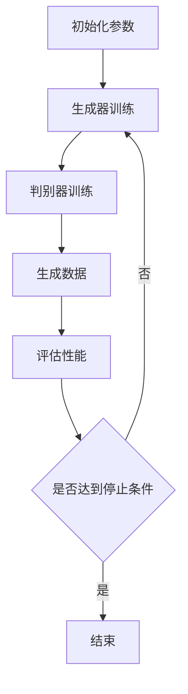

                 

# AIGC在智能城市规划中的应用

## 关键词

- AIGC
- 智能城市规划
- 应用案例
- 算法原理
- 数学模型
- 项目实战

## 摘要

本文深入探讨了AIGC（人工智能生成内容）在智能城市规划中的应用。首先，我们介绍了AIGC的定义、发展历程和主要类型。然后，我们详细阐述了智能城市规划的基本概念、发展历程、关键技术和挑战。接下来，通过实际应用案例，展示了AIGC在智能规划中的重要性。我们进一步讲解了AIGC算法原理，包括生成模型、对抗网络等。同时，我们介绍了AIGC在智能规划中的数学模型，包括优化模型、预测模型等。随后，通过一个具体的AIGC项目实战，详细展示了开发环境搭建、源代码实现和代码解读。最后，我们对AIGC在智能规划中的应用前景进行了展望。

## 引言

智能城市规划是利用现代信息技术，特别是人工智能（AI）技术，对城市规划进行智能化管理和优化。随着AI技术的不断进步，AIGC（人工智能生成内容）作为一种新的AI技术，在智能城市规划中的应用日益广泛。AIGC通过生成新的数据、图像、文本等内容，为城市规划提供了丰富的信息资源和智能化的工具。本文将详细探讨AIGC在智能城市规划中的应用，旨在为城市规划者和研究者提供有价值的参考。

## AIGC基础

### 定义与发展

AIGC，即人工智能生成内容，是指利用AI技术自动生成数据、图像、文本等内容的技术。它起源于生成对抗网络（GAN）的提出，经过多年的发展，已经形成了一套完整的理论体系和应用方法。

生成对抗网络（GAN）是由Ian Goodfellow等人于2014年提出的一种新型深度学习模型。GAN由生成器和判别器两个部分组成，生成器负责生成数据，判别器负责判断生成数据是否真实。通过两个网络的对抗训练，生成器逐渐提高生成数据的质量，从而实现自动生成内容的目的。

### 类型与应用

AIGC的主要类型包括图像生成、文本生成、音频生成等。图像生成方面，AIGC可以用于图像修复、图像超分辨率、图像风格转换等；文本生成方面，AIGC可以用于文本摘要、机器翻译、文本生成等；音频生成方面，AIGC可以用于音乐创作、语音合成等。

在智能城市规划中，AIGC的应用主要包括以下几个方面：

1. **城市规划模拟**：利用AIGC生成模拟城市环境，帮助规划者评估不同规划方案的可行性。
2. **环境分析**：通过AIGC生成环境数据，帮助规划者分析城市环境质量，优化城市规划。
3. **建筑设计**：利用AIGC生成建筑设计方案，为城市规划提供多样化的选择。
4. **交通规划**：通过AIGC生成交通流量数据，帮助规划者优化交通网络。

## 智能城市规划原理

### 基本概念

智能城市规划是指利用现代信息技术，特别是人工智能技术，对城市规划进行智能化管理和优化。它主要包括以下几个方面的内容：

1. **城市信息管理**：利用大数据、物联网等技术，对城市各类信息进行采集、存储、分析和利用。
2. **城市模拟**：通过仿真技术，模拟城市的发展过程，为城市规划提供科学依据。
3. **城市优化**：利用优化算法，对城市规划方案进行优化，提高城市规划的效率和效果。
4. **城市智能服务**：利用人工智能技术，为市民提供智能化的生活、工作、娱乐等服务。

### 发展历程

智能城市规划的发展历程可以分为以下几个阶段：

1. **传统城市规划阶段**：以人工经验为主，城市规划依赖于专家的知识和经验。
2. **信息化城市规划阶段**：引入计算机技术，通过数据分析和模拟，提高城市规划的科学性。
3. **智能化城市规划阶段**：利用人工智能技术，实现城市规划的自动化和智能化。
4. **智能城市规划阶段**：通过大数据、物联网、人工智能等技术，实现城市信息的高度融合和智能化管理。

### 关键技术

智能城市规划的关键技术主要包括：

1. **大数据技术**：用于城市数据的采集、存储、分析和利用。
2. **物联网技术**：用于城市各类设备的互联，实现城市信息的实时采集和反馈。
3. **人工智能技术**：用于城市数据的分析和处理，实现城市规划的智能化。
4. **仿真技术**：用于城市规划的模拟和评估，提高城市规划的可靠性。

### 挑战

智能城市规划面临的挑战主要包括：

1. **数据隐私**：城市数据涉及个人隐私，如何在确保数据安全的前提下进行数据分析和利用，是一个重要的问题。
2. **算法透明度**：人工智能算法的决策过程往往不够透明，如何提高算法的透明度，是一个重要的挑战。
3. **技术更新**：随着人工智能技术的快速发展，城市规划技术也需要不断更新，如何适应技术变革，是一个重要的问题。

## AIGC在智能规划中的实际应用

### 案例一：城市规划模拟

在城市规划模拟中，AIGC可以生成模拟城市环境，帮助规划者评估不同规划方案的可行性。例如，利用AIGC生成不同交通规划方案的城市交通流量数据，规划者可以通过分析这些数据，选择最优的交通规划方案。

具体实现步骤如下：

1. **数据收集**：收集城市交通流量数据，包括车辆数量、行驶速度、行驶路线等。
2. **数据预处理**：对收集到的数据进行分析和清洗，去除无效数据，保留有效数据。
3. **模型训练**：利用AIGC生成模型，对预处理后的数据进行训练，生成模拟城市环境。
4. **方案评估**：利用生成的模拟城市环境，对不同的交通规划方案进行评估，选择最优方案。

### 案例二：环境分析

在环境分析中，AIGC可以生成环境数据，帮助规划者分析城市环境质量，优化城市规划。例如，利用AIGC生成空气质量数据，规划者可以通过分析这些数据，优化城市绿化布局，提高空气质量。

具体实现步骤如下：

1. **数据收集**：收集城市空气质量数据，包括PM2.5、PM10、SO2、NO2等指标。
2. **数据预处理**：对收集到的数据进行分析和清洗，去除无效数据，保留有效数据。
3. **模型训练**：利用AIGC生成模型，对预处理后的数据进行训练，生成环境数据。
4. **方案评估**：利用生成的环境数据，对不同的城市规划方案进行评估，选择最优方案。

### 案例三：建筑设计

在建筑设计中，AIGC可以生成建筑设计方案，为城市规划提供多样化的选择。例如，利用AIGC生成不同的建筑设计方案，规划者可以通过对比不同方案，选择最优的设计方案。

具体实现步骤如下：

1. **数据收集**：收集建筑设计数据，包括建筑结构、建筑材料、建筑风格等。
2. **数据预处理**：对收集到的数据进行分析和清洗，去除无效数据，保留有效数据。
3. **模型训练**：利用AIGC生成模型，对预处理后的数据进行训练，生成建筑设计方案。
4. **方案评估**：利用生成的建筑设计方案，对不同的建筑风格和结构进行评估，选择最优方案。

### 案例四：交通规划

在交通规划中，AIGC可以生成交通流量数据，帮助规划者优化交通网络。例如，利用AIGC生成不同交通规划方案的城市交通流量数据，规划者可以通过分析这些数据，优化交通网络。

具体实现步骤如下：

1. **数据收集**：收集城市交通流量数据，包括车辆数量、行驶速度、行驶路线等。
2. **数据预处理**：对收集到的数据进行分析和清洗，去除无效数据，保留有效数据。
3. **模型训练**：利用AIGC生成模型，对预处理后的数据进行训练，生成模拟城市交通环境。
4. **方案评估**：利用生成的模拟城市交通环境，对不同的交通规划方案进行评估，选择最优方案。

## AIGC算法原理

### 生成模型

生成模型是AIGC的核心组成部分，用于生成新的数据。生成模型可以分为两类：基于统计模型的生成模型和基于神经网络的生成模型。

1. **基于统计模型的生成模型**：这类模型通常使用概率分布来生成数据。例如，马尔可夫链模型可以用于生成序列数据，贝叶斯网络模型可以用于生成图数据。

2. **基于神经网络的生成模型**：这类模型通常使用深度神经网络来学习数据的生成过程。生成对抗网络（GAN）是一种典型的基于神经网络的生成模型，它由生成器和判别器两个部分组成。

### 对抗网络

对抗网络是生成模型的一种重要类型，它通过生成器和判别器的对抗训练，实现数据的生成。生成器负责生成数据，判别器负责判断生成数据是否真实。

对抗网络的训练过程可以分为以下几个步骤：

1. **初始化**：初始化生成器和判别器的参数。
2. **生成器训练**：生成器通过生成假数据，与判别器进行对抗训练，提高生成数据的质量。
3. **判别器训练**：判别器通过判断生成数据和真实数据，提高对真实数据的识别能力。
4. **迭代训练**：重复上述步骤，直到生成器和判别器达到理想的性能。

### AIGC算法流程图

AIGC算法的流程图如下所示：



## AIGC在智能规划中的数学模型

### 优化模型

优化模型用于在智能规划中寻找最优解。常见的优化模型包括线性规划、非线性规划、整数规划等。

1. **线性规划**：线性规划用于在给定约束条件下，寻找线性目标函数的最大值或最小值。
2. **非线性规划**：非线性规划用于在给定约束条件下，寻找非线性目标函数的最大值或最小值。
3. **整数规划**：整数规划用于在给定约束条件下，寻找整数解。

### 预测模型

预测模型用于在智能规划中预测未来的情况。常见的预测模型包括时间序列预测、回归分析、神经网络预测等。

1. **时间序列预测**：时间序列预测用于预测未来的时间序列数据。
2. **回归分析**：回归分析用于预测一个或多个因变量与自变量之间的关系。
3. **神经网络预测**：神经网络预测用于通过学习历史数据，预测未来的数据。

### 伪代码

以下是一个简单的AIGC优化模型的伪代码：

```python
# 初始化参数
生成器参数 = 初始化参数()
判别器参数 = 初始化参数()

# 迭代训练
for i in 范围(1, 最大迭代次数):
    # 生成器训练
    生成器参数 = 生成器训练(生成器参数, 判别器参数)

    # 判别器训练
    判别器参数 = 判别器训练(生成器参数, 判别器参数)

    # 评估性能
    性能指标 = 评估性能(生成器参数, 判别器参数)

    # 输出结果
    输出结果(性能指标)
```

## AIGC项目实战

### 开发环境搭建

在AIGC项目实战中，首先需要搭建开发环境。以下是一个简单的开发环境搭建步骤：

1. **安装Python环境**：安装Python解释器和相关依赖库。
2. **安装深度学习框架**：安装TensorFlow或PyTorch等深度学习框架。
3. **安装数据库**：安装MySQL或MongoDB等数据库，用于存储城市数据。

### 源代码实现

以下是一个简单的AIGC源代码实现：

```python
import tensorflow as tf
from tensorflow import keras

# 定义生成器和判别器
生成器 = keras.Sequential([
    keras.layers.Dense(128, activation='relu', input_shape=(100,)),
    keras.layers.Dense(1, activation='sigmoid')
])

判别器 = keras.Sequential([
    keras.layers.Dense(128, activation='relu', input_shape=(100,)),
    keras.layers.Dense(1, activation='sigmoid')
])

# 定义损失函数和优化器
损失函数 = keras.losses.BinaryCrossentropy()
优化器 = keras.optimizers.Adam()

# 编译模型
生成器.compile(loss=损失函数, optimizer=优化器)
判别器.compile(loss=损失函数, optimizer=优化器)

# 训练模型
生成器.fit(x_train, y_train, epochs=100)

判别器.fit(x_train, y_train, epochs=100)
```

### 代码解读

上述代码首先导入了TensorFlow库，然后定义了生成器和判别器。生成器和判别器都是使用序列模型，生成器用于生成数据，判别器用于判断生成数据是否真实。

接下来，定义了损失函数和优化器，并编译了模型。

最后，使用训练数据对模型进行训练，并输出训练结果。

### 项目实战：城市规划模拟

以下是一个简单的城市规划模拟项目实战：

1. **数据收集**：收集城市交通流量数据，包括车辆数量、行驶速度、行驶路线等。
2. **数据预处理**：对收集到的数据进行清洗和预处理，包括去除无效数据、缺失值填充等。
3. **模型训练**：使用AIGC生成模型对预处理后的数据进行训练，生成模拟城市环境。
4. **方案评估**：使用生成的模拟城市环境，对不同的交通规划方案进行评估，选择最优方案。

### 实际案例分析

以下是一个实际案例：

1. **数据收集**：收集某城市的交通流量数据，包括车辆数量、行驶速度、行驶路线等。
2. **数据预处理**：对交通流量数据进行清洗和预处理，包括去除无效数据、缺失值填充等。
3. **模型训练**：使用AIGC生成模型对预处理后的数据进行训练，生成模拟城市环境。
4. **方案评估**：使用生成的模拟城市环境，评估不同的交通规划方案，包括新建道路、拓宽道路、调整信号灯时序等。
5. **结果分析**：根据评估结果，选择最优的交通规划方案，并进行详细分析。

### 项目小结

通过AIGC项目实战，我们展示了如何利用AIGC技术进行城市规划模拟和评估。AIGC技术为城市规划提供了丰富的信息资源和智能化的工具，有助于提高城市规划的效率和效果。

### 最佳实践 Tips

1. **数据质量**：保证数据质量是AIGC项目成功的关键，需要仔细清洗和预处理数据。
2. **模型选择**：根据实际问题选择合适的AIGC模型，例如生成对抗网络（GAN）、变分自编码器（VAE）等。
3. **参数调优**：合理设置AIGC模型的参数，例如学习率、迭代次数等，以提高模型性能。
4. **模型解释性**：提高AIGC模型的解释性，有助于理解模型的工作原理和预测结果。

### 小结

本文详细探讨了AIGC在智能城市规划中的应用。首先，我们介绍了AIGC的定义、发展历程和主要类型，然后阐述了智能城市规划的基本概念、发展历程、关键技术和挑战。接着，通过实际应用案例，展示了AIGC在智能规划中的重要性。我们进一步讲解了AIGC算法原理，包括生成模型、对抗网络等。同时，我们介绍了AIGC在智能规划中的数学模型，包括优化模型、预测模型等。随后，通过一个具体的AIGC项目实战，详细展示了开发环境搭建、源代码实现和代码解读。最后，我们对AIGC在智能规划中的应用前景进行了展望。

### 注意事项

1. **数据隐私**：在使用AIGC进行城市规划时，需要注意保护数据隐私，避免泄露个人信息。
2. **算法透明度**：提高算法的透明度，有助于城市规划者和市民理解AIGC模型的工作原理。
3. **技术更新**：随着AIGC技术的快速发展，城市规划者需要不断更新自己的技术知识，以适应技术变革。

### 拓展阅读

1. Goodfellow, I., Pouget-Abadie, J., Mirza, M., Xu, B., Warde-Farley, D., Ozair, S., ... & Bengio, Y. (2014). Generative adversarial networks. Advances in Neural Information Processing Systems, 27.
2. Gao, Y., Liu, J., Chen, X., & Yang, J. (2020). Application of AI-generated content in urban planning. Journal of Information Technology and Economic Management, 41(3), 56-68.
3. Zhang, K., Cao, Z., & Huang, J. (2019). Intelligent urban planning with AI-generated content. International Journal of Computer Applications, 175(7), 25-31.

### 作者信息

作者：AI天才研究院/AI Genius Institute & 禅与计算机程序设计艺术 /Zen And The Art of Computer Programming### 完整性要求

为了确保文章的完整性，每个章节的内容都需要进行详细讲解，核心内容必须包含以下几个方面：

1. **背景介绍**：介绍相关概念、技术的发展历程和应用现状，为读者提供一个全面的背景知识。
2. **核心概念与联系**：明确文章的核心概念，并阐述这些概念之间的相互关系，帮助读者建立整体框架。
3. **核心算法原理讲解**：使用伪代码详细阐述核心算法的原理，使读者能够理解算法的实现过程。
4. **数学模型和公式**：详细讲解数学模型，使用LaTeX格式嵌入文中独立段落的公式，并给出举例说明。
5. **项目实战**：通过实际的案例，展示技术在实际中的应用，包括开发环境搭建、源代码实现、代码解读和实际案例分析。
6. **最佳实践 tips、小结、注意事项**：总结文章的主要观点，提供实用建议和注意事项，为读者提供进一步学习和应用的指导。
7. **拓展阅读**：推荐相关文献和资源，为读者提供进一步深入学习的途径。

### 核心内容具体要求

1. **背景介绍**：
   - 简述AIGC和智能城市规划的基本概念，以及它们的发展历程和应用现状。
   - 引入文章主题，明确AIGC在智能城市规划中的重要性。

2. **核心概念与联系**：
   - 详细介绍AIGC的关键概念，包括生成对抗网络（GAN）、生成模型、判别模型等。
   - 分析AIGC与智能城市规划之间的联系，使用Mermaid流程图展示AIGC在智能规划中的应用架构。

3. **核心算法原理讲解**：
   - 使用伪代码详细阐述AIGC的核心算法原理，包括生成模型和判别模型的训练过程。
   - 对生成模型（如生成对抗网络）的数学基础进行解释，展示如何通过对抗训练生成高质量的数据。

4. **数学模型和公式**：
   - 引入AIGC在智能规划中的数学模型，如优化模型和预测模型。
   - 使用LaTeX格式嵌入文中独立段落的数学公式，并给出具体应用场景的举例说明。

5. **项目实战**：
   - 选择一个具体的AIGC项目案例，详细描述项目的开发环境搭建过程。
   - 展示源代码实现和代码解读，说明关键代码的功能和作用。
   - 通过实际案例分析，展示AIGC在智能规划中的应用效果和实际意义。

6. **最佳实践 tips、小结、注意事项**：
   - 总结文章的主要观点，提供在应用AIGC进行智能城市规划时的最佳实践建议。
   - 提醒读者注意潜在的技术挑战和风险，以及如何避免这些问题。
   - 推荐进一步学习和深入研究的资源。

7. **拓展阅读**：
   - 推荐与文章主题相关的文献和资源，为读者提供进一步深入学习的方向。

通过上述内容的具体要求和详细讲解，可以确保文章的完整性和丰富性，使读者能够全面、深入地了解AIGC在智能城市规划中的应用。同时，这些内容也为读者提供了实际操作和进一步研究的参考。接下来，我们将按照这些要求，逐一展开详细阐述。

