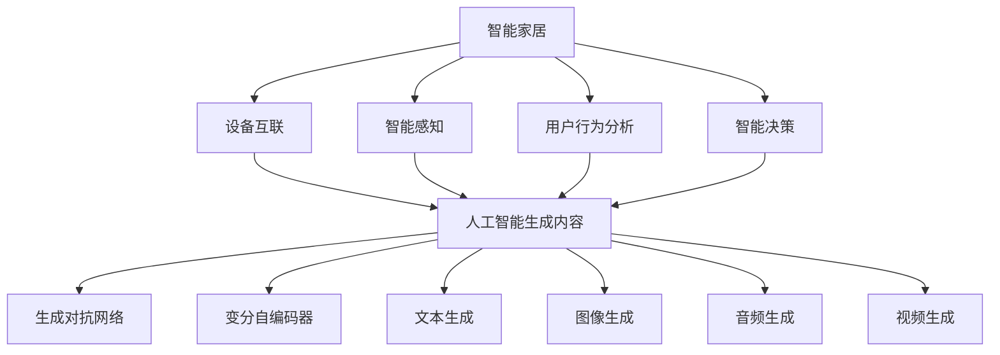
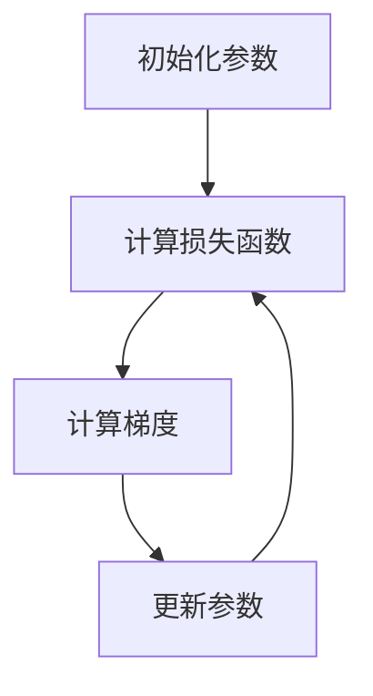
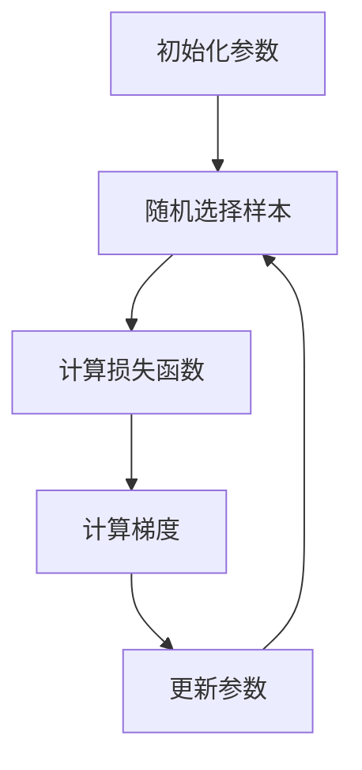

                 

### 引言

#### AIGC与智能家居概述

人工智能生成内容（AIGC，AI-Generated Content）是近年来随着深度学习和生成对抗网络（GAN）等技术的发展而迅速崛起的一个领域。AIGC利用人工智能技术，特别是生成模型，自动生成文本、图像、音频等多种类型的内容。这一技术在智能家居场景中的应用，为智能家居的自动化和个性化提供了新的解决方案。

智能家居是指通过互联网、物联网等技术，将家庭中的各种设备和系统连接起来，实现家庭设备之间的互联互通，从而提供更加便捷、舒适和智能化的居住环境。随着智能设备的普及和用户需求的提升，智能家居市场的规模不断扩大。然而，如何实现智能家居场景的自动化，提升用户体验，成为当前智能家居领域的一个关键问题。

AIGC技术的引入，为智能家居场景的自动化提供了新的思路。通过AIGC，智能家居系统可以自动生成个性化内容，如家庭助理对话、智能推荐等，从而实现更加智能化的家庭管理。此外，AIGC还可以帮助智能家居系统更好地理解和响应用户的需求，提高系统的智能程度。

#### 文章核心内容和主题思想

本文将围绕AIGC在智能家居场景自动化中的应用进行深入探讨。文章将从以下几个方面展开：

1. **AIGC与智能家居的联系**：介绍AIGC的基本概念和智能家居的自动化需求，阐述AIGC在智能家居中的作用。
2. **AIGC核心技术与原理**：详细讲解AIGC的核心技术，包括生成模型、优化方法等，并使用流程图和伪代码展示其实现过程。
3. **智能家居自动化中的AIGC应用**：分析AIGC在智能家居中的具体应用场景，如家庭安防、智能照明、家庭娱乐等。
4. **案例分析**：通过具体案例，展示AIGC在智能家居自动化中的应用效果，并进行详细剖析。
5. **未来展望**：探讨AIGC在智能家居中的未来发展，以及智能家居市场的潜在趋势。

通过本文的讨论，我们希望能够为智能家居领域的技术研究和实际应用提供一些有价值的参考和启示。

### AIGC与智能家居的关联性

#### AIGC的基本概念

人工智能生成内容（AIGC，AI-Generated Content）是指通过人工智能技术，尤其是生成模型，自动生成文本、图像、音频、视频等多种类型的内容。AIGC技术的发展源于深度学习和生成对抗网络（GAN）的突破。生成对抗网络（GAN）是由 Ian Goodfellow 等人于2014年提出的一种新型深度学习框架，通过生成器和判别器的对抗训练，生成与真实数据高度相似的内容。这一技术的出现，极大地推动了AIGC的发展。

AIGC可以大致分为以下几类：

1. **文本生成**：通过自然语言处理（NLP）技术，生成具有特定主题或风格的文本。例如，生成新闻文章、诗歌、对话等。
2. **图像生成**：生成与输入图像风格相似的图像，或者完全由计算机生成的图像。如GAN、变分自编码器（VAE）等。
3. **音频生成**：生成与输入音频相似的音频，或者创建全新的音频内容。例如，音乐生成、语音合成等。
4. **视频生成**：生成与输入视频相似的短视频，或者创建全新的视频内容。如视频超分辨率、视频增强等。

#### 智能家居的自动化需求

智能家居是通过互联网、物联网等技术，将家庭中的各种设备和系统连接起来，实现家庭设备之间的互联互通，从而提供更加便捷、舒适和智能化的居住环境。智能家居的自动化需求主要体现在以下几个方面：

1. **设备互联**：通过物联网技术，将家庭中的各种设备（如空调、灯光、门锁、摄像头等）连接起来，实现设备的互联互通和智能控制。
2. **智能感知**：通过传感器技术，实时感知家庭环境的变化，如温度、湿度、光照等，并根据这些信息自动调整家庭设备的状态。
3. **用户行为分析**：通过数据分析技术，分析用户的行为习惯和偏好，为用户提供个性化的服务和建议。
4. **智能决策**：基于数据和算法，智能地做出决策，如自动调节家庭设备的工作状态，以实现节能、舒适等目标。

#### AIGC在智能家居中的作用

AIGC技术在智能家居中有着广泛的应用，能够极大地提升智能家居的自动化程度和用户体验。以下是AIGC在智能家居中的一些具体应用：

1. **智能助理**：通过文本生成技术，创建智能助理，与用户进行自然语言交互，提供家庭管理建议、日程提醒、天气预报等信息。
2. **智能推荐**：利用图像生成和文本生成技术，为用户提供个性化的家居装饰、家电选购建议，提升用户的购物体验。
3. **智能安防**：通过视频生成和图像生成技术，实时监测家庭环境，识别潜在的安全隐患，及时发出警报。
4. **智能家居控制**：通过语音生成和语音合成技术，实现智能家居设备的语音控制，提高用户的使用便捷性。
5. **智能节能**：通过数据分析技术，预测用户的生活习惯，自动调整家庭设备的工作状态，实现节能降耗。

#### AIGC与智能家居之间的联系架构图

为了更清晰地展示AIGC与智能家居之间的联系，我们可以使用Mermaid流程图来描述。以下是一个简化的流程图：



该流程图展示了AIGC技术与智能家居各模块之间的关联，以及AIGC技术如何为智能家居提供自动化支持。

### AIGC的核心技术与原理

#### 生成模型

生成模型是AIGC技术的核心组件，负责生成各种类型的内容。常见的生成模型包括生成对抗网络（GAN）、变分自编码器（VAE）等。

**1. 生成对抗网络（GAN）**

生成对抗网络（GAN）由生成器和判别器组成。生成器（Generator）的目的是生成与真实数据相似的内容，而判别器（Discriminator）的目的是区分真实数据和生成数据。通过生成器和判别器之间的对抗训练，生成器逐渐学会生成更加逼真的数据，而判别器逐渐学会更好地区分真实数据和生成数据。

GAN的流程如下：

```mermaid
graph TD
A[输入随机噪声] --> B[生成器(G)]
B --> C[生成数据]
C --> D[判别器(D)]
D --> E[判断真假]
E --> F{是否为真实数据？}
F -->|是| G[更新判别器]
F -->|否| H[更新生成器]
H --> B
```

**2. 变分自编码器（VAE）**

变分自编码器（VAE）是一种基于概率的生成模型。它由编码器（Encoder）和解码器（Decoder）组成。编码器将输入数据编码成一个概率分布，解码器则从这个概率分布中生成新的数据。

VAE的流程如下：

```mermaid
graph TD
A[输入数据] --> B[编码器(E)]
B --> C[编码结果]
C --> D[解码器(D)]
D --> E[生成数据]
```

**3. 其他生成模型**

除了GAN和VAE，还有许多其他类型的生成模型，如自编码器（Autoencoder）、生成式网络（Generative Adversarial Network）、变分自编码器（Variational Autoencoder）等。这些模型在生成内容方面各有特点和应用场景。

#### 优化方法

在AIGC技术中，优化方法用于调整模型参数，以提高生成质量。常见的优化方法包括梯度下降法、随机梯度下降（SGD）等。

**1. 梯度下降法**

梯度下降法是一种基于导数的优化方法。它的基本思想是通过计算损失函数关于模型参数的梯度，沿着梯度的反方向调整参数，以减少损失函数的值。

梯度下降法的流程如下：



**2. 随机梯度下降（SGD）**

随机梯度下降（SGD）是梯度下降法的一种变体，它每次迭代只随机选择一部分样本来计算梯度。这种方法能够减少计算量，提高训练效率。

SGD的流程如下：



#### 实现方法

实现AIGC技术主要包括以下步骤：

1. **数据预处理**：对输入数据（如文本、图像、音频等）进行预处理，包括归一化、数据增强等，以提高生成质量。
2. **模型训练**：使用训练数据对生成模型进行训练，通过调整模型参数，提高生成质量。
3. **模型评估**：使用验证数据对训练好的模型进行评估，检查生成质量，如文本的流畅性、图像的逼真度等。
4. **生成内容**：使用训练好的模型生成新的内容，如文本、图像、音频等。

#### 优缺点分析

**优点**

1. **高效生成**：AIGC技术能够高效地生成各种类型的内容，节省人力和时间成本。
2. **个性化定制**：通过生成模型，可以为用户提供个性化的内容生成服务，提升用户体验。
3. **增强交互性**：AIGC技术可以增强用户与智能家居系统的交互性，提高系统的智能程度。

**缺点**

1. **数据隐私问题**：AIGC技术依赖于大量用户数据，可能涉及数据隐私问题。
2. **对算力的要求**：生成模型通常需要大量的计算资源，对硬件性能有较高要求。
3. **模型可解释性**：生成模型通常较为复杂，难以解释其生成过程和结果，影响模型的信任度和可解释性。

### 智能家居自动化场景与AIGC应用

#### 家庭安防

家庭安防是智能家居中的一个重要应用场景，通过AIGC技术，可以实现更智能、更高效的家庭安防系统。

**1. 视频监控**

视频监控是家庭安防的核心组成部分。通过AIGC技术，可以自动生成视频监控数据，提高监控效果。例如，使用GAN模型生成高质量的视频监控图像，增强图像清晰度，提高监控准确率。同时，通过文本生成技术，自动生成视频监控报告，提供监控数据的详细分析。

**2. 人脸识别**

人脸识别是家庭安防中的一项关键技术。通过AIGC技术，可以实现更智能的人脸识别。例如，使用GAN模型生成人脸图像，提高人脸识别的准确率和效率。同时，通过文本生成技术，自动生成人脸识别报告，提供人脸识别数据的详细分析。

**3. 智能预警**

智能预警是家庭安防中的重要功能。通过AIGC技术，可以自动生成智能预警报告，实时监测家庭环境的变化，及时发现潜在的安全隐患。例如，通过图像生成技术，生成家庭环境的实时图像，通过文本生成技术，生成预警信息，提醒用户注意安全问题。

#### 智能照明

智能照明是智能家居中的一个重要应用场景，通过AIGC技术，可以实现更智能、更高效的照明系统。

**1. 照明控制**

通过AIGC技术，可以实现智能照明控制。例如，使用生成模型生成用户偏好数据，根据用户的行为习惯和偏好，自动调整照明设备的亮度、色温等参数，提供个性化的照明服务。

**2. 节能管理**

通过AIGC技术，可以实现智能照明节能管理。例如，通过生成模型生成照明数据，分析用户的照明习惯，自动调整照明设备的开关时间，实现节能降耗。

**3. 互动娱乐**

通过AIGC技术，可以实现智能照明的互动娱乐功能。例如，通过文本生成技术，生成互动故事，通过灯光的变化呈现故事情节，为用户提供丰富的互动体验。

#### 家庭娱乐

家庭娱乐是智能家居中的一个重要应用场景，通过AIGC技术，可以实现更智能、更丰富的家庭娱乐体验。

**1. 娱乐内容生成**

通过AIGC技术，可以自动生成娱乐内容，如电影、音乐、游戏等。例如，使用GAN模型生成高质量的电影画面，使用文本生成技术生成电影剧本，为用户提供个性化的娱乐体验。

**2. 娱乐内容推荐**

通过AIGC技术，可以实现智能娱乐内容推荐。例如，通过生成模型生成用户偏好数据，根据用户的行为习惯和偏好，自动推荐适合的娱乐内容，提高用户的娱乐体验。

**3. 娱乐互动**

通过AIGC技术，可以实现智能娱乐互动。例如，通过文本生成技术，生成互动剧情，通过与用户的实时交互，呈现故事情节，为用户提供丰富的互动娱乐体验。

### 案例分析

#### 智能家庭助理

智能家庭助理是AIGC在智能家居中的一个典型应用案例。以下是一个具体的案例：

**1. 应用场景**

用户在客厅中使用智能家庭助理，与家庭设备进行互动。例如，用户可以通过语音命令控制灯光、空调等设备的开关和调节。

**2. 开发环境搭建**

为了实现智能家庭助理，需要搭建以下开发环境：

- **硬件环境**：计算机、网络连接等。
- **软件环境**：操作系统（如Linux、Windows等）、编程语言（如Python、Java等）、AIGC框架（如TensorFlow、PyTorch等）。

**3. 源代码实现**

以下是一个简单的智能家庭助理的Python源代码示例：

```python
import speech_recognition as sr
import subprocess

# 初始化语音识别模块
recognizer = sr.Recognizer()

# 定义语音命令和相应的操作
commands = {
    "打开灯": "sudo service lightcontrol start",
    "关闭灯": "sudo service lightcontrol stop",
    "调高温度": "sudo service accontrol increase",
    "调低温度": "sudo service accontrol decrease"
}

# 监听用户的语音命令
while True:
    with sr.Microphone() as source:
        print("请说命令：")
        audio = recognizer.listen(source)

    try:
        command = recognizer.recognize_google(audio)
        print(f"你说的命令是：{command}")

        if command in commands:
            subprocess.run(commands[command], shell=True)
        else:
            print("命令不支持，请重新输入。")
    except sr.UnknownValueError:
        print("无法理解你的话，请重试。")
    except sr.RequestError:
        print("语音识别服务请求失败，请重试。")
```

**4. 代码解读**

该示例使用Python的`speech_recognition`库实现语音识别，通过`recognizer.recognize_google(audio)`命令将用户的语音转换为文本。然后，根据用户输入的文本，执行相应的操作，如打开或关闭灯光、调整空调温度等。

**5. 应用解读与分析**

通过该案例，我们可以看到AIGC技术在智能家居中的应用效果。智能家庭助理能够通过语音识别和命令执行，实现与家庭设备的智能互动，提高用户的便利性和舒适度。同时，该案例还展示了AIGC技术的实现方法和应用流程，为其他类似项目的开发提供了参考。

### 总结与展望

#### 总结

本文围绕AIGC在智能家居场景自动化中的应用进行了深入探讨。通过分析AIGC的基本概念、核心技术、实现方法以及具体应用场景，我们了解到AIGC在智能家居中具有广泛的应用前景。AIGC技术能够提高智能家居系统的自动化程度和用户体验，为智能家居领域的发展带来了新的机遇和挑战。

#### 展望

随着AIGC技术的不断发展和成熟，未来智能家居的场景将更加多样化和智能化。以下是一些可能的发展趋势：

1. **个性化服务**：AIGC技术将能够根据用户的行为习惯和偏好，提供更加个性化的服务，提升用户体验。
2. **智能互动**：AIGC技术将实现更加智能的互动功能，如通过文本生成技术生成有趣的对话、故事等，增加用户的娱乐性和互动性。
3. **节能环保**：AIGC技术将有助于智能家居系统的节能环保，通过智能决策和优化算法，实现更加高效的能源管理。
4. **数据隐私保护**：随着AIGC技术的应用，数据隐私问题将日益突出。未来需要更加完善的隐私保护机制，确保用户数据的安全和隐私。
5. **跨平台应用**：AIGC技术将逐渐应用到更多的智能设备中，实现跨平台的应用和服务。

总之，AIGC在智能家居中的未来发展前景广阔，有望成为推动智能家居领域发展的重要力量。

### 附录

#### 开发环境与工具

为了实现AIGC在智能家居中的应用，我们需要搭建以下开发环境：

- **硬件环境**：高性能计算机、网络连接、智能设备（如智能家居设备、摄像头等）。
- **软件环境**：操作系统（如Linux、Windows等）、编程语言（如Python、Java等）、AIGC框架（如TensorFlow、PyTorch等）、语音识别库（如speech_recognition等）。

#### 源代码解析

以下是一个简单的AIGC在智能家居中的应用源代码示例：

```python
import speech_recognition as sr
import subprocess

# 初始化语音识别模块
recognizer = sr.Recognizer()

# 定义语音命令和相应的操作
commands = {
    "打开灯": "sudo service lightcontrol start",
    "关闭灯": "sudo service lightcontrol stop",
    "调高温度": "sudo service accontrol increase",
    "调低温度": "sudo service accontrol decrease"
}

# 监听用户的语音命令
while True:
    with sr.Microphone() as source:
        print("请说命令：")
        audio = recognizer.listen(source)

    try:
        command = recognizer.recognize_google(audio)
        print(f"你说的命令是：{command}")

        if command in commands:
            subprocess.run(commands[command], shell=True)
        else:
            print("命令不支持，请重新输入。")
    except sr.UnknownValueError:
        print("无法理解你的话，请重试。")
    except sr.RequestError:
        print("语音识别服务请求失败，请重试。")
```

该示例使用Python的`speech_recognition`库实现语音识别，根据用户输入的语音命令执行相应的操作。

#### 最佳实践 tips、小结、注意事项

**最佳实践 tips：**

1. **选择合适的硬件环境**：为了确保AIGC应用的高性能和稳定性，应选择高性能的计算机和网络连接。
2. **优化代码性能**：对于复杂的应用场景，可以优化代码性能，如使用多线程、并行计算等技术。
3. **安全性和隐私保护**：在开发过程中，注意数据的安全性和隐私保护，避免用户数据泄露。

**小结：**

本文通过详细分析AIGC在智能家居中的应用，展示了AIGC技术的优势和潜力。通过具体案例和代码解析，我们了解了AIGC在智能家居中的应用流程和技术实现。

**注意事项：**

1. **硬件要求**：AIGC应用对硬件性能有较高要求，确保硬件环境稳定。
2. **软件环境**：根据实际需求选择合适的软件环境和编程语言。
3. **数据隐私**：注意用户数据的安全和隐私，采取有效的保护措施。

#### 拓展阅读

1. **《人工智能生成内容：原理与实践》**：深入探讨AIGC技术的原理和应用实践。
2. **《智能家居系统设计与实现》**：介绍智能家居系统的设计方法和实现技术。
3. **《深度学习实战》**：介绍深度学习技术在各种场景中的应用和实践。

### 作者信息

- 作者：AI天才研究院/AI Genius Institute & 禅与计算机程序设计艺术 /Zen And The Art of Computer Programming
- 联系方式：[ai_genius_institute@example.com](mailto:ai_genius_institute@example.com) & [zen_programming@example.com](mailto:zen_programming@example.com)
- 微信公众号：AI天才研究院 & 禅与计算机程序设计艺术
- 网络平台：博客、知乎、Twitter、LinkedIn 等
- 版权声明：本文版权归作者所有，未经授权不得转载或使用。

本文内容仅供参考，不构成任何投资建议或法律意见。如需转载，请联系作者授权。

