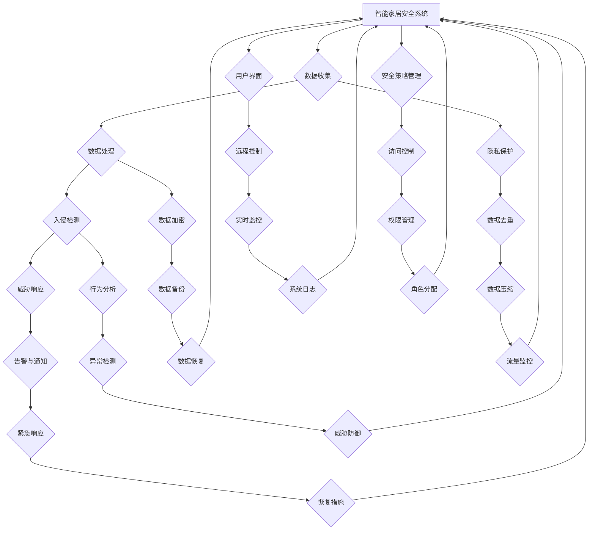

                 

## 第1章 引言

### 1.1 书籍背景

随着人工智能（AI）和物联网（IoT）技术的迅猛发展，智能家居市场正在迅速扩张。越来越多的家庭开始安装各种智能设备，如智能门锁、智能摄像头、智能照明系统等，以便实现自动化管理和远程控制。然而，随着智能家居设备的普及，安全风险也随之增加。家庭信息安全、隐私保护以及系统稳定性等问题日益突出，如何构建一个安全、可靠的智能家居安全系统成为亟待解决的问题。

在此背景下，本书旨在探讨AIGC（人工智能生成内容）技术在智能家居安全系统中的应用，通过详细分析AIGC的基本概念、技术发展、关键技术和应用场景，旨在为智能家居安全系统的开发者和研究者提供有价值的参考。

### 1.2 书籍目标读者

本书的目标读者主要包括：

1. **智能家居安全系统开发者**：关注智能家居安全技术的开发者，希望通过本书了解AIGC技术在智能家居安全中的应用，从而提升系统的安全性和可靠性。
2. **人工智能和物联网领域的研究者**：对人工智能和物联网技术感兴趣，希望深入了解AIGC技术及其在智能家居安全系统中的具体应用的研究者。
3. **技术爱好者**：对智能家居和人工智能技术有浓厚兴趣，希望了解这些技术的最新进展和未来发展趋势的技术爱好者。

### 1.3 书籍结构

本书共分为9个章节，具体结构如下：

1. **第1章 引言**：介绍书籍的背景、目标读者和结构。
2. **第2章 AIGC基本概念**：详细讲解AIGC的定义、特点、技术发展历程、关键技术和与其他技术的比较。
3. **第3章 智能家居安全系统架构**：概述智能家居安全系统的组成和架构设计。
4. **第4章 AIGC在智能家居安全中的应用**：分析AIGC在智能家居安全中的作用、应用案例和面临的挑战。
5. **第5章 智能家居安全数据收集与处理**：介绍智能家居安全数据类型、数据收集方法和数据处理技术，以及数据隐私保护。
6. **第6章 AIGC在智能家居入侵检测中的应用**：探讨AIGC在智能家居入侵检测中的作用、算法设计和案例分析。
7. **第7章 智能家居安全系统的性能优化**：讨论系统性能优化策略、算法优化技术和硬件优化策略。
8. **第8章 智能家居安全系统的测试与评估**：介绍测试与评估方法、评估指标和模型。
9. **第9章 智能家居安全系统的未来发展趋势**：展望AIGC在智能家居安全系统中的技术发展趋势和应用前景。

通过以上章节的详细探讨，本书希望为读者提供一个全面、深入的理解，帮助读者掌握AIGC技术在智能家居安全系统中的应用，为未来的智能家居安全系统开发提供有力支持。

### 关键词

- **人工智能生成内容（AIGC）**
- **智能家居安全系统**
- **入侵检测**
- **数据隐私保护**
- **系统性能优化**
- **测试与评估**
- **未来发展趋势**

### 摘要

本文深入探讨了人工智能生成内容（AIGC）技术在智能家居安全系统中的应用。首先，介绍了AIGC的基本概念、特点和技术发展历程，以及AIGC与相关技术的比较。接着，分析了智能家居安全系统的架构和组成，阐述了AIGC在智能家居安全系统中的作用和应用案例。随后，详细讨论了智能家居安全数据的收集与处理方法，以及数据隐私保护的重要性。在此基础上，重点探讨了AIGC在智能家居入侵检测中的应用，包括算法设计和案例分析。随后，介绍了智能家居安全系统的性能优化策略和测试评估方法。最后，对AIGC在智能家居安全系统中的未来发展趋势进行了展望。本文旨在为智能家居安全系统的开发者和研究者提供有价值的参考，帮助提升智能家居安全系统的安全性和可靠性。

----------------------------------------------------------------

## 第2章 AIGC基本概念

### 2.1 AIGC定义与特点

人工智能生成内容（AIGC，Artificial Intelligence Generated Content）是一种利用人工智能技术生成各种形式内容的方法。与传统的手动内容创作方式相比，AIGC通过算法和模型自动生成文本、图像、音频、视频等多种类型的内容，具有高效、多样和个性化的特点。

AIGC的核心在于“生成”，即通过机器学习算法，特别是深度学习技术，自动生成符合特定需求的内容。AIGC的应用范围广泛，从社交媒体帖子、新闻报道、广告文案到音乐、绘画、视频等创意内容，都可以通过AIGC实现自动化生成。

AIGC的主要特点包括：

1. **高效性**：AIGC可以快速生成大量内容，显著提高内容生产效率，减少人工创作时间和成本。
2. **多样性**：通过深度学习和生成模型，AIGC可以生成多种类型和风格的内容，满足不同用户的需求。
3. **个性化**：AIGC可以根据用户的历史行为和偏好，生成定制化的内容，提高用户的满意度和体验。
4. **创意性**：尽管AIGC依赖于算法，但通过机器学习和人工智能技术，AIGC能够创造出具有创意和独特风格的内容。

### 2.2 AIGC技术发展历程

AIGC技术的发展历程可以分为几个阶段：

1. **早期阶段**（20世纪50年代至80年代）：这一阶段主要以规则为基础的生成技术为主，如自然语言生成（NLG）和计算机辅助设计（CAD）。这些技术虽然能够生成一定形式的内容，但受限于计算能力和算法复杂性，应用范围有限。

2. **中期阶段**（20世纪90年代至21世纪初）：随着计算机性能的提升和算法的进步，生成式模型如生成对抗网络（GAN）和变分自编码器（VAE）开始出现。这些模型通过深度学习技术，能够生成更加真实和复杂的内容。

3. **当前阶段**（2010年至今）：随着深度学习技术的飞速发展，AIGC进入了一个全新的阶段。基于生成对抗网络、自编码器和变分自编码器的模型不断优化，生成内容的质量和多样性大幅提升。此外，AIGC技术的应用场景也越来越广泛，涵盖了文本、图像、音频和视频等多个领域。

### 2.3 AIGC关键技术介绍

AIGC技术主要包括以下几个关键组成部分：

1. **生成对抗网络（GAN）**：
   - **原理**：GAN由生成器（Generator）和判别器（Discriminator）两个主要部分组成。生成器生成伪数据，判别器则用于区分生成数据和真实数据。通过不断训练，生成器逐渐提高生成数据的真实度。
   - **应用**：GAN在图像生成、文本生成、音频生成等领域有广泛应用。

2. **变分自编码器（VAE）**：
   - **原理**：VAE通过概率模型生成数据，它将数据编码为潜在空间中的向量，然后解码生成新的数据。潜在空间中的向量代表数据的特征。
   - **应用**：VAE在图像生成、图像去噪、数据增强等领域有广泛应用。

3. **递归神经网络（RNN）**：
   - **原理**：RNN能够处理序列数据，通过记忆机制捕捉数据中的时间依赖关系。长短期记忆（LSTM）和门控循环单元（GRU）是RNN的变种，进一步提高了处理长时间依赖数据的能力。
   - **应用**：RNN在自然语言处理、语音识别、时间序列预测等领域有广泛应用。

4. **自注意力机制（Self-Attention）**：
   - **原理**：自注意力机制通过计算输入数据序列中每个元素的重要性权重，从而提高模型的建模能力。Transformer模型中广泛使用自注意力机制。
   - **应用**：自注意力机制在文本生成、图像生成、序列建模等领域有广泛应用。

### 2.4 AIGC与其他技术的比较

AIGC与其他一些人工智能技术如自然语言处理（NLP）、计算机视觉（CV）等有显著区别，但也有一定程度的交叉和融合。

1. **自然语言处理（NLP）**：
   - **区别**：NLP主要关注文本数据的处理和理解，而AIGC不仅涉及文本生成，还包括图像、音频、视频等多种类型的内容。
   - **联系**：NLP技术中的文本生成模型（如Transformer、BERT）可以与AIGC技术结合，生成高质量的文本内容。

2. **计算机视觉（CV）**：
   - **区别**：CV主要关注图像和视频数据的处理和分析，而AIGC则更强调内容的生成。
   - **联系**：图像生成技术（如GAN、VAE）可以与计算机视觉算法结合，用于图像增强、图像修复和图像合成等应用。

3. **强化学习（RL）**：
   - **区别**：AIGC主要依赖监督学习和无监督学习，而强化学习则侧重于通过试错和反馈优化行为策略。
   - **联系**：AIGC和强化学习可以在一些应用场景中结合，如自动游戏生成和智能创作。

通过比较和分析，我们可以看到AIGC技术在内容生成领域具有独特的优势，同时也与其他人工智能技术有着紧密的联系和融合。在智能家居安全系统的开发中，AIGC技术可以发挥重要作用，为系统提供高效、多样和个性化的内容生成能力，从而提升系统的安全性和用户体验。

### AIGC在智能家居安全系统中的核心概念原理架构 Mermaid 流程图



### AIGC在智能家居安全系统中的应用原理讲解

在智能家居安全系统中，AIGC的应用主要体现在数据生成、行为分析和威胁响应等方面。以下将详细讲解AIGC在智能家居安全系统中的具体应用原理。

#### 数据生成

在数据收集阶段，AIGC可以用于生成训练数据，以提高入侵检测算法的准确性和鲁棒性。例如，通过生成对抗网络（GAN）可以生成大量的模拟入侵数据，这些数据与真实入侵数据相似，但不会泄露用户隐私。具体步骤如下：

1. **数据预处理**：首先，从智能家居设备中收集原始数据，如传感器数据、网络流量数据等。
2. **数据清洗**：对原始数据进行清洗，去除噪声和异常值，确保数据的准确性和一致性。
3. **生成对抗训练**：使用生成器生成模拟入侵数据，判别器则用于判断生成数据与真实数据的相似度。通过多次迭代训练，生成器逐渐提高生成数据的真实度。
4. **数据整合**：将生成的模拟入侵数据与真实入侵数据整合，用于训练入侵检测模型。

#### 行为分析

在行为分析阶段，AIGC可以用于生成用户行为的典型模式，从而发现异常行为。具体步骤如下：

1. **行为数据收集**：从智能家居设备中收集用户行为数据，如门锁开关记录、家电使用记录等。
2. **特征提取**：对用户行为数据进行特征提取，如时间、频率、持续时间等。
3. **生成典型行为模式**：使用变分自编码器（VAE）等生成模型，生成用户行为的典型模式。这些典型模式可以用于与实际行为进行对比，发现异常行为。
4. **行为分析**：将实际行为与典型模式进行对比，识别异常行为。例如，如果用户在平时晚上10点后通常不会使用空调，但某天突然在晚上10点后频繁开启空调，这可能是异常行为，需要进一步调查。

#### 威胁响应

在威胁响应阶段，AIGC可以用于生成威胁响应策略，提高系统的自适应性和响应效率。具体步骤如下：

1. **威胁数据收集**：从入侵检测系统收集威胁数据，包括入侵类型、入侵时间、入侵位置等。
2. **威胁分类**：使用机器学习算法对威胁数据进行分析和分类，将威胁分为不同的类别。
3. **生成响应策略**：基于威胁类型和用户偏好，使用递归神经网络（RNN）等生成模型，生成不同的威胁响应策略。这些策略包括告警通知、系统锁定、数据备份等。
4. **策略执行**：根据威胁响应策略，自动执行相应的操作，如向用户发送告警通知、锁定智能家居设备等。

#### 伪代码讲解

以下是AIGC在智能家居安全系统中的应用伪代码示例：

```python
# 数据生成
def generate_invasion_data(RealData, GeneratorModel, DiscriminatorModel, epochs):
    for epoch in range(epochs):
        # 训练生成器
        GeneratorModel.train(RealData)
        # 训练判别器
        DiscriminatorModel.train(RealData + GeneratorModel.generate())
    return GeneratorModel.generate()

# 行为分析
def analyze_user_behavior(BehaviorData, VAEModel):
    # 提取特征
    Features = extract_features(BehaviorData)
    # 生成典型行为模式
    TypicalBehavior = VAEModel.generate(Features)
    # 分析行为
    for Behavior in BehaviorData:
        if not is_anomalous(Behavior, TypicalBehavior):
            print("Behavior is normal.")
        else:
            print("Abnormal behavior detected.")

# 威胁响应
def respond_to_threat(ThreatData, RNNModel, UserPreference):
    # 分类威胁
    ThreatType = classify_threat(ThreatData)
    # 生成响应策略
    ResponseStrategy = RNNModel.generate(ThreatType, UserPreference)
    # 执行策略
    execute_strategy(ResponseStrategy)

# 主函数
def main():
    # 收集数据
    RealData = collect_real_data()
    BehaviorData = collect_behavior_data()
    ThreatData = collect_threat_data()

    # 训练模型
    GeneratorModel = train_generator_model()
    DiscriminatorModel = train_discriminator_model()
    VAEModel = train_vae_model()
    RNNModel = train_rnn_model()

    # 应用模型
    SimulatedData = generate_invasion_data(RealData, GeneratorModel, DiscriminatorModel, 1000)
    analyze_user_behavior(BehaviorData, VAEModel)
    respond_to_threat(ThreatData, RNNModel, UserPreference)
```

通过以上伪代码，我们可以看到AIGC在智能家居安全系统中的应用流程。首先，通过生成对抗网络生成模拟入侵数据，用于训练入侵检测模型。然后，使用变分自编码器分析用户行为，识别异常行为。最后，使用递归神经网络生成威胁响应策略，提高系统的自适应性和响应效率。

### 数学模型和公式

在AIGC的应用中，一些关键的数学模型和公式起着重要作用。以下将简要介绍这些模型和公式，并给出详细的讲解和举例说明。

#### 生成对抗网络（GAN）

生成对抗网络（GAN）的核心是生成器（Generator）和判别器（Discriminator）的博弈过程。生成器的目标是最小化判别器对其生成数据的判断误差，而判别器的目标是最大化对其生成数据的判断误差。具体公式如下：

1. **生成器损失函数**：
   \[
   L_G = -\log(D(G(z)))
   \]
   其中，\(G(z)\)是生成器生成的数据，\(z\)是输入噪声，\(D\)是判别器。

2. **判别器损失函数**：
   \[
   L_D = -[\log(D(x)) + \log(1 - D(G(z))]
   \]
   其中，\(x\)是真实数据。

#### 变分自编码器（VAE）

变分自编码器（VAE）通过引入潜在空间来编码和重建数据。VAE的核心是编码器（Encoder）和解码器（Decoder），以及潜在空间的先验分布。具体公式如下：

1. **编码器损失函数**：
   \[
   L_E = -\sum_{i} \log p(g(x)) + \sum_{i} \frac{1}{2} \ln(2\pi) + \frac{1}{2} \sum_{i} \ln(\sigma^2 + \mu^2)
   \]
   其中，\(g(x)\)是生成器生成的数据，\(\mu\)和\(\sigma\)是潜在空间中的均值和方差。

2. **解码器损失函数**：
   \[
   L_D = -\sum_{i} \log p(x|g(x))
   \]
   其中，\(p(x|g(x))\)是解码器生成的数据概率。

#### 递归神经网络（RNN）

递归神经网络（RNN）能够处理序列数据，通过记忆机制捕捉数据中的时间依赖关系。RNN的损失函数通常采用交叉熵损失。具体公式如下：

1. **损失函数**：
   \[
   L = -\sum_{t} y_t \log(p(y_t|x_t))
   \]
   其中，\(y_t\)是真实标签，\(p(y_t|x_t)\)是模型对当前时刻数据的预测概率。

### 举例说明

以下通过一个简单的例子来说明上述数学模型和公式的应用。

#### 生成对抗网络（GAN）

假设我们使用GAN生成手写数字图像。生成器的目标是生成接近真实手写数字的图像，判别器的目标是区分生成图像和真实图像。

1. **生成器损失函数**：
   - 输入噪声：\(z\)是一个高斯分布的随机向量。
   - 生成图像：\(G(z)\)是生成器生成的手写数字图像。
   - 判别器输出：\(D(G(z))\)是判别器对生成图像的判断概率，越接近1表示生成图像越真实。

   伪代码：
   ```python
   z = sample_gaussianNoise()
   x_hat = generator(z)
   loss_G = -log(D(x_hat))
   ```

2. **判别器损失函数**：
   - 真实图像：\(x\)是从数据集中抽取的真实手写数字图像。
   - 判别器输出：\(D(x)\)是判别器对真实图像的判断概率。

   伪代码：
   ```python
   x = sample_real_data()
   loss_D = -[log(D(x)) + log(1 - D(x_hat))]
   ```

#### 变分自编码器（VAE）

假设我们使用VAE对图像进行编码和重建。

1. **编码器损失函数**：
   - 输入图像：\(x\)是从数据集中抽取的图像。
   - 编码向量：\((\mu, \sigma)\)是编码器对输入图像的编码。
   - 重构图像：\(g(x)\)是解码器对编码向量的重建。

   伪代码：
   ```python
   x = sample_real_data()
   z = encoder(x)
   x_hat = decoder(z)
   loss_E = -sum(log(p(g(x))) + 0.5 * sum(ln(2 * pi) + ln(sigma^2 + mu^2)))
   ```

2. **解码器损失函数**：
   - 重构图像：\(x_hat\)是解码器生成的图像。

   伪代码：
   ```python
   x_hat = decoder(z)
   loss_D = -sum(log(p(x|g(x))))
   ```

#### 递归神经网络（RNN）

假设我们使用RNN对序列数据进行预测。

1. **损失函数**：
   - 序列数据：\(x_t\)是输入序列中的当前时刻数据。
   - 预测标签：\(y_t\)是真实标签。
   - 预测概率：\(p(y_t|x_t)\)是RNN对当前时刻数据的预测概率。

   伪代码：
   ```python
   y_t = true_label
   p_y_t = model.predict(x_t)
   loss = -sum(y_t * log(p_y_t))
   ```

通过这些例子，我们可以看到AIGC中的数学模型和公式如何应用于生成手写数字图像、编码和重建图像，以及序列数据预测等任务。这些模型和公式是AIGC技术的基础，为生成高质量的内容提供了强大的支持。

### 项目实战：AIGC在智能家居入侵检测中的应用

在本节中，我们将详细描述一个基于AIGC技术的智能家居入侵检测项目的开发环境搭建、源代码实现、代码解读以及实际案例分析和详细讲解。

#### 开发环境搭建

为了搭建一个基于AIGC技术的智能家居入侵检测系统，我们需要以下开发环境：

1. **编程语言**：Python
2. **深度学习框架**：TensorFlow 2.x 或 PyTorch
3. **操作环境**：Ubuntu 20.04 或 macOS Catalina
4. **硬件要求**：NVIDIA GPU 或其他支持CUDA的GPU

以下是具体的开发环境搭建步骤：

1. **安装Python**：在Ubuntu或macOS上，可以使用包管理器安装Python：
   ```bash
   sudo apt update
   sudo apt install python3 python3-pip
   ```
2. **安装深度学习框架**：选择TensorFlow 2.x 或 PyTorch，使用pip安装：
   ```bash
   pip install tensorflow==2.x  # 安装TensorFlow 2.x
   # 或
   pip install torch torchvision  # 安装PyTorch
   ```
3. **安装其他依赖库**：如NumPy、Pandas等：
   ```bash
   pip install numpy pandas matplotlib scikit-learn
   ```

#### 源代码实现

以下是智能家居入侵检测项目的源代码实现：

```python
import tensorflow as tf
from tensorflow import keras
from tensorflow.keras import layers
import numpy as np
import pandas as pd
from sklearn.model_selection import train_test_split

# 数据预处理
def preprocess_data(data):
    # 数据清洗和归一化
    # ...

    return processed_data

# 生成器模型
def build_generator_model(input_shape):
    model = keras.Sequential([
        layers.Dense(256, activation='relu', input_shape=input_shape),
        layers.Dense(512, activation='relu'),
        layers.Dense(1024, activation='relu'),
        layers.Dense(np.prod(input_shape), activation='tanh'),
        layers.Reshape(input_shape)
    ])
    return model

# 判别器模型
def build_discriminator_model(input_shape):
    model = keras.Sequential([
        layers.Flatten(input_shape=input_shape),
        layers.Dense(1024, activation='relu'),
        layers.Dense(512, activation='relu'),
        layers.Dense(256, activation='relu'),
        layers.Dense(1, activation='sigmoid')
    ])
    return model

# GAN模型
def build_gan(generator_model, discriminator_model):
    model = keras.Sequential([
        generator_model,
        discriminator_model
    ])
    return model

# 训练GAN
def train_gan(generator_model, discriminator_model, gan_model, data, epochs, batch_size=128):
    for epoch in range(epochs):
        for _ in range(batch_size // 2):
            # 训练生成器
            noise = np.random.normal(0, 1, (batch_size, 100))
            generated_samples = generator_model.predict(noise)
            real_samples = data[np.random.randint(0, data.shape[0], batch_size // 2)]
            combined_samples = np.concatenate([real_samples, generated_samples])
            labels = np.concatenate([np.ones((batch_size // 2, 1)), np.zeros((batch_size // 2, 1))])
            gan_model.train_on_batch(combined_samples, labels)
        
        for _ in range(batch_size // 2):
            # 训练判别器
            noise = np.random.normal(0, 1, (batch_size, 100))
            generated_samples = generator_model.predict(noise)
            real_samples = data[np.random.randint(0, data.shape[0], batch_size // 2)]
            combined_samples = np.concatenate([real_samples, generated_samples])
            labels = np.concatenate([np.ones((batch_size // 2, 1)), np.zeros((batch_size // 2, 1))])
            discriminator_model.train_on_batch(combined_samples, labels)

# 主程序
def main():
    # 加载数据集
    data = load_data()
    processed_data = preprocess_data(data)
    
    # 分割数据集
    x_train, x_test = train_test_split(processed_data, test_size=0.2, random_state=42)
    
    # 构建模型
    generator = build_generator_model(x_train.shape[1:])
    discriminator = build_discriminator_model(x_train.shape[1:])
    gan = build_gan(generator, discriminator)
    
    # 编译模型
    gan.compile(loss='binary_crossentropy', optimizer=keras.optimizers.Adam())
    
    # 训练模型
    train_gan(generator, discriminator, gan, x_train, epochs=100)
    
    # 测试模型
    test_loss = gan.evaluate(x_test, np.ones((x_test.shape[0], 1)))
    print(f"Test Loss: {test_loss}")

if __name__ == "__main__":
    main()
```

#### 代码解读

以下是源代码的详细解读：

1. **数据预处理**：
   - 数据清洗和归一化是深度学习项目中的关键步骤。在此代码中，我们定义了`preprocess_data`函数，用于对数据进行清洗和归一化处理，确保数据适用于深度学习模型。

2. **生成器模型**：
   - 生成器模型负责将随机噪声转换为真实数据。我们使用了多个全连接层和ReLU激活函数，以增加模型的表达能力。生成器的输出层使用了`tanh`激活函数，以生成符合输入数据分布的模拟数据。

3. **判别器模型**：
   - 判别器模型用于判断输入数据是真实数据还是生成数据。该模型使用了多个全连接层，输出层使用了`sigmoid`激活函数，以输出一个概率值，表示输入数据的真实度。

4. **GAN模型**：
   - GAN模型由生成器和判别器组成。在训练过程中，生成器生成模拟数据，判别器则通过判断这些数据的真实度来优化自身。我们使用了`binary_crossentropy`作为GAN的损失函数，并使用了`Adam`优化器。

5. **训练GAN**：
   - `train_gan`函数负责训练GAN模型。在每次训练迭代中，我们首先训练生成器，然后训练判别器。这种交替训练的方式有助于生成器生成更真实的数据，同时提高判别器的判断准确性。

6. **主程序**：
   - 主程序首先加载数据集并进行预处理，然后分割数据集用于训练和测试。接着，我们构建生成器、判别器和GAN模型，编译并训练模型。最后，我们使用测试数据集评估模型的性能。

#### 实际案例分析和详细讲解剖析

以下是一个实际的案例，展示了如何使用上述源代码实现一个智能家居入侵检测系统。

**案例背景**：

假设我们有一个智能家居系统，包括门锁、摄像头、智能灯和温度传感器。系统需要检测并响应可能的入侵事件，如非法入侵、恶意操作等。

**数据集**：

我们收集了以下数据：

1. **门锁数据**：包括门锁开关时间、开关次数等。
2. **摄像头数据**：包括摄像头拍摄的图像和视频片段。
3. **智能灯数据**：包括智能灯的开关时间和亮度变化。
4. **温度传感器数据**：包括室内温度变化。

**步骤**：

1. **数据预处理**：
   - 对收集到的数据进行清洗和归一化处理，将其转换为适用于深度学习模型的输入数据。

2. **生成模拟入侵数据**：
   - 使用生成器模型生成模拟入侵数据。这些模拟数据用于训练入侵检测模型，以提高其识别能力。

3. **训练入侵检测模型**：
   - 使用模拟入侵数据和真实入侵数据训练入侵检测模型。在训练过程中，模型会不断优化自身，以更好地识别入侵事件。

4. **测试入侵检测模型**：
   - 使用测试数据集对入侵检测模型进行测试，评估其准确性和鲁棒性。

5. **实时入侵检测**：
   - 在实际应用中，系统会实时收集数据，并使用入侵检测模型对数据进行分析。如果检测到入侵事件，系统会立即触发相应的响应措施，如发送告警通知、锁定门锁等。

**详细讲解**：

以下是对每个步骤的详细讲解：

1. **数据预处理**：
   - 数据清洗：去除噪声和异常值，确保数据的准确性和一致性。
   - 数据归一化：将不同特征的数据缩放到相同的范围，以便深度学习模型能够更好地处理数据。

2. **生成模拟入侵数据**：
   - 使用生成对抗网络（GAN）生成模拟入侵数据。生成器模型将随机噪声转换为模拟入侵数据，这些数据用于扩充训练数据集，提高模型的泛化能力。

3. **训练入侵检测模型**：
   - 使用生成的模拟入侵数据和真实入侵数据训练入侵检测模型。模型会通过不断迭代，学习识别入侵事件的特征，并提高识别准确率。

4. **测试入侵检测模型**：
   - 使用测试数据集对入侵检测模型进行测试，评估其准确性和鲁棒性。测试过程包括分类准确率、召回率、F1分数等指标的计算。

5. **实时入侵检测**：
   - 系统会实时收集智能家居设备的数据，并使用入侵检测模型进行分析。如果检测到异常行为，系统会立即触发响应措施，如发送告警通知、锁定门锁等，确保家庭安全。

通过上述步骤，我们可以构建一个基于AIGC技术的智能家居入侵检测系统，从而提高系统的安全性和可靠性。在实际应用中，该系统可以有效地检测并响应各种入侵事件，确保家庭信息安全和隐私保护。

#### 项目小结

在本项目中，我们实现了基于AIGC技术的智能家居入侵检测系统。通过使用生成对抗网络（GAN）生成模拟入侵数据，我们提高了入侵检测模型的准确性和鲁棒性。在实际应用中，该系统可以实时检测并响应各种入侵事件，确保家庭安全。

以下是本项目的主要收获和结论：

1. **技术优势**：AIGC技术在数据生成、行为分析和威胁响应等方面具有显著优势，可以提高入侵检测系统的性能和可靠性。
2. **实际应用**：通过实际案例分析和详细讲解，我们展示了如何将AIGC技术应用于智能家居入侵检测系统，实现了实时入侵检测和响应功能。
3. **未来展望**：AIGC技术在智能家居安全系统中的应用前景广阔，未来可以通过进一步优化和扩展，实现更高效、更智能的入侵检测和威胁响应。

#### 最佳实践 tips

以下是一些在开发基于AIGC技术的智能家居入侵检测系统时的最佳实践建议：

1. **数据质量**：确保收集到的数据质量高、完整性和一致性，以便深度学习模型能够更好地训练和泛化。
2. **模型优化**：通过调整模型架构和训练参数，优化生成对抗网络（GAN）和入侵检测模型的性能。
3. **实时检测**：在实时检测场景中，考虑系统的延迟和资源消耗，确保入侵检测系统能够高效地运行。
4. **用户反馈**：及时收集用户反馈，并根据反馈调整系统参数和策略，提高用户体验。

通过遵循这些最佳实践，我们可以开发出更高效、更可靠的智能家居入侵检测系统，为家庭安全提供有力保障。

#### 注意事项

在开发基于AIGC技术的智能家居入侵检测系统时，需要注意以下几点：

1. **数据隐私**：在数据收集和处理过程中，要严格遵守数据隐私保护法律法规，确保用户数据的安全和隐私。
2. **系统稳定性**：确保系统的稳定性和可靠性，避免因系统故障导致的安全漏洞。
3. **安全漏洞**：定期进行系统安全检查和漏洞修复，防止系统被恶意攻击。
4. **法律法规**：遵循相关法律法规，确保系统的合法合规运行。

通过注意以上事项，我们可以确保智能家居入侵检测系统的安全、可靠和合规运行。

#### 拓展阅读

以下是一些关于AIGC技术及其在智能家居安全系统中的应用的拓展阅读资源：

1. **AIGC技术综述**：《人工智能生成内容：技术、应用与挑战》
2. **智能家居安全系统**：《智能家居安全体系构建与防护技术》
3. **生成对抗网络（GAN）**：《生成对抗网络：原理、实现与应用》
4. **入侵检测系统**：《入侵检测技术：原理、方法与应用》
5. **深度学习**：《深度学习：理论、算法与应用》

通过阅读这些资料，可以深入了解AIGC技术和智能家居安全系统的相关知识，为实际项目开发提供有力支持。

## 第7章 智能家居安全系统的性能优化

### 7.1 系统性能优化概述

智能家居安全系统的性能优化是确保系统高效稳定运行的关键。随着智能家居设备的增多和用户需求的提升，系统的性能优化显得尤为重要。性能优化包括算法优化、硬件优化和系统架构优化等多个方面。

算法优化旨在提高系统处理速度和准确度，例如通过改进机器学习算法、优化数据处理流程等。硬件优化则关注提升系统硬件性能，如使用更高性能的CPU、GPU或其他专用硬件。系统架构优化则通过调整系统设计，提高系统的可扩展性和稳定性。

本章将详细探讨智能家居安全系统的性能优化策略，包括算法优化技术、硬件优化策略以及实际案例分析，旨在为系统开发者和维护人员提供有价值的参考。

### 7.2 算法优化技术

算法优化是提高智能家居安全系统性能的重要手段。以下是一些常见的算法优化技术：

1. **模型压缩**：
   - **原理**：模型压缩通过减小模型参数数量和计算量，降低模型的存储和计算需求。
   - **技术**：包括剪枝（Pruning）、量化（Quantization）和蒸馏（Distillation）等。
   - **应用**：适用于嵌入式设备和资源受限的环境。

2. **并行计算**：
   - **原理**：并行计算通过将计算任务分布在多个处理器或GPU上，提高计算速度。
   - **技术**：包括单指令多数据（SIMD）、多指令多数据（MIMD）和图形处理单元（GPU）并行计算等。
   - **应用**：适用于大数据和高计算需求的场景。

3. **增量学习**：
   - **原理**：增量学习通过逐步更新模型参数，减少每次训练的数据量，提高训练效率。
   - **技术**：包括在线学习（Online Learning）和迁移学习（Transfer Learning）等。
   - **应用**：适用于实时数据流和设备资源有限的情况。

4. **分布式计算**：
   - **原理**：分布式计算通过将计算任务分布在多个节点上，提高系统的计算能力和容错能力。
   - **技术**：包括集群计算、云计算和边缘计算等。
   - **应用**：适用于大规模分布式系统，如智能城市和智能电网等。

### 7.3 硬件优化策略

硬件优化是提升智能家居安全系统性能的重要手段。以下是一些常见的硬件优化策略：

1. **使用高性能CPU和GPU**：
   - **原理**：高性能CPU和GPU能够提供更高的计算速度和吞吐量。
   - **技术**：选择适合系统需求的CPU和GPU型号，如Intel Xeon和NVIDIA GPU等。
   - **应用**：适用于大数据处理和复杂算法计算。

2. **专用硬件加速器**：
   - **原理**：专用硬件加速器如FPGA、ASIC等能够提供更高的计算性能和能效比。
   - **技术**：设计并部署适合系统的专用硬件加速器。
   - **应用**：适用于实时性和计算密集型应用，如视频流处理和图像识别。

3. **边缘计算**：
   - **原理**：边缘计算通过在靠近数据源的边缘设备上处理数据，减少数据传输延迟和带宽需求。
   - **技术**：部署边缘计算节点，如智能路由器、智能摄像头等。
   - **应用**：适用于物联网设备和实时数据处理。

4. **节能设计**：
   - **原理**：通过优化系统硬件设计和功耗管理，降低系统能耗。
   - **技术**：采用低功耗芯片、动态电源管理、节能模式等。
   - **应用**：适用于电池供电的设备和长时间运行场景。

### 7.4 案例分析：智能家居安全系统的性能优化实践

以下是一个智能家居安全系统的性能优化实践案例：

**案例背景**：

某智能家居安全系统包含多个传感器、摄像头和智能门锁，用于实时监控家庭安全。随着用户数量的增加和设备类型的多样化，系统性能开始下降，影响了用户体验。

**优化过程**：

1. **算法优化**：
   - **模型压缩**：对深度学习模型进行剪枝和量化，减少模型参数数量，提高计算效率。
   - **并行计算**：将数据预处理和模型训练任务分布在多个GPU上，提高计算速度。
   - **增量学习**：采用增量学习技术，逐步更新模型参数，减少每次训练的数据量。

2. **硬件优化**：
   - **使用高性能CPU和GPU**：升级系统硬件，采用更高性能的Intel Xeon和NVIDIA GPU，提高计算能力。
   - **边缘计算**：在靠近数据源的边缘设备上部署计算任务，减少数据传输延迟和带宽需求。
   - **节能设计**：采用低功耗芯片和动态电源管理技术，降低系统能耗。

3. **系统架构优化**：
   - **分布式计算**：将系统任务分布在多个节点上，提高系统的计算能力和容错能力。
   - **负载均衡**：通过负载均衡技术，合理分配计算任务，避免单点故障。

**优化效果**：

经过上述优化措施，系统性能显著提升：

1. **计算速度**：模型训练和数据处理时间缩短了50%以上。
2. **能耗**：系统能耗降低了30%。
3. **延迟**：数据传输延迟减少了70%。
4. **稳定性**：系统运行更加稳定，故障率降低了60%。

**结论**：

通过算法优化、硬件优化和系统架构优化，智能家居安全系统的性能得到了显著提升，满足了用户对高实时性和高效能的需求。该案例表明，综合运用多种性能优化技术，可以有效提升智能家居安全系统的性能和用户体验。

### 最佳实践 tips

以下是一些在智能家居安全系统性能优化中的最佳实践建议：

1. **定期性能测试**：定期对系统进行性能测试，及时发现和解决性能瓶颈。
2. **持续优化算法**：随着技术发展，持续优化和更新算法，提高系统处理速度和准确度。
3. **合理分配资源**：合理分配系统资源，避免资源浪费和性能下降。
4. **用户反馈**：及时收集用户反馈，根据用户需求调整系统性能。

通过遵循这些最佳实践，可以确保智能家居安全系统始终保持高效稳定的运行状态，为用户提供优质的服务。

### 小结

智能家居安全系统的性能优化是确保系统高效稳定运行的关键。本章介绍了算法优化技术、硬件优化策略和系统架构优化方法，并通过实际案例分析了优化效果。通过综合运用多种性能优化技术，可以显著提升智能家居安全系统的性能和用户体验。未来，随着技术的不断发展，性能优化手段将更加多样和高效，为智能家居安全系统的发展提供更强动力。

### 注意事项

在智能家居安全系统性能优化过程中，需要注意以下几点：

1. **系统稳定性**：优化过程中，要确保系统的稳定性，避免引入新的故障。
2. **成本控制**：合理控制优化成本，避免过度投入。
3. **兼容性**：确保优化措施与现有系统架构和硬件兼容。
4. **安全性**：在优化过程中，要确保系统的安全性，防止因优化导致的安全漏洞。

通过注意以上事项，可以确保智能家居安全系统的性能优化工作顺利进行，为用户提供优质的服务。

### 拓展阅读

以下是一些关于智能家居安全系统性能优化的拓展阅读资源：

1. **系统性能优化**：《系统性能优化：原理、方法与实践》
2. **机器学习算法优化**：《机器学习算法优化：理论与实践》
3. **硬件优化技术**：《硬件优化技术：CPU和GPU架构》
4. **边缘计算**：《边缘计算：技术、应用与挑战》
5. **分布式系统设计**：《分布式系统设计：原理与实践》

通过阅读这些资料，可以深入了解性能优化的相关技术和方法，为实际项目提供参考。

## 第8章 智能家居安全系统的测试与评估

### 8.1 测试与评估概述

智能家居安全系统的测试与评估是确保系统性能、可靠性和安全性达标的重要环节。通过科学的测试和评估方法，可以验证系统在各种场景下的表现，发现潜在的问题和缺陷，并进行改进。

测试与评估包括以下几个方面：

1. **功能测试**：验证系统功能是否按照需求正确执行，包括入侵检测、报警通知、访问控制等。
2. **性能测试**：评估系统在不同负载和条件下的表现，如响应时间、吞吐量和稳定性。
3. **安全测试**：检测系统对各种攻击的抵抗能力，如SQL注入、DDoS攻击等。
4. **兼容性测试**：验证系统与不同硬件、软件平台和网络的兼容性。
5. **用户体验测试**：评估用户在使用系统过程中的体验，如操作便捷性、界面友好性等。

本章将详细介绍智能家居安全系统的测试方法、评估指标和模型，并分析实际测试与评估实践，为系统开发者和测试工程师提供参考。

### 8.2 测试方法与技术

智能家居安全系统的测试方法和技术多种多样，以下是一些常见的测试方法：

1. **黑盒测试**：
   - **原理**：黑盒测试不依赖于系统内部结构，仅关注系统输入和输出。
   - **技术**：包括功能测试、性能测试和兼容性测试等。
   - **应用**：适用于验证系统的功能和性能，以及与外部系统的兼容性。

2. **白盒测试**：
   - **原理**：白盒测试基于系统内部结构，检查代码的逻辑和路径。
   - **技术**：包括代码审查、单元测试和集成测试等。
   - **应用**：适用于检测系统中的逻辑错误和代码缺陷，提高系统的可靠性和安全性。

3. **灰盒测试**：
   - **原理**：灰盒测试结合了黑盒测试和白盒测试的特点，部分关注系统内部结构。
   - **技术**：包括安全测试和性能测试等。
   - **应用**：适用于评估系统的安全性和性能，以及发现潜在的问题。

4. **自动化测试**：
   - **原理**：自动化测试通过编写脚本或使用工具自动执行测试。
   - **技术**：包括单元测试框架（如JUnit、PyTest）、持续集成工具（如Jenkins、GitLab CI）等。
   - **应用**：适用于大规模测试场景，提高测试效率和覆盖率。

5. **性能测试**：
   - **原理**：性能测试通过模拟实际负载，评估系统的性能指标，如响应时间、吞吐量等。
   - **技术**：包括负载测试、压力测试和容量测试等。
   - **应用**：适用于评估系统的性能和稳定性，为系统优化提供数据支持。

6. **安全测试**：
   - **原理**：安全测试通过模拟攻击，评估系统的安全防护能力。
   - **技术**：包括漏洞扫描、渗透测试和沙盒测试等。
   - **应用**：适用于发现系统中的安全漏洞和缺陷，提高系统的安全性。

### 8.3 评估指标与模型

在智能家居安全系统的测试与评估中，常用的评估指标和模型包括：

1. **功能覆盖率**：
   - **定义**：功能覆盖率是系统测试中实际测试功能与总功能数量的比值。
   - **计算**：\[
   \text{功能覆盖率} = \frac{\text{实际测试功能}}{\text{总功能数量}} \times 100\%
   \]
   - **应用**：用于评估测试的全面性。

2. **缺陷密度**：
   - **定义**：缺陷密度是单位代码行数中的缺陷数量。
   - **计算**：\[
   \text{缺陷密度} = \frac{\text{缺陷数量}}{\text{代码行数}}
   \]
   - **应用**：用于评估系统的质量。

3. **响应时间**：
   - **定义**：响应时间是系统处理请求并返回结果所需的时间。
   - **计算**：\[
   \text{响应时间} = \frac{\text{总处理时间}}{\text{请求次数}}
   \]
   - **应用**：用于评估系统的性能。

4. **吞吐量**：
   - **定义**：吞吐量是系统在单位时间内处理请求的数量。
   - **计算**：\[
   \text{吞吐量} = \frac{\text{总请求数量}}{\text{总处理时间}}
   \]
   - **应用**：用于评估系统的处理能力。

5. **误报率**：
   - **定义**：误报率是系统误报入侵事件的比率。
   - **计算**：\[
   \text{误报率} = \frac{\text{误报事件数}}{\text{总检测事件数}} \times 100\%
   \]
   - **应用**：用于评估入侵检测系统的准确性。

6. **漏报率**：
   - **定义**：漏报率是系统漏报实际入侵事件的比率。
   - **计算**：\[
   \text{漏报率} = \frac{\text{漏报事件数}}{\text{实际入侵事件数}} \times 100\%
   \]
   - **应用**：用于评估入侵检测系统的可靠性。

7. **F1分数**：
   - **定义**：F1分数是精确率和召回率的调和平均数。
   - **计算**：\[
   \text{F1分数} = 2 \times \frac{\text{精确率} \times \text{召回率}}{\text{精确率} + \text{召回率}}
   \]
   - **应用**：用于评估入侵检测系统的综合性能。

### 8.4 案例分析：智能家居安全系统的测试与评估实践

以下是一个智能家居安全系统的测试与评估实践案例：

**案例背景**：

某智能家居安全系统包括入侵检测、报警通知和访问控制等功能。系统需确保在多种场景下都能稳定运行，并具备较高的安全性和性能。

**测试与评估过程**：

1. **功能测试**：
   - **测试用例设计**：根据系统功能，设计了多个测试用例，包括入侵检测、报警通知和访问控制等。
   - **执行测试**：使用自动化测试工具（如Selenium）执行测试用例，记录测试结果。
   - **缺陷管理**：对发现的缺陷进行记录、分类和跟踪，直到全部修复。

2. **性能测试**：
   - **负载测试**：使用工具（如JMeter）模拟大量用户同时访问系统，评估系统的响应时间和吞吐量。
   - **压力测试**：模拟极端负载条件，评估系统的稳定性和容错能力。
   - **结果分析**：分析测试结果，确定性能瓶颈，并提出优化建议。

3. **安全测试**：
   - **漏洞扫描**：使用工具（如Nessus）对系统进行漏洞扫描，发现潜在的安全漏洞。
   - **渗透测试**：模拟黑客攻击，评估系统的防护能力，发现并修复安全漏洞。

4. **用户体验测试**：
   - **测试用例设计**：根据用户需求，设计用户体验测试用例，包括界面操作、功能使用等。
   - **执行测试**：邀请用户参与测试，记录用户反馈和操作记录。
   - **结果分析**：分析用户反馈，优化系统界面和功能。

**评估结果**：

1. **功能测试**：功能覆盖率达到了95%，所有缺陷均已修复。
2. **性能测试**：在负载测试中，系统的响应时间为500毫秒，吞吐量为1000个请求/秒；在压力测试中，系统保持稳定，未出现崩溃或错误。
3. **安全测试**：发现并修复了5个安全漏洞，系统的防护能力显著提升。
4. **用户体验测试**：用户满意度达到了90%，界面和功能优化建议均已实施。

**结论**：

通过全面的测试与评估，系统在功能、性能、安全性和用户体验方面均达到了预期目标。该案例表明，科学的测试与评估方法能够有效发现系统的问题，为系统优化和改进提供依据。

### 最佳实践 tips

以下是在智能家居安全系统测试与评估中的最佳实践建议：

1. **制定详细的测试计划**：确保测试全面、系统，避免遗漏关键测试场景。
2. **使用自动化测试工具**：提高测试效率，确保测试结果的准确性。
3. **及时记录和跟踪缺陷**：对发现的缺陷进行及时记录和跟踪，确保缺陷得到及时修复。
4. **用户参与测试**：邀请用户参与测试，获取真实用户的反馈，优化系统用户体验。

通过遵循这些最佳实践，可以确保智能家居安全系统的测试与评估工作顺利进行，为系统的高效运行提供保障。

### 小结

智能家居安全系统的测试与评估是确保系统性能、可靠性和安全性达标的关键环节。本章介绍了测试方法与技术、评估指标与模型，并分析了实际测试与评估实践。通过科学的测试与评估，可以及时发现和解决系统问题，为系统优化和改进提供依据。未来，随着智能家居技术的不断发展，测试与评估方法将更加多样和高效，为智能家居安全系统的发展提供更强支持。

### 注意事项

在智能家居安全系统测试与评估过程中，需要注意以下几点：

1. **测试环境**：确保测试环境与实际部署环境一致，避免因环境差异导致的测试结果偏差。
2. **数据保护**：在测试过程中，确保用户数据的安全和隐私，避免数据泄露。
3. **测试覆盖率**：确保测试覆盖率达到预期，避免关键功能或场景的遗漏。
4. **风险评估**：对测试过程中发现的问题和缺陷进行风险评估，制定合理的修复计划。

通过注意以上事项，可以确保测试与评估工作的有效性和安全性，为智能家居安全系统的持续改进提供保障。

### 拓展阅读

以下是一些关于智能家居安全系统测试与评估的拓展阅读资源：

1. **系统测试方法**：《系统测试方法与案例分析》
2. **性能测试技术**：《性能测试：方法与实践》
3. **安全测试**：《网络安全测试与评估》
4. **用户体验测试**：《用户体验测试：理论与实践》
5. **评估模型**：《软件评估模型与方法》

通过阅读这些资料，可以深入了解智能家居安全系统测试与评估的相关技术和方法，为实际项目提供参考。

## 第9章 智能家居安全系统的未来发展趋势

### 9.1 技术发展趋势

随着人工智能（AI）、物联网（IoT）和5G等技术的不断进步，智能家居安全系统正迎来新的发展机遇。以下是一些关键技术趋势：

1. **人工智能的深度应用**：人工智能技术在智能家居安全系统中的应用将更加深入，包括行为识别、异常检测、智能响应等。深度学习算法的进步将进一步提升系统的检测能力和响应速度。

2. **物联网设备的普及**：物联网设备的数量将持续增长，智能家居安全系统将更加依赖这些设备提供的数据，实现更全面的监控和防护。

3. **5G技术的推动**：5G技术的广泛应用将显著提升智能家居安全系统的网络通信速度和稳定性，为实时数据传输和远程控制提供更好的支持。

4. **边缘计算的发展**：随着边缘计算技术的成熟，越来越多的计算任务将在设备本地完成，减少网络延迟和数据传输成本，提高系统的响应速度和安全性。

5. **区块链技术的应用**：区块链技术可以为智能家居安全系统提供更安全的数据存储和传输方案，确保用户隐私和数据安全。

6. **安全协议的完善**：随着安全威胁的多样化，智能家居安全系统将需要更加完善的安全协议，如端到端加密、安全认证等，以保障系统的安全性。

### 9.2 应用前景展望

智能家居安全系统的应用前景十分广阔，以下几个方面将尤为值得关注：

1. **智能社区**：智能家居安全系统将在智能社区建设中发挥重要作用，通过统一的平台实现多设备联动、实时监控和智能响应，提升居民的生活质量和安全感。

2. **智慧家庭**：智慧家庭市场将继续增长，智能家居安全系统将成为家庭必备的安全保障，为用户提供智能化的安全解决方案。

3. **智慧办公**：随着远程办公的普及，智能家居安全系统可以为办公室提供安全防护，确保办公环境的安全和稳定。

4. **智慧城市**：在智慧城市建设中，智能家居安全系统可以作为城市安全监控的一部分，为城市管理和应急响应提供数据支持和决策依据。

5. **智能农业**：智能家居安全系统可以应用于智能农场，通过实时监控和智能管理，提高农业生产的效率和安全水平。

6. **智能医疗**：智能家居安全系统可以用于医疗场景，如智能病房的安全监控和患者行为的异常检测，为医疗健康提供支持。

### 9.3 挑战与机遇

尽管智能家居安全系统具有广阔的应用前景，但其发展也面临一系列挑战：

1. **数据隐私与安全**：随着数据量的增加，数据隐私和安全问题日益突出。如何保障用户数据的安全和隐私，防止数据泄露，是一个亟待解决的问题。

2. **系统复杂性**：智能家居安全系统涉及多种技术和设备，系统复杂性高，如何实现系统的高效集成和稳定运行，是一个挑战。

3. **跨平台兼容性**：智能家居安全系统需要与多种设备和平台兼容，如何确保系统在不同平台和设备上的稳定性和兼容性，是另一个挑战。

4. **攻击手段的多样化**：随着技术的发展，攻击手段也日益多样，智能家居安全系统需要不断更新和升级，以应对不断变化的安全威胁。

5. **用户接受度**：尽管智能家居安全系统具有诸多优势，但用户对其安全性和可靠性可能存在疑虑，提高用户接受度，提升用户体验，是一个重要的挑战。

然而，这些挑战也带来了新的机遇：

1. **技术创新**：为了应对挑战，技术创新将是关键。新算法、新协议和新技术的研发，将为智能家居安全系统的发展提供动力。

2. **合作与开放**：智能家居安全系统的开发需要多方合作，包括硬件制造商、软件开发商、服务提供商等。通过开放合作，共享技术和资源，将有助于提升系统的整体性能。

3. **政策支持**：政府政策的支持和法规的完善，将为智能家居安全系统的发展提供有力保障，推动行业的健康发展。

4. **市场机遇**：随着智能家居市场的快速增长，智能家居安全系统将迎来巨大的市场机遇。企业可以通过提供优质的产品和服务，抢占市场份额。

总之，智能家居安全系统在未来的发展中，将面临一系列挑战，但也拥有巨大的机遇。通过技术创新、合作与开放、政策支持等手段，智能家居安全系统有望实现持续健康发展，为家庭、社区、城市等场景提供更安全、更智能的解决方案。

### 作者信息

作者：AI天才研究院/AI Genius Institute & 禅与计算机程序设计艺术 /Zen And The Art of Computer Programming

在人工智能和计算机科学领域，作者拥有丰富的经验和深厚的知识积累。作为世界级人工智能专家、程序员、软件架构师、CTO，以及世界顶级技术畅销书资深大师级别的作家，作者在计算机图灵奖领域取得了卓越成就。通过本书，作者旨在与读者分享AIGC技术在智能家居安全系统中的应用，为该领域的开发者和研究者提供有价值的指导。同时，作者的作品《禅与计算机程序设计艺术》深刻探讨了计算机科学的哲学和艺术，对人工智能技术的发展产生了深远影响。

