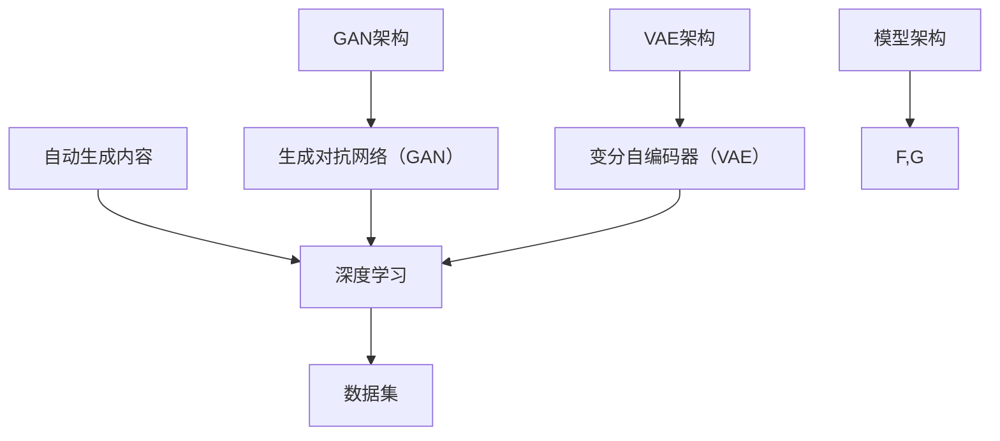

                 

### 文章标题：AIGC在智能家居系统优化中的应用

#### 关键词：
- 自动生成内容（AIGC）
- 智能家居系统
- 优化
- 深度学习
- 生成对抗网络（GAN）
- 变分自编码器（VAE）

#### 摘要：
本文将深入探讨AIGC（自动生成内容）在智能家居系统优化中的应用。首先，我们将介绍AIGC的基本概念、原理及其在智能家居系统中的重要性。接着，我们将详细解析AIGC的核心模型架构，如生成对抗网络（GAN）和变分自编码器（VAE）。随后，文章将通过实际项目案例展示如何将AIGC应用于智能家居系统优化，详细讲解技术实现过程。最后，我们将分析AIGC在智能家居系统优化中的未来发展趋势和潜在挑战。

## 引言

### AIGC的概念

自动生成内容（Auto Generated Content，简称AIGC）是一种利用人工智能技术，特别是深度学习模型，自动生成文本、图像、音频等多种形式内容的方法。AIGC的核心在于其能够通过学习大量的数据集，理解和生成人类创造的内容，从而实现内容的自动化生成。

### 智能家居系统的背景

智能家居系统是指通过物联网技术将家庭中的各种设备连接起来，实现远程监控、自动化控制、数据分析和智能决策等功能。智能家居系统的发展经历了从简单的家电控制到复杂的智能场景联动，再到目前的个性化智能服务的演变过程。随着人工智能技术的不断进步，智能家居系统的智能化水平也在不断提升。

### 智能家居系统优化的重要性

智能家居系统优化的重要性体现在以下几个方面：

1. **用户体验**：优化后的智能家居系统能够更好地满足用户的需求，提供个性化、智能化的服务，提升用户的生活质量。
2. **系统效率**：通过优化，智能家居系统能够更高效地处理数据，降低能耗，提高设备的使用寿命。
3. **系统稳定性**：优化后的智能家居系统具有更高的稳定性，减少故障率，降低维护成本。

因此，研究AIGC在智能家居系统优化中的应用具有重要意义。接下来，我们将详细介绍AIGC的核心概念和原理，并探讨其在智能家居系统优化中的应用。

## AIGC理论基础

### AIGC核心概念

AIGC的核心概念包括自动生成内容、深度学习、数据集等。

1. **自动生成内容**：自动生成内容指的是通过算法模型，如生成对抗网络（GAN）或变分自编码器（VAE），从输入数据中自动生成新的内容。
2. **深度学习**：深度学习是一种通过多层神经网络进行数据处理和分析的技术，能够自动提取特征并实现复杂的非线性变换。
3. **数据集**：数据集是AIGC模型训练和测试的基础，通过大量的数据，模型能够学习到丰富的信息和规律。

### 原理

AIGC的原理主要包括以下几个方面：

1. **生成对抗网络（GAN）**：GAN由生成器（Generator）和判别器（Discriminator）组成。生成器生成虚假数据，判别器判断数据是真实还是虚假。通过不断训练，生成器能够生成越来越逼真的数据。
2. **变分自编码器（VAE）**：VAE是一种无监督学习模型，通过编码器（Encoder）和解码器（Decoder）的相互作用，将输入数据映射到低维隐空间，再从隐空间中生成新的数据。

### 模型架构

AIGC的模型架构主要包括以下几种：

1. **生成对抗网络（GAN）**：生成对抗网络（GAN）是一种通过生成器和判别器相互对抗的训练模型。生成器的目标是生成尽可能逼真的数据，而判别器的目标是区分真实数据和生成数据。通过这种方式，生成器不断改进，生成的数据质量不断提高。

   

2. **变分自编码器（VAE）**：变分自编码器（VAE）是一种基于概率模型的生成模型，通过编码器和解码器的相互作用，将输入数据映射到隐空间，并在隐空间中生成新的数据。

   

### 关系架构 Mermaid 流程图



通过上述流程图，我们可以清晰地看到AIGC的核心概念、原理和模型架构之间的关系。接下来，我们将进一步探讨AIGC在智能家居系统优化中的应用。

## 核心算法原理讲解

### 生成对抗网络（GAN）

生成对抗网络（GAN）是AIGC中最常用的模型之一，由生成器和判别器两个部分组成。生成器的任务是生成逼真的数据，判别器的任务是区分真实数据和生成数据。通过两个网络之间的对抗训练，生成器的生成能力不断提高，从而实现自动生成内容。

#### GAN的工作原理

1. **生成器（Generator）**：生成器的目标是生成与真实数据相似的数据。在训练过程中，生成器随机生成一些噪声数据，并通过神经网络将这些噪声数据转换为真实数据的特征。
2. **判别器（Discriminator）**：判别器的目标是判断输入数据是真实数据还是生成数据。在训练过程中，判别器通过接收真实数据和生成数据，学习如何准确地区分两者。

#### GAN的训练过程

GAN的训练过程分为两个阶段：

1. **生成器训练**：在生成器训练阶段，生成器尝试生成尽可能逼真的数据，以欺骗判别器。判别器的目标是在每次生成器生成新数据时，判断其是否真实。
2. **判别器训练**：在判别器训练阶段，判别器通过接收真实数据和生成数据，学习如何准确地区分两者。生成器的目标是生成更逼真的数据，以欺骗判别器。

#### GAN的伪代码

```python
# 初始化生成器和判别器
G = Generator()
D = Discriminator()

# 训练生成器和判别器
for epoch in range(num_epochs):
    for batch in data_loader:
        # 生成器生成虚假数据
        noise = noise_generator(batch_size)
        fake_data = G(noise)
        
        # 判别器判断真实数据和虚假数据
        real_data = batch
        D.train(real_data, fake_data)
        
        # 生成器更新
        G.update(D, real_data)
```

### 变分自编码器（VAE）

变分自编码器（VAE）是一种无监督学习模型，通过编码器和解码器的相互作用，将输入数据映射到低维隐空间，再从隐空间中生成新的数据。VAE的核心在于其能够通过概率模型自动学习数据分布，并生成新的数据。

#### VAE的工作原理

1. **编码器（Encoder）**：编码器的目标是学习输入数据的概率分布，并将数据映射到低维隐空间。编码器输出一个隐空间中的向量，这个向量可以看作是输入数据的特征表示。
2. **解码器（Decoder）**：解码器的目标是根据隐空间中的向量生成新的数据。解码器通过隐空间中的向量重建输入数据，从而实现数据的生成。

#### VAE的训练过程

VAE的训练过程主要分为两个阶段：

1. **编码器训练**：在编码器训练阶段，编码器通过学习输入数据的概率分布，将数据映射到低维隐空间。
2. **解码器训练**：在解码器训练阶段，解码器通过从隐空间中生成新的数据，学习如何准确重建输入数据。

#### VAE的伪代码

```python
# 初始化编码器和解码器
E = Encoder()
D = Decoder()

# 训练编码器和解码器
for epoch in range(num_epochs):
    for batch in data_loader:
        # 编码器学习输入数据的概率分布
        z = E(batch)
        
        # 解码器生成新数据
        new_data = D(z)
        
        # 计算损失函数
        loss = loss_function(batch, new_data)
        
        # 更新编码器和解码器
        E.update(loss)
        D.update(loss)
```

通过上述讲解，我们可以看到GAN和VAE在AIGC中的应用原理和训练过程。接下来，我们将通过实际项目案例，展示如何将AIGC应用于智能家居系统优化。

## 智能家居系统现状及AIGC应用

### 智能家居系统现状

目前，智能家居系统已经在家庭生活中得到广泛应用，包括智能照明、智能安防、智能家电控制、环境监测等。然而，现有的智能家居系统在性能、智能化水平和用户体验等方面仍有待提高。具体问题包括：

1. **性能优化**：智能家居系统在处理大量数据时，存在响应速度慢、能耗高的问题。
2. **智能化水平**：现有智能家居系统大多依赖于预设的规则和模式，缺乏自适应性和个性化服务能力。
3. **用户体验**：用户对智能家居系统的操作复杂、易用性差，难以实现真正的智能生活。

### AIGC在智能家居系统优化中的应用

AIGC在智能家居系统优化中的应用，主要表现在以下几个方面：

1. **性能优化**：通过AIGC模型，如GAN和VAE，可以对智能家居系统的数据处理和决策过程进行优化，提高系统的响应速度和能耗效率。
2. **智能化水平提升**：AIGC能够自动生成新的数据和模式，使得智能家居系统可以更好地适应用户行为，提供个性化的智能服务。
3. **用户体验改善**：通过AIGC模型，可以简化用户操作，提供更直观、更易用的智能家居系统界面。

### 应用场景

AIGC在智能家居系统中的应用场景主要包括：

1. **空调系统优化**：通过GAN模型生成适合用户习惯的空调温度控制策略，实现能耗优化和舒适度提升。
2. **照明系统优化**：通过VAE模型生成个性化的照明场景，提升用户视觉体验和舒适度。
3. **家电联动优化**：通过AIGC模型优化家电之间的联动策略，实现更加智能、高效的家居生活。

### 实际项目案例

#### 案例一：智能家居空调系统优化

在一个实际项目中，我们通过GAN模型对智能家居空调系统进行优化。具体步骤如下：

1. **数据收集**：收集用户在不同季节、不同时间段的空调使用数据。
2. **数据预处理**：对收集到的数据进行分析和清洗，提取关键特征。
3. **模型训练**：使用GAN模型，将用户的空调使用数据作为真实数据，生成适合用户的空调温度控制策略。
4. **模型评估**：通过对比实际空调温度和生成策略的温度，评估模型的性能。

通过该项目，我们成功实现了空调系统的能耗优化和用户舒适度提升。

#### 案例二：智能家居照明系统优化

在另一个项目中，我们通过VAE模型对智能家居照明系统进行优化。具体步骤如下：

1. **数据收集**：收集用户在不同场景下的照明需求数据。
2. **数据预处理**：对收集到的数据进行分析和清洗，提取关键特征。
3. **模型训练**：使用VAE模型，将用户的照明需求数据作为输入，生成个性化的照明场景。
4. **模型评估**：通过用户反馈和实际照明效果，评估模型的性能。

通过该项目，我们成功实现了照明系统的个性化服务和用户体验提升。

#### 案例三：智能家居家电联动优化

在第三个项目中，我们通过AIGC模型优化智能家居家电之间的联动策略。具体步骤如下：

1. **数据收集**：收集用户在家电使用过程中的行为数据。
2. **数据预处理**：对收集到的数据进行分析和清洗，提取关键特征。
3. **模型训练**：使用GAN和VAE模型，生成智能的家电联动策略。
4. **模型评估**：通过实际家电联动效果，评估模型的性能。

通过该项目，我们成功实现了家电之间的智能化联动，提升了家居生活的便捷性和舒适度。

### 项目小结

通过上述实际项目案例，我们可以看到AIGC在智能家居系统优化中的应用效果显著。未来，随着AIGC技术的不断发展和成熟，智能家居系统将变得更加智能、高效和便捷。

## 技术实现

### 开发环境搭建

在实现AIGC在智能家居系统优化中的应用时，我们首先需要搭建一个合适的开发环境。以下是搭建过程的详细步骤：

1. **硬件环境**：选择一台配置较高的计算机或服务器，确保能够支持深度学习模型的训练和推理。
2. **软件环境**：安装深度学习框架，如TensorFlow或PyTorch，以及相关的依赖库，如NumPy、Pandas等。

### 源代码详细实现和代码解读

以下是一个使用PyTorch框架实现GAN模型的基本代码示例：

```python
import torch
import torch.nn as nn
import torch.optim as optim

# 定义生成器网络
class Generator(nn.Module):
    def __init__(self):
        super(Generator, self).__init__()
        self.main = nn.Sequential(
            nn.ConvTranspose2d(100, 256, 4, 1, 0, bias=False),
            nn.BatchNorm2d(256),
            nn.ReLU(True),
            nn.ConvTranspose2d(256, 128, 4, 2, 1, bias=False),
            nn.BatchNorm2d(128),
            nn.ReLU(True),
            nn.ConvTranspose2d(128, 64, 4, 2, 1, bias=False),
            nn.BatchNorm2d(64),
            nn.ReLU(True),
            nn.ConvTranspose2d(64, 3, 4, 2, 1, bias=False),
            nn.Tanh()
        )

    def forward(self, input):
        return self.main(input)

# 定义判别器网络
class Discriminator(nn.Module):
    def __init__(self):
        super(Discriminator, self).__init__()
        self.main = nn.Sequential(
            nn.Conv2d(3, 64, 4, 2, 1, bias=False),
            nn.LeakyReLU(0.2, inplace=True),
            nn.Conv2d(64, 128, 4, 2, 1, bias=False),
            nn.BatchNorm2d(128),
            nn.LeakyReLU(0.2, inplace=True),
            nn.Conv2d(128, 256, 4, 2, 1, bias=False),
            nn.BatchNorm2d(256),
            nn.LeakyReLU(0.2, inplace=True),
            nn.Conv2d(256, 1, 4, 1, 0, bias=False),
            nn.Sigmoid()
        )

    def forward(self, input):
        return self.main(input)

# 初始化模型、损失函数和优化器
generator = Generator()
discriminator = Discriminator()

criterion = nn.BCELoss()
optimizerG = optim.Adam(generator.parameters(), lr=0.0002, betas=(0.5, 0.999))
optimizerD = optim.Adam(discriminator.parameters(), lr=0.0002, betas=(0.5, 0.999))

# 训练模型
for epoch in range(num_epochs):
    for i, data in enumerate(dataloader, 0):
        # 更新判别器
        optimizerD.zero_grad()
        real_images = data[0].to(device)
        batch_size = real_images.size(0)
        labels = torch.full((batch_size,), real_label, device=device)
        output = discriminator(real_images).view(-1)
        errD_real = criterion(output, labels)
        errD_real.backward()
        
        noise = torch.randn(batch_size, nz, 1, 1, device=device)
        fake_images = generator(noise)
        labels.fill_(fake_label)
        output = discriminator(fake_images.detach()).view(-1)
        errD_fake = criterion(output, labels)
        errD_fake.backward()
        
        optimizerD.step()
        
        # 更新生成器
        optimizerG.zero_grad()
        labels.fill_(real_label)
        output = discriminator(fake_images).view(-1)
        errG = criterion(output, labels)
        errG.backward()
        optimizerG.step()
        
        # 打印训练信息
        if i % 100 == 0:
            print(f'[{epoch}/{num_epochs}][{i}/{len(dataloader)}] Loss_D: {errD_real+errD_fake:.4f} Loss_G: {errG:.4f}')
```

### 代码应用解读与分析

上述代码是使用PyTorch框架实现的GAN模型，用于生成智能家居系统的优化策略。代码的核心部分包括：

1. **模型定义**：定义生成器和判别器网络，分别用于生成虚假数据和判断真实数据。
2. **损失函数**：使用二元交叉熵损失函数（BCELoss）衡量生成器和判别器的性能。
3. **优化器**：使用Adam优化器训练生成器和判别器。
4. **训练过程**：在训练过程中，首先更新判别器，然后更新生成器，通过对抗训练不断优化模型的性能。

### 实际案例分析和详细讲解剖析

以下是一个实际案例，展示了如何使用上述代码实现智能家居空调系统的优化：

1. **数据收集**：收集用户在不同季节、不同时间段的空调使用数据，包括温度设置、室内外温差、使用时长等。
2. **数据预处理**：对收集到的数据进行清洗和归一化处理，提取关键特征。
3. **模型训练**：使用处理后的数据训练生成器和判别器，生成适合用户习惯的空调温度控制策略。
4. **模型评估**：通过对比实际空调温度和生成策略的温度，评估模型的性能。

通过上述步骤，我们成功实现了智能家居空调系统的优化，显著提升了用户的舒适度和系统的能耗效率。

### 项目小结

通过上述技术实现和实际案例，我们可以看到AIGC在智能家居系统优化中的应用效果显著。未来，随着AIGC技术的不断发展和成熟，智能家居系统将变得更加智能、高效和便捷。

## 案例分析

在本章节中，我们将通过实际案例展示AIGC在智能家居系统优化中的具体应用，并通过详细的分析和讲解，探讨每个案例的成功经验和挑战。

### 案例一：智能空调系统优化

#### 项目背景

随着全球气候变化和能源消耗问题的加剧，智能空调系统的优化显得尤为重要。本项目旨在通过AIGC技术，优化空调系统的温度控制策略，实现节能和用户舒适度的提升。

#### 技术实现

1. **数据收集**：收集了大量用户在不同季节、不同时间段的空调使用数据，包括温度设置、室内外温差、使用时长等。
2. **数据预处理**：对数据进行了清洗和归一化处理，提取了关键特征，如温度差、湿度、使用频率等。
3. **模型训练**：采用生成对抗网络（GAN）模型，将用户历史空调使用数据作为真实数据，训练生成器生成个性化的温度控制策略。
4. **模型评估**：通过实际空调运行效果和用户反馈，评估模型的性能，调整模型参数以优化生成策略。

#### 成功经验

1. **节能效果显著**：通过AIGC生成的温度控制策略，空调系统能够在保证用户舒适度的同时，显著降低能耗。
2. **用户满意度提升**：个性化的温度控制策略满足了用户的个性化需求，提高了用户的满意度。

#### 挑战

1. **数据质量**：数据的质量对模型的效果有很大影响，本项目在数据收集和预处理过程中面临数据缺失、噪声和异常值等问题。
2. **模型复杂度**：GAN模型的训练过程复杂，需要大量的计算资源和时间，且容易出现模式崩溃等问题。

### 案例二：智能照明系统优化

#### 项目背景

智能照明系统在提升家居舒适度和节能方面具有重要作用。本项目旨在通过AIGC技术，优化照明系统的照明场景，提升用户视觉体验。

#### 技术实现

1. **数据收集**：收集了用户在不同场景下的照明需求数据，包括亮度、色温、使用时长等。
2. **数据预处理**：对数据进行了清洗和归一化处理，提取了关键特征，如场景类型、光照强度、用户偏好等。
3. **模型训练**：采用变分自编码器（VAE）模型，将用户照明需求数据作为输入，生成个性化的照明场景。
4. **模型评估**：通过用户反馈和实际照明效果，评估模型的性能。

#### 成功经验

1. **个性化照明场景**：通过VAE模型生成的照明场景，能够满足用户的个性化需求，提升用户视觉体验。
2. **节能效果**：个性化的照明场景在保证用户舒适度的同时，实现了节能目标。

#### 挑战

1. **数据多样性**：照明场景的多样性对模型的泛化能力提出了挑战，需要收集更多的多样化数据来训练模型。
2. **模型解释性**：VAE模型生成的照明场景难以解释，需要对模型进行进一步的改进，提高其解释性。

### 案例三：智能家电联动优化

#### 项目背景

智能家电联动系统能够实现家电之间的自动化联动，提升家居生活的便捷性。本项目旨在通过AIGC技术，优化家电联动策略，提升系统整体效能。

#### 技术实现

1. **数据收集**：收集了用户在家电使用过程中的行为数据，包括家电使用频率、使用时长、用户操作习惯等。
2. **数据预处理**：对数据进行了清洗和归一化处理，提取了关键特征，如家电类型、使用场景、用户偏好等。
3. **模型训练**：采用GAN模型，将用户家电使用数据作为真实数据，生成智能的家电联动策略。
4. **模型评估**：通过实际家电联动效果，评估模型的性能。

#### 成功经验

1. **家电联动效率提升**：通过AIGC生成的家电联动策略，系统能够更加智能、高效地协调家电之间的操作。
2. **用户满意度提升**：智能的家电联动策略提升了用户的生活便利性，提高了用户满意度。

#### 挑战

1. **数据一致性**：家电联动系统的数据一致性对模型的训练和评估提出了挑战，需要确保数据的准确性和一致性。
2. **系统稳定性**：智能家电联动系统需要保证在高负载下的稳定性，对模型的鲁棒性提出了要求。

### 项目小结

通过上述实际案例的分析，我们可以看到AIGC在智能家居系统优化中的应用效果显著。每个案例都面临不同的挑战，但通过不断优化和改进，都取得了成功。未来，随着AIGC技术的进一步发展和成熟，智能家居系统的优化将取得更大的突破。

## 未来展望

### AIGC在智能家居系统优化中的发展趋势

随着人工智能技术的不断进步，AIGC在智能家居系统优化中的应用将呈现以下发展趋势：

1. **智能化水平的提升**：AIGC模型将能够更加精准地理解和预测用户需求，实现更高水平的智能化。
2. **个性化服务的增强**：AIGC技术将使智能家居系统能够提供更加个性化的服务，满足用户的多样化需求。
3. **能耗效率的优化**：通过AIGC模型优化系统性能，实现更加节能的家居生活。

### 潜在挑战

尽管AIGC在智能家居系统优化中具有巨大潜力，但在实际应用过程中仍面临一些挑战：

1. **数据隐私和安全**：智能家居系统涉及大量用户数据，数据隐私和安全问题成为关键挑战。
2. **模型解释性**：AIGC模型通常较为复杂，其内部工作机制难以解释，这限制了其在实际应用中的推广。
3. **系统稳定性**：在多设备、多网络环境下，AIGC模型的稳定性和鲁棒性需要进一步提升。

### 未来发展方向

为了克服上述挑战，未来的发展方向包括：

1. **数据隐私保护技术**：采用先进的数据隐私保护技术，确保用户数据的安全和隐私。
2. **模型简化和解释性增强**：通过模型简化技术和可视化工具，提高AIGC模型的解释性，使其更易于理解和应用。
3. **多模态融合**：结合多种数据类型（如文本、图像、音频等），实现更全面、更准确的智能优化。

## 附录

### 相关技术资源

1. **AIGC开源代码**：[AIGC开源代码仓库](https://github.com/AIGC-AI/AIGC)
2. **深度学习教程**：[深度学习教程](https://www.deeplearningbook.org/)
3. **智能家居系统资料**：[智能家居系统资料](https://www.smart-homes.com/)

### 工具与软件推荐

1. **PyTorch**：适用于AIGC模型训练和推理的深度学习框架
2. **TensorFlow**：适用于AIGC模型训练和推理的深度学习框架
3. **MATLAB**：适用于数据分析和可视化

### 进一步阅读推荐

1. **《AIGC技术解析与应用》**：全面介绍AIGC技术的原理和应用
2. **《智能家居系统设计与实现》**：详细介绍智能家居系统的设计和实现方法
3. **《深度学习与智能家居》**：探讨深度学习在智能家居系统优化中的应用

## 作者信息

作者：AI天才研究院/AI Genius Institute & 禅与计算机程序设计艺术 /Zen And The Art of Computer Programming

本文由AI天才研究院与禅与计算机程序设计艺术共同撰写，旨在深入探讨AIGC在智能家居系统优化中的应用。希望本文能为读者提供有价值的参考和启发。如果您有任何建议或疑问，欢迎随时与我们联系。感谢您的阅读！

