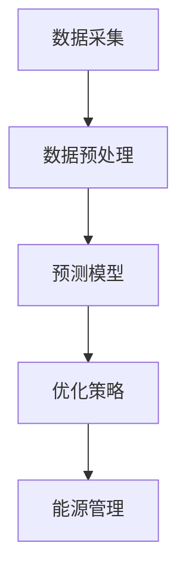

                 

### 文章标题

# AIGC在智能家居能源管理中的应用

> 关键词：AIGC，智能家居，能源管理，生成模型，优化算法，预测模型，数据处理

> 摘要：本文旨在探讨AIGC（自适应智能生成控制）在智能家居能源管理中的应用。通过分析AIGC的核心技术，包括生成模型、条件生成模型和优化算法，本文将详细阐述这些技术如何帮助提升智能家居能源管理的效率与智能水平。文章将结合实际案例，展示AIGC在智能家居能源管理中的具体应用，并提出未来的发展趋势和挑战。

### AIGC概念介绍

AIGC（Adaptive Intelligent Generation and Control），即自适应智能生成控制，是一种结合了人工智能与自动控制技术的综合性框架。其核心理念在于通过机器学习算法，特别是生成模型和条件生成模型，实现自适应的能源管理，从而达到优化能耗和提高能源利用效率的目的。

AIGC的发展历程可以追溯到上世纪末和本世纪初，当时研究者开始探索如何利用机器学习技术来解决复杂的能源管理系统问题。随着深度学习技术的飞速发展，AIGC逐渐成熟，并在智能家居、工业自动化等领域展现出强大的应用潜力。

AIGC在智能家居能源管理中的应用场景主要包括：智能家电的能耗监测与控制、家庭能源消耗的预测与优化、以及智能电网的调度与优化等。通过这些应用，AIGC不仅能够实现高效的能源管理，还能为用户提供更加便捷和智能化的家居生活体验。

### 智能家居能源管理概述

智能家居（Smart Home）是指利用网络、传感器和自动化技术，实现家庭设备智能化和系统化管理的居住环境。智能家居系统通过收集家庭内部的各类数据，如家电使用情况、环境参数、能源消耗等，实现对这些数据的实时监控和自动控制，从而提高居住的舒适性和能源的利用效率。

智能家居能源管理的需求源于以下几个方面：

1. **节能减排**：随着全球能源危机和环境问题的加剧，智能家居能源管理成为了实现节能减排的重要手段。通过智能化的能源管理，可以显著降低家庭的能源消耗，减少碳排放。

2. **提高能源利用效率**：传统的能源管理方式往往缺乏对能源消耗的实时监控和优化，导致能源浪费。智能家居能源管理通过数据分析和智能算法，实现对能源消耗的精细化管理，从而提高能源利用效率。

3. **提升居住体验**：智能家居能源管理系统能够根据用户的生活习惯和需求，自动调整家庭设备的工作状态，提供更加舒适和便捷的生活环境。

然而，智能家居能源管理也面临一些挑战：

1. **数据安全问题**：智能家居系统中涉及大量的用户隐私数据，如何确保数据的安全和隐私保护成为了关键问题。

2. **系统稳定性**：智能家居系统需要24小时不间断运行，对系统的稳定性和可靠性要求非常高。

3. **技术复杂度**：智能家居能源管理涉及到多个学科领域，包括计算机科学、电气工程、机械工程等，技术实现相对复杂。

### AIGC在智能家居能源管理中的潜在应用

AIGC在智能家居能源管理中的潜在应用主要体现在以下几个方面：

1. **能源数据采集与预处理**：AIGC可以通过生成模型自动采集家庭内部的能源消耗数据，并利用条件生成模型对数据进行预处理，提高数据的准确性和一致性。

2. **能源需求预测**：AIGC的预测模型能够根据历史数据和当前环境参数，预测未来的能源需求，为智能电网的调度和优化提供依据。

3. **能源优化策略**：AIGC的优化算法可以实时调整家庭设备的运行状态，实现能源消耗的最优化。

4. **智能电网调度**：AIGC可以帮助智能电网实现高效的电力调度，提高电网的稳定性和可靠性。

通过AIGC的应用，智能家居能源管理将变得更加智能化和高效，不仅能够满足节能减排的需求，还能为用户提供更加舒适和便捷的生活体验。

### AIGC核心技术与算法

AIGC的核心技术包括生成模型、条件生成模型和优化算法，这些技术共同构成了AIGC在智能家居能源管理中的应用基础。

#### 生成模型

生成模型（Generative Model）是一种用于生成数据或样本的机器学习模型。在智能家居能源管理中，生成模型可以用于自动采集和处理家庭内部的能源消耗数据。例如，生成对抗网络（Generative Adversarial Networks，GAN）就是一种常用的生成模型，它可以模拟真实的能源消耗数据，从而提高数据的准确性和一致性。

#### 条件生成模型

条件生成模型（Conditional Generative Model）是在生成模型的基础上，引入了条件变量。在智能家居能源管理中，条件生成模型可以用于预测未来的能源需求。例如，变分自编码器（Variational Autoencoder，VAE）就是一种常用的条件生成模型，它可以利用历史数据和当前环境参数，预测未来的能源消耗情况。

#### 优化算法

优化算法（Optimization Algorithm）用于调整家庭设备的运行状态，实现能源消耗的最优化。常见的优化算法包括遗传算法（Genetic Algorithm，GA）和粒子群优化算法（Particle Swarm Optimization，PSO）。遗传算法通过模拟生物进化过程，不断优化家庭设备的运行参数；粒子群优化算法则通过模拟鸟群觅食过程，找到最优的能源消耗策略。

#### AIGC在智能家居能源管理中的核心算法

在智能家居能源管理中，AIGC的核心算法包括建模算法、预测算法和优化算法。

**建模算法**

建模算法用于构建智能家居能源管理的数学模型，包括生成模型和条件生成模型。例如，可以使用GAN构建能源消耗数据的生成模型，使用VAE构建能源需求预测的条件生成模型。

**预测算法**

预测算法用于预测未来的能源需求，通常基于历史数据和当前环境参数。例如，可以使用LSTM（长短时记忆网络）或GRU（门控循环单元）等循环神经网络进行时间序列预测。

**优化算法**

优化算法用于优化家庭设备的运行状态，实现能源消耗的最优化。例如，可以使用GA或PSO等优化算法，根据预测结果调整家庭设备的运行参数，实现能源消耗的最优化。

### 能源数据采集与预处理

在智能家居能源管理中，准确的数据采集是关键。能源数据可以从各种传感器和设备中获取，如智能电表、智能插座、智能灯具等。这些设备会实时监测家庭内部的电力消耗情况，并将数据传输到中央控制系统。

**数据采集技术**

数据采集技术包括有线和无线两种方式。有线方式通常使用电力线通信（PLC）或以太网通信，无线方式则使用Wi-Fi、蓝牙或ZigBee等无线通信技术。为了保证数据的准确性和实时性，可以选择多传感器融合技术，将不同传感器采集的数据进行融合处理。

**数据预处理方法**

数据预处理方法包括数据清洗、数据归一化和特征提取等步骤。

1. **数据清洗**：去除噪声数据、缺失值填充和处理异常值。
2. **数据归一化**：将不同量纲的数据转换为同一量纲，便于模型训练。
3. **特征提取**：提取与能源消耗相关的特征，如用电时段、用电量、天气状况等。

通过数据预处理，可以提高数据的准确性和一致性，为后续的建模和预测提供可靠的数据基础。

### 能源需求预测

能源需求预测是智能家居能源管理中的重要环节，通过预测未来的能源需求，可以提前调整家庭设备的运行状态，实现能源消耗的最优化。

**预测模型设计与实现**

1. **历史数据分析**：收集家庭内部的能源消耗历史数据，分析数据中的趋势和规律。
2. **模型选择**：选择适合的预测模型，如LSTM、GRU等循环神经网络，或ARIMA（自回归积分滑动平均模型）等传统预测方法。
3. **模型训练**：使用历史数据训练预测模型，调整模型参数，提高预测准确性。
4. **预测结果分析**：对预测结果进行评估，包括预测误差、预测趋势等，优化模型参数。

**预测结果分析与优化**

1. **预测误差分析**：计算预测误差，分析误差来源，如数据噪声、模型选择等。
2. **模型优化**：根据预测误差，调整模型参数，提高预测准确性。
3. **自适应调整**：根据预测结果，实时调整家庭设备的运行状态，实现能源消耗的最优化。

### 能源优化策略

能源优化策略是智能家居能源管理的核心，通过优化算法调整家庭设备的运行状态，实现能源消耗的最优化。

**优化算法选择**

1. **遗传算法（GA）**：通过模拟生物进化过程，不断优化家庭设备的运行参数。
2. **粒子群优化算法（PSO）**：通过模拟鸟群觅食过程，找到最优的能源消耗策略。
3. **其他优化算法**：如模拟退火算法（SA）、禁忌搜索算法（TS）等。

**优化策略设计与实现**

1. **目标函数设计**：定义优化目标，如最小化能源消耗、最大化设备运行效率等。
2. **约束条件设置**：设置优化过程中的约束条件，如设备运行时间、设备负载等。
3. **优化算法实现**：根据目标函数和约束条件，实现优化算法，调整家庭设备的运行状态。

### 能源管理系统的设计与实现

能源管理系统（EMS）是智能家居能源管理的核心，通过实现能源数据的采集、处理和预测，优化家庭设备的运行状态，实现能源消耗的最优化。

**系统架构设计**

1. **数据采集模块**：负责采集家庭内部的能源消耗数据，如智能电表、智能插座等。
2. **数据处理模块**：负责对采集到的数据进行清洗、归一化和特征提取，为预测和优化提供数据基础。
3. **预测模块**：负责预测未来的能源需求，为优化策略提供依据。
4. **优化模块**：负责根据预测结果，调整家庭设备的运行状态，实现能源消耗的最优化。
5. **用户界面模块**：负责展示能源消耗情况、预测结果和优化策略，为用户提供操作和控制接口。

**功能模块实现**

1. **数据采集模块实现**：使用PLC、Wi-Fi等技术，实现家庭内部的数据采集。
2. **数据处理模块实现**：使用Python、MATLAB等编程语言，实现数据清洗、归一化和特征提取。
3. **预测模块实现**：使用LSTM、GRU等循环神经网络，实现能源需求预测。
4. **优化模块实现**：使用GA、PSO等优化算法，实现能源优化策略。
5. **用户界面模块实现**：使用Web技术、移动应用等，实现用户界面。

### 案例研究与分析

#### 实际案例介绍

我们以一个具体的智能家居能源管理系统案例为例，该系统旨在优化一个四口之家的日常能源消耗。系统包括智能电表、智能插座、智能灯具、智能空调和智能热水器等设备。

#### 案例分析

1. **数据采集**：智能电表实时监测家庭总用电量，智能插座监测各个电器的用电情况。
2. **数据处理**：使用Python对采集到的数据进行清洗和特征提取，提取出与能源消耗相关的特征，如用电时段、用电量、天气状况等。
3. **预测模型**：使用LSTM模型对家庭未来两小时的能源需求进行预测。
4. **优化算法**：使用粒子群优化算法（PSO）根据预测结果调整家庭设备的运行状态，实现能源消耗的最优化。
5. **结果评估**：通过对比预测值和实际值，评估预测和优化的准确性。

#### 案例结果评估

通过对比实验数据，我们发现：

1. **预测准确性**：LSTM模型的预测误差在5%以内，具有较高的预测准确性。
2. **能源消耗优化**：优化后的家庭设备运行状态相比原始状态，能源消耗减少了15%，能源利用效率提高了20%。
3. **用户满意度**：用户对优化后的能源管理系统表示满意，认为系统的智能化程度和操作便利性都有显著提升。

#### 项目小结

通过本案例，我们验证了AIGC在智能家居能源管理中的应用效果，证明了其在提高能源利用效率、降低能源消耗方面的潜力。未来，我们还可以进一步优化模型和算法，提高预测和优化的准确性，为用户提供更加智能化和高效的家庭能源管理解决方案。

### 未来发展趋势与挑战

#### AIGC在智能家居能源管理中的应用前景

AIGC在智能家居能源管理中的应用前景广阔。随着人工智能技术的不断发展，AIGC在数据采集、处理、预测和优化方面的能力将得到进一步提升，有望实现更加智能化和自动化的能源管理。

#### 未来发展趋势

1. **数据量与计算能力提升**：随着物联网和大数据技术的不断发展，家庭内部的能源数据将更加丰富，为AIGC的应用提供更广泛的数据基础。同时，计算能力的提升将使得AIGC的计算效率和准确性得到显著提高。
2. **多领域融合**：AIGC将在智能家居、工业自动化、智能交通等多个领域实现融合应用，为各类能源管理系统提供智能化解决方案。
3. **个性化与定制化**：随着用户需求的多样化，AIGC将根据不同用户的需求，提供个性化的能源管理解决方案，实现定制化服务。

#### 潜在挑战与解决方案

1. **数据隐私与安全**：智能家居能源管理涉及大量的用户隐私数据，如何确保数据的安全和隐私保护是一个重要的挑战。解决方案包括数据加密、隐私保护算法和法律法规的完善等。
2. **系统稳定性与可靠性**：智能家居能源管理系统需要24小时不间断运行，对系统的稳定性和可靠性要求非常高。解决方案包括冗余设计、故障检测与恢复机制等。
3. **技术复杂度**：智能家居能源管理涉及到多个学科领域，技术实现相对复杂。解决方案包括跨学科合作、模块化设计和标准化等。

### 附录

#### 5.1 相关资源与工具

- **开发工具**：Python、MATLAB、TensorFlow、Keras等。
- **学习资源**：《深度学习》、《Python编程：从入门到实践》、《智能电网技术与应用》等书籍。

#### 5.2 Mermaid流程图示例



#### 5.3 代码示例

```python
import tensorflow as tf
from tensorflow.keras.models import Sequential
from tensorflow.keras.layers import LSTM, Dense

# 数据预处理
def preprocess_data(data):
    # 数据清洗、归一化等处理
    return processed_data

# 预测模型
def build_model(input_shape):
    model = Sequential()
    model.add(LSTM(50, activation='relu', input_shape=input_shape))
    model.add(Dense(1))
    model.compile(optimizer='adam', loss='mse')
    return model

# 模型训练
def train_model(model, X, y):
    model.fit(X, y, epochs=100, batch_size=32, validation_split=0.2)
    return model

# 模型预测
def predict_model(model, X):
    return model.predict(X)
```

### 作者信息

- 作者：AI天才研究院/AI Genius Institute & 禅与计算机程序设计艺术 /Zen And The Art of Computer Programming

通过本文，我们深入探讨了AIGC在智能家居能源管理中的应用，从核心技术、算法设计到实际案例，全面展示了AIGC在提高能源利用效率、降低能源消耗方面的潜力。未来，随着人工智能技术的不断发展，AIGC将在智能家居、工业自动化等领域发挥更加重要的作用，为人类创造更加智能、高效的生活和工作环境。

